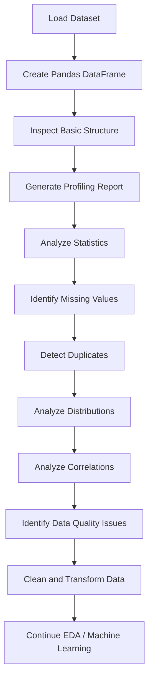
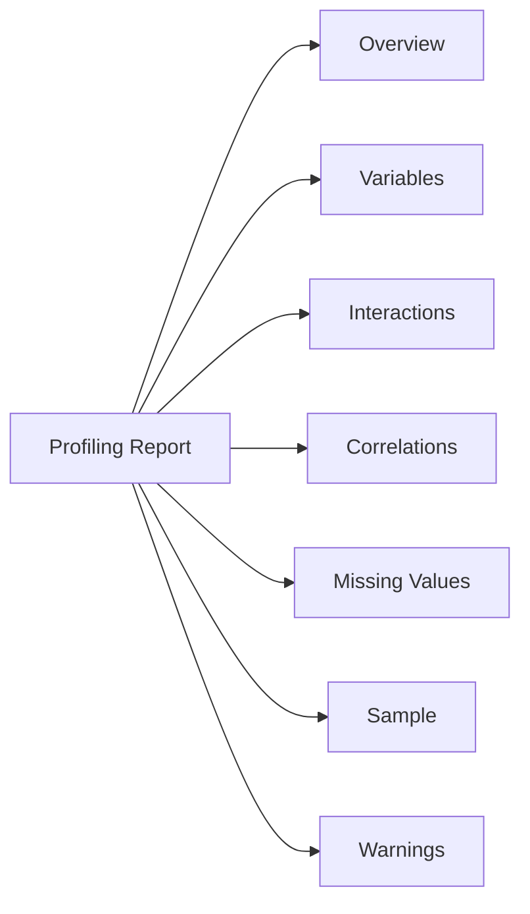
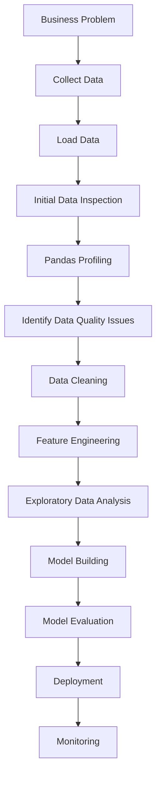
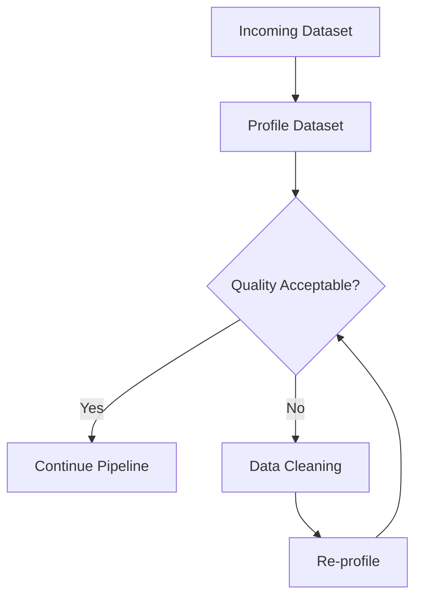
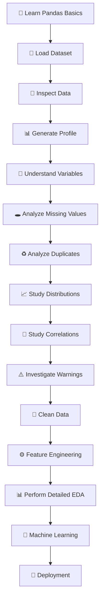

# 📊 Pandas Profiling — Complete Learning Notes

> **Pandas Profiling** is a powerful technique for automatically generating a detailed exploratory data analysis (EDA) report from a Pandas DataFrame. In modern Python projects, the library commonly used for this purpose is **YData Profiling**, formerly known as **Pandas Profiling**.

---

## 📚 Table of Contents

1. [Introduction](#1--introduction)
2. [What is Pandas Profiling?](#2--what-is-pandas-profiling)
3. [Why Pandas Profiling is Important](#3--why-pandas-profiling-is-important)
4. [Pandas Profiling vs Manual EDA](#4--pandas-profiling-vs-manual-eda)
5. [Installation and Setup](#5--installation-and-setup)
6. [Basic Workflow](#6--basic-workflow)
7. [Creating a Profiling Report](#7--creating-a-profiling-report)
8. [Understanding the Generated Report](#8--understanding-the-generated-report)
9. [Dataset Overview](#9--dataset-overview)
10. [Variable Analysis](#10--variable-analysis)
11. [Data Types](#11--data-types)
12. [Missing Values Analysis](#12--missing-values-analysis)
13. [Duplicate Records](#13--duplicate-records)
14. [Unique Values and Cardinality](#14--unique-values-and-cardinality)
15. [Descriptive Statistics](#15--descriptive-statistics)
16. [Distribution Analysis](#16--distribution-analysis)
17. [Correlation Analysis](#17--correlation-analysis)
18. [Interactions and Relationships](#18--interactions-and-relationships)
19. [Warnings and Alerts](#19--warnings-and-alerts)
20. [Practical Code Examples](#20--practical-code-examples)
21. [Profiling Configuration](#21--profiling-configuration)
22. [Exporting Reports](#22--exporting-reports)
23. [Profiling Large Datasets](#23--profiling-large-datasets)
24. [Pandas Profiling in a Data Science Workflow](#24--pandas-profiling-in-a-data-science-workflow)
25. [Real-World Use Cases](#25--real-world-use-cases)
26. [Advantages](#26--advantages)
27. [Limitations](#27--limitations)
28. [Common Mistakes](#28--common-mistakes)
29. [Best Practices](#29--best-practices)
30. [Advanced Concepts](#30--advanced-concepts)
31. [Mini Project](#31--mini-project)
32. [Interview Questions and Points](#32--interview-questions-and-points)
33. [Pandas Profiling vs Other EDA Tools](#33--pandas-profiling-vs-other-eda-tools)
34. [Quick Revision](#34--quick-revision)
35. [Visual Learning Roadmap](#35--visual-learning-roadmap)

---

# 1. 🚀 Introduction

Data analysis begins with understanding the data.

Before building a machine learning model, creating dashboards, or performing statistical analysis, a data scientist needs to answer questions such as:

* How many rows and columns are present?
* What are the data types?
* Are there missing values?
* Are there duplicate records?
* Which columns contain outliers?
* What is the distribution of numerical variables?
* Which variables are correlated?
* Are there suspicious or highly unique values?
* Which columns may require preprocessing?

Performing all these checks manually can require a significant amount of code.

**Pandas Profiling** automates much of this initial exploratory analysis.

Today, the project is commonly known as:

> **YData Profiling**

It works with Pandas DataFrames and automatically produces an interactive HTML report containing statistical information, distributions, correlations, missing-value analysis, warnings, and other useful insights.

---

# 2. 📖 What is Pandas Profiling?

Pandas Profiling is an automated **Exploratory Data Analysis (EDA)** technique.

Given a Pandas DataFrame:

```text
DataFrame
    ↓
Profiling Engine
    ↓
Statistical Analysis
    ↓
Data Quality Checks
    ↓
Visualization
    ↓
Interactive EDA Report
```

The modern package is installed using:

```bash
pip install ydata-profiling
```

and imported as:

```python
from ydata_profiling import ProfileReport
```

### Simple Example

```python
import pandas as pd
from ydata_profiling import ProfileReport

df = pd.read_csv("data.csv")

profile = ProfileReport(df, title="Dataset Profiling Report")

profile.to_file("report.html")
```

The resulting HTML file can be opened in a browser.

---

# 3. 🎯 Why Pandas Profiling is Important

Manual EDA usually requires many separate commands.

For example:

```python
df.shape
df.info()
df.describe()
df.isnull().sum()
df.nunique()
df.duplicated().sum()
df.corr(numeric_only=True)
```

Pandas Profiling combines many of these analyses into one report.

### Main Objectives

| Objective                       | Profiling Helps With |
| ------------------------------- | -------------------- |
| Dataset understanding           | ✅                    |
| Missing-value detection         | ✅                    |
| Duplicate detection             | ✅                    |
| Statistical summaries           | ✅                    |
| Distribution analysis           | ✅                    |
| Correlation analysis            | ✅                    |
| Data-type inspection            | ✅                    |
| Cardinality analysis            | ✅                    |
| Outlier detection               | ✅                    |
| Initial data-quality assessment | ✅                    |

---

# 4. ⚖️ Pandas Profiling vs Manual EDA

| Feature              | Manual EDA     | Pandas Profiling |
| -------------------- | -------------- | ---------------- |
| Dataset shape        | Manual         | Automatic        |
| Data types           | Manual         | Automatic        |
| Statistics           | Manual         | Automatic        |
| Missing values       | Manual         | Automatic        |
| Duplicate detection  | Manual         | Automatic        |
| Correlation          | Manual         | Automatic        |
| Visualizations       | Manual         | Automatic        |
| Report generation    | Manual         | Automatic        |
| Custom analysis      | Excellent      | Limited          |
| Deep domain analysis | Excellent      | Limited          |
| Initial exploration  | Time-consuming | Fast             |

### Key Idea

Pandas Profiling **does not replace EDA**.

Instead:

> It accelerates the first stage of EDA.

---

# 5. 🛠️ Installation and Setup

## 5.1 Install Pandas

```bash
pip install pandas
```

## 5.2 Install YData Profiling

```bash
pip install ydata-profiling
```

## 5.3 Install Jupyter Notebook

```bash
pip install notebook
```

## 5.4 Verify Installation

```python
import pandas as pd
import ydata_profiling

print(pd.__version__)
print(ydata_profiling.__version__)
```

---

# 6. 🔄 Basic Workflow

A typical Pandas Profiling workflow looks like this:



### Typical Process

```python
import pandas as pd
from ydata_profiling import ProfileReport

# 1. Load data
df = pd.read_csv("customers.csv")

# 2. Create profile
profile = ProfileReport(
    df,
    title="Customer Dataset Report"
)

# 3. Export report
profile.to_file("customer_report.html")
```

---

# 7. 📄 Creating a Profiling Report

## 7.1 Basic Report

```python
from ydata_profiling import ProfileReport

profile = ProfileReport(df)

profile.to_file("profile.html")
```

---

## 7.2 Add a Report Title

```python
profile = ProfileReport(
    df,
    title="Sales Dataset Profiling Report"
)
```

---

## 7.3 Display Inside Jupyter

```python
profile.to_notebook_iframe()
```

This allows the report to appear directly inside a Jupyter Notebook.

---

# 8. 🔍 Understanding the Generated Report

A typical profiling report contains several important sections.



### Major Components

| Section        | Purpose                         |
| -------------- | ------------------------------- |
| Overview       | General dataset information     |
| Variables      | Column-level analysis           |
| Interactions   | Relationships between variables |
| Correlations   | Statistical relationships       |
| Missing Values | Missing-data visualization      |
| Sample         | Dataset examples                |
| Warnings       | Potential data-quality problems |

---

# 9. 📋 Dataset Overview

The overview section provides a high-level summary.

Typical information includes:

* Number of variables
* Number of observations
* Missing cells
* Missing-cell percentage
* Duplicate rows
* Dataset size
* Memory usage
* Variable types

### Example

Suppose a dataset contains:

```text
Rows       : 10,000
Columns    : 15
Missing    : 3.4%
Duplicates : 120
```

This immediately tells us that the dataset requires additional cleaning.

---

# 10. 🔢 Variable Analysis

Every column receives individual analysis.

For example:

```text
Age
Salary
Department
City
Joining_Date
Performance_Score
```

The profiling report determines characteristics such as:

* Data type
* Number of unique values
* Missing values
* Minimum value
* Maximum value
* Mean
* Median
* Standard deviation
* Quantiles
* Distribution
* Frequent values

---

# 11. 🧩 Data Types

Correct data types are important for data analysis and machine learning.

Common Pandas data types include:

| Data Type    | Example      |
| ------------ | ------------ |
| `int64`      | 10           |
| `float64`    | 10.5         |
| `object`     | `"Pune"`     |
| `string`     | `"India"`    |
| `bool`       | `True`       |
| `datetime64` | `2026-08-14` |
| `category`   | `"Male"`     |

Check types manually:

```python
df.dtypes
```

or:

```python
df.info()
```

### Why Data Types Matter

Consider:

```text
Age = "25"
```

instead of:

```text
Age = 25
```

The first is treated as text while the second is numerical.

This can affect:

* Mathematical calculations
* Statistical analysis
* Visualization
* Machine learning
* Sorting
* Memory usage

---

# 12. 🕳️ Missing Values Analysis

Missing values are one of the most important data-quality issues.

Example:

```text
Name      Age     Salary
A         25      50000
B         NaN     60000
C         30      NaN
D         28      45000
```

Check manually:

```python
df.isnull().sum()
```

Percentage:

```python
df.isnull().mean() * 100
```

### Common Strategies

| Strategy               | Use Case                     |
| ---------------------- | ---------------------------- |
| Remove rows            | Very few missing values      |
| Remove columns         | Column mostly missing        |
| Mean imputation        | Numerical data               |
| Median imputation      | Numerical data with outliers |
| Mode imputation        | Categorical data             |
| Forward fill           | Time-series data             |
| Backward fill          | Sequential data              |
| Model-based imputation | Complex datasets             |

### Example

```python
df["Age"] = df["Age"].fillna(df["Age"].median())
```

---

# 13. ♻️ Duplicate Records

Duplicate rows can distort statistical analysis.

Check duplicates:

```python
df.duplicated().sum()
```

Remove duplicates:

```python
df = df.drop_duplicates()
```

### Example

```text
ID   Name     Age
1    Rahul    25
2    Priya    23
3    Rahul    25
```

The first and third rows may represent duplicate records.

### Why Duplicates Matter

Duplicates can cause:

* Incorrect averages
* Inflated record counts
* Incorrect model training
* Biased statistics
* Incorrect business reports

---

# 14. 🔢 Unique Values and Cardinality

**Cardinality** refers to the number of unique values in a column.

Example:

```python
df["City"].nunique()
```

Get unique values:

```python
df["City"].unique()
```

Frequency:

```python
df["City"].value_counts()
```

### Cardinality Example

| Column      | Unique Values | Cardinality |
| ----------- | ------------: | ----------- |
| Gender      |             3 | Low         |
| Department  |             8 | Low         |
| City        |           250 | Medium      |
| Customer_ID |       100,000 | High        |

### High Cardinality

Columns such as:

```text
Customer_ID
Transaction_ID
Email
Phone_Number
```

often have very high cardinality.

Such columns may not be useful as direct machine-learning features.

---

# 15. 📊 Descriptive Statistics

Profiling automatically calculates statistical information.

Important statistics include:

| Statistic          | Meaning                |
| ------------------ | ---------------------- |
| Count              | Number of observations |
| Mean               | Average                |
| Median             | Middle value           |
| Standard deviation | Data spread            |
| Minimum            | Smallest value         |
| Maximum            | Largest value          |
| Q1                 | 25th percentile        |
| Q2                 | 50th percentile        |
| Q3                 | 75th percentile        |
| IQR                | Q3 − Q1                |

Manual equivalent:

```python
df.describe()
```

---

## 15.1 Mean

Formula:

[
Mean = \frac{\sum x_i}{n}
]

Example:

```text
10, 20, 30
```

Mean:

```text
(10 + 20 + 30) / 3 = 20
```

---

## 15.2 Median

The median is the middle value after sorting.

```text
10, 20, 30
```

Median:

```text
20
```

---

## 15.3 Standard Deviation

Standard deviation measures how spread out values are around the mean.

A larger standard deviation indicates greater variability.

---

## 15.4 Interquartile Range

[
IQR = Q3 - Q1
]

The IQR is commonly used for outlier detection.

---

# 16. 📈 Distribution Analysis

Profiling analyzes how numerical values are distributed.

Common distributions include:

* Normal distribution
* Uniform distribution
* Skewed distribution
* Right-skewed distribution
* Left-skewed distribution

Example:

```text
Salary
10,000
15,000
18,000
20,000
22,000
500,000
```

The extremely high salary may create a right-skewed distribution.

---

## 16.1 Positive Skew

```text
██████████████████
████████
████
██
█
```

The long tail extends toward larger values.

---

## 16.2 Negative Skew

The long tail extends toward smaller values.

---

# 17. 🔗 Correlation Analysis

Correlation measures the relationship between numerical variables.

A common correlation coefficient is **Pearson correlation**.

Its value ranges from:

```text
-1 to +1
```

| Correlation | Interpretation         |
| ----------: | ---------------------- |
|          +1 | Perfect positive       |
|        +0.7 | Strong positive        |
|        +0.3 | Weak/moderate positive |
|           0 | No linear relationship |
|        -0.3 | Weak/moderate negative |
|        -0.7 | Strong negative        |
|          -1 | Perfect negative       |

### Example

```python
df.corr(numeric_only=True)
```

### Interpretation

If:

```text
Experience ↔ Salary = 0.82
```

there is a strong positive linear relationship.

---

# 18. 🔄 Interactions and Relationships

Profiling can help investigate relationships between variables.

For example:

```text
Age ↔ Salary
Experience ↔ Salary
Study Hours ↔ Exam Score
Advertising ↔ Sales
```

This can help identify potential relationships before deeper analysis.

### Important Warning

> Correlation does not imply causation.

For example:

```text
Ice Cream Sales ↑
Swimming Pool Accidents ↑
```

The correlation does not mean ice cream causes accidents.

A third factor, such as hot weather, may influence both.

---

# 19. ⚠️ Warnings and Alerts

One of the most useful parts of a profiling report is its automatic warnings.

Potential warnings may include:

* High missing values
* High cardinality
* Constant columns
* Duplicate rows
* Highly correlated variables
* Skewed distributions
* Unique-value issues
* Extreme values

### Example

```text
⚠️ 25% of Age values are missing
⚠️ Customer_ID has very high cardinality
⚠️ Salary contains extreme values
⚠️ Column X has constant values
```

Warnings should be investigated rather than blindly fixed.

---

# 20. 💻 Practical Code Examples

## 20.1 Complete Basic Example

```python
import pandas as pd
from ydata_profiling import ProfileReport

# Load dataset
df = pd.read_csv("employees.csv")

# Inspect data
print(df.head())
print(df.shape)
print(df.info())

# Create profiling report
profile = ProfileReport(
    df,
    title="Employee Dataset Report",
    explorative=True
)

# Save report
profile.to_file("employee_profile.html")
```

---

## 20.2 Profiling an Excel File

```python
import pandas as pd
from ydata_profiling import ProfileReport

df = pd.read_excel("sales.xlsx")

profile = ProfileReport(
    df,
    title="Sales Analysis Report"
)

profile.to_file("sales_report.html")
```

---

## 20.3 Profiling a Specific Subset

```python
df_subset = df[
    [
        "Age",
        "Salary",
        "Department",
        "Experience"
    ]
]

profile = ProfileReport(
    df_subset,
    title="Employee Subset Report"
)

profile.to_file("subset_report.html")
```

---

## 20.4 Profiling After Cleaning

```python
df = pd.read_csv("customers.csv")

# Remove duplicates
df = df.drop_duplicates()

# Fill missing numerical values
df["Age"] = df["Age"].fillna(df["Age"].median())

profile = ProfileReport(
    df,
    title="Clean Customer Dataset"
)

profile.to_file("clean_customer_report.html")
```

---

# 21. ⚙️ Profiling Configuration

YData Profiling supports configuration options for controlling report generation.

Example:

```python
from ydata_profiling import ProfileReport

profile = ProfileReport(
    df,
    title="My Dataset Report",
    minimal=True
)

profile.to_file("minimal_report.html")
```

### Minimal Mode

Minimal mode can be useful when:

* Dataset is large
* Full analysis is expensive
* You need a faster report
* You only need basic profiling

---

## 21.1 Basic vs Minimal Profiling

| Feature               | Standard       | Minimal |
| --------------------- | -------------- | ------- |
| Basic statistics      | ✅              | ✅       |
| Data types            | ✅              | ✅       |
| Missing values        | ✅              | Limited |
| Advanced correlations | ✅              | Reduced |
| Performance           | Slower         | Faster  |
| Large datasets        | More expensive | Better  |

---

# 22. 📤 Exporting Reports

The most common export format is HTML.

```python
profile.to_file("report.html")
```

You can then open:

```text
report.html
```

in a web browser.

### Typical Project Structure

```text
project/
│
├── data/
│   └── customers.csv
│
├── notebooks/
│   └── analysis.ipynb
│
├── reports/
│   └── customer_profile.html
│
└── requirements.txt
```

---

# 23. 🚀 Profiling Large Datasets

Profiling can become computationally expensive for very large datasets.

Suppose:

```text
Dataset = 10 million rows
```

Generating every possible statistic and relationship can require significant:

* RAM
* CPU
* Processing time

### Recommended Strategies

1. Sample the dataset.
2. Use minimal mode.
3. Remove unnecessary columns.
4. Analyze important features first.
5. Profile after initial cleaning.
6. Avoid profiling massive datasets repeatedly.

### Sampling Example

```python
sample_df = df.sample(
    n=100000,
    random_state=42
)

profile = ProfileReport(
    sample_df,
    title="Sample Dataset Report"
)

profile.to_file("sample_report.html")
```

---

# 24. 🧠 Pandas Profiling in a Data Science Workflow

Pandas Profiling fits into the broader data-science workflow.



### Important Principle

Profiling should happen **early**, but not necessarily only once.

You may profile:

```text
Raw Data
    ↓
Cleaned Data
    ↓
Feature-Engineered Data
```

to understand how your transformations affected the dataset.

---

# 25. 🌍 Real-World Use Cases

## 25.1 🛒 E-Commerce

Analyze:

```text
Customer ID
Age
Gender
Product
Price
Quantity
Purchase Date
Rating
```

Profiling can identify:

* Missing customer information
* Unusual product prices
* Duplicate transactions
* Product popularity
* Numerical correlations

---

## 25.2 🏦 Banking

Possible columns:

```text
Customer_ID
Income
Age
Credit_Score
Loan_Amount
Employment_Status
```

Profiling helps identify:

* Missing income values
* Invalid credit scores
* Outliers in loan amounts
* Data imbalance
* Highly correlated features

---

## 25.3 🏥 Healthcare

Example:

```text
Patient_ID
Age
Blood_Pressure
Glucose
BMI
Diagnosis
```

Profiling can identify:

* Missing measurements
* Invalid values
* Distribution patterns
* Potential outliers
* Feature relationships

> Healthcare datasets require additional privacy, security, and domain-specific validation beyond automated profiling.

---

## 25.4 🎓 Education

Example:

```text
Student_ID
Attendance
Study_Hours
Assignment_Score
Exam_Score
```

Possible analysis:

```text
Study Hours ↔ Exam Score
Attendance ↔ Exam Score
```

---

## 25.5 📈 Sales Analytics

Example:

```text
Order_ID
Product
Region
Quantity
Revenue
Discount
Profit
```

Profiling can identify:

* Revenue outliers
* Missing regions
* Duplicate orders
* Product cardinality
* Relationships between discount and profit

---

# 26. ✅ Advantages

## Major Advantages

### 1. ⏱️ Saves Time

Large amounts of initial EDA can be automated.

### 2. 📊 Comprehensive

Provides many statistics in one report.

### 3. 👀 Visual

Makes patterns easier to understand.

### 4. ⚠️ Data Quality Detection

Automatically highlights potential issues.

### 5. 📄 Shareable

HTML reports can be shared with team members.

### 6. 🧑‍💻 Beginner Friendly

Useful for people learning EDA.

### 7. 🔍 Fast Initial Exploration

Helps understand an unfamiliar dataset quickly.

---

# 27. ❌ Limitations

Pandas Profiling is powerful but not a complete EDA solution.

| Limitation                  | Explanation                                                    |
| --------------------------- | -------------------------------------------------------------- |
| Large datasets              | Can consume significant resources                              |
| Automated analysis          | Cannot understand business context                             |
| Correlation                 | Does not prove causation                                       |
| Domain knowledge            | Still required                                                 |
| Advanced statistics         | May require custom analysis                                    |
| Data cleaning               | Report identifies issues but does not automatically solve them |
| Model-specific analysis     | Requires additional tools                                      |
| Visualization customization | Manual tools offer more control                                |

### Key Principle

> Automated profiling provides clues, not final conclusions.

---

# 28. 🚨 Common Mistakes

## Mistake 1: Treating the Report as the Entire EDA

Wrong:

```text
Generate report → Done
```

Better:

```text
Generate report
→ Investigate warnings
→ Clean data
→ Perform domain-specific EDA
→ Build models
```

---

## Mistake 2: Ignoring Data Types

A column containing:

```text
"10"
"20"
"30"
```

may need conversion.

```python
df["Age"] = pd.to_numeric(
    df["Age"],
    errors="coerce"
)
```

---

## Mistake 3: Automatically Removing Outliers

An outlier may be:

* Data-entry error
* Fraud
* Important event
* Genuine extreme observation

Never remove it without understanding the context.

---

## Mistake 4: Ignoring Duplicate Data

Duplicates can distort:

```text
Counts
Means
Model training
Reports
```

---

## Mistake 5: Confusing Correlation with Causation

```text
Correlation ≠ Causation
```

---

## Mistake 6: Profiling Huge Data Without Planning

Instead of profiling millions of rows repeatedly:

```python
sample_df = df.sample(
    100000,
    random_state=42
)
```

---

# 29. 🏆 Best Practices

## 29.1 Profile Early

Run profiling shortly after loading the dataset.

---

## 29.2 Profile Before and After Cleaning

```text
Raw Data
   ↓
Profile
   ↓
Clean
   ↓
Profile Again
```

This helps verify improvements.

---

## 29.3 Investigate Warnings

Do not simply ignore warnings.

Ask:

```text
Why is this column missing?
Why is this value extreme?
Why is cardinality so high?
Why are these variables correlated?
```

---

## 29.4 Understand Business Context

A statistical anomaly may be completely valid from a business perspective.

---

## 29.5 Protect Sensitive Data

Avoid casually sharing profiling reports containing:

* Personal information
* Emails
* Phone numbers
* Financial information
* Medical information
* Authentication-related data

---

## 29.6 Use Sampling for Large Datasets

```python
df_sample = df.sample(
    frac=0.1,
    random_state=42
)
```

---

## 29.7 Keep Reports Versioned

For example:

```text
reports/
├── raw_profile.html
├── cleaned_profile.html
└── feature_engineered_profile.html
```

---

# 30. 🧠 Advanced Concepts

## 30.1 Profiling as Data Quality Assessment

Profiling can be used as an early data-quality gate.



---

## 30.2 Profiling and Feature Engineering

Suppose profiling reveals:

```text
Age
Income
Purchase_Date
```

You might engineer:

```text
Age_Group
Income_Group
Purchase_Year
Purchase_Month
Purchase_Day
```

Example:

```python
df["Purchase_Date"] = pd.to_datetime(
    df["Purchase_Date"]
)

df["Purchase_Year"] = (
    df["Purchase_Date"].dt.year
)

df["Purchase_Month"] = (
    df["Purchase_Date"].dt.month
)
```

Then profile the transformed dataset again.

---

## 30.3 Automated Data Quality Pipeline

Profiling can become part of a larger workflow:

```text
Extract
  ↓
Load
  ↓
Profile
  ↓
Validate
  ↓
Clean
  ↓
Transform
  ↓
Profile
  ↓
Train
```

---

## 30.4 Profiling and Machine Learning

Before training:

```python
X = df.drop("target", axis=1)
y = df["target"]
```

Profiling can help discover:

* Missing values
* Feature distributions
* Correlations
* Constant columns
* Potential leakage
* High-cardinality variables
* Outliers

### Important

Profiling does not automatically guarantee that your features are suitable for machine learning.

---

## 30.5 Data Leakage Detection

Data profiling may reveal suspicious columns.

Example:

```text
Target = Customer_Churn

Features:
Age
Income
Plan
Churn_Date
```

If `Churn_Date` is only known after churn occurs, using it for prediction may cause data leakage.

Automated profiling can help identify suspicious relationships, but domain knowledge is necessary to confirm leakage.

---

# 31. 🧪 Mini Project — Customer Sales Dataset Profiling

## 🎯 Objective

Build a complete profiling workflow for a customer sales dataset.

### Dataset

Suppose:

```text
customer_sales.csv
```

contains:

```text
Customer_ID
Age
Gender
City
Product
Quantity
Price
Discount
Purchase_Date
Rating
```

---

## Step 1 — Load Data

```python
import pandas as pd

df = pd.read_csv("customer_sales.csv")

print(df.head())
```

---

## Step 2 — Basic Inspection

```python
print("Shape:", df.shape)

print("\nColumns:")
print(df.columns)

print("\nData Types:")
print(df.dtypes)

print("\nMissing Values:")
print(df.isnull().sum())

print("\nDuplicates:")
print(df.duplicated().sum())
```

---

## Step 3 — Generate Initial Profile

```python
from ydata_profiling import ProfileReport

profile = ProfileReport(
    df,
    title="Customer Sales - Initial Profile"
)

profile.to_file(
    "customer_sales_initial.html"
)
```

---

## Step 4 — Clean Data

```python
df = df.drop_duplicates()

df["Purchase_Date"] = pd.to_datetime(
    df["Purchase_Date"],
    errors="coerce"
)

df["Age"] = pd.to_numeric(
    df["Age"],
    errors="coerce"
)

df["Price"] = pd.to_numeric(
    df["Price"],
    errors="coerce"
)
```

---

## Step 5 — Handle Missing Values

```python
df["Age"] = df["Age"].fillna(
    df["Age"].median()
)

df["Rating"] = df["Rating"].fillna(
    df["Rating"].median()
)
```

---

## Step 6 — Feature Engineering

```python
df["Revenue"] = (
    df["Quantity"] * df["Price"]
)

df["Purchase_Year"] = (
    df["Purchase_Date"].dt.year
)

df["Purchase_Month"] = (
    df["Purchase_Date"].dt.month
)
```

---

## Step 7 — Generate Final Profile

```python
final_profile = ProfileReport(
    df,
    title="Customer Sales - Final Profile"
)

final_profile.to_file(
    "customer_sales_final.html"
)
```

---

## Step 8 — Compare

```text
Initial Profile
      ↓
Identify Issues
      ↓
Clean Dataset
      ↓
Feature Engineering
      ↓
Final Profile
      ↓
Compare Improvements
```

### Project Deliverables

```text
customer_sales/
│
├── data/
│   └── customer_sales.csv
│
├── reports/
│   ├── customer_sales_initial.html
│   └── customer_sales_final.html
│
├── notebooks/
│   └── profiling.ipynb
│
└── README.md
```

---

# 32. 🎤 Interview Questions and Points

## Q1. What is Pandas Profiling?

**Answer:**

Pandas Profiling is an automated EDA technique that generates a detailed report containing statistics, data types, missing values, distributions, correlations, duplicates, and potential data-quality warnings for a Pandas DataFrame.

---

## Q2. What is the modern name of Pandas Profiling?

The project is now commonly known as:

> **YData Profiling**

---

## Q3. How do you generate a profiling report?

```python
from ydata_profiling import ProfileReport

profile = ProfileReport(df)

profile.to_file("report.html")
```

---

## Q4. What does a profiling report contain?

Common components include:

* Dataset overview
* Variable statistics
* Missing-value analysis
* Duplicate analysis
* Distributions
* Correlations
* Interactions
* Warnings
* Dataset samples

---

## Q5. Does Pandas Profiling replace EDA?

**No.**

It automates much of the initial exploratory analysis but does not replace domain-specific analysis, business understanding, custom visualizations, statistical testing, or machine-learning-specific investigation.

---

## Q6. Why are missing values important?

Missing values can:

* Reduce available information
* Cause model errors
* Bias statistics
* Affect machine-learning models

---

## Q7. What is cardinality?

Cardinality is the number of unique values in a column.

Example:

```python
df["City"].nunique()
```

---

## Q8. What is the difference between correlation and causation?

Correlation indicates that variables are statistically associated.

Causation means one variable directly influences another.

Therefore:

```text
Correlation ≠ Causation
```

---

## Q9. How can you profile a large dataset efficiently?

Possible approaches include:

* Sampling
* Minimal mode
* Removing unnecessary columns
* Profiling selected features
* Profiling after preliminary cleaning

---

## Q10. Why should profiling be performed more than once?

Because cleaning and feature engineering can change:

* Missing values
* Distributions
* Data types
* Relationships
* Cardinality
* Duplicate counts

---

# 33. 🔄 Pandas Profiling vs Other EDA Tools

| Tool               | Main Purpose              | Strength                          |
| ------------------ | ------------------------- | --------------------------------- |
| Pandas             | Data manipulation         | Data processing                   |
| YData Profiling    | Automated profiling       | Automated EDA                     |
| Matplotlib         | Visualization             | Custom plots                      |
| Seaborn            | Statistical visualization | Attractive statistical charts     |
| Plotly             | Interactive visualization | Interactive dashboards            |
| Sweetviz           | Automated EDA             | Dataset comparison                |
| D-Tale             | Data exploration          | Interactive DataFrame exploration |
| Great Expectations | Data validation           | Data-quality testing              |

### Recommended Combination

```text
Pandas
+
YData Profiling
+
Matplotlib / Seaborn
+
Plotly
+
Domain Knowledge
```

creates a strong EDA workflow.

---

# 34. ⚡ Quick Revision

## 📌 Core Definition

> **Pandas Profiling is an automated EDA technique used to generate a comprehensive statistical and data-quality report from a Pandas DataFrame.**

Modern implementation:

```text
YData Profiling
```

---

## 🧾 Important Import

```python
from ydata_profiling import ProfileReport
```

---

## 📂 Load Dataset

```python
import pandas as pd

df = pd.read_csv("data.csv")
```

---

## 📊 Generate Report

```python
profile = ProfileReport(
    df,
    title="Dataset Report"
)
```

---

## 💾 Export Report

```python
profile.to_file("report.html")
```

---

## 🔎 Basic Pandas Commands

```python
df.head()
df.shape
df.info()
df.describe()
df.dtypes
df.isnull().sum()
df.duplicated().sum()
df.nunique()
df.value_counts()
df.corr(numeric_only=True)
```

---

## 🕳️ Missing Values

```python
df.isnull().sum()
```

Percentage:

```python
df.isnull().mean() * 100
```

---

## ♻️ Duplicates

```python
df.duplicated().sum()
```

Remove:

```python
df.drop_duplicates()
```

---

## 🔢 Cardinality

```python
df["column"].nunique()
```

---

## 📈 Statistics

```text
Mean
Median
Mode
Variance
Standard Deviation
Minimum
Maximum
Quartiles
IQR
```

---

## 🔗 Correlation

```text
Range = -1 to +1
```

```text
+1 → Perfect Positive
 0 → No Linear Relationship
-1 → Perfect Negative
```

---

## ⚠️ Important Warnings

Remember to investigate:

```text
Missing Values
Duplicates
Outliers
High Cardinality
Constant Columns
Highly Correlated Features
Incorrect Data Types
Potential Data Leakage
```

---

# 35. 🗺️ Visual Learning Roadmap



---

# 🎯 Final Mental Model

```text
                    PANDAS PROFILING
                           │
             ┌─────────────┴─────────────┐
             │                           │
       DATA OVERVIEW              DATA QUALITY
             │                           │
       ┌─────┼─────┐             ┌───────┼───────┐
       │     │     │             │       │       │
     Rows  Cols  Types       Missing  Duplicates Outliers
       │     │     │
       └─────┼─────┘
             │
       STATISTICS
             │
     ┌───────┼────────┐
     │       │        │
    Mean   Median   Std Dev
     │       │        │
     └───────┼────────┘
             │
       RELATIONSHIPS
             │
       ┌─────┴─────┐
       │           │
 Correlation   Interaction
       │           │
       └─────┬─────┘
             │
        ⚠️ WARNINGS
             │
        DATA CLEANING
             │
       FEATURE ENGINEERING
             │
          DETAILED EDA
             │
       MACHINE LEARNING
```

---

# 🧠 One-Minute Revision

```text
Pandas Profiling
        ↓
Automated EDA
        ↓
YData Profiling
        ↓
ProfileReport(DataFrame)
        ↓
Overview
        ↓
Variables
        ↓
Missing Values
        ↓
Duplicates
        ↓
Statistics
        ↓
Distributions
        ↓
Correlations
        ↓
Warnings
        ↓
Data Cleaning
        ↓
Feature Engineering
        ↓
Detailed EDA
        ↓
Machine Learning
```

### ⭐ Remember These 10 Points

1. **Pandas Profiling automates initial EDA.**
2. The modern package is **YData Profiling**.
3. Use `ProfileReport()` to generate the report.
4. Reports can be exported as HTML.
5. Profiling helps detect missing values and duplicates.
6. It provides descriptive statistics and distributions.
7. It helps identify correlations and potential relationships.
8. Automated warnings require human investigation.
9. Large datasets may require sampling or minimal profiling.
10. **Profiling accelerates EDA but does not replace data science judgment.**

---

# 🏁 Final Takeaway

> **Pandas Profiling is best viewed as a data-discovery and data-quality accelerator.**

A strong data scientist does not simply generate a profiling report and stop.

The professional workflow is:

```text
Understand
   ↓
Profile
   ↓
Question
   ↓
Investigate
   ↓
Clean
   ↓
Transform
   ↓
Validate
   ↓
Analyze
   ↓
Model
```

The most important skill is not knowing how to generate the report—it is knowing **how to interpret the report, investigate its warnings, understand the business context, and make correct decisions from the findings.**
