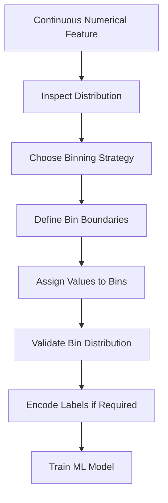
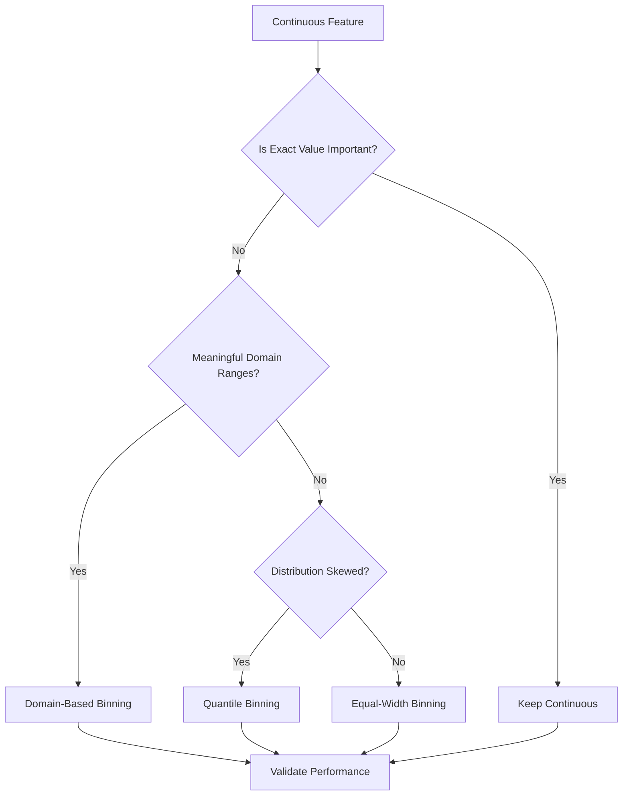
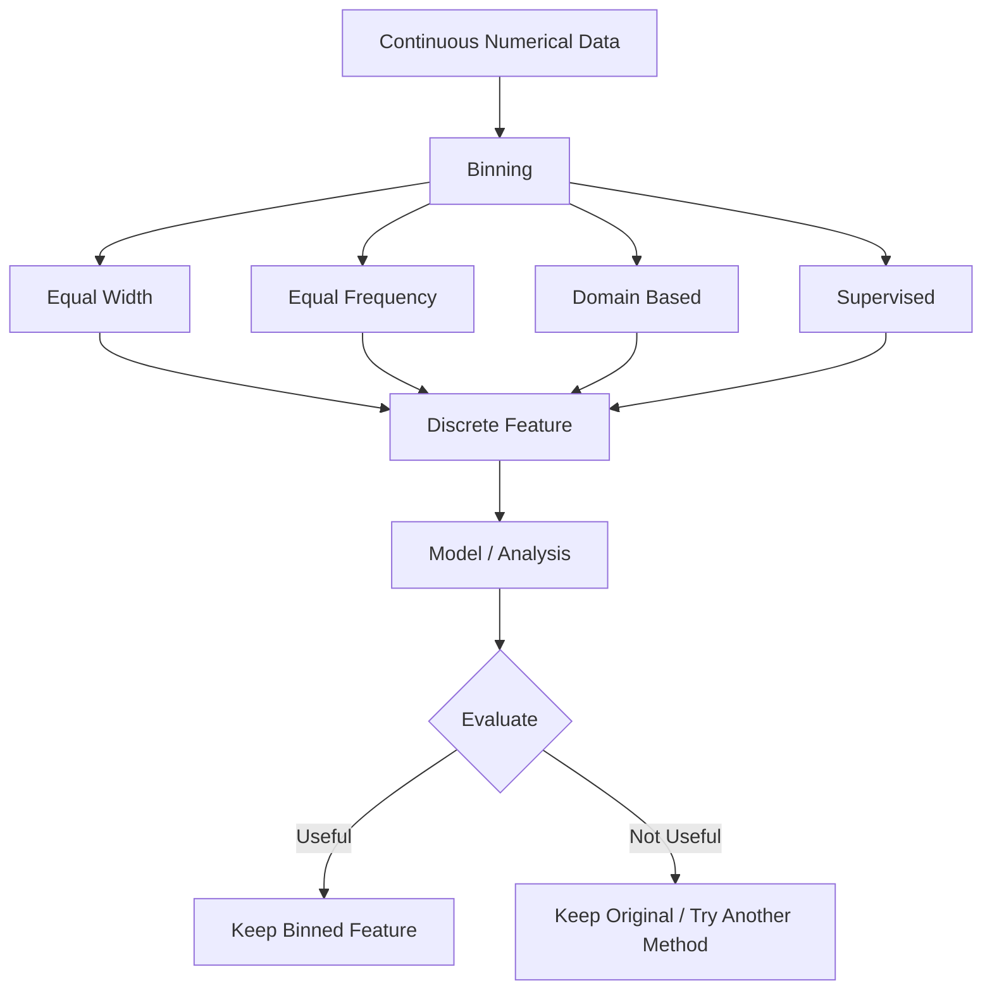

# 📊 Binning in Machine Learning

> **Binning** is a feature engineering technique that converts continuous numerical values into a small number of meaningful intervals (bins).

---

## 📚 Table of Contents

1. [🎯 What is Binning?](#1--what-is-binning)
2. [🧠 Why Use Binning?](#2--why-use-binning)
3. [📖 Important Terminology](#3--important-terminology)
4. [🔢 Types of Binning](#4--types-of-binning)
5. [⚙️ Binning Workflow](#5--binning-workflow)
6. [💻 Practical Python Examples](#6--practical-python-examples)
7. [🌍 Real-World Use Cases](#7--real-world-use-cases)
8. [✅ Advantages](#8--advantages)
9. [⚠️ Limitations](#9--limitations)
10. [🚫 Common Mistakes](#10--common-mistakes)
11. [🚀 Advanced Concepts](#11--advanced-concepts)
12. [🛠️ Mini Project Example](#12--mini-project-example)
13. [🎯 Best Practices](#13--best-practices)
14. [💼 Interview Points](#14--interview-points)
15. [⚡ Quick Revision](#15--quick-revision)

---

## 1. 🎯 What is Binning?

Binning, also called **discretization**, converts a continuous numerical feature into discrete intervals.

### Example

Suppose we have an `Age` feature:

```text
18, 22, 27, 35, 42, 51, 67
```

We can create age groups:

| Age | Bin |
|---:|---|
| 18–25 | Young |
| 26–40 | Adult |
| 41–60 | Middle Age |
| 61+ | Senior |

Instead of using the exact age, the model can use the corresponding age group.

### Basic Idea

```text
Continuous Variable
        ↓
   Define Intervals
        ↓
 Assign Each Value
     to a Bin
        ↓
 Discrete/Categorical Feature
```

---

## 2. 🧠 Why Use Binning?

Binning can be useful when the exact numerical value is less important than its **range or category**.

### Main Reasons

- 📉 Reduce the effect of small numerical variations
- 🧩 Convert continuous variables into categories
- 🔍 Capture non-linear relationships
- 🛡️ Reduce the influence of some outliers
- 🧠 Improve interpretability
- 📊 Simplify analysis and visualization

### Example

For income:

```text
₹24,500 → Low Income
₹31,000 → Low Income
₹38,000 → Middle Income
₹75,000 → High Income
```

The exact value may be less important for a business rule than the income group.

---

## 3. 📖 Important Terminology

| Term | Meaning |
|---|---|
| **Bin** | An interval/range containing values |
| **Binning** | Process of grouping numerical values |
| **Discretization** | Converting continuous values into discrete intervals |
| **Bin Edge** | Boundary separating two bins |
| **Bin Width** | Size of an interval |
| **Equal-Width Binning** | Each bin has approximately the same numerical width |
| **Equal-Frequency Binning** | Each bin contains approximately the same number of observations |
| **Quantile Binning** | Bins are created using quantile boundaries |
| **Categorical Feature** | Feature represented by categories/groups |

---

## 4. 🔢 Types of Binning

### 4.1 📏 Equal-Width Binning

Each bin has the same numerical width.

### Formula

If:

- Minimum value = `min`
- Maximum value = `max`
- Number of bins = `k`

Then:

```text
Bin Width = (max - min) / k
```

### Example

For values from `0` to `100` with 5 bins:

```text
Width = (100 - 0) / 5
      = 20
```

Bins:

```text
0–20
20–40
40–60
60–80
80–100
```

### Python

```python
import pandas as pd

age = pd.Series([18, 23, 27, 34, 42, 55, 68])

bins = [0, 20, 40, 60, 80]
labels = ["0-20", "21-40", "41-60", "61-80"]

result = pd.cut(age, bins=bins, labels=labels)

print(result)
```

> **Best for:** Data with reasonably uniform distributions.

---

### 4.2 ⚖️ Equal-Frequency Binning

Each bin contains approximately the same number of observations.

This is commonly implemented using **quantiles**.

### Python

```python
import pandas as pd

age = pd.Series([18, 21, 25, 28, 32, 35, 42, 50, 61, 70])

result = pd.qcut(
    age,
    q=4,
    labels=["Q1", "Q2", "Q3", "Q4"]
)

print(result)
```

Here, approximately 25% of observations fall into each bin.

> **Best for:** Skewed data where equal-width bins may become highly unbalanced.

---

### 4.3 🎯 Domain-Based Binning

Bins are created using business or domain knowledge.

Example:

```text
Age:
0–12   → Child
13–19  → Teenager
20–59  → Adult
60+    → Senior
```

Python:

```python
import pandas as pd

age = pd.Series([8, 16, 25, 45, 67])

bins = [0, 12, 19, 59, 120]
labels = ["Child", "Teenager", "Adult", "Senior"]

age_group = pd.cut(
    age,
    bins=bins,
    labels=labels,
    include_lowest=True
)

print(age_group)
```

> **Best for:** Healthcare, finance, marketing, education, and other domain-driven applications.

---

### 4.4 🤖 Model-Based / Supervised Binning

Bin boundaries can be selected based on the relationship between a feature and the target variable.

Common approaches include:

- Decision-tree-based binning
- Weight of Evidence (WoE) binning
- Optimal binning
- Target-based discretization

These approaches can be powerful but require careful validation to avoid **data leakage** and overfitting.

---

### 📊 Binning Types Comparison

| Type | Main Idea | Advantage | Limitation |
|---|---|---|---|
| Equal Width | Same interval width | Simple | Can create empty/imbalanced bins |
| Equal Frequency | Similar number of samples | Handles skewed data better | Boundaries may be unintuitive |
| Domain Based | Expert-defined ranges | Highly interpretable | Requires domain knowledge |
| Supervised | Uses target relationship | Can improve predictive usefulness | Risk of overfitting/leakage |

---

## 5. ⚙️ Binning Workflow



### Step-by-Step

1. 📥 Select a numerical feature.
2. 🔍 Analyze its distribution.
3. 🎯 Decide why binning is needed.
4. 📏 Select a binning strategy.
5. ✂️ Define bin boundaries.
6. 🏷️ Assign observations to bins.
7. 📊 Check the number of observations per bin.
8. 🧪 Fit transformations using training data only.
9. 🚀 Apply the same boundaries to validation/test data.
10. 📈 Evaluate whether binning improves the model.

---

## 6. 💻 Practical Python Examples

### 6.1 Using `pd.cut()`

`pd.cut()` is commonly used for fixed interval binning.

```python
import pandas as pd

df = pd.DataFrame({
    "age": [18, 22, 27, 35, 44, 53, 67]
})

bins = [0, 20, 40, 60, 100]
labels = ["Young", "Adult", "Middle Age", "Senior"]

df["age_group"] = pd.cut(
    df["age"],
    bins=bins,
    labels=labels,
    include_lowest=True
)

print(df)
```

---

### 6.2 Using `pd.qcut()`

`pd.qcut()` creates bins based on quantiles.

```python
import pandas as pd

df = pd.DataFrame({
    "income": [18000, 22000, 25000, 31000, 40000,
               52000, 70000, 90000]
})

df["income_group"] = pd.qcut(
    df["income"],
    q=4,
    labels=["Low", "Medium", "High", "Very High"]
)

print(df)
```

---

### 6.3 Binning Without Labels

Sometimes numeric bin codes are useful.

```python
import pandas as pd

age = pd.Series([18, 25, 35, 50, 70])

result = pd.cut(
    age,
    bins=[0, 20, 40, 60, 100],
    labels=False
)

print(result)
```

Possible output:

```text
0
1
1
2
3
```

---

### 6.4 Checking Bin Distribution

Always inspect the distribution after binning.

```python
print(df["age_group"].value_counts())
```

For percentages:

```python
print(
    df["age_group"]
    .value_counts(normalize=True)
    .mul(100)
)
```

---

### 6.5 Binning with Scikit-Learn

`KBinsDiscretizer` provides a machine-learning-oriented approach.

```python
from sklearn.preprocessing import KBinsDiscretizer

X = [[10], [20], [30], [40], [50], [60], [70]]

encoder = KBinsDiscretizer(
    n_bins=3,
    encode="ordinal",
    strategy="quantile"
)

X_binned = encoder.fit_transform(X)

print(X_binned)
```

### Strategies

```python
strategy="uniform"   # Equal-width
strategy="quantile"  # Equal-frequency
strategy="kmeans"    # K-means based
```

---

## 7. 🌍 Real-World Use Cases

### 🏦 Banking

Credit score:

```text
300–579  → Poor
580–669  → Fair
670–739  → Good
740–799  → Very Good
800–850  → Excellent
```

Used for:

- Credit risk analysis
- Loan approval
- Customer segmentation

### 🏥 Healthcare

Age or medical measurements can be grouped into clinically meaningful ranges.

### 🛒 E-Commerce

Customer spending:

```text
₹0–₹999       → Low
₹1,000–₹4,999 → Medium
₹5,000+       → High
```

Used for:

- Customer segmentation
- Marketing
- Recommendation systems

### 📈 Marketing

Customer age can be grouped into demographic segments.

### 🚗 Insurance

Driver age or vehicle age can be divided into risk groups.

---

## 8. ✅ Advantages

| Advantage | Explanation |
|---|---|
| 🧠 Interpretability | Categories are easier to understand |
| 📉 Noise Reduction | Small variations may become less important |
| 🔄 Non-linearity | Can represent range-based effects |
| 📊 Visualization | Makes grouped analysis easier |
| 🛡️ Outlier Handling | Extreme values may be grouped into boundary bins |
| 🎯 Business Rules | Useful when decisions naturally use ranges |

---

## 9. ⚠️ Limitations

| Limitation | Explanation |
|---|---|
| ❌ Information Loss | Exact numerical values are replaced by groups |
| 📉 Reduced Precision | Small differences inside a bin disappear |
| ⚖️ Boundary Sensitivity | Results can change when boundaries change |
| 🧩 Too Many Bins | Can create unnecessary complexity |
| 📦 Too Few Bins | Can hide useful patterns |
| ⚠️ Leakage Risk | Target-based binning can leak information |
| 🔄 Distribution Dependence | Quantile boundaries depend on training data |

### Important Example

These values:

```text
40, 41, 59, 60
```

may become:

```text
40 → Adult
41 → Adult
59 → Adult
60 → Senior
```

A small numerical difference can produce a category change if the boundary is poorly selected.

---

## 10. 🚫 Common Mistakes

### ❌ 1. Choosing Bins Randomly

Do not choose arbitrary boundaries without understanding the data or domain.

### ❌ 2. Too Many Bins

```text
18–19
20–21
22–23
...
```

This may provide little benefit over keeping the original numerical feature.

### ❌ 3. Too Few Bins

Putting a wide range of values into one category can remove important information.

### ❌ 4. Ignoring Distribution

Always inspect:

```python
df["feature"].describe()
df["feature"].hist()
```

### ❌ 5. Data Leakage

Do not calculate quantile boundaries using the complete dataset before splitting into train/test.

Correct approach:

```text
Train Data
   ↓
Learn Bin Boundaries
   ↓
Apply Same Boundaries
   ├── Validation
   └── Test
```

### ❌ 6. Assuming Binning Always Improves Accuracy

Binning is a feature engineering technique, not a guaranteed performance improvement.

---

## 11. 🚀 Advanced Concepts

### 11.1 🌳 Decision-Tree-Based Binning

A decision tree can identify useful thresholds based on the target.

Example:

```text
Age
 |
 +-- Age < 35
 |      ↓
 |   Group 1
 |
 +-- Age >= 35
        ↓
     Group 2
```

This can create predictive bins, but the thresholds must be learned only from training data.

---

### 11.2 📊 Weight of Evidence (WoE)

WoE is frequently used in credit-risk modeling.

A simplified formula is:

```text
WoE = ln(% Good in Bin / % Bad in Bin)
```

WoE can transform binned variables into values representing the strength of association with the target.

It is particularly common in:

- Credit scoring
- Risk modeling
- Logistic regression

---

### 11.3 📈 Monotonic Binning

Monotonic binning attempts to create bins where the relationship between the feature and target moves consistently in one direction.

Example:

```text
Risk
 ^
 |             █
 |          █
 |       █
 |    █
 | █
 +------------------> Feature
```

This can be useful for interpretable risk models.

---

### 11.4 🧪 Binning and One-Hot Encoding

Binning produces categories, which can then be one-hot encoded.

Example:

```text
Age = 35
      ↓
Adult
      ↓
One-Hot Encoding
      ↓
[0, 1, 0]
```

Python:

```python
import pandas as pd

df = pd.DataFrame({
    "age": [18, 30, 50, 70]
})

df["age_group"] = pd.cut(
    df["age"],
    bins=[0, 20, 40, 60, 100],
    labels=["Young", "Adult", "Middle", "Senior"]
)

encoded = pd.get_dummies(
    df["age_group"],
    dtype=int
)

print(encoded)
```

---

### 11.5 🔬 Binning vs Scaling

Binning and scaling solve different problems.

| Technique | Purpose |
|---|---|
| Binning | Converts continuous values into intervals |
| Standardization | Centers/scales values using mean and standard deviation |
| Min-Max Scaling | Maps values to a selected range |
| Robust Scaling | Uses median and IQR |
| Normalization | Rescales data according to a chosen normalization method |

---

## 12. 🛠️ Mini Project Example

### 🎯 Customer Age Segmentation

Suppose an e-commerce company wants to segment customers based on age.

### Dataset

```python
import pandas as pd

df = pd.DataFrame({
    "customer": ["A", "B", "C", "D", "E", "F"],
    "age": [19, 24, 31, 42, 58, 71],
    "purchase_amount": [500, 1200, 3000, 4500, 7000, 9000]
})
```

### Step 1: Create Age Bins

```python
bins = [0, 20, 30, 50, 100]

labels = [
    "Young",
    "Early Adult",
    "Adult",
    "Senior"
]

df["age_group"] = pd.cut(
    df["age"],
    bins=bins,
    labels=labels,
    include_lowest=True
)
```

### Step 2: Analyze Groups

```python
summary = df.groupby(
    "age_group",
    observed=True
)["purchase_amount"].mean()

print(summary)
```

### Step 3: Business Interpretation

```text
Age Group
    ↓
Customer Segment
    ↓
Average Purchase Analysis
    ↓
Marketing Strategy
```

For example:

- Young → Student-focused offers
- Early Adult → Entry-level products
- Adult → Premium products
- Senior → Specialized products

### Mini Project Workflow


---

## 13. 🎯 Best Practices

1. 🔍 Understand the feature distribution before binning.
2. 🎯 Use domain knowledge when meaningful boundaries exist.
3. ⚖️ Check the number of observations in every bin.
4. 📊 Compare model performance before and after binning.
5. 🧪 Learn boundaries from training data only.
6. 🔄 Apply identical boundaries to validation/test data.
7. 🧠 Prefer interpretable bins when explainability matters.
8. 🚫 Avoid unnecessary binning of naturally useful continuous features.
9. 📈 Test multiple reasonable binning strategies.
10. 📝 Document the boundaries and reasoning.

### Recommended Decision Process



---

## 14. 💼 Interview Points

### ⭐ Frequently Asked Questions

**Q1. What is binning in ML?**

Binning is a feature engineering technique that converts continuous numerical data into discrete intervals or categories.

**Q2. What is another name for binning?**

**Discretization**.

**Q3. What is the difference between `cut()` and `qcut()` in Pandas?**

| Function | Purpose |
|---|---|
| `pd.cut()` | Bins based on specified numerical intervals |
| `pd.qcut()` | Bins based on quantiles/frequency |

**Q4. Does binning always improve model performance?**

No. It can improve interpretability or capture non-linear patterns, but it can also cause information loss.

**Q5. What is equal-width binning?**

Dividing the numerical range into intervals with approximately equal widths.

**Q6. What is equal-frequency binning?**

Creating bins containing approximately equal numbers of observations.

**Q7. What is a major risk of supervised binning?**

**Overfitting and target leakage**.

**Q8. Should bin boundaries be learned from the test set?**

No. Bin boundaries should be learned from training data and then applied unchanged to validation/test data.

### 🧠 One-Line Interview Answer

> **Binning converts continuous numerical features into discrete intervals to simplify data, improve interpretability, and sometimes capture non-linear relationships.**

---

# 15. ⚡ Quick Revision

## 📝 Key Points

- **Binning = Discretization**
- Converts **continuous → discrete intervals**
- `pd.cut()` → fixed/equal-width/domain-defined bins
- `pd.qcut()` → quantile/equal-frequency bins
- `KBinsDiscretizer` → Scikit-learn implementation
- Binning can improve **interpretability**
- Binning can capture some **non-linear relationships**
- Binning can cause **information loss**
- Avoid **data leakage**
- Learn boundaries using **training data only**
- Always check **bin distribution**
- Binning does **not** guarantee better accuracy

## 🔑 Important Commands

```python
# Fixed interval binning
pd.cut()

# Quantile binning
pd.qcut()

# Scikit-learn binning
KBinsDiscretizer()

# Check distribution
value_counts()

# Check percentage distribution
value_counts(normalize=True)
```

## 🧮 Important Formula

### Equal-Width Bin

```text
Bin Width = (Maximum - Minimum) / Number of Bins
```

### Weight of Evidence

```text
WoE = ln(% Good in Bin / % Bad in Bin)
```

## 📊 Binning Cheat Sheet

| Requirement | Recommended Approach |
|---|---|
| Fixed numerical ranges | `pd.cut()` |
| Equal number of observations | `pd.qcut()` |
| Business-defined categories | Domain-based binning |
| ML pipeline | `KBinsDiscretizer` |
| Credit-risk modeling | WoE / supervised binning |
| Skewed distribution | Quantile binning |
| Strong domain boundaries | Domain-based binning |

## 🗺️ Visual Summary



## 🚀 Learning Roadmap

```text
Numerical Feature
       ↓
Understand Distribution
       ↓
Choose Binning Strategy
       ↓
Define Boundaries
       ↓
Create Bins
       ↓
Validate Distribution
       ↓
Avoid Leakage
       ↓
Encode if Required
       ↓
Train Model
       ↓
Compare Performance
       ↓
Select Best Representation
```

> **Remember:** Binning is not simply about creating categories. The goal is to create **useful, meaningful, and validated intervals** while preserving enough information for the ML task.
