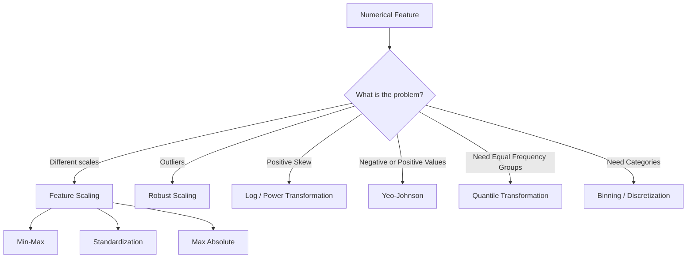
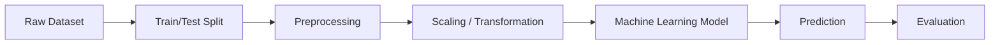
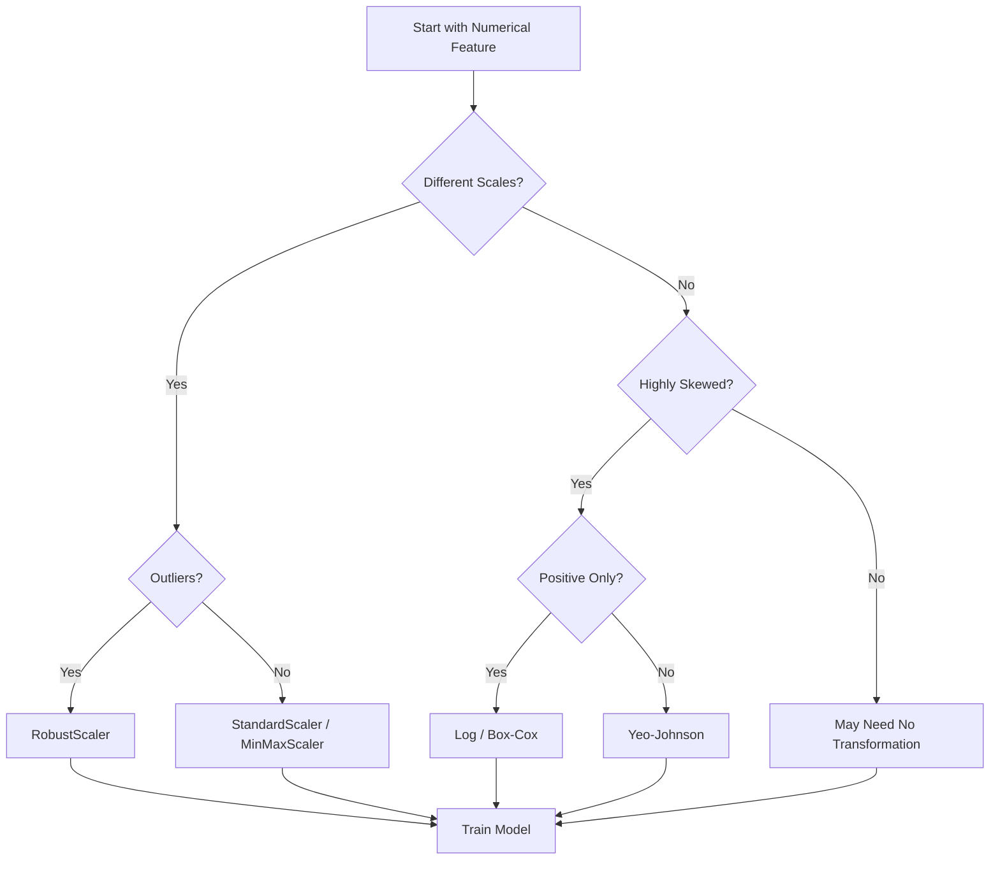
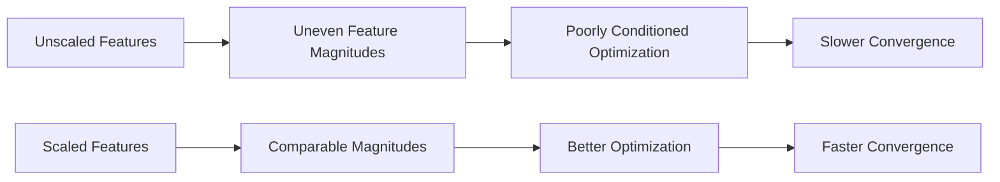
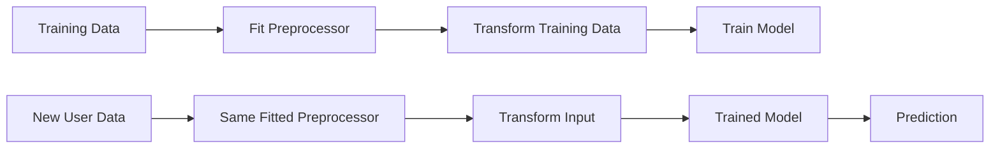
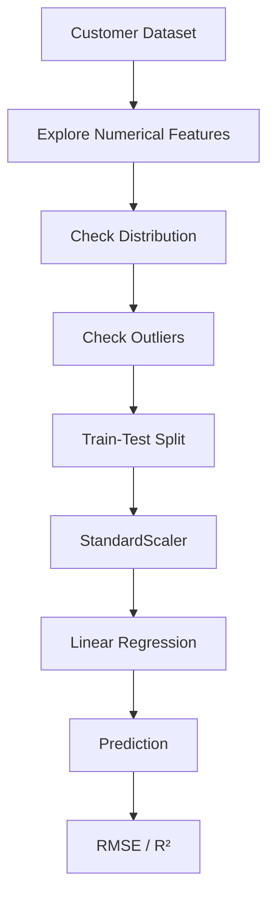
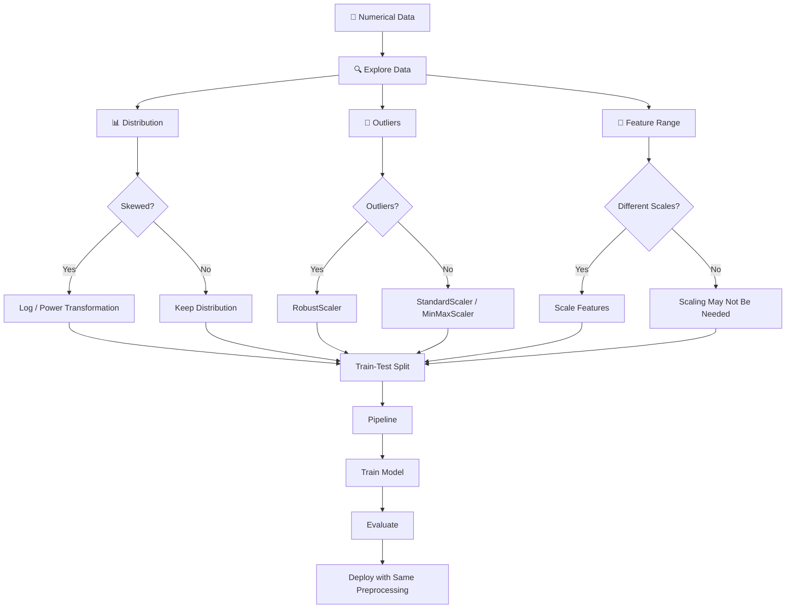

# 🔢 Encoding Numerical Data in Machine Learning

> A complete learning resource covering numerical data encoding, scaling, transformation, discretization, normalization, standardization, practical implementation, best practices, common mistakes, and advanced techniques.

---

## 📚 Table of Contents

1. [Introduction](#1--introduction)
2. [What Is Numerical Data?](#2--what-is-numerical-data)
3. [Why Encode Numerical Data?](#3--why-encode-numerical-data)
4. [Types of Numerical Data](#4--types-of-numerical-data)
5. [Numerical Encoding vs Feature Scaling](#5--numerical-encoding-vs-feature-scaling)
6. [Common Numerical Encoding Techniques](#6--common-numerical-encoding-techniques)

   * [Min-Max Normalization](#61--min-max-normalization)
   * [Standardization](#62--standardization)
   * [Robust Scaling](#63--robust-scaling)
   * [Max Absolute Scaling](#64--max-absolute-scaling)
   * [Mean Normalization](#65--mean-normalization)
   * [Unit Vector Normalization](#66--unit-vector-normalization)
7. [Mathematical Transformations](#7--mathematical-transformations)

   * [Log Transformation](#71--log-transformation)
   * [Square Root Transformation](#72--square-root-transformation)
   * [Power Transformation](#73--power-transformation)
   * [Box-Cox Transformation](#74--box-cox-transformation)
   * [Yeo-Johnson Transformation](#75--yeo-johnson-transformation)
8. [Discretization / Binning](#8--discretization--binning)
9. [Rank and Quantile Transformation](#9--rank-and-quantile-transformation)
10. [Encoding Numerical Features for Specific Algorithms](#10--encoding-numerical-features-for-specific-algorithms)
11. [Practical Scikit-Learn Implementation](#11--practical-scikit-learn-implementation)
12. [Using Pipelines](#12--using-pipelines)
13. [Data Leakage and Numerical Encoding](#13--data-leakage-and-numerical-encoding)
14. [Choosing the Right Technique](#14--choosing-the-right-technique)
15. [Real-World Examples](#15--real-world-examples)
16. [Advantages and Limitations](#16--advantages-and-limitations)
17. [Best Practices](#17--best-practices)
18. [Common Mistakes](#18--common-mistakes)
19. [Advanced Concepts](#19--advanced-concepts)
20. [Interview Questions and Points](#20--interview-questions-and-points)
21. [🛠️ Mini Project](#21-️-mini-project)
22. [⚡ Quick Revision](#22--quick-revision)
23. [🗺️ Visual Roadmap](#23-️-visual-roadmap)

---

# 1. 🌟 Introduction

Machine Learning algorithms work with **numerical representations of data**.

Real-world datasets frequently contain numerical features such as:

* Age
* Salary
* Height
* Weight
* Temperature
* Distance
* Number of purchases
* Account balance
* House price
* Exam score

Although these values are already numbers, they may not be in a form that is optimal for a particular Machine Learning algorithm.

For example:

```text
Age       Salary
20        25000
25        50000
30        100000
```

The values of `Salary` are much larger than the values of `Age`.

Some algorithms can be affected by this difference in scale.

Therefore, numerical features may need to be:

* Scaled
* Normalized
* Transformed
* Binned
* Ranked
* Power-transformed

This overall process is commonly referred to as **numerical feature preprocessing**.

---

# 2. 🔢 What Is Numerical Data?

Numerical data represents quantities using numbers.

## 2.1 Types of Numerical Data

Numerical data can broadly be divided into:

| Type       | Description                                       | Examples                      |
| ---------- | ------------------------------------------------- | ----------------------------- |
| Discrete   | Countable values                                  | Number of children, purchases |
| Continuous | Measurable values                                 | Height, temperature           |
| Interval   | Differences are meaningful, but zero is arbitrary | Temperature in Celsius        |
| Ratio      | Has a meaningful zero                             | Age, income, weight           |

### Example

```text
Number of children = 3
```

This is discrete.

```text
Height = 175.5 cm
```

This is continuous.

---

# 3. 🎯 Why Encode Numerical Data?

Numerical encoding and transformation are performed to make features more suitable for Machine Learning models.

### Major objectives

1. 📏 Put features on comparable scales
2. ⚡ Improve optimization speed
3. 🎯 Improve model performance
4. 📊 Reduce skewness
5. 🚨 Reduce the influence of extreme outliers
6. 📈 Make distributions easier for some models to learn
7. 🧠 Satisfy assumptions of statistical algorithms
8. 🔍 Improve numerical stability

---

## 3.1 Example: Different Feature Scales

Consider:

```text
Age       = 25
Salary    = 80000
Experience = 3
```

A distance-based algorithm may calculate:

```text
Distance = √[(Age₁-Age₂)² + (Salary₁-Salary₂)² + (Experience₁-Experience₂)²]
```

Because salary has a much larger numerical magnitude, it can dominate the distance calculation.

Scaling can solve this problem.

---

# 4. 📊 Types of Numerical Data

Numerical features can have different statistical properties.

| Property         | Example            | Potential Problem                 |
| ---------------- | ------------------ | --------------------------------- |
| Small range      | Age                | Usually manageable                |
| Large range      | Salary             | Can dominate distance             |
| Negative values  | Temperature        | Some transformations require care |
| Positive skew    | Income             | Can affect statistical models     |
| Extreme outliers | Wealth             | Can distort scaling               |
| Different units  | Height + income    | Scale mismatch                    |
| Heavy-tailed     | Transaction values | Sensitive to extreme observations |

---

# 5. ⚖️ Numerical Encoding vs Feature Scaling

These terms are related but should not always be treated as identical.

### Numerical encoding

Converts or transforms numerical information into a representation suitable for modeling.

### Feature scaling

Changes the numerical range or distribution of a feature without changing its underlying observation order in most common techniques.

| Concept                 | Purpose                                  | Example             |
| ----------------------- | ---------------------------------------- | ------------------- |
| Scaling                 | Adjust numerical range                   | Min-Max Scaling     |
| Standardization         | Mean = 0, SD = 1                         | StandardScaler      |
| Normalization           | Normalize observations                   | L2 normalization    |
| Transformation          | Change distribution                      | Log transformation  |
| Binning                 | Convert continuous values into intervals | Age groups          |
| Quantile transformation | Map distribution                         | QuantileTransformer |

---

# 6. 🧰 Common Numerical Encoding Techniques

The most important techniques include:



---

# 6.1 📏 Min-Max Normalization

Min-Max Scaling transforms values into a predefined range, usually:

```text
[0, 1]
```

## Formula

$$
x' = \frac{x-x_{min}}{x_{max}-x_{min}}
$$

For a target range `[a, b]`:

$$
x' = a + \frac{(x-x_{min})(b-a)}{x_{max}-x_{min}}
$$

### Example

Suppose:

```text
Minimum = 10
Maximum = 50
Value = 30
```

Then:

$$
x' = \frac{30-10}{50-10}
$$

$$
x' = \frac{20}{40}=0.5
$$

Therefore:

```text
30 → 0.5
```

---

## Python Example

```python
from sklearn.preprocessing import MinMaxScaler

X = [[10], [20], [30], [40], [50]]

scaler = MinMaxScaler()

X_scaled = scaler.fit_transform(X)

print(X_scaled)
```

Output:

```text
[[0.  ]
 [0.25]
 [0.5 ]
 [0.75]
 [1.  ]]
```

---

## When to Use

Min-Max scaling is useful when:

* Features have different ranges
* Values need to be bounded
* Neural networks benefit from controlled input ranges
* Distance-based algorithms are being used

### Advantages

* Simple
* Easy to understand
* Produces bounded values
* Preserves relative relationships

### Limitation

Highly sensitive to outliers.

Example:

```text
10, 20, 30, 40, 10000
```

The extreme value `10000` can compress most observations into a very small interval.

---

# 6.2 📐 Standardization

Standardization converts a feature so that it approximately has:

```text
Mean = 0
Standard Deviation = 1
```

## Formula

$$
z = \frac{x-\mu}{\sigma}
$$

Where:

* `x` = original value
* `μ` = mean
* `σ` = standard deviation

### Example

Suppose:

```text
Mean = 50
Standard deviation = 10
Value = 70
```

Then:

$$
z = \frac{70-50}{10}
$$

```text
z = 2
```

The value is two standard deviations above the mean.

---

## Python

```python
from sklearn.preprocessing import StandardScaler

X = [[10], [20], [30], [40], [50]]

scaler = StandardScaler()

X_scaled = scaler.fit_transform(X)

print(X_scaled)
```

---

## When to Use Standardization

Particularly useful for:

* Logistic Regression
* Linear Regression
* Support Vector Machines
* K-Nearest Neighbors
* PCA
* Neural Networks
* Gradient-based optimization

---

# 6.3 🛡️ Robust Scaling

Robust Scaling is designed to reduce the influence of outliers.

It uses:

* Median
* Interquartile Range (IQR)

## Formula

$$
x' = \frac{x-\text{Median}}{IQR}
$$

Where:

$$
IQR = Q_3-Q_1
$$

---

## Python

```python
from sklearn.preprocessing import RobustScaler

X = [[10], [20], [30], [40], [1000]]

scaler = RobustScaler()

X_scaled = scaler.fit_transform(X)

print(X_scaled)
```

---

## When to Use

Use RobustScaler when:

* Dataset contains significant outliers
* Median is more representative than mean
* StandardScaler is heavily affected by extreme values

---

# 6.4 📊 Max Absolute Scaling

Max Absolute Scaling divides values by the maximum absolute value.

## Formula

$$
x' = \frac{x}{\max(|x|)}
$$

The output generally lies between:

```text
-1 and 1
```

---

## Python

```python
from sklearn.preprocessing import MaxAbsScaler

X = [[-10], [-5], [0], [5], [10]]

scaler = MaxAbsScaler()

X_scaled = scaler.fit_transform(X)

print(X_scaled)
```

### Useful For

* Sparse datasets
* Data where preserving zero values is important

---

# 6.5 📊 Mean Normalization

Mean normalization subtracts the mean and divides by the range.

## Formula

$$
x' = \frac{x-\mu}{x_{max}-x_{min}}
$$

This produces values centered around zero.

---

# 6.6 📐 Unit Vector Normalization

Unit normalization scales an entire observation so that its vector has a norm of 1.

For L2 normalization:

$$
x' = \frac{x}{\sqrt{x_1^2+x_2^2+\cdots+x_n^2}}
$$

Example:

```text
[3, 4]
```

L2 norm:

$$
\sqrt{3^2+4^2}=5
$$

Normalized vector:

```text
[0.6, 0.8]
```

---

## Python

```python
from sklearn.preprocessing import Normalizer

X = [[3, 4]]

normalizer = Normalizer(norm="l2")

X_normalized = normalizer.fit_transform(X)

print(X_normalized)
```

---

# 7. 🔄 Mathematical Transformations

Scaling changes the magnitude of features.

Transformation can change the **shape/distribution** of the data.

Common transformations include:

* Log
* Square root
* Reciprocal
* Polynomial
* Box-Cox
* Yeo-Johnson

---

# 7.1 📉 Log Transformation

Log transformation is commonly used for positively skewed data.

## Formula

$$
x' = \log(x)
$$

When zero values exist:

$$
x' = \log(1+x)
$$

or:

```python
np.log1p(x)
```

---

## Example

Original:

```text
10
100
1000
10000
```

Log transformed:

```text
1
2
3
4
```

when using base-10 logarithm.

The transformation compresses large values.

---

## Python

```python
import numpy as np

data = np.array([10, 100, 1000, 10000])

transformed = np.log10(data)

print(transformed)
```

---

## Use Cases

* Income
* House prices
* Population
* Transaction amounts
* Website traffic
* Sales

---

# 7.2 🌱 Square Root Transformation

Square root transformation is useful for moderately right-skewed data.

$$
x' = \sqrt{x}
$$

Python:

```python
import numpy as np

x = np.array([1, 4, 9, 16, 25])

result = np.sqrt(x)

print(result)
```

---

# 7.3 ⚡ Power Transformation

Power transformations apply a mathematical power to the feature.

General form:

$$
x' = x^\lambda
$$

Examples:

```text
λ = 2       → Square
λ = 0.5     → Square root
λ = -1      → Reciprocal
```

---

# 7.4 📦 Box-Cox Transformation

Box-Cox is used to make a positive-valued feature more Gaussian-like.

The transformation is:

$$
x^{(\lambda)} =
\begin{cases}
\frac{x^\lambda-1}{\lambda}, & \lambda \neq 0 \
\ln(x), & \lambda = 0
\end{cases}
$$

### Important

Box-Cox requires:

```text
x > 0
```

---

## Python

```python
from sklearn.preprocessing import PowerTransformer

transformer = PowerTransformer(method="box-cox")

X_transformed = transformer.fit_transform(X)
```

---

# 7.5 🔄 Yeo-Johnson Transformation

Yeo-Johnson is similar to Box-Cox but can handle:

* Positive values
* Zero
* Negative values

Example:

```python
from sklearn.preprocessing import PowerTransformer

transformer = PowerTransformer(method="yeo-johnson")

X_transformed = transformer.fit_transform(X)
```

### Box-Cox vs Yeo-Johnson

| Feature                     | Box-Cox              | Yeo-Johnson                          |
| --------------------------- | -------------------- | ------------------------------------ |
| Positive values             | ✅                    | ✅                                    |
| Zero                        | ❌                    | ✅                                    |
| Negative values             | ❌                    | ✅                                    |
| Distribution transformation | ✅                    | ✅                                    |
| Common use                  | Positive skewed data | General-purpose power transformation |

---

# 8. 🪣 Discretization / Binning

Discretization converts continuous numerical values into discrete intervals.

Example:

```text
Age:
0–12       → Child
13–19      → Teenager
20–59      → Adult
60+        → Senior
```

---

## 8.1 Equal-Width Binning

The numerical range is divided into intervals of equal width.

Example:

```text
0–20
21–40
41–60
61–80
81–100
```

---

## 8.2 Equal-Frequency Binning

Each bin contains approximately the same number of observations.

Example:

```text
Bin 1 → 25% of observations
Bin 2 → 25%
Bin 3 → 25%
Bin 4 → 25%
```

---

## Python

```python
import pandas as pd

df = pd.DataFrame({
    "age": [12, 18, 25, 35, 45, 60, 75]
})

df["age_group"] = pd.cut(
    df["age"],
    bins=[0, 18, 35, 60, 100],
    labels=["Child", "Young Adult", "Adult", "Senior"]
)

print(df)
```

---

## Scikit-Learn Binning

```python
from sklearn.preprocessing import KBinsDiscretizer

encoder = KBinsDiscretizer(
    n_bins=5,
    encode="ordinal",
    strategy="quantile"
)

X_binned = encoder.fit_transform(X)
```

---

## Advantages

* Can capture nonlinear relationships
* Easy to interpret
* Useful for business rules
* Can reduce sensitivity to small numerical differences

## Limitations

* Information loss
* Bin boundaries can be arbitrary
* Can reduce predictive power
* Requires careful selection of bins

---

# 9. 📊 Rank and Quantile Transformation

Quantile transformation maps data according to its rank in the distribution.

It can be used to transform a feature toward:

* Uniform distribution
* Normal distribution

---

## Python

```python
from sklearn.preprocessing import QuantileTransformer

transformer = QuantileTransformer(
    output_distribution="normal"
)

X_transformed = transformer.fit_transform(X)
```

---

## Why Use Quantile Transformation?

It can be useful when:

* Data has severe skewness
* Outliers are present
* A more Gaussian-like distribution is desired

### Limitation

It can distort the original numerical distances.

---

# 10. 🤖 Encoding Numerical Features for Specific Algorithms

Not every algorithm requires numerical scaling.

| Algorithm               | Scaling Usually Needed? | Reason                       |
| ----------------------- | ----------------------: | ---------------------------- |
| Linear Regression       |                   Often | Coefficient optimization     |
| Logistic Regression     |                   Often | Optimization                 |
| KNN                     |                     Yes | Distance-based               |
| K-Means                 |                     Yes | Distance-based               |
| SVM                     |                     Yes | Distance/margin calculations |
| PCA                     |                     Yes | Variance-sensitive           |
| Neural Networks         |                 Usually | Optimization                 |
| Decision Tree           |              Usually No | Threshold-based              |
| Random Forest           |              Usually No | Tree splits                  |
| Gradient Boosting Trees |              Usually No | Tree-based                   |
| XGBoost                 |              Usually No | Tree-based                   |
| Naive Bayes             |                 Depends | Distribution assumptions     |

### Important Rule

> Scaling is generally much more important for distance-based, gradient-based, and variance-based algorithms than for tree-based algorithms.

---

# 11. 💻 Practical Scikit-Learn Implementation

Consider the following dataset:

```python
import pandas as pd

df = pd.DataFrame({
    "age": [20, 25, 30, 35, 40],
    "salary": [25000, 40000, 55000, 80000, 120000],
    "experience": [1, 3, 5, 8, 12]
})

print(df)
```

---

## 11.1 Min-Max Scaling

```python
from sklearn.preprocessing import MinMaxScaler

scaler = MinMaxScaler()

df_scaled = scaler.fit_transform(df)

print(df_scaled)
```

---

## 11.2 Standardization

```python
from sklearn.preprocessing import StandardScaler

scaler = StandardScaler()

df_standardized = scaler.fit_transform(df)

print(df_standardized)
```

---

## 11.3 Robust Scaling

```python
from sklearn.preprocessing import RobustScaler

scaler = RobustScaler()

df_robust = scaler.fit_transform(df)

print(df_robust)
```

---

# 12. 🔗 Using Pipelines

A Machine Learning pipeline combines preprocessing and modeling.



---

## Example

```python
from sklearn.pipeline import Pipeline
from sklearn.preprocessing import StandardScaler
from sklearn.linear_model import LogisticRegression

pipeline = Pipeline([
    ("scaler", StandardScaler()),
    ("model", LogisticRegression())
])

pipeline.fit(X_train, y_train)

predictions = pipeline.predict(X_test)
```

### Why Pipelines Are Important

They:

* Prevent accidental leakage
* Keep preprocessing consistent
* Simplify deployment
* Make cross-validation safer
* Improve reproducibility

---

# 13. 🚨 Data Leakage and Numerical Encoding

One of the most important concepts in preprocessing is **data leakage**.

## Incorrect Approach

```python
scaler = StandardScaler()

X_scaled = scaler.fit_transform(X)

X_train, X_test, y_train, y_test = train_test_split(
    X_scaled,
    y,
    test_size=0.2
)
```

The scaler has seen the entire dataset before splitting.

This means information from the test set may influence preprocessing.

---

## Correct Approach

```python
X_train, X_test, y_train, y_test = train_test_split(
    X,
    y,
    test_size=0.2,
    random_state=42
)

scaler = StandardScaler()

X_train_scaled = scaler.fit_transform(X_train)

X_test_scaled = scaler.transform(X_test)
```

### Key Rule

```text
Training Data → fit()
Testing Data  → transform()
```

Never:

```text
Testing Data → fit()
```

---

# 14. 🧭 Choosing the Right Technique

A useful decision process:



---

## Decision Table

| Situation                            | Recommended Technique         |
| ------------------------------------ | ----------------------------- |
| Features have different ranges       | StandardScaler / MinMaxScaler |
| Strong outliers                      | RobustScaler                  |
| Positive skew                        | Log / Box-Cox                 |
| Negative + positive values           | Yeo-Johnson                   |
| Sparse data                          | MaxAbsScaler                  |
| Need bounded range                   | MinMaxScaler                  |
| Severe non-Gaussian distribution     | QuantileTransformer           |
| Need categories from continuous data | Binning                       |
| Tree-based model                     | Scaling often unnecessary     |

---

# 15. 🌍 Real-World Examples

## 15.1 💰 House Price Prediction

Features:

```text
Area
Bedrooms
Age
Distance from city
Price
```

Possible preprocessing:

```text
Area       → StandardScaler
Bedrooms   → Maybe unchanged
Age        → StandardScaler
Distance   → StandardScaler
Price      → Log transformation if highly skewed
```

---

## 15.2 🏦 Loan Approval

Features:

```text
Income
Loan Amount
Age
Credit Score
Existing Debt
```

Potential transformations:

```text
Income       → Log transformation
Loan Amount  → Log transformation
Age          → StandardScaler
Credit Score → StandardScaler
Debt         → RobustScaler if outliers exist
```

---

## 15.3 🛒 E-Commerce

Features:

```text
Number of purchases
Total spending
Average order value
Customer age
Website visits
```

Spending-related variables may be strongly right-skewed.

Possible solution:

```python
df["total_spending_log"] = np.log1p(df["total_spending"])
```

---

# 16. ✅ Advantages and Limitations

## Scaling Techniques

| Technique      | Advantages              | Limitations                           |
| -------------- | ----------------------- | ------------------------------------- |
| Min-Max        | Simple, bounded         | Sensitive to outliers                 |
| StandardScaler | Widely applicable       | Sensitive to outliers                 |
| RobustScaler   | Handles outliers better | May not produce standard distribution |
| MaxAbsScaler   | Preserves sparsity      | Limited effect on distribution        |
| Normalizer     | Useful for vectors      | Operates row-wise                     |

## Transformation Techniques

| Technique   | Advantages            | Limitations                            |
| ----------- | --------------------- | -------------------------------------- |
| Log         | Reduces right skew    | Cannot directly handle negative values |
| Square Root | Simple skew reduction | Less powerful than log                 |
| Box-Cox     | Flexible              | Positive values only                   |
| Yeo-Johnson | Handles negatives     | More complex                           |
| Quantile    | Handles severe skew   | Can distort distances                  |

---

# 17. 🏆 Best Practices

### 1. 🔍 Understand the Data First

Before scaling:

```python
df.describe()
```

Check:

* Mean
* Median
* Minimum
* Maximum
* Standard deviation
* Quartiles

---

### 2. 📊 Visualize Distributions

```python
import matplotlib.pyplot as plt

df["salary"].hist()

plt.xlabel("Salary")
plt.ylabel("Frequency")
plt.show()
```

---

### 3. 🚨 Check Outliers

```python
df.boxplot(column="salary")

plt.show()
```

---

### 4. 🧪 Compare Multiple Techniques

Do not assume one scaler is always best.

Compare:

```text
StandardScaler
MinMaxScaler
RobustScaler
PowerTransformer
QuantileTransformer
```

and evaluate model performance.

---

### 5. 🔒 Fit Only on Training Data

Correct:

```python
scaler.fit(X_train)
scaler.transform(X_test)
```

---

### 6. 🔗 Prefer Pipelines

```python
Pipeline([
    ("scaler", StandardScaler()),
    ("model", LogisticRegression())
])
```

---

### 7. 📦 Save the Preprocessor

When deploying a model, the same preprocessing must be applied to new data.

```python
import joblib

joblib.dump(scaler, "scaler.pkl")
```

Later:

```python
scaler = joblib.load("scaler.pkl")
```

---

# 18. ❌ Common Mistakes

## Mistake 1: Scaling Before Train-Test Split

❌ Incorrect:

```python
scaler.fit_transform(X)
train_test_split(X)
```

✅ Correct:

```python
X_train, X_test = train_test_split(X)

scaler.fit(X_train)

X_train = scaler.transform(X_train)
X_test = scaler.transform(X_test)
```

---

## Mistake 2: Using the Wrong Transformation

Applying logarithm to:

```text
-10
```

is invalid in ordinary real-valued logarithmic transformation.

Use Yeo-Johnson or another suitable transformation when negative values are present.

---

## Mistake 3: Assuming Scaling Always Improves Accuracy

Scaling does not automatically improve every model.

For example:

```text
Decision Tree
Random Forest
```

usually do not require feature scaling.

---

## Mistake 4: Ignoring Outliers

Min-Max scaling can be badly affected by extreme observations.

---

## Mistake 5: Scaling the Target Unnecessarily

Scaling `X` and scaling `y` are separate decisions.

For many classification tasks, target labels should not be treated like ordinary numerical input features.

---

## Mistake 6: Applying Different Transformations During Deployment

Training:

```text
StandardScaler
```

Deployment:

```text
MinMaxScaler
```

This creates inconsistent feature representations.

---

# 19. 🚀 Advanced Concepts

## 19.1 Feature Scaling and Gradient Descent

Gradient-based algorithms optimize parameters iteratively.

Suppose:

```text
Feature 1 → 0–10
Feature 2 → 0–1,000,000
```

The optimization surface may become elongated.

Scaling can create a better-conditioned optimization problem.



---

# 19.2 Scaling and KNN

KNN uses distance.

For Euclidean distance:

$$
d(x,y)=\sqrt{\sum_{i=1}^{n}(x_i-y_i)^2}
$$

A large-scale feature can dominate the distance.

Therefore:

```text
KNN + Scaling → Usually Important
```

---

# 19.3 Scaling and K-Means

K-Means uses distances to cluster points.

Without scaling:

```text
Salary → Dominates
Age → Small contribution
```

After scaling:

```text
Salary → Balanced
Age → Balanced
```

---

# 19.4 Scaling and PCA

PCA is variance-based.

Suppose:

```text
Age variance = 100
Salary variance = 10,000,000,000
```

PCA may primarily capture salary variance.

Standardization can make features more comparable before PCA.

---

# 19.5 Scaling and Neural Networks

Neural networks generally train more effectively when input features are appropriately scaled.

For example:

```text
Feature A → 0–1
Feature B → 0–100000
```

can make optimization unnecessarily difficult.

Common choices:

```text
StandardScaler
MinMaxScaler
```

depending on the architecture and data.

---

# 19.6 Sparse Data

Sparse datasets contain many zero values.

For example:

```text
[0, 0, 0, 4, 0, 0, 8, 0]
```

For sparse data, preserving zero values can be important.

`MaxAbsScaler` is often useful because it does not shift the data by subtracting the mean.

---

# 19.7 Numerical Stability

Very large or very small numerical values can sometimes cause computational issues.

For example:

```text
10^10
10^12
10^15
```

can create numerical instability in some calculations.

Scaling can improve numerical behavior.

---

# 19.8 Train-Time and Inference-Time Consistency

A deployed ML system should use exactly the same preprocessing logic used during training.



The preprocessor is part of the model's production pipeline.

---

# 20. 🎤 Interview Questions and Points

## Q1. What is feature scaling?

Feature scaling is the process of transforming numerical features to comparable ranges or distributions.

---

## Q2. What is the difference between normalization and standardization?

| Normalization                                                   | Standardization                                         |
| --------------------------------------------------------------- | ------------------------------------------------------- |
| Often refers to scaling to a fixed range or normalizing vectors | Centers and scales based on mean and standard deviation |
| Common example: Min-Max                                         | Common example: Z-score                                 |
| Usually bounded for Min-Max                                     | Not bounded                                             |
| Sensitive to outliers for Min-Max                               | Sensitive to outliers because mean and SD are affected  |

---

## Q3. When should you use StandardScaler?

Commonly when:

* Features have different scales
* Data is reasonably well-behaved
* Algorithm depends on feature magnitude
* Linear/SVM/KNN/PCA/gradient-based methods are used

---

## Q4. When should you use RobustScaler?

When the dataset contains significant outliers.

---

## Q5. Does Random Forest require feature scaling?

Generally, no.

Tree-based models split data using thresholds and are usually invariant to monotonic feature scaling.

---

## Q6. Why is scaling important for KNN?

Because KNN uses distances. A feature with a large numerical range can dominate the distance calculation.

---

## Q7. Why should we fit a scaler only on training data?

To prevent information from the test dataset from influencing the preprocessing process.

---

## Q8. What is data leakage?

Data leakage occurs when information that should not be available during training influences the model training process.

---

## Q9. What is RobustScaler based on?

It uses:

```text
Median
IQR
```

rather than mean and standard deviation.

---

## Q10. What is the difference between Box-Cox and Yeo-Johnson?

Box-Cox requires positive values, while Yeo-Johnson can handle positive, zero, and negative values.

---

## Q11. Which algorithms are most sensitive to feature scaling?

Common examples:

```text
KNN
K-Means
SVM
PCA
Logistic Regression
Linear Regression
Neural Networks
```

---

## Q12. Which algorithms generally do not require scaling?

Common examples:

```text
Decision Trees
Random Forest
XGBoost
LightGBM
CatBoost
```

---

# 21. 🛠️ Mini Project

## 🎯 Project: Customer Spending Prediction

### Objective

Build a Machine Learning workflow that predicts customer spending behavior while applying appropriate numerical preprocessing.

---

## Dataset

Example features:

```text
Age
Annual Income
Number of Purchases
Website Visits
Average Order Value
```

Target:

```text
Total Spending
```

---

## Step 1: Import Libraries

```python
import pandas as pd
import numpy as np

from sklearn.model_selection import train_test_split
from sklearn.preprocessing import StandardScaler
from sklearn.pipeline import Pipeline
from sklearn.linear_model import LinearRegression
from sklearn.metrics import mean_squared_error, r2_score
```

---

## Step 2: Create Example Dataset

```python
df = pd.DataFrame({
    "age": [22, 25, 28, 35, 40, 45, 50, 55],
    "income": [25000, 32000, 45000, 60000,
               75000, 90000, 110000, 150000],
    "purchases": [2, 4, 5, 7, 9, 11, 15, 20],
    "website_visits": [20, 35, 40, 60, 75, 90, 120, 150],
    "spending": [500, 900, 1300, 2200,
                 3500, 5000, 7000, 11000]
})
```

---

## Step 3: Separate Features and Target

```python
X = df.drop("spending", axis=1)

y = df["spending"]
```

---

## Step 4: Split Data

```python
X_train, X_test, y_train, y_test = train_test_split(
    X,
    y,
    test_size=0.2,
    random_state=42
)
```

---

## Step 5: Build Pipeline

```python
pipeline = Pipeline([
    ("scaler", StandardScaler()),
    ("model", LinearRegression())
])
```

---

## Step 6: Train

```python
pipeline.fit(X_train, y_train)
```

---

## Step 7: Predict

```python
y_pred = pipeline.predict(X_test)
```

---

## Step 8: Evaluate

```python
mse = mean_squared_error(y_test, y_pred)

rmse = np.sqrt(mse)

r2 = r2_score(y_test, y_pred)

print("RMSE:", rmse)
print("R² Score:", r2)
```

---

## Project Workflow



---

# 22. ⚡ Quick Revision

## 🔑 Key Points

### Numerical Data

Numerical data represents measurable quantities.

```text
Age
Salary
Height
Weight
Income
Distance
```

---

### Min-Max Scaling

```text
x' = (x - min) / (max - min)
```

Usually:

```text
0 → 1
```

---

### Standardization

```text
z = (x - mean) / standard deviation
```

Result:

```text
Mean ≈ 0
SD ≈ 1
```

---

### Robust Scaling

```text
x' = (x - median) / IQR
```

Best when:

```text
Outliers are present
```

---

### Log Transformation

```python
np.log1p(x)
```

Useful for:

```text
Right-skewed positive data
```

---

### Box-Cox

```text
Positive values only
```

---

### Yeo-Johnson

```text
Positive + Zero + Negative values
```

---

### Quantile Transformation

Useful for:

```text
Severely skewed distributions
```

---

### Binning

Converts:

```text
Continuous → Discrete intervals
```

Example:

```text
Age 25 → Young Adult
```

---

## 🧾 Important Scikit-Learn Classes

```python
from sklearn.preprocessing import (
    MinMaxScaler,
    StandardScaler,
    RobustScaler,
    MaxAbsScaler,
    Normalizer,
    PowerTransformer,
    QuantileTransformer,
    KBinsDiscretizer
)
```

---

## 🔥 Most Important Commands

### Standardization

```python
scaler = StandardScaler()

X_train = scaler.fit_transform(X_train)

X_test = scaler.transform(X_test)
```

### Min-Max

```python
scaler = MinMaxScaler()

X_train = scaler.fit_transform(X_train)

X_test = scaler.transform(X_test)
```

### Robust

```python
scaler = RobustScaler()

X_train = scaler.fit_transform(X_train)

X_test = scaler.transform(X_test)
```

### Power Transformation

```python
transformer = PowerTransformer(
    method="yeo-johnson"
)

X_transformed = transformer.fit_transform(X_train)
```

### Quantile Transformation

```python
transformer = QuantileTransformer(
    output_distribution="normal"
)

X_transformed = transformer.fit_transform(X_train)
```

---

# 23. 🗺️ Visual Roadmap



---

# 📌 Final Cheat Sheet

| Problem                            | Solution                           |
| ---------------------------------- | ---------------------------------- |
| Features have different scales     | StandardScaler                     |
| Need values between 0 and 1        | MinMaxScaler                       |
| Strong outliers                    | RobustScaler                       |
| Sparse numerical data              | MaxAbsScaler                       |
| Right-skewed positive feature      | Log transformation                 |
| Positive-only power transformation | Box-Cox                            |
| Negative/zero values + skew        | Yeo-Johnson                        |
| Severe distribution differences    | QuantileTransformer                |
| Convert continuous to intervals    | KBinsDiscretizer                   |
| KNN                                | Scale                              |
| K-Means                            | Scale                              |
| SVM                                | Scale                              |
| PCA                                | Scale                              |
| Neural Network                     | Usually scale                      |
| Decision Tree                      | Usually no scaling                 |
| Random Forest                      | Usually no scaling                 |
| Gradient Boosting Trees            | Usually no scaling                 |
| Avoid preprocessing leakage        | Fit on training data only          |
| Production consistency             | Save and reuse fitted preprocessor |

---

# 🧠 One-Minute Memory Trick

```text
Different Scale?
        ↓
   Scale Features
        ↓
Outliers?
   ↓          ↓
 Yes         No
 ↓            ↓
Robust      Standard /
Scaler      MinMax
        ↓
Skewed Distribution?
        ↓
Log / Power Transformation
        ↓
Algorithm?
        ↓
Distance / Gradient / Variance Based
        ↓
Scaling Usually Important
        ↓
Tree Based
        ↓
Scaling Usually Not Required
```

> **Golden Rule:** Always understand the distribution, scale, outliers, algorithm, and train-test separation before choosing a numerical preprocessing technique.
