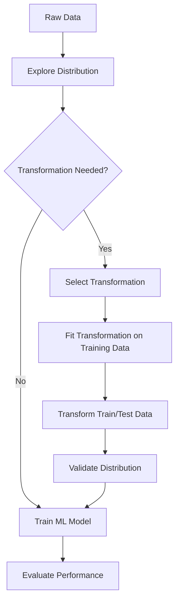
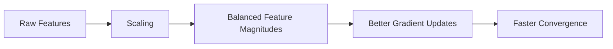
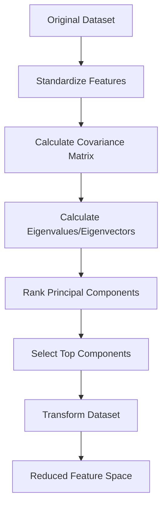
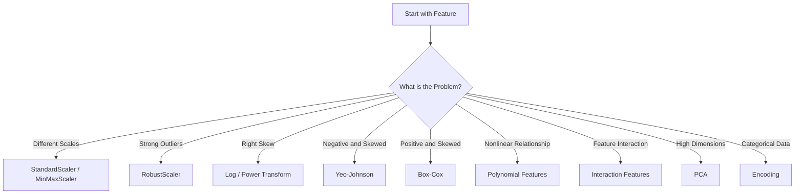
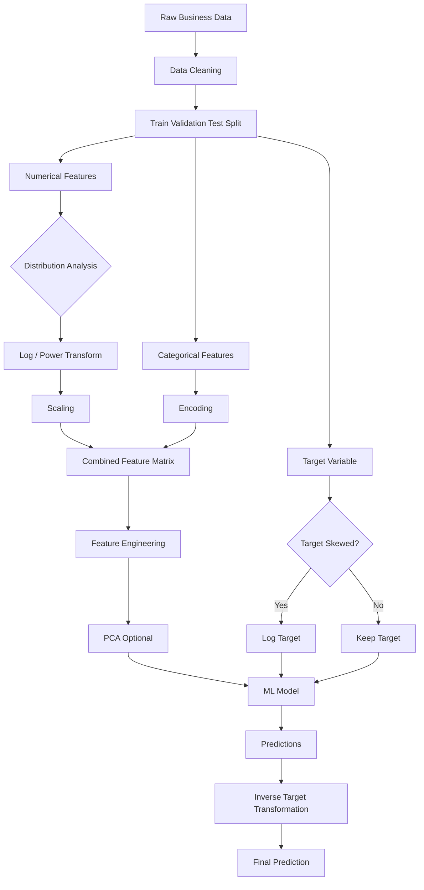

# 📐 Mathematical Transformations in Machine Learning

> **A complete learning resource covering mathematical transformations, feature transformations, probability transformations, optimization, normalization, scaling, dimensionality reduction, and advanced mathematical concepts used in Machine Learning.**

---

## 📚 Table of Contents

1. [Introduction](#1--introduction)
2. [Why Mathematical Transformations Matter in ML](#2--why-mathematical-transformations-matter-in-ml)
3. [Fundamental Terminology](#3--fundamental-terminology)
4. [Types of Mathematical Transformations](#4--types-of-mathematical-transformations)
5. [Feature Scaling](#5--feature-scaling)
6. [Normalization](#6--normalization)
7. [Standardization](#7--standardization)
8. [Min-Max Transformation](#8--min-max-transformation)
9. [Robust Scaling](#9--robust-scaling)
10. [Logarithmic Transformation](#10--logarithmic-transformation)
11. [Power Transformations](#11--power-transformations)
12. [Box-Cox Transformation](#12--box-cox-transformation)
13. [Yeo-Johnson Transformation](#13--yeo-johnson-transformation)
14. [Exponential and Reciprocal Transformations](#14--exponential-and-reciprocal-transformations)
15. [Polynomial Transformation](#15--polynomial-transformation)
16. [Interaction Features](#16--interaction-features)
17. [Categorical Mathematical Transformations](#17--categorical-mathematical-transformations)
18. [Probability and Distribution Transformations](#18--probability-and-distribution-transformations)
19. [Activation Function Transformations](#19--activation-function-transformations)
20. [Mathematical Transformations in Optimization](#20--mathematical-transformations-in-optimization)
21. [Linear Algebra Transformations](#21--linear-algebra-transformations)
22. [Dimensionality Reduction Transformations](#22--dimensionality-reduction-transformations)
23. [Distance and Similarity Transformations](#23--distance-and-similarity-transformations)
24. [Target Variable Transformations](#24--target-variable-transformations)
25. [Time-Series Transformations](#25--time-series-transformations)
26. [Choosing the Right Transformation](#26--choosing-the-right-transformation)
27. [Practical Python Examples](#27--practical-python-examples)
28. [Real-World Applications](#28--real-world-applications)
29. [Advantages and Limitations](#29--advantages-and-limitations)
30. [Common Mistakes](#30--common-mistakes)
31. [Best Practices](#31--best-practices)
32. [Advanced Concepts](#32--advanced-concepts)
33. [Mini Project](#33--mini-project)
34. [Interview Questions and Points](#34--interview-questions-and-points)
35. [Quick Revision](#35--quick-revision)
36. [Visual Learning Roadmap](#36--visual-learning-roadmap)

---

# 1. 🧠 Introduction

Mathematical transformations are operations applied to data, features, target variables, vectors, matrices, probabilities, or model outputs to make them more suitable for Machine Learning algorithms.

A transformation changes the mathematical representation of data while attempting to preserve or improve useful information.

### Simple Example

Suppose we have:

```text
Income = [20,000, 30,000, 50,000, 1,000,000]
```

The value `1,000,000` is much larger than the other observations.

A logarithmic transformation can reduce the scale:

```text
log(Income)
```

This makes the distribution less skewed and can make some ML algorithms perform better.

---

## 1.1 🔄 General Transformation Concept

A mathematical transformation can be represented as:

$$
X' = f(X)
$$

Where:

* $X$ = original data
* $f$ = transformation function
* $X'$ = transformed data

Examples:

$$
X' = \log(X)
$$

$$
X' = \sqrt{X}
$$

$$
X' = \frac{X-\mu}{\sigma}
$$

$$
X' = \frac{X-X_{min}}{X_{max}-X_{min}}
$$

---

## 1.2 🎯 Main Goals

Mathematical transformations are commonly used to:

* 📏 Put features on comparable scales
* 📊 Reduce skewness
* 🚨 Reduce the effect of extreme values
* 📈 Make relationships more linear
* 🎯 Improve model convergence
* 🧮 Satisfy model assumptions
* 🔍 Create meaningful features
* 📉 Reduce dimensionality
* ⚡ Improve optimization
* 🧠 Improve numerical stability

---

# 2. 🚀 Why Mathematical Transformations Matter in ML

Different ML algorithms react differently to the numerical structure of data.

For example:

```text
Age       → 20, 30, 40, 50
Income    → 20,000, 50,000, 100,000
```

A distance-based algorithm may consider Income much more influential simply because its numerical magnitude is larger.

Scaling produces:

```text
Age       → comparable numerical range
Income    → comparable numerical range
```

---

## 2.1 🧩 Transformation Workflow



---

# 3. 📖 Fundamental Terminology

| Term                      | Meaning                                                |
| ------------------------- | ------------------------------------------------------ |
| Feature                   | Input variable used by a model                         |
| Target                    | Variable the model tries to predict                    |
| Transformation            | Mathematical operation applied to data                 |
| Scaling                   | Changing the numerical range of features               |
| Normalization             | Usually mapping values to a bounded range              |
| Standardization           | Centering data around mean 0 with standard deviation 1 |
| Distribution              | Pattern describing how values are spread               |
| Skewness                  | Measure of asymmetry in a distribution                 |
| Outlier                   | Observation unusually far from typical values          |
| Variance                  | Measure of data dispersion                             |
| Mean                      | Arithmetic average                                     |
| Median                    | Middle value                                           |
| Z-score                   | Number of standard deviations from the mean            |
| Feature Engineering       | Creating or modifying features                         |
| Monotonic Transformation  | Transformation preserving ordering                     |
| Invertible Transformation | Transformation that can be reversed                    |

---

# 4. 🔄 Types of Mathematical Transformations

| Transformation   | Main Purpose                              | Example                |
| ---------------- | ----------------------------------------- | ---------------------- |
| Min-Max          | Scale to fixed range                      | $X'=(X-min)/(max-min)$ |
| Standardization  | Mean 0, SD 1                              | $Z=(X-\mu)/\sigma$     |
| Robust Scaling   | Handle outliers                           | $(X-Median)/IQR$       |
| Log              | Reduce right skew                         | $\log(X)$              |
| Square Root      | Reduce moderate skew                      | $\sqrt X$              |
| Reciprocal       | Strong nonlinear transformation           | $1/X$                  |
| Box-Cox          | Normalize positive distributions          | $X^\lambda$            |
| Yeo-Johnson      | Power transformation with zeros/negatives | $f(X,\lambda)$         |
| Polynomial       | Model nonlinear relationships             | $X^2,X^3$              |
| Interaction      | Capture feature relationships             | $X_1X_2$               |
| One-Hot Encoding | Numerical representation of categories    | 0/1 vectors            |
| PCA              | Reduce dimensions                         | $XW$                   |
| Logit            | Transform probabilities                   | $\log(p/(1-p))$        |
| Softmax          | Convert scores to probabilities           | $e^{z_i}/\sum e^{z_j}$ |

---

# 5. 📏 Feature Scaling

Feature scaling changes the numerical magnitude of features.

Suppose:

```text
Age     = 18 → 70
Salary  = 20,000 → 2,000,000
```

Without scaling, Salary can dominate calculations involving distance or gradients.

---

## 5.1 Algorithms Sensitive to Scaling

| Algorithm               | Scaling Importance      |
| ----------------------- | ----------------------- |
| KNN                     | 🔴 Very High            |
| K-Means                 | 🔴 Very High            |
| SVM                     | 🔴 High                 |
| PCA                     | 🔴 High                 |
| Logistic Regression     | 🟠 Often Important      |
| Neural Networks         | 🔴 High                 |
| Linear Regression       | 🟡 Sometimes Useful     |
| Decision Tree           | 🟢 Usually Not Required |
| Random Forest           | 🟢 Usually Not Required |
| Gradient Boosting Trees | 🟢 Usually Not Required |

---

# 6. 📊 Normalization

Normalization commonly maps values into a specified range.

The most common example is Min-Max normalization.

$$
X' = \frac{X-X_{min}}{X_{max}-X_{min}}
$$

The result is usually between:

```text
0 and 1
```

### Example

Suppose:

```text
Minimum = 10
Maximum = 50
X = 30
```

Then:

$$
X' = \frac{30-10}{50-10}
$$

$$
X' = 0.5
$$

---

## 6.1 Python Example

```python
from sklearn.preprocessing import MinMaxScaler

scaler = MinMaxScaler()

X_scaled = scaler.fit_transform(X)
```

---

# 7. 📐 Standardization

Standardization converts data into a distribution with approximately:

```text
Mean = 0
Standard Deviation = 1
```

Formula:

$$
Z = \frac{X-\mu}{\sigma}
$$

Where:

* $X$ = original value
* $\mu$ = mean
* $\sigma$ = standard deviation

---

## 7.1 Example

Suppose:

```text
X = 80
Mean = 60
Standard deviation = 10
```

Then:

$$
Z = \frac{80-60}{10}
$$

$$
Z=2
$$

The observation is **2 standard deviations above the mean**.

---

## 7.2 Python

```python
from sklearn.preprocessing import StandardScaler

scaler = StandardScaler()

X_train_scaled = scaler.fit_transform(X_train)
X_test_scaled = scaler.transform(X_test)
```

### ⚠️ Important

Never do:

```python
X_test_scaled = scaler.fit_transform(X_test)
```

Instead:

```python
scaler.fit(X_train)

X_train_scaled = scaler.transform(X_train)
X_test_scaled = scaler.transform(X_test)
```

This prevents **data leakage**.

---

# 8. 📉 Min-Max Transformation

Formula:

$$
X' = \frac{X-X_{min}}{X_{max}-X_{min}}
$$

For a custom range $[a,b]$:

$$
X' = a + \frac{(X-X_{min})(b-a)}{X_{max}-X_{min}}
$$

---

## 8.1 Example

```python
from sklearn.preprocessing import MinMaxScaler

scaler = MinMaxScaler(feature_range=(0, 1))

X_scaled = scaler.fit_transform(X)
```

### Advantages

* Simple
* Preserves relative ordering
* Useful for bounded input requirements
* Often useful in neural networks

### Limitations

* Sensitive to outliers
* New extreme values can affect scaling

---

# 9. 🛡️ Robust Scaling

Robust scaling is useful when data contains significant outliers.

Formula:

$$
X' = \frac{X-\text{Median}(X)}{IQR}
$$

Where:

$$
IQR=Q_3-Q_1
$$

---

## 9.1 Python

```python
from sklearn.preprocessing import RobustScaler

scaler = RobustScaler()

X_scaled = scaler.fit_transform(X)
```

### Example

```text
Data:

10, 12, 13, 15, 17, 1000
```

Mean-based scaling may be strongly affected by `1000`.

Median/IQR-based scaling is more resistant.

---

# 10. 📈 Logarithmic Transformation

Log transformation is especially useful for positively skewed data.

Formula:

$$
X'=\log(X)
$$

For zero-containing data:

$$
X'=\log(1+X)
$$

This is commonly called:

```text
log1p transformation
```

---

## 10.1 Example

Original:

```text
1
10
100
1000
10000
```

After log transformation:

```text
0
1
2
3
4
```

if using base-10 logarithm.

---

## 10.2 Python

```python
import numpy as np

df["income_log"] = np.log1p(df["income"])
```

---

## 10.3 Common Use Cases

* 💰 Income
* 🏠 Property prices
* 📦 Sales
* 👥 Population
* 💵 Transaction values
* 🌐 Website traffic
* 📊 Count-like variables

---

# 11. ⚡ Power Transformations

Power transformations modify the shape of a distribution.

General form:

$$
X' = X^\lambda
$$

Different values of $\lambda$ produce different transformations.

| $\lambda$ | Transformation          |
| --------: | ----------------------- |
|         1 | No transformation       |
|       0.5 | Square root             |
|         0 | Log-like transformation |
|        -1 | Reciprocal              |
|         2 | Square                  |

Power transformations are often used to reduce skewness and make data more Gaussian-like.

---

# 12. 📦 Box-Cox Transformation

Box-Cox is a family of power transformations.

For positive $X$:

$$
X^{(\lambda)} =
\begin{cases}
\frac{X^\lambda-1}{\lambda}, & \lambda \neq 0\
\ln(X), & \lambda=0
\end{cases}
$$

### Important Restriction

Box-Cox generally requires:

```text
X > 0
```

---

## 12.1 Python

```python
from sklearn.preprocessing import PowerTransformer

transformer = PowerTransformer(method="box-cox")

X_transformed = transformer.fit_transform(X)
```

---

# 13. 🔧 Yeo-Johnson Transformation

Yeo-Johnson is another power transformation.

Its major advantage is that it can handle:

* Positive values
* Zero
* Negative values

```python
from sklearn.preprocessing import PowerTransformer

transformer = PowerTransformer(method="yeo-johnson")

X_transformed = transformer.fit_transform(X)
```

---

## 13.1 Box-Cox vs Yeo-Johnson

| Property              | Box-Cox | Yeo-Johnson |
| --------------------- | ------- | ----------- |
| Positive values       | ✅       | ✅           |
| Zero                  | ❌       | ✅           |
| Negative values       | ❌       | ✅           |
| Power transformation  | ✅       | ✅           |
| Normality improvement | ✅       | ✅           |

---

# 14. 🔁 Exponential and Reciprocal Transformations

## 14.1 Exponential

$$
X'=e^X
$$

This dramatically increases differences between values.

Useful when:

* Modeling exponential growth
* Reversing a logarithmic transformation
* Modeling certain nonlinear relationships

---

## 14.2 Reciprocal

$$
X'=\frac{1}{X}
$$

This creates a strong nonlinear transformation.

Example:

```python
df["inverse_feature"] = 1 / df["feature"]
```

### ⚠️ Problem

If:

```text
X = 0
```

then:

$$
\frac{1}{0}
$$

is undefined.

---

# 15. 🧮 Polynomial Transformation

Polynomial transformation creates additional powers of existing features.

For one feature:

$$
y = \beta_0+\beta_1X+\beta_2X^2
$$

Instead of only using:

```text
X
```

we create:

```text
X
X²
```

---

## 15.1 Python

```python
from sklearn.preprocessing import PolynomialFeatures

poly = PolynomialFeatures(degree=2)

X_poly = poly.fit_transform(X)
```

---

## 15.2 Example

Original:

```text
X = [1, 2, 3]
```

Degree 2:

```text
1, X, X²
```

Result:

```text
1, 1, 1
1, 2, 4
1, 3, 9
```

---

## 15.3 Use Cases

Polynomial transformations are useful when:

* Relationship is nonlinear
* Linear regression underfits
* Curved patterns exist
* Feature interactions are important

---

# 16. 🔗 Interaction Features

Interaction features capture relationships between variables.

Suppose:

```text
Experience
Salary
```

An interaction can be:

$$
X_{interaction}=Experience\times Salary
$$

---

## 16.1 Example

```python
df["experience_salary"] = (
    df["experience"] * df["salary"]
)
```

---

## 16.2 Why Interactions Matter

Consider:

```text
Marketing Spend
Season
```

Marketing spending may affect sales differently depending on the season.

An interaction feature can represent this relationship.

---

# 17. 🏷️ Categorical Mathematical Transformations

Machine Learning algorithms generally require numerical input.

Categorical data therefore needs transformation.

---

## 17.1 One-Hot Encoding

Suppose:

```text
Color = Red, Blue, Green
```

One-hot encoding produces:

| Color | Red | Blue | Green |
| ----- | --: | ---: | ----: |
| Red   |   1 |    0 |     0 |
| Blue  |   0 |    1 |     0 |
| Green |   0 |    0 |     1 |

Python:

```python
from sklearn.preprocessing import OneHotEncoder

encoder = OneHotEncoder(handle_unknown="ignore")

X_encoded = encoder.fit_transform(X)
```

---

## 17.2 Ordinal Encoding

Useful when categories have meaningful order.

Example:

```text
Low < Medium < High
```

Can become:

```text
Low     = 1
Medium  = 2
High    = 3
```

---

## 17.3 ⚠️ Important Difference

Do not use arbitrary numerical labels when categories have no natural order.

For example:

```text
Red = 1
Blue = 2
Green = 3
```

could incorrectly imply:

```text
Green > Blue > Red
```

---

# 18. 🎲 Probability and Distribution Transformations

Probability transformations are widely used in classification and statistical ML.

---

## 18.1 Sigmoid

The sigmoid function maps any real value into:

```text
0 → 1
```

Formula:

$$
\sigma(x)=\frac{1}{1+e^{-x}}
$$

Common use:

```text
Binary classification
```

---

## 18.2 Logit Transformation

The inverse of the sigmoid is:

$$
logit(p)=\ln\left(\frac{p}{1-p}\right)
$$

Example:

```text
p = 0.8
```

Then:

$$
logit(0.8)=\ln(4)
$$

---

## 18.3 Softmax

Softmax converts multiple scores into probabilities.

$$
P(y=i)=\frac{e^{z_i}}{\sum_j e^{z_j}}
$$

Example:

```text
Cat       = 2.0
Dog       = 1.0
Bird      = 0.5
```

Softmax converts these scores into probabilities whose sum equals:

```text
1
```

---

# 19. 🧠 Activation Function Transformations

Activation functions transform neural network outputs.

| Function   | Formula                     | Common Usage       |
| ---------- | --------------------------- | ------------------ |
| Sigmoid    | $1/(1+e^{-x})$              | Binary output      |
| Tanh       | $(e^x-e^{-x})/(e^x+e^{-x})$ | Hidden layers      |
| ReLU       | $max(0,x)$                  | Hidden layers      |
| Leaky ReLU | $max(\alpha x,x)$           | Avoid dead neurons |
| Softmax    | $e^{x_i}/\sum e^{x_j}$      | Multiclass output  |

---

## 19.1 ReLU

$$
ReLU(x)=max(0,x)
$$

Examples:

```text
ReLU(-5) = 0
ReLU(3)  = 3
```

---

## 19.2 Tanh

Range:

$$
-1 \leq tanh(x) \leq 1
$$

This can be useful when centered outputs are desired.

---

# 20. ⚙️ Mathematical Transformations in Optimization

Optimization algorithms use mathematical transformations to update model parameters.

---

## 20.1 Gradient Descent

The basic update rule:

$$
\theta_{new}=\theta_{old}-\alpha\nabla J(\theta)
$$

Where:

* $\theta$ = model parameters
* $\alpha$ = learning rate
* $\nabla J(\theta)$ = gradient

---

## 20.2 Why Scaling Helps Gradient Descent

Suppose:

```text
Feature A = 0 → 10
Feature B = 0 → 1,000,000
```

The optimization landscape can become poorly conditioned.

Scaling makes the optimization landscape more balanced.



---

## 20.3 Learning Rate Transformation

A learning rate controls how large parameter updates are.

Too large:

```text
Loss oscillates or diverges
```

Too small:

```text
Training becomes very slow
```

---

# 21. 🔢 Linear Algebra Transformations

Machine Learning heavily depends on vectors and matrices.

---

## 21.1 Vector Transformation

A vector:

$$
x=
\begin{bmatrix}
x_1\
x_2\
x_3
\end{bmatrix}
$$

can be transformed using a matrix:

$$
x'=Ax
$$

---

## 21.2 Matrix Transformation

A matrix transformation can represent:

* Rotation
* Scaling
* Projection
* Reflection
* Feature transformation

---

## 21.3 Eigenvalue and Eigenvector

An eigenvector satisfies:

$$
Av=\lambda v
$$

Where:

* $A$ = matrix
* $v$ = eigenvector
* $\lambda$ = eigenvalue

Eigenvectors are especially important in:

* PCA
* Spectral clustering
* Dimensionality reduction
* Covariance analysis

---

# 22. 📉 Dimensionality Reduction Transformations

Dimensionality reduction transforms high-dimensional data into a smaller feature space.

---

## 22.1 PCA

Principal Component Analysis transforms:

$$
X \rightarrow Z
$$

where:

$$
Z=XW
$$

$W$ contains principal directions.

---

## 22.2 PCA Workflow



---

## 22.3 Python

```python
from sklearn.preprocessing import StandardScaler
from sklearn.decomposition import PCA

scaler = StandardScaler()

X_scaled = scaler.fit_transform(X)

pca = PCA(n_components=2)

X_pca = pca.fit_transform(X_scaled)
```

---

## 22.4 PCA Explained Variance

```python
print(pca.explained_variance_ratio_)
```

Example:

```text
[0.72, 0.18]
```

This means approximately:

```text
PC1 → 72%
PC2 → 18%
```

Together:

```text
90% variance explained
```

---

# 23. 📏 Distance and Similarity Transformations

Distance-based algorithms depend heavily on mathematical transformations.

---

## 23.1 Euclidean Distance

$$
d(x,y)=\sqrt{\sum_i(x_i-y_i)^2}
$$

Used in:

* KNN
* K-Means
* Clustering
* Similarity systems

---

## 23.2 Manhattan Distance

$$
d(x,y)=\sum_i|x_i-y_i|
$$

---

## 23.3 Cosine Similarity

$$
cos(\theta)=\frac{x\cdot y}{||x||||y||}
$$

Commonly used for:

* Text similarity
* Recommendation systems
* Embeddings
* Document matching

---

## 23.4 Distance Metric Comparison

| Metric    | Formula              | Common Use        |   |                  |   |   |   |   |    |                  |
| --------- | -------------------- | ----------------- | - | ---------------- | - | - | - | - | -- | ---------------- |
| Euclidean | $\sqrt{\sum(x-y)^2}$ | KNN, K-Means      |   |                  |   |   |   |   |    |                  |
| Manhattan | $\sum                | x-y               | $ | Grid-like spaces |   |   |   |   |    |                  |
| Cosine    | $x·y/(               |                   | x |                  |   |   | y |   | )$ | Text, embeddings |
| Minkowski | Generalized distance | Flexible distance |   |                  |   |   |   |   |    |                  |

---

# 24. 🎯 Target Variable Transformations

Transforming the target variable can improve regression models.

Example:

```text
House Price
```

may be highly right-skewed.

Instead of predicting:

$$
Y
$$

we can predict:

$$
\log(Y)
$$

---

## 24.1 Example

```python
import numpy as np

y_train_log = np.log1p(y_train)

model.fit(X_train, y_train_log)
```

To return to original scale:

```python
y_pred = np.expm1(y_pred_log)
```

---

## 24.2 Why Transform the Target?

Benefits may include:

* Reduced skewness
* More stable variance
* Better residual behavior
* Reduced influence of extreme target values

---

# 25. ⏱️ Time-Series Transformations

Time-series ML frequently uses mathematical transformations.

---

## 25.1 Differencing

First difference:

$$
Y'*t=Y_t-Y*{t-1}
$$

Useful for removing trends.

Python:

```python
df["difference"] = df["sales"].diff()
```

---

## 25.2 Log Transformation

Useful when variance increases with the level of the series.

```python
df["log_sales"] = np.log1p(df["sales"])
```

---

## 25.3 Percentage Change

$$
Growth_t=
\frac{Y_t-Y_{t-1}}{Y_{t-1}}
$$

Python:

```python
df["growth"] = df["sales"].pct_change()
```

---

# 26. 🧭 Choosing the Right Transformation



---

## 26.1 Quick Decision Table

| Problem                        | Recommended Transformation |
| ------------------------------ | -------------------------- |
| Features have different scales | StandardScaler             |
| Need values between 0 and 1    | MinMaxScaler               |
| Many outliers                  | RobustScaler               |
| Right-skewed positive feature  | Log / Box-Cox              |
| Data contains negatives        | Yeo-Johnson                |
| Nonlinear relationship         | Polynomial                 |
| Category variable              | One-Hot / Ordinal          |
| High-dimensional features      | PCA                        |
| Time-series trend              | Differencing               |
| Target strongly skewed         | Log target                 |

---

# 27. 💻 Practical Python Examples

## 27.1 Complete Scaling Example

```python
import pandas as pd

from sklearn.model_selection import train_test_split
from sklearn.preprocessing import StandardScaler

df = pd.read_csv("data.csv")

X = df.drop("target", axis=1)
y = df["target"]

X_train, X_test, y_train, y_test = train_test_split(
    X,
    y,
    test_size=0.2,
    random_state=42
)

scaler = StandardScaler()

X_train_scaled = scaler.fit_transform(X_train)
X_test_scaled = scaler.transform(X_test)
```

### Key Principle

```text
Fit → Training Data
Transform → Training + Test Data
```

---

# 28. 🧪 Using Pipelines

A Pipeline prevents transformation mistakes.

```python
from sklearn.pipeline import Pipeline
from sklearn.preprocessing import StandardScaler
from sklearn.linear_model import LogisticRegression

pipeline = Pipeline([
    ("scaler", StandardScaler()),
    ("model", LogisticRegression())
])

pipeline.fit(X_train, y_train)

predictions = pipeline.predict(X_test)
```

### Why Pipelines Are Useful

* Prevent data leakage
* Keep preprocessing and modeling together
* Simplify deployment
* Make cross-validation safer
* Improve reproducibility

---

# 29. 🧰 ColumnTransformer

Different features may require different transformations.

Example:

```text
Age      → StandardScaler
Income   → Log transformation
Gender   → One-Hot Encoding
```

```python
from sklearn.compose import ColumnTransformer
from sklearn.preprocessing import (
    StandardScaler,
    OneHotEncoder
)

preprocessor = ColumnTransformer([
    ("numeric", StandardScaler(), ["age", "income"]),
    ("categorical", OneHotEncoder(), ["gender"])
])
```

---

# 30. 🌍 Real-World Examples

## 30.1 🏠 House Price Prediction

Features:

```text
Area
Bedrooms
Location
Price
```

Possible transformations:

```text
Area       → StandardScaler
Price      → log1p
Location   → One-Hot Encoding
Bedrooms   → Keep or encode
```

---

## 30.2 💳 Fraud Detection

Transaction amounts can be highly skewed.

Possible transformation:

```python
df["amount_log"] = np.log1p(df["amount"])
```

Scaling can then be applied to numerical features.

---

## 30.3 🛒 E-Commerce

Sales data may contain extreme values.

Useful transformations:

* Log sales
* Standardize numerical features
* One-hot encode categories
* Create interaction features
* Create time-based features

---

## 30.4 🏥 Healthcare

Patient measurements may exist on different scales.

Examples:

```text
Age
Blood Pressure
Cholesterol
Glucose
```

Standardization can help algorithms such as:

* Logistic Regression
* SVM
* Neural Networks
* KNN

---

## 30.5 🤖 Computer Vision

Images commonly have pixel values:

```text
0 → 255
```

Normalization can convert them to:

```text
0 → 1
```

```python
X = X / 255.0
```

---

# 31. ✅ Advantages and Limitations

## 31.1 Advantages

| Advantage                    | Explanation                                            |
| ---------------------------- | ------------------------------------------------------ |
| Better optimization          | Gradients behave more consistently                     |
| Improved numerical stability | Reduces extreme magnitudes                             |
| Better distance calculations | Prevents large-scale features dominating               |
| Reduced skewness             | Some transformations make distributions more symmetric |
| Better model assumptions     | Useful for statistical models                          |
| Feature engineering          | Creates meaningful nonlinear relationships             |
| Faster convergence           | Especially useful for gradient-based models            |

---

## 31.2 Limitations

| Limitation                         | Explanation                                                    |
| ---------------------------------- | -------------------------------------------------------------- |
| Information interpretation changes | Transformed values may be harder to understand                 |
| Outlier sensitivity                | Some transformations remain sensitive                          |
| Incorrect transformation           | Can make performance worse                                     |
| Data leakage                       | Improper fitting can contaminate evaluation                    |
| Invertibility issues               | Some transformations cannot easily be reversed                 |
| Complexity                         | Too many transformations can make pipelines difficult          |
| Distribution assumptions           | Certain transformations work better for specific distributions |

---

# 32. ⚠️ Common Mistakes

## Mistake 1: Scaling Before Train-Test Split

❌ Incorrect:

```python
scaler.fit_transform(X)
train_test_split(X_scaled, y)
```

This can leak information from the test set.

✅ Correct:

```python
X_train, X_test, y_train, y_test = train_test_split(
    X, y, test_size=0.2, random_state=42
)

scaler.fit(X_train)

X_train = scaler.transform(X_train)
X_test = scaler.transform(X_test)
```

---

## Mistake 2: Applying Log to Negative Values

❌

```python
np.log([-2, -1, 0, 1])
```

This creates invalid values.

Use:

```text
Yeo-Johnson
```

when negative values must be supported.

---

## Mistake 3: Applying Reciprocal to Zero

❌

```python
1 / 0
```

Undefined.

---

## Mistake 4: Assuming Scaling Is Always Required

Tree-based models usually do not require feature scaling.

---

## Mistake 5: Scaling Categorical Labels Incorrectly

Don't treat nominal categories as continuous numerical measurements.

---

## Mistake 6: Transforming Test Data Independently

❌

```python
scaler.fit_transform(X_test)
```

✅

```python
scaler.transform(X_test)
```

---

## Mistake 7: Forgetting to Inverse Transform Predictions

If predicting:

```text
log(price)
```

remember to convert predictions back:

```python
price = np.expm1(log_price)
```

---

# 33. 🏆 Best Practices

### 1. 🔍 Understand the Data First

Use:

```python
df.describe()
```

and:

```python
df.skew(numeric_only=True)
```

---

### 2. 📊 Visualize Distributions

```python
import matplotlib.pyplot as plt

df["income"].hist()

plt.xlabel("Income")
plt.ylabel("Frequency")
plt.show()
```

---

### 3. 🧪 Compare Before and After

Always evaluate whether the transformation actually improves:

* Distribution
* Model performance
* Residuals
* Optimization
* Interpretability

---

### 4. 🔒 Prevent Data Leakage

Always fit transformations only on training data.

---

### 5. 🧩 Use Pipelines

```python
Pipeline([
    ("preprocessing", transformer),
    ("model", model)
])
```

---

### 6. 📦 Save the Transformation

For deployment:

```python
import joblib

joblib.dump(scaler, "scaler.pkl")
```

Later:

```python
scaler = joblib.load("scaler.pkl")
```

---

# 34. 🧠 Advanced Concepts

## 34.1 Monotonic Transformations

A transformation is monotonic if it preserves ordering.

For example:

$$
X_1<X_2
$$

and:

$$
f(X_1)<f(X_2)
$$

Logarithm is monotonic for positive values.

This means:

```text
10 < 100
```

remains:

```text
log(10) < log(100)
```

---

# 35. 🔬 Quantile Transformation

Quantile transformation maps data according to its cumulative distribution.

It can transform a feature into:

```text
Uniform distribution
```

or:

```text
Normal distribution
```

Python:

```python
from sklearn.preprocessing import QuantileTransformer

transformer = QuantileTransformer(
    output_distribution="normal"
)

X_transformed = transformer.fit_transform(X)
```

---

## 35.1 Use Cases

* Strongly non-Gaussian data
* Heavy-tailed distributions
* Outlier-heavy data
* Models benefiting from normalized distributions

---

# 36. 📐 Normalization vs Standardization vs Robust Scaling

| Property          | Min-Max     | StandardScaler | RobustScaler       |
| ----------------- | ----------- | -------------- | ------------------ |
| Uses Mean         | ❌           | ✅              | ❌                  |
| Uses Median       | ❌           | ❌              | ✅                  |
| Uses Std Dev      | ❌           | ✅              | ❌                  |
| Uses IQR          | ❌           | ❌              | ✅                  |
| Range bounded     | Usually 0–1 | ❌              | ❌                  |
| Outlier resistant | ❌           | ❌              | ✅                  |
| Common ML usage   | High        | Very High      | High with outliers |

---

# 37. 🧮 Numerical Stability Transformations

Large numerical values can cause computational problems.

For example:

$$
e^{1000}
$$

can overflow in many numerical environments.

Softmax implementations therefore often use:

$$
softmax(x_i)=
\frac{e^{x_i-\max(x)}}{\sum_j e^{x_j-\max(x)}}
$$

Subtracting the maximum preserves the result mathematically while improving numerical stability.

---

# 38. 🔥 Log-Sum-Exp Trick

The LogSumExp operation is:

$$
LSE(x)=\log\left(\sum_i e^{x_i}\right)
$$

A numerically stable implementation uses:

$$
LSE(x)=m+\log\left(\sum_i e^{x_i-m}\right)
$$

where:

$$
m=\max_i x_i
$$

This is widely used in:

* Machine Learning
* Deep Learning
* Probabilistic models
* Classification
* Loss functions

---

# 39. 🧠 Feature Transformation and Model Selection

Different models respond differently to transformations.

| Model               | Scaling              | Nonlinear Transformation                   |
| ------------------- | -------------------- | ------------------------------------------ |
| Linear Regression   | Sometimes            | Often useful                               |
| Logistic Regression | Usually useful       | Sometimes useful                           |
| KNN                 | Essential            | Sometimes                                  |
| K-Means             | Essential            | Sometimes                                  |
| SVM                 | Usually essential    | Sometimes                                  |
| Decision Tree       | Not required         | Usually unnecessary                        |
| Random Forest       | Not required         | Usually unnecessary                        |
| XGBoost             | Usually not required | Feature engineering can help               |
| Neural Network      | Usually important    | Activation functions handle nonlinearities |
| PCA                 | Essential            | Usually standardized first                 |

---

# 40. 🧩 Mathematical Transformation Pipeline

```mermaid
flowchart LR
    A[Raw Dataset] --> B[Data Cleaning]
    B --> C[Train/Test Split]
    C --> D[Distribution Analysis]
    D --> E[Feature Transformation]
    E --> F[Scaling]
    F --> G[Feature Engineering]
    G --> H[Dimensionality Reduction]
    H --> I[Model Training]
    I --> J[Evaluation]
    J --> K[Inverse Transform Predictions]
    K --> L[Final Output]
```



---

# 41. 🛠️ Mini Project: House Price Transformation Pipeline

## 🎯 Objective

Build a regression pipeline where mathematical transformations are applied to house-price data.

### Dataset Features

```text
area
bedrooms
bathrooms
age
location
price
```

---

## Step 1: Load Data

```python
import pandas as pd

df = pd.read_csv("house_prices.csv")

print(df.head())
print(df.describe())
```

---

## Step 2: Analyze Skewness

```python
print(
    df.select_dtypes("number")
      .skew()
      .sort_values(ascending=False)
)
```

---

## Step 3: Transform Target

```python
import numpy as np

df["log_price"] = np.log1p(df["price"])
```

---

## Step 4: Split Data

```python
from sklearn.model_selection import train_test_split

X = df[
    [
        "area",
        "bedrooms",
        "bathrooms",
        "age"
    ]
]

y = df["log_price"]

X_train, X_test, y_train, y_test = train_test_split(
    X,
    y,
    test_size=0.2,
    random_state=42
)
```

---

## Step 5: Scale Features

```python
from sklearn.preprocessing import StandardScaler

scaler = StandardScaler()

X_train_scaled = scaler.fit_transform(X_train)
X_test_scaled = scaler.transform(X_test)
```

---

## Step 6: Train Model

```python
from sklearn.linear_model import LinearRegression

model = LinearRegression()

model.fit(X_train_scaled, y_train)
```

---

## Step 7: Predict

```python
y_pred_log = model.predict(X_test_scaled)
```

---

## Step 8: Convert Back to Original Price

```python
y_pred = np.expm1(y_pred_log)
```

---

## Step 9: Evaluate

```python
from sklearn.metrics import mean_absolute_error

mae = mean_absolute_error(
    np.expm1(y_test),
    y_pred
)

print("MAE:", mae)
```

---

## Expected Learning Outcomes

After completing the project, you should understand:

* Data skewness
* Log transformations
* Standardization
* Train/test separation
* Data leakage
* Target transformations
* Inverse transformations
* Regression evaluation

---

# 42. 🎤 Interview Questions

## Q1. What is feature transformation?

Feature transformation is the process of applying mathematical operations to input features to change their representation and potentially improve model performance.

---

## Q2. Why is feature scaling required?

Scaling prevents features with large numerical magnitudes from dominating distance calculations or optimization.

---

## Q3. Standardization vs normalization?

**Standardization:**

$$
Z=\frac{X-\mu}{\sigma}
$$

Typically produces mean 0 and standard deviation 1.

**Min-Max normalization:**

$$
X'=\frac{X-X_{min}}{X_{max}-X_{min}}
$$

Usually produces values between 0 and 1.

---

## Q4. Which scaling method handles outliers better?

**RobustScaler**, because it uses median and IQR instead of mean and standard deviation.

---

## Q5. When should you use log transformation?

When a numerical feature is strongly right-skewed, especially for positive-valued quantities such as income, sales, or prices.

---

## Q6. Can StandardScaler handle outliers?

It can technically process them, but it is sensitive to outliers because it uses mean and standard deviation.

---

## Q7. Why use Yeo-Johnson?

Yeo-Johnson can transform data containing zero and negative values.

---

## Q8. Why is scaling important for KNN?

KNN uses distances. Features with larger scales can dominate the distance calculation.

---

## Q9. Do decision trees require feature scaling?

Generally, no. Tree-based models split data based on feature thresholds rather than distance or gradient magnitude.

---

## Q10. What is data leakage in preprocessing?

Data leakage occurs when information from validation or test data influences preprocessing or model training.

---

## Q11. Why should scaler.fit() only use training data?

Because calculating scaling parameters from the test set gives the model information about the test distribution.

---

## Q12. What is PCA?

PCA is a dimensionality reduction technique that transforms correlated features into a smaller number of orthogonal principal components.

---

## Q13. What is polynomial feature transformation?

It creates additional features such as:

$$
X^2,X^3,X_1X_2
$$

to allow models to capture nonlinear relationships.

---

## Q14. What is the purpose of log1p?

It calculates:

$$
\log(1+x)
$$

and is especially useful when data contains zero values.

---

# 43. 💡 Important Interview Points

Remember these:

```text
StandardScaler
→ Mean = 0
→ Standard deviation = 1

MinMaxScaler
→ Usually maps values to [0, 1]

RobustScaler
→ Uses Median + IQR

Log Transformation
→ Reduces right skew

Box-Cox
→ Positive values only

Yeo-Johnson
→ Supports zero and negative values

KNN / K-Means / SVM / PCA
→ Scaling is important

Decision Trees
→ Scaling generally unnecessary

Pipeline
→ Helps prevent preprocessing mistakes

fit()
→ Learn transformation parameters

transform()
→ Apply learned transformation

fit_transform()
→ Learn + apply

Data Leakage
→ Never fit preprocessing using test data
```

---

# 44. 📝 Mathematical Formula Cheat Sheet

## Mean

$$
\mu=\frac{1}{n}\sum_{i=1}^{n}x_i
$$

## Variance

$$
\sigma^2=
\frac{1}{n}
\sum_{i=1}^{n}(x_i-\mu)^2
$$

## Standard Deviation

$$
\sigma=\sqrt{\sigma^2}
$$

## Z-Score

$$
Z=\frac{X-\mu}{\sigma}
$$

## Min-Max

$$
X'=\frac{X-X_{min}}{X_{max}-X_{min}}
$$

## Robust Scaling

$$
X'=
\frac{X-\text{Median}}{IQR}
$$

## Log Transformation

$$
X'=\log(X)
$$

## Log1p

$$
X'=\log(1+X)
$$

## Square Root

$$
X'=\sqrt{X}
$$

## Reciprocal

$$
X'=\frac{1}{X}
$$

## Polynomial

$$
X'=[X,X^2,X^3,\ldots]
$$

## Euclidean Distance

$$
d(x,y)=\sqrt{\sum_i(x_i-y_i)^2}
$$

## Manhattan Distance

$$
d(x,y)=\sum_i|x_i-y_i|
$$

## Cosine Similarity

$$
cos(\theta)=
\frac{x\cdot y}
{||x||||y||}
$$

## Sigmoid

$$
\sigma(x)=\frac{1}{1+e^{-x}}
$$

## Softmax

$$
P_i=
\frac{e^{z_i}}
{\sum_j e^{z_j}}
$$

## Gradient Descent

$$
\theta_{new}
============

## \theta_{old}

\alpha\nabla J(\theta)
$$

---

# 45. 🧰 Important Python Commands

## Scaling

```python
from sklearn.preprocessing import StandardScaler

scaler = StandardScaler()
X_scaled = scaler.fit_transform(X)
```

## Min-Max

```python
from sklearn.preprocessing import MinMaxScaler

scaler = MinMaxScaler()
X_scaled = scaler.fit_transform(X)
```

## Robust Scaling

```python
from sklearn.preprocessing import RobustScaler

scaler = RobustScaler()
X_scaled = scaler.fit_transform(X)
```

## Power Transformation

```python
from sklearn.preprocessing import PowerTransformer

transformer = PowerTransformer(
    method="yeo-johnson"
)

X_transformed = transformer.fit_transform(X)
```

## Quantile Transformation

```python
from sklearn.preprocessing import QuantileTransformer

transformer = QuantileTransformer(
    output_distribution="normal"
)

X_transformed = transformer.fit_transform(X)
```

## Polynomial Features

```python
from sklearn.preprocessing import PolynomialFeatures

poly = PolynomialFeatures(degree=2)

X_poly = poly.fit_transform(X)
```

## Log Transformation

```python
import numpy as np

X_log = np.log1p(X)
```

## PCA

```python
from sklearn.decomposition import PCA

pca = PCA(n_components=2)

X_reduced = pca.fit_transform(X_scaled)
```

---

# 46. 🧠 Transformation Selection Matrix

| Data Situation                          | Transformation   | Reason                   |
| --------------------------------------- | ---------------- | ------------------------ |
| Different feature scales                | StandardScaler   | Equalize magnitude       |
| Known min/max bounds                    | MinMaxScaler     | Fixed range              |
| Many extreme values                     | RobustScaler     | Outlier resistance       |
| Right-skewed positive data              | Log              | Reduce skew              |
| Positive data requiring power transform | Box-Cox          | Improve distribution     |
| Negative/zero values + skew             | Yeo-Johnson      | Supports negatives       |
| Nonlinear relationship                  | Polynomial       | Add nonlinear terms      |
| Categorical nominal variable            | One-Hot          | Numerical representation |
| Ordered categories                      | Ordinal Encoding | Preserve order           |
| Very high dimensions                    | PCA              | Reduce dimensions        |
| Time-series trend                       | Differencing     | Remove trend             |
| Target skewness                         | Log target       | Stabilize distribution   |

---

# 47. 🔍 Transformation vs Feature Engineering

| Feature Transformation                  | Feature Engineering                 |
| --------------------------------------- | ----------------------------------- |
| Changes existing feature representation | May create entirely new features    |
| Often mathematical                      | Can be mathematical or domain-based |
| Scaling                                 | Age from date of birth              |
| Log transformation                      | Revenue per customer                |
| Standardization                         | Total spending                      |
| Polynomial transformation               | Customer lifetime value             |
| Power transformation                    | Business-specific ratios            |

In practice, both are often used together.

---

# 48. 🌐 End-to-End ML Transformation Architecture



---

# 49. 🧪 Practical Experiment Checklist

Use this checklist when working on a real ML dataset:

* [ ] Load the dataset
* [ ] Identify numerical features
* [ ] Identify categorical features
* [ ] Identify target variable
* [ ] Check missing values
* [ ] Check outliers
* [ ] Analyze distributions
* [ ] Calculate skewness
* [ ] Split train/test data
* [ ] Select appropriate transformations
* [ ] Fit transformations on training data
* [ ] Transform validation/test data
* [ ] Train baseline model
* [ ] Train transformed-data model
* [ ] Compare metrics
* [ ] Check residuals
* [ ] Check data leakage
* [ ] Save preprocessing pipeline
* [ ] Document transformations
* [ ] Validate on unseen data

---

# 50. 🚨 When NOT to Transform

Transformation is not automatically beneficial.

Avoid unnecessary transformations when:

* The model is already performing well
* The transformation damages interpretability
* The model is insensitive to feature scale
* Distribution does not require correction
* Transformation introduces instability
* The transformation creates unrealistic feature behavior

Always compare:

```text
Before Transformation
        vs
After Transformation
```

using validation performance and appropriate diagnostics.

---

# 51. 🧭 Practical Learning Strategy

Learn mathematical transformations in this order:

```text
1. Mean / Median / Variance
        ↓
2. Standard Deviation
        ↓
3. Z-Score
        ↓
4. Min-Max Scaling
        ↓
5. Standardization
        ↓
6. Robust Scaling
        ↓
7. Log / Square Root
        ↓
8. Box-Cox / Yeo-Johnson
        ↓
9. Polynomial Features
        ↓
10. Interaction Features
        ↓
11. Encoding
        ↓
12. PCA
        ↓
13. Distance Metrics
        ↓
14. Probability Transformations
        ↓
15. Optimization Mathematics
        ↓
16. Advanced Numerical Stability
```

---

# 52. ⚡ Quick Revision

## 🔑 Core Concepts

```text
Transformation
→ Change mathematical representation of data.

Scaling
→ Adjust feature magnitudes.

Normalization
→ Often maps values to a bounded range.

Standardization
→ Mean = 0, Standard Deviation = 1.

Robust Scaling
→ Median + IQR.

Log Transformation
→ Useful for right-skewed positive data.

Box-Cox
→ Power transformation for positive values.

Yeo-Johnson
→ Power transformation supporting zero and negative values.

Polynomial Features
→ Capture nonlinear relationships.

Interaction Features
→ Capture relationships between features.

PCA
→ Reduce dimensionality.

Sigmoid
→ Converts score to binary probability.

Softmax
→ Converts multiple scores into probabilities.

fit()
→ Learn parameters.

transform()
→ Apply parameters.

fit_transform()
→ Learn + apply.

Pipeline
→ Combines preprocessing and model safely.
```

---

## 📌 Most Important Formulas

| Concept          | Formula                         |     |   |   |   |   |   |   |    |
| ---------------- | ------------------------------- | --- | - | - | - | - | - | - | -- |
| Z-Score          | $Z=(X-\mu)/\sigma$              |     |   |   |   |   |   |   |    |
| Min-Max          | $(X-X_{min})/(X_{max}-X_{min})$ |     |   |   |   |   |   |   |    |
| Robust Scaling   | $(X-Median)/IQR$                |     |   |   |   |   |   |   |    |
| Log              | $\log(X)$                       |     |   |   |   |   |   |   |    |
| Log1p            | $\log(1+X)$                     |     |   |   |   |   |   |   |    |
| Euclidean        | $\sqrt{\sum(x-y)^2}$            |     |   |   |   |   |   |   |    |
| Manhattan        | $\sum                           | x-y | $ |   |   |   |   |   |    |
| Cosine           | $x·y/(                          |     | x |   |   |   | y |   | )$ |
| Sigmoid          | $1/(1+e^{-x})$                  |     |   |   |   |   |   |   |    |
| Softmax          | $e^{z_i}/\sum e^{z_j}$          |     |   |   |   |   |   |   |    |
| Gradient Descent | $\theta-\alpha\nabla J(\theta)$ |     |   |   |   |   |   |   |    |

---

# 53. 🗺️ Visual Summary Roadmap

```mermaid
flowchart TD
    A[Mathematical Transformations in ML]

    A --> B[Statistics]
    A --> C[Feature Scaling]
    A --> D[Distribution Transformations]
    A --> E[Feature Engineering]
    A --> F[Linear Algebra]
    A --> G[Probability]
    A --> H[Optimization]

    B --> B1[Mean]
    B --> B2[Variance]
    B --> B3[Standard Deviation]
    B --> B4[Z-Score]

    C --> C1[Min-Max]
    C --> C2[StandardScaler]
    C --> C3[RobustScaler]

    D --> D1[Log]
    D --> D2[Box-Cox]
    D --> D3[Yeo-Johnson]
    D --> D4[Quantile Transform]

    E --> E1[Polynomial]
    E --> E2[Interactions]
    E --> E3[Encoding]

    F --> F1[Vectors]
    F --> F2[Matrices]
    F --> F3[Eigenvectors]
    F --> F4[PCA]

    G --> G1[Sigmoid]
    G --> G2[Logit]
    G --> G3[Softmax]

    H --> H1[Gradient]
    H --> H2[Learning Rate]
    H --> H3[Loss Optimization]
```



---

# 54. 🎯 Final Takeaways

1. **Mathematical transformations are fundamental to ML preprocessing and feature engineering.**
2. **Scaling is particularly important for distance-based and gradient-based algorithms.**
3. **Standardization uses mean and standard deviation.**
4. **Min-Max scaling maps values into a defined range.**
5. **Robust scaling is useful when outliers are present.**
6. **Log transformations are useful for strongly right-skewed positive variables.**
7. **Box-Cox requires positive values.**
8. **Yeo-Johnson can handle negative and zero values.**
9. **Polynomial and interaction transformations help linear models represent nonlinear relationships.**
10. **PCA transforms high-dimensional data into a lower-dimensional space.**
11. **Probability transformations such as sigmoid, logit, and softmax are fundamental to classification.**
12. **Scaling can improve optimization and numerical stability.**
13. **Always fit preprocessing transformations only on training data.**
14. **Use Pipelines to reduce preprocessing errors and data leakage.**
15. **Do not transform data blindly—validate whether the transformation actually improves the model.**
16. **The best transformation depends on the data distribution, algorithm, outliers, and business problem.**

> ⭐ **Golden Rule:**
> **Understand the distribution → choose the transformation → fit only on training data → transform consistently → validate the effect → preserve the ability to interpret or reverse the transformation when necessary.**

---

# 55. 🏁 One-Page Memory Map

```text
                 MATHEMATICAL TRANSFORMATIONS
                           │
          ┌────────────────┼────────────────┐
          │                │                │
       SCALING          DISTRIBUTION      FEATURES
          │                │                │
   ┌──────┼──────┐    ┌────┼────┐      ┌────┼────┐
   │      │      │    │    │    │      │    │    │
 MinMax Standard Robust Log Power Quantile Polynomial Interaction
          │                │                │
          └────────────────┼────────────────┘
                           │
                     MODEL TRAINING
                           │
             ┌─────────────┼─────────────┐
             │             │             │
          Distance      Gradient       Linear
          Models         Models        Algebra
             │             │             │
          KNN/KMeans    Neural Nets      PCA
          SVM            Regression      Eigenvectors
             │             │             │
             └─────────────┼─────────────┘
                           │
                     BETTER ML PIPELINE
```

---

## 🔥 Remember

```text
Scale when scale matters.
Transform when distribution matters.
Engineer when relationships matter.
Reduce dimensions when complexity matters.
Prevent leakage always.
Validate every transformation.
```
