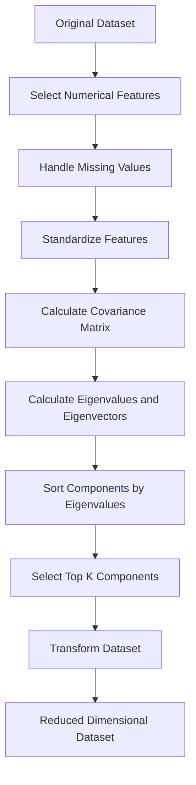
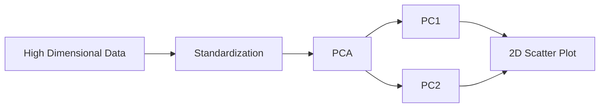
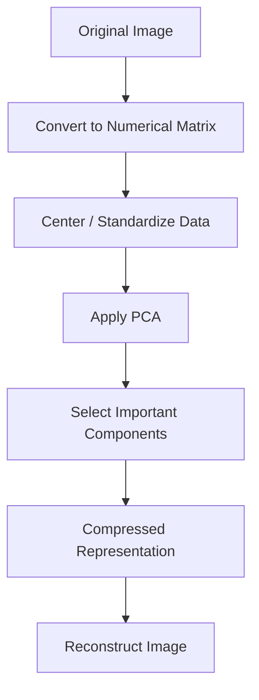
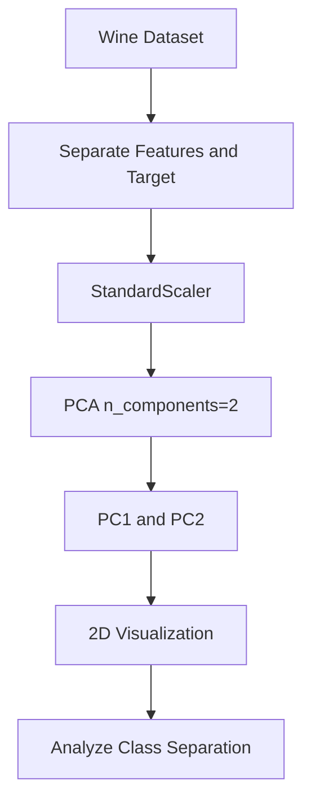
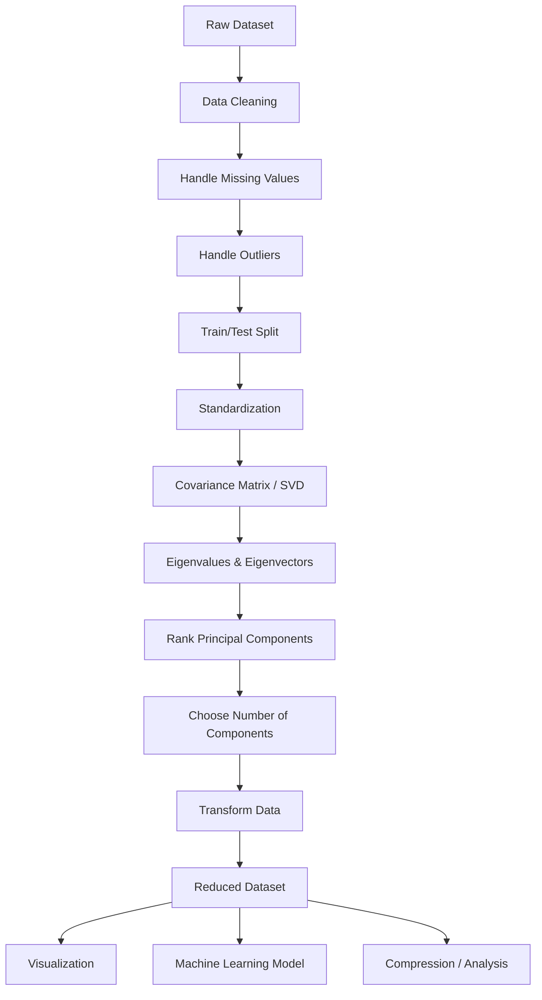

# 📊 Principal Component Analysis (PCA) in Machine Learning

> **Note:** The standard term is **Principal Component Analysis (PCA)**.

---

## 📚 Table of Contents

1. [Introduction](#1--introduction)
2. [What is PCA?](#2--what-is-pca)
3. [Why Do We Need PCA?](#3--why-do-we-need-pca)
4. [Key Terminology](#4--key-terminology)
5. [Core Idea Behind PCA](#5--core-idea-behind-pca)
6. [How PCA Works](#6--how-pca-works)
7. [Mathematical Foundation](#7--mathematical-foundation)
8. [PCA Workflow](#8--pca-workflow)
9. [Step-by-Step PCA Algorithm](#9--step-by-step-pca-algorithm)
10. [Practical Example](#10--practical-example)
11. [PCA Using Python and Scikit-Learn](#11--pca-using-python-and-scikit-learn)
12. [Choosing the Number of Components](#12--choosing-the-number-of-components)
13. [Explained Variance](#13--explained-variance)
14. [PCA Visualization](#14--pca-visualization)
15. [PCA Before Machine Learning](#15--pca-before-machine-learning)
16. [PCA for Image Compression](#16--pca-for-image-compression)
17. [PCA for Noise Reduction](#17--pca-for-noise-reduction)
18. [PCA vs Feature Selection](#18--pca-vs-feature-selection)
19. [PCA vs Other Dimensionality Reduction Techniques](#19--pca-vs-other-dimensionality-reduction-techniques)
20. [Advantages](#20--advantages)
21. [Limitations](#21--limitations)
22. [Common Mistakes](#22--common-mistakes)
23. [Best Practices](#23--best-practices)
24. [Advanced PCA Concepts](#24--advanced-pca-concepts)
25. [Real-World Applications](#25--real-world-applications)
26. [Mini Project](#26--mini-project)
27. [Interview Questions](#27--interview-questions)
28. [Quick Revision](#28--quick-revision)
29. [Visual Summary](#29--visual-summary)

---

# 1. 🚀 Introduction

Machine Learning datasets often contain many features.

For example, a customer dataset might contain:

* Age
* Income
* Spending Score
* Number of Purchases
* Website Visits
* Time Spent Online
* Credit Score
* Loan Amount
* Account Balance

Having many features can create several problems:

* Higher computational cost
* More memory usage
* Difficult visualization
* Multicollinearity
* Increased model complexity
* Risk of overfitting
* Difficulty interpreting high-dimensional data

**Principal Component Analysis (PCA)** is one of the most widely used **dimensionality reduction** techniques for addressing these problems.

---

# 2. 📌 What is PCA?

**Principal Component Analysis (PCA)** is an **unsupervised dimensionality reduction technique** that transforms a dataset with many correlated features into a smaller set of new, uncorrelated variables called **principal components**.

The goal is to preserve as much information, measured primarily by **variance**, as possible while reducing the number of dimensions.

### Simple Definition

> PCA transforms the original features into a new set of features called principal components, ordered according to how much variance they explain.

### Example

Suppose we have:

```text
100 original features
        ↓
       PCA
        ↓
10 principal components
```

Instead of training a model using 100 features, we may train it using only 10 components while retaining most of the dataset's variance.

---

# 3. 🎯 Why Do We Need PCA?

## 3.1 High Dimensionality

Datasets with hundreds or thousands of features can become difficult to process.

```text
Low Dimensions
     ↓
Easy visualization
Easy computation
Easy analysis

High Dimensions
     ↓
More computation
More complexity
Harder visualization
Potential overfitting
```

---

## 3.2 Curse of Dimensionality

As the number of features increases, the volume of the feature space grows dramatically.

This can make data points sparse and negatively affect some machine learning algorithms.

PCA can reduce the number of dimensions while preserving important patterns.

---

## 3.3 Multicollinearity

Consider:

| Feature         | Meaning  |
| --------------- | -------- |
| Annual Income   | ₹500,000 |
| Monthly Income  | ₹41,667  |
| Salary per Year | ₹500,000 |

These features contain highly overlapping information.

PCA can transform correlated features into uncorrelated principal components.

---

## 3.4 Visualization

Humans can easily visualize:

* 1D
* 2D
* 3D

But visualizing 50 or 500 dimensions is impossible directly.

PCA can reduce:

```text
50 Dimensions
      ↓
     PCA
      ↓
2 Dimensions
      ↓
Scatter Plot
```

---

## 3.5 Computational Efficiency

Reducing features can make machine learning algorithms:

* Faster
* Less memory-intensive
* Easier to train

---

# 4. 📖 Key Terminology

| Term                     | Meaning                                            |
| ------------------------ | -------------------------------------------------- |
| Feature                  | Original variable/column                           |
| Dimension                | Number of features                                 |
| Dimensionality Reduction | Reducing number of features                        |
| Principal Component      | New feature created by PCA                         |
| Variance                 | Measure of data spread                             |
| Covariance               | Measures how two variables vary together           |
| Eigenvalue               | Represents variance captured by a component        |
| Eigenvector              | Direction of a principal component                 |
| Explained Variance       | Amount of variance captured                        |
| Explained Variance Ratio | Percentage of total variance captured              |
| Loading                  | Contribution of original features to a component   |
| Transformation           | Converting original data into principal components |

---

# 5. 🧠 Core Idea Behind PCA

Imagine a collection of data points:

```text
Feature 2
   ↑
   |                 •
   |             •
   |          •
   |       •
   |    •
   | •
   +------------------------→ Feature 1
```

The data follows a strong direction.

PCA attempts to find the directions along which the data varies the most.

These directions become:

```text
First Principal Component
        ↓
Maximum variance

Second Principal Component
        ↓
Maximum remaining variance

Third Principal Component
        ↓
Next maximum remaining variance
```

---

# 6. ⚙️ How PCA Works

The PCA process can be represented as:



---

# 7. 🧮 Mathematical Foundation

PCA is based on concepts from linear algebra and statistics.

The important mathematical concepts are:

1. Mean
2. Standard deviation
3. Standardization
4. Covariance
5. Covariance matrix
6. Eigenvalues
7. Eigenvectors
8. Projection
9. Explained variance

---

## 7.1 Mean

For values:

```text
x₁, x₂, x₃, ..., xₙ
```

The mean is:

[
\mu = \frac{1}{n}\sum_{i=1}^{n}x_i
]

---

## 7.2 Standardization

PCA is sensitive to feature scale.

The standardization formula is:

[
z = \frac{x-\mu}{\sigma}
]

Where:

* (x) = original value
* (\mu) = mean
* (\sigma) = standard deviation
* (z) = standardized value

After standardization:

```text
Mean ≈ 0
Standard Deviation ≈ 1
```

---

## 7.3 Covariance

Covariance measures how two variables change together.

[
Cov(X,Y)=\frac{\sum(X_i-\bar X)(Y_i-\bar Y)}{n-1}
]

Interpretation:

| Covariance | Meaning                                 |
| ---------- | --------------------------------------- |
| Positive   | Variables tend to increase together     |
| Negative   | One increases while the other decreases |
| Near 0     | Weak linear relationship                |

---

## 7.4 Covariance Matrix

For multiple features:

[
X_1, X_2, X_3
]

The covariance matrix looks like:

[
C =
\begin{bmatrix}
Cov(X_1,X_1) & Cov(X_1,X_2) & Cov(X_1,X_3)\
Cov(X_2,X_1) & Cov(X_2,X_2) & Cov(X_2,X_3)\
Cov(X_3,X_1) & Cov(X_3,X_2) & Cov(X_3,X_3)
\end{bmatrix}
]

The diagonal contains variances.

The off-diagonal elements contain covariances.

---

# 8. 🔬 Eigenvalues and Eigenvectors

Eigenvalues and eigenvectors are central to PCA.

## 8.1 Eigenvector

An eigenvector represents a **direction** in the feature space.

In PCA:

> Eigenvectors determine the directions of the principal components.

---

## 8.2 Eigenvalue

An eigenvalue indicates how much variance is captured along its corresponding eigenvector.

Higher eigenvalue:

```text
Higher eigenvalue
       ↓
More variance
       ↓
More important component
```

---

## 8.3 Example

Suppose PCA produces:

| Component | Eigenvalue |
| --------- | ---------: |
| PC1       |        5.2 |
| PC2       |        2.1 |
| PC3       |        0.7 |
| PC4       |        0.2 |

PC1 contains the most variance.

Therefore:

```text
PC1 > PC2 > PC3 > PC4
```

in terms of explained variance.

---

# 9. 🧩 Step-by-Step PCA Algorithm

Suppose the dataset contains:

```text
X = [Feature1, Feature2, Feature3, Feature4]
```

### Step 1 — Collect the data

Start with the original feature matrix.

### Step 2 — Handle missing values

PCA generally requires complete numerical input.

Apply suitable imputation techniques when required.

### Step 3 — Standardize the data

Bring features to a comparable scale.

### Step 4 — Calculate covariance matrix

Determine relationships between features.

### Step 5 — Calculate eigenvalues and eigenvectors

Find important directions in the data.

### Step 6 — Sort eigenvalues

Sort components from largest eigenvalue to smallest.

### Step 7 — Select top K components

Choose the number of dimensions you want to retain.

### Step 8 — Project the data

Transform original observations into the new component space.

---

# 10. 🧪 Practical Example

Suppose we have student data:

| Student | Math | Physics | Chemistry |
| ------- | ---: | ------: | --------: |
| A       |   90 |      88 |        92 |
| B       |   75 |      78 |        80 |
| C       |   60 |      62 |        58 |
| D       |   95 |      93 |        96 |
| E       |   70 |      73 |        68 |

These features are strongly correlated.

Instead of:

```text
Math
Physics
Chemistry
```

PCA may generate:

```text
PC1
PC2
PC3
```

If:

```text
PC1 = 92% variance
PC2 = 6% variance
PC3 = 2% variance
```

we can potentially retain only PC1.

```text
3 Features
    ↓
   PCA
    ↓
1 Component
```

This significantly reduces dimensionality.

---

# 11. 🐍 PCA Using Python and Scikit-Learn

## 11.1 Import Libraries

```python
import numpy as np
import pandas as pd

from sklearn.preprocessing import StandardScaler
from sklearn.decomposition import PCA
```

---

## 11.2 Create Example Dataset

```python
data = {
    "Math": [90, 75, 60, 95, 70],
    "Physics": [88, 78, 62, 93, 73],
    "Chemistry": [92, 80, 58, 96, 68]
}

df = pd.DataFrame(data)

print(df)
```

---

## 11.3 Standardize the Data

```python
scaler = StandardScaler()

X_scaled = scaler.fit_transform(df)
```

### Why?

Because PCA is affected by feature scale.

---

## 11.4 Apply PCA

```python
pca = PCA(n_components=2)

X_pca = pca.fit_transform(X_scaled)

print(X_pca)
```

Now:

```text
3 original features
        ↓
       PCA
        ↓
2 principal components
```

---

## 11.5 Check Explained Variance

```python
print(pca.explained_variance_ratio_)
```

Example:

```text
[0.95 0.04]
```

This means:

```text
PC1 → 95%
PC2 → 4%
```

Together:

```text
99% variance retained
```

---

## 11.6 Check Total Explained Variance

```python
print(pca.explained_variance_ratio_.sum())
```

---

# 12. 🎚️ Choosing the Number of Components

One of the most important PCA decisions is:

> How many principal components should we retain?

There are several approaches.

---

## 12.1 Explained Variance Threshold

We can select components that preserve a desired percentage of variance.

For example:

```python
pca = PCA(n_components=0.95)
```

This means:

> Keep enough components to preserve approximately 95% of the variance.

Other common thresholds:

```python
PCA(n_components=0.90)
PCA(n_components=0.95)
PCA(n_components=0.99)
```

---

## 12.2 Scree Plot

A scree plot shows explained variance by component.

```python
import matplotlib.pyplot as plt

pca = PCA()
pca.fit(X_scaled)

plt.plot(
    range(1, len(pca.explained_variance_ratio_) + 1),
    pca.explained_variance_ratio_,
    marker="o"
)

plt.xlabel("Principal Component")
plt.ylabel("Explained Variance Ratio")
plt.title("Scree Plot")
plt.show()
```

Look for an **elbow point** where additional components provide relatively little improvement.

---

## 12.3 Cumulative Explained Variance

```python
cumulative_variance = np.cumsum(
    pca.explained_variance_ratio_
)

print(cumulative_variance)
```

Example:

| Components | Cumulative Variance |
| ---------: | ------------------: |
|          1 |                 60% |
|          2 |                 78% |
|          3 |                 89% |
|          4 |                 95% |
|          5 |                 98% |
|          6 |                 99% |

If the target is 95%, choose 4 components.

---

# 13. 📈 Explained Variance

Explained variance tells us how much information is retained by each principal component.

Suppose:

```text
PC1 → 55%
PC2 → 25%
PC3 → 10%
PC4 → 5%
PC5 → 3%
PC6 → 2%
```

Then:

```text
PC1 + PC2 = 80%
PC1 + PC2 + PC3 = 90%
PC1 + PC2 + PC3 + PC4 = 95%
```

Therefore, four components preserve approximately 95% of the variance.

---

## Explained Variance Ratio Formula

[
EVR_i =
\frac{\lambda_i}
{\sum_{j=1}^{p}\lambda_j}
]

Where:

* (\lambda_i) = eigenvalue of component (i)
* (p) = total number of components

---

# 14. 📊 PCA Visualization

PCA is commonly used to reduce high-dimensional datasets to 2D or 3D for visualization.

## 14.1 2D PCA

```python
import matplotlib.pyplot as plt

pca = PCA(n_components=2)

X_pca = pca.fit_transform(X_scaled)

plt.figure(figsize=(8, 6))

plt.scatter(
    X_pca[:, 0],
    X_pca[:, 1]
)

plt.xlabel("Principal Component 1")
plt.ylabel("Principal Component 2")
plt.title("PCA - 2D Visualization")

plt.show()
```

---

## 14.2 PCA Workflow for Visualization



---

# 15. 🤖 PCA Before Machine Learning

PCA can be used as a preprocessing step before training a model.

Example:

```text
Raw Dataset
     ↓
Data Cleaning
     ↓
Feature Scaling
     ↓
PCA
     ↓
Reduced Features
     ↓
Machine Learning Model
     ↓
Prediction
```

---

## Example

```python
from sklearn.pipeline import Pipeline
from sklearn.preprocessing import StandardScaler
from sklearn.decomposition import PCA
from sklearn.linear_model import LogisticRegression

pipeline = Pipeline([
    ("scaler", StandardScaler()),
    ("pca", PCA(n_components=0.95)),
    ("model", LogisticRegression())
])

pipeline.fit(X_train, y_train)

y_pred = pipeline.predict(X_test)
```

### Why use a Pipeline?

It ensures the preprocessing steps are applied consistently.

More importantly, when used correctly with train/test data, it helps prevent **data leakage**.

---

# 16. 🖼️ PCA for Image Compression

Images can contain thousands or millions of pixel values.

For example:

```text
100 × 100 image
     ↓
10,000 pixel values
```

PCA can reduce the dimensionality of image data.

```text
10,000 dimensions
       ↓
      PCA
       ↓
500 components
```

The reconstructed image may still look similar while requiring fewer dimensions.

---

## Conceptual Process



---

# 17. 🔇 PCA for Noise Reduction

Some dimensions may primarily contain noise.

If those dimensions have very low variance, they can sometimes be removed.

```text
Original Data
     ↓
PCA
     ↓
High-variance components → Keep
Low-variance components → Remove
     ↓
Reduced Noise
```

However, **low variance does not automatically mean useless information**. Care must be taken when deciding which components to remove.

---

# 18. 🔍 PCA vs Feature Selection

These concepts are often confused.

## Feature Selection

Selects existing features.

Example:

```text
Original:
Age
Salary
Height
Weight
Experience

Selected:
Age
Salary
Experience
```

The original columns remain unchanged.

---

## PCA

Creates new features.

```text
Age
Salary
Height
Weight
Experience
        ↓
       PCA
        ↓
PC1
PC2
PC3
```

The new components are combinations of the original features.

### Comparison

| Feature Selection                  | PCA                                      |
| ---------------------------------- | ---------------------------------------- |
| Selects original features          | Creates new features                     |
| Preserves original meaning         | Components may be difficult to interpret |
| Easier to explain                  | Harder to explain                        |
| Can use domain knowledge           | Primarily variance-driven                |
| No feature transformation required | Requires transformation                  |

---

# 19. ⚖️ PCA vs Other Dimensionality Reduction Techniques

| Technique         | Type               | Main Purpose                    | Non-linear? | Common Use                       |
| ----------------- | ------------------ | ------------------------------- | ----------- | -------------------------------- |
| PCA               | Linear             | Variance preservation           | ❌           | General dimensionality reduction |
| LDA               | Supervised         | Class separation                | ❌           | Classification                   |
| t-SNE             | Non-linear         | Visualization                   | ✅           | Cluster visualization            |
| UMAP              | Non-linear         | Visualization/manifold learning | ✅           | High-dimensional visualization   |
| Autoencoder       | Neural network     | Representation learning         | ✅           | Complex data                     |
| Feature Selection | Variable selection | Remove irrelevant features      | Depends     | Model simplification             |

---

## PCA vs LDA

### PCA

* Unsupervised
* Does not use target labels
* Maximizes variance

### LDA

* Supervised
* Uses class labels
* Maximizes class separability

---

## PCA vs t-SNE

| PCA                            | t-SNE                                |
| ------------------------------ | ------------------------------------ |
| Linear                         | Non-linear                           |
| Fast                           | Relatively computationally expensive |
| Preserves global variance      | Focuses heavily on local structure   |
| Useful preprocessing technique | Primarily visualization              |
| Deterministic in standard PCA  | Can vary depending on settings       |

---

# 20. ✅ Advantages

## 20.1 Reduces Dimensionality

Transforms many features into fewer components.

## 20.2 Reduces Computational Cost

Fewer dimensions can mean faster processing.

## 20.3 Helps Visualization

High-dimensional data can be represented in 2D or 3D.

## 20.4 Handles Multicollinearity

Principal components are orthogonal to each other.

## 20.5 Can Reduce Noise

Low-variance components may sometimes represent noise.

## 20.6 Useful for Data Compression

PCA can represent data using fewer dimensions.

---

# 21. ⚠️ Limitations

## 21.1 Loss of Interpretability

Original features may be transformed into combinations that are difficult to understand.

For example:

```text
PC1 =
0.52 × Age
+ 0.43 × Income
- 0.28 × Debt
+ ...
```

It may be difficult to give PC1 a simple business meaning.

---

## 21.2 Sensitive to Scaling

If features have very different scales, PCA may be dominated by high-scale features.

---

## 21.3 Sensitive to Outliers

Extreme observations can strongly affect variance and therefore PCA directions.

---

## 21.4 Only Captures Linear Relationships

Traditional PCA is a linear dimensionality reduction technique.

Non-linear relationships may require:

* Kernel PCA
* Autoencoders
* UMAP
* t-SNE

---

## 21.5 Information Can Be Lost

Reducing dimensions inevitably discards some information unless all components are retained.

---

# 22. ❌ Common Mistakes

## Mistake 1 — Not Scaling Features

Bad:

```python
pca.fit_transform(X)
```

when features have very different scales.

Better:

```python
X_scaled = StandardScaler().fit_transform(X)

X_pca = PCA(
    n_components=2
).fit_transform(X_scaled)
```

---

## Mistake 2 — Applying PCA Before Train/Test Split

Avoid:

```python
X_scaled = scaler.fit_transform(X)

X_pca = PCA().fit_transform(X_scaled)

X_train, X_test = train_test_split(X_pca)
```

This can cause information from the future test set to influence preprocessing.

Better:

```text
Split
 ↓
Fit preprocessing on training data
 ↓
Transform training data
 ↓
Transform test data
```

Or use a pipeline.

---

## Mistake 3 — Ignoring Outliers

Outliers can significantly affect PCA.

Always investigate unusual observations before applying PCA.

---

## Mistake 4 — Automatically Choosing 2 Components

Two components are useful for visualization, but they may not preserve enough information for modeling.

---

## Mistake 5 — Assuming PCA Always Improves Accuracy

PCA does not guarantee better model performance.

It may:

* Improve performance
* Reduce performance
* Have little effect

Always evaluate the final model.

---

## Mistake 6 — Applying PCA to Categorical Variables Directly

PCA is designed primarily for numerical data.

Categorical variables should generally be encoded appropriately before dimensionality reduction, and whether PCA is appropriate depends on the encoding and problem.

---

# 23. 🏆 Best Practices

### 1. Clean the dataset first

Handle:

* Missing values
* Invalid values
* Duplicates
* Outliers

### 2. Scale numerical features

Use:

```python
StandardScaler()
```

when appropriate.

### 3. Split before fitting preprocessing

```text
Train/Test Split
       ↓
Fit Scaler on Train
       ↓
Transform Train
       ↓
Transform Test
       ↓
Fit PCA on Train
       ↓
Transform Test
```

### 4. Use a Pipeline

```python
Pipeline([
    ("scaler", StandardScaler()),
    ("pca", PCA(n_components=0.95)),
    ("model", LogisticRegression())
])
```

### 5. Monitor explained variance

```python
pca.explained_variance_ratio_
```

### 6. Evaluate downstream model performance

Compare:

```text
Model without PCA
vs
Model with PCA
```

### 7. Consider interpretability

If business users need understandable features, PCA may not always be the best choice.

---

# 24. 🧠 Advanced PCA Concepts

## 24.1 Principal Components

Principal components are new orthogonal axes created from linear combinations of the original features.

The first component captures the maximum variance.

The second captures the maximum remaining variance while being orthogonal to PC1.

---

## 24.2 Component Loadings

Loadings indicate how strongly original features contribute to a principal component.

Example:

| Feature  | PC1 Loading |
| -------- | ----------: |
| Income   |        0.72 |
| Spending |        0.61 |
| Age      |        0.14 |
| Debt     |       -0.08 |

Income and Spending have relatively strong contributions to PC1.

---

## 24.3 Orthogonality

Principal components are orthogonal to one another.

Conceptually:

```text
PC1 ⟂ PC2
PC2 ⟂ PC3
PC1 ⟂ PC3
```

This means the components are uncorrelated in the covariance-based PCA setting.

---

## 24.4 Kernel PCA

Traditional PCA handles linear relationships.

Kernel PCA extends PCA to non-linear structures using kernel methods.

Common kernels include:

* RBF
* Polynomial
* Sigmoid

Example:

```python
from sklearn.decomposition import KernelPCA

kpca = KernelPCA(
    n_components=2,
    kernel="rbf"
)

X_kpca = kpca.fit_transform(X_scaled)
```

---

## 24.5 Incremental PCA

Incremental PCA is useful for very large datasets that may not fit comfortably into memory.

```python
from sklearn.decomposition import IncrementalPCA

ipca = IncrementalPCA(
    n_components=10
)
```

It processes data in batches.

---

## 24.6 Sparse PCA

Sparse PCA attempts to produce components that depend on fewer original features.

This can improve interpretability compared with standard PCA in some applications.

---

## 24.7 Randomized PCA

For large datasets, randomized algorithms can efficiently approximate the principal components.

Scikit-learn can use randomized solvers automatically for suitable configurations.

---

## 24.8 PCA Using Singular Value Decomposition

PCA can be computed using **Singular Value Decomposition (SVD)**.

Given a centered matrix (X):

[
X = U\Sigma V^T
]

Where:

* (U) = left singular vectors
* (\Sigma) = singular values
* (V^T) = right singular vectors

The principal directions are related to the right singular vectors.

Scikit-learn's PCA implementation uses SVD-based methods rather than explicitly requiring users to calculate the covariance matrix and its eigenvectors manually.

---

# 25. 🌍 Real-World Applications

## 25.1 Computer Vision

PCA can be used for:

* Image compression
* Face recognition
* Feature extraction
* Image preprocessing

---

## 25.2 Finance

Possible applications:

* Stock analysis
* Risk factor analysis
* Portfolio analysis
* Economic indicators

For example:

```text
100 Financial Indicators
          ↓
         PCA
          ↓
10 Major Factors
```

---

## 25.3 Healthcare

PCA can help analyze datasets containing many measurements such as:

* Blood parameters
* Imaging features
* Genetic measurements
* Patient characteristics

---

## 25.4 Marketing

Customer datasets may contain:

* Purchases
* Visits
* Spending
* Demographics
* Engagement

PCA can reduce correlated behavioral variables before further analysis.

---

## 25.5 Genomics

Genomic datasets can contain thousands of variables.

PCA can help:

* Visualize genetic variation
* Identify population structure
* Reduce dimensions
* Explore biological patterns

---

## 25.6 Sensor Data

Industrial systems may have hundreds of sensor measurements.

PCA can help detect:

* Patterns
* Redundancy
* Anomalies
* Operational changes

---

# 26. 🛠️ Mini Project — PCA on Wine Dataset

## Objective

Use PCA to reduce the dimensionality of the Wine dataset and visualize the classes in 2D.

---

## Step 1 — Import Dataset

```python
import matplotlib.pyplot as plt

from sklearn.datasets import load_wine
from sklearn.preprocessing import StandardScaler
from sklearn.decomposition import PCA
```

---

## Step 2 — Load Data

```python
wine = load_wine()

X = wine.data
y = wine.target

print(X.shape)
```

The dataset contains multiple numerical features.

---

## Step 3 — Standardize

```python
scaler = StandardScaler()

X_scaled = scaler.fit_transform(X)
```

---

## Step 4 — Apply PCA

```python
pca = PCA(n_components=2)

X_pca = pca.fit_transform(X_scaled)

print(X_pca.shape)
```

---

## Step 5 — Check Explained Variance

```python
print(pca.explained_variance_ratio_)
```

---

## Step 6 — Visualize

```python
plt.figure(figsize=(8, 6))

plt.scatter(
    X_pca[:, 0],
    X_pca[:, 1],
    c=y
)

plt.xlabel("Principal Component 1")
plt.ylabel("Principal Component 2")
plt.title("Wine Dataset - PCA")

plt.show()
```

---

## Project Workflow



---

## Project Questions

After completing the project, investigate:

1. How much variance does PC1 explain?
2. How much variance does PC2 explain?
3. What percentage of variance is retained?
4. Are wine classes visually separated?
5. Which original features have high PC1 loadings?
6. Does using 3 components improve class separation?
7. Does PCA improve classification performance?

---

# 27. 🎤 Interview Questions

## Q1. What is PCA?

PCA is an unsupervised linear dimensionality reduction technique that transforms correlated features into a smaller set of orthogonal principal components while retaining maximum possible variance.

---

## Q2. Is PCA supervised or unsupervised?

**PCA is unsupervised.**

It does not use target labels when finding principal components.

---

## Q3. Why is scaling important before PCA?

PCA is variance-based. Features with larger scales can dominate the variance.

Standardization puts features on a comparable scale.

---

## Q4. What is the first principal component?

The first principal component is the direction that captures the maximum variance in the data.

---

## Q5. What does an eigenvalue represent in PCA?

An eigenvalue represents the amount of variance captured by its corresponding principal component.

---

## Q6. What does an eigenvector represent?

An eigenvector represents the direction of a principal component.

---

## Q7. Are principal components correlated?

Principal components are orthogonal and therefore uncorrelated under standard covariance-based PCA.

---

## Q8. Does PCA select existing features?

No.

PCA creates new features called principal components.

---

## Q9. Can PCA be used for categorical data?

Standard PCA is designed for numerical data. Categorical data requires appropriate handling, and alternative methods may sometimes be more suitable.

---

## Q10. Can PCA improve model performance?

It can, but it is not guaranteed.

Performance depends on:

* Dataset
* Model
* Noise
* Number of components
* Feature relationships

---

## Q11. What is explained variance ratio?

It represents the proportion of total variance captured by each principal component.

---

## Q12. What happens if we retain all components?

There is effectively no dimensionality reduction.

The transformed representation retains the full dimensional information, subject to numerical precision.

---

## Q13. What is the difference between PCA and LDA?

| PCA                                         | LDA                                          |
| ------------------------------------------- | -------------------------------------------- |
| Unsupervised                                | Supervised                                   |
| Maximizes variance                          | Maximizes class separation                   |
| Does not require labels                     | Requires labels                              |
| Useful for general dimensionality reduction | Useful for classification-oriented reduction |

---

## Q14. What is Kernel PCA?

Kernel PCA extends PCA to capture non-linear relationships using kernel functions.

---

## Q15. What is Incremental PCA?

Incremental PCA performs PCA in batches and is useful for datasets that are too large to process comfortably in memory at once.

---

# 28. ⚡ Quick Revision

## 📝 Key Points

* PCA stands for **Principal Component Analysis**.
* PCA is an **unsupervised** dimensionality reduction technique.
* PCA is primarily a **linear** technique.
* It transforms original features into **principal components**.
* PC1 captures the maximum variance.
* PC2 captures the maximum remaining variance subject to orthogonality.
* Principal components are uncorrelated.
* Eigenvectors determine component directions.
* Eigenvalues determine the variance captured.
* Scaling is usually important before PCA.
* Explained variance ratio helps choose the number of components.
* PCA can help visualization, compression, preprocessing, and noise reduction.
* PCA may reduce interpretability.
* PCA is sensitive to outliers and feature scaling.
* PCA does not guarantee improved model accuracy.
* PCA should be fitted only on training data when used in supervised ML pipelines.

---

## 🧮 Important Formulas

### Standardization

[
z = \frac{x-\mu}{\sigma}
]

### Covariance

[
Cov(X,Y)=
\frac{\sum(X_i-\bar X)(Y_i-\bar Y)}
{n-1}
]

### Explained Variance Ratio

[
EVR_i =
\frac{\lambda_i}
{\sum_{j=1}^{p}\lambda_j}
]

### SVD

[
X = U\Sigma V^T
]

---

## 💻 Important Python Commands

### Standardization

```python
from sklearn.preprocessing import StandardScaler

scaler = StandardScaler()
X_scaled = scaler.fit_transform(X)
```

### PCA

```python
from sklearn.decomposition import PCA

pca = PCA(n_components=2)
X_pca = pca.fit_transform(X_scaled)
```

### Explained Variance

```python
pca.explained_variance_ratio_
```

### Total Explained Variance

```python
pca.explained_variance_ratio_.sum()
```

### Automatic 95% Variance

```python
pca = PCA(n_components=0.95)
```

### PCA Components

```python
pca.components_
```

### Eigenvalues

```python
pca.explained_variance_
```

---

## 📋 PCA Cheat Sheet

| Concept            | Remember                         |
| ------------------ | -------------------------------- |
| PCA                | Dimensionality reduction         |
| Type               | Unsupervised                     |
| Main objective     | Maximize variance                |
| PC1                | Maximum variance                 |
| PC2                | Next maximum variance            |
| Eigenvalue         | Variance captured                |
| Eigenvector        | Component direction              |
| Scaling            | Usually important                |
| Output             | New principal components         |
| Components         | Orthogonal                       |
| Explained variance | Information retained             |
| Main weakness      | Reduced interpretability         |
| Linear PCA         | Captures linear structure        |
| Kernel PCA         | Can capture non-linear structure |
| Incremental PCA    | Useful for large datasets        |

---

# 29. 🗺️ Visual Summary



---

# 🎯 PCA Learning Roadmap

```text
                PCA
                 │
        ┌────────┴────────┐
        ↓                 ↓
   Fundamentals      Mathematics
        │                 │
        ├─ Dimensions     ├─ Mean
        ├─ Variance       ├─ Covariance
        ├─ Components     ├─ Eigenvalues
        └─ Scaling        └─ Eigenvectors
                 │
                 ↓
            PCA Algorithm
                 │
        ┌────────┴────────┐
        ↓                 ↓
   Standard PCA      Advanced PCA
        │                 │
        ├─ PCA             ├─ Kernel PCA
        ├─ SVD             ├─ Sparse PCA
        ├─ EVR             └─ Incremental PCA
        └─ Scree Plot
                 │
                 ↓
          Practical Uses
                 │
        ┌────────┼────────┐
        ↓        ↓        ↓
    ML Models  Images  Visualization
        │        │        │
        └────────┼────────┘
                 ↓
          Evaluate Results
                 │
        ┌────────┴────────┐
        ↓                 ↓
 Explained Variance   Model Performance
```

---

# 🔑 Final Takeaway

> **PCA reduces the number of dimensions by transforming correlated original features into a smaller set of orthogonal principal components that preserve as much variance as possible.**

The most important PCA workflow to remember is:

```text
Clean Data
   ↓
Split Data
   ↓
Scale Features
   ↓
Apply PCA
   ↓
Check Explained Variance
   ↓
Choose Components
   ↓
Transform Data
   ↓
Train / Visualize / Analyze
```

### ⭐ One-Line Interview Answer

> **PCA is an unsupervised linear dimensionality reduction technique that transforms correlated features into orthogonal principal components ordered by the amount of variance they explain.**
