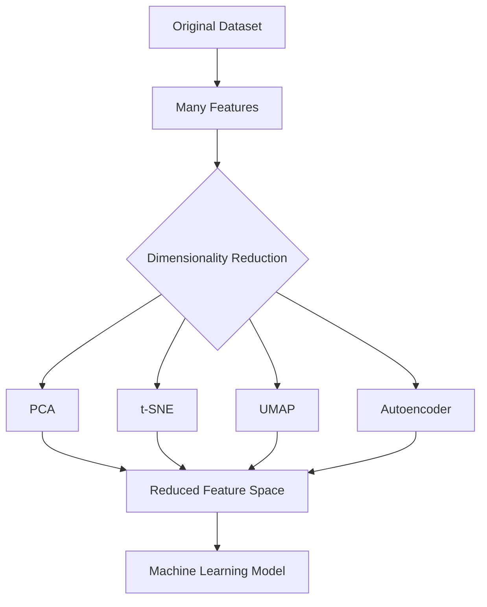
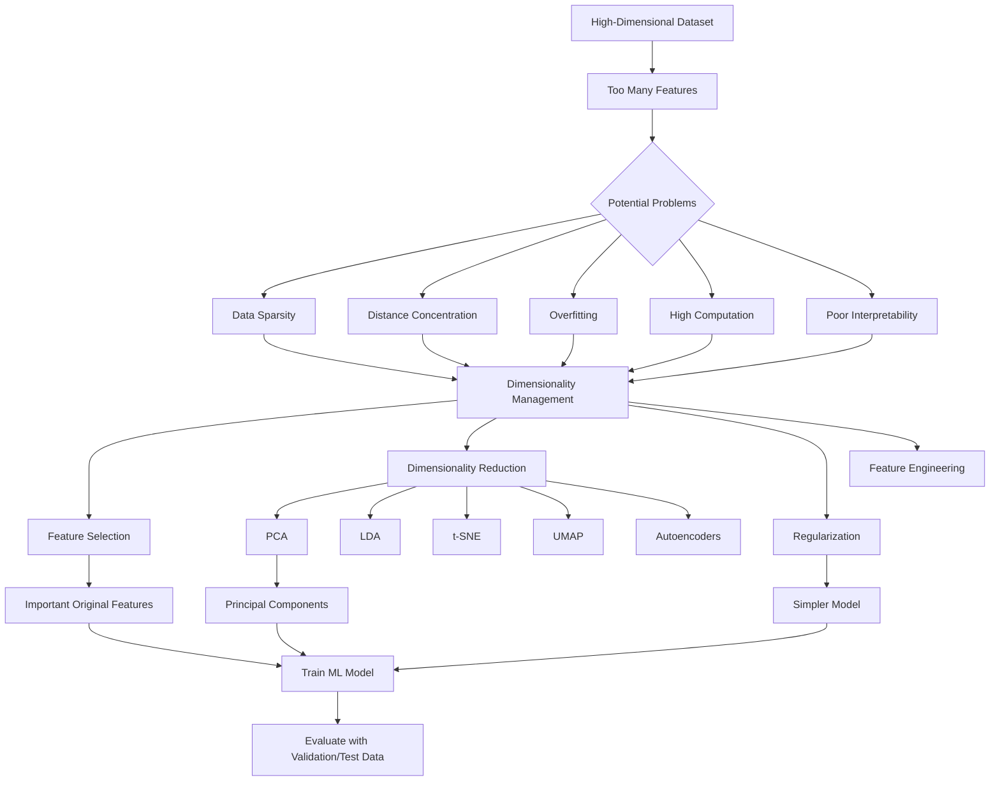

# 📘 Curse of Dimensionality in Machine Learning

> **The Curse of Dimensionality** refers to the problems that arise when the number of features (dimensions) in a dataset becomes very large relative to the number of observations. As dimensionality increases, data becomes increasingly sparse, distance measures become less meaningful, models require more data and computation, and the risk of overfitting increases.

---

## 📑 Table of Contents

1. [Introduction](#1--introduction)
2. [What Is Dimensionality?](#2--what-is-dimensionality)
3. [What Is the Curse of Dimensionality?](#3--what-is-the-curse-of-dimensionality)
4. [Why Does the Curse Occur?](#4--why-does-the-curse-occur)
5. [Key Effects of High Dimensionality](#5--key-effects-of-high-dimensionality)
6. [Geometric Intuition](#6--geometric-intuition)
7. [Data Sparsity](#7--data-sparsity)
8. [Distance Measures in High Dimensions](#8--distance-measures-in-high-dimensions)
9. [Nearest Neighbors and KNN](#9--nearest-neighbors-and-knn)
10. [Overfitting and High Dimensionality](#10--overfitting-and-high-dimensionality)
11. [Computational Complexity](#11--computational-complexity)
12. [Example: Increasing Dimensions](#12--example-increasing-dimensions)
13. [Curse of Dimensionality vs Overfitting](#13--curse-of-dimensionality-vs-overfitting)
14. [Dimensionality Reduction](#14--dimensionality-reduction)
15. [Feature Selection](#15--feature-selection)
16. [Feature Extraction](#16--feature-extraction)
17. [PCA for Dimensionality Reduction](#17--pca-for-dimensionality-reduction)
18. [Practical Python Example](#18--practical-python-example)
19. [Real-World Examples](#19--real-world-examples)
20. [Use Cases](#20--use-cases)
21. [Advantages of Handling High Dimensionality](#21--advantages-of-handling-high-dimensionality)
22. [Limitations and Challenges](#22--limitations-and-challenges)
23. [Best Practices](#23--best-practices)
24. [Common Mistakes](#24--common-mistakes)
25. [Advanced Concepts](#25--advanced-concepts)
26. [Practical Mini-Project](#26--practical-mini-project)
27. [Interview Questions and Points](#27--interview-questions-and-points)
28. [Quick Revision](#28--quick-revision)

---

# 1. 🌱 Introduction

Machine Learning models learn patterns from data.

A dataset may contain:

* Age
* Salary
* Education
* Experience
* Location
* Purchase history
* Browser activity
* Sensor measurements
* Images
* Text features

Each feature represents a **dimension**.

For example:

| Dataset                 | Number of Features | Dimensionality |
| ----------------------- | -----------------: | -------------: |
| Student dataset         |                  5 |             5D |
| Customer dataset        |                 20 |            20D |
| Gene expression dataset |            10,000+ |       10,000+D |
| Image dataset           |    100,000+ pixels |      100,000+D |

When the number of dimensions becomes very large, several Machine Learning problems appear.

This phenomenon is called the:

> ## ⚠️ Curse of Dimensionality

---

# 2. 📐 What Is Dimensionality?

**Dimensionality** refers to the number of features or variables used to represent each data point.

Suppose we have:

```text
Age → Feature 1
Salary → Feature 2
Experience → Feature 3
```

The dataset has **3 dimensions**.

Mathematically, a data point can be represented as:

[
X = (x_1,x_2,x_3,\dots,x_d)
]

where:

* (d) = number of dimensions/features
* (x_i) = value of feature (i)

### Example

```text
X = (25, 45000, 2)
```

This represents one observation with three features.

Therefore:

[
d = 3
]

---

# 3. ⚠️ What Is the Curse of Dimensionality?

The **Curse of Dimensionality** describes the difficulties caused by increasing the number of dimensions in a dataset.

As dimensionality increases:

```text
More Features
      ↓
Larger Search Space
      ↓
Data Becomes Sparse
      ↓
Distances Become Less Meaningful
      ↓
More Data Required
      ↓
Higher Computational Cost
      ↓
Higher Risk of Overfitting
```

### Simple Definition

> **Curse of Dimensionality is the collection of problems that occur when the number of features becomes very large, causing data sparsity, increased computation, unreliable distance measurements, and increased model complexity.**

---

# 4. 🔍 Why Does the Curse Occur?

The main reason is **exponential growth of the feature space**.

Imagine a feature can take values from 0 to 1.

### One dimension

```text
0 -------------------- 1
```

### Two dimensions

```text
+----------------+
|                |
|                |
|                |
+----------------+
```

### Three dimensions

```text
      +--------+
     /        /|
    +--------+ |
    |        | |
    |        | +
    |        |/
    +--------+
```

As dimensions increase, the available space grows dramatically.

For a hypercube with side length (L):

[
Volume = L^d
]

where (d) is the number of dimensions.

If:

[
L = 10
]

then:

| Dimensions |         Volume |
| ---------: | -------------: |
|          1 |             10 |
|          2 |            100 |
|          3 |          1,000 |
|          5 |        100,000 |
|         10 | 10,000,000,000 |

The space grows exponentially.

---

# 5. 📊 Key Effects of High Dimensionality

| Problem                | Effect                                               |
| ---------------------- | ---------------------------------------------------- |
| Data sparsity          | Data points become far apart                         |
| Distance concentration | Distances become increasingly similar                |
| Overfitting            | Model may learn noise                                |
| Computational cost     | Training and prediction become expensive             |
| Memory usage           | More features require more memory                    |
| Visualization          | Humans cannot easily visualize high-dimensional data |
| Feature redundancy     | Many features may contain similar information        |
| Model complexity       | More parameters may need to be estimated             |
| Sample requirement     | More observations may be required                    |

---

# 6. 📐 Geometric Intuition

Consider a dataset with 100 observations.

### In 1D

The points may cover a line reasonably well.

```text
● ●  ●   ● ● ●   ●    ●
-------------------------------->
```

### In 2D

The points spread across an area.

```text
●       ●

    ●

        ●      ●

  ●
```

### In 10D

The same 100 observations occupy only a tiny portion of the possible space.

```text
Huge 10-dimensional space
+----------------------------------+
|                                  |
|       •                           |
|                                  |
|                                  |
|                     •            |
|                                  |
+----------------------------------+
```

The result is **sparse data**.

---

# 7. 🕳️ Data Sparsity

## 7.1 What Is Data Sparsity?

Data is called **sparse** when observations occupy only a small portion of the available feature space.

As dimensions increase, the number of possible combinations increases rapidly.

### Example

Suppose every feature has 10 possible values.

For 2 features:

[
10^2 = 100
]

For 5 features:

[
10^5 = 100,000
]

For 10 features:

[
10^{10} = 10,000,000,000
]

Even with thousands or millions of observations, the space can remain largely empty.

---

## 7.2 Why Sparsity Is a Problem

Sparse data can cause:

* Poor generalization
* Unreliable nearest neighbors
* Difficulty estimating probability distributions
* Increased training requirements
* Poor clustering performance

---

# 8. 📏 Distance Measures in High Dimensions

Many Machine Learning algorithms depend on distance.

Examples:

* K-Nearest Neighbors
* K-Means
* DBSCAN
* Hierarchical clustering
* Recommendation systems

A common distance metric is **Euclidean distance**.

[
d(x,y)=\sqrt{\sum_{i=1}^{n}(x_i-y_i)^2}
]

For two dimensions:

[
d=\sqrt{(x_1-y_1)^2+(x_2-y_2)^2}
]

For 100 dimensions:

[
d=\sqrt{\sum_{i=1}^{100}(x_i-y_i)^2}
]

As dimensions increase, distances can become less informative.

---

## 8.1 Distance Concentration

In high-dimensional spaces:

> The difference between the nearest and farthest points can become relatively small.

In other words:

```text
Low Dimensions:

Nearest ----------------------------- Farthest
   ↑                                      ↑
Large difference


High Dimensions:

Nearest ---------------- Farthest
   ↑                         ↑
Small relative difference
```

This phenomenon is called **distance concentration**.

---

# 9. 🤖 Nearest Neighbors and KNN

KNN predicts an observation based on nearby observations.


KNN works well when "nearby" observations are actually similar.

However, in high dimensions:

```text
More Dimensions
      ↓
Distances Become Similar
      ↓
Nearest Neighbor Becomes Less Meaningful
      ↓
KNN Performance Can Decrease
```

### Example

Suppose we have:

```text
Age
Salary
Experience
Education
Location
Purchases
Browser
Device
...
1000 features
```

Two customers may appear close according to Euclidean distance, but their actual similarity may not be meaningful.

---

# 10. 🎯 Overfitting and High Dimensionality

Adding features increases the model's ability to fit the training data.

Suppose:

```text
100 observations
```

and:

```text
10 features
```

The model has a reasonable amount of information.

But if we use:

```text
100 observations
10,000 features
```

the model may find accidental patterns.

### Result

```text
High Number of Features
          ↓
More Model Flexibility
          ↓
Can Fit Noise
          ↓
Training Accuracy ↑
          ↓
Test Accuracy ↓
          ↓
Overfitting
```

---

# 11. 💻 Computational Complexity

More features require more computation.

Suppose:

```text
1,000 samples × 10 features
```

The dataset contains:

[
1,000 \times 10 = 10,000
]

feature values.

Now consider:

```text
1,000 samples × 10,000 features
```

The dataset contains:

[
1,000 \times 10,000 = 10,000,000
]

feature values.

This increases:

* Training time
* Prediction time
* Memory usage
* Storage requirements

---

# 12. 🧪 Example: Increasing Dimensions

Consider a hypercube.

The proportion of the space occupied by an inner region can shrink rapidly as dimensionality increases.

For example, consider the ratio:

[
r^d
]

where:

* (r) = fraction of side length
* (d) = dimensions

If:

[
r=0.5
]

then:

| Dimensions |  (0.5^d) |
| ---------: | -------: |
|          1 | 0.500000 |
|          2 | 0.250000 |
|          3 | 0.125000 |
|          5 | 0.031250 |
|         10 | 0.000977 |
|         20 | 0.000001 |

This illustrates how rapidly volume proportions shrink.

---

# 13. ⚖️ Curse of Dimensionality vs Overfitting

These concepts are related but not identical.

| Curse of Dimensionality                   | Overfitting                                          |
| ----------------------------------------- | ---------------------------------------------------- |
| Caused by high-dimensional feature spaces | Caused by model fitting noise                        |
| Includes sparsity and distance problems   | Primarily a generalization problem                   |
| Affects many algorithms                   | Can affect almost any flexible model                 |
| Increases data requirements               | Happens when model complexity is too high            |
| Can contribute to overfitting             | Can be reduced using regularization, more data, etc. |

### Relationship

```text
High Dimensionality
       ↓
More Features
       ↓
More Complex Feature Space
       ↓
Sparse Data + More Flexibility
       ↓
Higher Risk of Overfitting
```

---

# 14. 📉 Dimensionality Reduction

**Dimensionality reduction** means reducing the number of features while trying to preserve important information.

### General workflow



---

## 14.1 Common Dimensionality Reduction Techniques

| Technique         | Type           | Main Purpose                     |
| ----------------- | -------------- | -------------------------------- |
| PCA               | Linear         | Preserve maximum variance        |
| LDA               | Supervised     | Maximize class separation        |
| t-SNE             | Non-linear     | Visualization                    |
| UMAP              | Non-linear     | Visualization and embedding      |
| Autoencoder       | Neural network | Learn compressed representations |
| Feature selection | Selection      | Keep important original features |

---

# 15. 🧹 Feature Selection

Feature selection removes irrelevant or redundant features.

### Example

Suppose we have:

```text
Age
Salary
Experience
Height
Favorite Color
Random ID
Customer Name
```

Some features may not contribute meaningfully to prediction.

Feature selection might keep:

```text
Age
Salary
Experience
```

and remove:

```text
Random ID
Customer Name
Favorite Color
```

---

## 15.1 Types of Feature Selection

| Method   | Examples                                    |
| -------- | ------------------------------------------- |
| Filter   | Correlation, Chi-square, Mutual Information |
| Wrapper  | RFE                                         |
| Embedded | Lasso, Decision Tree feature importance     |

---

# 16. 🔄 Feature Selection vs Dimensionality Reduction

| Feature Selection            | Dimensionality Reduction                  |
| ---------------------------- | ----------------------------------------- |
| Selects existing features    | Creates new features                      |
| Original meaning preserved   | New components may be harder to interpret |
| Easier to explain            | Often harder to explain                   |
| Removes irrelevant variables | Compresses information                    |
| Example: RFE                 | Example: PCA                              |

### Example

Original:

```text
Age
Salary
Experience
Height
Weight
```

Feature selection:

```text
Age
Salary
Experience
```

PCA:

```text
PC1
PC2
```

The principal components are combinations of the original features.

---

# 17. 📊 PCA for Dimensionality Reduction

**Principal Component Analysis (PCA)** is one of the most commonly used dimensionality reduction techniques.

PCA transforms correlated features into a smaller number of uncorrelated components called **principal components**.

### PCA Workflow


---

## 17.1 Principal Components

A principal component is a linear combination of the original variables.

[
PC_1 = w_1X_1+w_2X_2+\cdots+w_nX_n
]

where:

* (X_i) = original features
* (w_i) = component weights

### PCA Objective

The first principal component captures the maximum possible variance.

The second component captures the maximum remaining variance while being orthogonal to the first.

---

## 17.2 Explained Variance

The **explained variance ratio** tells us how much information each principal component retains.

Example:

| Component | Explained Variance |
| --------- | -----------------: |
| PC1       |                45% |
| PC2       |                25% |
| PC3       |                15% |
| PC4       |                 8% |
| PC5       |                 7% |

Using the first 3 components:

[
45+25+15=85%
]

So approximately **85% of the variance** is retained.

---

# 18. 🐍 Practical Python Example

## 18.1 Creating a High-Dimensional Dataset

```python
from sklearn.datasets import make_classification

X, y = make_classification(
    n_samples=1000,
    n_features=100,
    n_informative=10,
    n_redundant=20,
    random_state=42
)

print(X.shape)
```

Output:

```text
(1000, 100)
```

The dataset contains:

* 1,000 observations
* 100 features

---

## 18.2 Standardizing the Data

PCA is sensitive to feature scale.

```python
from sklearn.preprocessing import StandardScaler

scaler = StandardScaler()

X_scaled = scaler.fit_transform(X)
```

---

## 18.3 Applying PCA

```python
from sklearn.decomposition import PCA

pca = PCA(n_components=10)

X_reduced = pca.fit_transform(X_scaled)

print(X_reduced.shape)
```

Output:

```text
(1000, 10)
```

We reduced:

```text
100 features → 10 components
```

---

## 18.4 Checking Explained Variance

```python
print(pca.explained_variance_ratio_)
```

Example output:

```text
[0.12, 0.10, 0.09, 0.08, 0.07,
 0.06, 0.05, 0.04, 0.04, 0.03]
```

Total variance:

```python
print(pca.explained_variance_ratio_.sum())
```

---

## 18.5 Automatically Choosing Components

Instead of specifying a fixed number of components, we can preserve a target percentage of variance.

```python
pca = PCA(n_components=0.95)

X_reduced = pca.fit_transform(X_scaled)

print(X_reduced.shape)
```

This tells PCA to retain approximately **95% of the variance**.

---

# 19. 🌍 Real-World Examples

## 19.1 🧬 Genomics

Gene-expression datasets can contain thousands of features.

```text
Samples → Hundreds or thousands
Genes   → Thousands or tens of thousands
```

Problems:

* Sparse observations
* High computational cost
* Feature redundancy
* Overfitting

PCA and feature selection are commonly useful for exploratory analysis and modeling.

---

## 19.2 🖼️ Image Processing

A 256 × 256 RGB image contains:

[
256 \times 256 \times 3 = 196,608
]

pixel values.

Therefore, one image can already be represented in a very high-dimensional space.

Dimensionality reduction or learned representations can reduce computational burden.

---

## 19.3 📝 Natural Language Processing

Text can produce thousands or millions of dimensions.

For example, a Bag-of-Words representation might contain:

```text
cat
dog
machine
learning
python
...
```

Each vocabulary term can become a feature.

Modern NLP commonly uses dense embeddings instead of extremely large sparse representations.

---

## 19.4 💳 Fraud Detection

A financial transaction may contain:

* Transaction amount
* Time
* Location
* Device
* Merchant
* Customer behavior
* Historical statistics
* Hundreds of derived features

Feature selection can remove irrelevant or redundant variables.

---

## 19.5 🛒 Recommendation Systems

Recommendation systems may have extremely large feature spaces involving:

* Users
* Products
* Categories
* Interactions
* Ratings
* Browsing history

Representation learning and embeddings can help manage this complexity.

---

# 20. 🛠️ Use Cases

The curse of dimensionality is particularly important in:

| Domain           | High-Dimensional Data  |
| ---------------- | ---------------------- |
| Computer Vision  | Pixels                 |
| NLP              | Words/tokens           |
| Genomics         | Genes                  |
| Finance          | Derived indicators     |
| IoT              | Sensor measurements    |
| Recommendation   | User-item interactions |
| Cybersecurity    | Network features       |
| Medical AI       | Imaging and biomarkers |
| Marketing        | Customer attributes    |
| Audio Processing | Signal features        |

---

# 21. ✅ Advantages of Handling High Dimensionality

Properly managing dimensionality can provide:

* Faster training
* Lower memory usage
* Reduced noise
* Lower risk of overfitting
* Better generalization
* Easier visualization
* Simpler models
* Faster prediction
* Better interpretability when using feature selection

### Summary

| Benefit        | Explanation                               |
| -------------- | ----------------------------------------- |
| Speed          | Fewer features require fewer calculations |
| Memory         | Reduced data representation               |
| Generalization | Less irrelevant information               |
| Visualization  | Easier to plot 2D/3D representations      |
| Simplicity     | Models can become easier to interpret     |

---

# 22. ❌ Limitations and Challenges

Dimensionality reduction is not always beneficial.

### Potential problems

1. Information may be lost.
2. Important features may be removed.
3. PCA components may be difficult to interpret.
4. Non-linear relationships may not be captured by PCA.
5. Some algorithms already handle high-dimensional data well.
6. Choosing the number of components can be difficult.
7. Dimensionality reduction can add preprocessing complexity.

---

# 23. ⭐ Best Practices

## 23.1 Remove Irrelevant Features

Do not include features simply because they are available.

```text
More Features ≠ Better Model
```

---

## 23.2 Remove Duplicate or Highly Redundant Features

Highly correlated variables may contain overlapping information.

```python
corr_matrix = df.corr(numeric_only=True)
```

---

## 23.3 Standardize Before PCA

Use:

```python
from sklearn.preprocessing import StandardScaler

X_scaled = StandardScaler().fit_transform(X)
```

before PCA when feature scales differ.

---

## 23.4 Use Cross-Validation

Do not evaluate dimensionality reduction only on training data.

```python
from sklearn.model_selection import cross_val_score
```

---

## 23.5 Fit Transformations Only on Training Data

Avoid data leakage.

Correct workflow:

```text
Training Data
     ↓
Fit Scaler
     ↓
Transform Training Data
     ↓
Fit PCA
     ↓
Transform Training Data
     ↓
Train Model
```

Then:

```text
Test Data
   ↓
Use Existing Scaler
   ↓
Use Existing PCA
   ↓
Predict
```

---

## 23.6 Use Pipelines

A pipeline makes preprocessing safer.

```python
from sklearn.pipeline import Pipeline
from sklearn.preprocessing import StandardScaler
from sklearn.decomposition import PCA
from sklearn.linear_model import LogisticRegression

pipeline = Pipeline([
    ("scaler", StandardScaler()),
    ("pca", PCA(n_components=10)),
    ("model", LogisticRegression())
])

pipeline.fit(X_train, y_train)

predictions = pipeline.predict(X_test)
```

---

# 24. 🚫 Common Mistakes

## Mistake 1: Assuming More Features Are Always Better

Incorrect:

```text
1000 features > 20 features
```

More features can introduce:

* Noise
* Redundancy
* Overfitting
* Computational cost

---

## Mistake 2: Applying PCA Without Scaling

Incorrect:

```python
pca.fit_transform(X)
```

when features have very different scales.

Better:

```python
X_scaled = scaler.fit_transform(X)
X_reduced = pca.fit_transform(X_scaled)
```

---

## Mistake 3: Performing PCA Before Train-Test Split

This can cause information from the test set to influence preprocessing.

Avoid:

```python
X_all = scaler.fit_transform(X)
X_all = PCA(...).fit_transform(X_all)

X_train, X_test = train_test_split(X_all)
```

Prefer:

```python
X_train, X_test, y_train, y_test = train_test_split(
    X, y, test_size=0.2, random_state=42
)
```

Then fit preprocessing only on training data or use a pipeline.

---

## Mistake 4: Reducing Dimensions Just for the Sake of Reduction

Do not automatically reduce dimensions.

Ask:

* Is dimensionality actually causing a problem?
* Is the model computationally expensive?
* Are features redundant?
* Does validation performance improve?

---

## Mistake 5: Using PCA When Interpretability Is Critical

PCA changes the original feature representation.

If the model must answer:

> "Which original features influenced the prediction?"

feature selection may be preferable.

---

# 25. 🧠 Advanced Concepts

## 25.1 Sample Complexity

As the number of dimensions increases, more observations may be needed to adequately cover the feature space.

Conceptually:

[
Required\ Data \uparrow \quad \text{as} \quad Dimensions \uparrow
]

This is one of the fundamental reasons high-dimensional learning is difficult.

---

## 25.2 Hughes Phenomenon

The **Hughes phenomenon**, sometimes called the peaking phenomenon, describes a situation where classification performance initially improves as features are added but eventually deteriorates when too many features are included relative to the available training samples.

```text
Performance
    ↑
    |        /\
    |       /  \
    |      /    \
    |_____/      \________
    +------------------------→
          Number of Features
```

The ideal number of features may therefore be somewhere between too few and too many.

---

## 25.3 Bellman's Curse

Richard Bellman introduced the term **curse of dimensionality** in the context of dynamic programming.

The general idea is:

> Problems that are manageable in low-dimensional spaces can become computationally infeasible as dimensionality increases.

---

## 25.4 Manifold Hypothesis

The **manifold hypothesis** suggests that high-dimensional real-world data often lies near a lower-dimensional structure.

For example:

```text
High-dimensional space
          ↓
Data lies near a lower-dimensional manifold
          ↓
Can potentially learn a compact representation
```

This idea motivates techniques such as:

* PCA
* t-SNE
* UMAP
* Autoencoders
* Manifold learning

---

## 25.5 Sparse vs Dense Representations

### Sparse representation

Most values are zero.

Example:

```text
[0, 0, 0, 1, 0, 0, 0, 0, 1]
```

Common in:

* Bag-of-Words
* One-hot encoding
* Large categorical feature spaces

### Dense representation

Most values are non-zero.

Example:

```text
[0.24, -0.31, 0.57, 0.12, -0.44]
```

Embeddings commonly use dense representations.

---

## 25.6 Curse of Dimensionality in Clustering

Clustering algorithms depend heavily on similarity or distance.

In high-dimensional spaces:

```text
Distance differences shrink
        ↓
Clusters become less distinct
        ↓
Clustering quality may decrease
```

Algorithms affected can include:

* K-Means
* KNN-based clustering approaches
* DBSCAN
* Hierarchical clustering

---

## 25.7 Regularization

Regularization can help reduce the effect of irrelevant features.

### L1 Regularization

L1 regularization can drive some coefficients to zero.

[
Loss + \lambda\sum|w_i|
]

This makes Lasso useful for feature selection.

### L2 Regularization

[
Loss + \lambda\sum w_i^2
]

L2 reduces coefficient magnitude but generally does not make coefficients exactly zero.

---

## 25.8 L1 vs L2

| Property                      | L1     | L2         |   |              |
| ----------------------------- | ------ | ---------- | - | ------------ |
| Also known as                 | Lasso  | Ridge      |   |              |
| Penalty                       | (\sum  | w_i        | ) | (\sum w_i^2) |
| Can produce zero coefficients | Yes    | Usually no |   |              |
| Feature selection             | Strong | Weak       |   |              |
| Useful for sparse models      | Yes    | Less so    |   |              |

---

# 26. 🚀 Practical Mini-Project

## Project: High-Dimensional Classification with PCA

### 🎯 Objective

Build a classification model and compare performance:

```text
Original Features
        vs
PCA Reduced Features
```

---

## Step 1: Generate Dataset

```python
from sklearn.datasets import make_classification

X, y = make_classification(
    n_samples=2000,
    n_features=100,
    n_informative=20,
    n_redundant=30,
    random_state=42
)
```

---

## Step 2: Split Dataset

```python
from sklearn.model_selection import train_test_split

X_train, X_test, y_train, y_test = train_test_split(
    X,
    y,
    test_size=0.2,
    random_state=42,
    stratify=y
)
```

---

## Step 3: Create PCA Pipeline

```python
from sklearn.pipeline import Pipeline
from sklearn.preprocessing import StandardScaler
from sklearn.decomposition import PCA
from sklearn.linear_model import LogisticRegression

pipeline = Pipeline([
    ("scaler", StandardScaler()),
    ("pca", PCA(n_components=20)),
    ("classifier", LogisticRegression(max_iter=2000))
])
```

---

## Step 4: Train Model

```python
pipeline.fit(X_train, y_train)
```

---

## Step 5: Evaluate

```python
from sklearn.metrics import accuracy_score

y_pred = pipeline.predict(X_test)

accuracy = accuracy_score(y_test, y_pred)

print("Accuracy:", accuracy)
```

---

## Step 6: Compare With Original Features

```python
from sklearn.linear_model import LogisticRegression

model = LogisticRegression(max_iter=2000)

model.fit(X_train, y_train)

y_pred_original = model.predict(X_test)

print(
    "Original Accuracy:",
    accuracy_score(y_test, y_pred_original)
)
```

---

## Step 7: Analyze Results

Compare:

| Model                     | Features | Accuracy | Training Time |
| ------------------------- | -------: | -------: | ------------: |
| Logistic Regression       |      100 |  Measure |       Measure |
| PCA + Logistic Regression |       20 |  Measure |       Measure |

The objective is not necessarily to make PCA accuracy higher.

Instead, investigate the trade-off between:

```text
Performance
    ↕
Number of Features
    ↕
Training Time
    ↕
Interpretability
```

---

# 27. 🎤 Interview Questions and Points

## Q1. What is the Curse of Dimensionality?

**Answer:**

The Curse of Dimensionality refers to the problems that occur when the number of features becomes very large, including data sparsity, increased computational cost, less meaningful distance measurements, greater data requirements, and higher risk of overfitting.

---

## Q2. Why does high dimensionality cause sparsity?

Because the volume of the feature space grows exponentially with the number of dimensions, while the available observations usually do not increase at the same rate.

---

## Q3. How does dimensionality affect KNN?

KNN relies on distance. In high-dimensional spaces, distances tend to become less discriminative, making it harder to identify genuinely close neighbors.

---

## Q4. How can you reduce dimensionality?

Common approaches include:

* Feature selection
* PCA
* LDA
* t-SNE
* UMAP
* Autoencoders
* Feature engineering

---

## Q5. What is the difference between feature selection and PCA?

Feature selection keeps a subset of the original features, whereas PCA transforms the original features into new principal components.

---

## Q6. Why should data be standardized before PCA?

PCA is variance-based. Features with larger numerical scales can dominate the principal components if the data is not appropriately scaled.

---

## Q7. Does PCA always improve model performance?

No.

PCA may:

* Improve speed
* Reduce noise
* Reduce overfitting

but it can also remove useful information and reduce interpretability.

---

## Q8. What is distance concentration?

Distance concentration is the tendency for distances between observations to become increasingly similar as dimensionality grows.

---

## Q9. What is the Hughes phenomenon?

It describes the tendency for model performance to improve with additional features up to a point and then decline when too many features are introduced relative to the available training data.

---

## Q10. What is the Manifold Hypothesis?

It suggests that high-dimensional real-world data often lies near a lower-dimensional structure or manifold.

---

# 28. ⚡ Quick Revision

## 📝 Key Points

* **Dimensionality** = number of features.
* **Curse of Dimensionality** = problems caused by very high dimensionality.
* Feature space grows exponentially with dimensions.
* High dimensions can make data sparse.
* Distance-based algorithms can suffer significantly.
* KNN and clustering can be affected by distance concentration.
* More features can increase overfitting risk.
* More dimensions generally increase computational requirements.
* Feature selection removes unnecessary original features.
* Dimensionality reduction transforms data into fewer dimensions.
* PCA is a popular linear dimensionality reduction technique.
* PCA maximizes retained variance.
* Standardization is usually important before PCA.
* L1 regularization can perform feature selection.
* The Manifold Hypothesis suggests high-dimensional data may have lower-dimensional structure.
* Dimensionality reduction does not always improve model accuracy.

---

## 🧮 Important Formulas

### Euclidean Distance

[
d(x,y)=\sqrt{\sum_{i=1}^{n}(x_i-y_i)^2}
]

### Hypercube Volume

[
V=L^d
]

### L1 Regularization

[
Loss+\lambda\sum|w_i|
]

### L2 Regularization

[
Loss+\lambda\sum w_i^2
]

### PCA Component

[
PC_1=w_1X_1+w_2X_2+\cdots+w_nX_n
]

### Explained Variance

[
Explained\ Variance\ Ratio =
\frac{\text{Variance captured by component}}
{\text{Total variance}}
]

---

## 🐍 Important Python Commands

### Standardization

```python
from sklearn.preprocessing import StandardScaler

scaler = StandardScaler()
X_scaled = scaler.fit_transform(X)
```

### PCA

```python
from sklearn.decomposition import PCA

pca = PCA(n_components=10)
X_reduced = pca.fit_transform(X_scaled)
```

### Explained Variance

```python
pca.explained_variance_ratio_
```

### Cumulative Explained Variance

```python
pca.explained_variance_ratio_.cumsum()
```

### Automatic 95% Variance Retention

```python
PCA(n_components=0.95)
```

### Pipeline

```python
from sklearn.pipeline import Pipeline

Pipeline([
    ("scaler", StandardScaler()),
    ("pca", PCA(n_components=10)),
    ("model", LogisticRegression())
])
```

---

# 🗺️ Visual Summary / Learning Roadmap



---

# 🎯 One-Minute Revision

```text
                 CURSE OF DIMENSIONALITY
                          │
                          ▼
                 Too Many Features
                          │
          ┌───────────────┼────────────────┐
          ▼               ▼                ▼
      Sparse Data    Poor Distances    Overfitting
          │               │                │
          └───────────────┼────────────────┘
                          ▼
                 Higher Computation
                          │
                          ▼
                Need Dimensionality
                    Management
                          │
             ┌────────────┴────────────┐
             ▼                         ▼
     Feature Selection        Dimensionality Reduction
             │                         │
             ▼                         ▼
      Keep Important             PCA / LDA /
       Original Features         t-SNE / UMAP
             │                         │
             └────────────┬────────────┘
                          ▼
                    Better ML Pipeline
```

> 💡 **Remember:**
> **More dimensions do not automatically mean more information.**
> In Machine Learning, useful features matter more than simply having more features.

---

# 📌 Final Takeaway

The Curse of Dimensionality is a fundamental concept in Machine Learning. As the number of features increases, the feature space grows rapidly, observations become sparse, distance-based similarity becomes less reliable, computational requirements increase, and models can become more susceptible to overfitting.

The solution is not always to reduce dimensions blindly. Instead, analyze the dataset and choose an appropriate strategy such as:

```text
Feature Selection
        +
Feature Engineering
        +
Regularization
        +
Dimensionality Reduction
        +
Cross-Validation
        ↓
Efficient & Generalizable ML Model
```

A strong Machine Learning practitioner should understand **when high dimensionality is a problem, why it occurs, how it affects different algorithms, and which dimensionality-management technique is appropriate for the problem.**
