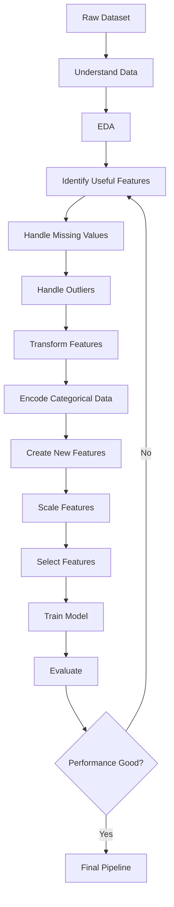
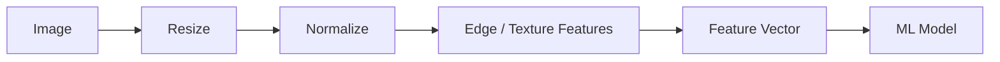
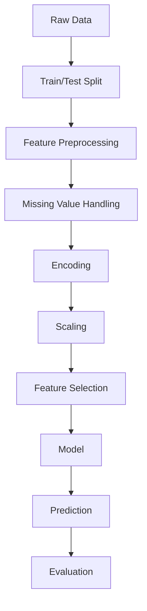
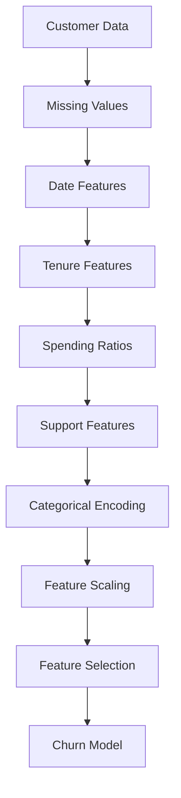
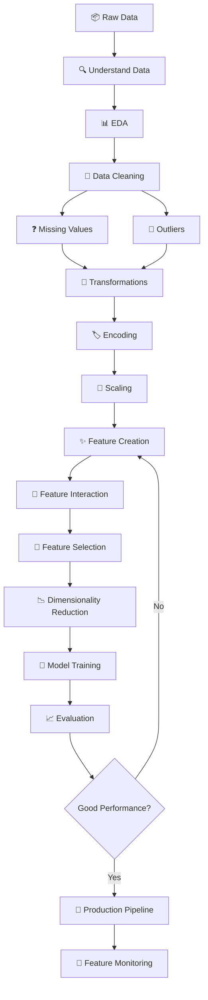

# 🚀 Feature Engineering — Complete Learning Notes

> **Feature Engineering** is the process of transforming raw data into meaningful, informative, and model-ready features that improve the performance, reliability, interpretability, and efficiency of machine learning models.

---

## 📚 Table of Contents

1. [Introduction to Feature Engineering](#1--introduction-to-feature-engineering)
2. [What Is a Feature?](#2--what-is-a-feature)
3. [Why Feature Engineering Is Important](#3--why-feature-engineering-is-important)
4. [Feature Engineering Workflow](#4--feature-engineering-workflow)
5. [Types of Features](#5--types-of-features)
6. [Numerical Feature Engineering](#6--numerical-feature-engineering)
7. [Categorical Feature Engineering](#7--categorical-feature-engineering)
8. [Date and Time Feature Engineering](#8--date-and-time-feature-engineering)
9. [Text Feature Engineering](#9--text-feature-engineering)
10. [Feature Transformation](#10--feature-transformation)
11. [Feature Scaling](#11--feature-scaling)
12. [Handling Missing Values](#12--handling-missing-values)
13. [Handling Outliers](#13--handling-outliers)
14. [Encoding Techniques](#14--encoding-techniques)
15. [Feature Creation](#15--feature-creation)
16. [Feature Selection](#16--feature-selection)
17. [Feature Extraction](#17--feature-extraction)
18. [Feature Interaction](#18--feature-interaction)
19. [Dimensionality Reduction](#19--dimensionality-reduction)
20. [Feature Engineering for Machine Learning](#20--feature-engineering-for-machine-learning)
21. [Feature Engineering by Algorithm](#21--feature-engineering-by-algorithm)
22. [Advanced Feature Engineering](#22--advanced-feature-engineering)
23. [Feature Engineering in Time Series](#23--feature-engineering-in-time-series)
24. [Feature Engineering in NLP](#24--feature-engineering-in-nlp)
25. [Feature Engineering in Computer Vision](#25--feature-engineering-in-computer-vision)
26. [Feature Engineering in Recommendation Systems](#26--feature-engineering-in-recommendation-systems)
27. [Feature Engineering and Data Leakage](#27--feature-engineering-and-data-leakage)
28. [Feature Engineering Pipeline](#28--feature-engineering-pipeline)
29. [Practical Python Example](#29--practical-python-example)
30. [Mini Project: Customer Churn Prediction](#30--mini-project-customer-churn-prediction)
31. [Advantages](#31--advantages)
32. [Limitations](#32--limitations)
33. [Common Mistakes](#33--common-mistakes)
34. [Best Practices](#34--best-practices)
35. [Real-World Applications](#35--real-world-applications)
36. [Interview Questions and Points](#36--interview-questions-and-points)
37. [Quick Revision](#37--quick-revision)
38. [Visual Roadmap](#38--visual-roadmap)

---

# 1. 🧠 Introduction to Feature Engineering

Machine learning algorithms cannot directly understand most raw business data.

For example:

```text
Raw Customer Data

Age        = 25
Salary     = ₹45,000
City       = Pune
Signup     = 2025-08-10
Purchases  = 12
```

A machine learning model requires these values to be represented in a suitable numerical format.

Feature engineering converts raw information into useful features:

```text
Age
Salary
City
Signup Date
Purchases

        ↓

Feature Engineering

        ↓

Age Group
Log Salary
City Encoding
Days Since Signup
Purchase Frequency

        ↓

Machine Learning Model
```

## 🎯 Main Objective

The goal is to create features that expose useful patterns to a machine learning algorithm.

> **Better features → Better information → Better model performance**

Feature engineering is often described as one of the most important parts of practical machine learning.

---

# 2. 🔢 What Is a Feature?

A **feature** is an individual measurable property or characteristic of an observation.

For a house-price prediction problem:

| Feature   |    Example |
| --------- | ---------: |
| Area      | 1500 sq.ft |
| Bedrooms  |          3 |
| Bathrooms |          2 |
| Location  |       Pune |
| Age       |    8 years |
| Parking   |        Yes |
| Price     |  ₹80 Lakhs |

Here:

* `Area`
* `Bedrooms`
* `Bathrooms`
* `Location`
* `Age`
* `Parking`

are input features.

`Price` is the target variable.

## 📌 Feature vs Target

| Term                 | Meaning                            |
| -------------------- | ---------------------------------- |
| Feature              | Input variable used for prediction |
| Target               | Output variable to predict         |
| Independent Variable | Another name for feature           |
| Dependent Variable   | Another name for target            |
| Predictor            | Feature used for prediction        |

Example:

```text
Features:

X = [Age, Salary, CreditScore, LoanAmount]

Target:

y = LoanApproved
```

---

# 3. 🎯 Why Feature Engineering Is Important

Feature engineering can:

* Improve model accuracy
* Reduce noise
* Improve model training speed
* Handle incompatible data formats
* Capture domain knowledge
* Reduce dimensionality
* Improve model interpretability
* Make patterns easier for algorithms to learn

## 🧩 Example

Suppose we have:

```text
Purchase Date
```

Instead of using only the raw date, we can create:

```text
Day
Month
Year
Day of Week
Weekend
Quarter
Days Since Last Purchase
```

These features may contain much more predictive information than the original date.

---

# 4. 🔄 Feature Engineering Workflow

A typical workflow is:



## 🛠️ General Process

1. Understand the business problem.
2. Understand the dataset.
3. Perform exploratory data analysis.
4. Identify data quality issues.
5. Handle missing values.
6. Detect and handle outliers.
7. Transform numerical features.
8. Encode categorical features.
9. Create meaningful features.
10. Select important features.
11. Validate features.
12. Train and evaluate the model.
13. Build a reproducible preprocessing pipeline.

---

# 5. 🧩 Types of Features

Features can be categorized in several ways.

## 5.1 Numerical Features 🔢

Numerical features contain numbers.

Examples:

```text
Age = 25
Salary = 50000
Height = 175.5
Experience = 3.5
```

### Types

| Type       | Description                | Example            |
| ---------- | -------------------------- | ------------------ |
| Continuous | Can take decimal values    | Height             |
| Discrete   | Usually countable values   | Number of children |
| Interval   | Differences are meaningful | Temperature °C     |
| Ratio      | Has meaningful zero        | Weight             |

---

## 5.2 Categorical Features 🏷️

Represent categories.

```text
Gender = Male
City = Pune
Plan = Premium
```

### Types

| Type    | Description          | Example           |
| ------- | -------------------- | ----------------- |
| Nominal | No natural order     | City              |
| Ordinal | Has meaningful order | Low, Medium, High |
| Binary  | Two categories       | Yes/No            |

---

## 5.3 Temporal Features 🕒

Represent time.

```text
2026-08-14
```

Possible derived features:

```text
Year
Month
Day
Hour
Day of Week
Weekend
Quarter
```

---

## 5.4 Text Features 📝

Examples:

```text
Product Review
Customer Complaint
Tweet
Email
```

Possible features:

```text
Word Count
Character Count
TF-IDF
N-grams
Sentiment
Embeddings
```

---

## 5.5 Image Features 🖼️

Examples:

```text
Pixel values
Edges
Textures
Shapes
Color histograms
CNN embeddings
```

---

# 6. 🔢 Numerical Feature Engineering

Numerical features often require transformation before modeling.

## 6.1 Aggregation

Suppose customer transaction data contains:

| Customer | Amount |
| -------- | -----: |
| A        |    100 |
| A        |    200 |
| A        |    300 |
| B        |    500 |
| B        |    100 |

We can create:

```text
Total Spending
Average Spending
Maximum Spending
Minimum Spending
Transaction Count
```

### Pandas Example

```python
customer_features = transactions.groupby("customer_id").agg(
    total_spending=("amount", "sum"),
    average_spending=("amount", "mean"),
    max_spending=("amount", "max"),
    transaction_count=("amount", "count")
).reset_index()
```

---

## 6.2 Mathematical Transformations

Common transformations:

```text
x²
√x
log(x)
1/x
exp(x)
```

Example:

```python
import numpy as np

df["log_income"] = np.log1p(df["income"])
df["income_squared"] = df["income"] ** 2
df["sqrt_income"] = np.sqrt(df["income"])
```

### Why?

Transformations can:

* Reduce skewness
* Stabilize variance
* Make relationships easier to model
* Reduce the influence of extreme values

---

# 7. 🏷️ Categorical Feature Engineering

Categorical data must often be transformed into numerical representation.

Example:

```text
City

Pune
Mumbai
Delhi
Pune
```

A machine learning algorithm generally cannot directly process these strings.

---

# 8. 🕒 Date and Time Feature Engineering

Date/time values contain multiple dimensions of information.

Example:

```text
2026-08-14 15:30:00
```

Can become:

```text
Year       = 2026
Month      = 8
Day        = 14
Hour       = 15
Minute     = 30
Weekday    = Friday
Weekend    = False
Quarter    = 3
```

### Pandas

```python
df["date"] = pd.to_datetime(df["date"])

df["year"] = df["date"].dt.year
df["month"] = df["date"].dt.month
df["day"] = df["date"].dt.day
df["weekday"] = df["date"].dt.dayofweek
df["hour"] = df["date"].dt.hour

df["is_weekend"] = df["weekday"] >= 5
```

## 📅 Useful Date Features

| Feature     | Example    |
| ----------- | ---------- |
| Year        | 2026       |
| Month       | August     |
| Day         | 14         |
| Week        | 33         |
| Day of Week | Friday     |
| Hour        | 15         |
| Weekend     | True/False |
| Quarter     | Q3         |
| Month Start | True/False |
| Month End   | True/False |

---

# 9. 📝 Text Feature Engineering

Text data must be converted into numerical representations.

## Common techniques

```text
Bag of Words
TF-IDF
N-grams
Word Embeddings
Sentence Embeddings
Transformer Embeddings
```

---

## 9.1 Bag of Words

Example:

```text
"I love machine learning"
"I love Python"
```

Vocabulary:

```text
I
love
machine
learning
Python
```

Each document becomes a vector.

---

## 9.2 TF-IDF

TF-IDF stands for:

> **Term Frequency – Inverse Document Frequency**

It assigns higher importance to words that are frequent in a document but relatively uncommon across documents.

### Formula

$$
TF(t,d) = \frac{\text{Number of occurrences of }t\text{ in }d}
{\text{Total number of terms in }d}
$$

$$
IDF(t) = \log\left(\frac{N}{df(t)}\right)
$$

$$
TFIDF(t,d) = TF(t,d) \times IDF(t)
$$

### Python

```python
from sklearn.feature_extraction.text import TfidfVectorizer

vectorizer = TfidfVectorizer(
    max_features=5000,
    stop_words="english"
)

X = vectorizer.fit_transform(df["review"])
```

---

# 10. 🔄 Feature Transformation

Feature transformation changes the mathematical representation of data.

Common transformations:

| Transformation | Purpose                               |
| -------------- | ------------------------------------- |
| Log            | Reduce right skew                     |
| Square root    | Reduce skew                           |
| Polynomial     | Capture nonlinear relationships       |
| Scaling        | Put features on comparable scales     |
| Binning        | Convert continuous values into groups |
| Normalization  | Normalize vector magnitude            |

---

## 10.1 Log Transformation

Useful for highly skewed positive variables.

```python
df["log_salary"] = np.log1p(df["salary"])
```

`log1p(x)` calculates:

$$
\log(1+x)
$$

It is safer than `log(x)` when zeros exist.

---

# 11. 📏 Feature Scaling

Feature scaling ensures numerical features are represented on comparable scales.

Example:

```text
Age        = 25
Salary     = 50000
Experience = 3
```

Salary has a much larger numerical range.

Some algorithms may be affected by this.

---

## 11.1 Standardization

Standardization transforms values to approximately:

```text
Mean = 0
Standard Deviation = 1
```

### Formula

$$
z = \frac{x-\mu}{\sigma}
$$

### Python

```python
from sklearn.preprocessing import StandardScaler

scaler = StandardScaler()

X_scaled = scaler.fit_transform(X)
```

---

## 11.2 Min-Max Scaling

Transforms values into a specified range, commonly `[0, 1]`.

### Formula

$$
x' = \frac{x-x_{min}}{x_{max}-x_{min}}
$$

### Python

```python
from sklearn.preprocessing import MinMaxScaler

scaler = MinMaxScaler()

X_scaled = scaler.fit_transform(X)
```

---

## 11.3 StandardScaler vs MinMaxScaler

| StandardScaler                              | MinMaxScaler                           |
| ------------------------------------------- | -------------------------------------- |
| Mean = 0                                    | Usually range 0–1                      |
| Std = 1                                     | Uses minimum and maximum               |
| Less directly dependent on absolute min/max | Sensitive to outliers                  |
| Useful for many linear models               | Useful when bounded range is desirable |

---

# 12. 🧹 Handling Missing Values

Missing values are common in real-world datasets.

Example:

| Age | Salary | City   |
| --: | -----: | ------ |
|  25 |  50000 | Pune   |
| NaN |  60000 | Mumbai |
|  32 |    NaN | Pune   |

---

## 12.1 Numerical Imputation

### Mean

```python
df["age"] = df["age"].fillna(df["age"].mean())
```

### Median

```python
df["age"] = df["age"].fillna(df["age"].median())
```

Median is often preferable when the feature contains outliers.

---

## 12.2 Categorical Imputation

```python
df["city"] = df["city"].fillna(df["city"].mode()[0])
```

Or:

```python
df["city"] = df["city"].fillna("Unknown")
```

---

## 12.3 Missing Indicator

Sometimes the fact that a value is missing is itself useful.

```python
df["income_missing"] = df["income"].isna().astype(int)
```

Result:

```text
1 = originally missing
0 = originally present
```

---

# 13. 🚨 Handling Outliers

An outlier is an observation significantly different from most other observations.

Example:

```text
Salaries:

30K
35K
40K
42K
45K
48K
5,00,00,000
```

The last value may be an outlier.

---

## 13.1 IQR Method

$$
IQR = Q3-Q1
$$

Lower bound:

$$
Q1 - 1.5(IQR)
$$

Upper bound:

$$
Q3 + 1.5(IQR)
$$

### Python

```python
Q1 = df["salary"].quantile(0.25)
Q3 = df["salary"].quantile(0.75)

IQR = Q3 - Q1

lower = Q1 - 1.5 * IQR
upper = Q3 + 1.5 * IQR

df_filtered = df[
    (df["salary"] >= lower) &
    (df["salary"] <= upper)
]
```

---

## ⚠️ Do Not Automatically Remove Outliers

An outlier may represent:

* Fraud
* A genuine high-value customer
* A rare disease
* A VIP transaction
* A sensor failure
* A data-entry error

Always investigate before removing.

---

# 14. 🏷️ Encoding Techniques

Categorical variables need appropriate encoding.

---

## 14.1 Label Encoding

Example:

```text
Low    → 0
Medium → 1
High   → 2
```

Best suited to **ordinal categories**.

```python
from sklearn.preprocessing import LabelEncoder

encoder = LabelEncoder()

df["level_encoded"] = encoder.fit_transform(df["level"])
```

### ⚠️ Problem

For nominal categories:

```text
Pune → 0
Mumbai → 1
Delhi → 2
```

The model may incorrectly interpret:

```text
Delhi > Mumbai > Pune
```

---

# 15. 🔢 One-Hot Encoding

Creates a separate binary column for each category.

Example:

```text
City
Pune
Mumbai
Delhi
```

Becomes:

| Pune | Mumbai | Delhi |
| ---: | -----: | ----: |
|    1 |      0 |     0 |
|    0 |      1 |     0 |
|    0 |      0 |     1 |

### Python

```python
import pandas as pd

encoded = pd.get_dummies(
    df["city"],
    dtype=int
)
```

Using scikit-learn:

```python
from sklearn.preprocessing import OneHotEncoder

encoder = OneHotEncoder(
    handle_unknown="ignore"
)

X_encoded = encoder.fit_transform(df[["city"]])
```

---

# 16. 🎨 Feature Creation

Feature creation means generating new features from existing information.

Example:

```text
Income
Expenses
```

Create:

```text
Savings = Income - Expenses
```

```python
df["savings"] = df["income"] - df["expenses"]
```

---

## 🧠 Domain-Based Feature Creation

For e-commerce:

```text
total_spending
average_order_value
purchase_frequency
days_since_last_purchase
discount_ratio
```

For banking:

```text
debt_to_income_ratio
credit_utilization
payment_delay_count
```

For healthcare:

```text
BMI
age_group
heart_rate_deviation
```

For HR:

```text
years_at_company
promotion_frequency
salary_growth
```

---

# 17. 🎯 Feature Selection

Feature selection means choosing the most useful features.

Suppose a dataset has:

```text
500 features
```

but only:

```text
40 features
```

are useful.

Feature selection can improve:

* Training speed
* Generalization
* Interpretability
* Memory usage
* Noise reduction

---

## 17.1 Filter Methods

Use statistical properties.

Examples:

```text
Correlation
Chi-square
ANOVA
Mutual Information
Variance Threshold
```

### Variance Threshold

```python
from sklearn.feature_selection import VarianceThreshold

selector = VarianceThreshold(
    threshold=0.01
)

X_selected = selector.fit_transform(X)
```

---

## 17.2 Wrapper Methods

Train models repeatedly to determine useful subsets.

Examples:

```text
RFE
RFECV
Sequential Feature Selection
```

### RFE

```python
from sklearn.feature_selection import RFE
from sklearn.linear_model import LogisticRegression

model = LogisticRegression(max_iter=1000)

selector = RFE(
    model,
    n_features_to_select=10
)

X_selected = selector.fit_transform(X, y)
```

---

## 17.3 Embedded Methods

Feature selection happens during model training.

Examples:

```text
Lasso
Decision Trees
Random Forest
Gradient Boosting
```

---

## Feature Selection Comparison

| Method             | Category | Example                    |
| ------------------ | -------- | -------------------------- |
| Correlation        | Filter   | Pearson                    |
| Chi-square         | Filter   | Categorical classification |
| Mutual Information | Filter   | Nonlinear dependency       |
| RFE                | Wrapper  | Recursive selection        |
| Lasso              | Embedded | L1 regularization          |
| Tree Importance    | Embedded | Random Forest              |

---

# 18. 🔍 Feature Extraction

Feature extraction transforms existing information into a new lower-dimensional representation.

Examples:

```text
PCA
SVD
Autoencoders
Word Embeddings
CNN Embeddings
```

Feature selection chooses existing features.

Feature extraction creates new representations.

---

## Selection vs Extraction

| Feature Selection                 | Feature Extraction                            |
| --------------------------------- | --------------------------------------------- |
| Selects existing features         | Creates new features                          |
| Original meaning preserved        | Original meaning may be harder to interpret   |
| Easier to interpret               | Often less interpretable                      |
| Example: Select 20 of 100 columns | PCA transforms 100 columns into 10 components |

---

# 19. 🔗 Feature Interaction

Sometimes individual features are weak, but their combination is highly informative.

Example:

```text
Income
Debt
```

Create:

```text
Debt-to-Income Ratio
```

$$
DTI = \frac{Debt}{Income}
$$

### Python

```python
df["debt_to_income"] = (
    df["debt"] / df["income"].replace(0, np.nan)
)
```

---

## Polynomial Features

For:

```text
x1
x2
```

Polynomial expansion may create:

```text
x1
x2
x1²
x2²
x1*x2
```

### Python

```python
from sklearn.preprocessing import PolynomialFeatures

poly = PolynomialFeatures(
    degree=2,
    include_bias=False
)

X_poly = poly.fit_transform(X)
```

---

# 20. 🤖 Feature Engineering for Machine Learning

Different algorithms respond differently to feature engineering.

| Algorithm           | Scaling              | Encoding | Feature Engineering |
| ------------------- | -------------------- | -------- | ------------------- |
| Linear Regression   | Usually useful       | Required | Very important      |
| Logistic Regression | Usually useful       | Required | Very important      |
| KNN                 | Very important       | Required | Important           |
| SVM                 | Very important       | Required | Important           |
| Decision Tree       | Usually not required | Required | Moderate            |
| Random Forest       | Usually not required | Required | Moderate            |
| XGBoost             | Usually not required | Required | Important           |
| Neural Networks     | Usually important    | Required | Important           |

---

# 21. 🌳 Feature Engineering by Algorithm

## Linear Models

Linear models assume a particular relationship between features and target.

Feature engineering can introduce nonlinear relationships.

Example:

```text
Age
Age²
Age³
```

---

## Decision Trees

Decision trees automatically create threshold-based splits.

For example:

```text
Age < 30
Salary > 50K
```

Therefore, manual scaling is generally unnecessary.

---

## K-Nearest Neighbors

KNN uses distances.

Therefore:

```text
Feature Scaling = Very Important
```

Without scaling:

```text
Salary = 50,000
Age = 25
```

salary can dominate distance calculations.

---

## Neural Networks

Neural networks generally benefit from:

* Proper scaling
* Normalized inputs
* Appropriate encoding
* Meaningful representations

Deep learning models can also learn representations automatically.

---

# 22. 🚀 Advanced Feature Engineering

## 22.1 Target Encoding

Target encoding replaces categories with statistics related to the target.

Example:

```text
City → Average Purchase Amount
```

```text
Pune    → 4500
Mumbai  → 6200
Delhi   → 5100
```

### ⚠️ Major Risk

Target encoding can cause data leakage.

It must be performed carefully using training folds.

---

## 22.2 Frequency Encoding

Replace a category with its frequency.

Example:

```text
Pune    → 500
Mumbai  → 300
Delhi   → 200
```

```python
frequency = df["city"].value_counts()

df["city_frequency"] = (
    df["city"].map(frequency)
)
```

---

## 22.3 Ratio Features

Examples:

```text
profit_margin = profit / revenue
conversion_rate = conversions / visitors
debt_ratio = debt / income
```

Ratios often capture relationships better than raw values.

---

## 22.4 Binning

Convert continuous values into groups.

```text
Age:

0–18
19–30
31–45
46–60
60+
```

### Pandas

```python
bins = [0, 18, 30, 45, 60, 100]
labels = [
    "Child",
    "Young Adult",
    "Adult",
    "Senior",
    "Elder"
]

df["age_group"] = pd.cut(
    df["age"],
    bins=bins,
    labels=labels
)
```

---

# 23. ⏱️ Feature Engineering in Time Series

Time-series data requires special care because temporal order matters.

Common features:

```text
Lag
Rolling Mean
Rolling Standard Deviation
Difference
Growth Rate
Seasonality
Trend
```

---

## 23.1 Lag Features

If:

```text
Sales(t)
```

Create:

```text
Sales(t-1)
Sales(t-7)
Sales(t-30)
```

### Python

```python
df["sales_lag_1"] = df["sales"].shift(1)
df["sales_lag_7"] = df["sales"].shift(7)
```

---

## 23.2 Rolling Features

```python
df["sales_7day_avg"] = (
    df["sales"]
    .rolling(7)
    .mean()
)
```

---

## 23.3 Growth Rate

$$
Growth = \frac{Current-Previous}{Previous}
$$

```python
df["sales_growth"] = (
    df["sales"].pct_change()
)
```

---

## ⚠️ Time-Series Leakage

Never use future information to predict the past.

Incorrect:

```text
Prediction Date: January 10

Feature:
January 15 Sales
```

This leaks future information.

---

# 24. 📝 Feature Engineering in NLP

NLP feature engineering can include:

```text
Token Count
Character Count
Word Count
Sentence Count
Average Word Length
Stopword Count
Punctuation Count
TF-IDF
N-grams
Sentiment Score
Embeddings
```

Example:

```python
df["word_count"] = (
    df["review"]
    .str.split()
    .str.len()
)

df["char_count"] = (
    df["review"]
    .str.len()
)
```

---

# 25. 🖼️ Feature Engineering in Computer Vision

Image-based systems can use:

```text
Pixel intensity
Color histogram
Edges
Texture
Shape
Contours
HOG
SIFT
CNN embeddings
```

Traditional computer vision:



Modern deep learning:

```text
Image
  ↓
CNN
  ↓
Learned Features
  ↓
Classification
```

The CNN automatically learns useful representations such as:

```text
Edges → Shapes → Textures → Objects
```

---

# 26. 🛒 Feature Engineering in Recommendation Systems

Recommendation systems rely heavily on engineered features.

Examples:

### User Features

```text
Age
Location
Purchase Frequency
Average Order Value
Preferred Category
```

### Product Features

```text
Price
Category
Brand
Popularity
Rating
```

### Interaction Features

```text
Clicks
Views
Purchases
Wishlist
Time Spent
```

A useful feature could be:

```text
user_category_purchase_count
```

or:

```text
days_since_last_purchase
```

---

# 27. ⚠️ Feature Engineering and Data Leakage

**Data leakage** occurs when information unavailable at prediction time enters the training features.

This can make model performance appear unrealistically high.

## Example

Suppose we predict:

```text
Loan Default
```

If we create:

```text
Number of missed payments after loan approval
```

that feature would not be available when the loan is initially approved.

Therefore, it causes leakage.

---

## 🚨 Common Leakage Sources

| Leakage Source          | Example                     |
| ----------------------- | --------------------------- |
| Future data             | Future sales                |
| Target-derived feature  | Average target by category  |
| Test data preprocessing | Scaling before split        |
| Duplicate records       | Same customer in train/test |
| Post-event information  | Cancellation reason         |

---

# 28. 🏗️ Feature Engineering Pipeline

A professional machine learning system should use a reproducible preprocessing pipeline.



## ⚠️ Important Principle

Split first.

```python
X_train, X_test, y_train, y_test = train_test_split(
    X,
    y,
    test_size=0.2,
    random_state=42
)
```

Then:

```text
Fit preprocessing → Training data
Transform preprocessing → Test data
```

---

# 29. 🐍 Practical Python Example

## Dataset

Suppose:

```text
Age
Salary
City
Experience
```

We want to prepare the data for machine learning.

### Step 1 — Import Libraries

```python
import pandas as pd

from sklearn.model_selection import train_test_split
from sklearn.compose import ColumnTransformer
from sklearn.pipeline import Pipeline
from sklearn.impute import SimpleImputer
from sklearn.preprocessing import (
    StandardScaler,
    OneHotEncoder
)
```

---

## Step 2 — Separate Features and Target

```python
X = df.drop("target", axis=1)
y = df["target"]
```

---

## Step 3 — Identify Columns

```python
numeric_features = [
    "age",
    "salary",
    "experience"
]

categorical_features = [
    "city"
]
```

---

## Step 4 — Numerical Pipeline

```python
numeric_pipeline = Pipeline([
    ("imputer", SimpleImputer(strategy="median")),
    ("scaler", StandardScaler())
])
```

---

## Step 5 — Categorical Pipeline

```python
categorical_pipeline = Pipeline([
    (
        "imputer",
        SimpleImputer(strategy="most_frequent")
    ),
    (
        "encoder",
        OneHotEncoder(handle_unknown="ignore")
    )
])
```

---

## Step 6 — Column Transformer

```python
preprocessor = ColumnTransformer([
    (
        "num",
        numeric_pipeline,
        numeric_features
    ),
    (
        "cat",
        categorical_pipeline,
        categorical_features
    )
])
```

---

## Step 7 — Complete Pipeline

```python
from sklearn.linear_model import LogisticRegression

model = Pipeline([
    ("preprocessor", preprocessor),
    ("classifier", LogisticRegression())
])
```

---

## Step 8 — Train

```python
model.fit(X_train, y_train)
```

---

## Step 9 — Predict

```python
predictions = model.predict(X_test)
```

---

## Step 10 — Evaluate

```python
from sklearn.metrics import accuracy_score

accuracy = accuracy_score(
    y_test,
    predictions
)

print("Accuracy:", accuracy)
```

### Why Pipelines Are Important

They help prevent:

* Data leakage
* Inconsistent preprocessing
* Manual transformation errors
* Training/production mismatch

---

# 30. 🧪 Mini Project: Customer Churn Prediction

## 🎯 Objective

Build a machine learning system that predicts whether a customer will leave a company.

### Dataset

Example columns:

```text
customer_id
age
gender
tenure
monthly_charges
total_charges
contract
payment_method
support_calls
last_login
churn
```

---

## Step 1 — Understand the Problem

Target:

```text
churn
```

Possible values:

```text
0 = No Churn
1 = Churn
```

---

## Step 2 — Create Useful Features

### Tenure Group

```python
df["tenure_group"] = pd.cut(
    df["tenure"],
    bins=[0, 6, 12, 24, 48, 100],
    labels=[
        "New",
        "Short",
        "Medium",
        "Long",
        "Very Long"
    ]
)
```

### Monthly-to-Total Spending Ratio

```python
df["monthly_total_ratio"] = (
    df["monthly_charges"] /
    df["total_charges"].replace(0, np.nan)
)
```

### Support Call Intensity

```python
df["support_calls_per_month"] = (
    df["support_calls"] /
    df["tenure"].clip(lower=1)
)
```

### Recency

```python
df["last_login"] = pd.to_datetime(
    df["last_login"]
)

reference_date = df["last_login"].max()

df["days_since_login"] = (
    reference_date - df["last_login"]
).dt.days
```

---

## Feature Engineering Strategy



---

## Potential High-Value Features

| Feature          | Why Useful                             |
| ---------------- | -------------------------------------- |
| Tenure           | Indicates customer relationship length |
| Monthly Charges  | Measures recurring cost                |
| Contract Type    | Indicates commitment                   |
| Support Calls    | May indicate dissatisfaction           |
| Days Since Login | Indicates engagement                   |
| Spending Ratio   | Captures spending behavior             |
| Payment Method   | Can reveal behavioral patterns         |

---

## Evaluation

Use:

```text
Accuracy
Precision
Recall
F1-score
ROC-AUC
Confusion Matrix
```

For churn prediction, accuracy alone may be insufficient when classes are imbalanced.

---

# 31. ✅ Advantages

| Advantage               | Explanation                                      |
| ----------------------- | ------------------------------------------------ |
| Better performance      | Helps models discover useful patterns            |
| Better representation   | Converts raw data into meaningful inputs         |
| Reduced noise           | Removes irrelevant information                   |
| Better interpretability | Meaningful features can explain predictions      |
| Faster training         | Removing unnecessary features reduces complexity |
| Domain knowledge        | Incorporates business understanding              |
| Better generalization   | Proper features can reduce overfitting           |

---

# 32. ⚠️ Limitations

Feature engineering also has disadvantages.

### 1. Time-consuming

Creating and validating features can require significant effort.

### 2. Domain knowledge required

Good features often depend on understanding the business.

### 3. Risk of leakage

Incorrect feature construction can leak target information.

### 4. Overfitting

Creating too many features can allow the model to memorize training patterns.

### 5. Maintenance

Features must remain consistent between:

```text
Training
Validation
Testing
Production
```

### 6. High-dimensional data

Some techniques can dramatically increase the number of features.

Example:

```text
One-hot encoding

100,000 unique categories
        ↓
100,000 columns
```

---

# 33. ❌ Common Mistakes

## Mistake 1 — Scaling Before Train/Test Split

Incorrect:

```python
scaler.fit_transform(X)
train_test_split(X)
```

Correct:

```text
Split data first
↓
Fit scaler on training data
↓
Transform training data
↓
Transform test data
```

---

## Mistake 2 — Blindly Removing Outliers

Not every outlier is an error.

---

## Mistake 3 — Using Label Encoding for Nominal Categories

Avoid:

```text
Pune = 0
Mumbai = 1
Delhi = 2
```

when there is no meaningful order.

---

## Mistake 4 — Creating Too Many Features

More features do not automatically mean a better model.

---

## Mistake 5 — Ignoring Business Meaning

A statistically correlated feature may not make business sense.

---

## Mistake 6 — Target Leakage

Never use information that would not be available at prediction time.

---

## Mistake 7 — Using Future Data

Especially dangerous in:

```text
Time series
Fraud detection
Finance
Demand forecasting
Healthcare
```

---

## Mistake 8 — Inconsistent Production Features

The same transformation used during training must be applied during inference.

---

# 34. 🌟 Best Practices

## 🥇 1. Start With the Business Problem

Ask:

```text
What are we predicting?
When is the prediction made?
What information is available at that time?
```

---

## 🥈 2. Understand the Data

Check:

```python
df.head()
df.info()
df.describe()
df.isnull().sum()
df.nunique()
```

---

## 🥉 3. Use Domain Knowledge

Business knowledge often produces better features than blindly applying statistical techniques.

---

## 4. Split Data Early

Separate training and testing data before learning preprocessing parameters.

---

## 5. Use Pipelines

Use:

```python
Pipeline
ColumnTransformer
```

to make transformations reproducible.

---

## 6. Validate Feature Value

Compare:

```text
Baseline Model
        ↓
Feature Engineering
        ↓
Improved Model
```

Only keep features that provide meaningful improvement.

---

## 7. Keep Feature Definitions Documented

Example:

```text
Feature:
customer_lifetime_value

Definition:
Total historical revenue generated by customer.
```

---

## 8. Monitor Features in Production

Check:

```text
Missing values
Distribution changes
New categories
Outliers
Data drift
Feature drift
```

---

# 35. 🌍 Real-World Applications

## 🏦 Banking

Features:

```text
Credit Utilization
Debt-to-Income Ratio
Payment History
Transaction Frequency
Account Age
```

Applications:

```text
Credit Scoring
Loan Approval
Fraud Detection
Default Prediction
```

---

## 🛒 E-Commerce

Features:

```text
Average Order Value
Purchase Frequency
Days Since Last Purchase
Cart Abandonment Rate
Discount Usage
```

Applications:

```text
Recommendation
Customer Segmentation
Churn Prediction
Demand Forecasting
```

---

## 🏥 Healthcare

Features:

```text
BMI
Age Group
Heart Rate Statistics
Lab Test Ratios
Medication Frequency
```

Applications:

```text
Disease Prediction
Risk Scoring
Patient Monitoring
Medical Image Classification
```

---

## 🚗 Automotive

Features:

```text
Vehicle Speed
Acceleration
Battery SOC
Motor Temperature
Energy Consumption
Drive Cycle Statistics
```

Applications:

```text
EV Range Prediction
Battery Health Prediction
Predictive Maintenance
Driver Behavior Analysis
```

---

## 📱 Social Media

Features:

```text
Session Duration
Likes
Comments
Shares
Posting Frequency
Engagement Rate
```

Applications:

```text
Recommendation
Content Ranking
User Retention
Advertisement Targeting
```

---

# 36. 🎤 Interview Questions and Points

## Q1. What is feature engineering?

**Answer:**

Feature engineering is the process of transforming raw data into meaningful features that improve machine learning model performance.

---

## Q2. Why is feature engineering important?

It helps:

* Extract useful information
* Improve model performance
* Reduce noise
* Capture domain knowledge
* Improve generalization

---

## Q3. What is the difference between feature selection and feature extraction?

| Feature Selection          | Feature Extraction          |
| -------------------------- | --------------------------- |
| Selects existing features  | Creates new representations |
| Original features retained | New features created        |
| More interpretable         | Often less interpretable    |
| Example: RFE               | Example: PCA                |

---

## Q4. What is one-hot encoding?

One-hot encoding represents each category using a separate binary feature.

Example:

```text
Red   → [1,0,0]
Blue  → [0,1,0]
Green → [0,0,1]
```

---

## Q5. When should you use standardization?

Standardization is especially useful for algorithms affected by feature scale, such as:

```text
KNN
SVM
Logistic Regression
Linear Regression
Neural Networks
PCA
```

---

## Q6. Is feature scaling required for decision trees?

Usually no.

Decision trees split using thresholds and are generally insensitive to monotonic scaling.

---

## Q7. What is target encoding?

Target encoding replaces categories with target-related statistics such as mean target value.

It must be implemented carefully to prevent leakage.

---

## Q8. What is data leakage?

Data leakage occurs when information unavailable at prediction time is used to create model features.

---

## Q9. What is feature interaction?

Feature interaction occurs when the combined effect of two or more features provides useful information.

Example:

```text
Income + Debt
        ↓
Debt-to-Income Ratio
```

---

## Q10. What is dimensionality reduction?

It reduces the number of dimensions/features while attempting to preserve important information.

Examples:

```text
PCA
SVD
Autoencoders
```

---

## Q11. How do you handle missing values?

Possible methods include:

```text
Mean
Median
Mode
Constant value
Forward fill
Backward fill
Model-based imputation
Missing indicator
```

The appropriate method depends on the data and business context.

---

## Q12. What is the most important rule in feature engineering?

> **Never use information that would not be available at prediction time.**

---

# 37. ⚡ Quick Revision

## 🧠 Core Concepts

```text
Feature Engineering
        ↓
Transform Raw Data
        ↓
Create Useful Representation
        ↓
Train Better Model
```

---

## 📌 Important Techniques

| Problem                 | Common Technique          |
| ----------------------- | ------------------------- |
| Missing values          | Imputation                |
| Outliers                | IQR / transformation      |
| Categorical data        | One-hot / target encoding |
| Skewed data             | Log transformation        |
| Different scales        | Standardization           |
| High dimensions         | PCA                       |
| Unnecessary features    | Feature selection         |
| Date data               | Date/time decomposition   |
| Text                    | TF-IDF / embeddings       |
| Time series             | Lag / rolling features    |
| Nonlinear relationships | Polynomial features       |
| Category frequency      | Frequency encoding        |

---

## 🧮 Important Formulas

### Standardization

$$
z = \frac{x-\mu}{\sigma}
$$

### Min-Max Scaling

$$
x' = \frac{x-x_{min}}{x_{max}-x_{min}}
$$

### IQR

$$
IQR = Q3-Q1
$$

### IQR Lower Bound

$$
Q1 - 1.5(IQR)
$$

### IQR Upper Bound

$$
Q3 + 1.5(IQR)
$$

### Debt-to-Income Ratio

$$
DTI = \frac{Debt}{Income}
$$

### Growth Rate

$$
Growth = \frac{Current-Previous}{Previous}
$$

### Savings

$$
Savings = Income-Expenses
$$

### Log Transformation

$$
x' = \log(1+x)
$$

---

## 🐍 Important Python Commands

### Inspect Data

```python
df.head()
df.tail()
df.info()
df.describe()
df.shape
df.dtypes
```

### Missing Values

```python
df.isnull().sum()
df.dropna()
df.fillna()
```

### Encoding

```python
pd.get_dummies()
OneHotEncoder()
LabelEncoder()
```

### Scaling

```python
StandardScaler()
MinMaxScaler()
RobustScaler()
```

### Feature Selection

```python
SelectKBest()
VarianceThreshold()
RFE()
RFECV()
```

### Transformation

```python
np.log1p()
np.sqrt()
PolynomialFeatures()
```

### Date Features

```python
pd.to_datetime()
df["date"].dt.year
df["date"].dt.month
df["date"].dt.day
df["date"].dt.dayofweek
```

### Aggregation

```python
df.groupby()
df.agg()
```

### Time-Series Features

```python
df["value"].shift()
df["value"].rolling()
df["value"].pct_change()
```

---

# 38. 🗺️ Visual Roadmap



---

# 🎓 Final Mental Model

```text
                  FEATURE ENGINEERING
                         │
          ┌──────────────┼──────────────┐
          │              │              │
       CLEANING       TRANSFORMING    CREATING
          │              │              │
      Missing Data    Scaling        Ratios
      Outliers       Log            Interactions
      Noise          Encoding       Date Features
          │              │              │
          └──────────────┼──────────────┘
                         │
                  FEATURE SELECTION
                         │
                  DIMENSION REDUCTION
                         │
                   MACHINE LEARNING
                         │
                  MODEL EVALUATION
                         │
                     DEPLOYMENT
                         │
                    MONITORING
```

## ⭐ Golden Rules

1. **Understand the business problem before creating features.**
2. **Use domain knowledge wherever possible.**
3. **Split data before fitting preprocessing transformations.**
4. **Never allow target or future information to leak into features.**
5. **Use pipelines for reproducible preprocessing.**
6. **Do not create features simply because you can.**
7. **Validate whether engineered features actually improve the model.**
8. **Keep feature definitions documented.**
9. **Consider model-specific requirements.**
10. **Monitor feature distributions after deployment.**

> 🚀 **Feature engineering is not simply converting data into numbers. It is the process of converting raw information into representations that help a machine learning model understand the problem.**
