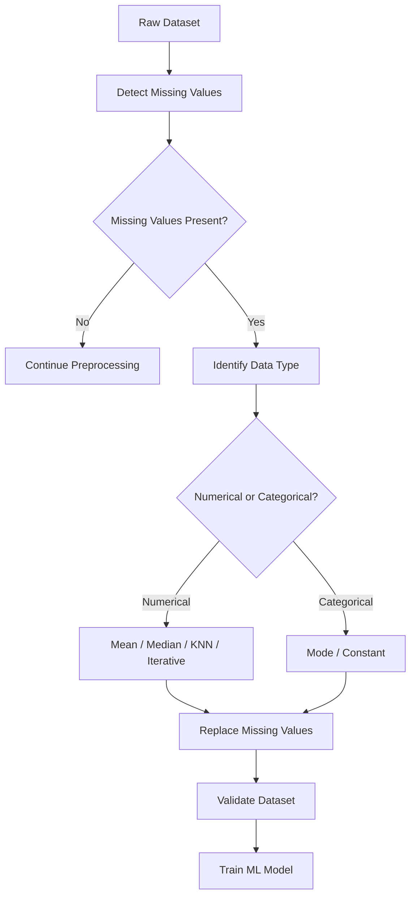
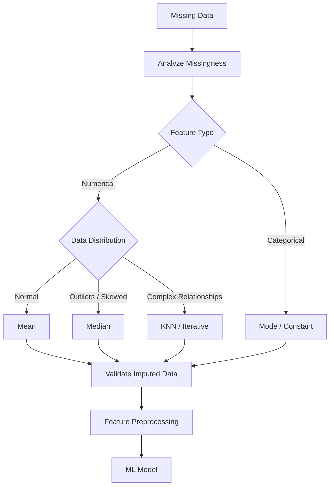

# 📘 Imputation in Machine Learning

## 📑 Table of Contents

1. [📌 Definition](#1--definition)
2. [🎯 Why Imputation is Needed](#2--why-imputation-is-needed)
3. [🧩 Key Concepts](#3--key-concepts)
4. [⚙️ Working Process](#4--working-process)
5. [🛠️ Common Imputation Techniques](#5--common-imputation-techniques)
6. [📊 Comparison of Methods](#6--comparison-of-methods)
7. [💻 Important Python Commands](#7--important-python-commands)
8. [🎯 Applications](#8--applications)
9. [✅ Advantages](#9--advantages)
10. [⚠️ Limitations](#10--limitations)
11. [🧠 Quick Revision](#11--quick-revision)
12. [🗺️ Visual Summary](#12--visual-summary)

---

## 1. 📌 Definition

**Imputation** is the process of replacing missing values in a dataset with meaningful estimated values instead of removing the affected rows or columns.

Missing values may appear as:

* `NaN`
* `None`
* `NULL`
* Empty cells
* Missing or unknown entries

### Example

| Age | Salary |
| --: | -----: |
|  22 |  25000 |
|  25 |  `NaN` |
|  28 |  35000 |

After **mean imputation**:

| Age | Salary |
| --: | -----: |
|  22 |  25000 |
|  25 |  30000 |
|  28 |  35000 |

---

## 2. 🎯 Why Imputation is Needed

Many ML algorithms cannot directly handle missing values.

Imputation helps to:

* Preserve useful data
* Avoid unnecessary row deletion
* Make datasets complete
* Improve model compatibility
* Reduce information loss
* Prepare data for ML algorithms

### 🔑 Important Idea

> **Missing Data → Imputation → Complete Dataset → ML Model**

---

## 3. 🧩 Key Concepts

### 3.1 🔢 Numerical Data

For numerical features, common methods include:

* Mean
* Median
* Constant value
* KNN
* Iterative imputation

### 3.2 🔤 Categorical Data

For categorical features, common methods include:

* Mode
* Constant value such as `"Unknown"`
* Most frequent category

### 3.3 📉 Types of Missing Data

| Type     | Meaning                      |
| -------- | ---------------------------- |
| **MCAR** | Missing Completely At Random |
| **MAR**  | Missing At Random            |
| **MNAR** | Missing Not At Random        |

### 3.4 🧠 Data Leakage

The imputation value should generally be calculated using **training data only**.

Incorrect:

```text
Entire Dataset → Calculate Mean → Train/Test Split
```

Better:

```text
Dataset → Train/Test Split
              ↓
       Fit Imputer on Train
              ↓
       Transform Train/Test
```

---

## 4. ⚙️ Working Process

The general imputation workflow is:



### Step-by-Step

1. **Identify missing values**
2. **Analyze their distribution**
3. **Determine feature type**
4. **Select an appropriate imputation method**
5. **Fit the imputer on training data**
6. **Transform missing values**
7. **Check the resulting dataset**
8. **Train the ML model**

---

## 5. 🛠️ Common Imputation Techniques

### 5.1 📊 Mean Imputation

Replace missing numerical values with the **mean**.

**Formula:**

[
Mean = \frac{\sum x_i}{n}
]

Example:

```text
10, 20, NaN, 30

Mean = (10 + 20 + 30) / 3
     = 20

Result:
10, 20, 20, 30
```

**Best for:** Normally distributed numerical data.

**Limitation:** Sensitive to outliers.

---

### 5.2 📈 Median Imputation

Replace missing values with the **median**.

Example:

```text
10, 20, NaN, 30, 40

Median = 25
```

**Best for:** Numerical data containing outliers or skewed distributions.

---

### 5.3 🏷️ Mode Imputation

Replace missing categorical values with the **most frequently occurring value**.

Example:

```text
City:
Pune
Mumbai
Pune
NaN
Pune
```

Mode = `Pune`

Result:

```text
Pune
Mumbai
Pune
Pune
Pune
```

---

### 5.4 🔢 Constant Imputation

Replace missing values with a fixed value.

Examples:

```text
Numerical → 0
Categorical → "Unknown"
```

Useful when missingness itself has meaning.

---

### 5.5 👥 KNN Imputation

**K-Nearest Neighbors (KNN)** uses similar observations to estimate missing values.


**Advantage:** Can capture relationships between features.

**Limitation:** More computationally expensive.

---

### 5.6 🔄 Iterative Imputation

Iterative imputation estimates missing values using relationships between features.

```text
Feature A ──┐
Feature B ──┼──> Predict Missing Value
Feature C ──┘
```

It repeatedly estimates missing values until the results stabilize.

**Useful for:** Datasets where features have strong relationships.

---

## 6. 📊 Comparison of Methods

| Method    | Data Type   | Outlier Resistant | Complexity  | Common Use                 |
| --------- | ----------- | ----------------- | ----------- | -------------------------- |
| Mean      | Numerical   | ❌ No              | Low         | Normal distributions       |
| Median    | Numerical   | ✅ Yes             | Low         | Skewed data                |
| Mode      | Categorical | ✅ Generally       | Low         | Categories                 |
| Constant  | Both        | ✅                 | Low         | Special missing indicators |
| KNN       | Numerical   | Depends           | Medium/High | Similar observations       |
| Iterative | Numerical   | Depends           | High        | Complex relationships      |

### ⭐ Quick Selection Guide

| Situation                             | Recommended Method |
| ------------------------------------- | ------------------ |
| Normally distributed numerical data   | Mean               |
| Numerical data with outliers          | Median             |
| Categorical feature                   | Mode               |
| Missingness has meaning               | Constant           |
| Similar records are informative       | KNN                |
| Strong relationships between features | Iterative          |

---

## 7. 💻 Important Python Commands

### 🔍 Detect Missing Values

```python
df.isnull().sum()
```

### 📊 Missing Value Percentage

```python
df.isnull().mean() * 100
```

### 📈 Mean Imputation

```python
from sklearn.impute import SimpleImputer

imputer = SimpleImputer(strategy="mean")
X_train = imputer.fit_transform(X_train)
X_test = imputer.transform(X_test)
```

### 📌 Median Imputation

```python
imputer = SimpleImputer(strategy="median")
```

### 🏷️ Mode / Most Frequent

```python
imputer = SimpleImputer(strategy="most_frequent")
```

### 🔢 Constant Value

```python
imputer = SimpleImputer(
    strategy="constant",
    fill_value=0
)
```

### 👥 KNN Imputation

```python
from sklearn.impute import KNNImputer

imputer = KNNImputer(n_neighbors=5)
X_train = imputer.fit_transform(X_train)
```

### 🔄 Iterative Imputation

```python
from sklearn.experimental import enable_iterative_imputer
from sklearn.impute import IterativeImputer

imputer = IterativeImputer()
X_train = imputer.fit_transform(X_train)
```

---

## 8. 🎯 Applications

Imputation is commonly used in:

* 🏥 Healthcare datasets
* 💰 Financial datasets
* 🛒 Customer and sales data
* 📊 Survey datasets
* 🏭 Industrial sensor data
* 📱 User behavior data
* 🤖 Machine learning pipelines
* 📈 Time-series datasets

---

## 9. ✅ Advantages

* Preserves observations
* Reduces data loss
* Makes datasets compatible with ML algorithms
* Simple methods are fast
* Can improve model performance
* Supports automated preprocessing pipelines

---

## 10. ⚠️ Limitations

* Estimated values may not represent the true values
* Poor imputation can introduce bias
* Mean imputation can reduce variance
* KNN and iterative methods can be computationally expensive
* Incorrect imputation may affect model performance
* Imputation can hide the fact that data was originally missing

---

## 11. 🧠 Quick Revision

### 🔑 Key Points

* **Imputation = replacing missing values with estimated values.**
* Numerical data commonly uses **mean or median**.
* Categorical data commonly uses **mode**.
* **Median** is preferred when outliers are present.
* **KNN** uses similar observations.
* **Iterative Imputation** uses relationships between features.
* Fit the imputer on **training data**, then transform test data.
* Avoid data leakage during preprocessing.
* Always analyze the reason and pattern behind missing data.

### 📌 Important Terms

| Term                     | Meaning                                                |
| ------------------------ | ------------------------------------------------------ |
| **Missing Value**        | A value that is unavailable                            |
| **Imputation**           | Replacing missing values                               |
| **Mean**                 | Average value                                          |
| **Median**               | Middle value                                           |
| **Mode**                 | Most frequent value                                    |
| **KNN**                  | Estimates values using nearest observations            |
| **Iterative Imputation** | Predicts missing values using other features           |
| **Data Leakage**         | Unwanted information flow from test data into training |

### 🧮 Important Formulas

**Mean:**

[
\bar{x} = \frac{\sum x_i}{n}
]

**Missing Value Percentage:**

[
Missing% = \frac{Missing\ Values}{Total\ Values} \times 100
]

### 🎤 Interview Questions

1. What is imputation in ML?
2. Why is imputation required?
3. Difference between mean and median imputation?
4. When should median imputation be preferred?
5. What is KNN imputation?
6. What is iterative imputation?
7. How can imputation cause data leakage?
8. How do you handle categorical missing values?
9. When should you use constant imputation?
10. Why should an imputer be fitted only on training data?

---

## 12. 🗺️ Visual Summary



### 🚀 One-Minute Roadmap

```text
Missing Values
      ↓
Detect & Analyze
      ↓
Identify Data Type
      ↓
Choose Imputation Method
      ↓
Fit on Training Data
      ↓
Transform Train & Test
      ↓
Validate
      ↓
Train ML Model
```

> ⭐ **Remember:** Choose the imputation method based on the **data type, distribution, outliers, missing-data pattern, and relationship between features**.
