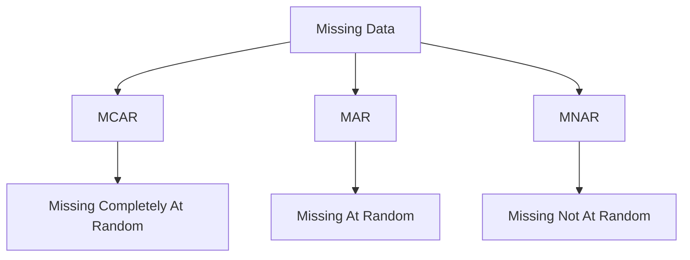
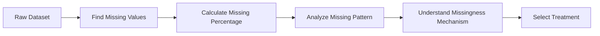
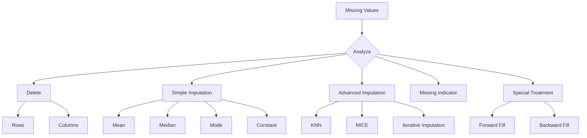
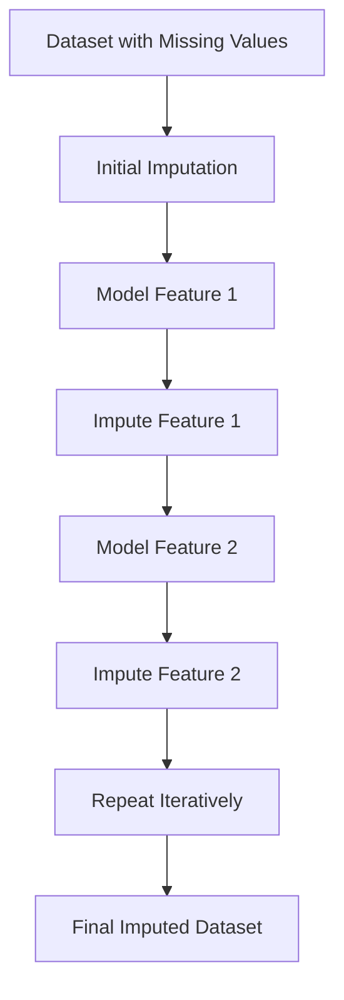
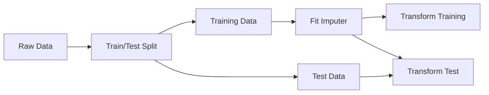
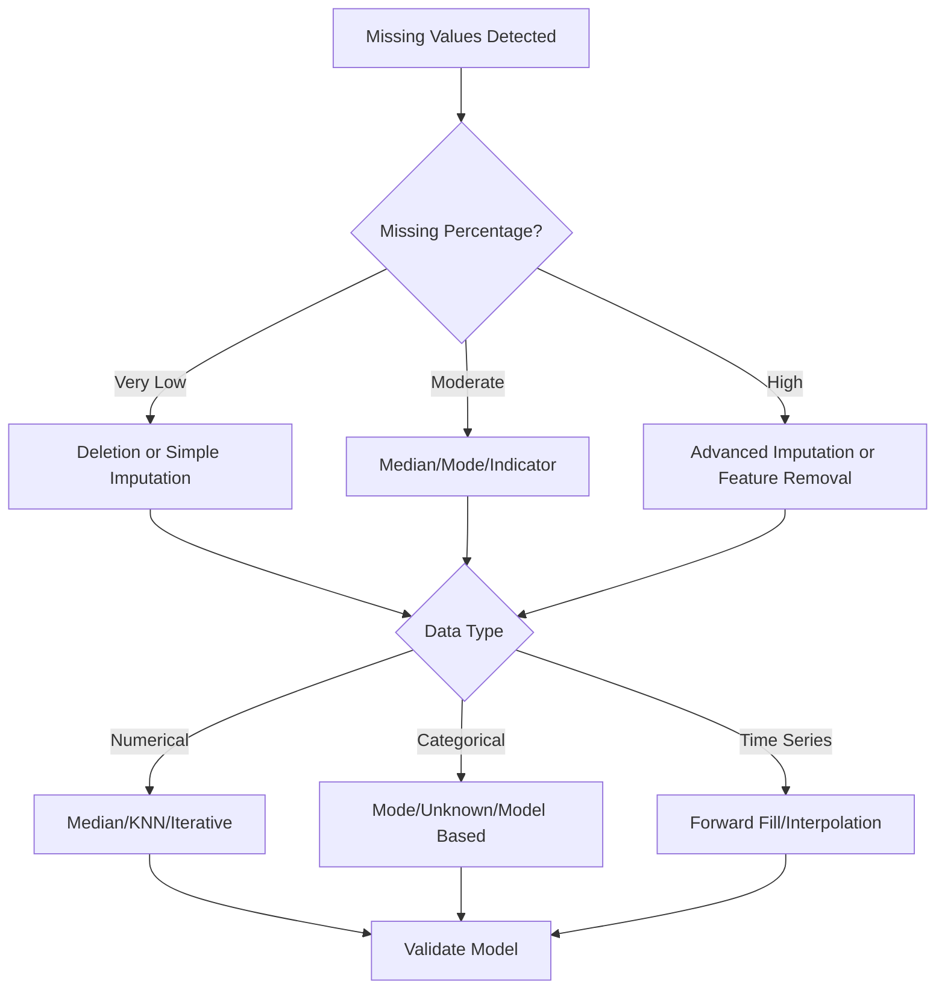
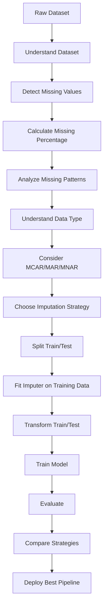

# 🧩 Handling Missing Data in Machine Learning (ML)

> A complete learning resource covering concepts, techniques, practical implementation, best practices, common mistakes, and advanced strategies for handling missing values in Machine Learning.

---

## 📚 Table of Contents

1. [Introduction](#1--introduction)
2. [What is Missing Data?](#2--what-is-missing-data)
3. [Why Does Missing Data Occur?](#3--why-does-missing-data-occur)
4. [Types of Missing Data](#4--types-of-missing-data)
5. [Identifying Missing Data](#5--identifying-missing-data)
6. [Understanding Missing Data Patterns](#6--understanding-missing-data-patterns)
7. [Handling Missing Data](#7--handling-missing-data)
8. [Deleting Missing Data](#8--deleting-missing-data)
9. [Numerical Data Imputation](#9--numerical-data-imputation)
10. [Categorical Data Imputation](#10--categorical-data-imputation)
11. [Time-Series Missing Data](#11--time-series-missing-data)
12. [Advanced Imputation Techniques](#12--advanced-imputation-techniques)
13. [Missing Indicators](#13--missing-indicators)
14. [Handling Missing Data with Scikit-Learn](#14--handling-missing-data-with-scikit-learn)
15. [Handling Missing Data in Pandas](#15--handling-missing-data-in-pandas)
16. [Practical Example](#16--practical-example)
17. [Real-World Use Cases](#17--real-world-use-cases)
18. [Advantages and Limitations](#18--advantages-and-limitations)
19. [Common Mistakes](#19--common-mistakes)
20. [Best Practices](#20--best-practices)
21. [Advanced Concepts](#21--advanced-concepts)
22. [Mini Project](#22--mini-project)
23. [Interview Questions](#23--interview-questions)
24. [Quick Revision](#24--quick-revision)

---

# 1. 🚀 Introduction

Real-world datasets are rarely perfect.

Machine Learning datasets commonly contain:

* Missing values
* Duplicate records
* Incorrect values
* Outliers
* Inconsistent formats
* Noisy data

Among these problems, **missing data** is one of the most common issues encountered during data preprocessing.

For example:

| Age | Salary | Department | Experience |
| --: | -----: | ---------- | ---------: |
|  25 |  35000 | IT         |          2 |
|  28 |  45000 | HR         |          4 |
| NaN |  50000 | IT         |          5 |
|  32 |    NaN | Finance    |          7 |
|  29 |  42000 | NaN        |          3 |

Here:

* `Age` is missing for one record.
* `Salary` is missing for one record.
* `Department` is missing for one record.

If these missing values are not handled correctly, many ML algorithms may produce errors or unreliable predictions.

---

# 2. 🔍 What is Missing Data?

**Missing data** occurs when a value expected in a dataset is unavailable, unknown, unrecorded, or intentionally omitted.

In Python/Pandas, missing values can appear as:

```text
NaN
None
NaT
NULL
?
Empty strings
Blank cells
```

Example:

```python
import pandas as pd

data = {
    "Age": [22, 25, None, 30],
    "Salary": [30000, None, 45000, 50000]
}

df = pd.DataFrame(data)

print(df)
```

Output:

```text
    Age   Salary
0  22.0  30000.0
1  25.0      NaN
2   NaN  45000.0
3  30.0  50000.0
```

---

## 🎯 Why is Missing Data a Problem?

Missing values can:

1. Cause ML algorithms to fail.
2. Reduce the amount of usable data.
3. Introduce statistical bias.
4. Reduce model performance.
5. Distort relationships between features.
6. Affect statistical calculations.
7. Produce unreliable predictions.

Therefore, missing data must be analyzed before deciding how to handle it.

---

# 3. 🏭 Why Does Missing Data Occur?

Missing values can occur for many reasons.

## 3.1 📝 Human Error

A person may forget to enter a value.

Example:

```text
Customer Name: Rahul
Age: 25
Email: [missing]
```

---

## 3.2 ⚙️ System Failure

A sensor or application may fail to record information.

Example:

```text
Temperature = 28°C
Humidity = NaN
Pressure = 1012 hPa
```

---

## 3.3 🔒 Privacy Restrictions

Some users may intentionally avoid providing sensitive information.

Example:

```text
Age: 24
Income: Not Provided
Location: Pune
```

---

## 3.4 🚫 Not Applicable

A variable may not apply to a particular record.

Example:

| Person   | Driving License |
| -------- | --------------- |
| Person A | Yes             |
| Person B | No              |
| Person C | Not Applicable  |

---

## 3.5 🔄 Data Integration Problems

When combining multiple datasets, some columns may exist in one dataset but not another.

Example:

```text
Dataset A → Customer, Age, Salary
Dataset B → Customer, Age, Department
```

After merging, some values may become missing.

---

## 3.6 🌐 API or Database Problems

External APIs may return incomplete information.

---

# 4. 🧠 Types of Missing Data

A fundamental concept in missing-data analysis is understanding **why the data is missing**.

There are three major statistical categories:



---

## 4.1 🎲 MCAR — Missing Completely At Random

A value is missing completely independently of observed and unobserved variables.

Example:

A laboratory machine randomly fails to record one measurement.

```text
Age → Present
Salary → Present
Blood Pressure → Missing
```

The missingness is unrelated to the person's characteristics.

### Example

If 5% of records are randomly lost because of a technical problem, the data may be considered MCAR.

---

## 4.2 🔗 MAR — Missing At Random

The probability of missingness depends on other **observed variables**.

Example:

You have:

```text
Age
Gender
Income
Education
```

Suppose income is more frequently missing for younger people.

The missingness of `Income` depends on observed `Age`.

Therefore:

```text
Income Missing ← Age
```

This can be considered MAR if the relevant dependence is adequately captured by observed data.

---

## 4.3 🕵️ MNAR — Missing Not At Random

The probability of missingness depends on the missing value itself or an unobserved factor.

Example:

People with very high income may be less likely to report their income.

```text
High Income
     ↓
Less likely to report
     ↓
Income becomes missing
```

This is more difficult to handle because the missingness mechanism itself contains information.

---

## 📊 MCAR vs MAR vs MNAR

| Type | Missingness Depends On          | Difficulty | Example                                  |
| ---- | ------------------------------- | ---------- | ---------------------------------------- |
| MCAR | Nothing systematic              | Low        | Random technical failure                 |
| MAR  | Other observed variables        | Medium     | Income missing depending on age          |
| MNAR | Missing value/unobserved factor | High       | High-income users avoid reporting income |

### ⭐ Interview Point

> **MCAR:** Missingness is unrelated to the data.
> **MAR:** Missingness depends on observed information.
> **MNAR:** Missingness depends on the missing value or an unobserved factor.

---

# 5. 🔎 Identifying Missing Data

Before handling missing values, first identify them.

---

## 5.1 `isnull()`

```python
df.isnull()
```

Returns:

```text
True  → Missing
False → Not missing
```

---

## 5.2 `isna()`

```python
df.isna()
```

`isna()` and `isnull()` are effectively equivalent in Pandas.

---

## 5.3 Count Missing Values

```python
df.isnull().sum()
```

Example:

```text
Age           2
Salary        3
Department    1
Experience    0
```

---

## 5.4 Missing Percentage

```python
missing_percentage = df.isnull().mean() * 100

print(missing_percentage)
```

Example:

```text
Age            5.0
Salary        10.0
Department     2.5
Experience     0.0
```

---

## 5.5 Total Missing Values

```python
df.isnull().sum().sum()
```

---

## 5.6 Check Whether Any Missing Value Exists

```python
df.isnull().values.any()
```

---

## 5.7 Visualizing Missing Data

A simple visualization can help identify patterns.

```python
import matplotlib.pyplot as plt

plt.figure(figsize=(10, 5))
plt.imshow(df.isnull(), aspect="auto")
plt.xlabel("Columns")
plt.ylabel("Rows")
plt.title("Missing Data Pattern")
plt.show()
```

---

# 6. 📊 Understanding Missing Data Patterns

Missing data should not only be counted; its **pattern** should also be analyzed.

Consider:

```text
Age      Salary      City
✓        ✓           ✓
✓        ✗           ✓
✓        ✗           ✓
✗        ✗           ✓
✓        ✓           ✗
```

This can reveal relationships between missing features.



---

# 7. 🛠️ Handling Missing Data

There is no single best method for every dataset.

The appropriate technique depends on:

* Data type
* Missing percentage
* Missingness mechanism
* Dataset size
* Feature importance
* Distribution
* Model type
* Business context

Common approaches:



---

# 8. 🗑️ Deleting Missing Data

Deletion is one of the simplest approaches.

However, it should be used carefully because deleting data can reduce the dataset size and introduce bias.

---

## 8.1 Delete Rows

```python
df.dropna()
```

Example:

```python
df_clean = df.dropna()
```

If a row contains a missing value, it is removed.

---

## 8.2 Delete Rows Based on Specific Columns

```python
df.dropna(subset=["Age", "Salary"])
```

Only rows missing `Age` or `Salary` are removed.

---

## 8.3 Delete Columns

```python
df.dropna(axis=1)
```

This removes columns containing missing values.

Usually, this is appropriate only when a column has a very high percentage of missing values and is not useful enough to retain.

---

## 8.4 Threshold-Based Deletion

Keep rows having at least a specified number of non-missing values:

```python
df.dropna(thresh=3)
```

---

## ⚠️ Problems with Deletion

Suppose:

```text
Dataset = 100,000 rows
Missing rows = 20,000
```

Deleting them leaves:

```text
80,000 rows
```

Potential problems:

* Information loss
* Reduced sample size
* Statistical bias
* Loss of minority patterns

---

# 9. 🔢 Numerical Data Imputation

Numerical variables include:

* Age
* Salary
* Height
* Weight
* Temperature
* Sales
* Experience

Common methods include:

* Mean
* Median
* Constant
* KNN
* Regression-based methods
* Iterative imputation

---

# 10. 📈 Mean Imputation

Replace missing values with the mean.

Formula:

[
\text{Mean} = \frac{\sum_{i=1}^{n}x_i}{n}
]

Example:

```text
Age:
20, 22, 24, NaN, 26
```

Mean:

[
\frac{20+22+24+26}{4}=23
]

Result:

```text
20, 22, 24, 23, 26
```

Python:

```python
df["Age"] = df["Age"].fillna(df["Age"].mean())
```

---

## ✅ Advantages

* Simple
* Fast
* Easy to implement

## ❌ Limitations

Mean imputation can distort the distribution and reduce variance.

It is sensitive to outliers.

Example:

```text
20, 22, 24, 26, 500
```

The mean becomes highly distorted.

---

# 11. 📊 Median Imputation

Replace missing values with the median.

Example:

```text
20, 22, 24, NaN, 26, 500
```

The median is much less affected by the extreme value `500`.

Python:

```python
df["Age"] = df["Age"].fillna(df["Age"].median())
```

### ⭐ When to Use Median?

Median is generally preferable when:

* Data is skewed
* Outliers exist
* The variable is numerical

---

# 12. 🔤 Mode Imputation

Mode is the most frequently occurring value.

Example:

```text
IT
HR
IT
NaN
IT
Finance
```

Mode:

```text
IT
```

Python:

```python
df["Department"] = df["Department"].fillna(
    df["Department"].mode()[0]
)
```

Mode is commonly used for categorical variables.

---

# 13. 🧱 Constant Imputation

Replace missing values with a fixed value.

Numerical example:

```python
df["Age"] = df["Age"].fillna(-1)
```

Categorical example:

```python
df["Department"] = df["Department"].fillna("Unknown")
```

This can be useful when missingness itself carries information.

---

# 14. 🔠 Categorical Data Imputation

Categorical variables include:

* Gender
* City
* Department
* Education
* Product category

Common approaches:

| Method       | Example                |
| ------------ | ---------------------- |
| Mode         | Most frequent category |
| Constant     | `"Unknown"`            |
| New Category | `"Missing"`            |
| Model-based  | Predict category       |

Example:

```python
df["City"] = df["City"].fillna("Unknown")
```

---

# 15. 🕒 Time-Series Missing Data

Time-series datasets require special consideration because observations are ordered in time.

Example:

| Date      | Temperature |
| --------- | ----------: |
| Monday    |          28 |
| Tuesday   |          29 |
| Wednesday |         NaN |
| Thursday  |          31 |
| Friday    |          32 |

---

## 15.1 Forward Fill

Use the previous known value.

```python
df["Temperature"] = df["Temperature"].ffill()
```

Result:

```text
28
29
29
31
32
```

---

## 15.2 Backward Fill

Use the next known value.

```python
df["Temperature"] = df["Temperature"].bfill()
```

---

## 15.3 Interpolation

Estimate values between known observations.

```python
df["Temperature"] = df["Temperature"].interpolate()
```

For:

```text
28
30
NaN
34
```

Interpolation may produce:

```text
28
30
32
34
```

---

# 16. 🧠 Advanced Imputation Techniques

Simple methods are not always sufficient.

Advanced methods use relationships between features to estimate missing values.

---

## 16.1 🤝 KNN Imputation

**K-Nearest Neighbors (KNN) Imputation** finds similar records and uses their values to estimate the missing value.

Concept:


Example:

```python
from sklearn.impute import KNNImputer

imputer = KNNImputer(n_neighbors=5)

X_imputed = imputer.fit_transform(X)
```

### Advantages

* Uses relationships between features
* Often better than simple mean/median imputation

### Limitations

* Computationally more expensive
* Sensitive to feature scaling
* Can perform poorly when features are unrelated

---

# 17. 🔄 Iterative Imputation

Iterative imputation predicts missing values using other features.

Concept:

```text
Feature A → Feature B
Feature B → Feature C
Feature C → Feature A
```

The algorithm repeatedly estimates missing values until the estimates stabilize.

Using Scikit-Learn:

```python
from sklearn.experimental import enable_iterative_imputer
from sklearn.impute import IterativeImputer

imputer = IterativeImputer(random_state=42)

X_imputed = imputer.fit_transform(X)
```

---

# 18. 🧬 MICE

**MICE = Multiple Imputation by Chained Equations**

MICE models each incomplete variable using other variables.

General process:



MICE is especially useful in statistical analysis where uncertainty around imputed values matters.

---

# 19. 🚨 Missing Indicators

Sometimes the fact that a value is missing itself contains useful information.

Example:

```text
Income = NaN
```

Instead of only replacing the value, create:

```text
Income = Median
Income_Missing = 1
```

Example:

```python
df["Income_missing"] = df["Income"].isna().astype(int)

df["Income"] = df["Income"].fillna(df["Income"].median())
```

Result:

| Income | Income_missing |
| -----: | -------------: |
|  50000 |              0 |
|  60000 |              0 |
|  55000 |              1 |

This allows the model to learn whether missingness itself has predictive value.

---

# 20. 🧰 Handling Missing Data with Scikit-Learn

A recommended approach is to use pipelines.

Example:

```python
from sklearn.pipeline import Pipeline
from sklearn.impute import SimpleImputer
from sklearn.preprocessing import StandardScaler
from sklearn.linear_model import LogisticRegression

pipeline = Pipeline([
    ("imputer", SimpleImputer(strategy="median")),
    ("scaler", StandardScaler()),
    ("model", LogisticRegression())
])

pipeline.fit(X_train, y_train)
```

---

## 📌 Common `SimpleImputer` Strategies

```python
SimpleImputer(strategy="mean")
```

```python
SimpleImputer(strategy="median")
```

```python
SimpleImputer(strategy="most_frequent")
```

```python
SimpleImputer(strategy="constant", fill_value="Unknown")
```

---

# 21. 🔀 Handling Numerical and Categorical Features

A dataset may contain both numerical and categorical features.

Use `ColumnTransformer`.

```python
from sklearn.compose import ColumnTransformer
from sklearn.pipeline import Pipeline
from sklearn.impute import SimpleImputer
from sklearn.preprocessing import OneHotEncoder

numeric_features = ["Age", "Salary"]

categorical_features = ["Department", "City"]

numeric_pipeline = Pipeline([
    ("imputer", SimpleImputer(strategy="median"))
])

categorical_pipeline = Pipeline([
    ("imputer", SimpleImputer(strategy="most_frequent")),
    ("encoder", OneHotEncoder(handle_unknown="ignore"))
])

preprocessor = ColumnTransformer([
    ("num", numeric_pipeline, numeric_features),
    ("cat", categorical_pipeline, categorical_features)
])
```

This is a robust preprocessing approach.

---

# 22. 🐼 Handling Missing Data in Pandas

## Check missing values

```python
df.isna().sum()
```

## Drop missing rows

```python
df.dropna()
```

## Fill with mean

```python
df["Age"].fillna(df["Age"].mean())
```

## Fill with median

```python
df["Salary"].fillna(df["Salary"].median())
```

## Fill categorical values

```python
df["City"].fillna("Unknown")
```

## Forward fill

```python
df.ffill()
```

## Backward fill

```python
df.bfill()
```

## Interpolate

```python
df.interpolate()
```

---

# 23. 🧪 Practical Example

Consider this dataset:

```python
import pandas as pd

data = {
    "Age": [22, 25, 28, None, 35],
    "Salary": [30000, 35000, None, 50000, 60000],
    "Department": ["IT", "HR", "IT", None, "Finance"]
}

df = pd.DataFrame(data)

print(df)
```

---

## Step 1 — Inspect Missing Values

```python
print(df.isnull().sum())
```

Possible output:

```text
Age           1
Salary        1
Department    1
```

---

## Step 2 — Handle Numerical Features

```python
df["Age"] = df["Age"].fillna(df["Age"].median())

df["Salary"] = df["Salary"].fillna(df["Salary"].median())
```

---

## Step 3 — Handle Categorical Feature

```python
df["Department"] = df["Department"].fillna(
    df["Department"].mode()[0]
)
```

---

## Step 4 — Verify

```python
print(df.isnull().sum())
```

Output:

```text
Age           0
Salary        0
Department    0
```

---

# 24. 🌍 Real-World Examples

## 🏥 Healthcare

Missing:

* Blood pressure
* Cholesterol
* Age
* Lab results

Possible approaches:

```text
Median imputation
KNN
Multiple imputation
Missing indicators
```

Healthcare data requires special care because imputation can influence clinical conclusions.

---

## 💳 Banking

Missing:

* Income
* Credit history
* Employment duration

Possible approach:

```text
Median + missing indicator
```

---

## 🛒 E-Commerce

Missing:

* Product category
* Customer age
* Review rating

Possible approach:

```text
Category → Mode / Unknown
Age → Median
Rating → Domain-specific treatment
```

---

## 🚗 IoT / Sensors

Missing:

* Temperature
* Pressure
* Humidity

Possible approaches:

```text
Interpolation
Forward fill
KNN
Time-series models
```

---

# 25. ⚖️ Advantages and Limitations

| Technique       | Advantages             | Limitations                       |
| --------------- | ---------------------- | --------------------------------- |
| Row deletion    | Simple                 | Information loss                  |
| Column deletion | Easy                   | Can remove useful features        |
| Mean            | Fast                   | Sensitive to outliers             |
| Median          | Robust                 | May reduce variability            |
| Mode            | Good for categories    | Can overrepresent common class    |
| Constant        | Simple                 | May introduce artificial patterns |
| Forward fill    | Useful for time series | Can propagate stale values        |
| Interpolation   | Smooth estimates       | Not suitable for all data         |
| KNN             | Uses relationships     | Computationally expensive         |
| Iterative       | More sophisticated     | More computationally expensive    |
| MICE            | Captures uncertainty   | Complex                           |

---

# 26. ❌ Common Mistakes

## Mistake 1: Always Using Mean

```python
df.fillna(df.mean())
```

This is not always appropriate.

For skewed data, median may be better.

---

## Mistake 2: Deleting Too Many Rows

Deleting 40–50% of a dataset can seriously affect the analysis.

---

## Mistake 3: Ignoring Why Data Is Missing

Always investigate the reason for missingness.

---

## Mistake 4: Data Leakage

Do not calculate imputation values using the entire dataset before splitting into train/test sets.

### ❌ Incorrect

```python
median = df["Age"].median()

df["Age"] = df["Age"].fillna(median)

X_train, X_test = train_test_split(df)
```

### ✅ Better

Fit preprocessing using training data only.

```python
pipeline.fit(X_train, y_train)

X_train_processed = pipeline.transform(X_train)
X_test_processed = pipeline.transform(X_test)
```

---

## Mistake 5: Treating Missing Values as Zero

```python
df["Salary"] = df["Salary"].fillna(0)
```

This may incorrectly imply:

```text
Missing salary = ₹0
```

Missing and zero are not necessarily the same.

---

## Mistake 6: Ignoring Special Missing Values

Some datasets use:

```text
-999
99999
?
NA
N/A
Unknown
```

These should be converted into proper missing values when appropriate.

Example:

```python
df.replace(["?", "NA", "N/A"], pd.NA, inplace=True)
```

---

# 27. 🏆 Best Practices

## ✅ 1. Understand the Dataset First

Check:

```python
df.info()
df.describe()
df.isna().sum()
```

---

## ✅ 2. Measure Missing Percentage

```python
missing_pct = df.isna().mean() * 100
```

---

## ✅ 3. Understand Missingness

Determine whether missingness appears:

```text
MCAR
MAR
MNAR
```

---

## ✅ 4. Use Domain Knowledge

A statistical technique may not always be appropriate.

---

## ✅ 5. Fit Imputation Only on Training Data

Avoid data leakage.

---

## ✅ 6. Use Pipelines

```python
Pipeline([
    ("imputer", SimpleImputer(strategy="median")),
    ("model", model)
])
```

---

## ✅ 7. Compare Model Performance

Test different strategies:

```text
Median
KNN
Iterative
Missing Indicator
```

Then compare validation performance.

---

## ✅ 8. Document Your Decisions

Record:

```text
Column
Missing %
Method
Reason
```

Example:

| Column | Missing % | Method             | Reason                 |
| ------ | --------: | ------------------ | ---------------------- |
| Age    |        2% | Median             | Numerical + outliers   |
| Salary |        8% | Median + indicator | Skewed                 |
| City   |        3% | Unknown            | Missingness meaningful |

---

# 28. 🧠 Advanced Concepts

## 28.1 Multiple Imputation

Instead of creating one imputed dataset, generate multiple plausible datasets.

```text
Original Data
     ↓
Imputation 1
Imputation 2
Imputation 3
Imputation 4
     ↓
Analyze Results
     ↓
Combine Results
```

This accounts for uncertainty caused by missing values.

---

## 28.2 Model-Based Imputation

A machine learning model can predict missing values.

Example:

```text
Missing Salary
      ↓
Age + Education + Experience + Job Role
      ↓
Regression Model
      ↓
Predicted Salary
```

---

## 28.3 Regression Imputation

For numerical variables:

```text
Salary = f(Age, Education, Experience)
```

A regression model predicts missing salary values.

---

## 28.4 Classification-Based Imputation

For categorical variables:

```text
Department = f(Age, Salary, Experience)
```

A classification model can predict the missing department.

---

## 28.5 Distribution Preservation

A good imputation strategy should ideally preserve important properties such as:

* Mean
* Variance
* Distribution
* Correlations
* Relationships between features

---

# 29. 🔐 Data Leakage and Missing Data

Data leakage is one of the most important concepts in preprocessing.

Suppose:

```text
1000 records
```

You split:

```text
Training → 800
Testing → 200
```

The median used for imputation should be calculated from the **training data only**.



Never use test-set statistics to fit preprocessing steps.

---

# 30. 📌 Choosing the Right Method

A simple decision framework:



---

# 31. 🧮 Important Formulas

## Mean

[
\bar{x} = \frac{1}{n}\sum_{i=1}^{n}x_i
]

---

## Missing Percentage

[
\text{Missing %} =
\frac{\text{Number of Missing Values}}
{\text{Total Number of Values}}
\times 100
]

---

## Median

For sorted values:

```text
Odd number of values:
Middle value

Even number of values:
Average of two middle values
```

---

# 32. 🛠️ Useful Python Commands

| Task                 | Command                        |
| -------------------- | ------------------------------ |
| Check missing values | `df.isna()`                    |
| Count missing values | `df.isna().sum()`              |
| Total missing values | `df.isna().sum().sum()`        |
| Missing percentage   | `df.isna().mean() * 100`       |
| Drop rows            | `df.dropna()`                  |
| Drop columns         | `df.dropna(axis=1)`            |
| Fill mean            | `df.fillna(df.mean())`         |
| Fill median          | `df.fillna(df.median())`       |
| Fill mode            | `df.fillna(df.mode().iloc[0])` |
| Forward fill         | `df.ffill()`                   |
| Backward fill        | `df.bfill()`                   |
| Interpolate          | `df.interpolate()`             |
| Replace values       | `df.replace()`                 |

---

# 33. 🧪 Practical Mini Project — Customer Churn Dataset

## 🎯 Objective

Build a preprocessing pipeline for a customer churn dataset containing missing values.

### Dataset Features

```text
CustomerID
Age
MonthlyCharges
TotalCharges
Contract
InternetService
Tenure
Churn
```

---

## Step 1 — Load Data

```python
import pandas as pd

df = pd.read_csv("customer_churn.csv")
```

---

## Step 2 — Inspect Data

```python
print(df.head())
print(df.info())
print(df.isna().sum())
```

---

## Step 3 — Calculate Missing Percentage

```python
missing_percentage = (
    df.isna().mean() * 100
).sort_values(ascending=False)

print(missing_percentage)
```

---

## Step 4 — Separate Features

```python
numeric_features = [
    "Age",
    "MonthlyCharges",
    "TotalCharges",
    "Tenure"
]

categorical_features = [
    "Contract",
    "InternetService"
]
```

---

## Step 5 — Build Pipelines

```python
from sklearn.pipeline import Pipeline
from sklearn.impute import SimpleImputer
from sklearn.preprocessing import OneHotEncoder
from sklearn.compose import ColumnTransformer

numeric_pipeline = Pipeline([
    ("imputer", SimpleImputer(strategy="median"))
])

categorical_pipeline = Pipeline([
    ("imputer", SimpleImputer(strategy="most_frequent")),
    ("encoder", OneHotEncoder(handle_unknown="ignore"))
])

preprocessor = ColumnTransformer([
    ("num", numeric_pipeline, numeric_features),
    ("cat", categorical_pipeline, categorical_features)
])
```

---

## Step 6 — Train a Model

```python
from sklearn.ensemble import RandomForestClassifier

model = Pipeline([
    ("preprocessor", preprocessor),
    ("classifier", RandomForestClassifier(
        random_state=42
    ))
])
```

---

## Step 7 — Train/Test Split

```python
from sklearn.model_selection import train_test_split

X = df.drop("Churn", axis=1)
y = df["Churn"]

X_train, X_test, y_train, y_test = train_test_split(
    X,
    y,
    test_size=0.2,
    random_state=42,
    stratify=y
)
```

---

## Step 8 — Train

```python
model.fit(X_train, y_train)
```

---

## Step 9 — Evaluate

```python
from sklearn.metrics import accuracy_score

predictions = model.predict(X_test)

accuracy = accuracy_score(y_test, predictions)

print("Accuracy:", accuracy)
```

---

## 🎯 Mini Project Learning Outcomes

After completing this project, you should understand:

* Missing-value detection
* Missing-value analysis
* Numerical imputation
* Categorical imputation
* Encoding
* Pipelines
* Train/test separation
* Data leakage prevention
* Model evaluation

---

# 34. 🎤 Interview Questions

## Q1. What is missing data?

Missing data refers to values that are unavailable or not recorded for one or more observations.

---

## Q2. What are the three types of missing data?

```text
MCAR
MAR
MNAR
```

---

## Q3. What is the difference between MCAR and MAR?

**MCAR:** Missingness is unrelated to the observed or unobserved data.

**MAR:** Missingness depends on observed variables.

---

## Q4. When should you use mean imputation?

Mean imputation can be used for numerical data when the distribution is reasonably symmetric and outliers are not a major concern.

---

## Q5. Why is median often preferred over mean?

Median is more robust to outliers and skewed distributions.

---

## Q6. When should you use mode?

Mode is commonly used for categorical variables.

---

## Q7. What is KNN imputation?

KNN imputation estimates missing values using values from similar observations.

---

## Q8. What is MICE?

MICE stands for **Multiple Imputation by Chained Equations** and uses iterative models to estimate missing values.

---

## Q9. What is a missing indicator?

A binary feature indicating whether the original value was missing.

Example:

```text
Income_missing = 1
```

---

## Q10. What is the biggest danger of preprocessing before train-test splitting?

**Data leakage.**

The test set can indirectly influence the training process.

---

## Q11. Should missing values always be replaced?

No.

Sometimes deletion, feature removal, or specialized handling is more appropriate.

---

## Q12. How do you handle missing values in time-series data?

Common methods include:

```text
Forward fill
Backward fill
Interpolation
Time-series models
```

---

# 35. 💼 Real-World Decision Table

| Situation                      | Recommended Approach       |
| ------------------------------ | -------------------------- |
| Very few missing rows          | Row deletion may work      |
| Numerical + symmetric data     | Mean                       |
| Numerical + skewed data        | Median                     |
| Categorical feature            | Mode                       |
| Missingness itself informative | Missing indicator          |
| Time series                    | Interpolation/Forward fill |
| Complex relationships          | KNN/Iterative              |
| Very high missing percentage   | Investigate/remove feature |
| Sensitive statistical analysis | Multiple imputation        |
| ML production pipeline         | Pipeline + fitted imputer  |

---

# 36. ⚠️ Important Limitations

No imputation technique perfectly reconstructs the original value.

Potential problems include:

### 1. Artificial Data

Imputation creates estimated values rather than actual observations.

### 2. Reduced Variability

Mean imputation can make values artificially similar.

### 3. Bias

Poor imputation can introduce systematic bias.

### 4. Incorrect Relationships

Bad imputation can distort correlations.

### 5. Computational Cost

KNN and iterative methods can be expensive for large datasets.

### 6. Model Dependence

An imputation method that works for one dataset may perform poorly on another.

---

# 37. 🌟 Best Overall Workflow



---

# 38. 🧠 Key Terminology

| Term              | Meaning                                               |
| ----------------- | ----------------------------------------------------- |
| Missing Value     | Value unavailable in dataset                          |
| Imputation        | Replacing missing values with estimates               |
| MCAR              | Missing Completely At Random                          |
| MAR               | Missing At Random                                     |
| MNAR              | Missing Not At Random                                 |
| Mean Imputation   | Replace with mean                                     |
| Median Imputation | Replace with median                                   |
| Mode Imputation   | Replace with most frequent category                   |
| KNN Imputation    | Use neighboring observations                          |
| MICE              | Multiple Imputation by Chained Equations              |
| Missing Indicator | Feature representing missingness                      |
| Forward Fill      | Use previous known value                              |
| Backward Fill     | Use next known value                                  |
| Interpolation     | Estimate values between observations                  |
| Data Leakage      | Information from evaluation data influencing training |

---

# 39. 🔄 Missing Data Strategy Roadmap

```text
                 Missing Data
                      │
                      ▼
             ┌─────────────────┐
             │ Analyze Missing │
             │    Patterns     │
             └────────┬────────┘
                      │
          ┌───────────┼───────────┐
          ▼           ▼           ▼
      Numerical   Categorical  Time Series
          │           │           │
          ▼           ▼           ▼
       Median       Mode       Interpolation
       Mean         Unknown    Forward Fill
       KNN          Indicator   Backward Fill
       Iterative
          │           │           │
          └───────────┼───────────┘
                      ▼
              Train/Test Split
                      │
                      ▼
              Fit Preprocessor
                 on Train
                      │
                      ▼
                Transform Data
                      │
                      ▼
                 Train Model
                      │
                      ▼
               Evaluate Results
                      │
                      ▼
              Compare Strategies
```

---

# 40. ⚡ Quick Revision

## 🔑 Key Points

* Missing data is common in real-world datasets.
* Always inspect missing values before choosing a treatment.
* The major missing-data mechanisms are **MCAR, MAR, and MNAR**.
* Use **mean** for suitable numerical distributions.
* Use **median** when numerical data is skewed or contains outliers.
* Use **mode** for categorical features.
* Use `"Unknown"` when missingness should remain explicit.
* Use **forward fill, backward fill, or interpolation** for suitable time-series data.
* Use **KNN** when similar observations can provide useful information.
* Use **Iterative Imputation/MICE** for more sophisticated cases.
* Missing indicators can preserve information about missingness.
* Avoid replacing missing values with zero unless zero has a valid domain meaning.
* Never fit an imputer using test data.
* Use Scikit-Learn `Pipeline` to reduce data leakage.
* Always compare preprocessing strategies using validation performance.

---

## 🧾 Important Commands

```python
# Detect
df.isna()

# Count
df.isna().sum()

# Percentage
df.isna().mean() * 100

# Delete rows
df.dropna()

# Delete columns
df.dropna(axis=1)

# Mean
df["Age"].fillna(df["Age"].mean())

# Median
df["Age"].fillna(df["Age"].median())

# Mode
df["City"].fillna(df["City"].mode()[0])

# Constant
df["City"].fillna("Unknown")

# Forward fill
df.ffill()

# Backward fill
df.bfill()

# Interpolation
df.interpolate()
```

---

## 🧰 Important Scikit-Learn Tools

```python
from sklearn.impute import SimpleImputer
```

```python
SimpleImputer(strategy="mean")
```

```python
SimpleImputer(strategy="median")
```

```python
SimpleImputer(strategy="most_frequent")
```

```python
SimpleImputer(strategy="constant")
```

```python
from sklearn.impute import KNNImputer

KNNImputer(n_neighbors=5)
```

```python
from sklearn.impute import IterativeImputer
```

---

# 41. 🗺️ Final Learning Roadmap


---

# 🎯 One-Minute Summary

```text
                    HANDLING MISSING DATA
                              │
             ┌────────────────┴────────────────┐
             │                                 │
          DETECT                            ANALYZE
             │                                 │
      isna() / isnull()                 MCAR / MAR / MNAR
             │                                 │
             └────────────────┬────────────────┘
                              │
                         CHOOSE METHOD
                              │
       ┌──────────────┬───────┼────────┬──────────────┐
       │              │       │        │              │
     DELETE          MEAN   MEDIAN    MODE          ADVANCED
       │              │       │        │              │
      Rows          Simple  Robust   Category     KNN/MICE
       │              │       │        │              │
       └──────────────┴───────┴────────┴──────────────┘
                              │
                         TRAIN/TEST SPLIT
                              │
                              ▼
                       FIT IMPUTER ON TRAIN
                              │
                              ▼
                         TRANSFORM DATA
                              │
                              ▼
                         TRAIN MODEL
                              │
                              ▼
                         EVALUATE MODEL
                              │
                              ▼
                      SELECT BEST STRATEGY
```

> ⭐ **Golden Rule:** Never blindly fill missing values. First understand **how much data is missing, why it is missing, what type of data it is, and how the chosen strategy affects your model.**
