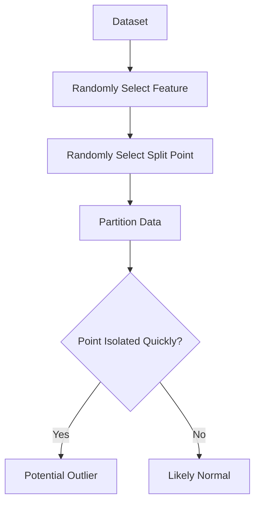
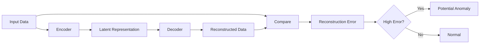
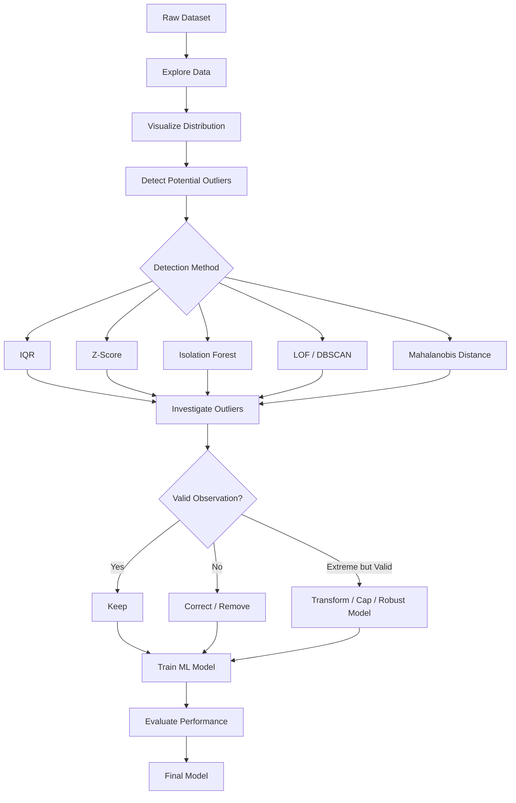

# 📊 Outliers in Machine Learning

> A professional, beginner-friendly learning resource covering the fundamentals, detection methods, treatment techniques, practical examples, advanced concepts, and interview preparation for **Outliers in Machine Learning**.

---

## 📑 Table of Contents

1. [🎯 Introduction](#1--introduction)
2. [📌 What is an Outlier?](#2--what-is-an-outlier)
3. [🧠 Why Do Outliers Occur?](#3--why-do-outliers-occur)
4. [🔑 Important Terminology](#4--important-terminology)
5. [📚 Types of Outliers](#5--types-of-outliers)
6. [📊 Outliers vs Normal Data](#6--outliers-vs-normal-data)
7. [⚠️ Why Outliers Matter in ML](#7--why-outliers-matter-in-ml)
8. [🔍 Methods to Detect Outliers](#8--methods-to-detect-outliers)
9. [📐 Statistical Methods](#9--statistical-methods)
10. [📦 IQR Method](#10--iqr-method)
11. [📈 Z-Score Method](#11--z-score-method)
12. [🤖 Machine Learning-Based Detection](#12--machine-learning-based-detection)
13. [🛠️ How to Handle Outliers](#13--how-to-handle-outliers)
14. [💻 Practical Python Examples](#14--practical-python-examples)
15. [🌍 Real-World Examples](#15--real-world-examples)
16. [🎯 Use Cases](#16--use-cases)
17. [⚖️ Advantages](#17--advantages)
18. [🚧 Limitations](#18--limitations)
19. [🧩 Advanced Concepts](#19--advanced-concepts)
20. [✅ Best Practices](#20--best-practices)
21. [❌ Common Mistakes](#21--common-mistakes)
22. [🧪 Practical Mini-Project](#22--practical-mini-project)
23. [🎤 Interview Points](#23--interview-points)
24. [⚡ Quick Revision](#24--quick-revision)
25. [🗺️ Visual Summary](#25--visual-summary)

---

# 1. 🎯 Introduction

An **outlier** is an observation that is significantly different from the majority of observations in a dataset.

For example, consider the following salaries:

```text
30,000
32,000
35,000
31,000
33,000
34,000
500,000
```

Here, `500,000` is considerably different from the other values and may be an **outlier**.

Outliers are important in Machine Learning because they can:

* Distort statistical calculations.
* Affect model parameters.
* Increase prediction errors.
* Influence mean and standard deviation.
* Affect distance-based algorithms.
* Sometimes represent important real-world events.

> ⚠️ An outlier is not automatically an error. It may represent a genuine and meaningful observation.

---

# 2. 📌 What is an Outlier?

An **outlier** is a data point that significantly deviates from the general pattern or distribution of the dataset.

### Example

Suppose the ages of employees are:

```text
22, 24, 25, 23, 27, 26, 24, 95
```

`95` is an unusual observation compared with the rest.

However, whether `95` should be removed depends on the context.

If the dataset contains employees, it may be an incorrect entry.

If the dataset contains customers, it could be a legitimate customer age.

### Simple Definition

> **Outlier = An observation that is unusually far from the typical pattern of the data.**

---

# 3. 🧠 Why Do Outliers Occur?

Outliers can occur for several reasons.

| Cause                 | Example                           |
| --------------------- | --------------------------------- |
| Data Entry Error      | Age entered as `250`              |
| Measurement Error     | Faulty temperature sensor         |
| System Error          | Database duplication              |
| Natural Variation     | Extremely high income             |
| Rare Event            | Fraudulent transaction            |
| Experimental Error    | Incorrect instrument reading      |
| Genuine Extreme Value | Athlete's exceptional performance |

### Example

```text
Age:
21
23
25
24
22
250
```

Here `250` is most likely a data-entry error.

But:

```text
Transaction:
₹500
₹800
₹650
₹900
₹75,000
```

The ₹75,000 transaction could potentially indicate fraud rather than an error.

---

# 4. 🔑 Important Terminology

| Term               | Meaning                                              |
| ------------------ | ---------------------------------------------------- |
| Outlier            | Unusually distant observation                        |
| Mean               | Average value                                        |
| Median             | Middle value                                         |
| Standard Deviation | Measure of data spread                               |
| Quartile           | Divides data into four parts                         |
| Q1                 | First quartile / 25th percentile                     |
| Q2                 | Median / 50th percentile                             |
| Q3                 | Third quartile / 75th percentile                     |
| IQR                | Interquartile Range                                  |
| Z-Score            | Standardized distance from mean                      |
| Anomaly            | Unusual pattern or observation                       |
| Leverage           | Degree to which a point has unusual predictor values |
| Influence          | Effect of an observation on model fitting            |
| Winsorization      | Replacing extreme values with percentile limits      |

---

# 5. 📚 Types of Outliers

Outliers can be classified into different categories.

## 5.1 📍 Point Outlier

A single observation is significantly different from the rest.

```text
10, 11, 12, 13, 100
```

`100` is a point outlier.

---

## 5.2 📊 Contextual Outlier

A value is unusual only in a particular context.

Example:

```text
Temperature = 40°C
```

This might be normal in summer in some locations but unusual in winter.

Therefore, the context matters.

---

## 5.3 🧩 Collective Outlier

A group of observations collectively behaves unusually.

For example:

```text
Normal:
10, 11, 10, 12, 11

Unusual sequence:
30, 31, 32, 33, 34
```

The individual values may not always appear anomalous, but their collective behavior is unusual.

---

## 5.4 📈 Univariate Outlier

An outlier detected using a **single variable**.

Example:

```text
Salary = 500000
```

---

## 5.5 🧮 Multivariate Outlier

A data point may appear normal in individual features but unusual when multiple features are considered together.

Example:

```text
Age = 25
Income = ₹10 lakh
```

Each value might individually be reasonable, but their combination could be unusual depending on the dataset.

---

# 6. 📊 Outliers vs Normal Data

| Property             | Normal Observation   | Outlier               |
| -------------------- | -------------------- | --------------------- |
| Frequency            | Common               | Rare                  |
| Distribution         | Fits general pattern | Deviates from pattern |
| Distance from center | Usually smaller      | Usually larger        |
| Effect on Mean       | Low                  | Potentially high      |
| Effect on Models     | Usually normal       | Can be significant    |
| Always an error?     | No                   | No                    |

---

# 7. ⚠️ Why Outliers Matter in ML

Outliers can significantly affect certain ML algorithms.

### Algorithms sensitive to outliers

* Linear Regression
* Logistic Regression
* K-Nearest Neighbors
* K-Means Clustering
* Support Vector Machines
* PCA
* Distance-based algorithms

### Algorithms generally more robust to outliers

* Decision Trees
* Random Forest
* Gradient Boosted Trees
* XGBoost-based tree models

> Robust does not mean completely unaffected.

---

## 📉 Effect on Mean

Consider:

```text
10, 12, 11, 13, 100
```

Without `100`:

```text
Mean = 11.5
```

With `100`:

```text
Mean = 29.2
```

The single extreme value significantly changes the mean.

---

# 8. 🔍 Methods to Detect Outliers

Common detection techniques include:

```text
                Outlier Detection
                       │
        ┌──────────────┼──────────────┐
        │              │              │
 Statistical      Visual         ML-Based
        │              │              │
   ┌────┴────┐     ┌───┴────┐    ┌────┴─────┐
   │         │     │        │    │          │
  IQR     Z-Score Boxplot Histogram Isolation Forest
                    Scatter        DBSCAN
```

### Common methods

| Method               | Best Used For                      |
| -------------------- | ---------------------------------- |
| IQR                  | Skewed/general numerical data      |
| Z-Score              | Approximately normal distributions |
| Boxplot              | Visual detection                   |
| Histogram            | Distribution analysis              |
| Scatter Plot         | Relationship-based detection       |
| Isolation Forest     | High-dimensional datasets          |
| DBSCAN               | Density-based anomaly detection    |
| Local Outlier Factor | Local density anomalies            |
| Mahalanobis Distance | Multivariate data                  |

---

# 9. 📐 Statistical Methods

Statistical approaches use mathematical properties of the dataset to identify unusual observations.

The two most commonly used methods are:

1. **IQR Method**
2. **Z-Score Method**

---

# 10. 📦 IQR Method

The **Interquartile Range (IQR)** represents the middle 50% of the data.

### Formula

```text
IQR = Q3 - Q1
```

Where:

* `Q1` = 25th percentile
* `Q3` = 75th percentile

### Outlier boundaries

```text
Lower Bound = Q1 - 1.5 × IQR

Upper Bound = Q3 + 1.5 × IQR
```

Values outside these boundaries are commonly considered outliers.

---

## 🧮 Example

Suppose:

```text
Q1 = 20
Q3 = 40
```

Then:

```text
IQR = 40 - 20
    = 20
```

Lower boundary:

```text
20 - 1.5(20)
= -10
```

Upper boundary:

```text
40 + 1.5(20)
= 70
```

Therefore:

```text
Values < -10 or > 70 → Potential outliers
```

---

## 💻 Python Example

```python
import pandas as pd

data = pd.DataFrame({
    "salary": [25000, 28000, 30000, 32000, 35000, 37000, 40000, 500000]
})

Q1 = data["salary"].quantile(0.25)
Q3 = data["salary"].quantile(0.75)

IQR = Q3 - Q1

lower_bound = Q1 - 1.5 * IQR
upper_bound = Q3 + 1.5 * IQR

outliers = data[
    (data["salary"] < lower_bound) |
    (data["salary"] > upper_bound)
]

print(outliers)
```

### Why IQR is useful

* Easy to understand.
* Does not require normal distribution.
* Relatively robust to extreme values.
* Useful for skewed data.

---

# 11. 📈 Z-Score Method

A **Z-score** measures how many standard deviations an observation is away from the mean.

### Formula

```text
Z = (X - μ) / σ
```

Where:

* `X` = observation
* `μ` = mean
* `σ` = standard deviation

A common rule is:

```text
|Z| > 3 → Potential outlier
```

---

## 🧮 Example

Suppose:

```text
Mean = 50
Standard Deviation = 10
X = 90
```

Then:

```text
Z = (90 - 50) / 10
  = 4
```

Since:

```text
|4| > 3
```

`90` can be considered a potential outlier.

---

## 💻 Python Example

```python
import numpy as np
from scipy.stats import zscore

data = np.array([10, 12, 11, 13, 15, 14, 100])

z_scores = zscore(data)

outliers = data[np.abs(z_scores) > 3]

print("Outliers:", outliers)
```

### IQR vs Z-Score

| Feature                 | IQR                  | Z-Score                                   |
| ----------------------- | -------------------- | ----------------------------------------- |
| Distribution assumption | No strong assumption | Works best with approximately normal data |
| Robustness              | High                 | Lower                                     |
| Skewed data             | Good                 | Can be problematic                        |
| Ease of use             | Easy                 | Easy                                      |
| Common threshold        | 1.5 × IQR            | Usually ±3                                |

---

# 12. 🤖 Machine Learning-Based Detection

When datasets become complex or multidimensional, ML-based anomaly detection can be useful.

Common algorithms include:

* Isolation Forest
* Local Outlier Factor
* One-Class SVM
* DBSCAN
* Autoencoders

---

## 12.1 🌲 Isolation Forest

Isolation Forest isolates observations by randomly selecting features and split points.

The basic idea is:

> Anomalies are easier to isolate than normal observations.

### Workflow



### Python Example

```python
import pandas as pd
from sklearn.ensemble import IsolationForest

df = pd.DataFrame({
    "salary": [25000, 27000, 29000, 30000, 32000, 35000, 500000]
})

model = IsolationForest(
    contamination=0.1,
    random_state=42
)

df["outlier"] = model.fit_predict(df[["salary"]])

print(df)
```

Interpretation:

```text
 1  → Normal observation
-1  → Potential outlier
```

---

## 12.2 📍 Local Outlier Factor

**Local Outlier Factor (LOF)** identifies observations that have substantially lower local density than their neighbors.

Useful when:

* Local patterns matter.
* Different regions have different densities.
* Global thresholds are insufficient.

---

## 12.3 🧠 One-Class SVM

One-Class SVM learns the boundary around normal observations and identifies points outside that boundary.

Useful for:

* Novelty detection.
* Anomaly detection.
* High-dimensional data.

---

## 12.4 🗺️ DBSCAN

DBSCAN is primarily a clustering algorithm, but it can also identify noise points.

Points labeled:

```text
-1 → Noise / potential anomaly
```

---

## 12.5 🧠 Autoencoders

Autoencoders are neural networks that learn to reconstruct normal data.

If an observation has a high reconstruction error, it may be anomalous.



---

# 13. 🛠️ How to Handle Outliers

Detecting an outlier is only the first step.

Possible actions include:

1. Remove it.
2. Correct it.
3. Transform it.
4. Cap it.
5. Replace it.
6. Keep it.
7. Use robust algorithms.

---

## 13.1 🗑️ Remove Outliers

Remove observations when they are clearly caused by errors.

```python
df = df[
    (df["salary"] >= lower_bound) &
    (df["salary"] <= upper_bound)
]
```

### Use when

* Data-entry error is confirmed.
* Sensor failure is confirmed.
* Duplicate or corrupted data exists.

---

## 13.2 🔧 Correct the Outlier

If the value is incorrect but the correct value can be determined, fix it.

Example:

```text
Age = 250
```

If the original source confirms:

```text
Age = 25
```

correct the value instead of deleting the row.

---

## 13.3 📏 Capping / Winsorization

Extreme values can be capped at percentile limits.

```python
lower = df["income"].quantile(0.01)
upper = df["income"].quantile(0.99)

df["income"] = df["income"].clip(
    lower=lower,
    upper=upper
)
```

---

## 13.4 🔄 Transformation

Transformations can reduce the influence of extreme values.

Common transformations:

* Log transformation
* Square-root transformation
* Box-Cox transformation
* Yeo-Johnson transformation

### Log Transformation

```python
import numpy as np

df["income_log"] = np.log1p(df["income"])
```

`log1p(x)` calculates:

```text
log(1 + x)
```

and is safer when zero values may occur.

---

## 13.5 📊 Robust Scaling

Standard scaling uses mean and standard deviation, which can be affected by outliers.

RobustScaler uses:

```text
Median
+
IQR
```

### Python

```python
from sklearn.preprocessing import RobustScaler

scaler = RobustScaler()

df["income_scaled"] = scaler.fit_transform(
    df[["income"]]
)
```

---

## 13.6 ✅ Keep the Outlier

Do not automatically remove an observation just because it is statistically unusual.

Example:

```text
Credit Card Transaction = ₹5,00,000
```

It may be a legitimate transaction.

In fraud detection, the unusual transaction may actually be the most valuable observation.

---

# 14. 💻 Practical Python Examples

## 14.1 📦 Detecting Outliers Using Pandas

```python
import pandas as pd

df = pd.DataFrame({
    "age": [22, 25, 24, 26, 23, 27, 90]
})

Q1 = df["age"].quantile(0.25)
Q3 = df["age"].quantile(0.75)

IQR = Q3 - Q1

lower = Q1 - 1.5 * IQR
upper = Q3 + 1.5 * IQR

df["is_outlier"] = (
    (df["age"] < lower) |
    (df["age"] > upper)
)

print(df)
```

---

## 14.2 📊 Boxplot

```python
import matplotlib.pyplot as plt

plt.boxplot(df["age"])
plt.ylabel("Age")
plt.title("Age Distribution")
plt.show()
```

### Boxplot Interpretation

```text
        ┌───────────────┐
--------│     Box       │--------
        └───────────────┘
          │           │
         Q1          Q3

Lower whisker ───────── Upper whisker

             •
             •  ← Potential outliers
```

---

## 14.3 📈 Histogram

```python
import matplotlib.pyplot as plt

plt.hist(df["age"], bins=10)
plt.xlabel("Age")
plt.ylabel("Frequency")
plt.title("Age Distribution")
plt.show()
```

A histogram helps identify:

* Skewness.
* Extreme values.
* Multiple distributions.
* Unusual tails.

---

## 14.4 🔵 Scatter Plot

```python
import matplotlib.pyplot as plt

plt.scatter(df["age"], range(len(df)))
plt.xlabel("Age")
plt.ylabel("Observation")
plt.title("Potential Outliers")
plt.show()
```

Scatter plots are especially useful for identifying multivariate anomalies.

---

# 15. 🌍 Real-World Examples

## 💳 Fraud Detection

A user normally spends:

```text
₹500 – ₹3,000
```

Suddenly:

```text
₹2,00,000
```

This could be an anomaly requiring investigation.

---

## 🏥 Healthcare

A patient's measurements suddenly show:

```text
Heart Rate = 250 BPM
```

This may be:

* A sensor error.
* A data-entry error.
* A genuine emergency.

Therefore, domain knowledge is essential.

---

## 🏠 House Prices

Most properties:

```text
₹30 lakh – ₹80 lakh
```

One property:

```text
₹15 crore
```

It could be a luxury property rather than incorrect data.

---

## 🌡️ IoT Sensors

A temperature sensor normally reports:

```text
20°C – 30°C
```

Suddenly:

```text
150°C
```

This may indicate:

* Sensor failure.
* Hardware problem.
* Environmental event.

---

# 16. 🎯 Use Cases

| Industry       | Example                       |
| -------------- | ----------------------------- |
| Finance        | Fraud detection               |
| Healthcare     | Abnormal patient measurements |
| Manufacturing  | Machine failure               |
| Cybersecurity  | Unusual network traffic       |
| E-commerce     | Unusual transactions          |
| IoT            | Sensor anomalies              |
| Banking        | Credit risk                   |
| Retail         | Unusual purchases             |
| Transportation | Abnormal vehicle behavior     |
| Social Media   | Bot activity                  |

---

# 17. ⚖️ Advantages

### ✅ Benefits of Outlier Detection

* Improves data quality.
* Helps identify data-entry errors.
* Can improve model performance.
* Helps discover unusual patterns.
* Useful for fraud detection.
* Useful for anomaly detection.
* Can improve statistical analysis.
* Helps understand data distribution.

---

# 18. 🚧 Limitations

Outlier handling also has risks.

### ❌ Removing valid information

An extreme observation may be a genuine event.

### ❌ Threshold dependency

Different thresholds can produce different results.

### ❌ Distribution dependency

Z-score methods may perform poorly with highly skewed distributions.

### ❌ Multivariate complexity

A point may appear normal in one feature but abnormal across several features.

### ❌ Domain knowledge required

Statistical methods cannot always determine whether an observation is logically valid.

---

# 19. 🧩 Advanced Concepts

## 19.1 🔬 Robust Statistics

Robust statistics are less sensitive to extreme observations.

Common robust measures:

* Median
* IQR
* Median Absolute Deviation (MAD)
* Trimmed Mean
* Winsorized Mean

---

## 19.2 📐 Median Absolute Deviation

MAD measures variability around the median.

```text
MAD = median(|Xi - median(X)|)
```

A robust modified Z-score can be calculated as:

```text
Modified Z = 0.6745 × (X - Median) / MAD
```

A commonly used threshold is approximately:

```text
|Modified Z| > 3.5
```

---

## 19.3 🧮 Mahalanobis Distance

Mahalanobis Distance measures the distance of a point from a multivariate distribution while considering feature covariance.

Formula:

```text
D² = (x - μ)ᵀ S⁻¹ (x - μ)
```

Where:

* `x` = observation vector
* `μ` = mean vector
* `S` = covariance matrix
* `S⁻¹` = inverse covariance matrix

Useful for:

* Multivariate outlier detection.
* Correlated features.
* Statistical anomaly detection.

---

## 19.4 🎯 Leverage Points

A leverage point has unusual values in the predictor variables.

Example:

```text
Most X values = 10–50
One X value = 500
```

That observation has high leverage.

---

## 19.5 📊 Influential Observations

An influential observation significantly changes the fitted model when removed.

Important concepts include:

* Leverage.
* Cook's Distance.
* DFBETAs.
* Studentized residuals.

---

## 19.6 📉 Cook's Distance

Cook's Distance measures how strongly an observation influences regression results.

Large Cook's Distance values can indicate observations that deserve investigation.

---

## 19.7 🧠 Outliers in Regression

Regression models can be affected by:

```text
Input outliers
      ↓
High leverage
      ↓
Changed regression line
      ↓
Different predictions
```

This is why outlier analysis is particularly important in linear regression.

---

# 20. ✅ Best Practices

### 1. 🔍 Understand the Data First

Before removing anything, understand:

* Feature meaning.
* Data collection process.
* Business context.
* Expected ranges.

### 2. 📊 Visualize Before Cleaning

Use:

* Boxplots.
* Histograms.
* Scatter plots.
* Distribution plots.

### 3. 🧠 Don't Automatically Delete

Ask:

> Is this an error or a genuine observation?

### 4. 🧪 Compare Model Performance

Train models:

```text
Before outlier treatment
        ↓
After outlier treatment
        ↓
Compare metrics
```

### 5. 🔀 Avoid Data Leakage

Fit outlier thresholds using training data whenever appropriate.

Do not calculate preprocessing statistics from the entire dataset before splitting into training and testing sets.

### 6. 📝 Document Every Decision

Record:

* Detection method.
* Threshold.
* Number of observations affected.
* Treatment method.
* Reason for treatment.

---

# 21. ❌ Common Mistakes

| Mistake                                      | Why It Is Wrong                                 |
| -------------------------------------------- | ----------------------------------------------- |
| Removing every extreme value                 | Some are genuine                                |
| Using Z-score blindly                        | Data may not be normally distributed            |
| Ignoring domain knowledge                    | Context determines whether a value is valid     |
| Detecting outliers after scaling incorrectly | Can distort analysis                            |
| Using test data to determine thresholds      | Can cause data leakage                          |
| Removing too many rows                       | Valuable information may be lost                |
| Treating all features identically            | Different features have different distributions |
| Ignoring multivariate relationships          | Some anomalies only appear jointly              |

---

# 22. 🧪 Practical Mini-Project

## 📌 Project: Customer Income Outlier Detection

### Objective

Detect and analyze unusual income values in a customer dataset.

### Dataset

Example:

```text
customer_id,income,age
1,25000,22
2,32000,25
3,28000,24
4,35000,27
5,30000,26
6,40000,30
7,500000,31
```

---

## Step 1: Load Data

```python
import pandas as pd

df = pd.read_csv("customers.csv")

print(df.head())
```

---

## Step 2: Explore Distribution

```python
print(df["income"].describe())
```

---

## Step 3: Visualize

```python
import matplotlib.pyplot as plt

plt.boxplot(df["income"])
plt.title("Income Outlier Detection")
plt.ylabel("Income")
plt.show()
```

---

## Step 4: Detect Using IQR

```python
Q1 = df["income"].quantile(0.25)
Q3 = df["income"].quantile(0.75)

IQR = Q3 - Q1

lower = Q1 - 1.5 * IQR
upper = Q3 + 1.5 * IQR

outliers = df[
    (df["income"] < lower) |
    (df["income"] > upper)
]

print(outliers)
```

---

## Step 5: Analyze the Outlier

Ask:

```text
Is the income value valid?
        │
   ┌────┴────┐
   │         │
  No        Yes
   │         │
Correct    Keep
/Delete    value
```

---

## Step 6: Compare Treatment Strategies

Try:

```text
Original Data
      ↓
IQR Detection
      ↓
 ┌────┼─────┐
 ↓    ↓     ↓
Remove Cap Transform
```

Then compare model performance.

---

## Step 7: Final Evaluation

Compare:

* Mean Squared Error.
* Mean Absolute Error.
* R² score.
* Model stability.
* Distribution before and after treatment.

### Project Outcome

You should be able to answer:

> **Which observations are outliers, why are they outliers, and should they actually be removed?**

---

# 23. 🎤 Interview Points

## ⭐ Frequently Asked Questions

### Q1. What is an outlier?

An outlier is an observation that significantly deviates from the general pattern of the dataset.

---

### Q2. What are common methods for detecting outliers?

Common methods include:

* IQR.
* Z-score.
* Boxplots.
* Isolation Forest.
* LOF.
* DBSCAN.
* One-Class SVM.
* Mahalanobis Distance.

---

### Q3. What is IQR?

```text
IQR = Q3 - Q1
```

It represents the middle 50% of the dataset.

---

### Q4. What is the common IQR outlier rule?

```text
Lower = Q1 - 1.5 × IQR
Upper = Q3 + 1.5 × IQR
```

---

### Q5. What is a Z-score?

It represents how many standard deviations a value is away from the mean.

```text
Z = (X - μ) / σ
```

---

### Q6. Which is better: IQR or Z-score?

Neither is universally better.

* Use **IQR** when the data is skewed or not normally distributed.
* Use **Z-score** when the distribution is approximately normal.

---

### Q7. Should every outlier be removed?

**No.**

An outlier can represent a valid and important observation.

---

### Q8. Which ML algorithms are sensitive to outliers?

Examples:

* Linear Regression.
* K-Means.
* KNN.
* SVM.
* PCA.

---

### Q9. Which algorithms are relatively robust?

Tree-based models such as:

* Decision Trees.
* Random Forest.
* Gradient Boosting.

---

### Q10. What is Isolation Forest?

Isolation Forest is an anomaly detection algorithm based on the idea that anomalies are easier to isolate than normal observations.

---

### Q11. What is Winsorization?

Winsorization replaces extreme values with specified percentile boundaries rather than deleting observations.

---

### Q12. What is the difference between an outlier and an anomaly?

An **outlier** is statistically unusual.

An **anomaly** is unusual behavior that may indicate an abnormal or unexpected event.

The terms are often used interchangeably, but anomaly detection is generally broader.

---

# 24. ⚡ Quick Revision

## 🧠 Key Points

* Outlier = unusually different observation.
* Outliers are not necessarily errors.
* Always investigate before removing.
* IQR is robust and simple.
* Z-score works best with approximately normal data.
* Boxplots are useful for visual detection.
* Isolation Forest is useful for ML-based anomaly detection.
* LOF considers local density.
* DBSCAN can identify noise points.
* Mahalanobis Distance handles multivariate relationships.
* Winsorization caps extreme values.
* Log transformation reduces the impact of large values.
* RobustScaler uses median and IQR.
* Domain knowledge is critical.
* Outlier treatment should be evaluated using model performance.

---

## 📐 Important Formulas

### IQR

```text
IQR = Q3 - Q1
```

### Lower Bound

```text
Q1 - 1.5 × IQR
```

### Upper Bound

```text
Q3 + 1.5 × IQR
```

### Z-Score

```text
Z = (X - μ) / σ
```

### MAD

```text
MAD = median(|Xi - median(X)|)
```

### Modified Z-Score

```text
Modified Z = 0.6745 × (X - Median) / MAD
```

### Mahalanobis Distance

```text
D² = (x - μ)ᵀ S⁻¹ (x - μ)
```

---

## 💻 Important Python Commands

### IQR

```python
Q1 = df["column"].quantile(0.25)
Q3 = df["column"].quantile(0.75)

IQR = Q3 - Q1
```

### Outlier Filtering

```python
outliers = df[
    (df["column"] < lower) |
    (df["column"] > upper)
]
```

### Z-Score

```python
from scipy.stats import zscore

df["z_score"] = zscore(df["column"])
```

### Isolation Forest

```python
from sklearn.ensemble import IsolationForest

model = IsolationForest(
    contamination=0.05,
    random_state=42
)

df["outlier"] = model.fit_predict(
    df[["column"]]
)
```

### Robust Scaling

```python
from sklearn.preprocessing import RobustScaler

scaler = RobustScaler()
X_scaled = scaler.fit_transform(X)
```

---

# 25. 🗺️ Visual Summary



---

## 🧭 Outlier Handling Roadmap

```text
Understand Dataset
       ↓
Explore Statistics
       ↓
Visualize Data
       ↓
Detect Outliers
       ↓
Understand Cause
       ↓
┌─────────────────────────────┐
│ Error or Genuine Observation?│
└──────────────┬──────────────┘
       ┌───────┴────────┐
       ↓                ↓
     Error            Genuine
       ↓                ↓
Correct/Remove    Keep/Transform
       └───────┬────────┘
               ↓
       Train ML Model
               ↓
       Evaluate Results
               ↓
       Select Best Approach
```

---

## 🎯 One-Line Memory Trick

> **Detect → Investigate → Decide → Treat → Evaluate**

```text
📊 Detect
   ↓
🔍 Investigate
   ↓
🧠 Decide
   ↓
🛠️ Treat
   ↓
📈 Evaluate
```

---

## 🚀 Final Takeaway

> **Outlier handling is not simply about deleting extreme values. It is about understanding why an observation is unusual and choosing the appropriate treatment based on statistics, machine learning requirements, and domain knowledge.**

**Core concept to remember:**

```text
Outlier ≠ Error

Unusual value
     ↓
Investigate
     ↓
Understand context
     ↓
Choose treatment
     ↓
Validate ML performance
```
