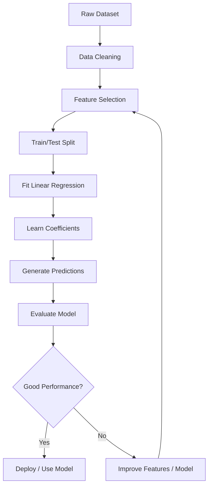
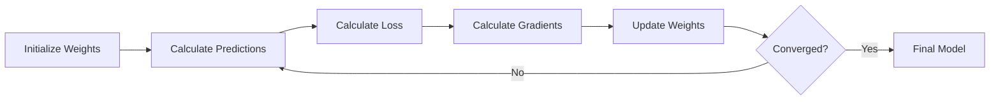
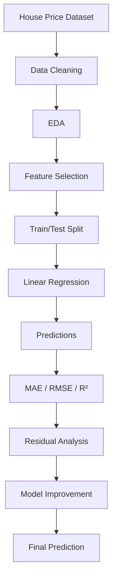
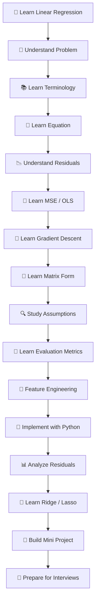

# 📘 Linear Regression in Machine Learning

> A complete professional learning resource covering the theory, mathematics, implementation, evaluation, assumptions, practical applications, advanced concepts, and interview preparation for **Linear Regression**.

---

## 📑 Table of Contents

1. [🎯 What is Linear Regression?](#1--what-is-linear-regression)
2. [🧠 Why Linear Regression Matters](#2--why-linear-regression-matters)
3. [📚 Important Terminology](#3--important-terminology)
4. [📐 Mathematical Foundation](#4--mathematical-foundation)
5. [📊 Simple Linear Regression](#5--simple-linear-regression)
6. [📈 Multiple Linear Regression](#6--multiple-linear-regression)
7. [⚙️ How Linear Regression Works](#7--how-linear-regression-works)
8. [🎯 Cost Function and Loss](#8--cost-function-and-loss)
9. [📉 Ordinary Least Squares](#9--ordinary-least-squares)
10. [🚀 Gradient Descent](#10--gradient-descent)
11. [🧮 Matrix Formulation](#11--matrix-formulation)
12. [🔍 Assumptions of Linear Regression](#12--assumptions-of-linear-regression)
13. [🧪 Model Evaluation](#13--model-evaluation)
14. [🧰 Feature Engineering](#14--feature-engineering)
15. [🛠️ Practical Python Implementation](#15--practical-python-implementation)
16. [📊 Visualization](#16--visualization)
17. [🌍 Real-World Examples](#17--real-world-examples)
18. [🎯 Use Cases](#18--use-cases)
19. [⚖️ Advantages](#19--advantages)
20. [⚠️ Limitations](#20--limitations)
21. [🔬 Advanced Concepts](#21--advanced-concepts)
22. [🧩 Regularization](#22--regularization)
23. [🔄 Linear Regression vs Other Models](#23--linear-regression-vs-other-models)
24. [🧪 Mini Project: House Price Prediction](#24--mini-project-house-price-prediction)
25. [❌ Common Mistakes](#25--common-mistakes)
26. [✅ Best Practices](#26--best-practices)
27. [💼 Interview Questions and Points](#27--interview-questions-and-points)
28. [⚡ Quick Revision](#28--quick-revision)
29. [🗺️ Visual Learning Roadmap](#29--visual-learning-roadmap)

---

# 1. 🎯 What is Linear Regression?

**Linear Regression** is a supervised machine learning algorithm used primarily to predict a **continuous numerical target variable** from one or more input features.

The central idea is to find a mathematical relationship between independent variables and a dependent variable such that predictions are as close as possible to the observed data.

### Example

Suppose we want to predict house price from house area:

| Area (sq ft) | Price |
|---:|---:|
| 800 | ₹40 L |
| 1000 | ₹50 L |
| 1200 | ₹60 L |
| 1500 | ₹75 L |
| 1800 | ₹90 L |

A linear regression model may learn approximately:

\[
Price = \beta_0 + \beta_1(Area)
\]

where:

- \(\beta_0\) = intercept
- \(\beta_1\) = coefficient/slope

### Core Idea

> **Find the line that best represents the relationship between input features and a continuous target.**

---

# 2. 🧠 Why Linear Regression Matters

Linear Regression is one of the most fundamental algorithms in machine learning and statistics.

It is important because it provides:

- A simple baseline model
- Easy interpretability
- Fast training
- A strong mathematical foundation
- A foundation for many statistical models
- A useful introduction to optimization
- A way to understand feature-target relationships

Even when more sophisticated algorithms are available, linear regression is often used as the first model to establish a baseline.

---

# 3. 📚 Important Terminology

| Term | Meaning |
|---|---|
| Independent Variable | Input feature used for prediction |
| Dependent Variable | Target/output being predicted |
| Feature | Input variable used by the model |
| Target | Variable the model predicts |
| Coefficient | Weight assigned to a feature |
| Intercept | Predicted target when all features are zero |
| Prediction | Model's estimated target value |
| Residual | Difference between actual and predicted value |
| Error | Difference between observed and predicted output |
| Slope | Change in target associated with one unit change in a feature |
| Regression | Prediction of a continuous numerical value |
| OLS | Ordinary Least Squares |
| MSE | Mean Squared Error |
| RMSE | Root Mean Squared Error |
| MAE | Mean Absolute Error |
| \(R^2\) | Coefficient of determination |
| Adjusted \(R^2\) | \(R^2\) adjusted for number of predictors |

---

# 4. 📐 Mathematical Foundation

## 4.1 General Linear Regression Equation

For one feature:

\[
\hat{y} = \beta_0 + \beta_1x
\]

For multiple features:

\[
\hat{y} = \beta_0 + \beta_1x_1 + \beta_2x_2 + \cdots + \beta_nx_n
\]

where:

- \(\hat{y}\) = predicted value
- \(\beta_0\) = intercept
- \(\beta_i\) = coefficient of feature \(x_i\)
- \(x_i\) = feature value
- \(n\) = number of features

## 4.2 Prediction vs Actual Value

The residual is:

\[
e_i = y_i - \hat{y}_i
\]

where:

- \(y_i\) = actual value
- \(\hat{y}_i\) = predicted value
- \(e_i\) = residual

A good regression model attempts to keep prediction errors small.

---

# 5. 📊 Simple Linear Regression

Simple Linear Regression uses **one independent variable** to predict one continuous target.

\[
\hat{y} = \beta_0 + \beta_1x
\]

### Example

Predict salary from years of experience:

\[
Salary = 25,000 + 8,000(Experience)
\]

For 5 years:

\[
Salary = 25,000 + 8,000(5)
\]

\[
Salary = 65,000
\]

### 📈 Visual Concept

genui{"learning_viz":{"type_id":"LEAST_SQUARE_REGRESSION","locale_override":"en-US"}}

The regression line represents the model's estimated relationship between \(x\) and \(y\).

---

# 6. 📈 Multiple Linear Regression

Multiple Linear Regression uses two or more independent variables.

\[
\hat{y} =
\beta_0 +
\beta_1x_1 +
\beta_2x_2 +
\cdots +
\beta_nx_n
\]

### Example: House Price

\[
Price =
\beta_0 +
\beta_1(Area) +
\beta_2(Bedrooms) +
\beta_3(Age) +
\beta_4(LocationScore)
\]

The model estimates how each feature contributes to the target while considering the other features.

### Simple vs Multiple Regression

| Property | Simple Regression | Multiple Regression |
|---|---|---|
| Number of features | 1 | 2+ |
| Equation | \(y=\beta_0+\beta_1x\) | \(y=\beta_0+\sum\beta_ix_i\) |
| Visualization | 2D line | Higher-dimensional hyperplane |
| Interpretation | Easier | More complex |
| Use case | Single-factor prediction | Multi-factor prediction |

---

# 7. ⚙️ How Linear Regression Works

The overall workflow is:



### Step-by-Step

1. Collect data.
2. Identify features and target.
3. Clean missing or invalid values.
4. Explore relationships.
5. Split data into training and testing sets.
6. Fit the regression model.
7. Estimate coefficients.
8. Generate predictions.
9. Evaluate errors.
10. Improve the model if required.

---

# 8. 🎯 Cost Function and Loss

The model needs a way to measure how wrong its predictions are.

## 8.1 Mean Squared Error

The most common objective for ordinary linear regression is Mean Squared Error:

\[
MSE = \frac{1}{n}\sum_{i=1}^{n}(y_i-\hat{y}_i)^2
\]

A lower MSE indicates smaller squared prediction errors.

### Why Square the Errors?

Squaring:

- Removes negative signs
- Penalizes large errors more heavily
- Produces a differentiable objective
- Leads to convenient mathematical solutions

## 8.2 Sum of Squared Errors

\[
SSE = \sum_{i=1}^{n}(y_i-\hat{y}_i)^2
\]

OLS minimizes SSE.

---

# 9. 📉 Ordinary Least Squares

**Ordinary Least Squares (OLS)** estimates coefficients by minimizing the sum of squared residuals.

\[
\min_{\beta}\sum_{i=1}^{n}(y_i-\hat{y}_i)^2
\]

For simple linear regression, the slope can be expressed as:

\[
\beta_1 =
\frac{\sum (x_i-\bar{x})(y_i-\bar{y})}
{\sum (x_i-\bar{x})^2}
\]

The intercept is:

\[
\beta_0 = \bar{y}-\beta_1\bar{x}
\]

### Intuition

OLS searches for the line where the total squared vertical distance between observed values and predictions is minimized.

---

# 10. 🚀 Gradient Descent

Gradient Descent is an iterative optimization technique that can be used to find model parameters.

### Basic Process



### Weight Update

For a parameter \(\beta\):

\[
\beta := \beta - \alpha\frac{\partial J}{\partial\beta}
\]

where:

- \(\alpha\) = learning rate
- \(J\) = cost function
- \(\frac{\partial J}{\partial\beta}\) = gradient

### Learning Rate

The learning rate controls the size of each optimization step.

| Learning Rate | Possible Behavior |
|---|---|
| Too small | Very slow training |
| Appropriate | Stable convergence |
| Too large | May overshoot or diverge |

### OLS vs Gradient Descent

| OLS / Normal Equation | Gradient Descent |
|---|---|
| Direct mathematical solution | Iterative optimization |
| Very convenient for smaller problems | Useful for large-scale problems |
| No learning-rate hyperparameter | Requires learning rate |
| Can be computationally expensive with many features | Can scale better with appropriate implementation |

---

# 11. 🧮 Matrix Formulation

Linear regression can be represented compactly using matrices.

\[
\hat{y}=X\beta
\]

where:

- \(X\) = feature matrix
- \(\beta\) = parameter vector
- \(\hat{y}\) = prediction vector

The ordinary least-squares solution is:

\[
\hat{\beta}=(X^TX)^{-1}X^Ty
\]

### ⚠️ Important Numerical Note

In practical numerical computing, explicitly computing \((X^TX)^{-1}\) is often avoided because matrix inversion can be numerically unstable and inefficient.

Libraries generally use more stable linear algebra methods such as QR or SVD-based solvers.

---

# 12. 🔍 Assumptions of Linear Regression

Classical linear regression relies on several assumptions.

## 12.1 Linearity

The expected target should have an approximately linear relationship with the predictors.

## 12.2 Independence

Observations should be appropriately independent, especially for standard statistical inference.

## 12.3 Homoscedasticity

The variance of residuals should be approximately constant across predicted values.

## 12.4 Normality of Residuals

For small-sample statistical inference, residual normality is often useful. It is **not required simply to obtain unbiased OLS coefficient estimates**.

## 12.5 Low Multicollinearity

Predictors should not be excessively redundant with each other when individual coefficient interpretation is important.

## 12.6 No Severe Influential Outliers

Extreme observations can disproportionately affect the fitted line.

### Assumption Summary

| Assumption | Meaning | Common Diagnostic |
|---|---|---|
| Linearity | Relationship is approximately linear | Residual plots |
| Independence | Errors/observations are appropriately independent | Domain/time-series analysis |
| Homoscedasticity | Constant residual variance | Residual vs fitted plot |
| Normal residuals | Residual distribution is approximately normal | Q-Q plot |
| Low multicollinearity | Predictors are not excessively redundant | VIF / correlation |
| No severe influence | No observation dominates fit | Leverage / Cook's distance |

---

# 13. 🧪 Model Evaluation

Never evaluate a regression model using only one metric.

## 13.1 Mean Absolute Error — MAE

\[
MAE=\frac{1}{n}\sum_{i=1}^{n}|y_i-\hat{y}_i|
\]

### Interpretation

MAE represents the average absolute prediction error in the same units as the target.

---

## 13.2 Mean Squared Error — MSE

\[
MSE=\frac{1}{n}\sum_{i=1}^{n}(y_i-\hat{y}_i)^2
\]

MSE strongly penalizes large errors.

---

## 13.3 Root Mean Squared Error — RMSE

\[
RMSE=\sqrt{MSE}
\]

RMSE has the same units as the target.

---

## 13.4 Coefficient of Determination — \(R^2\)

\[
R^2 =
1-
\frac{\sum(y_i-\hat{y}_i)^2}
{\sum(y_i-\bar{y})^2}
\]

\(R^2\) measures the proportion of variance in the target explained by the model relative to a baseline that predicts the mean.

### Important

A high \(R^2\) does **not** automatically mean:

- The model is causal.
- The model generalizes well.
- The model is unbiased.
- Every coefficient is statistically meaningful.

---

## 13.5 Adjusted \(R^2\)

\[
Adjusted\ R^2 =
1-(1-R^2)\frac{n-1}{n-p-1}
\]

where:

- \(n\) = number of observations
- \(p\) = number of predictors

Adjusted \(R^2\) accounts for model complexity.

### Metric Comparison

| Metric | Penalizes Large Errors? | Same Unit as Target? | Better |
|---|---:|---:|---|
| MAE | Less strongly | ✅ | Lower |
| MSE | Strongly | ❌ | Lower |
| RMSE | Strongly | ✅ | Lower |
| \(R^2\) | Not directly | ❌ | Higher |
| Adjusted \(R^2\) | Not directly | ❌ | Higher |

---

# 14. 🧰 Feature Engineering

Feature engineering can significantly affect linear regression performance.

## 14.1 Polynomial Features

A relationship that is nonlinear in the original feature can sometimes be modeled using polynomial terms:

\[
y=\beta_0+\beta_1x+\beta_2x^2
\]

Although this is nonlinear in \(x\), it is still **linear in the parameters \(\beta\)**.

## 14.2 Interaction Features

For two variables:

\[
y=\beta_0+\beta_1x_1+\beta_2x_2+\beta_3(x_1x_2)
\]

The interaction term allows the effect of one variable to depend on another.

## 14.3 Log Transformation

For skewed variables, transformations such as:

\[
x'=\log(1+x)
\]

may improve linearity or reduce skewness.

## 14.4 Encoding Categorical Variables

Categorical variables can be converted into numerical representations, commonly through one-hot encoding.

Example:

```text
City = Pune, Mumbai, Delhi
```

can become:

```text
City_Pune
City_Mumbai
City_Delhi
```

Care must be taken to avoid redundant dummy variables when using an intercept and to handle unseen categories safely.

---

# 15. 🛠️ Practical Python Implementation

## 15.1 Install Required Libraries

```bash
pip install numpy pandas matplotlib scikit-learn
```

## 15.2 Simple Linear Regression

```python
import numpy as np
from sklearn.linear_model import LinearRegression

X = np.array([[1], [2], [3], [4], [5]])
y = np.array([2, 4, 5, 8, 10])

model = LinearRegression()
model.fit(X, y)

predictions = model.predict(X)

print("Coefficient:", model.coef_[0])
print("Intercept:", model.intercept_)
print("Predictions:", predictions)
```

### Key Attributes

```python
model.coef_
```

Returns feature coefficients.

```python
model.intercept_
```

Returns the intercept.

---

## 15.3 Train/Test Split

```python
from sklearn.model_selection import train_test_split
from sklearn.linear_model import LinearRegression

X_train, X_test, y_train, y_test = train_test_split(
    X,
    y,
    test_size=0.2,
    random_state=42
)

model = LinearRegression()
model.fit(X_train, y_train)

y_pred = model.predict(X_test)
```

### Why Split the Data?

The model should be evaluated on data it did not use during training.

---

## 15.4 Evaluation with Scikit-Learn

```python
from sklearn.metrics import (
    mean_absolute_error,
    mean_squared_error,
    r2_score
)
import numpy as np

mae = mean_absolute_error(y_test, y_pred)
mse = mean_squared_error(y_test, y_pred)
rmse = np.sqrt(mse)
r2 = r2_score(y_test, y_pred)

print("MAE :", mae)
print("MSE :", mse)
print("RMSE:", rmse)
print("R²  :", r2)
```

---

## 15.5 Multiple Linear Regression

```python
from sklearn.linear_model import LinearRegression

X = [
    [1000, 2],
    [1500, 3],
    [2000, 4],
    [2500, 4],
    [3000, 5]
]

y = [50, 75, 100, 125, 150]

model = LinearRegression()
model.fit(X, y)

print("Coefficients:", model.coef_)
print("Intercept:", model.intercept_)
```

---

# 16. 📊 Visualization

Visualization is essential for understanding regression behavior.

## 16.1 Regression Line

```python
import matplotlib.pyplot as plt

plt.scatter(X, y, label="Actual")

plt.plot(
    X,
    model.predict(X),
    label="Regression Line"
)

plt.xlabel("Feature")
plt.ylabel("Target")
plt.title("Linear Regression")
plt.legend()
plt.show()
```

## 16.2 Residual Plot

```python
import matplotlib.pyplot as plt

residuals = y_test - y_pred

plt.scatter(y_pred, residuals)
plt.axhline(0)
plt.xlabel("Predicted Values")
plt.ylabel("Residuals")
plt.title("Residual Plot")
plt.show()
```

### Healthy Residual Pattern

Ideally, residuals should look roughly like a random cloud around zero.

Patterns can indicate:

- Nonlinearity
- Heteroscedasticity
- Missing features
- Outliers
- Model misspecification

---

# 17. 🌍 Real-World Examples

## Example 1 — House Price Prediction

Features:

- Area
- Number of bedrooms
- Age
- Location score
- Number of bathrooms

Target:

- House price

---

## Example 2 — Salary Prediction

Features:

- Years of experience
- Education level
- Job level
- Skills
- Location

Target:

- Annual salary

---

## Example 3 — Sales Forecasting

Features:

- Advertising spend
- Discount
- Store traffic
- Seasonality indicators

Target:

- Sales revenue

---

## Example 4 — Energy Consumption

Features:

- Temperature
- Building area
- Occupancy
- Equipment usage

Target:

- Energy consumption

---

## Example 5 — Delivery Time

Features:

- Distance
- Traffic level
- Number of stops
- Weather indicators

Target:

- Delivery time

---

# 18. 🎯 Use Cases

| Domain | Example |
|---|---|
| Finance | Revenue prediction |
| Real Estate | Property price prediction |
| Retail | Sales forecasting |
| Marketing | Revenue vs advertising spend |
| Healthcare | Continuous measurement prediction |
| Manufacturing | Production estimation |
| Energy | Consumption prediction |
| Education | Score prediction |
| Operations | Delivery time estimation |
| Agriculture | Yield estimation |

### When Linear Regression Is a Good Choice

Use it when:

- Target is continuous.
- Relationship is reasonably linear or can be made linear through feature engineering.
- Interpretability matters.
- A strong baseline is needed.
- Dataset size and feature structure make linear modeling appropriate.

---

# 19. ⚖️ Advantages

### ✅ Advantages

1. **Simple to understand**
2. **Easy to implement**
3. **Fast to train**
4. **Highly interpretable**
5. **Works well as a baseline**
6. **Efficient for many practical problems**
7. **Coefficients provide directional information**
8. **Strong mathematical foundation**
9. **Works naturally with numerical features**
10. **Can be extended with regularization and feature engineering**

---

# 20. ⚠️ Limitations

### ❌ Limitations

1. Assumes an appropriate linear structure.
2. Sensitive to outliers.
3. Multicollinearity can make coefficients unstable.
4. Strong nonlinear relationships may be poorly represented without feature engineering.
5. Extrapolation can be dangerous.
6. Correlation does not imply causation.
7. High-dimensional feature spaces may require regularization.
8. Heteroscedasticity can affect classical inference.
9. Time-dependent data may violate independence assumptions.
10. A high training score can hide poor generalization.

---

# 21. 🔬 Advanced Concepts

## 21.1 Multicollinearity

Multicollinearity occurs when predictors are strongly related to each other.

Example:

```text
House area
Number of rooms
Number of bedrooms
```

These variables may contain overlapping information.

### Problems

- Unstable coefficients
- Large standard errors
- Difficult interpretation
- Coefficients may change significantly with small data changes

### Detection

Common tools include:

- Correlation matrix
- Variance Inflation Factor (VIF)
- Coefficient stability analysis

---

## 21.2 Variance Inflation Factor

A common formula is:

\[
VIF_j=\frac{1}{1-R_j^2}
\]

where \(R_j^2\) is obtained by regressing predictor \(j\) on the other predictors.

Higher VIF indicates stronger linear redundancy with other predictors.

There is no universal magic cutoff; thresholds such as 5 or 10 are rules of thumb and should be interpreted in context.

---

## 21.3 Bias-Variance Tradeoff

A model can suffer from:

### High Bias

Model is too simple.

Symptoms:

- Underfitting
- High training error
- High test error

### High Variance

Model is too sensitive to training data.

Symptoms:

- Very low training error
- Much higher validation/test error

The goal is to find an appropriate balance.

---

## 21.4 Underfitting vs Overfitting

| Problem | Training Error | Test Error | Typical Cause |
|---|---:|---:|---|
| Underfitting | High | High | Model too simple |
| Good fit | Low | Low | Appropriate complexity |
| Overfitting | Very low | High | Excessive complexity / leakage |

---

## 21.5 Outliers and Influential Observations

An outlier is an observation that differs substantially from the general pattern.

An influential point can substantially change the fitted model.

Useful diagnostics include:

- Studentized residuals
- Leverage
- Cook's distance

### Important

Do not automatically delete outliers.

First determine whether they represent:

- Data-entry errors
- Rare but valid events
- Measurement problems
- Important business cases

---

## 21.6 Confidence vs Prediction Intervals

A **confidence interval** describes uncertainty around an estimated population mean/conditional mean.

A **prediction interval** describes uncertainty around a future individual observation and is generally wider.

---

## 21.7 Statistical Significance

In classical linear regression, coefficient inference may use:

- Standard errors
- t-statistics
- p-values
- Confidence intervals

However, statistical significance should not be confused with practical importance or predictive usefulness.

---

# 22. 🧩 Regularization

Regularization reduces model complexity by adding a penalty to the objective.

## 22.1 Ridge Regression

Ridge uses an L2 penalty:

\[
J(\beta)=
MSE+\lambda\sum_{j=1}^{p}\beta_j^2
\]

It shrinks coefficients toward zero but typically does not make them exactly zero.

```python
from sklearn.linear_model import Ridge

model = Ridge(alpha=1.0)
model.fit(X_train, y_train)

y_pred = model.predict(X_test)
```

---

## 22.2 Lasso Regression

Lasso uses an L1 penalty:

\[
J(\beta)=
MSE+\lambda\sum_{j=1}^{p}|\beta_j|
\]

Lasso can drive some coefficients exactly to zero, making it useful for embedded feature selection.

```python
from sklearn.linear_model import Lasso

model = Lasso(alpha=0.1)
model.fit(X_train, y_train)

y_pred = model.predict(X_test)
```

---

## 22.3 Elastic Net

Elastic Net combines L1 and L2 penalties.

\[
J(\beta)=
MSE+
\lambda
\left[
\alpha\sum|\beta_j|
+
(1-\alpha)\sum\beta_j^2
\right]
\]

```python
from sklearn.linear_model import ElasticNet

model = ElasticNet(alpha=0.1, l1_ratio=0.5)
model.fit(X_train, y_train)

y_pred = model.predict(X_test)
```

### Regularization Comparison

| Model | Penalty | Can Set Coefficient to Zero? | Main Benefit |
|---|---|---:|---|
| Linear Regression | None | ❌ | Simple baseline |
| Ridge | L2 | Usually no | Stabilizes coefficients |
| Lasso | L1 | ✅ | Sparsity / feature selection |
| Elastic Net | L1 + L2 | ✅ | Balanced regularization |

---

# 23. 🔄 Linear Regression vs Other Models

| Model | Target Type | Main Strength | Main Weakness |
|---|---|---|---|
| Linear Regression | Continuous | Simple and interpretable | Limited nonlinear modeling |
| Ridge | Continuous | Handles multicollinearity better | Shrinks coefficients |
| Lasso | Continuous | Feature selection | Can behave unstably with correlated predictors |
| Decision Tree Regressor | Continuous | Captures nonlinear patterns | Can overfit |
| Random Forest Regressor | Continuous | Strong nonlinear performance | Less interpretable |
| Gradient Boosting | Continuous | Excellent predictive performance | More tuning |
| SVR | Continuous | Flexible nonlinear kernels | Can be expensive on large datasets |
| Neural Network | Continuous / many tasks | Highly flexible | Less interpretable and more complex |

---

# 24. 🧪 Mini Project: House Price Prediction

## 🎯 Objective

Build a machine learning model that predicts house prices using:

- Area
- Bedrooms
- Bathrooms
- House age

## Dataset

Example structure:

| Area | Bedrooms | Bathrooms | Age | Price |
|---:|---:|---:|---:|---:|
| 900 | 2 | 1 | 10 | 45 |
| 1200 | 3 | 2 | 8 | 60 |
| 1500 | 3 | 2 | 5 | 75 |
| 1800 | 4 | 3 | 4 | 95 |
| 2200 | 4 | 3 | 2 | 120 |

Assume price is measured in lakhs.

---

## Step 1 — Import Libraries

```python
import pandas as pd
import numpy as np

from sklearn.model_selection import train_test_split
from sklearn.linear_model import LinearRegression
from sklearn.metrics import (
    mean_absolute_error,
    mean_squared_error,
    r2_score
)
```

## Step 2 — Load Data

```python
df = pd.read_csv("house_prices.csv")

print(df.head())
print(df.info())
print(df.describe())
```

## Step 3 — Select Features and Target

```python
X = df[
    [
        "Area",
        "Bedrooms",
        "Bathrooms",
        "Age"
    ]
]

y = df["Price"]
```

## Step 4 — Split Dataset

```python
X_train, X_test, y_train, y_test = train_test_split(
    X,
    y,
    test_size=0.2,
    random_state=42
)
```

## Step 5 — Train Model

```python
model = LinearRegression()

model.fit(X_train, y_train)
```

## Step 6 — Predict

```python
y_pred = model.predict(X_test)
```

## Step 7 — Evaluate

```python
mae = mean_absolute_error(y_test, y_pred)
mse = mean_squared_error(y_test, y_pred)
rmse = np.sqrt(mse)
r2 = r2_score(y_test, y_pred)

print(f"MAE : {mae:.2f}")
print(f"MSE : {mse:.2f}")
print(f"RMSE: {rmse:.2f}")
print(f"R²  : {r2:.2f}")
```

## Step 8 — Inspect Coefficients

```python
coefficients = pd.DataFrame({
    "Feature": X.columns,
    "Coefficient": model.coef_
})

print(coefficients)
print("Intercept:", model.intercept_)
```

## Step 9 — Predict a New House

```python
new_house = pd.DataFrame({
    "Area": [1600],
    "Bedrooms": [3],
    "Bathrooms": [2],
    "Age": [5]
})

predicted_price = model.predict(new_house)

print("Predicted Price:", predicted_price[0])
```

---

## 🏗️ Mini Project Architecture



### Possible Improvements

- Add location features.
- Add floor count.
- Add parking information.
- Encode categorical variables.
- Check outliers.
- Test polynomial features.
- Compare Ridge and Lasso.
- Use cross-validation.
- Tune regularization.
- Examine residuals.

---

# 25. ❌ Common Mistakes

## Mistake 1 — Using Linear Regression for Classification

Incorrect:

```text
Predict: Spam / Not Spam
```

Better choices include classification algorithms such as Logistic Regression, decision trees, or other classifiers.

---

## Mistake 2 — Training and Testing on the Same Data

Incorrect:

```python
model.fit(X, y)
predictions = model.predict(X)
```

This measures performance on data the model already saw.

Use a proper train/test or cross-validation strategy.

---

## Mistake 3 — Ignoring Data Leakage

Information from the validation/test set must not influence training.

For example, do not calculate preprocessing statistics using the entire dataset before splitting when those statistics could leak information.

Use pipelines where appropriate.

---

## Mistake 4 — Blindly Removing Outliers

Outliers may contain valuable information.

Investigate them first.

---

## Mistake 5 — Assuming Correlation Means Causation

If:

\[
X \rightarrow Y
\]

is observed statistically, that does not automatically prove that changing \(X\) causes \(Y\).

Confounding variables and study design matter.

---

## Mistake 6 — Relying Only on \(R^2\)

A model can have a high \(R^2\) while still having practically unacceptable prediction errors.

Always consider target scale and business context.

---

## Mistake 7 — Ignoring Multicollinearity

Strongly correlated features can make individual coefficients difficult to interpret.

---

## Mistake 8 — Extrapolating Far Outside Training Data

A fitted line may behave unrealistically outside the observed feature range.

---

## Mistake 9 — Scaling Without Understanding the Need

Ordinary unregularized OLS predictions do not fundamentally require feature scaling.

Scaling can still be useful for:

- Regularized regression
- Gradient-based optimization
- Numerical conditioning
- Comparing coefficient magnitudes in certain contexts

---

## Mistake 10 — Evaluating Only Training Performance

Always examine generalization performance.

---

# 26. ✅ Best Practices

### Data Preparation

- Inspect missing values.
- Remove or correct invalid observations.
- Understand feature distributions.
- Identify possible leakage.
- Check target distribution.
- Understand units.

### Feature Engineering

- Use domain knowledge.
- Consider transformations when justified.
- Create meaningful interactions.
- Encode categorical variables correctly.
- Avoid unnecessary features.

### Modeling

- Start with a simple baseline.
- Use train/test splitting or cross-validation.
- Use pipelines to prevent preprocessing leakage.
- Compare appropriate models.
- Regularize when necessary.

### Evaluation

Use multiple metrics:

- MAE
- RMSE
- \(R^2\)
- Adjusted \(R^2\) when appropriate

Also inspect:

- Residual plots
- Outliers
- Feature relationships
- Generalization performance

### Deployment

Monitor:

- Input distribution drift
- Prediction error
- Missing values
- New categories
- Model performance over time

---

# 27. 💼 Interview Questions and Points

## Q1. What is Linear Regression?

Linear Regression is a supervised learning algorithm that models the relationship between one or more input variables and a continuous target using a linear function of the model parameters.

---

## Q2. What is the equation of Linear Regression?

For simple regression:

\[
y=\beta_0+\beta_1x
\]

For multiple regression:

\[
y=\beta_0+\beta_1x_1+\cdots+\beta_nx_n
\]

---

## Q3. What does the coefficient represent?

A coefficient represents the expected change in the target associated with a one-unit increase in that feature, **holding other included predictors constant**, under the model assumptions.

---

## Q4. What is the intercept?

The intercept is the model's predicted target when all predictor values are zero.

Whether that interpretation is meaningful depends on whether zero is a realistic value for the predictors.

---

## Q5. What is OLS?

Ordinary Least Squares estimates parameters by minimizing the sum of squared residuals.

---

## Q6. What is the difference between MAE and MSE?

- MAE uses absolute errors.
- MSE squares errors.
- MSE penalizes large errors more strongly.
- MAE is easier to interpret in the original target units.

---

## Q7. What is RMSE?

RMSE is the square root of MSE and expresses error in the same units as the target.

---

## Q8. What does \(R^2\) mean?

\(R^2\) compares the model's residual sum of squares with the total variation around the target mean.

---

## Q9. Can \(R^2\) be negative?

Yes, on evaluation data, \(R^2\) can be negative when the model performs worse than the baseline that always predicts the mean.

---

## Q10. What is multicollinearity?

Multicollinearity occurs when predictors contain strong linear relationships with one another.

---

## Q11. How can multicollinearity be handled?

Possible approaches:

- Remove redundant features.
- Combine related features.
- Use Ridge regression.
- Use dimensionality reduction when appropriate.
- Collect more informative data.

---

## Q12. Why use Ridge Regression?

Ridge applies L2 regularization and can stabilize coefficient estimates when predictors are highly correlated.

---

## Q13. Why use Lasso?

Lasso applies L1 regularization and can produce sparse models by shrinking some coefficients to exactly zero.

---

## Q14. Is feature scaling required for Linear Regression?

Not for ordinary OLS predictions in the general case. However, scaling can be useful for regularized regression, optimization, numerical conditioning, and coefficient comparisons.

---

## Q15. What are residuals?

Residuals are:

\[
e_i=y_i-\hat{y}_i
\]

They measure the difference between observed and predicted target values.

---

## Q16. What is overfitting?

Overfitting occurs when a model captures training-specific patterns that do not generalize well to unseen data.

---

## Q17. Linear Regression vs Logistic Regression?

| Linear Regression | Logistic Regression |
|---|---|
| Predicts continuous values | Predicts probabilities/classes |
| Uses linear output | Uses logistic/sigmoid transformation |
| Common for regression | Common for classification |
| Example: house price | Example: spam classification |

---

## ⭐ High-Value Interview Points

Remember these:

1. Linear Regression predicts continuous targets.
2. OLS minimizes squared residuals.
3. MAE, MSE, RMSE, and \(R^2\) measure different aspects of performance.
4. Residual analysis is important.
5. Multicollinearity affects coefficient stability.
6. Regularization helps control model complexity.
7. Ridge = L2.
8. Lasso = L1.
9. Elastic Net = L1 + L2.
10. Correlation does not prove causation.
11. A high \(R^2\) does not guarantee good real-world predictions.
12. Data leakage can produce deceptively strong results.
13. Feature engineering can make a linear model useful for nonlinear relationships.
14. Extrapolation is risky.
15. Cross-validation is useful for estimating generalization and model selection.

---

# 28. ⚡ Quick Revision

## 🧠 Core Formula

### Simple Regression

\[
\boxed{\hat{y}=\beta_0+\beta_1x}
\]

### Multiple Regression

\[
\boxed{\hat{y}=\beta_0+\sum_{j=1}^{p}\beta_jx_j}
\]

### Residual

\[
\boxed{e_i=y_i-\hat{y}_i}
\]

### MSE

\[
\boxed{MSE=\frac{1}{n}\sum(y_i-\hat{y}_i)^2}
\]

### RMSE

\[
\boxed{RMSE=\sqrt{MSE}}
\]

### MAE

\[
\boxed{MAE=\frac{1}{n}\sum|y_i-\hat{y}_i|}
\]

### \(R^2\)

\[
\boxed{
R^2=1-\frac{SS_{res}}{SS_{tot}}
}
\]

### Ridge

\[
\boxed{
Loss=MSE+\lambda\sum\beta_j^2
}
\]

### Lasso

\[
\boxed{
Loss=MSE+\lambda\sum|\beta_j|
}
\]

---

## 🔑 Essential Python Commands

```python
from sklearn.linear_model import LinearRegression

model = LinearRegression()

model.fit(X_train, y_train)

y_pred = model.predict(X_test)

model.coef_

model.intercept_
```

### Evaluation

```python
from sklearn.metrics import (
    mean_absolute_error,
    mean_squared_error,
    r2_score
)

mae = mean_absolute_error(y_test, y_pred)
mse = mean_squared_error(y_test, y_pred)
rmse = mse ** 0.5
r2 = r2_score(y_test, y_pred)
```

### Regularized Models

```python
from sklearn.linear_model import Ridge, Lasso, ElasticNet

ridge = Ridge(alpha=1.0)

lasso = Lasso(alpha=0.1)

elastic = ElasticNet(
    alpha=0.1,
    l1_ratio=0.5
)
```

---

## 📋 One-Page Summary

| Concept | Remember |
|---|---|
| Problem Type | Regression |
| Target | Continuous |
| Basic Model | \(y=\beta_0+\beta_1x\) |
| Training Objective | Minimize squared errors |
| Main Classical Method | OLS |
| Main Error Metric | Depends on application |
| MAE | Average absolute error |
| MSE | Average squared error |
| RMSE | Square root of MSE |
| \(R^2\) | Relative explained variation |
| Major Assumption | Appropriate linear structure |
| Major Risk | Outliers / misspecification / leakage |
| Multicollinearity | Correlated predictors |
| Ridge | L2 |
| Lasso | L1 |
| Elastic Net | L1 + L2 |
| Best Practice | Validate on unseen data |

---

# 29. 🗺️ Visual Learning Roadmap



---

# 🎓 Final Takeaway

Linear Regression is much more than fitting a straight line.

A strong understanding requires knowing:

```text
Data
  ↓
Features + Target
  ↓
Linear Relationship
  ↓
Model Parameters
  ↓
OLS / Optimization
  ↓
Predictions
  ↓
Residual Analysis
  ↓
Evaluation
  ↓
Assumptions
  ↓
Feature Engineering
  ↓
Regularization
  ↓
Validation
  ↓
Deployment
```

The most important mental model is:

> **Linear Regression learns coefficients that combine input features to produce a continuous prediction while minimizing a defined loss, and a reliable solution requires checking generalization, residual behavior, assumptions, and data quality—not just the fitted line or \(R^2\).**

