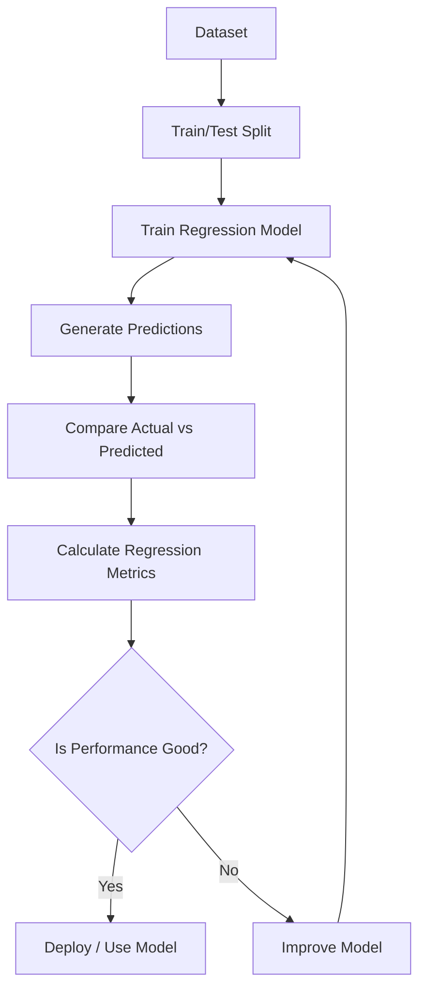
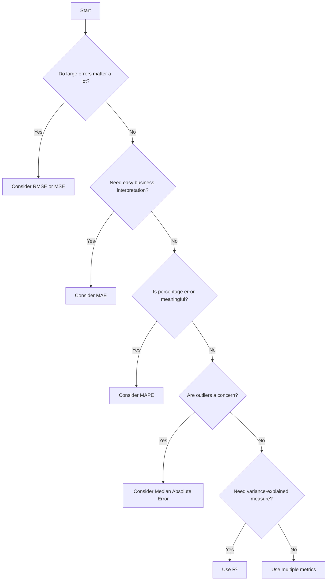
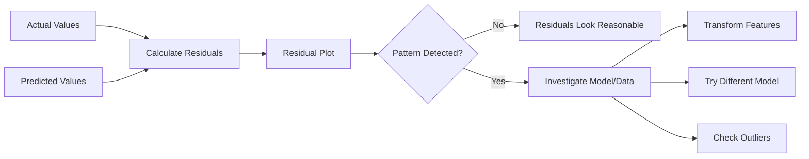
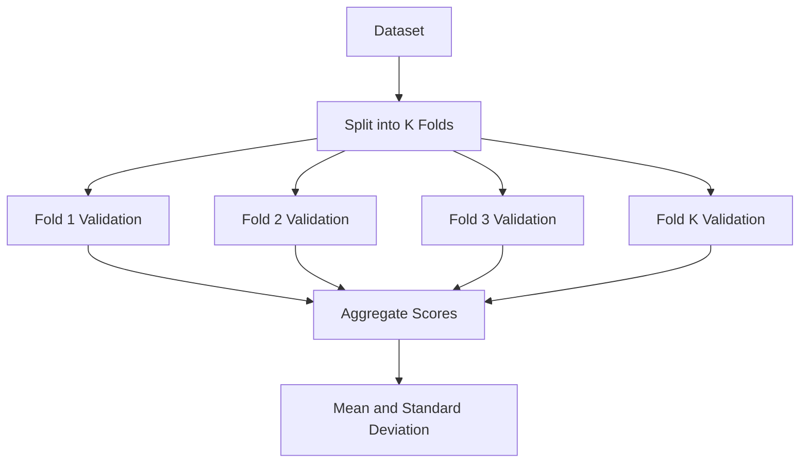
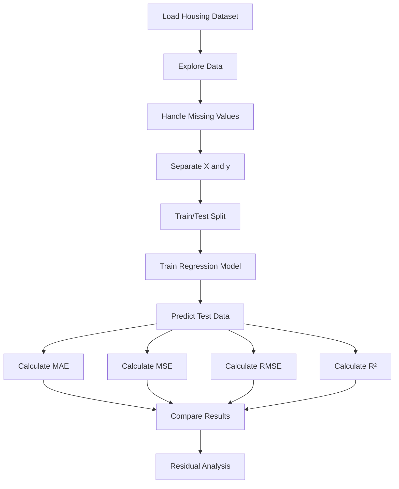
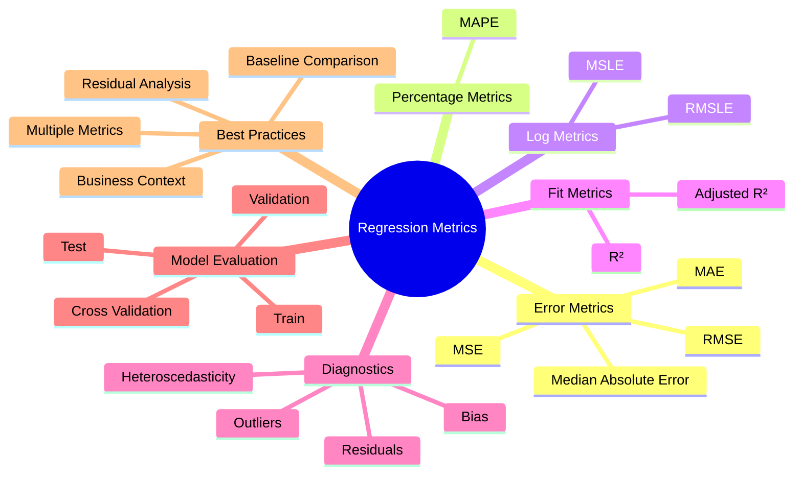

# 📊 Regression Metrics in Machine Learning

> **Regression metrics** are quantitative measures used to evaluate how accurately a machine learning model predicts continuous numerical values.

---

## 📚 Table of Contents

1. [🎯 Introduction](#1--introduction)
2. [🧠 What Is Regression?](#2--what-is-regression)
3. [📌 Why Regression Metrics Matter](#3--why-regression-metrics-matter)
4. [📖 Important Terminology](#4--important-terminology)
5. [📐 Actual vs Predicted Values](#5--actual-vs-predicted-values)
6. [📊 Major Regression Metrics](#6--major-regression-metrics)
   - [6.1 MAE](#61--mean-absolute-error-mae)
   - [6.2 MSE](#62--mean-squared-error-mse)
   - [6.3 RMSE](#63--root-mean-squared-error-rmse)
   - [6.4 R² Score](#64--r²-score)
   - [6.5 Adjusted R²](#65--adjusted-r²)
   - [6.6 MAPE](#66--mean-absolute-percentage-error-mape)
   - [6.7 Median Absolute Error](#67--median-absolute-error)
   - [6.8 MSLE and RMSLE](#68--msle-and-rmsle)
7. [⚖️ Metric Comparison](#7--metric-comparison)
8. [🎯 How to Choose the Right Metric](#8--how-to-choose-the-right-metric)
9. [🚨 Understanding Residuals](#9--understanding-residuals)
10. [📈 Residual Analysis](#10--residual-analysis)
11. [🧮 Worked Example](#11--worked-example)
12. [🐍 Python Implementation](#12--python-implementation)
13. [🤖 Regression Metrics with Scikit-Learn](#13--regression-metrics-with-scikit-learn)
14. [🌍 Real-World Use Cases](#14--real-world-use-cases)
15. [🔬 Advanced Concepts](#15--advanced-concepts)
16. [⚠️ Advantages and Limitations](#16--advantages-and-limitations)
17. [❌ Common Mistakes](#17--common-mistakes)
18. [✅ Best Practices](#18--best-practices)
19. [🛠️ Practical Mini-Project](#19--practical-mini-project)
20. [💼 Regression Metrics Interview Questions](#20--regression-metrics-interview-questions)
21. [🧾 Important Formulas](#21--important-formulas)
22. [⚡ Quick Revision](#22--quick-revision)
23. [🗺️ Visual Summary / Roadmap](#23--visual-summary--roadmap)

---

# 1. 🎯 Introduction

In supervised machine learning, **regression** is used when the target variable is numerical and continuous.

Examples:

- Predicting house prices
- Predicting temperature
- Predicting sales
- Predicting stock-related numerical values
- Predicting delivery time
- Predicting electricity consumption

A regression model produces predictions, but predictions alone do not tell us whether the model is good.

We need **evaluation metrics** to measure the difference between:

- Actual value: `y`
- Predicted value: `ŷ`

The difference between them is called the **error** or **residual**.

Regression metrics help answer questions such as:

> How far are the predictions from the actual values?

> Does the model make large errors?

> Does the model explain the variation in the target?

> Is the model better than another model?

---

# 2. 🧠 What Is Regression?

Regression is a supervised learning technique used to predict a **continuous numerical target**.

For example:

```text
Features
   ↓
House Size
Number of Rooms
Location
Age of House
   ↓
Regression Model
   ↓
Predicted Price
```

A simple linear regression model can be represented as:

$$
\hat{y} = b_0 + b_1x
$$

Where:

- `ŷ` = predicted value
- `b₀` = intercept
- `b₁` = coefficient/slope
- `x` = input feature

For multiple linear regression:

$$
\hat{y} = b_0 + b_1x_1 + b_2x_2 + \cdots + b_nx_n
$$

---

## 2.1 📉 Regression Evaluation Workflow



---

# 3. 📌 Why Regression Metrics Matter

A model can produce predictions that look reasonable but still have significant errors.

Consider:

| Actual | Predicted | Error |
|---:|---:|---:|
| 100 | 98 | 2 |
| 200 | 205 | 5 |
| 300 | 280 | 20 |

Simply looking at predictions is not enough.

Metrics convert prediction errors into numerical scores that can be compared.

### Main purposes

- 📊 Measure model performance
- 🔍 Compare different models
- 🛠️ Tune hyperparameters
- 🚨 Detect large prediction errors
- 📈 Monitor production models
- 🎯 Select a model according to business requirements

---

# 4. 📖 Important Terminology

| Term | Meaning |
|---|---|
| Actual value | Real observed target value |
| Predicted value | Value predicted by the model |
| Error | Difference between actual and predicted value |
| Residual | Usually defined as `Actual - Predicted` |
| Absolute error | Absolute value of residual |
| Squared error | Residual raised to the power of 2 |
| Mean | Average |
| Outlier | Observation substantially different from typical observations |
| Target | Variable being predicted |
| R² | Proportion of target variance explained by the model |

---

# 5. 📐 Actual vs Predicted Values

Suppose:

```text
Actual values:
[100, 200, 300, 400]

Predicted values:
[110, 190, 280, 420]
```

Residual:

$$
e_i = y_i - \hat{y}_i
$$

Therefore:

| Actual (`y`) | Predicted (`ŷ`) | Residual (`y - ŷ`) | Absolute Error |
|---:|---:|---:|---:|
| 100 | 110 | -10 | 10 |
| 200 | 190 | 10 | 10 |
| 300 | 280 | 20 | 20 |
| 400 | 420 | -20 | 20 |

A good regression model generally produces residuals that are small and do not show problematic systematic patterns.

---

# 6. 📊 Major Regression Metrics

The most commonly used regression metrics are:

1. **MAE — Mean Absolute Error**
2. **MSE — Mean Squared Error**
3. **RMSE — Root Mean Squared Error**
4. **R² Score — Coefficient of Determination**
5. **Adjusted R²**
6. **MAPE — Mean Absolute Percentage Error**
7. **Median Absolute Error**
8. **MSLE — Mean Squared Logarithmic Error**
9. **RMSLE — Root Mean Squared Logarithmic Error**

---

# 6.1 📏 Mean Absolute Error (MAE)

## Definition

MAE measures the average absolute difference between actual and predicted values.

### Formula

$$
MAE = \frac{1}{n}\sum_{i=1}^{n}|y_i-\hat{y}_i|
$$

Where:

- `n` = number of observations
- `yᵢ` = actual value
- `ŷᵢ` = predicted value

### Example

Actual:

```text
[100, 200, 300]
```

Predicted:

```text
[110, 190, 280]
```

Absolute errors:

```text
[10, 10, 20]
```

Therefore:

$$
MAE = \frac{10+10+20}{3}
$$

$$
MAE = 13.33
$$

### Interpretation

An MAE of `13.33` means the model's predictions are off by approximately **13.33 target units on average**.

### Advantages

- Easy to understand
- Same units as target
- Less sensitive to outliers than MSE/RMSE

### Limitations

- Treats all errors linearly
- Does not heavily penalize large errors

### Best use

Use MAE when:

> Every unit of prediction error has approximately equal importance.

---

# 6.2 🧮 Mean Squared Error (MSE)

MSE calculates the average squared error.

### Formula

$$
MSE = \frac{1}{n}\sum_{i=1}^{n}(y_i-\hat{y}_i)^2
$$

### Example

Errors:

```text
[10, -10, 20]
```

Squared errors:

```text
[100, 100, 400]
```

Therefore:

$$
MSE = \frac{100+100+400}{3}
$$

$$
MSE = 200
$$

### Why square the error?

Squaring:

1. Makes all errors positive
2. Penalizes large errors more strongly

For example:

```text
Error = 2   → Squared error = 4
Error = 10  → Squared error = 100
```

The error increased by `5×`, but the squared error increased by `25×`.

### Advantages

- Strongly penalizes large errors
- Differentiable and useful for optimization
- Commonly used as a training loss

### Limitations

- Sensitive to outliers
- Units become squared

For example:

```text
Target unit = dollars
MSE unit = dollars²
```

---

# 6.3 📐 Root Mean Squared Error (RMSE)

RMSE is the square root of MSE.

### Formula

$$
RMSE = \sqrt{\frac{1}{n}\sum_{i=1}^{n}(y_i-\hat{y}_i)^2}
$$

Using the previous example:

$$
RMSE = \sqrt{200}
$$

$$
RMSE \approx 14.14
$$

### Why use RMSE?

RMSE returns the metric to the **same unit as the target variable**.

If the target is:

```text
House price → ₹
```

Then:

```text
RMSE → ₹
```

### MAE vs RMSE

| Characteristic | MAE | RMSE |
|---|---|---|
| Calculation | Absolute error | Squared error |
| Outlier sensitivity | Lower | Higher |
| Target units | Yes | Yes |
| Large-error penalty | Lower | Higher |
| Interpretability | Excellent | Excellent |
| Common use | General error | When large errors matter |

### Best use

Use RMSE when:

> Large prediction errors should be penalized more heavily.

---

# 6.4 📈 R² Score

R² is called the **coefficient of determination**.

It measures how much of the variation in the target variable is explained by the model relative to a baseline that predicts the mean target.

### Formula

$$
R^2 = 1-\frac{SS_{res}}{SS_{tot}}
$$

Where:

$$
SS_{res} = \sum_{i=1}^{n}(y_i-\hat{y}_i)^2
$$

and

$$
SS_{tot} = \sum_{i=1}^{n}(y_i-\bar{y})^2
$$

Therefore:

$$
R^2 =
1-
\frac{\sum(y_i-\hat{y}_i)^2}
{\sum(y_i-\bar{y})^2}
$$

Where `ȳ` is the mean of actual target values.

### Interpretation

Suppose:

```text
R² = 0.80
```

This means the model explains approximately **80% of the variation in the target relative to the mean-prediction baseline**.

### Typical interpretation

| R² | General interpretation |
|---:|---|
| 1.0 | Perfect fit |
| 0.9 | Very strong fit |
| 0.8 | Strong fit |
| 0.5 | Moderate fit |
| 0.2 | Weak fit |
| 0 | No improvement over mean baseline |
| < 0 | Worse than mean baseline |

> ⚠️ These ranges are contextual, not universal quality standards.

### Important

A high R² does **not automatically mean** that the model is useful.

Always consider:

- MAE
- RMSE
- Business cost
- Data distribution
- Residual patterns
- Generalization performance

---

# 6.5 📊 Adjusted R²

Adjusted R² modifies R² based on the number of predictors in the model.

### Formula

$$
Adjusted\ R^2 =
1-
(1-R^2)
\frac{n-1}{n-p-1}
$$

Where:

- `n` = number of observations
- `p` = number of predictors/features
- `R²` = ordinary R²

### Why is Adjusted R² useful?

Ordinary R² can increase or remain unchanged when additional predictors are added.

Adjusted R² introduces a penalty for unnecessary predictors.

### Example

| Model | Features | R² | Adjusted R² |
|---|---:|---:|---:|
| Model A | 3 | 0.82 | 0.81 |
| Model B | 10 | 0.83 | 0.78 |

Although Model B has a slightly higher R², Model A may be preferable because its adjusted R² is higher.

---

# 6.6 📊 Mean Absolute Percentage Error (MAPE)

MAPE measures error as a percentage.

### Formula

$$
MAPE =
\frac{100}{n}
\sum_{i=1}^{n}
\left|
\frac{y_i-\hat{y}_i}{y_i}
\right|
$$

### Example

Actual:

```text
100
```

Predicted:

```text
90
```

Percentage error:

$$
\left|\frac{100-90}{100}\right|\times100 = 10\%
$$

### Advantages

- Easy to communicate
- Scale-independent
- Useful for business forecasting

### Limitations

MAPE has a major problem when actual values are zero or close to zero.

If:

```text
Actual = 0
```

Then division by zero occurs.

It can also become unstable when actual values are very small.

### Best use

MAPE is useful when:

- Actual target values are positive
- Percentage error is meaningful
- Zero/near-zero targets are not common

---

# 6.7 🛡️ Median Absolute Error

Median Absolute Error takes the median of absolute errors.

### Formula

$$
MedAE =
median(|y_i-\hat{y}_i|)
$$

### Why use it?

The median is more resistant to extreme outliers than the mean.

Suppose errors are:

```text
[2, 3, 4, 5, 100]
```

MAE is strongly influenced by `100`.

Median absolute error is:

```text
4
```

### Best use

Useful when:

- Outliers exist
- Robust evaluation is required
- Typical prediction error matters more than extreme errors

---

# 6.8 📉 MSLE and RMSLE

## MSLE — Mean Squared Logarithmic Error

### Formula

$$
MSLE =
\frac{1}{n}
\sum_{i=1}^{n}
[\log(1+y_i)-\log(1+\hat{y}_i)]^2
$$

## RMSLE

$$
RMSLE = \sqrt{MSLE}
$$

### Why use logarithms?

Logarithmic metrics reduce the impact of very large target values and focus more on relative differences.

For example:

```text
Actual = 100
Predicted = 110

Actual = 10,000
Predicted = 11,000
```

Both represent approximately a 10% relative error.

RMSLE can be useful when relative differences are more important than absolute differences.

### Important limitation

Standard MSLE/RMSLE requires non-negative target and prediction values.

---

# 7. ⚖️ Metric Comparison

| Metric | Lower/Better | Outlier Sensitivity | Same Units? | Main Strength |
|---|---|---|---|---|
| MAE | Lower | Low–Moderate | Yes | Easy interpretation |
| MSE | Lower | High | No | Penalizes large errors |
| RMSE | Lower | High | Yes | Large-error sensitivity + original units |
| R² | Higher | Sensitive to squared errors | No | Variance explained |
| Adjusted R² | Higher | Sensitive to model structure | No | Penalizes unnecessary predictors |
| MAPE | Lower | Can be problematic | Percentage | Relative error |
| Median AE | Lower | Low | Yes | Robust to outliers |
| MSLE | Lower | Lower influence from large values | No | Relative/log-scale error |
| RMSLE | Lower | Lower influence from large values | No | Relative error in original log scale |

---

# 8. 🎯 How to Choose the Right Metric

Metric selection should depend on the **business problem**, not just mathematical convenience.



### Practical recommendation

In many regression projects, report at least:

```text
MAE + RMSE + R²
```

Why?

- **MAE** → average error in understandable units
- **RMSE** → highlights large errors
- **R²** → explains model fit relative to baseline

---

# 9. 🚨 Understanding Residuals

Residual:

$$
e_i = y_i-\hat{y}_i
$$

Example:

```text
Actual = 500
Predicted = 450

Residual = 500 - 450
         = 50
```

### Residual interpretation

| Residual | Meaning |
|---:|---|
| Positive | Model underpredicted |
| Negative | Model overpredicted |
| Zero | Perfect prediction |

---

# 10. 📈 Residual Analysis

A good model should generally have residuals that:

- Are centered around zero
- Do not show obvious patterns
- Have relatively stable spread
- Do not show strong systematic structure

### Residual workflow



### Common residual patterns

| Pattern | Possible issue |
|---|---|
| Curved pattern | Non-linear relationship |
| Funnel shape | Heteroscedasticity |
| Extreme points | Outliers |
| Long runs of positive/negative residuals | Systematic bias |
| Clusters | Missing feature or subpopulation |

---

# 11. 🧮 Worked Example

Consider:

| Actual | Predicted |
|---:|---:|
| 10 | 12 |
| 20 | 18 |
| 30 | 33 |
| 40 | 36 |

Residuals:

```text
[-2, 2, -3, 4]
```

Absolute errors:

```text
[2, 2, 3, 4]
```

## MAE

$$
MAE = \frac{2+2+3+4}{4}
$$

$$
MAE = 2.75
$$

## MSE

Squared errors:

```text
[4, 4, 9, 16]
```

$$
MSE = \frac{4+4+9+16}{4}
$$

$$
MSE = 8.25
$$

## RMSE

$$
RMSE = \sqrt{8.25}
$$

$$
RMSE \approx 2.87
$$

So:

```text
MAE  ≈ 2.75
MSE  = 8.25
RMSE ≈ 2.87
```

---

# 12. 🐍 Python Implementation

```python
import numpy as np

y_true = np.array([10, 20, 30, 40])
y_pred = np.array([12, 18, 33, 36])

errors = y_true - y_pred

mae = np.mean(np.abs(errors))
mse = np.mean(errors ** 2)
rmse = np.sqrt(mse)

print("MAE:", mae)
print("MSE:", mse)
print("RMSE:", rmse)
```

### Output

```text
MAE: 2.75
MSE: 8.25
RMSE: 2.872...
```

---

# 13. 🤖 Regression Metrics with Scikit-Learn

`scikit-learn` provides ready-to-use implementations.

```python
from sklearn.metrics import (
    mean_absolute_error,
    mean_squared_error,
    r2_score,
    mean_absolute_percentage_error,
    median_absolute_error,
    mean_squared_log_error
)

y_true = [10, 20, 30, 40]
y_pred = [12, 18, 33, 36]

mae = mean_absolute_error(y_true, y_pred)
mse = mean_squared_error(y_true, y_pred)
rmse = mean_squared_error(y_true, y_pred) ** 0.5
r2 = r2_score(y_true, y_pred)
mape = mean_absolute_percentage_error(y_true, y_pred)
medae = median_absolute_error(y_true, y_pred)

print("MAE:", mae)
print("MSE:", mse)
print("RMSE:", rmse)
print("R²:", r2)
print("MAPE:", mape)
print("Median AE:", medae)
```

---

## 13.1 🧪 Complete Regression Evaluation

```python
from sklearn.datasets import fetch_california_housing
from sklearn.model_selection import train_test_split
from sklearn.linear_model import LinearRegression
from sklearn.metrics import (
    mean_absolute_error,
    mean_squared_error,
    r2_score
)

# Load data
X, y = fetch_california_housing(return_X_y=True)

# Train-test split
X_train, X_test, y_train, y_test = train_test_split(
    X,
    y,
    test_size=0.2,
    random_state=42
)

# Train model
model = LinearRegression()
model.fit(X_train, y_train)

# Predictions
y_pred = model.predict(X_test)

# Metrics
mae = mean_absolute_error(y_test, y_pred)
mse = mean_squared_error(y_test, y_pred)
rmse = mse ** 0.5
r2 = r2_score(y_test, y_pred)

print("MAE :", mae)
print("MSE :", mse)
print("RMSE:", rmse)
print("R²  :", r2)
```

---

# 14. 🌍 Real-World Use Cases

## 🏠 House Price Prediction

Target:

```text
House Price
```

Useful metrics:

- MAE
- RMSE
- R²

If large pricing mistakes are expensive, RMSE can be especially informative.

---

## 🛒 Sales Forecasting

Target:

```text
Future Sales
```

Useful metrics:

- MAE
- MAPE
- RMSE

MAPE can communicate performance in percentage terms when actual sales are positive and not near zero.

---

## 🚚 Delivery Time Prediction

Target:

```text
Delivery Time
```

Useful metrics:

- MAE
- RMSE

MAE answers:

> On average, how many minutes are we wrong?

---

## ⚡ Energy Consumption

Target:

```text
Electricity Consumption
```

Useful metrics:

- MAE
- RMSE
- R²

Large errors may be important for capacity planning.

---

## 🌡️ Temperature Prediction

Target:

```text
Temperature
```

Useful metrics:

- MAE
- RMSE

MAE is easy to communicate because it stays in temperature units.

---

# 15. 🔬 Advanced Concepts

## 15.1 📏 Scale Dependence

MAE, MSE, and RMSE depend on the scale of the target.

Example:

```text
Model A:
MAE = 5 dollars

Model B:
MAE = 5 kilograms
```

The numerical values cannot be directly compared because the target units differ.

---

## 15.2 ⚠️ Outlier Sensitivity

Consider:

```text
Errors = [1, 2, 2, 3, 50]
```

The error `50` has a very large impact on MSE and RMSE.

This is because:

$$
50^2 = 2500
$$

MAE is affected less severely.

### General relationship

```text
MAE
  ↓
Moderate outlier sensitivity

RMSE
  ↓
High outlier sensitivity
```

---

## 15.3 🎯 Training Loss vs Evaluation Metric

A metric used for evaluation does not always need to be the same as the loss function used during training.

For example:

```text
Training:
MSE Loss

Evaluation:
MAE + RMSE + R²
```

This can provide a more complete picture.

---

## 15.4 📊 Cross-Validation

Instead of evaluating the model on only one train/test split, use cross-validation.



Example:

```python
from sklearn.model_selection import cross_val_score
from sklearn.linear_model import LinearRegression

model = LinearRegression()

scores = cross_val_score(
    model,
    X,
    y,
    cv=5,
    scoring="neg_mean_absolute_error"
)

mae_scores = -scores

print("Fold MAE:", mae_scores)
print("Mean MAE:", mae_scores.mean())
```

### Why is MAE negative in `cross_val_score`?

Scikit-learn uses a convention where metrics that should be minimized are represented as **negative scores** so that larger score values consistently mean better performance.

Therefore:

```python
mae = -negative_mae
```

---

## 15.5 📈 Prediction Intervals

Point predictions do not tell us how uncertain a prediction is.

Instead of:

```text
Predicted price = ₹500,000
```

we may want:

```text
Predicted price = ₹500,000
Prediction interval = ₹460,000–₹540,000
```

Prediction intervals are particularly important in high-risk or high-value applications.

---

## 15.6 🧠 Robust Regression Evaluation

When datasets contain extreme outliers, consider:

- Median Absolute Error
- MAE
- Robust loss functions
- Outlier investigation
- Quantile regression

Do not automatically remove outliers simply to improve a metric. First determine whether the outliers are:

- Data errors
- Genuine rare events
- Important business cases

---

## 15.7 📉 Normalized Metrics

When comparing performance across datasets with different scales, normalized metrics can be useful.

For example:

$$
Normalized\ MAE =
\frac{MAE}{Mean\ Target}
$$

or

$$
Normalized\ RMSE =
\frac{RMSE}{Mean\ Target}
$$

The appropriate normalization depends on the application.

---

# 16. ⚠️ Advantages and Limitations

| Metric | Advantages | Limitations |
|---|---|---|
| MAE | Simple, interpretable, robust compared with MSE | Does not strongly penalize large errors |
| MSE | Strongly penalizes large errors, optimization-friendly | Sensitive to outliers, squared units |
| RMSE | Same units as target, emphasizes large errors | Sensitive to outliers |
| R² | Scale-independent, useful for model comparison | Can be misunderstood; not a direct error measure |
| Adjusted R² | Penalizes unnecessary predictors | Mainly useful in linear-model feature comparison |
| MAPE | Easy percentage interpretation | Problems with zero/near-zero actuals |
| Median AE | Very robust to outliers | May hide the effect of extreme errors |
| MSLE/RMSLE | Good for relative/log-scale differences | Requires non-negative values |

---

# 17. ❌ Common Mistakes

## Mistake 1: Only using R²

A model can have a high R² but still produce errors that are unacceptable for the business.

### Better approach

Use:

```text
R² + MAE + RMSE
```

---

## Mistake 2: Ignoring target units

An MSE of `100` is not directly interpretable in the original target units.

Use RMSE when you want the same units.

---

## Mistake 3: Using MAPE with zero values

MAPE contains:

$$
\frac{1}{y_i}
$$

Therefore, zero actual values cause a mathematical problem.

---

## Mistake 4: Comparing MAE across different target scales

For example:

```text
Dataset A:
MAE = 10

Dataset B:
MAE = 10
```

This does not necessarily mean equal performance if one target is around `20` and another is around `10,000`.

---

## Mistake 5: Ignoring outliers

Outliers can dramatically affect:

- MSE
- RMSE
- R²

Always investigate extreme errors.

---

## Mistake 6: Evaluating on training data only

Training performance can be overly optimistic.

Always evaluate on unseen validation/test data.

---

## Mistake 7: Data leakage

Do not allow test information to influence training or preprocessing.

Correct:

```text
Training Data
   ↓
Fit preprocessing
   ↓
Train model

Test Data
   ↓
Apply learned preprocessing
   ↓
Predict
```

---

# 18. ✅ Best Practices

### 1. Use multiple metrics

A strong default:

```text
MAE + RMSE + R²
```

### 2. Understand business costs

Ask:

> Is a ₹10,000 error twice as bad as a ₹5,000 error?

If yes, MAE may be intuitive.

If very large errors are disproportionately costly, RMSE may be more appropriate.

### 3. Inspect residuals

Metrics summarize performance; residual plots help explain it.

### 4. Evaluate on unseen data

Use:

- Validation set
- Test set
- Cross-validation

### 5. Report confidence/variability

Instead of only:

```text
RMSE = 2.4
```

consider reporting cross-validation mean and standard deviation:

```text
RMSE = 2.4 ± 0.2
```

### 6. Match metrics to the target distribution

For highly skewed positive targets, consider log-based metrics or target transformations when justified.

---

# 19. 🛠️ Practical Mini-Project

## 🏠 House Price Regression Evaluation

### Objective

Build a regression model and evaluate it using multiple regression metrics.

### Workflow



---

## 19.1 🐍 Mini-Project Code

```python
import pandas as pd
import matplotlib.pyplot as plt

from sklearn.model_selection import train_test_split
from sklearn.ensemble import RandomForestRegressor
from sklearn.metrics import (
    mean_absolute_error,
    mean_squared_error,
    r2_score
)

# Example dataset
df = pd.read_csv("housing.csv")

# Features and target
X = df.drop("price", axis=1)
y = df["price"]

# Split data
X_train, X_test, y_train, y_test = train_test_split(
    X,
    y,
    test_size=0.2,
    random_state=42
)

# Model
model = RandomForestRegressor(
    n_estimators=200,
    random_state=42
)

# Train
model.fit(X_train, y_train)

# Predict
y_pred = model.predict(X_test)

# Metrics
mae = mean_absolute_error(y_test, y_pred)
mse = mean_squared_error(y_test, y_pred)
rmse = mse ** 0.5
r2 = r2_score(y_test, y_pred)

print(f"MAE : {mae:.2f}")
print(f"MSE : {mse:.2f}")
print(f"RMSE: {rmse:.2f}")
print(f"R²  : {r2:.4f}")

# Residuals
residuals = y_test - y_pred

plt.scatter(y_pred, residuals)
plt.axhline(0, linestyle="--")
plt.xlabel("Predicted Values")
plt.ylabel("Residuals")
plt.title("Residual Plot")
plt.show()
```

### Mini-project interpretation

Suppose you get:

```text
MAE  = 18,000
RMSE = 31,000
R²   = 0.88
```

Interpretation:

- Typical absolute error is around `18,000` target units.
- RMSE is considerably higher, suggesting some larger errors.
- The model explains approximately `88%` of target variation relative to the mean baseline.

Do not declare the model "good" from these numbers alone. Compare them with:

- A baseline model
- Business requirements
- Alternative models
- Cross-validation results
- Residual diagnostics

---

# 20. 💼 Regression Metrics Interview Questions

## Q1. What is MAE?

**Answer:**

MAE is the average absolute difference between actual and predicted values.

$$
MAE=\frac{1}{n}\sum|y_i-\hat{y}_i|
$$

---

## Q2. What is the difference between MAE and MSE?

**Answer:**

MAE uses absolute errors, while MSE squares errors.

Therefore, MSE penalizes large errors more strongly.

---

## Q3. Why is RMSE preferred over MSE for interpretation?

**Answer:**

RMSE is the square root of MSE, so it has the same units as the target variable.

---

## Q4. Which metric is more sensitive to outliers: MAE or RMSE?

**Answer:**

RMSE is more sensitive because errors are squared.

---

## Q5. Can R² be negative?

**Answer:**

Yes.

A negative R² means the model performs worse than the baseline that always predicts the mean target value, under the usual R² definition.

---

## Q6. Is higher R² always better?

**Answer:**

Not necessarily.

A higher R² can occur with overfitting or added complexity. Evaluate validation/test performance and consider adjusted R² where appropriate.

---

## Q7. When should you use MAPE?

**Answer:**

Use MAPE when percentage error is meaningful and actual values are positive and sufficiently far from zero.

---

## Q8. What happens to MSE when there is an outlier?

**Answer:**

MSE can increase dramatically because the error is squared.

---

## Q9. Why use multiple metrics?

**Answer:**

Each metric captures a different aspect of performance.

For example:

```text
MAE  → typical absolute error
RMSE → large-error sensitivity
R²   → variance explained
```

---

## Q10. What is Adjusted R²?

**Answer:**

Adjusted R² modifies R² by accounting for the number of predictors, penalizing unnecessary model complexity.

---

## Q11. What is a residual?

**Answer:**

A residual is the difference between actual and predicted values:

$$
Residual = y-\hat{y}
$$

---

## Q12. What does a residual pattern indicate?

**Answer:**

A systematic residual pattern can indicate that the model is missing structure, such as non-linearity, changing variance, or important features.

---

# 21. 🧾 Important Formulas

## MAE

$$
\boxed{
MAE=
\frac{1}{n}
\sum_{i=1}^{n}|y_i-\hat{y}_i|
}
$$

## MSE

$$
\boxed{
MSE=
\frac{1}{n}
\sum_{i=1}^{n}(y_i-\hat{y}_i)^2
}
$$

## RMSE

$$
\boxed{
RMSE=
\sqrt{
\frac{1}{n}
\sum_{i=1}^{n}(y_i-\hat{y}_i)^2
}
}
$$

## R²

$$
\boxed{
R^2=
1-
\frac{
\sum(y_i-\hat{y}_i)^2
}{
\sum(y_i-\bar{y})^2
}
}
$$

## Adjusted R²

$$
\boxed{
Adjusted\ R^2=
1-
(1-R^2)
\frac{n-1}{n-p-1}
}
$$

## MAPE

$$
\boxed{
MAPE=
\frac{100}{n}
\sum
\left|
\frac{y_i-\hat{y}_i}{y_i}
\right|
}
$$

## Median Absolute Error

$$
\boxed{
MedAE=
median(|y_i-\hat{y}_i|)
}
$$

## MSLE

$$
\boxed{
MSLE=
\frac{1}{n}
\sum
[\log(1+y_i)-\log(1+\hat{y}_i)]^2
}
$$

## RMSLE

$$
\boxed{
RMSLE=
\sqrt{MSLE}
}
$$

---

# 22. ⚡ Quick Revision

## 🔑 Key Points

- Regression predicts continuous numerical values.
- Regression metrics measure prediction performance.
- **MAE** measures average absolute error.
- **MSE** squares errors and heavily penalizes large errors.
- **RMSE** is the square root of MSE and uses target units.
- **R²** measures improvement relative to a mean-prediction baseline.
- **Adjusted R²** penalizes unnecessary predictors.
- **MAPE** expresses error as a percentage but has problems with zero/near-zero actual values.
- **Median Absolute Error** is robust to outliers.
- **MSLE/RMSLE** focus on logarithmic/relative differences and require non-negative values.
- Always evaluate on unseen data.
- Residual analysis is an important complement to numerical metrics.
- No single metric is best for every regression problem.

---

## 🧠 Metric Cheat Sheet

| If you care about... | Consider |
|---|---|
| Easy-to-understand average error | MAE |
| Large errors | RMSE |
| Optimization with squared loss | MSE |
| Explained variation | R² |
| Feature-count penalty | Adjusted R² |
| Percentage error | MAPE |
| Outlier robustness | Median AE |
| Relative/log-scale error | RMSLE |

---

## 🐍 Important Scikit-Learn Commands

```python
from sklearn.metrics import (
    mean_absolute_error,
    mean_squared_error,
    r2_score,
    mean_absolute_percentage_error,
    median_absolute_error,
    mean_squared_log_error
)
```

Calculate common metrics:

```python
mae = mean_absolute_error(y_test, y_pred)

mse = mean_squared_error(y_test, y_pred)

rmse = mean_squared_error(y_test, y_pred) ** 0.5

r2 = r2_score(y_test, y_pred)

mape = mean_absolute_percentage_error(y_test, y_pred)

medae = median_absolute_error(y_test, y_pred)
```

---

## 📌 Simple Memory Trick

```text
MAE
↓
Absolute Error
↓
Easy Interpretation

MSE
↓
Squared Error
↓
Strong Large-Error Penalty

RMSE
↓
√MSE
↓
Same Target Units

R²
↓
Variance Explained
↓
Higher is generally better

MAPE
↓
Percentage Error
↓
Watch for Zero Values
```

---

# 23. 🗺️ Visual Summary / Roadmap



---

# 🎓 Final Takeaway

Regression model evaluation is not about finding one universally "best" metric.

Instead, choose metrics based on **what type of error matters in your problem**.

A practical evaluation strategy is:

```text
Build Model
    ↓
Generate Predictions
    ↓
Calculate MAE
    ↓
Calculate RMSE
    ↓
Calculate R²
    ↓
Inspect Residuals
    ↓
Compare with Baseline
    ↓
Validate with Cross-Validation
    ↓
Choose Based on Business Requirements
```

### ⭐ Remember

> **MAE tells you how wrong you are on average.**

> **RMSE tells you how much large errors hurt.**

> **R² tells you how much variation your model explains relative to a mean baseline.**

> **Residual analysis tells you what your metrics may be hiding.**

> **The best metric is the one aligned with the real-world cost of prediction errors.**
