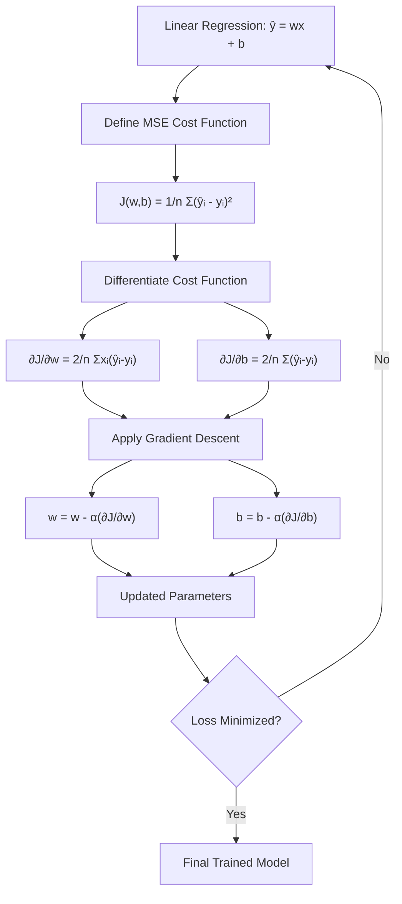

# 🧮 Derivation of Gradient Descent Formula

This note derives the **Gradient Descent update formula** step by step using **Linear Regression** and **Mean Squared Error (MSE)**.

---

## 📚 Table of Contents

1. [Linear Regression Model](#1--linear-regression-model)
2. [Define the Error](#2--define-the-error)
3. [Define the Cost Function](#3--define-the-cost-function)
4. [Derivation of Gradient With Respect to Weight](#4--derivation-of-gradient-with-respect-to-weight)
5. [Derivation of Gradient With Respect to Bias](#5--derivation-of-gradient-with-respect-to-bias)
6. [Why Do We Move in the Negative Gradient Direction?](#6--why-do-we-move-in-the-negative-gradient-direction)
7. [Introduce the Learning Rate](#7--introduce-the-learning-rate)
8. [Final Gradient Descent Equations](#8--final-gradient-descent-equations)
9. [Numerical Example](#9--numerical-example)
10. [Complete Derivation Flow](#10--complete-derivation-flow)
11. [Important Formulas](#11--important-formulas)
12. [Important Note About the Factor 2](#12--important-note-about-the-factor-2)
13. [Quick Revision](#13--quick-revision)

---

# 1. 📈 Linear Regression Model

For a single feature:

\[
\hat{y} = wx + b
\]

| Symbol | Meaning |
|---|---|
| \(x\) | Input feature |
| \(y\) | Actual/target value |
| \(\hat{y}\) | Predicted value |
| \(w\) | Weight / slope |
| \(b\) | Bias / intercept |

The goal is to find the values of \(w\) and \(b\) that minimize prediction error.

---

# 2. ❌ Define the Error

The prediction error is:

\[
e = \hat{y} - y
\]

Since:

\[
\hat{y} = wx + b
\]

we get:

\[
e = wx+b-y
\]

For the \(i\)-th training example:

\[
e_i = \hat{y}_i-y_i
\]

and:

\[
e_i = wx_i+b-y_i
\]

---

# 3. 📉 Define the Cost Function

A common cost function for Linear Regression is **Mean Squared Error (MSE)**:

\[
J(w,b)
=
\frac{1}{n}
\sum_{i=1}^{n}
(\hat{y}_i-y_i)^2
\]

Substitute:

\[
\hat{y}_i = wx_i+b
\]

Therefore:

\[
J(w,b)
=
\frac{1}{n}
\sum_{i=1}^{n}
(wx_i+b-y_i)^2
\]

Our objective is:

\[
\boxed{\min J(w,b)}
\]

We want the values of \(w\) and \(b\) that produce the smallest possible loss.

---

# 4. 🔍 Derivation of Gradient With Respect to Weight

We need to calculate:

\[
\frac{\partial J}{\partial w}
\]

Start with:

\[
J(w,b)
=
\frac{1}{n}
\sum_{i=1}^{n}
(wx_i+b-y_i)^2
\]

Differentiate with respect to \(w\):

\[
\frac{\partial J}{\partial w}
=
\frac{1}{n}
\sum_{i=1}^{n}
\frac{\partial}{\partial w}
(wx_i+b-y_i)^2
\]

## 4.1 Apply the Chain Rule

Recall:

\[
\frac{d}{dw}(u^2)
=
2u\frac{du}{dw}
\]

Let:

\[
u=wx_i+b-y_i
\]

Then:

\[
\frac{du}{dw}=x_i
\]

Therefore:

\[
\frac{\partial J}{\partial w}
=
\frac{1}{n}
\sum_{i=1}^{n}
2(wx_i+b-y_i)x_i
\]

So:

\[
\boxed{
\frac{\partial J}{\partial w}
=
\frac{2}{n}
\sum_{i=1}^{n}
x_i(wx_i+b-y_i)
}
\]

Since:

\[
\hat{y}_i=wx_i+b
\]

we can write:

\[
\boxed{
\frac{\partial J}{\partial w}
=
\frac{2}{n}
\sum_{i=1}^{n}
x_i(\hat{y}_i-y_i)
}
\]

### ⭐ Weight Gradient

```text
∂J/∂w = (2/n) Σ xᵢ(ŷᵢ - yᵢ)
```

---

# 5. 🔍 Derivation of Gradient With Respect to Bias

Now calculate:

\[
\frac{\partial J}{\partial b}
\]

Start with:

\[
J(w,b)
=
\frac{1}{n}
\sum_{i=1}^{n}
(wx_i+b-y_i)^2
\]

Differentiate with respect to \(b\):

\[
\frac{\partial J}{\partial b}
=
\frac{1}{n}
\sum_{i=1}^{n}
\frac{\partial}{\partial b}
(wx_i+b-y_i)^2
\]

Let:

\[
u=wx_i+b-y_i
\]

Then:

\[
\frac{du}{db}=1
\]

Therefore:

\[
\frac{\partial J}{\partial b}
=
\frac{1}{n}
\sum_{i=1}^{n}
2(wx_i+b-y_i)
\]

So:

\[
\boxed{
\frac{\partial J}{\partial b}
=
\frac{2}{n}
\sum_{i=1}^{n}
(wx_i+b-y_i)
}
\]

Using:

\[
\hat{y}_i=wx_i+b
\]

we get:

\[
\boxed{
\frac{\partial J}{\partial b}
=
\frac{2}{n}
\sum_{i=1}^{n}
(\hat{y}_i-y_i)
}
\]

### ⭐ Bias Gradient

```text
∂J/∂b = (2/n) Σ(ŷᵢ - yᵢ)
```

---

# 6. 🏔️ Why Do We Move in the Negative Gradient Direction?

The gradient points toward the direction of **steepest increase** of the loss.

But our objective is to **decrease** the loss.

Therefore, we move in the opposite direction:

\[
-\nabla J
\]

Conceptually:

```text
Gradient
   ↓
Direction of increasing loss
   ↓
Take the opposite direction
   ↓
Decrease the loss
```

Imagine the loss function as a valley:

```text
Loss
 ^
 |                    ●
 |                  /
 |                /
 |              /
 |            ●
 |          /
 |        ●
 |      /
 |____●____________________> Parameter
       Minimum
```

Therefore:

\[
\boxed{\text{Update Direction}=-\text{Gradient}}
\]

---

# 7. 🎚️ Introduce the Learning Rate

The **learning rate** is usually represented by:

\[
\alpha
\]

It controls the size of each parameter update.

The general Gradient Descent formula is:

\[
\boxed{
\theta_{\text{new}}
=
\theta_{\text{old}}
-
\alpha\nabla J(\theta)
}
\]

| Symbol | Meaning |
|---|---|
| \(\theta\) | Model parameter |
| \(\alpha\) | Learning rate |
| \(\nabla J(\theta)\) | Gradient of loss |
| \(J(\theta)\) | Loss function |

### Weight Update

\[
w_{\text{new}}
=
w_{\text{old}}
-
\alpha
\frac{\partial J}{\partial w}
\]

### Bias Update

\[
b_{\text{new}}
=
b_{\text{old}}
-
\alpha
\frac{\partial J}{\partial b}
\]

---

# 8. 🔗 Final Gradient Descent Equations

We derived:

\[
\frac{\partial J}{\partial w}
=
\frac{2}{n}
\sum_{i=1}^{n}
x_i(\hat{y}_i-y_i)
\]

Substitute this into the weight update:

\[
\boxed{
w_{\text{new}}
=
w_{\text{old}}
-
\alpha
\frac{2}{n}
\sum_{i=1}^{n}
x_i(\hat{y}_i-y_i)
}
\]

For the bias:

\[
\frac{\partial J}{\partial b}
=
\frac{2}{n}
\sum_{i=1}^{n}
(\hat{y}_i-y_i)
\]

Therefore:

\[
\boxed{
b_{\text{new}}
=
b_{\text{old}}
-
\alpha
\frac{2}{n}
\sum_{i=1}^{n}
(\hat{y}_i-y_i)
}
\]

---

# 9. 🧪 Numerical Example

Suppose:

```text
w = 2
b = 1
learning rate = 0.1
```

For one training example:

```text
x = 3
y = 10
```

## 9.1 Calculate Prediction

\[
\hat{y}=wx+b
\]

\[
\hat{y}=2(3)+1
\]

\[
\hat{y}=7
\]

So:

```text
Actual    = 10
Predicted = 7
```

---

## 9.2 Calculate Error

\[
e=\hat{y}-y
\]

\[
e=7-10
\]

\[
e=-3
\]

The model is underpredicting.

---

## 9.3 Calculate Weight Gradient

For this single-example illustration:

\[
\frac{\partial J}{\partial w}
=
2x(\hat{y}-y)
\]

Substitute:

\[
\frac{\partial J}{\partial w}
=
2(3)(-3)
\]

\[
\frac{\partial J}{\partial w}
=
-18
\]

---

## 9.4 Update Weight

Gradient Descent:

\[
w_{\text{new}}
=
w-\alpha\frac{\partial J}{\partial w}
\]

Substitute:

\[
w_{\text{new}}
=
2-(0.1)(-18)
\]

\[
w_{\text{new}}
=
2+1.8
\]

Therefore:

\[
\boxed{w_{\text{new}}=3.8}
\]

The weight increases because the model's prediction was too low.

---

# 10. 🔄 Complete Derivation Flow



---

# 11. ⭐ Important Formulas

## General Gradient Descent

\[
\boxed{
\theta_{\text{new}}
=
\theta_{\text{old}}
-
\alpha\nabla J(\theta)
}
\]

## Linear Regression

\[
\boxed{
\hat{y}=wx+b
}
\]

## Mean Squared Error

\[
\boxed{
J(w,b)
=
\frac{1}{n}
\sum_{i=1}^{n}
(\hat{y}_i-y_i)^2
}
\]

## Weight Gradient

\[
\boxed{
\frac{\partial J}{\partial w}
=
\frac{2}{n}
\sum_{i=1}^{n}
x_i(\hat{y}_i-y_i)
}
\]

## Bias Gradient

\[
\boxed{
\frac{\partial J}{\partial b}
=
\frac{2}{n}
\sum_{i=1}^{n}
(\hat{y}_i-y_i)
}
\]

## Weight Update

\[
\boxed{
w_{\text{new}}
=
w_{\text{old}}
-
\alpha
\frac{2}{n}
\sum_{i=1}^{n}
x_i(\hat{y}_i-y_i)
}
\]

## Bias Update

\[
\boxed{
b_{\text{new}}
=
b_{\text{old}}
-
\alpha
\frac{2}{n}
\sum_{i=1}^{n}
(\hat{y}_i-y_i)
}
\]

---

# 12. 📝 Important Note About the Factor 2

There are two common conventions for the MSE-style objective.

### Version 1

\[
J=
\frac{1}{n}
\sum
(\hat{y}-y)^2
\]

Then:

\[
\frac{\partial J}{\partial w}
=
\frac{2}{n}
\sum x(\hat{y}-y)
\]

---

### Version 2

Sometimes the objective is defined as:

\[
J=
\frac{1}{2n}
\sum
(\hat{y}-y)^2
\]

The \(1/2\) is included to cancel the \(2\) produced by differentiation.

Then:

\[
\boxed{
\frac{\partial J}{\partial w}
=
\frac{1}{n}
\sum x(\hat{y}-y)
}
\]

and:

\[
\boxed{
\frac{\partial J}{\partial b}
=
\frac{1}{n}
\sum(\hat{y}-y)
}
\]

Both conventions are valid.

> The important concept is that the objective definition determines the constant factor in the gradient, while the Gradient Descent principle remains the same.

---

# 13. ⚡ Quick Revision

## 🧠 Remember the Sequence

```text
1. Build Model
       ↓
   ŷ = wx + b
       ↓
2. Calculate Error
       ↓
   ŷ - y
       ↓
3. Calculate Loss
       ↓
   MSE
       ↓
4. Calculate Gradient
       ↓
   ∂J/∂w
   ∂J/∂b
       ↓
5. Update Parameters
       ↓
   Parameter - Learning Rate × Gradient
       ↓
6. Repeat
       ↓
7. Convergence
```

## 🎯 One-Line Formula

```text
New Parameter
      =
Old Parameter
      -
Learning Rate × Gradient
```

Mathematically:

\[
\boxed{
\theta_{\text{new}}
=
\theta_{\text{old}}
-
\alpha\nabla J(\theta)
}
\]

## 🔥 Final Mental Model

```text
             DATA
               ↓
        ┌──────────────┐
        │ Linear Model │
        │ ŷ = wx + b   │
        └──────┬───────┘
               ↓
        ┌──────────────┐
        │ Loss / MSE   │
        └──────┬───────┘
               ↓
        ┌──────────────┐
        │  Derivative  │
        │   Gradient   │
        └──────┬───────┘
               ↓
        ┌──────────────┐
        │ Move in the  │
        │ -Gradient    │
        │ direction    │
        └──────┬───────┘
               ↓
        ┌──────────────┐
        │ Update w, b  │
        └──────┬───────┘
               ↓
             REPEAT
               ↓
        ┌──────────────┐
        │ Minimum Loss │
        └──────────────┘
```

> **Gradient Descent = repeatedly adjusting model parameters in the direction that decreases the loss.**
