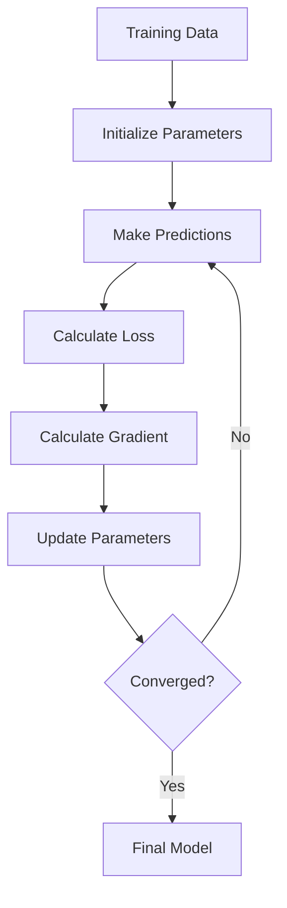
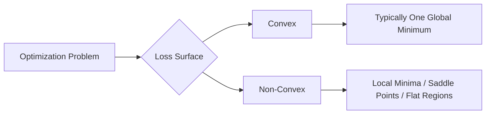
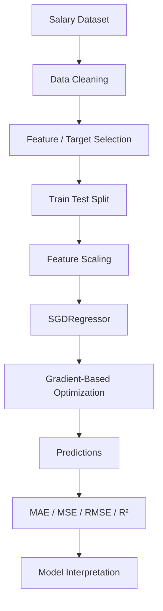
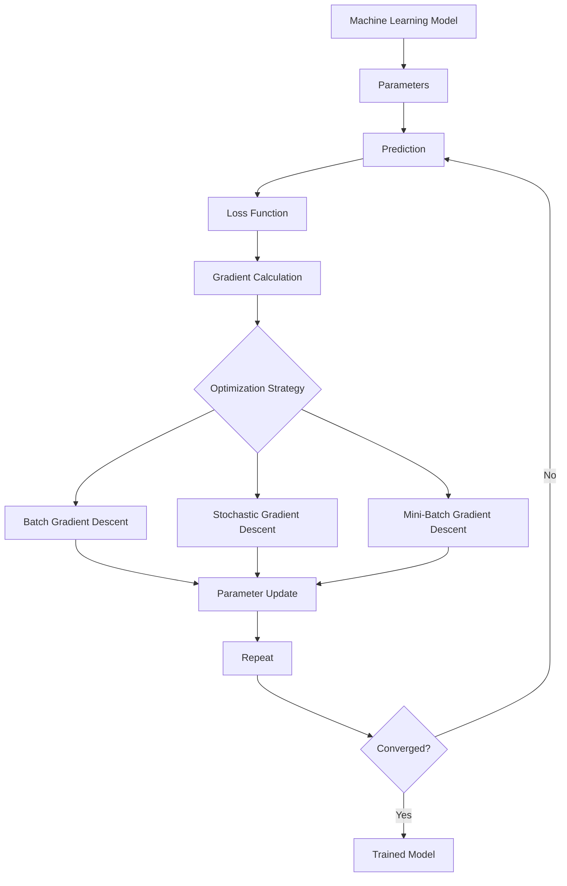

# 📈 Gradient Descent in Machine Learning

> **Gradient Descent** is an optimization algorithm used to minimize a machine learning model's **loss/cost function** by iteratively moving model parameters in the direction that reduces the error.

---

## 📚 Table of Contents

1. [Introduction](#1--introduction)
2. [Why Optimization Is Needed](#2--why-optimization-is-needed)
3. [What Is Gradient Descent?](#3--what-is-gradient-descent)
4. [Important Terminology](#4--important-terminology)
5. [Mathematical Intuition](#5--mathematical-intuition)
6. [Gradient and Derivative](#6--gradient-and-derivative)
7. [The Gradient Descent Update Rule](#7--the-gradient-descent-update-rule)
8. [How Gradient Descent Works](#8--how-gradient-descent-works)
9. [Gradient Descent Workflow](#9--gradient-descent-workflow)
10. [Learning Rate](#10--learning-rate)
11. [Types of Gradient Descent](#11--types-of-gradient-descent)
12. [Batch Gradient Descent](#12--batch-gradient-descent)
13. [Stochastic Gradient Descent](#13--stochastic-gradient-descent)
14. [Mini-Batch Gradient Descent](#14--mini-batch-gradient-descent)
15. [Comparison of GD Variants](#15--comparison-of-gd-variants)
16. [Gradient Descent in Linear Regression](#16--gradient-descent-in-linear-regression)
17. [Gradient Descent in Multiple Linear Regression](#17--gradient-descent-in-multiple-linear-regression)
18. [Gradient Descent in Logistic Regression](#18--gradient-descent-in-logistic-regression)
19. [Gradient Descent in Neural Networks](#19--gradient-descent-in-neural-networks)
20. [Loss Function and Gradient Descent](#20--loss-function-and-gradient-descent)
21. [Convex vs Non-Convex Optimization](#21--convex-vs-non-convex-optimization)
22. [Local and Global Minima](#22--local-and-global-minima)
23. [Feature Scaling](#23--feature-scaling)
24. [Practical Python Example](#24--practical-python-example)
25. [Implement Gradient Descent From Scratch](#25--implement-gradient-descent-from-scratch)
26. [Gradient Descent with Scikit-Learn](#26--gradient-descent-with-scikit-learn)
27. [Visualizing the Optimization Process](#27--visualizing-the-optimization-process)
28. [Real-World Applications](#28--real-world-applications)
29. [Advantages](#29--advantages)
30. [Limitations](#30--limitations)
31. [Common Mistakes](#31--common-mistakes)
32. [Best Practices](#32--best-practices)
33. [Advanced Concepts](#33--advanced-concepts)
34. [Optimizers Beyond Basic Gradient Descent](#34--optimizers-beyond-basic-gradient-descent)
35. [Practical Mini-Project](#35--practical-mini-project)
36. [Interview Questions](#36--interview-questions)
37. [Quick Revision](#37--quick-revision)
38. [Visual Summary / Roadmap](#38--visual-summary--roadmap)

---

# 1. 🧠 Introduction

Machine learning models contain **parameters** such as weights and biases. During training, these parameters must be adjusted so that predictions become as close as possible to the actual values.

This training process can be viewed as an optimization problem:

> **Find model parameters that minimize the loss function.**

Gradient Descent provides a systematic way to perform this optimization.

### Example

Suppose a linear regression model is:

```text
ŷ = wx + b
```

where:

- `w` = weight/slope
- `b` = bias/intercept
- `x` = input feature
- `ŷ` = predicted output

The model starts with some values of `w` and `b`. Gradient Descent repeatedly updates them until the loss becomes sufficiently small.

---

# 2. 🎯 Why Optimization Is Needed

A model can make poor predictions when its parameters are not properly learned.

For example:

```text
Actual Price    = ₹500
Predicted Price = ₹300
Error           = ₹200
```

The training algorithm needs to determine how the parameters should change to reduce this error.

The loss function measures the quality of the current parameters.

```text
Parameters
    ↓
Model Prediction
    ↓
Loss Function
    ↓
Loss / Error
    ↓
Gradient
    ↓
Parameter Update
    ↓
Better Parameters
```

This cycle repeats until a stopping condition is reached.

---

# 3. 📌 What Is Gradient Descent?

**Gradient Descent is an iterative optimization algorithm that updates parameters in the opposite direction of the gradient of a loss function.**

The core idea is:

> **Move downhill on the loss surface until reaching a minimum.**

Imagine standing on a mountain and wanting to reach the lowest valley.

You would:

1. Determine the direction of steepest descent.
2. Take a step in that direction.
3. Recalculate the direction.
4. Repeat until you reach a low point.

In machine learning:

```text
Mountain/Surface → Loss Function
Position         → Model Parameters
Slope            → Gradient
Step Size        → Learning Rate
Valley           → Minimum Loss
```

---

# 4. 📖 Important Terminology

| Term | Meaning |
|---|---|
| Parameter | Value learned by the model |
| Weight | Parameter associated with an input feature |
| Bias | Intercept parameter |
| Loss Function | Measures prediction error |
| Cost Function | Usually an aggregate loss over training data |
| Gradient | Vector of partial derivatives |
| Learning Rate | Controls the size of each update |
| Iteration | One parameter-update step |
| Epoch | One complete pass through the training data |
| Batch | Data samples used for one update |
| Convergence | State where updates become sufficiently small |
| Local Minimum | Minimum within a neighborhood |
| Global Minimum | Lowest point over the entire objective |
| Optimization | Process of finding parameters that minimize/maximize an objective |

---

# 5. 📐 Mathematical Intuition

Consider a simple function:

```text
J(w) = w²
```

Its graph is a bowl-shaped curve.

The minimum occurs at:

```text
w = 0
```

The derivative is:

```text
dJ/dw = 2w
```

Gradient Descent uses this derivative to decide how to update `w`.

If:

```text
w > 0
```

then:

```text
gradient > 0
```

so `w` should decrease.

If:

```text
w < 0
```

then:

```text
gradient < 0
```

so `w` should increase.

Therefore, the algorithm moves toward zero.

---

# 6. 📊 Gradient and Derivative

## 6.1 Derivative

For a single parameter, the derivative tells us how rapidly the loss changes with respect to that parameter.

Example:

```text
J(w) = w²

dJ/dw = 2w
```

## 6.2 Gradient

When a model has multiple parameters, we use a **gradient vector**.

For:

```text
J(w₁, w₂)
```

the gradient is:

```text
∇J = [
    ∂J/∂w₁,
    ∂J/∂w₂
]
```

The gradient points toward the direction of **steepest increase**.

Therefore, Gradient Descent moves in the opposite direction:

```text
-∇J
```

---

# 7. 🔢 The Gradient Descent Update Rule

The fundamental update rule is:

```text
θ_new = θ_old - α ∇J(θ)
```

Where:

| Symbol | Meaning |
|---|---|
| `θ` | Model parameters |
| `α` | Learning rate |
| `∇J(θ)` | Gradient of the loss |
| `J(θ)` | Loss/cost function |

For one parameter:

```text
w_new = w_old - α × ∂J/∂w
```

For bias:

```text
b_new = b_old - α × ∂J/∂b
```

### ⭐ Most Important Formula

```text
Parameter = Parameter - Learning Rate × Gradient
```

---

# 8. ⚙️ How Gradient Descent Works

The general process is:

### Step 1 — Initialize parameters

```text
w = random value
b = random value
```

### Step 2 — Make predictions

```text
ŷ = f(X, θ)
```

### Step 3 — Calculate loss

```text
Loss = L(y, ŷ)
```

### Step 4 — Calculate gradients

```text
Gradient = ∂Loss / ∂Parameters
```

### Step 5 — Update parameters

```text
θ = θ - α × Gradient
```

### Step 6 — Repeat

Continue until:

- loss stops improving,
- gradient becomes sufficiently small,
- maximum iterations are reached, or
- another stopping criterion is satisfied.

---

# 9. 🔄 Gradient Descent Workflow



### Conceptual Flow

```text
Data
 ↓
Parameters
 ↓
Prediction
 ↓
Loss
 ↓
Gradient
 ↓
Update
 ↓
Repeat
 ↓
Convergence
```

---

# 10. 🎚️ Learning Rate

The **learning rate** controls how large each parameter update is.

It is commonly represented by:

```text
α
```

or:

```text
eta (η)
```

## 10.1 Small Learning Rate

```text
α = 0.0001
```

Advantages:

- More controlled updates
- Lower risk of overshooting

Disadvantages:

- Training can be very slow
- May require many iterations

## 10.2 Large Learning Rate

```text
α = 1
```

Advantages:

- Faster movement

Disadvantages:

- Can overshoot the minimum
- Can cause oscillation
- May diverge

## 10.3 Good Learning Rate

A suitable learning rate allows the model to:

```text
↓ Loss steadily
↓
↓
↓
Converge
```

### Learning Rate Comparison

| Learning Rate | Typical Behavior |
|---|---|
| Too small | Very slow convergence |
| Reasonable | Stable convergence |
| Too large | Oscillation/divergence |
| Extremely large | Training may explode |

---

# 11. 🔀 Types of Gradient Descent

The three major variants are:

1. **Batch Gradient Descent**
2. **Stochastic Gradient Descent (SGD)**
3. **Mini-Batch Gradient Descent**

They differ mainly in how much training data is used for each parameter update.

---

# 12. 📦 Batch Gradient Descent

Batch Gradient Descent uses the **entire training dataset** to calculate the gradient for each update.

### Process

```text
Entire Dataset
      ↓
Prediction
      ↓
Loss
      ↓
Gradient
      ↓
Parameter Update
```

### Advantages

- Stable gradient estimates
- Smooth convergence
- Deterministic updates for a fixed dataset/model

### Disadvantages

- Can be computationally expensive
- Requires more memory
- Slow for very large datasets

---

# 13. ⚡ Stochastic Gradient Descent

Stochastic Gradient Descent updates the parameters using **one training sample at a time**.

```text
Sample 1 → Update
Sample 2 → Update
Sample 3 → Update
...
```

### Advantages

- Fast individual updates
- Lower memory requirement
- Noise can sometimes help escape shallow local regions

### Disadvantages

- Noisy optimization path
- Loss can fluctuate
- May require careful learning-rate scheduling

---

# 14. 🧩 Mini-Batch Gradient Descent

Mini-Batch Gradient Descent divides the dataset into small batches.

Example:

```text
Dataset = 10,000 samples

Batch size = 32

Batch 1 → 32 samples → Update
Batch 2 → 32 samples → Update
Batch 3 → 32 samples → Update
...
```

This is the most common approach in modern deep learning.

### Advantages

- Efficient GPU/CPU utilization
- Lower memory than full-batch training
- More stable than pure SGD
- Usually provides a good speed/stability trade-off

---

# 15. ⚖️ Comparison of GD Variants

| Feature | Batch GD | SGD | Mini-Batch GD |
|---|---|---|---|
| Samples/update | All | 1 | Small batch |
| Memory usage | High | Low | Medium |
| Gradient stability | High | Low | Medium/High |
| Speed per update | Lower | High | High |
| Noise | Low | High | Moderate |
| GPU efficiency | Can be limited | Often less efficient | Excellent |
| Common usage | Smaller datasets | Online/large-scale learning | Deep learning |

---

# 16. 📈 Gradient Descent in Linear Regression

Consider:

```text
ŷ = wx + b
```

A common loss function is Mean Squared Error (MSE):

```text
J(w,b) = (1/n) Σ(yᵢ - ŷᵢ)²
```

Substituting:

```text
J(w,b) = (1/n) Σ(yᵢ - (wxᵢ + b))²
```

The gradients are:

```text
∂J/∂w = -(2/n) Σ xᵢ(yᵢ - ŷᵢ)
```

```text
∂J/∂b = -(2/n) Σ(yᵢ - ŷᵢ)
```

Updates:

```text
w = w - α(∂J/∂w)
```

```text
b = b - α(∂J/∂b)
```

---

# 17. 🧮 Gradient Descent in Multiple Linear Regression

For multiple features:

```text
ŷ = w₁x₁ + w₂x₂ + ... + wₙxₙ + b
```

In vector form:

```text
ŷ = Xw + b
```

The gradient with respect to the weight vector can be expressed as:

```text
∇w J = -(2/n) Xᵀ(y - ŷ)
```

The bias gradient is:

```text
∂J/∂b = -(2/n) Σ(y - ŷ)
```

Then:

```text
w = w - α∇wJ
```

```text
b = b - α∂J/∂b
```

---

# 18. 🔐 Gradient Descent in Logistic Regression

Logistic Regression predicts a probability:

```text
p = σ(z)
```

where:

```text
z = wᵀx + b
```

and the sigmoid function is:

```text
σ(z) = 1 / (1 + e⁻ᶻ)
```

A common loss function is **Binary Cross-Entropy**:

```text
J = -(1/n) Σ[y log(p) + (1-y)log(1-p)]
```

Gradient Descent updates the weights and bias to minimize this loss.

---

# 19. 🧠 Gradient Descent in Neural Networks

Neural networks contain potentially millions or billions of parameters.

Training generally follows:

```text
Input
  ↓
Forward Propagation
  ↓
Prediction
  ↓
Loss
  ↓
Backpropagation
  ↓
Gradients
  ↓
Optimizer
  ↓
Parameter Updates
  ↓
Repeat
```

Gradient Descent is the fundamental optimization idea behind this process.

**Backpropagation** calculates gradients efficiently.

**The optimizer** uses those gradients to update parameters.

> Backpropagation and Gradient Descent are related but not identical: backpropagation computes gradients, while an optimizer uses those gradients to update parameters.

---

# 20. 📉 Loss Function and Gradient Descent

Gradient Descent requires an objective function to optimize.

Examples:

| Problem | Common Loss |
|---|---|
| Regression | MSE |
| Regression | MAE |
| Binary Classification | Binary Cross-Entropy |
| Multiclass Classification | Categorical Cross-Entropy |
| Neural Networks | Task-dependent loss |

The basic relationship is:

```text
Model Parameters
      ↓
Loss Function
      ↓
Gradient
      ↓
Optimizer
      ↓
Updated Parameters
```

---

# 21. 🏔️ Convex vs Non-Convex Optimization

## 21.1 Convex Function

A convex loss surface generally has a single global minimum.

For a convex problem:

```text
       \     /
        \   /
         \_/
       Global
       Minimum
```

Linear regression with MSE has a convex objective under the standard formulation.

## 21.2 Non-Convex Function

Neural network optimization landscapes are generally non-convex.

They may contain:

- local minima
- saddle points
- flat regions
- steep regions



---

# 22. 🎯 Local and Global Minima

### Global Minimum

The lowest possible value of the objective function.

### Local Minimum

A point that is lower than nearby points but may not be the lowest point overall.

```text
Loss
 ^
 |       \      /\
 |        \____/  \____
 |             \      \
 |              \______\
 +----------------------------> Parameter
```

In simple convex problems, the global minimum is easier to identify.

In non-convex problems, optimization is more complicated.

---

# 23. 📏 Feature Scaling

Feature scaling can be extremely important for Gradient Descent.

Suppose:

```text
Age        = 18 to 80
Salary     = 20,000 to 2,00,000
Experience = 0 to 30
```

The features have very different scales.

Without scaling, the optimization path can become inefficient.

## 23.1 Standardization

```text
z = (x - μ) / σ
```

In Scikit-Learn:

```python
from sklearn.preprocessing import StandardScaler

scaler = StandardScaler()

X_scaled = scaler.fit_transform(X)
```

## 23.2 Min-Max Scaling

```text
x_scaled = (x - x_min) / (x_max - x_min)
```

### Why Scaling Helps

```text
Unscaled:
Long / narrow optimization path

Scaled:
More balanced optimization path
```

Feature scaling is especially important for distance-based algorithms and gradient-based optimization.

---

# 24. 🐍 Practical Python Example

## 24.1 Import Libraries

```python
import numpy as np
import matplotlib.pyplot as plt
```

## 24.2 Create Dataset

```python
X = np.array([1, 2, 3, 4, 5], dtype=float)
y = np.array([3, 5, 7, 9, 11], dtype=float)
```

The relationship is approximately:

```text
y = 2x + 1
```

## 24.3 Initialize Parameters

```python
w = 0.0
b = 0.0

learning_rate = 0.01
epochs = 1000
```

## 24.4 Gradient Descent

```python
n = len(X)

for epoch in range(epochs):

    y_pred = w * X + b

    error = y_pred - y

    dw = (2 / n) * np.sum(X * error)
    db = (2 / n) * np.sum(error)

    w = w - learning_rate * dw
    b = b - learning_rate * db

print("Weight:", w)
print("Bias:", b)
```

After enough iterations, the learned values should approach:

```text
w ≈ 2
b ≈ 1
```

---

# 25. 🛠️ Implement Gradient Descent From Scratch

Here is a reusable implementation:

```python
import numpy as np

class LinearRegressionGD:

    def __init__(self, learning_rate=0.01, epochs=1000):
        self.learning_rate = learning_rate
        self.epochs = epochs
        self.weights = None
        self.bias = None
        self.loss_history = []

    def fit(self, X, y):

        n_samples, n_features = X.shape

        self.weights = np.zeros(n_features)
        self.bias = 0.0

        for epoch in range(self.epochs):

            y_pred = np.dot(X, self.weights) + self.bias

            error = y_pred - y

            dw = (2 / n_samples) * np.dot(X.T, error)
            db = (2 / n_samples) * np.sum(error)

            self.weights -= self.learning_rate * dw
            self.bias -= self.learning_rate * db

            mse = np.mean(error ** 2)
            self.loss_history.append(mse)

        return self

    def predict(self, X):
        return np.dot(X, self.weights) + self.bias
```

### Example Usage

```python
X = np.array([
    [1],
    [2],
    [3],
    [4],
    [5]
], dtype=float)

y = np.array([3, 5, 7, 9, 11], dtype=float)

model = LinearRegressionGD(
    learning_rate=0.01,
    epochs=1000
)

model.fit(X, y)

predictions = model.predict(X)

print("Weights:", model.weights)
print("Bias:", model.bias)
print("Predictions:", predictions)
```

---

# 26. 🤖 Gradient Descent with Scikit-Learn

Scikit-Learn provides models that use gradient-based optimization.

For example, `SGDRegressor`:

```python
from sklearn.linear_model import SGDRegressor

model = SGDRegressor(
    max_iter=1000,
    learning_rate="constant",
    eta0=0.01,
    random_state=42
)

model.fit(X, y)

predictions = model.predict(X)

print("Coefficient:", model.coef_)
print("Intercept:", model.intercept_)
```

For a practical dataset, feature scaling is often recommended:

```python
from sklearn.pipeline import make_pipeline
from sklearn.preprocessing import StandardScaler
from sklearn.linear_model import SGDRegressor

model = make_pipeline(
    StandardScaler(),
    SGDRegressor(
        max_iter=2000,
        random_state=42
    )
)

model.fit(X, y)
```

---

# 27. 📊 Visualizing the Optimization Process

Tracking loss is a useful debugging and learning technique.

```python
plt.plot(model.loss_history)
plt.xlabel("Epoch")
plt.ylabel("MSE Loss")
plt.title("Gradient Descent Loss")
plt.show()
```

A successful training run often looks conceptually like:

```text
Loss
 ^
 |\
 | \
 |  \
 |   \
 |    \______
 |           \____
 +--------------------> Epoch
```

If the loss increases dramatically or becomes `NaN`, investigate:

- learning rate
- feature scaling
- numerical stability
- data quality
- loss implementation

---

# 28. 🌍 Real-World Applications

Gradient-based optimization is used across machine learning.

| Application | Example |
|---|---|
| House Price Prediction | Optimize regression weights |
| Sales Forecasting | Learn predictive model parameters |
| Spam Detection | Train classification models |
| Recommendation Systems | Optimize ranking/prediction parameters |
| Image Classification | Train neural network weights |
| NLP | Train language models |
| Computer Vision | Optimize deep CNNs/transformers |
| Fraud Detection | Train classification models |
| Demand Forecasting | Learn model parameters |
| Speech Recognition | Train deep learning models |

---

# 29. ✅ Advantages

1. **Simple concept**
   - Easy to understand mathematically.

2. **Scalable**
   - Works well with large datasets, especially with mini-batches.

3. **Memory efficient**
   - SGD and mini-batch methods do not require the entire dataset for every update.

4. **Flexible**
   - Can optimize many differentiable objectives.

5. **Foundation of deep learning**
   - Forms the basis of many modern optimizers.

6. **Works with high-dimensional models**
   - Suitable for models with very large numbers of parameters.

---

# 30. ❌ Limitations

1. **Learning-rate sensitivity**
   - Poor learning-rate selection can cause slow training or divergence.

2. **Feature scaling issues**
   - Unscaled features can make optimization inefficient.

3. **Local minima and saddle points**
   - Non-convex objectives can be difficult to optimize.

4. **Noisy updates**
   - SGD may have high variance.

5. **Vanishing/exploding gradients**
   - Can occur in some deep architectures.

6. **Requires differentiability**
   - Basic Gradient Descent relies on gradients.

7. **Stopping criteria matter**
   - Training may stop too early or continue unnecessarily.

---

# 31. 🚨 Common Mistakes

## Mistake 1 — Using a huge learning rate

```python
learning_rate = 10
```

This can make the optimization unstable.

### Better approach

Start with a reasonable value and validate training behavior.

---

## Mistake 2 — Using an extremely small learning rate

```python
learning_rate = 0.00000001
```

Training may become extremely slow.

---

## Mistake 3 — Forgetting feature scaling

Especially problematic when features have very different numerical ranges.

---

## Mistake 4 — Updating parameters in the wrong direction

Correct:

```python
parameter -= learning_rate * gradient
```

Incorrect for Gradient Descent:

```python
parameter += learning_rate * gradient
```

---

## Mistake 5 — Incorrect gradient calculation

A small mathematical mistake can prevent convergence.

---

## Mistake 6 — Confusing epoch and iteration

An **epoch** is usually one complete pass over the training dataset.

An **iteration/update step** is one parameter update.

For mini-batch training:

```text
Iterations per epoch ≈ ceil(number_of_samples / batch_size)
```

---

## Mistake 7 — Evaluating only training loss

Always evaluate the final model on validation/test data where appropriate.

---

# 32. 🏆 Best Practices

### 1. Scale Features

```python
from sklearn.preprocessing import StandardScaler

scaler = StandardScaler()
X_train_scaled = scaler.fit_transform(X_train)
X_test_scaled = scaler.transform(X_test)
```

### 2. Monitor the Loss

```python
plt.plot(loss_history)
plt.show()
```

### 3. Use a Validation Set

Compare training and validation performance.

### 4. Tune the Learning Rate

Try a range of reasonable values rather than blindly choosing one.

### 5. Use Mini-Batches for Large Datasets

A mini-batch often provides a good balance between speed and stability.

### 6. Use Learning-Rate Scheduling

Reduce or adapt the learning rate during training when appropriate.

### 7. Set Reproducible Seeds

```python
import numpy as np

np.random.seed(42)
```

### 8. Watch for Numerical Problems

Look for:

```text
NaN
inf
exploding loss
```

---

# 33. 🧠 Advanced Concepts

## 33.1 Momentum

Momentum adds a fraction of the previous update to the current update.

Conceptually:

```text
velocity = β × velocity + gradient
parameter = parameter - learning_rate × velocity
```

Momentum can help:

- accelerate movement in consistent directions
- reduce oscillations
- navigate ravines more effectively

---

## 33.2 Learning Rate Scheduling

Instead of keeping the learning rate constant:

```text
α = constant
```

we can change it during training:

```text
α₀ → α₁ → α₂ → ...
```

Common strategies:

- Step decay
- Exponential decay
- Cosine decay
- Warmup
- Reduce-on-plateau

---

## 33.3 Batch Size

Batch size controls the number of examples used for one gradient update.

Common values include:

```text
16
32
64
128
256
```

There is no universally best batch size.

---

## 33.4 Gradient Clipping

Gradient clipping limits excessively large gradients.

Example:

```python
import numpy as np

gradient = np.array([10.0, 2.0, 50.0])

clipped_gradient = np.clip(
    gradient,
    -5,
    5
)
```

This can help with exploding-gradient problems.

---

## 33.5 Weight Decay / L2 Regularization

A regularized objective can include a penalty such as:

```text
J_regularized = J + λ ||w||²
```

This discourages excessively large weights.

---

## 33.6 Early Stopping

Training can stop when validation performance stops improving.

Conceptually:

```text
Train
 ↓
Monitor validation loss
 ↓
Improvement?
 ├── Yes → Continue
 └── No for patience period → Stop
```

---

# 34. 🚀 Optimizers Beyond Basic Gradient Descent

Modern machine learning often uses improved optimization algorithms.

| Optimizer | Main Idea |
|---|---|
| Gradient Descent | Basic gradient-based updates |
| SGD | One sample per update |
| Momentum | Uses previous update direction |
| Nesterov Momentum | Looks ahead before computing update |
| AdaGrad | Adaptive learning rates |
| RMSProp | Uses moving average of squared gradients |
| Adam | Combines momentum-like and adaptive ideas |
| AdamW | Adam with decoupled weight decay |

## Adam

Adam is widely used in deep learning.

Conceptually, it maintains moving estimates of:

- gradients
- squared gradients

Then uses them to adapt parameter updates.

Example:

```python
from tensorflow.keras.optimizers import Adam

optimizer = Adam(
    learning_rate=0.001
)
```

---

# 35. 🧪 Practical Mini-Project

## Project: Salary Prediction Using Gradient Descent

### Objective

Build a simple linear regression model that predicts salary from years of experience.

### Dataset Structure

```text
YearsExperience    Salary
1.1                39343
1.3                46205
1.5                37731
...
```

### Step 1 — Load Dataset

```python
import pandas as pd

df = pd.read_csv("Salary_Data.csv")

print(df.head())
```

### Step 2 — Select Features

```python
X = df[["YearsExperience"]].values
y = df["Salary"].values
```

### Step 3 — Split Dataset

```python
from sklearn.model_selection import train_test_split

X_train, X_test, y_train, y_test = train_test_split(
    X,
    y,
    test_size=0.2,
    random_state=42
)
```

### Step 4 — Scale Features

```python
from sklearn.preprocessing import StandardScaler

scaler = StandardScaler()

X_train_scaled = scaler.fit_transform(X_train)
X_test_scaled = scaler.transform(X_test)
```

### Step 5 — Train SGD Model

```python
from sklearn.linear_model import SGDRegressor

model = SGDRegressor(
    max_iter=2000,
    learning_rate="invscaling",
    eta0=0.01,
    random_state=42
)

model.fit(X_train_scaled, y_train)
```

### Step 6 — Predict

```python
y_pred = model.predict(X_test_scaled)
```

### Step 7 — Evaluate

```python
from sklearn.metrics import mean_absolute_error, mean_squared_error, r2_score
import numpy as np

mae = mean_absolute_error(y_test, y_pred)
mse = mean_squared_error(y_test, y_pred)
rmse = np.sqrt(mse)
r2 = r2_score(y_test, y_pred)

print("MAE :", mae)
print("MSE :", mse)
print("RMSE:", rmse)
print("R²  :", r2)
```

### Step 8 — Interpret Results

| Metric | Meaning |
|---|---|
| MAE | Average absolute prediction error |
| MSE | Average squared prediction error |
| RMSE | Square root of MSE |
| R² | Proportion of target variance explained by the model |

### Mini-Project Workflow



---

# 36. 🎤 Interview Questions

## Q1. What is Gradient Descent?

Gradient Descent is an iterative optimization algorithm that minimizes a differentiable loss function by updating parameters in the opposite direction of the gradient.

---

## Q2. What is the Gradient Descent formula?

```text
θ_new = θ_old - α∇J(θ)
```

---

## Q3. Why do we subtract the gradient?

The gradient points toward the direction of steepest increase.

Therefore, moving in the opposite direction generally decreases the objective.

---

## Q4. What is the learning rate?

The learning rate controls the size of parameter updates.

---

## Q5. What happens if the learning rate is too large?

The algorithm may:

- overshoot the minimum
- oscillate
- diverge
- produce unstable loss

---

## Q6. What happens if the learning rate is too small?

Training can become very slow.

---

## Q7. What is the difference between Batch GD and SGD?

Batch GD calculates each update using the full dataset, while SGD uses one sample per update.

---

## Q8. Why is Mini-Batch GD popular?

It offers a practical compromise between:

- computational efficiency
- memory usage
- gradient stability
- hardware utilization

---

## Q9. What is an epoch?

One complete pass through the training dataset.

---

## Q10. Is Gradient Descent guaranteed to find the global minimum?

Not always.

For convex objectives, optimization is generally more straightforward. For non-convex objectives, the landscape can contain local minima, saddle points, and flat regions.

---

## Q11. Why is feature scaling important?

It can make the optimization landscape better conditioned and allow Gradient Descent to converge more efficiently.

---

## Q12. What is the difference between Backpropagation and Gradient Descent?

**Backpropagation:** computes gradients of the loss with respect to network parameters.

**Gradient Descent/Optimizer:** uses those gradients to update parameters.

---

## Q13. What is Momentum?

Momentum uses information from previous updates to smooth and accelerate optimization.

---

## Q14. What is Adam?

Adam is an adaptive optimization algorithm that combines momentum-like first-moment estimates with second-moment estimates to adapt parameter updates.

---

## Q15. Can Gradient Descent be used for classification?

Yes. For example, Logistic Regression and neural networks can use gradient-based optimization.

---

# 37. ⚡ Quick Revision

## 🔑 Key Concepts

```text
Gradient Descent
      ↓
Optimization Algorithm
      ↓
Minimize Loss
      ↓
Calculate Gradient
      ↓
Move Opposite to Gradient
      ↓
Update Parameters
      ↓
Repeat
      ↓
Convergence
```

## ⭐ Most Important Formula

```text
θ_new = θ_old - α∇J(θ)
```

## 🔢 Linear Regression

```text
ŷ = wx + b
```

## 📉 MSE

```text
MSE = (1/n) Σ(yᵢ - ŷᵢ)²
```

## 🔄 Update

```text
w = w - α(dw)
b = b - α(db)
```

## 🎚️ Learning Rate

```text
Too Small → Slow
Good      → Stable
Too Large → Unstable / Divergence
```

## 📦 GD Types

```text
Batch GD
    ↓
Entire Dataset

SGD
    ↓
One Sample

Mini-Batch GD
    ↓
Small Batch
```

## 🧠 Deep Learning

```text
Forward Pass
     ↓
Loss
     ↓
Backpropagation
     ↓
Gradients
     ↓
Optimizer
     ↓
Parameter Update
```

---

# 38. 🗺️ Visual Summary / Roadmap



## 🧭 Learning Roadmap

```text
1. Understand Loss Functions
          ↓
2. Learn Derivatives
          ↓
3. Understand Gradients
          ↓
4. Learn Gradient Descent
          ↓
5. Understand Learning Rate
          ↓
6. Learn Batch / SGD / Mini-Batch
          ↓
7. Practice Linear Regression
          ↓
8. Learn Feature Scaling
          ↓
9. Implement GD From Scratch
          ↓
10. Learn Momentum
          ↓
11. Learn Adam / AdamW
          ↓
12. Apply Optimization to Neural Networks
```

## 📝 One-Minute Revision

> **Gradient Descent = Loss Minimization Through Iterative Parameter Updates**

Remember these five things:

```text
1. Loss tells us how wrong the model is.
2. Gradient tells us how the loss changes.
3. Learning rate controls the update size.
4. We move opposite to the gradient.
5. We repeat until the optimization converges.
```

### Final Mental Model

```text
             ┌─────────────────┐
             │ Training Data   │
             └────────┬────────┘
                      ↓
             ┌─────────────────┐
             │ Model           │
             │ Parameters θ    │
             └────────┬────────┘
                      ↓
             ┌─────────────────┐
             │ Predictions     │
             └────────┬────────┘
                      ↓
             ┌─────────────────┐
             │ Loss Function   │
             └────────┬────────┘
                      ↓
             ┌─────────────────┐
             │ Gradient ∇J     │
             └────────┬────────┘
                      ↓
             ┌─────────────────┐
             │ Update θ        │
             │ θ ← θ - α∇J     │
             └────────┬────────┘
                      ↓
                   Repeat
                      ↓
             ┌─────────────────┐
             │ Trained Model   │
             └─────────────────┘
```

---

# 🎯 Final Takeaway

Gradient Descent is one of the most important optimization concepts in Machine Learning.

If you understand:

```text
Loss
  +
Gradient
  +
Learning Rate
  +
Parameter Update
  +
Iterations
  =
Gradient Descent
```

you have the foundation needed to understand:

- Linear Regression optimization
- Logistic Regression training
- Neural Network training
- Backpropagation
- SGD
- Momentum
- RMSProp
- Adam
- AdamW
- Learning-rate scheduling
- Modern deep-learning optimization
