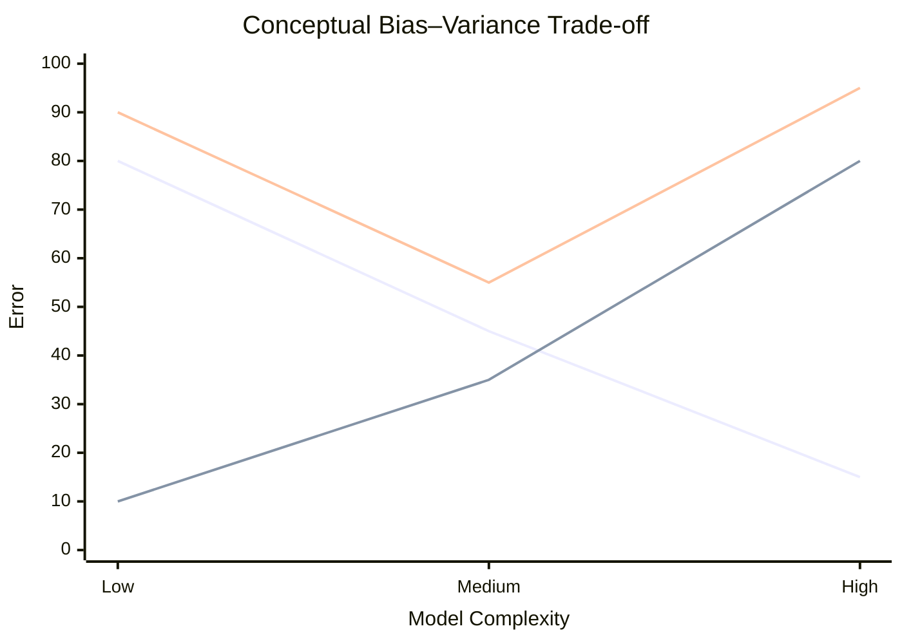
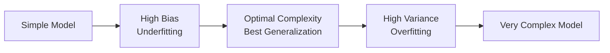
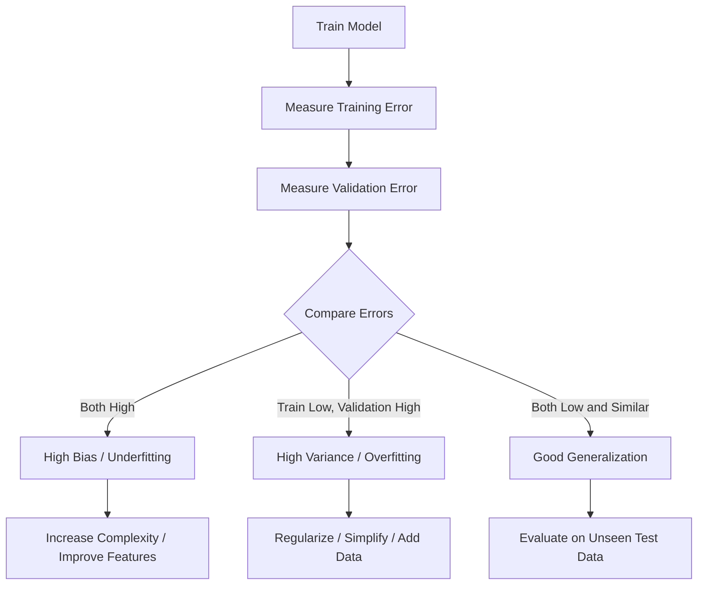
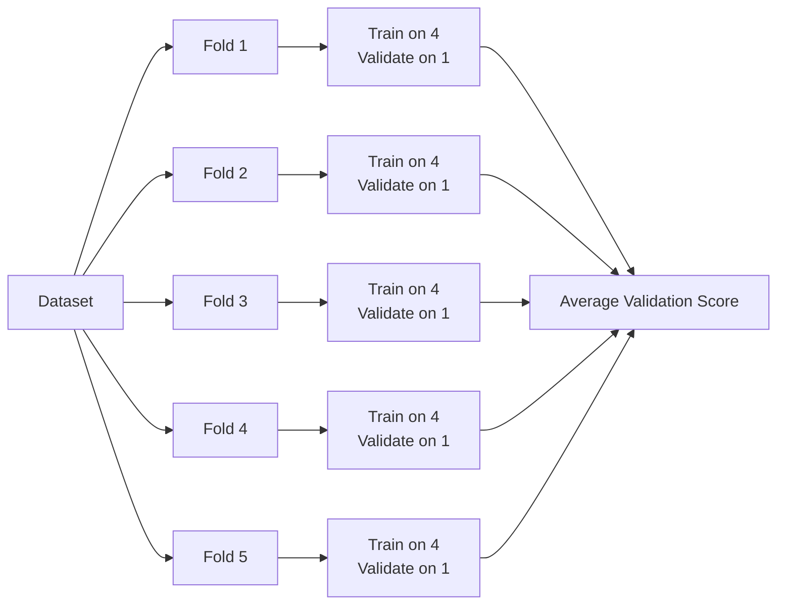
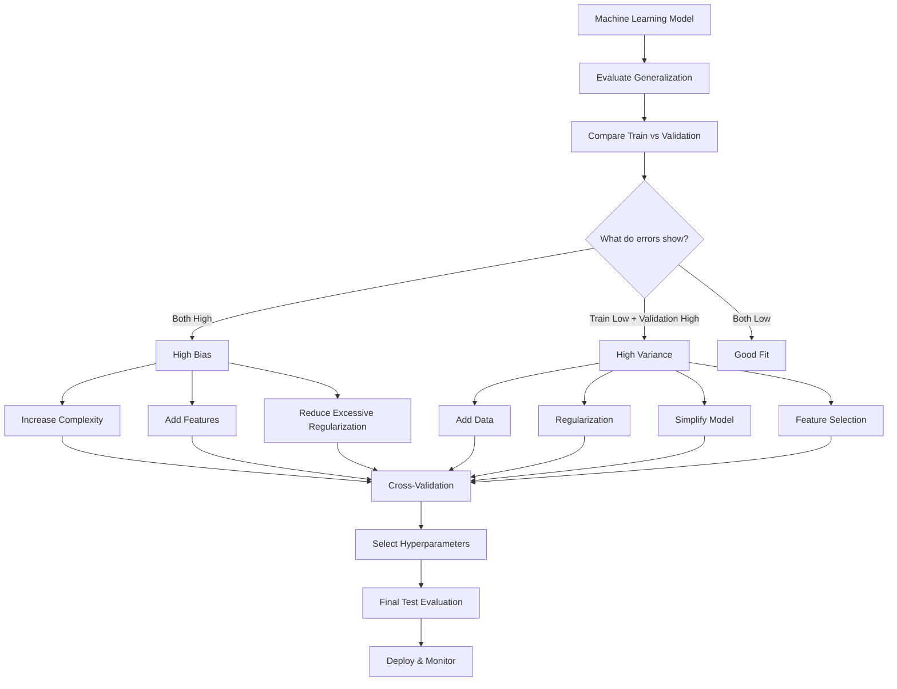

# 🎯 Bias–Variance Trade-off in Machine Learning

> A complete learning resource covering **bias, variance, underfitting, overfitting, model complexity, regularization, validation, practical examples, and model-selection strategies**.

---

## 📚 Table of Contents

1. [Introduction](#1--introduction)
2. [What Is Model Error?](#2--what-is-model-error)
3. [Bias](#3--bias)
4. [Variance](#4--variance)
5. [Bias vs Variance](#5--bias-vs-variance)
6. [The Bias–Variance Trade-off](#6--the-biasvariance-trade-off)
7. [Underfitting and Overfitting](#7--underfitting-and-overfitting)
8. [Model Complexity](#8--model-complexity)
9. [Training Error vs Validation Error](#9--training-error-vs-validation-error)
10. [Mathematical Foundation](#10--mathematical-foundation)
11. [Practical Example](#11--practical-example)
12. [Python Implementation](#12--python-implementation)
13. [How to Diagnose Bias and Variance](#13--how-to-diagnose-bias-and-variance)
14. [How to Reduce Bias](#14--how-to-reduce-bias)
15. [How to Reduce Variance](#15--how-to-reduce-variance)
16. [Regularization and the Trade-off](#16--regularization-and-the-trade-off)
17. [Cross-Validation](#17--cross-validation)
18. [Learning Curves](#18--learning-curves)
19. [Real-World Examples](#19--real-world-examples)
20. [Advantages and Limitations](#20--advantages-and-limitations)
21. [Common Mistakes](#21--common-mistakes)
22. [Best Practices](#22--best-practices)
23. [Interview Questions and Key Points](#23--interview-questions-and-key-points)
24. [Mini Project](#24--mini-project)
25. [Advanced Concepts](#25--advanced-concepts)
26. [Quick Revision](#26--quick-revision)

---

# 1. 🚀 Introduction

The **Bias–Variance Trade-off** is one of the most important concepts in machine learning.

It explains why a model can perform poorly because it is:

- Too **simple** → high bias
- Too **complex** → high variance
- Well balanced → good generalization

The ultimate goal of machine learning is not simply to memorize training data. The goal is to learn patterns that **generalize well to unseen data**.

### 🎯 Core Idea

> A good machine learning model finds the right level of complexity so that it captures meaningful patterns without memorizing noise.

---

# 2. 📊 What Is Model Error?

For a supervised learning model, prediction error can be viewed conceptually as:

$$
\text{Total Error}
\approx
\text{Bias}^2 + \text{Variance} + \text{Irreducible Noise}
$$

These three components have different meanings.

| Component | Meaning | Typical Problem |
|---|---|---|
| Bias² | Error caused by overly strong assumptions | Underfitting |
| Variance | Sensitivity to training data | Overfitting |
| Irreducible noise | Randomness/noise that cannot be learned | Cannot be completely removed |

### 🧠 Important

You can reduce **bias** and **variance**, but irreducible noise is inherent in the data-generating process.

---

# 3. 🎯 Bias

## 3.1 What Is Bias?

**Bias** is the error introduced when a model makes overly simplistic assumptions about the relationship between input and output.

A high-bias model is usually too simple to represent the true underlying pattern.

### Example

Suppose the true relationship between `X` and `Y` is curved:

```text
Y
│        •
│      •   •
│    •       •
│  •           •
│ •             •
└────────────────── X
```

If we force a straight line through the data:

```text
Y
│        •
│      •   •
│    • ───── •
│  •       /
│ •      /
└────────────────── X
```

The model may systematically miss the real relationship.

## 3.2 High-Bias Models

Examples include:

- Linear model for strongly nonlinear data
- Very shallow decision tree
- Excessively strong regularization
- Too few features
- Oversimplified assumptions

## 3.3 Symptoms of High Bias

| Observation | Interpretation |
|---|---|
| High training error | Model cannot fit training data well |
| High validation error | Poor generalization |
| Training and validation errors are both high | Likely underfitting |
| Increasing model complexity improves both errors | Bias may be too high |

---

# 4. 📈 Variance

## 4.1 What Is Variance?

**Variance** measures how much a model's predictions change when the training dataset changes.

A high-variance model learns very specific patterns from the training data, including noise.

> High variance usually means the model is too sensitive to the particular training sample.

genui{"learning_viz":{"type_id":"VARIANCE","locale_override":"en-US"}}

## 4.2 High-Variance Models

Examples include:

- Very deep decision trees
- High-degree polynomial regression
- Unregularized complex models
- Models trained with too many parameters relative to the amount of data

## 4.3 Symptoms of High Variance

| Observation | Interpretation |
|---|---|
| Very low training error | Model fits training data extremely well |
| High validation/test error | Poor generalization |
| Large train-validation gap | Strong sign of overfitting |
| Model changes significantly with different samples | High variance |

---

# 5. ⚖️ Bias vs Variance

| Feature | Bias | Variance |
|---|---|---|
| Main cause | Model too simple | Model too complex |
| Typical problem | Underfitting | Overfitting |
| Training error | High | Low |
| Validation error | High | High |
| Sensitivity to dataset | Low | High |
| Common solution | Increase complexity | Reduce complexity |
| Other solutions | Better features, weaker regularization | More data, regularization, pruning |

### 🧠 Easy Memory Trick

**Bias = model is too rigid.**

**Variance = model is too sensitive.**

---

# 6. 🔄 The Bias–Variance Trade-off

As model complexity increases:

- Bias generally decreases.
- Variance generally increases.
- Training error generally decreases.
- Validation/test error often decreases initially and then increases.



The ideal model lies near the region where **generalization error is minimized**.

## 6.1 The Three Regions



### 🟢 Underfitting

Model is too simple.

```text
High Bias
Low Variance
Poor Training Performance
Poor Validation Performance
```

### 🟢 Good Fit

Model captures meaningful structure.

```text
Reasonable Bias
Reasonable Variance
Good Generalization
```

### 🔴 Overfitting

Model is too complex.

```text
Low Bias
High Variance
Excellent Training Performance
Poor Validation Performance
```

---

# 7. 🧩 Underfitting and Overfitting

## 7.1 Underfitting

Underfitting happens when a model is unable to learn the important structure of the data.

### Causes

- Model too simple
- Too few features
- Excessive regularization
- Insufficient training
- Poor feature representation

### Example

Using linear regression to model a highly nonlinear relationship.

---

## 7.2 Overfitting

Overfitting happens when a model learns training-specific patterns and noise instead of generalizable patterns.

### Causes

- Excessive model complexity
- Too little training data
- Too many features
- Noise in the training data
- Insufficient regularization
- Very deep decision trees

### Example

A high-degree polynomial passing almost exactly through every training point.

---

## 7.3 Comparison

| Property | Underfitting | Good Fit | Overfitting |
|---|---|---|---|
| Bias | High | Moderate | Low |
| Variance | Low | Moderate | High |
| Train error | High | Low | Very low |
| Validation error | High | Low | High |
| Model complexity | Too low | Appropriate | Too high |
| Generalization | Poor | Good | Poor |

---

# 8. 🧠 Model Complexity

Model complexity refers to how flexible a model is in representing patterns.

Examples of increasing complexity:

```text
Linear Regression
      ↓
Polynomial Regression
      ↓
Decision Tree
      ↓
Deep Decision Tree
      ↓
Large Neural Network
```

However, model complexity is not always bad.

The objective is:

> **Use enough complexity to learn the signal, but not enough to memorize the noise.**

### Complexity can be controlled using:

- Tree depth
- Number of features
- Polynomial degree
- Number of model parameters
- Regularization strength
- Number of estimators
- Early stopping
- Network architecture

---

# 9. 📉 Training Error vs Validation Error

One of the easiest practical ways to understand bias and variance is to compare training and validation performance.

| Situation | Training Error | Validation Error | Diagnosis |
|---|---:|---:|---|
| Underfitting | High | High | High bias |
| Good fit | Low | Low | Balanced |
| Overfitting | Very low | High | High variance |

### Example

```text
Model A:
Train RMSE = 18
Validation RMSE = 20
→ Good generalization

Model B:
Train RMSE = 5
Validation RMSE = 45
→ Overfitting / high variance

Model C:
Train RMSE = 42
Validation RMSE = 44
→ Underfitting / high bias
```

> Do not judge a model using training performance alone.

---

# 10. 📐 Mathematical Foundation

## 10.1 Expected Prediction

Suppose:

- $x$ = input
- $y$ = observed target
- $f(x)$ = true relationship
- $\epsilon$ = random noise
- $\hat{f}(x)$ = learned model

The data can be represented as:

$$
y = f(x) + \epsilon
$$

with:

$$
E[\epsilon] = 0
$$

---

## 10.2 Bias

Bias at a particular input $x$ is:

$$
Bias[\hat{f}(x)]
=
E[\hat{f}(x)] - f(x)
$$

Therefore:

$$
Bias^2
=
(E[\hat{f}(x)] - f(x))^2
$$

---

## 10.3 Variance

Variance is:

$$
Variance[\hat{f}(x)]
=
E[(\hat{f}(x)-E[\hat{f}(x)])^2]
$$

It measures how much predictions vary across different training datasets.

---

## 10.4 Bias–Variance Decomposition

For squared-error regression:

$$
E[(y-\hat{f}(x))^2]
=
Bias^2
+
Variance
+
\sigma^2
$$

where:

- $Bias^2$ = systematic error
- $Variance$ = model sensitivity to training data
- $\sigma^2$ = irreducible noise

### 🔍 Interpretation

```text
Expected Test Error
        │
        ├── Bias²
        │
        ├── Variance
        │
        └── Irreducible Noise
```

---

# 11. 🧪 Practical Example

Imagine predicting house prices.

Features:

- Area
- Number of bedrooms
- Location
- Age
- Number of bathrooms

### Model A — Too Simple

```text
Price = β₀ + β₁ × Area
```

It ignores many important relationships.

Likely result:

```text
High Bias
Low Variance
Underfitting
```

### Model B — Very Complex

Suppose we use a huge decision tree that memorizes individual houses.

Likely result:

```text
Low Bias
High Variance
Overfitting
```

### Model C — Well Tuned

Use an appropriately regularized model with meaningful features.

Likely result:

```text
Moderate Bias
Moderate Variance
Good Generalization
```

---

# 12. 🐍 Python Implementation

## 12.1 Generate Nonlinear Data

```python
import numpy as np
import matplotlib.pyplot as plt

np.random.seed(42)

X = np.linspace(-3, 3, 100)
y = 0.5 * X**3 - X**2 + 2 * X + np.random.normal(0, 3, 100)

X = X.reshape(-1, 1)
```

---

## 12.2 Polynomial Regression with Different Degrees

```python
from sklearn.preprocessing import PolynomialFeatures
from sklearn.linear_model import LinearRegression
from sklearn.pipeline import make_pipeline
from sklearn.model_selection import train_test_split
from sklearn.metrics import mean_squared_error

X_train, X_test, y_train, y_test = train_test_split(
    X,
    y,
    test_size=0.2,
    random_state=42
)

degrees = [1, 2, 5, 15]

for degree in degrees:
    model = make_pipeline(
        PolynomialFeatures(degree=degree),
        LinearRegression()
    )

    model.fit(X_train, y_train)

    train_pred = model.predict(X_train)
    test_pred = model.predict(X_test)

    train_rmse = np.sqrt(mean_squared_error(y_train, train_pred))
    test_rmse = np.sqrt(mean_squared_error(y_test, test_pred))

    print(f"Degree: {degree}")
    print(f"Train RMSE: {train_rmse:.2f}")
    print(f"Test RMSE : {test_rmse:.2f}")
    print("-" * 30)
```

### Expected Pattern

You may observe something conceptually similar to:

```text
Degree 1
Train RMSE → relatively high
Test RMSE  → relatively high
→ Underfitting

Degree 5
Train RMSE → lower
Test RMSE  → lower
→ Better fit

Degree 15
Train RMSE → extremely low
Test RMSE  → increases
→ Overfitting
```

Exact values depend on the generated data and train/test split.

---

## 12.3 Visualize Model Complexity

```python
degrees = range(1, 16)

train_errors = []
test_errors = []

for degree in degrees:

    model = make_pipeline(
        PolynomialFeatures(degree=degree),
        LinearRegression()
    )

    model.fit(X_train, y_train)

    train_pred = model.predict(X_train)
    test_pred = model.predict(X_test)

    train_errors.append(
        np.sqrt(mean_squared_error(y_train, train_pred))
    )

    test_errors.append(
        np.sqrt(mean_squared_error(y_test, test_pred))
    )

plt.plot(degrees, train_errors, label="Training RMSE")
plt.plot(degrees, test_errors, label="Testing RMSE")

plt.xlabel("Polynomial Degree")
plt.ylabel("RMSE")
plt.title("Bias–Variance Trade-off")
plt.legend()
plt.show()
```

### 📌 What to Look For

```text
RMSE
 │\
 │ \ Training Error
 │  \________________
 │                  \
 │                   \
 │        Validation \
 │       \            \
 │        \____        \
 │             \_______/
 └──────────────────────── Complexity
          ↑
    Optimal region
```

---

# 13. 🔍 How to Diagnose Bias and Variance

Use a systematic process.



### Diagnostic Checklist

Ask:

1. Is training error high?
2. Is validation error high?
3. Is there a large train-validation gap?
4. Does increasing complexity improve validation performance?
5. Does regularization improve validation performance?
6. Does adding training data reduce the validation gap?

---

# 14. 🛠️ How to Reduce Bias

If the model has **high bias**, consider:

### 14.1 Increase Model Complexity

Examples:

- Linear → polynomial features
- Shallow tree → deeper tree
- Simple model → more flexible model

### 14.2 Add Useful Features

A model may underfit because important information is missing.

### 14.3 Reduce Excessive Regularization

If regularization is too strong, the model may become overly constrained.

For example:

```python
from sklearn.linear_model import Ridge

model = Ridge(alpha=0.01)
```

A smaller `alpha` generally means weaker L2 regularization.

### 14.4 Improve Feature Engineering

Create features that better represent the underlying relationship.

---

# 15. 🛡️ How to Reduce Variance

If the model has **high variance**, consider:

### 15.1 Get More Training Data

More representative data can help a model generalize.

### 15.2 Simplify the Model

Examples:

```text
Deep Tree → Shallow Tree
High Polynomial Degree → Lower Degree
Huge Feature Set → Relevant Features
```

### 15.3 Use Regularization

Examples:

- Ridge
- Lasso
- Elastic Net
- Dropout for neural networks

### 15.4 Cross-Validation

Use cross-validation to obtain a more reliable estimate of generalization performance.

### 15.5 Feature Selection

Remove irrelevant or noisy features.

### 15.6 Early Stopping

For iterative models, stop training when validation performance stops improving.

---

# 16. 🧲 Regularization and the Trade-off

Regularization adds a penalty for model complexity.

## 16.1 Ridge Regression — L2

Objective:

$$
\text{Loss}
=
MSE
+
\lambda \sum_{j=1}^{p}\beta_j^2
$$

Ridge tends to shrink coefficients toward zero.

```python
from sklearn.linear_model import Ridge

model = Ridge(alpha=1.0)
model.fit(X_train, y_train)
```

---

## 16.2 Lasso Regression — L1

Objective:

$$
\text{Loss}
=
MSE
+
\lambda \sum_{j=1}^{p}|\beta_j|
$$

Lasso can shrink some coefficients exactly to zero, making it useful for feature selection.

```python
from sklearn.linear_model import Lasso

model = Lasso(alpha=0.1)
model.fit(X_train, y_train)
```

---

## 16.3 Regularization Strength

Conceptually:

```text
Low λ
 ↓
More flexible model
 ↓
Lower bias
Higher variance

High λ
 ↓
More constrained model
 ↓
Higher bias
Lower variance
```

The best value is normally selected using validation or cross-validation.

---

# 17. 🔁 Cross-Validation

Cross-validation helps estimate how well a model generalizes.

## 17.1 K-Fold Cross-Validation



## 17.2 Python

```python
from sklearn.model_selection import cross_val_score
from sklearn.ensemble import RandomForestRegressor

model = RandomForestRegressor(
    n_estimators=100,
    random_state=42
)

scores = cross_val_score(
    model,
    X,
    y,
    cv=5,
    scoring="neg_mean_squared_error"
)

rmse_scores = np.sqrt(-scores)

print("CV RMSE:", rmse_scores)
print("Mean CV RMSE:", rmse_scores.mean())
```

### Why Cross-Validation Helps

It reduces dependence on one arbitrary train/validation split and is particularly useful when comparing hyperparameters.

---

# 18. 📈 Learning Curves

A learning curve plots model performance against training-set size.

It can help distinguish high bias from high variance.

## High Bias Pattern

```text
Error
│
│ Training ─────────────
│ Validation ───────────
│
└─────────────────────── Training Size
```

Both errors remain relatively high and close together.

## High Variance Pattern

```text
Error
│\
│ \ Training
│  \____________
│
│      Validation
│      \_________
│
└─────────────────────── Training Size
```

There is initially a substantial gap between training and validation performance.

### Python

```python
from sklearn.model_selection import learning_curve

train_sizes, train_scores, val_scores = learning_curve(
    model,
    X,
    y,
    cv=5,
    scoring="neg_mean_squared_error",
    train_sizes=np.linspace(0.1, 1.0, 10)
)

train_rmse = np.sqrt(-train_scores.mean(axis=1))
val_rmse = np.sqrt(-val_scores.mean(axis=1))
```

---

# 19. 🌍 Real-World Examples

## 19.1 House Price Prediction

### High Bias

Using only house area to predict price.

### High Variance

Using a highly complex model that memorizes individual properties.

### Balanced

Use relevant features and tune model complexity with validation.

---

## 19.2 Medical Diagnosis

A very simple model may miss important relationships.

A highly flexible model trained on a small dataset may memorize patient-specific noise.

A properly validated and regularized model aims for reliable generalization.

> In high-stakes domains, model validation and domain-specific evaluation are especially important.

---

## 19.3 Spam Detection

### High Bias

Rules that are too simple:

```text
IF email contains "free"
THEN spam
```

This can incorrectly classify legitimate messages.

### High Variance

A classifier may memorize unusual words or patterns from a small training dataset.

### Better Approach

Use a representative dataset, suitable features, regularization, and robust validation.

---

# 20. ✅ Advantages and Limitations

## Advantages

| Advantage | Explanation |
|---|---|
| Better model selection | Helps choose appropriate complexity |
| Explains underfitting | Identifies overly simple models |
| Explains overfitting | Identifies models that memorize data |
| Guides regularization | Helps decide whether complexity should be constrained |
| Improves generalization | Encourages focus on unseen data |

## Limitations

| Limitation | Explanation |
|---|---|
| Mostly conceptual | Exact bias/variance values are not always directly observable |
| Depends on metric | Decomposition is especially natural for squared-error settings |
| Data-dependent | Results depend on dataset quality and distribution |
| Not the only issue | Data leakage, distribution shift, poor labels, and bad features can dominate |
| Trade-off is not absolute | Some techniques can improve both bias and variance |

---

# 21. ⚠️ Common Mistakes

## Mistake 1: Thinking High Training Accuracy Means a Good Model

A model can have:

```text
Training Accuracy = 99%
Test Accuracy = 70%
```

This may indicate overfitting.

---

## Mistake 2: Confusing Bias with Data Bias

In the bias–variance context, **model bias** means systematic prediction error caused by assumptions or model restrictions.

It is not automatically the same thing as social, sampling, or dataset bias.

---

## Mistake 3: Always Choosing the Most Complex Model

More complexity does not automatically mean better generalization.

---

## Mistake 4: Tuning on the Test Set

The test set should be kept for final evaluation.

Use:

```text
Training → Validation / Cross-validation → Final Test
```

---

## Mistake 5: Ignoring Data Leakage

Leakage can make validation results look artificially good and hide generalization problems.

---

## Mistake 6: Believing More Data Always Solves Everything

More data can reduce variance, but it does not automatically fix:

- Wrong features
- Systematic label errors
- Distribution shift
- Severe model misspecification
- Data leakage

---

# 22. 🏆 Best Practices

### 1. Start with a Baseline

Build a simple model first.

### 2. Keep a Validation Strategy

Use a validation set or cross-validation.

### 3. Compare Training and Validation Metrics

Look for both absolute performance and the train-validation gap.

### 4. Tune Hyperparameters Systematically

Use:

- Grid Search
- Random Search
- Bayesian optimization

### 5. Use Regularization

Especially for flexible models.

### 6. Collect More Representative Data

More data is most useful when it represents the conditions expected at deployment.

### 7. Use Feature Engineering Carefully

Features should represent meaningful signal rather than accidental correlations.

### 8. Keep the Test Set Untouched

Use it for final unbiased evaluation.

---

# 23. 🎤 Interview Questions and Key Points

## Q1. What is bias?

Bias is systematic prediction error caused by simplifying assumptions or an overly restrictive model.

## Q2. What is variance?

Variance measures how sensitive a model is to changes in its training dataset.

## Q3. What causes underfitting?

Usually excessive simplicity, insufficient features, excessive regularization, or insufficient training.

## Q4. What causes overfitting?

Usually excessive complexity, limited data, noisy features, or insufficient regularization.

## Q5. How can you reduce bias?

- Increase model complexity
- Add useful features
- Improve feature engineering
- Reduce excessive regularization

## Q6. How can you reduce variance?

- Add representative training data
- Reduce model complexity
- Use regularization
- Use cross-validation
- Perform feature selection
- Use early stopping where applicable

## Q7. What is the bias–variance trade-off?

It is the balance between underfitting caused by high bias and overfitting caused by high variance.

## Q8. What happens when model complexity increases?

Typically:

```text
Bias ↓
Variance ↑
Training Error ↓
```

Validation/test error often follows a U-shaped pattern.

## Q9. Can a model have both high bias and high variance?

The classical simple trade-off describes a balance between the two, but in real machine-learning systems, different components, regions of feature space, or data issues can lead to more complicated behavior. Diagnose using validation, learning curves, and error analysis rather than assuming one label.

## Q10. Is the bias–variance trade-off relevant only to regression?

No. The underlying ideas apply broadly to supervised learning, although the clean mathematical decomposition is most commonly presented for squared-error regression.

---

# 24. 🧪 Mini Project

## Project: Polynomial Regression Bias–Variance Experiment

### 🎯 Objective

Build several polynomial regression models and observe how model complexity changes training and validation performance.

### Step 1 — Generate Data

```python
import numpy as np
import matplotlib.pyplot as plt

np.random.seed(42)

X = np.linspace(-3, 3, 100)
y = 0.5 * X**3 - X**2 + 2 * X + np.random.normal(0, 3, 100)

X = X.reshape(-1, 1)
```

### Step 2 — Split Data

```python
from sklearn.model_selection import train_test_split

X_train, X_test, y_train, y_test = train_test_split(
    X,
    y,
    test_size=0.2,
    random_state=42
)
```

### Step 3 — Train Multiple Models

```python
from sklearn.pipeline import make_pipeline
from sklearn.preprocessing import PolynomialFeatures
from sklearn.linear_model import LinearRegression
from sklearn.metrics import mean_squared_error

results = []

for degree in range(1, 16):

    model = make_pipeline(
        PolynomialFeatures(degree),
        LinearRegression()
    )

    model.fit(X_train, y_train)

    train_pred = model.predict(X_train)
    test_pred = model.predict(X_test)

    train_rmse = np.sqrt(
        mean_squared_error(y_train, train_pred)
    )

    test_rmse = np.sqrt(
        mean_squared_error(y_test, test_pred)
    )

    results.append(
        (degree, train_rmse, test_rmse)
    )
```

### Step 4 — Analyze Results

```python
for degree, train_rmse, test_rmse in results:
    print(
        f"Degree={degree:2d} | "
        f"Train RMSE={train_rmse:.2f} | "
        f"Test RMSE={test_rmse:.2f}"
    )
```

### Step 5 — Plot the Trade-off

```python
degrees = [r[0] for r in results]
train_rmse = [r[1] for r in results]
test_rmse = [r[2] for r in results]

plt.plot(degrees, train_rmse, label="Train RMSE")
plt.plot(degrees, test_rmse, label="Test RMSE")

plt.xlabel("Polynomial Degree")
plt.ylabel("RMSE")
plt.title("Bias–Variance Trade-off")
plt.legend()
plt.show()
```

### 🔬 Questions to Investigate

1. At what degree does the model begin to overfit?
2. Which degree gives the lowest validation/test RMSE?
3. How does training RMSE change with degree?
4. What happens to the train-test gap?
5. Would Ridge regularization improve high-degree models?
6. How would more training data affect the result?

---

# 25. 🚀 Advanced Concepts

## 25.1 Regularization as a Bias–Variance Control

Regularization deliberately introduces constraints.

```text
No/weak regularization
        ↓
Flexible model
        ↓
Potentially low bias + high variance

Strong regularization
        ↓
Constrained model
        ↓
Potentially high bias + low variance
```

The optimal regularization strength is data-dependent.

---

## 25.2 Ensemble Methods

Ensemble learning can change the bias–variance behavior of models.

### Bagging

Bagging trains multiple models on different bootstrap samples and aggregates predictions.

Random forests are a major example.

```text
Dataset
   │
   ├── Bootstrap Sample 1 → Tree 1
   ├── Bootstrap Sample 2 → Tree 2
   ├── Bootstrap Sample 3 → Tree 3
   ├── Bootstrap Sample 4 → Tree 4
   │
   └───────────────┬────────────
                   ↓
              Aggregation
                   ↓
              Final Prediction
```

Averaging multiple diverse predictors can reduce variance.

---

## 25.3 Boosting

Boosting builds models sequentially, with later models focusing on errors made by earlier models.

Examples:

- AdaBoost
- Gradient Boosting
- XGBoost
- LightGBM
- CatBoost

Boosting can substantially improve predictive performance, but excessive boosting depth, too many iterations, or poorly controlled hyperparameters can still lead to overfitting.

---

## 25.4 Double Descent

Modern high-capacity models can show behavior that does not always follow the simplest classical U-shaped picture.

In some regimes, test error can decrease again after a highly overparameterized region.

This phenomenon is called **double descent**.

Conceptually:

```text
Test Error
   │\
   │ \
   │  \       /\
   │   \_____/  \____
   │
   └────────────────────
      Model Complexity
```

This is an advanced topic and does not invalidate the practical usefulness of bias–variance reasoning.

---

## 25.5 Bias–Variance in Classification

For classification, the exact mathematical decomposition depends on the loss function and formulation.

However, the practical ideas remain useful:

```text
Too simple
→ misses important decision boundaries
→ underfitting

Too flexible
→ memorizes training examples/noise
→ overfitting
```

Metrics such as:

- Accuracy
- Precision
- Recall
- F1-score
- Log loss
- ROC-AUC

can be used with suitable validation strategies to evaluate generalization.

---

## 25.6 Data Quality and Bias–Variance

Not every poor model is explained by bias or variance.

Other important sources include:

```text
Poor Labels
    ↓
Data Leakage
    ↓
Distribution Shift
    ↓
Sampling Problems
    ↓
Missing Features
    ↓
Measurement Error
```

Therefore:

> Bias–variance analysis should be combined with data-quality checks and error analysis.

---

# 26. ⚡ Quick Revision

## 🧠 One-Line Definitions

| Concept | Quick Definition |
|---|---|
| Bias | Error from overly restrictive assumptions |
| Variance | Sensitivity to the training dataset |
| Underfitting | Model is too simple |
| Overfitting | Model is too complex / memorizes training-specific patterns |
| Generalization | Performance on unseen data |
| Regularization | Penalizing or constraining complexity |
| Cross-validation | Repeated validation across dataset partitions |
| Learning curve | Performance as training-set size changes |

---

## 📌 Core Formula

$$
\boxed{
\text{Expected Test Error}
=
Bias^2 + Variance + Irreducible Noise
}
$$

For squared-error regression, this is the classic bias–variance decomposition.

---

## 📊 Core Relationship

```text
                 MODEL COMPLEXITY
                       →

Bias                  ↓↓↓
Variance              ↑↑↑
Training Error        ↓↓↓

Validation Error      ↓  →  ↑
                         ↑
                    Optimal Point
```

---

## 🔥 Underfitting vs Overfitting

```text
UNDERFITTING
High Bias
Low Variance
Train Error: HIGH
Validation Error: HIGH

        ↓

GOOD FIT
Balanced Bias/Variance
Train Error: LOW
Validation Error: LOW

        ↓

OVERFITTING
Low Bias
High Variance
Train Error: VERY LOW
Validation Error: HIGH
```

---

## 🛠️ What Should I Do?

| Problem | Try |
|---|---|
| High bias | Increase complexity |
| High bias | Add useful features |
| High bias | Reduce excessive regularization |
| High variance | Add representative data |
| High variance | Simplify model |
| High variance | Increase regularization |
| High variance | Feature selection |
| Uncertain | Cross-validation |
| Uncertain | Learning curves |
| Suspiciously good score | Check leakage |

---

## 🧰 Important Python Commands

### Train/Test Split

```python
from sklearn.model_selection import train_test_split

X_train, X_test, y_train, y_test = train_test_split(
    X, y,
    test_size=0.2,
    random_state=42
)
```

### Cross-Validation

```python
from sklearn.model_selection import cross_val_score

scores = cross_val_score(
    model,
    X,
    y,
    cv=5
)
```

### Ridge

```python
from sklearn.linear_model import Ridge

model = Ridge(alpha=1.0)
```

### Lasso

```python
from sklearn.linear_model import Lasso

model = Lasso(alpha=0.1)
```

### Learning Curve

```python
from sklearn.model_selection import learning_curve

train_sizes, train_scores, val_scores = learning_curve(
    model,
    X,
    y,
    cv=5
)
```

---

# 🗺️ Visual Roadmap



---

# 🎯 Final Takeaway

> **The bias–variance trade-off is about finding the right level of model flexibility for good generalization.**

Remember:

```text
Too Simple
    ↓
High Bias
    ↓
Underfitting

        ⚖️ BALANCE

    ↑
Good Generalization
    ↑

Too Complex
    ↓
High Variance
    ↓
Overfitting
```

### 🏁 Golden Rule

**Do not optimize only for training performance. Optimize for performance on unseen data.**

The practical workflow is:

```text
Understand Data
      ↓
Build Baseline
      ↓
Train Models
      ↓
Compare Train/Validation Performance
      ↓
Diagnose Bias or Variance
      ↓
Tune Complexity / Regularization
      ↓
Cross-Validate
      ↓
Evaluate Once on Test Data
      ↓
Deploy
      ↓
Monitor Generalization
```

**Bias ↓ + Variance ↓ + Good Data + Proper Validation = Better Generalization**.
