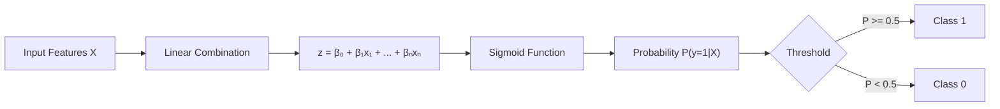
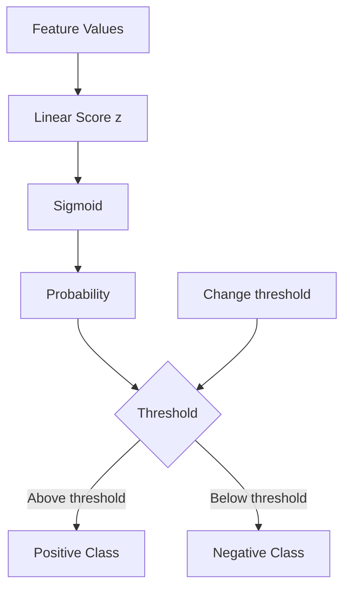
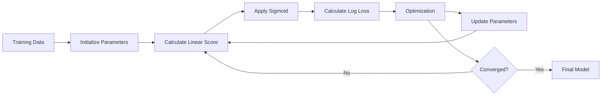
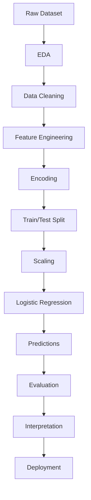
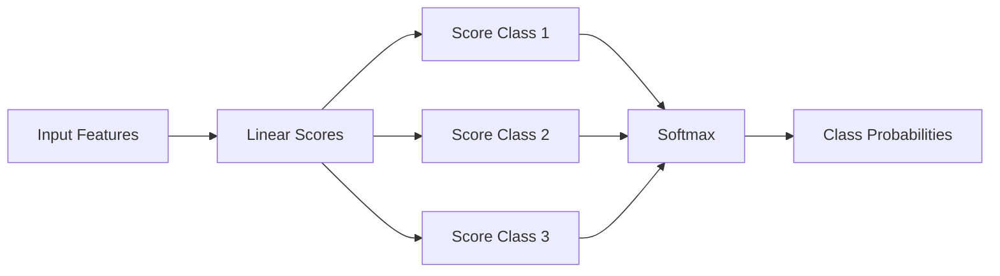
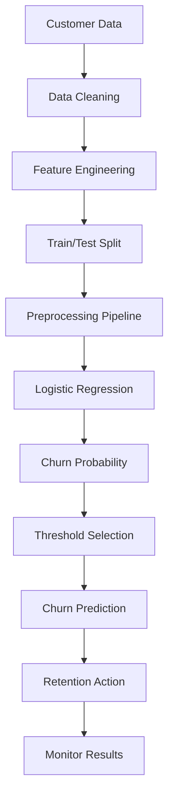

# 📘 Logistic Regression in Machine Learning

> A complete, practical, and interview-oriented guide to Logistic Regression — from fundamentals and mathematics to implementation, evaluation, regularization, multiclass classification, and a practical mini-project.

---

## 📑 Table of Contents

1. [🎯 What Is Logistic Regression?](#1--what-is-logistic-regression)
2. [🧠 Why Is Logistic Regression Used for Classification?](#2--why-is-logistic-regression-used-for-classification)
3. [📌 Key Terminology](#3--key-terminology)
4. [📐 Mathematical Foundation](#4--mathematical-foundation)
5. [📈 The Sigmoid Function](#5--the-sigmoid-function)
6. [🎲 Probability, Odds, and Log-Odds](#6--probability-odds-and-log-odds)
7. [🚧 Decision Boundary](#7--decision-boundary)
8. [🎯 Cost Function and Log Loss](#8--cost-function-and-log-loss)
9. [⚙️ How Logistic Regression Learns](#9--how-logistic-regression-learns)
10. [🧩 Assumptions](#10--assumptions)
11. [🛠️ Data Preparation](#11--data-preparation)
12. [🐍 Logistic Regression with Scikit-Learn](#12--logistic-regression-with-scikit-learn)
13. [📊 Model Evaluation](#13--model-evaluation)
14. [⚖️ Class Imbalance](#14--class-imbalance)
15. [🔒 Regularization](#15--regularization)
16. [🔢 Multiclass Logistic Regression](#16--multiclass-logistic-regression)
17. [📏 Feature Scaling](#17--feature-scaling)
18. [🔍 Feature Selection and Interpretation](#18--feature-selection-and-interpretation)
19. [🧪 Hyperparameter Tuning](#19--hyperparameter-tuning)
20. [🌍 Real-World Use Cases](#20--real-world-use-cases)
21. [✅ Advantages](#21--advantages)
22. [⚠️ Limitations](#22--limitations)
23. [❌ Common Mistakes](#23--common-mistakes)
24. [💡 Best Practices](#24--best-practices)
25. [🧪 Practical Mini-Project](#25--practical-mini-project)
26. [🎤 Interview Questions and Points](#26--interview-questions-and-points)
27. [🗺️ Quick Revision](#27--quick-revision)
28. [📚 Further Learning Roadmap](#28--further-learning-roadmap)

---

# 1. 🎯 What Is Logistic Regression?

**Logistic Regression** is a supervised machine learning algorithm primarily used for **classification**.

Despite its name, Logistic Regression is generally used to predict a **class probability** rather than a continuous numerical value.

Typical binary classification examples:

- Spam vs. Not Spam
- Fraud vs. Not Fraud
- Disease vs. No Disease
- Customer Churn vs. No Churn
- Pass vs. Fail
- Approved vs. Rejected

The model estimates:

\[
P(y=1|X)
\]

where:

- `X` = input features
- `y` = target class
- `P(y=1|X)` = probability that an observation belongs to class `1`

A threshold is then used to convert probability into a class prediction.

For example:

```text
Probability = 0.82
Threshold   = 0.50
Prediction  = Class 1
```

```text
Probability = 0.31
Threshold   = 0.50
Prediction  = Class 0
```

Logistic Regression is a **linear classification model** because its decision boundary is linear in the original feature space.

---

# 2. 🧠 Why Is Logistic Regression Used for Classification?

A linear model can calculate a score:

\[
z = \beta_0 + \beta_1x_1 + \beta_2x_2 + \cdots + \beta_nx_n
\]

However, `z` can take any value from:

\[
-\infty \rightarrow +\infty
\]

A probability must lie between:

\[
0 \leq P \leq 1
\]

Logistic Regression solves this problem by passing the linear score through the **sigmoid/logistic function**.



This makes Logistic Regression especially useful when we need both:

1. A predicted class
2. A probability associated with that prediction

---

# 3. 📌 Key Terminology

| Term | Meaning |
|---|---|
| Feature | Input variable used by the model |
| Target | Output variable to predict |
| Binary Classification | Classification involving two classes |
| Multiclass Classification | Classification involving more than two classes |
| Coefficient / Weight | Learned parameter associated with a feature |
| Intercept | Bias term of the model |
| Logit | Log-odds of the positive class |
| Sigmoid | Function converting a real-valued score into a probability |
| Probability | Estimated likelihood of a class |
| Threshold | Cutoff used to convert probability into a class |
| Decision Boundary | Boundary separating predicted classes |
| Log Loss | Loss function used for probabilistic classification |
| Regularization | Technique used to control model complexity |
| Odds Ratio | Multiplicative change in odds associated with a feature |
| Class Weight | Weight assigned to observations/classes during training |

---

# 4. 📐 Mathematical Foundation

## 4.1 Linear Score

First, Logistic Regression calculates:

\[
z = \beta_0 + \beta_1x_1 + \beta_2x_2 + \cdots + \beta_nx_n
\]

In vector notation:

\[
z = \beta_0 + X\beta
\]

where:

- `β₀` = intercept
- `βᵢ` = coefficient for feature `i`
- `xᵢ` = feature value

---

## 4.2 Logistic Transformation

The score `z` is transformed using:

\[
P(y=1|X)=\frac{1}{1+e^{-z}}
\]

Therefore:

\[
P(y=1|X)=\sigma(z)
\]

where `σ` represents the sigmoid function.

---

## 4.3 Complete Binary Logistic Regression Equation

\[
P(y=1|X)
=
\frac{1}
{1+e^{-(\beta_0+\beta_1x_1+\cdots+\beta_nx_n)}}
\]

The predicted class can then be defined as:

\[
\hat y =
\begin{cases}
1 & P(y=1|X)\geq t\\
0 & P(y=1|X)<t
\end{cases}
\]

where `t` is the classification threshold.

The commonly used default is:

\[
t=0.5
\]

but the threshold can be changed according to the application.

---

# 5. 📈 The Sigmoid Function

The sigmoid function is:

\[
\sigma(z)=\frac{1}{1+e^{-z}}
\]

It maps every real-valued number into the range `(0, 1)`.

| `z` | Approx. Sigmoid |
|---:|---:|
| -5 | 0.0067 |
| -2 | 0.1192 |
| -1 | 0.2689 |
| 0 | 0.5000 |
| 1 | 0.7311 |
| 2 | 0.8808 |
| 5 | 0.9933 |

### Intuition

```text
Large negative z  → probability close to 0
z = 0             → probability = 0.5
Large positive z  → probability close to 1
```

The sigmoid is smooth and differentiable, which makes it useful for optimization.

---

## 5.1 Python Example of Sigmoid

```python
import numpy as np
import matplotlib.pyplot as plt

def sigmoid(z):
    return 1 / (1 + np.exp(-z))

z = np.linspace(-10, 10, 200)
probabilities = sigmoid(z)

plt.plot(z, probabilities)
plt.xlabel("z")
plt.ylabel("Probability")
plt.title("Sigmoid Function")
plt.grid(True)
plt.show()
```

---

# 6. 🎲 Probability, Odds, and Log-Odds

Understanding **probability → odds → log-odds** is one of the most important parts of Logistic Regression.

## 6.1 Probability

Suppose:

\[
P(y=1)=0.8
\]

There is an 80% estimated probability of class `1`.

---

## 6.2 Odds

Odds are:

\[
Odds=\frac{p}{1-p}
\]

For `p = 0.8`:

\[
Odds=\frac{0.8}{0.2}=4
\]

So the odds are `4:1`.

---

## 6.3 Log-Odds / Logit

The logit is:

\[
logit(p)=\ln\left(\frac{p}{1-p}\right)
\]

For `p = 0.8`:

\[
logit(0.8)=\ln(4)\approx1.386
\]

Logistic Regression assumes that the **log-odds are a linear function of the predictors**.

\[
\ln\left(\frac{p}{1-p}\right)
=
\beta_0+\beta_1x_1+\cdots+\beta_nx_n
\]

This relationship connects the linear model to a probability between `0` and `1`.

---

## 6.4 Odds Ratio

For a coefficient `β`:

\[
OR=e^\beta
\]

Interpretation:

- `OR > 1` → increasing the feature increases the odds of class 1
- `OR < 1` → increasing the feature decreases the odds of class 1
- `OR = 1` → no change in odds

Example:

```text
Coefficient = 0.693
Odds Ratio  = e^0.693 ≈ 2
```

Holding other variables constant, a one-unit increase in the feature multiplies the odds by approximately `2`.

---

# 7. 🚧 Decision Boundary

The decision boundary is where the model changes its predicted class.

With a threshold of `0.5`:

\[
P(y=1|X)=0.5
\]

Because:

\[
\sigma(0)=0.5
\]

the corresponding linear score is:

\[
z=0
\]

Therefore:

\[
\beta_0+\beta_1x_1+\cdots+\beta_nx_n=0
\]

This equation describes the decision boundary.



### Important Point

Logistic Regression produces a **linear decision boundary** unless nonlinear features or transformations are explicitly introduced.

---

# 8. 🎯 Cost Function and Log Loss

## 8.1 Why Not Mean Squared Error?

Logistic Regression predicts probabilities.

Using Mean Squared Error is not the standard objective because the sigmoid transformation combined with squared error can produce an optimization problem that is less convenient than the **logistic loss / cross-entropy loss**.

---

## 8.2 Binary Cross-Entropy

For one observation:

\[
Loss
=
-[y\log(p)+(1-y)\log(1-p)]
\]

For `n` observations:

\[
J(\beta)
=
-\frac{1}{n}
\sum_{i=1}^{n}
[
y_i\log(p_i)
+
(1-y_i)\log(1-p_i)
]
\]

This is commonly called:

- Log Loss
- Logistic Loss
- Binary Cross-Entropy
- Cross-Entropy Loss

---

## 8.3 Intuition Behind Log Loss

Consider:

```text
Actual class = 1
```

Prediction A:

```text
Probability = 0.95
```

This should have a small loss.

Prediction B:

```text
Probability = 0.05
```

This should have a very large loss because the model is confidently wrong.

Therefore, log loss strongly penalizes **confident incorrect predictions**.

---

# 9. ⚙️ How Logistic Regression Learns

The model learns the coefficients `β` by optimizing the objective function.

A simplified workflow:



Common optimization approaches include:

- Gradient-based optimization
- Newton-type optimization
- Limited-memory quasi-Newton methods
- Coordinate descent for some regularized formulations

In scikit-learn, the `LogisticRegression` implementation provides several solver choices.

---

## 9.1 Gradient Descent Intuition

The idea is:

```text
Calculate predictions
       ↓
Calculate loss
       ↓
Calculate gradient
       ↓
Move parameters toward lower loss
       ↓
Repeat
```

A simplified update is:

\[
\beta := \beta-\alpha\nabla J(\beta)
\]

where:

- `α` = learning rate
- `∇J(β)` = gradient of the loss

In practice, library implementations may use other optimization solvers rather than manually implementing basic gradient descent.

---

# 10. 🧩 Assumptions

Logistic Regression has assumptions and practical considerations.

| Assumption / Consideration | Explanation |
|---|---|
| Appropriate target | Target should represent categorical outcomes |
| Independent observations | Samples should generally be independent |
| Linear relationship in log-odds | Predictors should have an approximately linear relationship with the logit for a standard linear specification |
| Limited problematic multicollinearity | Highly correlated predictors can make coefficients unstable |
| Sufficient sample information | Too little data can produce unstable estimates |
| No extreme influential observations | Strong outliers/influential points can affect estimates |
| Correct model specification | Important variables and relevant nonlinear effects should be considered |
| No perfect separation | Perfect separation can cause coefficient estimates to become extremely large or unstable |

### Important Clarification

Logistic Regression does **not** require the predictors themselves to be normally distributed.

It also does not require the target to be continuous.

---

# 11. 🛠️ Data Preparation

A practical Logistic Regression workflow usually includes:

1. Load the data
2. Explore the data
3. Clean missing values
4. Encode categorical variables
5. Split train/test data
6. Scale numerical features when appropriate
7. Train the model
8. Tune hyperparameters
9. Evaluate the model
10. Inspect coefficients and errors
11. Save the model if required



---

# 12. 🐍 Logistic Regression with Scikit-Learn

## 12.1 Basic Example

```python
from sklearn.datasets import load_breast_cancer
from sklearn.model_selection import train_test_split
from sklearn.preprocessing import StandardScaler
from sklearn.linear_model import LogisticRegression
from sklearn.metrics import accuracy_score, classification_report

# Load dataset
data = load_breast_cancer()

X = data.data
y = data.target

# Split dataset
X_train, X_test, y_train, y_test = train_test_split(
    X,
    y,
    test_size=0.2,
    random_state=42,
    stratify=y
)

# Scale features
scaler = StandardScaler()

X_train_scaled = scaler.fit_transform(X_train)
X_test_scaled = scaler.transform(X_test)

# Create model
model = LogisticRegression(max_iter=1000)

# Train
model.fit(X_train_scaled, y_train)

# Predict
y_pred = model.predict(X_test_scaled)

# Evaluate
print("Accuracy:", accuracy_score(y_test, y_pred))
print(classification_report(y_test, y_pred))
```

### Why `fit_transform()` only on training data?

Correct:

```python
X_train_scaled = scaler.fit_transform(X_train)
X_test_scaled = scaler.transform(X_test)
```

Incorrect:

```python
scaler.fit_transform(X_train)
scaler.fit_transform(X_test)
```

The second approach allows information from the test set to influence preprocessing and can cause **data leakage**.

---

## 12.2 Getting Probabilities

```python
probabilities = model.predict_proba(X_test_scaled)

print(probabilities[:5])
```

For binary classification, each row generally contains:

```text
[Probability of class 0, Probability of class 1]
```

You can extract the positive-class probability:

```python
positive_probability = model.predict_proba(X_test_scaled)[:, 1]
```

---

## 12.3 Custom Threshold

```python
threshold = 0.30

y_pred_custom = (
    positive_probability >= threshold
).astype(int)
```

Changing the threshold changes the balance between false positives and false negatives.

---

# 13. 📊 Model Evaluation

Accuracy alone is often insufficient.

Important metrics include:

- Accuracy
- Precision
- Recall
- F1-score
- Confusion Matrix
- ROC-AUC
- PR-AUC
- Log Loss

---

## 13.1 Confusion Matrix

For binary classification:

| | Predicted Positive | Predicted Negative |
|---|---:|---:|
| Actual Positive | TP | FN |
| Actual Negative | FP | TN |

Where:

- `TP` = True Positive
- `TN` = True Negative
- `FP` = False Positive
- `FN` = False Negative

---

## 13.2 Accuracy

\[
Accuracy=\frac{TP+TN}{TP+TN+FP+FN}
\]

Useful when classes are reasonably balanced and error costs are similar.

---

## 13.3 Precision

\[
Precision=\frac{TP}{TP+FP}
\]

Precision answers:

> Of the observations predicted as positive, how many were actually positive?

Useful when false positives are costly.

---

## 13.4 Recall

\[
Recall=\frac{TP}{TP+FN}
\]

Recall answers:

> Of all actual positive observations, how many did the model identify?

Useful when false negatives are costly.

---

## 13.5 F1-Score

\[
F1=2\cdot\frac{Precision\cdot Recall}{Precision+Recall}
\]

F1 balances precision and recall using their harmonic mean.

---

## 13.6 ROC-AUC

ROC curves examine:

- True Positive Rate
- False Positive Rate

\[
TPR=\frac{TP}{TP+FN}
\]

\[
FPR=\frac{FP}{FP+TN}
\]

ROC-AUC measures ranking/discrimination performance across thresholds.

---

## 13.7 Precision-Recall Curve

Precision-Recall curves can be particularly informative when the positive class is rare.

---

## 13.8 Evaluation Code

```python
from sklearn.metrics import (
    confusion_matrix,
    classification_report,
    roc_auc_score,
    log_loss
)

print("Confusion Matrix:")
print(confusion_matrix(y_test, y_pred))

print("\nClassification Report:")
print(classification_report(y_test, y_pred))

print("ROC-AUC:")
print(roc_auc_score(y_test, positive_probability))

print("Log Loss:")
print(log_loss(y_test, positive_probability))
```

---

# 14. ⚖️ Class Imbalance

Suppose a fraud dataset contains:

```text
99,000 legitimate transactions
1,000 fraudulent transactions
```

A model that predicts every transaction as legitimate gets:

```text
99% accuracy
```

but detects:

```text
0% of fraud
```

This shows why accuracy can be misleading for imbalanced datasets.

---

## 14.1 Class Weights

Scikit-learn provides:

```python
model = LogisticRegression(
    class_weight="balanced",
    max_iter=1000
)
```

This automatically adjusts class weights based on class frequencies.

---

## 14.2 Other Strategies

Possible approaches include:

- Class weighting
- Oversampling
- Undersampling
- SMOTE
- Threshold optimization
- Better data collection
- Precision-Recall analysis

The appropriate approach depends on the application and evaluation objective.

---

# 15. 🔒 Regularization

Regularization helps control model complexity and can reduce overfitting.

Two commonly discussed types are:

- L1 regularization
- L2 regularization

---

## 15.1 L1 Regularization

L1 adds a penalty related to the absolute values of coefficients:

\[
\lambda\sum_j|\beta_j|
\]

It can drive some coefficients exactly to zero.

Therefore, L1 can also perform a form of feature selection.

---

## 15.2 L2 Regularization

L2 adds a squared coefficient penalty:

\[
\lambda\sum_j\beta_j^2
\]

It generally shrinks coefficients toward zero without usually making them exactly zero.

---

## 15.3 L1 vs L2

| Property | L1 | L2 |
|---|---|---|
| Penalty | Absolute value | Squared value |
| Feature selection | Can produce zero coefficients | Usually does not produce exact zero coefficients |
| Sparse model | Often | Less commonly |
| Correlated features | May select one or a subset | Often distributes weight |
| Common use | Sparse/high-dimensional features | General-purpose regularization |

---

## 15.4 `C` in Scikit-Learn

In scikit-learn:

```python
LogisticRegression(C=1.0)
```

`C` is the **inverse of regularization strength**.

Therefore:

```text
Smaller C → stronger regularization
Larger C  → weaker regularization
```

Example:

```python
model = LogisticRegression(
    C=0.1,
    max_iter=1000
)
```

---

# 16. 🔢 Multiclass Logistic Regression

Logistic Regression can also handle more than two classes.

Examples:

```text
Class 0 → Cat
Class 1 → Dog
Class 2 → Horse
```

Common conceptual approaches include:

- One-vs-Rest (OvR)
- Multinomial Logistic Regression / Softmax formulation

---

## 16.1 Softmax

For class `k`:

\[
P(y=k|X)
=
\frac{e^{z_k}}
{\sum_j e^{z_j}}
\]

The probabilities across classes sum to `1`.



Example:

```text
Class A → 0.10
Class B → 0.70
Class C → 0.20
```

Prediction:

```text
Class B
```

---

# 17. 📏 Feature Scaling

Feature scaling is often useful for Logistic Regression, especially when features have very different numerical ranges and regularization is used.

Example:

```text
Age       → 18 to 80
Income    → 20,000 to 2,000,000
Distance  → 0 to 100
```

Standardization:

\[
z=\frac{x-\mu}{\sigma}
\]

Python:

```python
from sklearn.preprocessing import StandardScaler

scaler = StandardScaler()

X_train_scaled = scaler.fit_transform(X_train)
X_test_scaled = scaler.transform(X_test)
```

### Why scaling helps

Scaling can:

- Improve numerical conditioning
- Make optimization more efficient
- Make regularization act more comparably across features
- Help hyperparameter search behave more consistently

---

# 18. 🔍 Feature Selection and Interpretation

One important advantage of Logistic Regression is interpretability.

Suppose:

```text
Feature          Coefficient
---------------------------
Age              0.80
Income          -0.20
PreviousDebt     1.10
```

The coefficient sign indicates the direction of association with the model's log-odds, holding other included variables constant.

---

## 18.1 Coefficient Interpretation

For a one-unit increase in `x_j`:

\[
\Delta log\ odds = \beta_j
\]

The odds are multiplied by:

\[
e^{\beta_j}
\]

Example:

```python
import numpy as np

coefficient = 0.8
odds_ratio = np.exp(coefficient)

print(odds_ratio)
```

Output approximately:

```text
2.2255
```

This means the odds are multiplied by about `2.23` for a one-unit increase in that feature, assuming other variables are held constant and the model specification is appropriate.

---

## 18.2 Important Interpretation Warning

A coefficient does **not automatically prove causation**.

It describes an association represented by the fitted model under its assumptions.

---

# 19. 🧪 Hyperparameter Tuning

Important Logistic Regression hyperparameters include:

| Parameter | Purpose |
|---|---|
| `C` | Controls inverse regularization strength |
| `penalty` | Selects regularization type |
| `solver` | Optimization algorithm |
| `max_iter` | Maximum optimization iterations |
| `class_weight` | Handles class imbalance |
| `multi_class` | Multiclass handling in supported versions/configurations |
| `tol` | Optimization stopping tolerance |

---

## 19.1 Grid Search Example

```python
from sklearn.model_selection import GridSearchCV
from sklearn.linear_model import LogisticRegression

param_grid = {
    "C": [0.01, 0.1, 1, 10, 100],
    "penalty": ["l2"],
    "solver": ["lbfgs"]
}

grid = GridSearchCV(
    LogisticRegression(max_iter=2000),
    param_grid,
    cv=5,
    scoring="f1"
)

grid.fit(X_train_scaled, y_train)

print("Best Parameters:", grid.best_params_)
print("Best CV Score:", grid.best_score_)
```

### Best Practice

Use a validation strategy or cross-validation for model selection rather than repeatedly tuning against the final test set.

---

# 20. 🌍 Real-World Use Cases

| Domain | Example |
|---|---|
| 🏦 Banking | Loan default prediction |
| 💳 Finance | Fraud detection |
| 📧 Email | Spam classification |
| 🏥 Healthcare | Disease-risk classification |
| 🛒 E-commerce | Customer churn |
| 📱 SaaS | Subscription cancellation |
| 👨‍💼 HR | Employee attrition modeling |
| 🎓 Education | Student pass/fail prediction |
| 🛡️ Cybersecurity | Malicious activity classification |
| 📢 Marketing | Campaign response prediction |

### Example: Customer Churn

Features:

```text
Monthly Charges
Contract Type
Tenure
Support Tickets
Payment Method
```

Target:

```text
Churn
0 = No
1 = Yes
```

The model can estimate:

```text
Customer A → 0.08
Customer B → 0.74
Customer C → 0.91
```

A business can then choose an operating threshold based on the cost of contacting customers versus missing likely churners.

---

# 21. ✅ Advantages

| Advantage | Explanation |
|---|---|
| Simple | Easy to understand and implement |
| Fast | Efficient for many tabular datasets |
| Interpretable | Coefficients can be analyzed |
| Probabilistic | Produces class probabilities |
| Strong baseline | Useful benchmark for classification |
| Regularization | Supports L1/L2 regularization |
| Multiclass support | Can handle multiple classes |
| Scalable | Works well for many high-dimensional sparse problems |
| Easy deployment | Lightweight compared with many complex models |

---

# 22. ⚠️ Limitations

| Limitation | Explanation |
|---|---|
| Linear boundary | Standard model cannot directly learn complex nonlinear boundaries |
| Feature engineering | Nonlinear relationships may require transformations/interactions |
| Outlier sensitivity | Extreme observations can affect coefficients |
| Multicollinearity | Highly correlated predictors can destabilize interpretation |
| Separation | Perfect or near-perfect separation can cause unstable coefficients |
| Imbalance | Accuracy may become misleading with rare classes |
| Missing nonlinear effects | Important interactions may be missed if not modeled |
| Probability calibration | Good classification discrimination does not automatically guarantee perfectly calibrated probabilities |

---

# 23. ❌ Common Mistakes

## Mistake 1: Thinking Logistic Regression is a Regression Algorithm for Continuous Targets

Wrong:

```text
Predict house price → Logistic Regression
```

Better:

```text
Predict whether house price exceeds a threshold → Logistic Regression
```

For continuous house-price prediction, Linear Regression or another regression model may be appropriate.

---

## Mistake 2: Using Accuracy Alone

Especially dangerous for:

- Fraud detection
- Medical screening
- Rare-event detection

Use appropriate metrics such as:

```text
Precision
Recall
F1
ROC-AUC
PR-AUC
Log Loss
```

---

## Mistake 3: Scaling Before Train/Test Split

Wrong:

```python
X_scaled = scaler.fit_transform(X)

X_train, X_test, y_train, y_test = train_test_split(
    X_scaled, y, test_size=0.2
)
```

Better:

```python
X_train, X_test, y_train, y_test = train_test_split(
    X, y, test_size=0.2, random_state=42
)

X_train = scaler.fit_transform(X_train)
X_test = scaler.transform(X_test)
```

Even better for production workflows:

```python
from sklearn.pipeline import Pipeline

pipeline = Pipeline([
    ("scaler", StandardScaler()),
    ("model", LogisticRegression(max_iter=1000))
])
```

---

## Mistake 4: Ignoring Class Imbalance

Always inspect:

```python
print(y.value_counts())
```

---

## Mistake 5: Treating Probability as Certainty

A prediction of:

```text
0.90
```

does not mean:

```text
90% certain that the event will definitely happen
```

Probability quality depends on the data, model specification, sampling process, and calibration.

---

## Mistake 6: Assuming Coefficients Prove Causation

A model coefficient generally represents an association within the fitted model, not a causal effect.

---

# 24. 💡 Best Practices

## Before Training

- Understand the business problem
- Define the positive class carefully
- Inspect class distribution
- Identify missing values
- Check categorical variables
- Inspect feature distributions
- Check for potential leakage
- Examine correlations and multicollinearity

## During Training

- Split data correctly
- Use stratification when appropriate
- Use pipelines
- Scale features when appropriate
- Apply regularization
- Tune hyperparameters with cross-validation
- Track the right evaluation metric

## After Training

- Evaluate on untouched test data
- Inspect confusion matrix
- Analyze precision and recall
- Check probability quality when probabilities are used
- Inspect coefficients
- Investigate errors
- Select thresholds based on application costs
- Monitor model performance after deployment

---

# 25. 🧪 Practical Mini-Project

## Project: Customer Churn Prediction

### 🎯 Objective

Build a Logistic Regression model that predicts whether a customer will churn.

### Dataset Features

Example:

| Feature | Type |
|---|---|
| `tenure` | Numerical |
| `monthly_charges` | Numerical |
| `total_charges` | Numerical |
| `contract_type` | Categorical |
| `payment_method` | Categorical |
| `support_tickets` | Numerical |
| `churn` | Binary Target |

---

## Step 1: Import Libraries

```python
import pandas as pd

from sklearn.model_selection import train_test_split
from sklearn.compose import ColumnTransformer
from sklearn.pipeline import Pipeline
from sklearn.preprocessing import StandardScaler, OneHotEncoder
from sklearn.linear_model import LogisticRegression
from sklearn.metrics import (
    classification_report,
    confusion_matrix,
    roc_auc_score
)
```

---

## Step 2: Load Dataset

```python
df = pd.read_csv("customer_churn.csv")

print(df.head())
print(df.info())
print(df["churn"].value_counts())
```

---

## Step 3: Separate Features and Target

```python
X = df.drop("churn", axis=1)
y = df["churn"]
```

---

## Step 4: Identify Feature Types

```python
numeric_features = [
    "tenure",
    "monthly_charges",
    "total_charges",
    "support_tickets"
]

categorical_features = [
    "contract_type",
    "payment_method"
]
```

---

## Step 5: Build Preprocessing Pipeline

```python
numeric_transformer = Pipeline([
    ("scaler", StandardScaler())
])

categorical_transformer = Pipeline([
    ("onehot", OneHotEncoder(handle_unknown="ignore"))
])

preprocessor = ColumnTransformer([
    ("num", numeric_transformer, numeric_features),
    ("cat", categorical_transformer, categorical_features)
])
```

---

## Step 6: Build Complete Model Pipeline

```python
model = Pipeline([
    ("preprocessor", preprocessor),
    ("classifier", LogisticRegression(
        max_iter=2000,
        class_weight="balanced"
    ))
])
```

---

## Step 7: Train/Test Split

```python
X_train, X_test, y_train, y_test = train_test_split(
    X,
    y,
    test_size=0.2,
    random_state=42,
    stratify=y
)
```

---

## Step 8: Train

```python
model.fit(X_train, y_train)
```

---

## Step 9: Predict

```python
y_pred = model.predict(X_test)

y_probability = model.predict_proba(X_test)[:, 1]
```

---

## Step 10: Evaluate

```python
print("Confusion Matrix:")
print(confusion_matrix(y_test, y_pred))

print("\nClassification Report:")
print(classification_report(y_test, y_pred))

print(
    "\nROC-AUC:",
    roc_auc_score(y_test, y_probability)
)
```

---

## Step 11: Business Interpretation

Suppose:

```text
Customer A → 0.12
Customer B → 0.78
Customer C → 0.91
```

A business might use:

```text
0.50 threshold
```

or another threshold depending on:

- Cost of retention campaigns
- Cost of missed churn
- Customer lifetime value
- Available support capacity

The threshold should therefore be chosen based on the application's error costs, not simply because `0.5` is the default.

---

## Mini-Project Architecture



---

# 26. 🎤 Interview Questions and Points

## Q1. What is Logistic Regression?

Logistic Regression is a supervised classification algorithm that models the probability of a categorical outcome using a logistic/sigmoid function applied to a linear predictor.

---

## Q2. Why is it called Logistic Regression if it is used for classification?

The model estimates a regression relationship on the **log-odds/logit scale**, while the resulting probabilities are used for classification.

---

## Q3. What is the sigmoid function?

\[
\sigma(z)=\frac{1}{1+e^{-z}}
\]

It converts a real-valued linear score into a value between `0` and `1`.

---

## Q4. What is the default classification threshold?

Commonly:

```text
0.5
```

But it is not universally optimal.

---

## Q5. What is log loss?

Binary log loss is:

\[
-[y\log(p)+(1-y)\log(1-p)]
\]

It penalizes incorrect probabilistic predictions, especially confident incorrect predictions.

---

## Q6. What is the difference between probability and odds?

Probability:

\[
p
\]

Odds:

\[
\frac{p}{1-p}
\]

---

## Q7. What is the logit?

\[
logit(p)=\ln\left(\frac{p}{1-p}\right)
\]

It transforms probabilities from `(0,1)` to the entire real-number range.

---

## Q8. What does a positive coefficient mean?

A positive coefficient increases the modeled log-odds of the positive class as the feature increases, holding other included variables constant.

---

## Q9. What does `C` mean in scikit-learn?

`C` controls the inverse of regularization strength.

```text
Small C → stronger regularization
Large C → weaker regularization
```

---

## Q10. L1 vs L2?

```text
L1 → absolute-value penalty → can create sparse coefficients
L2 → squared-value penalty → generally shrinks coefficients
```

---

## Q11. What is multicollinearity?

Multicollinearity occurs when predictors are strongly related to each other.

Potential effects:

- Unstable coefficients
- Difficult interpretation
- Inflated uncertainty in statistical formulations
- Redundant information

---

## Q12. Can Logistic Regression solve multiclass problems?

Yes.

Common approaches include:

- One-vs-Rest
- Multinomial/softmax modeling

---

## Q13. Why is scaling useful?

Scaling can improve numerical conditioning and optimization and makes regularization more comparable across features.

---

## Q14. Why can accuracy be misleading?

With severe class imbalance, a model can achieve high accuracy while performing poorly on the minority class.

---

## Q15. What is the difference between `predict()` and `predict_proba()`?

```python
predict()
```

returns class predictions.

```python
predict_proba()
```

returns estimated probabilities for each class.

---

## Q16. Is Logistic Regression a linear or nonlinear model?

The standard Logistic Regression model has a **linear decision boundary in feature space**, although the sigmoid transforms the linear score into a probability.

---

# 27. 🗺️ Quick Revision

## 🔑 Core Formula

\[
z=\beta_0+\beta_1x_1+\cdots+\beta_nx_n
\]

\[
p=\frac{1}{1+e^{-z}}
\]

\[
\hat y =
\begin{cases}
1 & p\geq t\\
0 & p<t
\end{cases}
\]

---

## 🔑 Logit

\[
logit(p)=\ln\left(\frac{p}{1-p}\right)
\]

---

## 🔑 Odds

\[
Odds=\frac{p}{1-p}
\]

---

## 🔑 Odds Ratio

\[
OR=e^\beta
\]

---

## 🔑 Binary Cross-Entropy

\[
J(\beta)
=
-\frac{1}{n}
\sum_{i=1}^{n}
[
y_i\log(p_i)
+
(1-y_i)\log(1-p_i)
]
\]

---

## 🔑 Classification Metrics

| Metric | Formula | Focus |
|---|---|---|
| Accuracy | `(TP+TN)/Total` | Overall correctness |
| Precision | `TP/(TP+FP)` | False positives |
| Recall | `TP/(TP+FN)` | False negatives |
| F1 | `2PR/(P+R)` | Precision/Recall balance |
| ROC-AUC | Area under ROC curve | Ranking/discrimination |
| Log Loss | Cross-entropy | Probability quality |

---

## 🔑 Regularization

```text
L1 → Sparse coefficients / feature selection
L2 → Coefficient shrinkage
```

Scikit-learn:

```python
LogisticRegression(
    penalty="l2",
    C=1.0,
    max_iter=1000
)
```

---

## 🔑 Essential Commands

```python
from sklearn.linear_model import LogisticRegression

model = LogisticRegression(max_iter=1000)

model.fit(X_train, y_train)

y_pred = model.predict(X_test)

y_prob = model.predict_proba(X_test)[:, 1]
```

Evaluation:

```python
from sklearn.metrics import (
    accuracy_score,
    precision_score,
    recall_score,
    f1_score,
    roc_auc_score,
    confusion_matrix,
    log_loss
)
```

---

## 🔑 Mental Model

```text
                LOGISTIC REGRESSION
                        │
                        ▼
                Input Features
                        │
                        ▼
              Linear Combination
              z = β₀ + βX
                        │
                        ▼
                   Sigmoid
                        │
                        ▼
                  Probability
                     0 → 1
                        │
                        ▼
                 Threshold t
                  /         \
                 /           \
             Class 0        Class 1
```

---

## 🧭 Visual Learning Roadmap

```mermaid
flowchart LR
    A[Classification Basics] --> B[Linear Score]
    B --> C[Sigmoid]
    C --> D[Probability]
    D --> E[Log-Odds]
    E --> F[Log Loss]
    F --> G[Optimization]
    G --> H[Regularization]
    H --> I[Evaluation]
    I --> J[Threshold Tuning]
    J --> K[Multiclass]
    K --> L[Deployment]
```



---

# 28. 📚 Further Learning Roadmap

After learning Logistic Regression, continue with:

```text
1. Linear Regression
       ↓
2. Logistic Regression
       ↓
3. K-Nearest Neighbors
       ↓
4. Naive Bayes
       ↓
5. Decision Trees
       ↓
6. Random Forest
       ↓
7. Gradient Boosting
       ↓
8. XGBoost / LightGBM / CatBoost
       ↓
9. Support Vector Machines
       ↓
10. Neural Networks
       ↓
11. Model Calibration
       ↓
12. Explainable AI
       ↓
13. Production ML
```

---

# ⭐ Final Takeaways

- Logistic Regression is primarily a **classification algorithm**.
- It models class probability using a **sigmoid/logistic function**.
- The linear predictor is:

\[
z=\beta_0+\beta^TX
\]

- The sigmoid converts `z` into a probability.
- The logit connects probability to a linear predictor.
- The standard binary objective is **log loss / binary cross-entropy**.
- A default threshold of `0.5` is common but should not automatically be treated as optimal.
- Logistic Regression generally produces a **linear decision boundary**.
- L1 and L2 regularization help control model complexity.
- Feature scaling is often useful, particularly with regularization and numerical optimization.
- Accuracy should not be the only metric, especially for imbalanced data.
- `predict()` returns classes; `predict_proba()` returns estimated class probabilities.
- Coefficients can provide useful model interpretation, but they do not automatically establish causality.
- Logistic Regression is an excellent baseline for many tabular classification problems.
- A production-quality workflow should include proper splitting, preprocessing pipelines, cross-validation, appropriate metrics, threshold selection, error analysis, and monitoring.

> **One-line memory trick:**  
> **Logistic Regression = Linear Score → Sigmoid → Probability → Threshold → Class**
