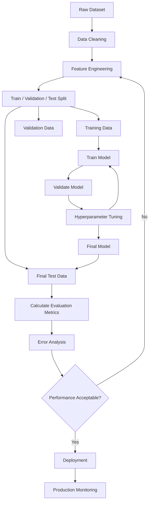
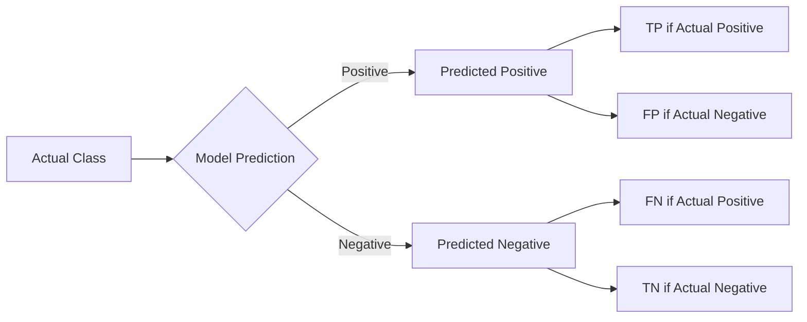
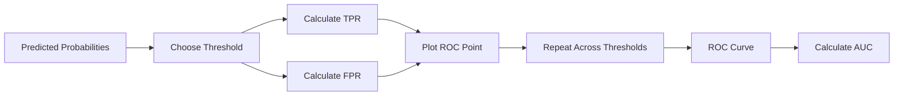
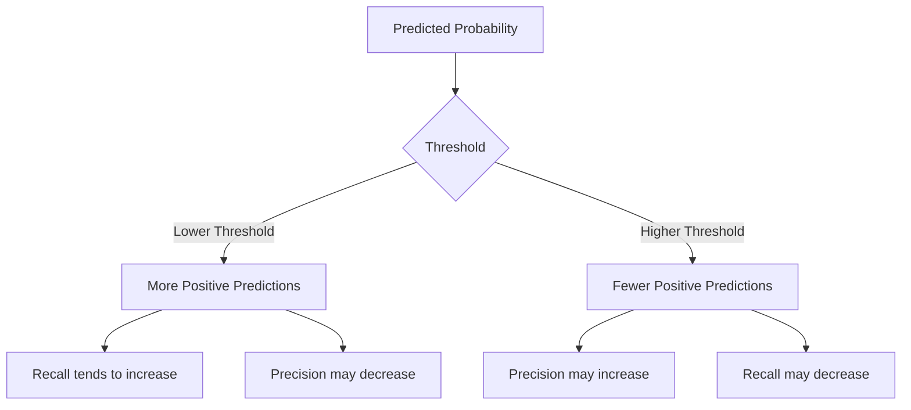
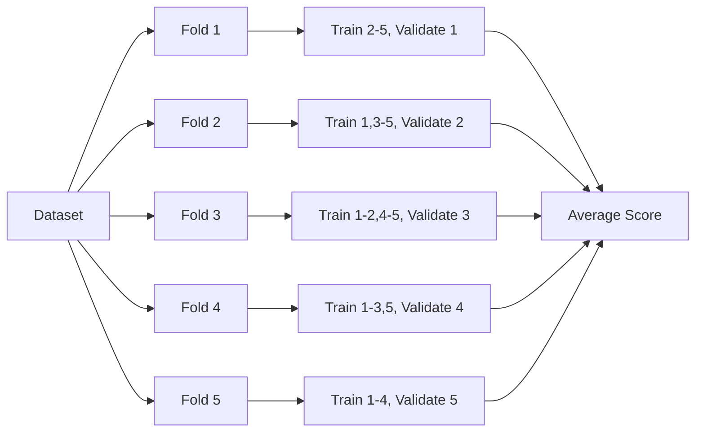
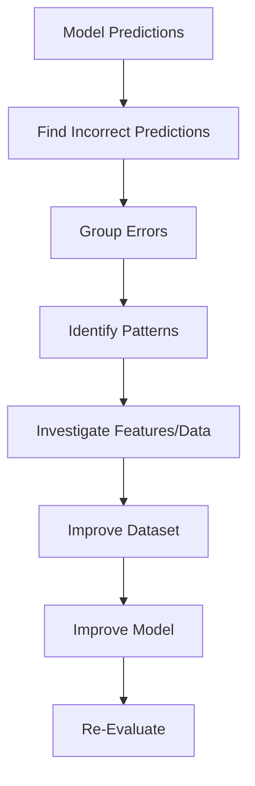
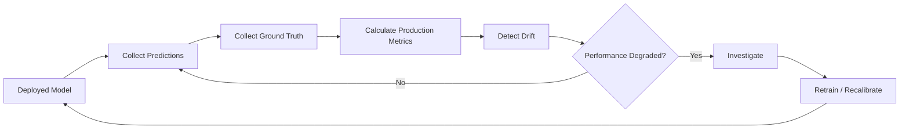
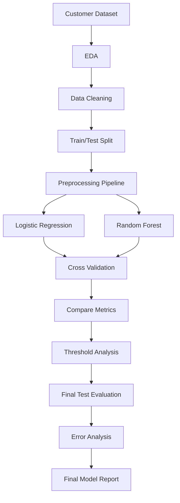
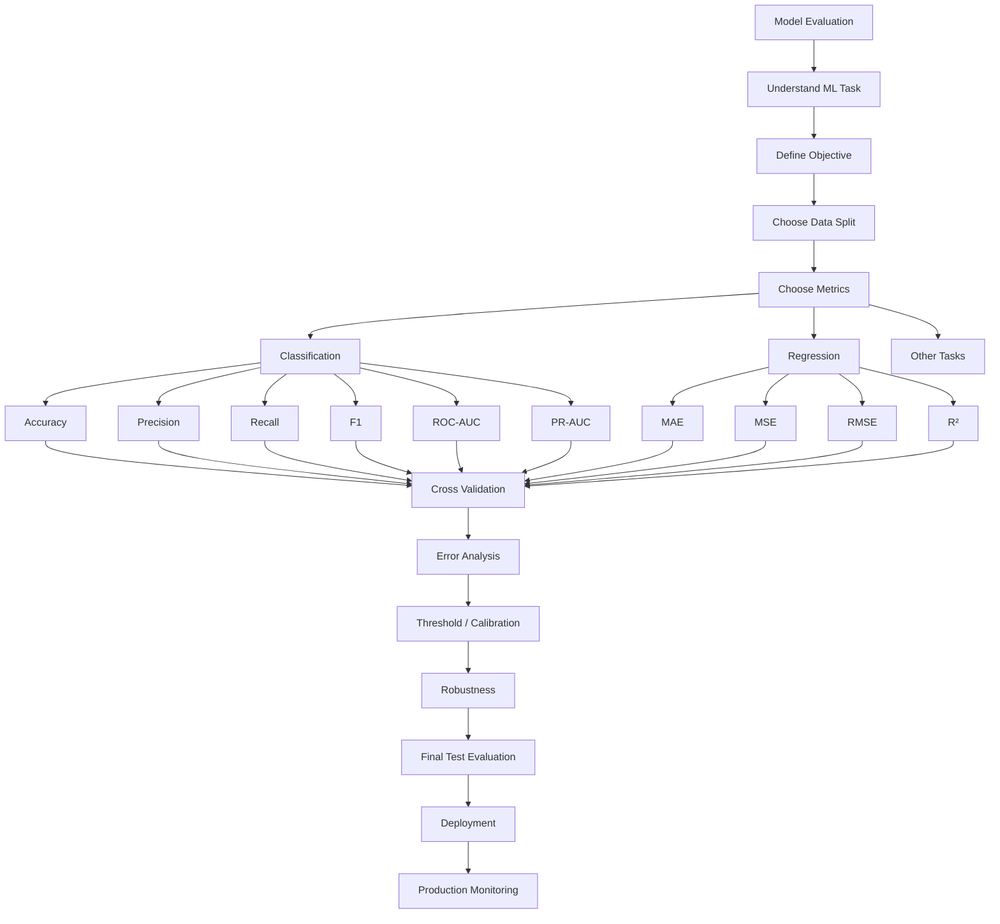

# 📊 Model Evaluation in Machine Learning

> A complete learning resource covering the principles, metrics, workflows, validation strategies, practical implementation, and advanced concepts used to evaluate machine learning models.

---

## 📚 Table of Contents

1. [🎯 Introduction to Model Evaluation](#1--introduction-to-model-evaluation)
2. [🧠 Why Model Evaluation Matters](#2--why-model-evaluation-matters)
3. [📖 Important Terminology](#3--important-terminology)
4. [🔄 Machine Learning Evaluation Workflow](#4--machine-learning-evaluation-workflow)
5. [✂️ Train, Validation, and Test Sets](#5--train-validation-and-test-sets)
6. [📊 Classification Evaluation Metrics](#6--classification-evaluation-metrics)
7. [🎯 Regression Evaluation Metrics](#7--regression-evaluation-metrics)
8. [🔲 Confusion Matrix](#8--confusion-matrix)
9. [⚖️ Precision, Recall, and F1-Score](#9--precision-recall-and-f1-score)
10. [📈 ROC Curve and AUC](#10--roc-curve-and-auc)
11. [📉 Precision-Recall Curve](#11--precision-recall-curve)
12. [🎚️ Threshold Tuning](#12--threshold-tuning)
13. [🔢 Multiclass Evaluation](#13--multiclass-evaluation)
14. [🔀 Cross-Validation](#14--cross-validation)
15. [⚠️ Overfitting, Underfitting, and Generalization](#15--overfitting-underfitting-and-generalization)
16. [🧪 Model Validation and Data Leakage](#16--model-validation-and-data-leakage)
17. [📏 Calibration and Probability Quality](#17--calibration-and-probability-quality)
18. [⚖️ Imbalanced Dataset Evaluation](#18--imbalanced-dataset-evaluation)
19. [📐 Regression Diagnostics](#19--regression-diagnostics)
20. [🏆 Model Comparison and Selection](#20--model-comparison-and-selection)
21. [💻 Practical Python Examples](#21--practical-python-examples)
22. [🌍 Real-World Use Cases](#22--real-world-use-cases)
23. [🚫 Common Mistakes](#23--common-mistakes)
24. [✅ Best Practices](#24--best-practices)
25. [🚀 Advanced Model Evaluation](#25--advanced-model-evaluation)
26. [🛠️ Practical Mini-Project](#26--practical-mini-project)
27. [🎤 Interview Questions and Points](#27--interview-questions-and-points)
28. [⚡ Quick Revision](#28--quick-revision)
29. [🗺️ Visual Learning Roadmap](#29--visual-learning-roadmap)

---

# 1. 🎯 Introduction to Model Evaluation

## 1.1 What is Model Evaluation?

**Model evaluation** is the process of measuring how well a machine learning model performs on data that represents the problem it will encounter in practice.

A model should not be considered good simply because it performs well on the data used for training.

The central question is:

> **How well does the model generalize to unseen data?**

Model evaluation helps answer questions such as:

- Is the model making accurate predictions?
- Is it overfitting?
- Is it underfitting?
- Which errors does it make?
- Are false positives more costly than false negatives?
- Does the model work well for minority classes?
- Are predicted probabilities trustworthy?
- Is the model better than a baseline?
- Will the model perform reliably in production?

---

## 1.2 Evaluation Depends on the ML Task

The evaluation strategy depends heavily on the type of machine learning problem.

| ML Task | Example | Common Metrics |
|---|---|---|
| Binary Classification | Spam detection | Accuracy, Precision, Recall, F1, ROC-AUC |
| Multiclass Classification | Disease classification | Accuracy, Macro F1, Confusion Matrix |
| Multilabel Classification | Image tags | Hamming Loss, Micro/Macro F1 |
| Regression | House price prediction | MAE, MSE, RMSE, R² |
| Ranking | Search results | MAP, MRR, NDCG |
| Clustering | Customer segmentation | Silhouette Score, Davies-Bouldin |
| Forecasting | Sales forecasting | MAE, RMSE, MAPE, sMAPE |

---

# 2. 🧠 Why Model Evaluation Matters

A machine learning model is useful only when its predictions are sufficiently reliable for the intended application.

## 2.1 Main Objectives

Model evaluation helps to:

1. Measure predictive performance.
2. Detect overfitting.
3. Detect underfitting.
4. Compare different algorithms.
5. Select hyperparameters.
6. Identify problematic classes.
7. Understand error patterns.
8. Estimate expected performance on unseen data.
9. Support deployment decisions.
10. Monitor models after deployment.

---

## 2.2 Training Performance vs Generalization

Consider two models:

| Model | Training Accuracy | Test Accuracy |
|---|---:|---:|
| Model A | 99% | 72% |
| Model B | 94% | 91% |

Model A has higher training performance but much worse unseen-data performance.

This is a classic indication that Model A may have learned patterns specific to the training dataset.

### Key Principle

> **A model should be evaluated primarily on data that was not used to fit its parameters.**

---

# 3. 📖 Important Terminology

| Term | Meaning |
|---|---|
| Actual | True target value |
| Prediction | Value predicted by the model |
| Ground Truth | Correct known target |
| Error | Difference between actual and predicted result |
| Metric | Numerical measure of model performance |
| Baseline | Simple reference model or rule |
| Generalization | Ability to perform well on unseen data |
| Overfitting | Learning training-specific patterns/noise |
| Underfitting | Model is too simple to capture useful patterns |
| Validation Set | Data used for model/hyperparameter selection |
| Test Set | Final unseen data used for evaluation |
| Threshold | Cutoff used to convert probabilities into decisions |
| Cross-Validation | Repeated training/validation splits |
| Calibration | Agreement between predicted probabilities and observed frequencies |
| Data Leakage | Unintended use of information unavailable at prediction time |

---

# 4. 🔄 Machine Learning Evaluation Workflow

A robust evaluation process can be represented as:



---

## 4.1 General Evaluation Loop

```text
Dataset
   ↓
Split Data
   ↓
Train Model
   ↓
Generate Predictions
   ↓
Calculate Metrics
   ↓
Analyze Errors
   ↓
Tune Model
   ↓
Final Evaluation
   ↓
Deploy
   ↓
Monitor
```

---

# 5. ✂️ Train, Validation, and Test Sets

## 5.1 Training Set

The training set is used to learn model parameters.

Examples:

- Regression coefficients
- Neural network weights
- Decision tree splits

---

## 5.2 Validation Set

The validation set is used for decisions such as:

- Hyperparameter tuning
- Model selection
- Threshold selection
- Feature selection
- Early stopping

---

## 5.3 Test Set

The test set should remain untouched until the final evaluation.

It provides an estimate of how the finalized model performs on unseen data.

---

## 5.4 Typical Splits

Common approaches include:

| Dataset Size | Possible Split |
|---|---|
| Small | Cross-validation |
| Medium | 70 / 15 / 15 |
| Medium/Large | 80 / 10 / 10 |
| Large | 80 / 20 |
| Very Large | Train/Validation/Test with dedicated holdout |

There is no universal split ratio. The appropriate strategy depends on dataset size, problem type, temporal structure, and computational cost.

---

## 5.5 Basic Python Split

```python
from sklearn.model_selection import train_test_split

X_train, X_test, y_train, y_test = train_test_split(
    X,
    y,
    test_size=0.2,
    random_state=42,
    stratify=y
)
```

For classification, `stratify=y` helps preserve class proportions when appropriate.

---

# 6. 📊 Classification Evaluation Metrics

Classification predicts discrete classes.

Examples:

- Spam / Not Spam
- Fraud / Not Fraud
- Disease / Healthy
- Cat / Dog / Horse

The most common classification metrics are:

- Accuracy
- Precision
- Recall
- F1-score
- Specificity
- ROC-AUC
- PR-AUC
- Log Loss
- Balanced Accuracy
- Matthews Correlation Coefficient

---

# 7. 🎯 Regression Evaluation Metrics

Regression predicts continuous numerical values.

Examples:

- House prices
- Temperature
- Revenue
- Demand
- Delivery time

Common metrics:

- MAE
- MSE
- RMSE
- R²
- Adjusted R²
- MAPE
- sMAPE
- Median Absolute Error

---

# 8. 🔲 Confusion Matrix

A confusion matrix summarizes classification predictions by comparing predicted classes with actual classes.

For binary classification:

| | Predicted Positive | Predicted Negative |
|---|---:|---:|
| **Actual Positive** | TP | FN |
| **Actual Negative** | FP | TN |

Where:

- **TP** = True Positive
- **TN** = True Negative
- **FP** = False Positive
- **FN** = False Negative

---

## 8.1 Confusion Matrix Diagram



---

# 9. ⚖️ Precision, Recall, and F1-Score

## 9.1 Accuracy

Accuracy measures the proportion of correct predictions.

$$
Accuracy = \frac{TP + TN}{TP + TN + FP + FN}
$$

### Example

Suppose:

- TP = 80
- TN = 90
- FP = 10
- FN = 20

Then:

$$
Accuracy = \frac{80+90}{80+90+10+20}
$$

$$
Accuracy = 0.85 = 85\%
$$

---

## 9.2 Precision

Precision answers:

> Of all observations predicted as positive, how many were actually positive?

$$
Precision = \frac{TP}{TP+FP}
$$

High precision means fewer false positives.

### Use Precision When

False positives are expensive.

Examples:

- Fraud investigation
- Spam filtering
- Automatic content moderation

---

## 9.3 Recall / Sensitivity

Recall answers:

> Of all actual positive observations, how many did the model correctly identify?

$$
Recall = \frac{TP}{TP+FN}
$$

High recall means fewer false negatives.

### Use Recall When

Missing a positive case is costly.

Examples:

- Disease screening
- Safety monitoring
- Fraud detection

---

## 9.4 Specificity

Specificity measures how well the model identifies negative cases.

$$
Specificity = \frac{TN}{TN+FP}
$$

It is also called the **True Negative Rate (TNR)**.

---

## 9.5 F1-Score

F1-score is the harmonic mean of precision and recall.

$$
F1 = 2 \times \frac{Precision \times Recall}{Precision + Recall}
$$

F1 is useful when both precision and recall matter.

---

## 9.6 Metric Comparison

| Metric | Focus | Sensitive To | Useful When |
|---|---|---|---|
| Accuracy | Overall correctness | Class imbalance | Classes are reasonably balanced |
| Precision | Positive prediction quality | FP | False positives are costly |
| Recall | Positive detection | FN | False negatives are costly |
| Specificity | Negative detection | FP | Correct rejection matters |
| F1 | Precision + Recall | Both FP/FN | Balance is important |
| ROC-AUC | Ranking/separation | Class distributions | Comparing discrimination |
| PR-AUC | Positive-class performance | Imbalance | Positive class is rare |

---

# 10. 📈 ROC Curve and AUC

## 10.1 ROC Curve

ROC stands for **Receiver Operating Characteristic**.

It plots:

- True Positive Rate (TPR)
- False Positive Rate (FPR)

Where:

$$
TPR = \frac{TP}{TP+FN}
$$

and

$$
FPR = \frac{FP}{FP+TN}
$$

---

## 10.2 ROC-AUC

AUC means **Area Under the Curve**.

ROC-AUC measures the model's ability to rank positive examples above negative examples across classification thresholds.

Typical interpretation:

| AUC | General Interpretation |
|---:|---|
| 1.0 | Perfect ranking |
| 0.9–1.0 | Excellent discrimination |
| 0.8–0.9 | Strong discrimination |
| 0.7–0.8 | Moderate discrimination |
| 0.5 | Approximately random ranking |
| < 0.5 | Ranking is systematically reversed |

These ranges are descriptive rules of thumb, not universal quality standards.

---

## 10.3 ROC Workflow



---

# 11. 📉 Precision-Recall Curve

A Precision-Recall curve plots:

- Precision
- Recall

at different classification thresholds.

It is particularly informative when the positive class is rare.

## 11.1 Example

Imagine fraud detection:

- 99,000 legitimate transactions
- 1,000 fraudulent transactions

A model could achieve high accuracy by predicting almost everything as legitimate.

Precision-Recall analysis can expose this problem more directly.

---

## 11.2 ROC-AUC vs PR-AUC

| Aspect | ROC-AUC | PR-AUC |
|---|---|---|
| Measures | Ranking/separation | Precision-recall trade-off |
| Negative class impact | More visible through FPR | Less dominant |
| Rare positives | Can appear optimistic | Often more informative |
| Main focus | Overall discrimination | Positive class performance |

---

# 12. 🎚️ Threshold Tuning

Many classifiers produce probabilities rather than direct class labels.

Example:

```text
Model output = 0.82
```

A threshold can convert that probability into a class.

```python
threshold = 0.5

prediction = 1 if probability >= threshold else 0
```

The default threshold of `0.5` is not automatically optimal.

---

## 12.1 Threshold Trade-Off



---

## 12.2 Example

For medical screening, a lower threshold may be chosen when missing a disease case is considered particularly costly.

For an expensive manual investigation system, a higher threshold may be preferred to reduce false alarms.

The threshold should be selected using validation data and the actual costs or consequences of errors.

---

# 13. 🔢 Multiclass Evaluation

Multiclass classification contains more than two classes.

Example:

```text
Class 0 → Cat
Class 1 → Dog
Class 2 → Horse
```

---

## 13.1 Macro, Micro, and Weighted Averages

| Average | Description |
|---|---|
| Macro | Calculate metric independently per class, then average equally |
| Micro | Aggregate TP/FP/FN globally before calculating metric |
| Weighted | Calculate per-class metrics and weight by class support |

### Macro F1

Every class receives equal importance.

Useful when minority-class performance matters.

### Weighted F1

Classes are weighted according to the number of examples.

Useful when you want the score to reflect dataset support.

### Micro F1

Aggregates predictions globally.

Often useful when overall instance-level performance matters.

---

## 13.2 Scikit-Learn Example

```python
from sklearn.metrics import classification_report

print(classification_report(y_test, y_pred))
```

Output typically includes:

```text
precision
recall
f1-score
support
```

---

# 14. 🔀 Cross-Validation

Cross-validation provides a more robust estimate of model performance than relying on a single train/validation split.

---

## 14.1 K-Fold Cross-Validation

In K-Fold CV:

1. Divide data into K folds.
2. Train on K-1 folds.
3. Validate on the remaining fold.
4. Repeat K times.
5. Average the results.



---

## 14.2 Python Example

```python
from sklearn.model_selection import cross_val_score
from sklearn.ensemble import RandomForestClassifier

model = RandomForestClassifier(
    n_estimators=100,
    random_state=42
)

scores = cross_val_score(
    model,
    X,
    y,
    cv=5,
    scoring="f1_macro"
)

print("Scores:", scores)
print("Mean:", scores.mean())
print("Std:", scores.std())
```

---

## 14.3 Types of Cross-Validation

| Method | Use Case |
|---|---|
| K-Fold | General datasets |
| Stratified K-Fold | Classification with class proportions |
| Repeated K-Fold | More stable performance estimates |
| Leave-One-Out | Very small datasets |
| Group K-Fold | Related observations/groups |
| Time Series Split | Temporal datasets |
| Stratified Group K-Fold | Classification with groups |

---

## 14.4 Time-Series Evaluation

Randomly shuffling time-series data can cause future information to enter training.

Instead:

```text
Train: Jan → Jun
Test:  Jul

Train: Jan → Jul
Test:  Aug

Train: Jan → Aug
Test:  Sep
```

This better reflects chronological prediction.

---

# 15. ⚠️ Overfitting, Underfitting, and Generalization

## 15.1 Overfitting

Overfitting occurs when a model learns training-specific patterns, including noise, that do not generalize.

Typical pattern:

```text
Training Score ↑↑
Validation Score ↓
```

---

## 15.2 Underfitting

Underfitting occurs when a model is too simple to learn important patterns.

Typical pattern:

```text
Training Score ↓
Validation Score ↓
```

---

## 15.3 Good Generalization

A well-generalized model usually demonstrates:

```text
Training Score ≈ Validation Score ≈ Test Score
```

The exact relationship depends on the metric and dataset, but large unexplained gaps deserve investigation.

---

# 16. 🧪 Model Validation and Data Leakage

## 16.1 What is Data Leakage?

Data leakage occurs when information unavailable at prediction time influences model training or evaluation.

This can produce unrealistically high evaluation scores.

---

## 16.2 Common Leakage Examples

### Example 1: Scaling Before Splitting

Incorrect:

```python
scaler.fit_transform(X)
train_test_split(X, y)
```

Correct:

```python
X_train, X_test, y_train, y_test = train_test_split(
    X, y, test_size=0.2, random_state=42
)

scaler.fit(X_train)

X_train_scaled = scaler.transform(X_train)
X_test_scaled = scaler.transform(X_test)
```

Better:

```python
from sklearn.pipeline import Pipeline
from sklearn.preprocessing import StandardScaler
from sklearn.linear_model import LogisticRegression

pipeline = Pipeline([
    ("scaler", StandardScaler()),
    ("model", LogisticRegression())
])
```

---

## 16.3 Leakage Checklist

Ask:

- Did I use the test set during training?
- Did I calculate preprocessing statistics using the full dataset?
- Did I use future information?
- Did I perform feature selection before cross-validation?
- Are duplicate observations split across train and test?
- Are related users/patients/devices appearing in both sets?
- Does a feature contain information generated after the prediction time?

---

# 17. 📏 Calibration and Probability Quality

A model can have good classification accuracy but poorly calibrated probabilities.

Suppose a model predicts:

```text
Probability of fraud = 0.90
```

If among many cases predicted at approximately 0.90 only 60% are actually fraudulent, the model is poorly calibrated.

---

## 17.1 Calibration

A calibrated model satisfies approximately:

> Among observations assigned probability p, the event occurs about p proportion of the time.

---

## 17.2 Calibration Methods

Common methods include:

- Platt scaling
- Isotonic regression
- Temperature scaling for neural networks

---

## 17.3 Brier Score

For binary outcomes, Brier score measures squared error between predicted probability and actual outcome.

$$
Brier = \frac{1}{N}\sum_{i=1}^{N}(p_i-y_i)^2
$$

Lower is better.

---

# 18. ⚖️ Imbalanced Dataset Evaluation

An imbalanced dataset contains classes with very different frequencies.

Example:

```text
Normal      = 99%
Fraud       = 1%
```

---

## 18.1 Why Accuracy Can Be Misleading

If a model predicts every transaction as normal:

```text
Accuracy = 99%
```

But:

```text
Fraud Recall = 0%
```

The model is therefore not useful for detecting fraud.

---

## 18.2 Better Metrics

For imbalanced classification consider:

- Precision
- Recall
- F1-score
- Balanced Accuracy
- PR-AUC
- MCC
- Class-specific confusion matrix

---

## 18.3 Balanced Accuracy

For binary classification:

$$
Balanced\ Accuracy =
\frac{Sensitivity + Specificity}{2}
$$

It gives equal importance to positive and negative class recall.

---

# 19. 📐 Regression Diagnostics

## 19.1 Mean Absolute Error — MAE

$$
MAE = \frac{1}{n}\sum_{i=1}^{n}|y_i-\hat{y_i}|
$$

### Advantages

- Easy to interpret.
- Same unit as target.
- Less sensitive to large errors than MSE.

### Limitation

It does not penalize large errors as strongly as MSE.

---

## 19.2 Mean Squared Error — MSE

$$
MSE = \frac{1}{n}\sum_{i=1}^{n}(y_i-\hat{y_i})^2
$$

Large errors receive disproportionately larger penalties.

---

## 19.3 Root Mean Squared Error — RMSE

$$
RMSE = \sqrt{MSE}
$$

RMSE is in the same unit as the target variable.

---

## 19.4 R² Score

$$
R^2 =
1 -
\frac{\sum(y_i-\hat{y_i})^2}
{\sum(y_i-\bar{y})^2}
$$

It compares the model against a baseline that predicts the mean of the target.

---

## 19.5 Regression Metric Comparison

| Metric | Lower/Better | Outlier Sensitivity | Same Unit as Target |
|---|---|---|---|
| MAE | Lower | Lower | Yes |
| MSE | Lower | High | No |
| RMSE | Lower | High | Yes |
| R² | Higher | Depends on residuals | No |
| MAPE | Lower | Can be problematic near zero | Percentage |

---

## 19.6 Python Regression Evaluation

```python
from sklearn.metrics import (
    mean_absolute_error,
    mean_squared_error,
    r2_score
)
import numpy as np

mae = mean_absolute_error(y_test, y_pred)

mse = mean_squared_error(y_test, y_pred)

rmse = np.sqrt(mse)

r2 = r2_score(y_test, y_pred)

print("MAE :", mae)
print("MSE :", mse)
print("RMSE:", rmse)
print("R²  :", r2)
```

---

# 20. 🏆 Model Comparison and Selection

Model evaluation is not only about calculating a score.

A practical model comparison should consider:

```text
Performance
+
Generalization
+
Error Costs
+
Interpretability
+
Latency
+
Memory
+
Fairness
+
Robustness
+
Maintenance
```

---

## 20.1 Example Comparison

| Model | Accuracy | F1 | Inference Time | Interpretability |
|---|---:|---:|---:|---|
| Logistic Regression | 88% | 0.86 | Very Low | High |
| Random Forest | 92% | 0.90 | Low | Medium |
| Gradient Boosting | 94% | 0.92 | Medium | Medium |
| Neural Network | 95% | 0.93 | Higher | Lower |

A single metric should not automatically determine the final choice.

---

## 20.2 Baseline Comparison

Always establish a baseline.

Examples:

- Majority class classifier
- Mean predictor
- Previous production model
- Simple linear/logistic model
- Business rule

The model should demonstrate meaningful improvement over the appropriate baseline.

---

# 21. 💻 Practical Python Examples

## 21.1 Classification Metrics

```python
from sklearn.metrics import (
    accuracy_score,
    precision_score,
    recall_score,
    f1_score,
    confusion_matrix,
    classification_report
)

accuracy = accuracy_score(y_test, y_pred)

precision = precision_score(y_test, y_pred)

recall = recall_score(y_test, y_pred)

f1 = f1_score(y_test, y_pred)

cm = confusion_matrix(y_test, y_pred)

print("Accuracy :", accuracy)
print("Precision:", precision)
print("Recall   :", recall)
print("F1 Score :", f1)
print("\nConfusion Matrix:")
print(cm)

print("\nClassification Report:")
print(classification_report(y_test, y_pred))
```

---

## 21.2 ROC-AUC

```python
from sklearn.metrics import roc_auc_score

y_probability = model.predict_proba(X_test)[:, 1]

auc = roc_auc_score(y_test, y_probability)

print("ROC-AUC:", auc)
```

---

## 21.3 Precision-Recall AUC

```python
from sklearn.metrics import average_precision_score

y_probability = model.predict_proba(X_test)[:, 1]

pr_auc = average_precision_score(
    y_test,
    y_probability
)

print("PR-AUC:", pr_auc)
```

---

## 21.4 Cross-Validation

```python
from sklearn.model_selection import StratifiedKFold, cross_val_score
from sklearn.linear_model import LogisticRegression

cv = StratifiedKFold(
    n_splits=5,
    shuffle=True,
    random_state=42
)

model = LogisticRegression(max_iter=1000)

scores = cross_val_score(
    model,
    X,
    y,
    cv=cv,
    scoring="f1"
)

print("Fold Scores:", scores)
print("Mean F1:", scores.mean())
print("Std F1:", scores.std())
```

---

# 22. 🌍 Real-World Use Cases

## 22.1 🏥 Medical Diagnosis

Possible priorities:

- High recall
- High sensitivity
- Specificity
- Calibration
- Class-specific performance

Example:

For disease screening, a false negative may prevent a patient from receiving further examination.

---

## 22.2 💳 Fraud Detection

Possible priorities:

- Precision
- Recall
- PR-AUC
- Cost-sensitive evaluation
- False-positive rate

Fraud systems often face severe class imbalance.

---

## 22.3 📧 Spam Detection

Possible priorities:

- Precision
- Recall
- F1-score

A high false-positive rate can cause legitimate emails to be classified as spam.

---

## 22.4 🚗 Autonomous Systems

Possible evaluation dimensions:

- Object detection accuracy
- Precision/Recall
- Localization error
- False negative rate
- Latency
- Robustness under different environments

---

## 22.5 🏠 House Price Prediction

Possible metrics:

- MAE
- RMSE
- R²

MAE may be easier to communicate because it represents average absolute error in the same unit as the house price.

---

# 23. 🚫 Common Mistakes

## Mistake 1 — Using Accuracy Everywhere

Accuracy can be misleading with imbalanced datasets.

---

## Mistake 2 — Evaluating on Training Data

Training performance does not measure generalization.

---

## Mistake 3 — Touching the Test Set Repeatedly

Repeatedly tuning based on test results can indirectly overfit to the test set.

---

## Mistake 4 — Ignoring Class-Specific Results

A strong overall score can hide poor performance for a minority class.

---

## Mistake 5 — Data Leakage

Preprocessing, feature selection, or aggregation can accidentally use information from validation/test observations.

---

## Mistake 6 — Using Random Splits for Time-Series Data

Future observations can leak into training.

---

## Mistake 7 — Using Default Threshold Without Analysis

A threshold of 0.5 is a convention, not a universal optimum.

---

## Mistake 8 — Reporting Only One Metric

A model can have high accuracy but poor recall or calibration.

---

## Mistake 9 — Ignoring Business Costs

Not all errors have equal consequences.

---

# 24. ✅ Best Practices

## 24.1 Before Training

- Understand the business objective.
- Define what constitutes a prediction.
- Define the prediction time.
- Identify the correct target.
- Establish a baseline.
- Check class distribution.
- Identify duplicates and groups.
- Define an appropriate data split.

---

## 24.2 During Training

- Use cross-validation where appropriate.
- Keep preprocessing inside pipelines.
- Tune hyperparameters using training/validation data.
- Track random seeds.
- Record model versions.
- Monitor training and validation performance.

---

## 24.3 During Evaluation

- Use a final holdout test set.
- Report multiple relevant metrics.
- Analyze the confusion matrix.
- Inspect class-specific results.
- Perform error analysis.
- Check calibration when probabilities matter.
- Measure computational performance when required.

---

## 24.4 During Deployment

- Monitor production metrics.
- Monitor data drift.
- Monitor prediction distribution.
- Monitor latency.
- Monitor failures.
- Periodically evaluate against fresh labeled data.

---

# 25. 🚀 Advanced Model Evaluation

## 25.1 Cost-Sensitive Evaluation

Sometimes the cost of FP and FN is different.

Example:

```text
False Negative Cost = ₹10,000
False Positive Cost = ₹100
```

A model should not necessarily optimize generic accuracy.

A cost matrix can be used:

| Actual / Predicted | Positive | Negative |
|---|---:|---:|
| Positive | 0 | FN Cost |
| Negative | FP Cost | 0 |

---

## 25.2 Expected Cost

A simple expected-cost formulation is:

$$
Expected\ Cost =
C_{FP} \times FP +
C_{FN} \times FN
$$

where:

- $C_{FP}$ = cost of a false positive
- $C_{FN}$ = cost of a false negative

---

## 25.3 Statistical Uncertainty

A reported metric is an estimate, not an absolute truth.

Example:

```text
F1 = 0.91
```

A better report may include uncertainty:

```text
F1 = 0.91 ± uncertainty estimate
```

Bootstrap resampling can be used to estimate confidence intervals for many metrics.

---

## 25.4 Bootstrap Evaluation

```python
import numpy as np
from sklearn.metrics import f1_score

rng = np.random.default_rng(42)

scores = []

for _ in range(1000):
    indices = rng.integers(
        0,
        len(y_test),
        len(y_test)
    )

    score = f1_score(
        y_test.iloc[indices],
        y_pred[indices]
    )

    scores.append(score)

lower = np.percentile(scores, 2.5)
upper = np.percentile(scores, 97.5)

print("F1:", np.mean(scores))
print("95% interval:", lower, upper)
```

---

## 25.5 Error Analysis

Metrics tell you **how much** the model is wrong.

Error analysis helps understand **why** it is wrong.

Typical process:



Common error categories:

- Labeling errors
- Missing features
- Outliers
- Rare classes
- Poor image quality
- Distribution shift
- Ambiguous examples
- Data leakage
- Model bias

---

## 25.6 Robustness Evaluation

A model should be evaluated under realistic changes.

Examples:

- Noise
- Missing values
- Different image lighting
- Different device types
- Distribution changes
- Slight input perturbations

---

## 25.7 Fairness Evaluation

When models affect people, evaluate performance across relevant groups when appropriate and legally/ethically justified.

Possible measurements include:

- Group-specific error rates
- False-positive rates
- False-negative rates
- Calibration by group
- Selection rates

Fairness analysis should consider the specific application, population, legal requirements, and data limitations.

---

## 25.8 Model Monitoring

Production evaluation does not end after deployment.



---

# 26. 🛠️ Practical Mini-Project

## Project: Customer Churn Prediction Evaluation

### Objective

Build and evaluate a binary classification model that predicts whether a customer will churn.

---

## 26.1 Dataset

Example features:

```text
customer_age
monthly_charges
contract_type
tenure
support_calls
payment_method
internet_service
churn
```

---

## 26.2 Project Workflow



---

## 26.3 Evaluation Plan

Measure:

- Accuracy
- Precision
- Recall
- F1-score
- ROC-AUC
- PR-AUC
- Confusion Matrix

Also evaluate:

- Class distribution
- Cross-validation performance
- Threshold sensitivity
- Feature leakage
- Error cases

---

## 26.4 Example Code

```python
import pandas as pd

from sklearn.model_selection import train_test_split
from sklearn.compose import ColumnTransformer
from sklearn.pipeline import Pipeline
from sklearn.preprocessing import OneHotEncoder, StandardScaler
from sklearn.impute import SimpleImputer
from sklearn.linear_model import LogisticRegression

from sklearn.metrics import (
    accuracy_score,
    precision_score,
    recall_score,
    f1_score,
    roc_auc_score,
    average_precision_score,
    classification_report,
    confusion_matrix
)

# Load dataset
df = pd.read_csv("customer_churn.csv")

X = df.drop("churn", axis=1)
y = df["churn"]

# Split dataset
X_train, X_test, y_train, y_test = train_test_split(
    X,
    y,
    test_size=0.2,
    random_state=42,
    stratify=y
)

numeric_features = [
    "customer_age",
    "monthly_charges",
    "tenure",
    "support_calls"
]

categorical_features = [
    "contract_type",
    "payment_method",
    "internet_service"
]

numeric_pipeline = Pipeline([
    ("imputer", SimpleImputer(strategy="median")),
    ("scaler", StandardScaler())
])

categorical_pipeline = Pipeline([
    ("imputer", SimpleImputer(strategy="most_frequent")),
    ("encoder", OneHotEncoder(handle_unknown="ignore"))
])

preprocessor = ColumnTransformer([
    ("num", numeric_pipeline, numeric_features),
    ("cat", categorical_pipeline, categorical_features)
])

model = Pipeline([
    ("preprocessor", preprocessor),
    ("classifier", LogisticRegression(max_iter=1000))
])

model.fit(X_train, y_train)

# Class predictions
y_pred = model.predict(X_test)

# Probability predictions
y_prob = model.predict_proba(X_test)[:, 1]

print("Accuracy :", accuracy_score(y_test, y_pred))
print("Precision:", precision_score(y_test, y_pred))
print("Recall   :", recall_score(y_test, y_pred))
print("F1       :", f1_score(y_test, y_pred))
print("ROC-AUC  :", roc_auc_score(y_test, y_prob))
print("PR-AUC   :", average_precision_score(y_test, y_prob))

print("\nConfusion Matrix:")
print(confusion_matrix(y_test, y_pred))

print("\nClassification Report:")
print(classification_report(y_test, y_pred))
```

---

## 26.5 Project Deliverables

```text
customer-churn-evaluation/
│
├── data/
│   └── customer_churn.csv
│
├── notebooks/
│   └── model_evaluation.ipynb
│
├── src/
│   ├── preprocessing.py
│   ├── train.py
│   └── evaluate.py
│
├── reports/
│   ├── metrics.txt
│   ├── confusion_matrix.png
│   └── evaluation_report.md
│
└── README.md
```

---

# 27. 🎤 Interview Questions and Points

## Q1. What is model evaluation?

Model evaluation is the process of measuring how well a trained machine learning model performs on appropriate unseen or validation data using task-specific metrics.

---

## Q2. Why should we not evaluate only on training data?

Because the model has already seen training data. Training performance can be artificially high due to overfitting.

---

## Q3. What is the difference between precision and recall?

**Precision** measures how many predicted positives are actually positive.

**Recall** measures how many actual positives were successfully detected.

---

## Q4. When is accuracy misleading?

Accuracy can be misleading when classes are imbalanced or when false positives and false negatives have very different costs.

---

## Q5. What is F1-score?

F1-score is the harmonic mean of precision and recall.

$$
F1 = 2\frac{PR}{P+R}
$$

---

## Q6. What is ROC-AUC?

ROC-AUC summarizes the ranking/discrimination ability of a binary classifier across thresholds.

---

## Q7. ROC-AUC vs PR-AUC?

ROC-AUC evaluates ranking using TPR and FPR, while PR-AUC focuses on the precision-recall relationship and is often especially useful for rare positive classes.

---

## Q8. What is cross-validation?

Cross-validation repeatedly divides the available data into training and validation portions to estimate model performance more robustly.

---

## Q9. What is data leakage?

Data leakage occurs when information that should not be available during training or prediction influences the model or evaluation.

---

## Q10. What is overfitting?

Overfitting occurs when a model performs well on training data but generalizes poorly to unseen data.

---

## Q11. Why do we use a test set?

The test set provides a final unbiased estimate of performance after model development and tuning are complete.

---

## Q12. What is threshold tuning?

Threshold tuning is the process of choosing a decision threshold for converting predicted probabilities into class labels based on validation performance and application requirements.

---

## Q13. What is calibration?

Calibration measures whether predicted probabilities correspond to observed event frequencies.

---

## Q14. Which regression metric should I use?

There is no universal best metric. Choose based on the error characteristics and business meaning:

- MAE → interpretable absolute error
- RMSE → stronger penalty for large errors
- R² → relative explanatory performance
- MAPE → percentage error when target values are suitable and non-zero

---

## Q15. How do you evaluate an imbalanced classification problem?

Use metrics such as:

- Precision
- Recall
- F1
- PR-AUC
- Balanced Accuracy
- MCC
- Confusion Matrix

and inspect class-specific performance.

---

# 28. ⚡ Quick Revision

## 28.1 Classification Formula Cheat Sheet

| Metric | Formula | Better |
|---|---|---|
| Accuracy | `(TP+TN)/(TP+TN+FP+FN)` | Higher |
| Precision | `TP/(TP+FP)` | Higher |
| Recall | `TP/(TP+FN)` | Higher |
| Specificity | `TN/(TN+FP)` | Higher |
| F1 | `2PR/(P+R)` | Higher |
| FPR | `FP/(FP+TN)` | Lower |
| Balanced Accuracy | `(Recall + Specificity)/2` | Higher |

---

## 28.2 Regression Formula Cheat Sheet

| Metric | Formula | Better |
|---|---|---|
| MAE | `mean(|y - ŷ|)` | Lower |
| MSE | `mean((y - ŷ)²)` | Lower |
| RMSE | `sqrt(MSE)` | Lower |
| R² | `1 - SSres/SStot` | Higher |

---

## 28.3 Important Commands

```python
from sklearn.metrics import accuracy_score
from sklearn.metrics import precision_score
from sklearn.metrics import recall_score
from sklearn.metrics import f1_score
from sklearn.metrics import confusion_matrix
from sklearn.metrics import classification_report
from sklearn.metrics import roc_auc_score
from sklearn.metrics import average_precision_score
from sklearn.metrics import mean_absolute_error
from sklearn.metrics import mean_squared_error
from sklearn.metrics import r2_score
```

---

## 28.4 Quick Metric Selection

```text
                    MODEL EVALUATION
                           |
          +----------------+----------------+
          |                                 |
     CLASSIFICATION                      REGRESSION
          |                                 |
   +------+-------+                  +------+------+
   |              |                  |             |
Balanced      Imbalanced          General       Large Errors
   |              |                  |             |
Accuracy      Precision/Recall      MAE           RMSE
F1            PR-AUC               R²             MSE
ROC-AUC       Balanced Accuracy
```

---

## 28.5 What to Report in a Model Evaluation

A professional evaluation report should ideally include:

```text
1. Dataset description
2. Train/validation/test strategy
3. Baseline
4. Model architecture/algorithm
5. Hyperparameters
6. Primary metric
7. Secondary metrics
8. Confusion matrix or residual analysis
9. Cross-validation results
10. Test-set performance
11. Error analysis
12. Threshold/calibration analysis when relevant
13. Limitations
14. Reproducibility information
15. Production monitoring plan
```

---

# 29. 🗺️ Visual Learning Roadmap



---

# 🧠 Final Takeaways

1. **Model evaluation is about generalization, not memorization.**
2. **Choose metrics based on the ML problem and real-world consequences.**
3. **Accuracy alone is often insufficient.**
4. **Precision focuses on false positives; recall focuses on false negatives.**
5. **F1 balances precision and recall.**
6. **ROC-AUC evaluates ranking/discrimination across thresholds.**
7. **PR-AUC is particularly useful when positive cases are rare.**
8. **MAE is easy to interpret; RMSE penalizes large errors more strongly.**
9. **Cross-validation provides a more robust estimate of model performance when appropriate.**
10. **Never allow information from validation/test data to leak into training.**
11. **The default probability threshold of 0.5 is not universally optimal.**
12. **Calibration matters when predicted probabilities are used for decisions.**
13. **Always inspect class-specific errors and not only aggregate metrics.**
14. **Use a final untouched test set for the final evaluation.**
15. **Production evaluation continues after deployment through monitoring, drift detection, and periodic re-evaluation.**

---

# 🏁 One-Line Definition

> **Model Evaluation is the systematic process of measuring how accurately, reliably, and robustly a machine learning model performs on appropriate unseen data using metrics that match the problem and its real-world objectives.**
