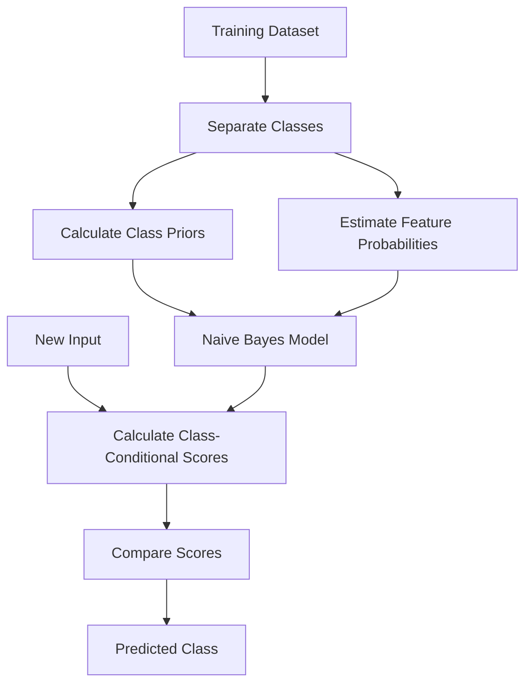
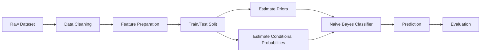
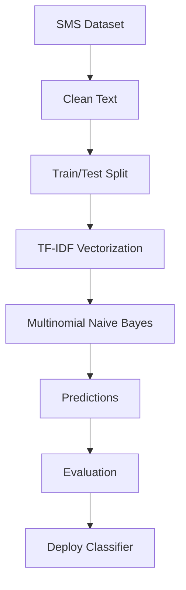
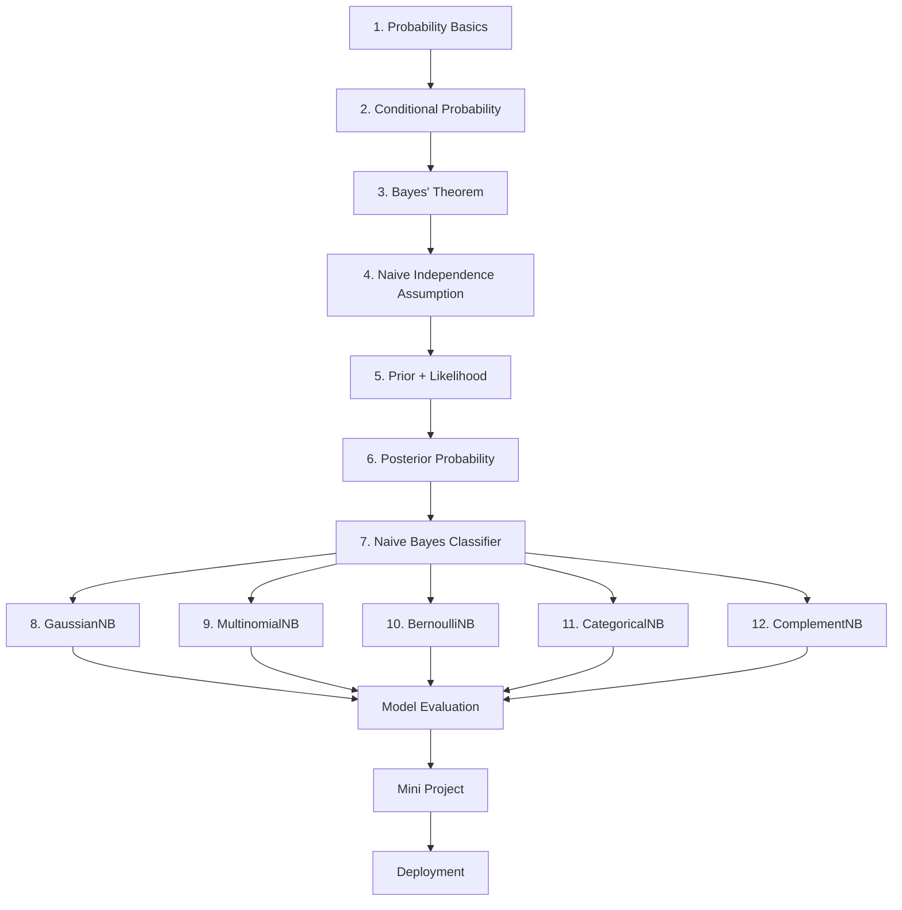

# 📘 Naive Bayes Classifier in Machine Learning

> A complete learning resource covering the intuition, mathematics, variants, implementation, evaluation, practical applications, common mistakes, interview questions, and a mini-project for Naive Bayes classification.

---

## 📑 Table of Contents

1. [🎯 Introduction](#1--introduction)
2. [🧠 What is Naive Bayes?](#2--what-is-naive-bayes)
3. [📐 Bayes' Theorem](#3--bayes-theorem)
4. [🤔 Why is it Called "Naive"?](#4--why-is-it-called-naive)
5. [🔤 Important Terminology](#5--important-terminology)
6. [⚙️ How Naive Bayes Works](#6--how-naive-bayes-works)
7. [🧮 Mathematical Formulation](#7--mathematical-formulation)
8. [📊 Types of Naive Bayes Classifiers](#8--types-of-naive-bayes-classifiers)
9. [🌳 Naive Bayes Workflow](#9--naive-bayes-workflow)
10. [📋 Categorical Example: Play Golf](#10--categorical-example-play-golf)
11. [🔢 Continuous Features and Gaussian Naive Bayes](#11--continuous-features-and-gaussian-naive-bayes)
12. [⚠️ Zero-Frequency Problem](#12--zero-frequency-problem)
13. [🔧 Laplace Smoothing](#13--laplace-smoothing)
14. [📝 Naive Bayes for Text Classification](#14--naive-bayes-for-text-classification)
15. [💻 Implementation with Scikit-Learn](#15--implementation-with-scikit-learn)
16. [📈 Model Evaluation](#16--model-evaluation)
17. [🎯 Decision Boundaries and Probability](#17--decision-boundaries-and-probability)
18. [🚀 Advanced Concepts](#18--advanced-concepts)
19. [🌍 Real-World Use Cases](#19--real-world-use-cases)
20. [✅ Advantages](#20--advantages)
21. [⚠️ Limitations](#21--limitations)
22. [🛠️ Best Practices](#22--best-practices)
23. [❌ Common Mistakes](#23--common-mistakes)
24. [🧪 Practical Mini-Project: SMS Spam Detection](#24--practical-mini-project-sms-spam-detection)
25. [🎤 Interview Questions and Points](#25--interview-questions-and-points)
26. [🆚 Naive Bayes vs Other Algorithms](#26--naive-bayes-vs-other-algorithms)
27. [📌 Important Formulas and Commands](#27--important-formulas-and-commands)
28. [⚡ Quick Revision](#28--quick-revision)
29. [🗺️ Visual Learning Roadmap](#29--visual-learning-roadmap)

---

# 1. 🎯 Introduction

Naive Bayes is a family of **supervised machine learning classification algorithms** based on **Bayes' theorem**.

It is especially useful when:

- The target variable is categorical.
- The dataset contains many features.
- Training speed matters.
- The feature space is high-dimensional.
- The problem involves text or word counts.
- A relatively small amount of training data is available.

Common applications include:

- 📧 Spam detection
- 📰 News/document classification
- 😊 Sentiment analysis
- 🩺 Medical text classification
- 🔎 Search and document categorization
- 🧑‍💻 Support-ticket classification
- 🛡️ Basic anomaly and fraud-related classification systems

Naive Bayes is called a **probabilistic classifier** because it estimates the probability of each possible class for a given observation.

---

# 2. 🧠 What is Naive Bayes?

Naive Bayes combines:

1. **Bayes' theorem**
2. **Conditional probability**
3. **A conditional independence assumption**

The classifier estimates:

> "Given these observed features, which class is most probable?"

For an observation with features:

```text
X = (x₁, x₂, x₃, ..., xₙ)
```

and possible class `y`, Naive Bayes calculates:

```text
P(y | x₁, x₂, ..., xₙ)
```

and chooses the class with the highest posterior probability.

### ⭐ Core Idea

```text
Features/Evidence
       ↓
Calculate probability for each class
       ↓
Compare posterior probabilities
       ↓
Choose class with maximum probability
```

---

# 3. 📐 Bayes' Theorem

Bayes' theorem describes how a probability is updated when new evidence becomes available.

genui{"learning_viz":{"type_id":"BAYES_THEOREM","initial_values":{"pA":0.2,"pBGivenA":0.85,"pBGivenNotA":0.1}}}

The standard formula is:

```text
P(A | B) = [P(B | A) × P(A)] / P(B)
```

Where:

| Term | Meaning |
|---|---|
| `P(A)` | Prior probability of A |
| `P(B)` | Probability of evidence B |
| `P(B \| A)` | Likelihood of B given A |
| `P(A \| B)` | Posterior probability of A given B |

### 🔍 Intuition

Suppose:

```text
A = Email is spam
B = Email contains the word "offer"
```

We want:

```text
P(Spam | "offer")
```

Bayes' theorem allows us to combine:

- How common spam is.
- How often "offer" appears in spam.
- How often "offer" appears overall.

---

# 4. 🤔 Why is it Called "Naive"?

The word **naive** comes from the strong assumption that features are **conditionally independent given the class**.

For features:

```text
X = (x₁, x₂, x₃)
```

Naive Bayes assumes:

```text
P(x₁, x₂, x₃ | y)
=
P(x₁ | y) × P(x₂ | y) × P(x₃ | y)
```

### Example

For spam detection, suppose the features are:

- `free`
- `offer`
- `winner`

The model treats them as conditionally independent once the class `Spam` is known.

In real-world language, words are often related. Therefore, the assumption is usually not literally true.

However, Naive Bayes can still perform very well, particularly for high-dimensional classification problems such as document and spam classification.

---

# 5. 🔤 Important Terminology

| Term | Meaning |
|---|---|
| **Prior Probability** | Probability of a class before observing features |
| **Likelihood** | Probability of observing features given a class |
| **Posterior Probability** | Probability of a class after observing features |
| **Evidence** | Overall probability of the observed features |
| **Class** | Target category to predict |
| **Feature** | Input variable used for prediction |
| **Conditional Probability** | Probability of an event given another event |
| **Conditional Independence** | Assumption that features are independent given the class |
| **MAP** | Maximum A Posteriori estimation/classification |
| **Smoothing** | Technique used to prevent zero probabilities |
| **Log Probability** | Logarithmic form of probability calculations used for numerical stability |

---

# 6. ⚙️ How Naive Bayes Works

Consider a classification problem with:

```text
Features:
x₁ = Feature 1
x₂ = Feature 2
x₃ = Feature 3

Classes:
Class A
Class B
```

The model calculates:

```text
P(Class A | x₁, x₂, x₃)
```

and:

```text
P(Class B | x₁, x₂, x₃)
```

Using the naive independence assumption:

```text
P(Class | X)
∝
P(Class)
× P(x₁ | Class)
× P(x₂ | Class)
× P(x₃ | Class)
```

Finally:

```text
Prediction = Class with maximum posterior probability
```

### 🔄 General Process



---

# 7. 🧮 Mathematical Formulation

For classes `y` and feature vector:

```text
X = (x₁, x₂, ..., xₙ)
```

Bayes' theorem gives:

```text
P(y | x₁, ..., xₙ)
=
[P(y) × P(x₁, ..., xₙ | y)]
/
P(x₁, ..., xₙ)
```

Naive Bayes assumes:

```text
P(x₁, ..., xₙ | y)
=
∏ P(xᵢ | y)
```

Therefore:

```text
P(y | x₁, ..., xₙ)
∝
P(y) × ∏ P(xᵢ | y)
```

The classifier predicts:

```text
ŷ = argmaxᵧ P(y) × ∏ P(xᵢ | y)
```

### 🧠 What Does `argmax` Mean?

`argmax` returns the value of `y` that produces the highest score.

Example:

```text
P(Class A | X) = 0.20
P(Class B | X) = 0.65
P(Class C | X) = 0.15
```

Prediction:

```text
Class B
```

---

# 8. 📊 Types of Naive Bayes Classifiers

Different Naive Bayes models use different assumptions about feature distributions.

| Algorithm | Typical Feature Type | Common Application |
|---|---|---|
| **GaussianNB** | Continuous numerical | Measurements, sensor data |
| **MultinomialNB** | Counts/frequencies | Text classification |
| **BernoulliNB** | Binary features | Word presence/absence |
| **CategoricalNB** | Categorical features | Discrete categorical data |
| **ComplementNB** | Count-based text data | Imbalanced text classification |

## 8.1 🔔 Gaussian Naive Bayes

Used for continuous numerical features.

Examples:

```text
Age
Height
Temperature
Blood pressure
Income
Sensor measurements
```

It assumes each feature follows a Gaussian/normal distribution within each class.

---

## 8.2 📝 Multinomial Naive Bayes

Commonly used for text classification.

Features may represent:

```text
Word counts
Term frequencies
TF-IDF-like non-negative features
```

Example:

```text
"free offer win"
```

can be converted into numerical features based on word occurrences.

---

## 8.3 🔘 Bernoulli Naive Bayes

Designed for binary/Boolean features.

Example:

| Word | Present? |
|---|---:|
| free | 1 |
| offer | 1 |
| meeting | 0 |
| discount | 1 |

---

## 8.4 🏷️ Categorical Naive Bayes

Used when features are categorical.

Example:

```text
Color = Red / Blue / Green
Weather = Sunny / Rainy / Cloudy
Device = Mobile / Desktop
```

---

## 8.5 🧾 Complement Naive Bayes

ComplementNB is designed for count-based text classification and can be useful when class distributions are imbalanced.

---

# 9. 🌳 Naive Bayes Workflow



### 🪜 Step-by-Step

1. Collect training data.
2. Identify features and target.
3. Clean/preprocess the data.
4. Select an appropriate Naive Bayes variant.
5. Estimate class priors.
6. Estimate feature likelihoods.
7. Apply smoothing if required.
8. Calculate posterior scores.
9. Predict the most probable class.
10. Evaluate the model.

---

# 10. 📋 Categorical Example: Play Golf

Suppose we have:

| Outlook | Temperature | Humidity | Wind | Play |
|---|---|---|---|---|
| Sunny | Hot | High | False | No |
| Sunny | Hot | High | True | No |
| Overcast | Hot | High | False | Yes |
| Rain | Mild | High | False | Yes |
| Rain | Cool | Normal | False | Yes |
| Rain | Cool | Normal | True | No |
| Overcast | Cool | Normal | True | Yes |
| Sunny | Mild | High | False | No |
| Sunny | Cool | Normal | False | Yes |
| Rain | Mild | Normal | False | Yes |
| Sunny | Mild | Normal | True | Yes |
| Overcast | Mild | High | True | Yes |
| Overcast | Hot | Normal | False | Yes |
| Rain | Mild | High | True | No |

Suppose the new input is:

```text
Outlook = Sunny
Temperature = Cool
Humidity = Normal
Wind = False
```

We compare:

```text
P(Yes | X)
```

against:

```text
P(No | X)
```

Using:

```text
P(Class | X)
∝
P(Class)
× P(Sunny | Class)
× P(Cool | Class)
× P(Normal | Class)
× P(False | Class)
```

The class with the larger score becomes the prediction.

### 💡 Key Learning

The model does not need to explicitly calculate every possible combination of all features.

Instead, it estimates smaller conditional probabilities and combines them.

---

# 11. 🔢 Continuous Features and Gaussian Naive Bayes

Categorical probabilities are not directly suitable for continuous values such as:

```text
Age = 27
Salary = 65000
Temperature = 31.5
```

Gaussian Naive Bayes assumes:

```text
xᵢ | y ~ Gaussian(μᵧᵢ, σ²ᵧᵢ)
```

The Gaussian probability density function is:

```text
P(xᵢ | y)
=
1 / sqrt(2πσ²)
×
exp(
  -(xᵢ - μ)² / (2σ²)
)
```

Where:

| Symbol | Meaning |
|---|---|
| `xᵢ` | Observed feature value |
| `μ` | Mean of feature for the class |
| `σ²` | Variance of feature for the class |
| `π` | Mathematical constant |
| `e` | Euler's number |

### 🧠 Intuition

For each class, GaussianNB estimates:

```text
Mean
+
Variance
```

for every numerical feature.

Then it calculates how likely the new value is under each class.

---

# 12. ⚠️ Zero-Frequency Problem

Suppose:

```text
P(feature = value | Class A) = 0
```

Then:

```text
P(Class A | X)
∝
P(Class A)
× ... × 0 × ...
```

Therefore:

```text
P(Class A | X) = 0
```

This can be problematic because a single unseen feature-category combination can eliminate an otherwise plausible class.

### 🚨 Example

Suppose:

```text
P("cryptocurrency" | Spam) = 0
```

because the word never appeared in the training spam examples.

Even if all other features strongly indicate spam, multiplication by zero produces:

```text
Spam Score = 0
```

---

# 13. 🔧 Laplace Smoothing

Laplace smoothing prevents zero probabilities.

A common formula is:

```text
P(xᵢ | y)
=
(count(xᵢ, y) + α)
/
(count(y) + α × K)
```

Where:

| Symbol | Meaning |
|---|---|
| `count(xᵢ, y)` | Count of feature value in class |
| `count(y)` | Total count for the class |
| `α` | Smoothing parameter |
| `K` | Number of possible feature values |

For standard Laplace smoothing:

```text
α = 1
```

### 🎯 Why Smoothing Helps

```text
Without smoothing:
unseen feature → probability 0 → entire product becomes 0

With smoothing:
unseen feature → small positive probability
```

---

# 14. 📝 Naive Bayes for Text Classification

Naive Bayes is historically and practically important for text classification.

A text classification pipeline may look like:


Example:

```text
"I won a free shopping voucher"
```

Possible classes:

```text
Spam
Not Spam
```

The text is converted into numerical features using methods such as:

- Bag of Words
- CountVectorizer
- TF-IDF

### 🔤 Bag of Words

Suppose the vocabulary is:

```text
free
offer
meeting
project
win
```

A sentence can be represented as:

```text
"free offer win"
```

Vector:

```text
[1, 1, 0, 0, 1]
```

---

# 15. 💻 Implementation with Scikit-Learn

## 15.1 Gaussian Naive Bayes

```python
from sklearn.model_selection import train_test_split
from sklearn.naive_bayes import GaussianNB
from sklearn.metrics import accuracy_score, classification_report

X = [
    [25, 50000],
    [30, 60000],
    [45, 90000],
    [50, 100000],
    [22, 40000],
    [35, 70000]
]

y = [
    0, 0, 1, 1, 0, 1
]

X_train, X_test, y_train, y_test = train_test_split(
    X,
    y,
    test_size=0.3,
    random_state=42,
    stratify=y
)

model = GaussianNB()

model.fit(X_train, y_train)

y_pred = model.predict(X_test)

print("Accuracy:", accuracy_score(y_test, y_pred))
print(classification_report(y_test, y_pred))
```

### Explanation

```text
GaussianNB()
    ↓
Learns mean and variance for features within each class
    ↓
Calculates Gaussian likelihoods
    ↓
Combines them with class priors
    ↓
Predicts the class
```

---

## 15.2 Multinomial Naive Bayes for Text

```python
from sklearn.feature_extraction.text import CountVectorizer
from sklearn.naive_bayes import MultinomialNB

texts = [
    "win free money now",
    "free offer click now",
    "meeting scheduled tomorrow",
    "project meeting at ten",
    "win a free prize",
    "please review the project"
]

labels = [
    "spam",
    "spam",
    "ham",
    "ham",
    "spam",
    "ham"
]

vectorizer = CountVectorizer()

X = vectorizer.fit_transform(texts)

model = MultinomialNB()

model.fit(X, labels)

new_message = ["free prize offer"]

X_new = vectorizer.transform(new_message)

prediction = model.predict(X_new)

print("Prediction:", prediction[0])
```

---

## 15.3 Using TF-IDF

```python
from sklearn.feature_extraction.text import TfidfVectorizer
from sklearn.naive_bayes import MultinomialNB

vectorizer = TfidfVectorizer(
    lowercase=True,
    stop_words="english"
)

X_train = vectorizer.fit_transform(texts)

model = MultinomialNB()

model.fit(X_train, labels)

new_text = ["free offer available"]

X_new = vectorizer.transform(new_text)

print(model.predict(X_new))
```

### ⚠️ Important

Always:

```python
vectorizer.fit_transform(X_train)
```

for training data, but:

```python
vectorizer.transform(X_test)
```

for test data.

Do not fit the vectorizer independently on test data.

---

# 16. 📈 Model Evaluation

Naive Bayes is a classifier, so common classification metrics include:

- Accuracy
- Precision
- Recall
- F1-score
- Confusion matrix
- ROC-AUC for appropriate binary/multiclass settings

## 16.1 Accuracy

```text
Accuracy
=
Correct Predictions / Total Predictions
```

## 16.2 Precision

```text
Precision
=
TP / (TP + FP)
```

Precision answers:

> Of the observations predicted as positive, how many were actually positive?

## 16.3 Recall

```text
Recall
=
TP / (TP + FN)
```

Recall answers:

> Of all actual positive observations, how many did the model identify?

## 16.4 F1-Score

```text
F1
=
2 × Precision × Recall
/
(Precision + Recall)
```

### Python

```python
from sklearn.metrics import (
    accuracy_score,
    precision_score,
    recall_score,
    f1_score,
    confusion_matrix
)

print("Accuracy:", accuracy_score(y_test, y_pred))
print("Precision:", precision_score(y_test, y_pred, average="weighted"))
print("Recall:", recall_score(y_test, y_pred, average="weighted"))
print("F1:", f1_score(y_test, y_pred, average="weighted"))

print("Confusion Matrix:")
print(confusion_matrix(y_test, y_pred))
```

---

# 17. 🎯 Decision Boundaries and Probability

Naive Bayes calculates class scores based on:

```text
Prior × Likelihoods
```

For multiple classes:

```text
Class A → Score A
Class B → Score B
Class C → Score C
```

The class with the largest score is selected.

### 🔢 Probability Output

Scikit-learn provides:

```python
model.predict_proba(X_test)
```

Example:

```text
[
    [0.10, 0.90],
    [0.75, 0.25],
    [0.40, 0.60]
]
```

These values represent the model's estimated class probabilities.

### ⚠️ Important

Naive Bayes can produce useful probability estimates, but its probability outputs should not automatically be interpreted as perfectly calibrated real-world probabilities. If calibrated probabilities are important, evaluate calibration separately.

---

# 18. 🚀 Advanced Concepts

## 18.1 🔢 Log Probabilities

Naive Bayes multiplies many probabilities:

```text
P(y) × P(x₁|y) × P(x₂|y) × ... × P(xₙ|y)
```

When there are many features, the product can become extremely small.

Instead, we can work with logarithms:

```text
log(P(y))
+
Σ log(P(xᵢ | y))
```

Because:

```text
log(a × b) = log(a) + log(b)
```

This improves numerical stability.

---

## 18.2 🧮 MAP Classification

Naive Bayes commonly uses the maximum a posteriori decision:

```text
ŷ
=
argmaxᵧ P(y | X)
```

Because the evidence term is the same for all candidate classes:

```text
ŷ
=
argmaxᵧ
P(y) × ∏ P(xᵢ | y)
```

---

## 18.3 ⚖️ Class Priors

If classes have different frequencies:

```text
P(Class A) ≠ P(Class B)
```

the prior probabilities affect the final prediction.

For example:

```text
P(ham) = 0.95
P(spam) = 0.05
```

The classifier starts with a strong prior toward ham.

This can be useful when class frequencies reflect the actual problem, but class imbalance should be evaluated carefully.

---

## 18.4 🧩 Feature Independence vs Feature Relevance

Naive Bayes does not require features to be completely unrelated in the raw dataset.

The important assumption is **conditional independence given the class**.

This distinction is frequently misunderstood.

---

## 18.5 🧠 Feature Selection

Removing irrelevant features can sometimes improve:

- Speed
- Memory usage
- Generalization
- Interpretability

Useful techniques include:

```text
SelectKBest
Mutual Information
Chi-Square
Variance Threshold
```

For text classification, chi-square feature selection can be useful for reducing a very large vocabulary.

---

## 18.6 🔄 Incremental Learning

Some Naive Bayes implementations support incremental learning through:

```python
partial_fit()
```

This can be useful when data arrives in batches.

Example:

```python
model.partial_fit(
    X_batch,
    y_batch,
    classes=[0, 1]
)
```

This is particularly useful for streaming or continuously arriving data when supported by the selected estimator.

---

## 18.7 🧪 Hyperparameter `alpha`

For models such as `MultinomialNB`, `alpha` controls smoothing.

Example:

```python
from sklearn.naive_bayes import MultinomialNB

model = MultinomialNB(alpha=1.0)
```

Common values to experiment with:

```text
0.01
0.1
0.5
1.0
2.0
```

Use validation data or cross-validation rather than choosing a value based only on test-set performance.

---

# 19. 🌍 Real-World Use Cases

| Domain | Example |
|---|---|
| 📧 Email | Spam/ham classification |
| 📰 News | Topic classification |
| 😊 NLP | Sentiment classification |
| 💬 Support | Ticket categorization |
| 🛡️ Security | Basic message classification |
| 🏥 Healthcare | Classification of medical text |
| 🔎 Search | Document categorization |
| 📱 Social Media | Content/topic classification |
| 🧾 Finance | Text-based document categorization |
| 🏢 Business | Automatic routing of incoming requests |

### Example: Customer Support

Incoming ticket:

```text
"My payment was deducted but the order failed."
```

Possible categories:

```text
Payment
Delivery
Account
Technical Issue
Refund
```

A Naive Bayes classifier can learn from historical tickets and assign a category automatically.

---

# 20. ✅ Advantages

| Advantage | Explanation |
|---|---|
| ⚡ Fast | Training and prediction are generally fast |
| 🧠 Simple | Easy to understand and implement |
| 📦 Lightweight | Often requires relatively little computation |
| 📚 Works with high-dimensional data | Particularly effective for sparse text data |
| 📝 Strong for text | Widely used for document classification |
| 📉 Small data requirement | Can work well with relatively limited training data |
| 🔄 Multiple variants | Different distributions support different feature types |
| 🚀 Fast inference | Suitable for many real-time classification scenarios |

---

# 21. ⚠️ Limitations

| Limitation | Explanation |
|---|---|
| ❗ Independence assumption | Features may not actually be conditionally independent |
| 🚫 Zero-frequency issue | Unseen combinations can produce zero probabilities without smoothing |
| 📊 Distribution assumptions | GaussianNB assumes Gaussian feature distributions |
| 🔗 Correlated features | Strong feature dependence can affect estimates |
| 🎯 Probability calibration | Predicted probabilities may require calibration for probability-sensitive applications |
| 🧠 Limited interactions | Does not naturally model complex feature interactions |
| 🖼️ Raw image data | Usually not the first choice for complex raw image classification |

### Important Point

Naive Bayes can still be a strong baseline even when its assumptions are simplified.

---

# 22. 🛠️ Best Practices

## ✅ 22.1 Choose the Correct Variant

```text
Continuous numerical data → GaussianNB
Count-based text → MultinomialNB
Binary features → BernoulliNB
Categorical features → CategoricalNB
Count-based imbalanced text → Consider ComplementNB
```

## ✅ 22.2 Prevent Data Leakage

Fit preprocessing only on training data:

```python
vectorizer.fit(X_train)
```

Then transform:

```python
X_train = vectorizer.transform(X_train)
X_test = vectorizer.transform(X_test)
```

Better yet, use a Pipeline.

---

## ✅ 22.3 Use Pipelines

```python
from sklearn.pipeline import Pipeline
from sklearn.feature_extraction.text import TfidfVectorizer
from sklearn.naive_bayes import MultinomialNB

pipeline = Pipeline([
    ("tfidf", TfidfVectorizer()),
    ("classifier", MultinomialNB())
])

pipeline.fit(X_train, y_train)

predictions = pipeline.predict(X_test)
```

Benefits:

- Prevents preprocessing leakage.
- Keeps transformations and model together.
- Makes deployment easier.
- Simplifies cross-validation.

---

## ✅ 22.4 Use Cross-Validation

```python
from sklearn.model_selection import cross_val_score

scores = cross_val_score(
    pipeline,
    texts,
    labels,
    cv=5,
    scoring="f1_macro"
)

print(scores)
print("Mean F1:", scores.mean())
```

---

## ✅ 22.5 Inspect Class Distribution

```python
from collections import Counter

print(Counter(labels))
```

A highly imbalanced dataset can make accuracy misleading.

---

# 23. ❌ Common Mistakes

## Mistake 1: Forgetting the Naive Assumption

Naive Bayes does not learn arbitrary feature interactions like a complex tree ensemble or neural network.

---

## Mistake 2: Using the Wrong Variant

Do not blindly use GaussianNB for sparse text count vectors.

For many text classification problems, start with:

```python
MultinomialNB()
```

or consider:

```python
ComplementNB()
```

---

## Mistake 3: Ignoring Zero Probabilities

For categorical/count-based models, smoothing can be important.

---

## Mistake 4: Data Leakage

Incorrect:

```python
vectorizer.fit_transform(all_text)
train_test_split(...)
```

This can allow information from the test set to influence the vocabulary/preprocessing.

Prefer:

```python
X_train, X_test, y_train, y_test = train_test_split(...)

vectorizer.fit(X_train)

X_train = vectorizer.transform(X_train)
X_test = vectorizer.transform(X_test)
```

Or use a Pipeline.

---

## Mistake 5: Judging the Model Only by Accuracy

For imbalanced classification, also examine:

```text
Precision
Recall
F1-score
Confusion Matrix
```

---

## Mistake 6: Treating `predict_proba()` as Perfect Confidence

A probability such as:

```text
0.95
```

does not necessarily mean that 95% of such predictions will be correct without calibration analysis.

---

# 24. 🧪 Practical Mini-Project: SMS Spam Detection

## 🎯 Project Objective

Build a machine learning system that classifies SMS messages as:

```text
Spam
Ham
```

### 🏗️ Architecture



---

## 📂 Dataset Structure

Example:

```text
label,text
ham,Hey are you coming today?
spam,Congratulations you won a free prize!
ham,Please call me when you reach home
spam,Claim your free reward now
```

---

## 🧹 Step 1: Load Dataset

```python
import pandas as pd

df = pd.read_csv("spam.csv")

print(df.head())
print(df["label"].value_counts())
```

---

## ✂️ Step 2: Split Data

```python
from sklearn.model_selection import train_test_split

X = df["text"]
y = df["label"]

X_train, X_test, y_train, y_test = train_test_split(
    X,
    y,
    test_size=0.2,
    random_state=42,
    stratify=y
)
```

---

## 🔤 Step 3: Build Pipeline

```python
from sklearn.pipeline import Pipeline
from sklearn.feature_extraction.text import TfidfVectorizer
from sklearn.naive_bayes import MultinomialNB

model = Pipeline([
    ("tfidf", TfidfVectorizer(
        lowercase=True,
        stop_words="english",
        ngram_range=(1, 2)
    )),
    ("nb", MultinomialNB(alpha=1.0))
])
```

---

## 🚂 Step 4: Train

```python
model.fit(X_train, y_train)
```

---

## 🔮 Step 5: Predict

```python
y_pred = model.predict(X_test)

print(y_pred[:10])
```

---

## 📊 Step 6: Evaluate

```python
from sklearn.metrics import (
    accuracy_score,
    classification_report,
    confusion_matrix
)

print("Accuracy:", accuracy_score(y_test, y_pred))

print("\nClassification Report:")
print(classification_report(y_test, y_pred))

print("\nConfusion Matrix:")
print(confusion_matrix(y_test, y_pred))
```

---

## 📨 Step 7: Test New Messages

```python
messages = [
    "Congratulations! You won a free reward",
    "Can you send me the project report?"
]

predictions = model.predict(messages)

for message, prediction in zip(messages, predictions):
    print(f"{message} --> {prediction}")
```

---

## 🚀 Project Enhancement Ideas

After building the baseline, add:

- 📊 Confusion matrix visualization
- 🔤 Word-frequency analysis
- 🧹 Advanced text preprocessing
- 🔠 Character n-grams
- ⚙️ Hyperparameter tuning
- 🔄 Cross-validation
- 📦 Model serialization using `joblib`
- 🌐 Flask/FastAPI deployment
- 🖥️ Streamlit user interface
- 📈 Probability calibration
- 🧪 Comparison with Logistic Regression and Linear SVM

---

# 25. 🎤 Interview Questions and Points

## Q1. What is Naive Bayes?

Naive Bayes is a supervised probabilistic classification algorithm based on Bayes' theorem with the assumption that features are conditionally independent given the class.

---

## Q2. Why is it called "naive"?

Because it makes a simplified conditional independence assumption between features.

---

## Q3. What is Bayes' theorem?

```text
P(A | B)
=
P(B | A)P(A) / P(B)
```

It describes how evidence updates a prior probability.

---

## Q4. What is the difference between prior and posterior?

| Prior | Posterior |
|---|---|
| Before observing evidence | After observing evidence |
| `P(Y)` | `P(Y \| X)` |

---

## Q5. What is likelihood?

Likelihood measures:

```text
P(X | Y)
```

It tells us how probable the observed features are under a particular class.

---

## Q6. What is the zero-frequency problem?

If a feature value never appeared in a class during training, its estimated conditional probability can become zero, making the entire Naive Bayes product zero.

---

## Q7. How do you solve zero-frequency?

Use smoothing, such as Laplace/additive smoothing.

---

## Q8. Which Naive Bayes algorithm is commonly used for text?

Common choices include:

```text
MultinomialNB
BernoulliNB
ComplementNB
```

The best choice depends on the feature representation and problem.

---

## Q9. Why is Naive Bayes fast?

Because the class-conditional feature distributions can be estimated independently, avoiding expensive optimization over a complex joint model.

---

## Q10. Does Naive Bayes require feature scaling?

Usually, no.

For example, GaussianNB can work directly with continuous features without requiring standard scaling in the same way that distance-based algorithms often do.

However, preprocessing should still be chosen based on the data representation and the selected model.

---

## Q11. Can Naive Bayes handle multiclass classification?

Yes.

It can calculate posterior scores for multiple classes and choose the class with the highest score.

---

## Q12. Is Naive Bayes a generative or discriminative model?

Naive Bayes is generally considered a **generative classifier** because it models class priors and class-conditional feature distributions.

---

## Q13. What is `alpha` in MultinomialNB?

`alpha` is a smoothing parameter used to control additive smoothing.

---

## Q14. When should you consider Naive Bayes?

Consider it when:

- You need a fast baseline.
- You have high-dimensional sparse data.
- You are working with text.
- You need a relatively simple probabilistic classifier.
- Training speed and simplicity are important.

---

# 26. 🆚 Naive Bayes vs Other Algorithms

| Feature | Naive Bayes | Logistic Regression | Decision Tree | KNN |
|---|---|---|---|---|
| Type | Generative | Discriminative | Tree-based | Instance-based |
| Training Speed | ⚡ Very Fast | Fast | Fast/Moderate | Minimal |
| Prediction Speed | ⚡ Fast | Fast | Fast | Can be slower |
| Text Classification | ⭐ Strong | ⭐ Strong | Moderate | Usually weaker |
| High-Dimensional Sparse Data | ⭐ Good | ⭐ Good | Less suitable | Often difficult |
| Feature Scaling | Usually not required | Usually not required | Not required | Often important |
| Nonlinear Interactions | Limited | Limited unless features transformed | Good | Can capture locally |
| Interpretability | Moderate | Good | High | Moderate |
| Small Dataset | Often useful | Often useful | Often useful | Can work |
| Probability Output | Yes | Yes | Yes | Yes |

### 💡 Practical Takeaway

Naive Bayes is often an excellent **baseline classifier**, especially for text and high-dimensional sparse features.

---

# 27. 📌 Important Formulas and Commands

## 📐 Core Formula

```text
P(Y | X)
∝
P(Y) × ∏ P(Xᵢ | Y)
```

## 🎯 Prediction Rule

```text
ŷ
=
argmaxᵧ
P(Y) × ∏ P(Xᵢ | Y)
```

## 🔧 Laplace Smoothing

```text
P(xᵢ | y)
=
(count(xᵢ, y) + α)
/
(count(y) + αK)
```

## 📈 Gaussian Density

```text
P(x | y)
=
1 / √(2πσ²)
×
exp(-(x - μ)² / (2σ²))
```

## 🐍 Common Scikit-Learn Classes

```python
from sklearn.naive_bayes import GaussianNB
from sklearn.naive_bayes import MultinomialNB
from sklearn.naive_bayes import BernoulliNB
from sklearn.naive_bayes import CategoricalNB
from sklearn.naive_bayes import ComplementNB
```

## 🧰 Useful Methods

```python
model.fit(X_train, y_train)
model.predict(X_test)
model.predict_proba(X_test)
model.predict_log_proba(X_test)
```

For supported estimators:

```python
model.partial_fit(...)
```

---

# 28. ⚡ Quick Revision

## 🧠 One-Line Definition

> **Naive Bayes is a probabilistic supervised classification algorithm that applies Bayes' theorem with a conditional independence assumption between features given the class.**

---

## 🔑 Key Points

- 📌 Based on Bayes' theorem.
- 📌 Used mainly for classification.
- 📌 Assumes conditional independence of features given the class.
- 📌 Uses prior and likelihood to estimate posterior probabilities.
- 📌 Can be very fast.
- 📌 Works particularly well for text classification.
- 📌 Different variants support different feature distributions.
- 📌 Smoothing handles zero-frequency problems.
- 📌 Log probabilities improve numerical stability.
- 📌 `predict_proba()` provides model probability estimates.
- 📌 Pipeline-based preprocessing helps prevent data leakage.

---

## 📊 Variant Cheat Sheet

| Data | Recommended Starting Point |
|---|---|
| Continuous numerical | `GaussianNB` |
| Word counts | `MultinomialNB` |
| Binary presence/absence | `BernoulliNB` |
| Categorical values | `CategoricalNB` |
| Imbalanced count-based text | `ComplementNB` |

---

## 🧾 Essential Commands

```python
# Gaussian
from sklearn.naive_bayes import GaussianNB
model = GaussianNB()

# Multinomial
from sklearn.naive_bayes import MultinomialNB
model = MultinomialNB()

# Bernoulli
from sklearn.naive_bayes import BernoulliNB
model = BernoulliNB()

# Categorical
from sklearn.naive_bayes import CategoricalNB
model = CategoricalNB()

# Complement
from sklearn.naive_bayes import ComplementNB
model = ComplementNB()
```

---

## 🚨 Top 10 Things to Remember

```text
1. Bayes' theorem → probability update
2. Naive → conditional independence assumption
3. Prior → P(Y)
4. Likelihood → P(X|Y)
5. Posterior → P(Y|X)
6. Prediction → maximum posterior score
7. Zero probability → use smoothing
8. Text → Multinomial/Bernoulli/Complement NB
9. Continuous features → Gaussian NB
10. Evaluation → don't rely only on accuracy
```

---

# 29. 🗺️ Visual Learning Roadmap



---

# 🎓 Final Summary

Naive Bayes provides a simple but powerful way to perform probabilistic classification.

The complete mental model is:

```text
                BAYES' THEOREM
                      │
                      ▼
             ┌─────────────────┐
             │  Prior P(Y)     │
             └────────┬────────┘
                      │
                      ▼
             ┌─────────────────┐
             │ Likelihood P(X|Y)│
             └────────┬────────┘
                      │
                      ▼
       Conditional Independence Assumption
                      │
                      ▼
          ┌─────────────────────────┐
          │ P(Y) × ∏ P(Xᵢ | Y)      │
          └────────────┬────────────┘
                       │
                       ▼
             Compare Class Scores
                       │
                       ▼
                Predicted Class
```

### 🚀 Learning Path

```text
Probability
     ↓
Conditional Probability
     ↓
Bayes' Theorem
     ↓
Naive Independence
     ↓
Categorical Naive Bayes
     ↓
Gaussian Naive Bayes
     ↓
Multinomial Naive Bayes
     ↓
Text Classification
     ↓
Smoothing
     ↓
Evaluation
     ↓
Hyperparameter Tuning
     ↓
Mini Project
     ↓
Deployment
```

> 💡 **Core idea to remember:** Naive Bayes estimates how probable each class is given the observed features, using Bayes' theorem and a simplifying conditional-independence assumption.
