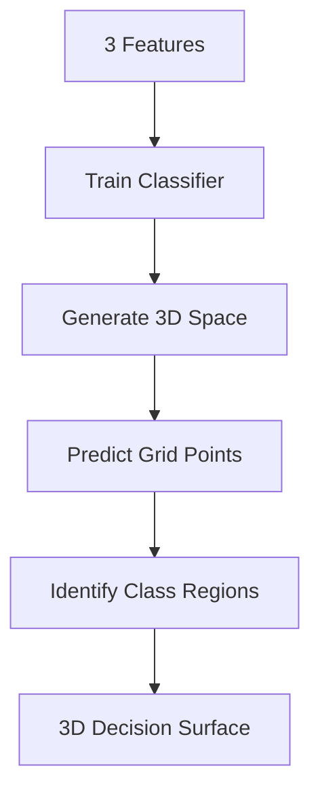
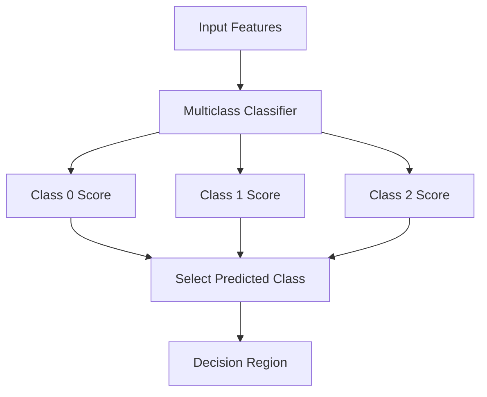
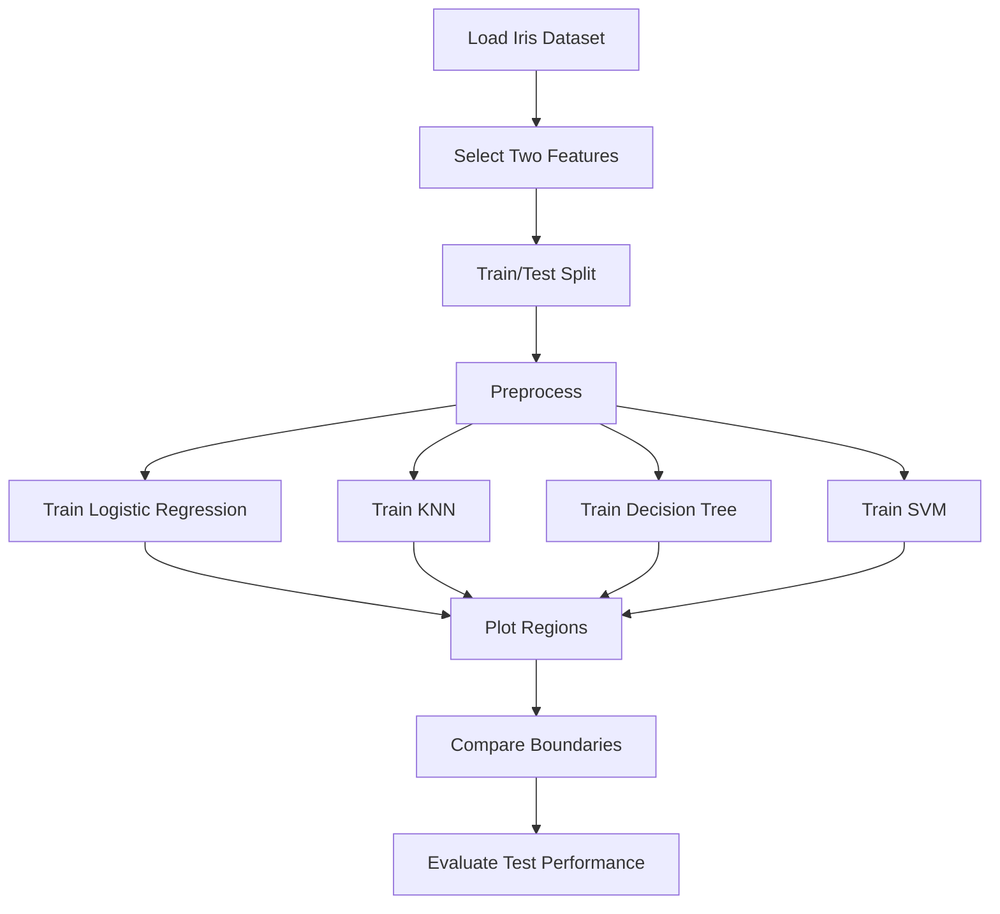
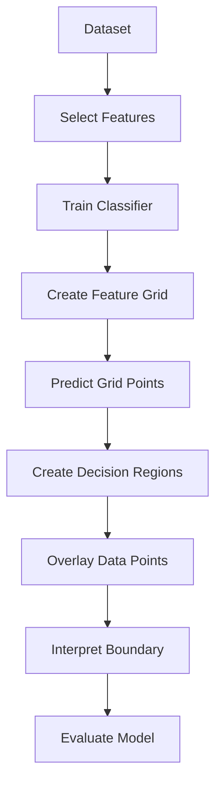

# 📊 Decision Surface & MLxtend — Machine Learning Notes

## 📚 Table of Contents
1. [🎯 Introduction](#1--introduction)
2. [🧭 Decision Surface](#2--decision-surface)
3. [🔀 Decision Boundary vs Decision Surface](#3--decision-boundary-vs-decision-surface)
4. [📐 2D, 3D and High-Dimensional Surfaces](#4--2d-3d-and-high-dimensional-surfaces)
5. [🧠 How Decision Regions Are Generated](#5--how-decision-regions-are-generated)
6. [🌳 Decision Surfaces of Common Algorithms](#6--decision-surfaces-of-common-algorithms)
7. [🧰 MLxtend](#7--mlxtend)
8. [📦 Installation](#8--installation)
9. [🗺️ plot_decision_regions()](#9--plot_decision_regions)
10. [🧪 Complete Example](#10--complete-example)
11. [📊 Decision Surface with KNN](#11--decision-surface-with-knn)
12. [🌳 Decision Surface with Decision Tree](#12--decision-surface-with-decision-tree)
13. [📈 Decision Surface with Logistic Regression](#13--decision-surface-with-logistic-regression)
14. [🧮 Decision Surface with SVM](#14--decision-surface-with-svm)
15. [🧩 Multiclass Decision Regions](#15--multiclass-decision-regions)
16. [⚠️ Limitations and Common Mistakes](#16--limitations-and-common-mistakes)
17. [🚀 Advanced Concepts](#17--advanced-concepts)
18. [🛠️ Mini Project](#18--mini-project)
19. [💼 Interview Questions](#19--interview-questions)
20. [🌟 Best Practices](#20--best-practices)
21. [⚡ Quick Revision](#21--quick-revision)

---

# 1. 🎯 Introduction

A **decision surface** describes how a machine-learning classifier divides feature space into regions corresponding to different predicted classes.

For two features, it can be visualized on a 2D graph. For three features, it can be a 3D surface. With more features, the complete surface is mathematically defined but cannot usually be visualized directly.

### 🔑 Core workflow

```text
Training data
     ↓
Train classifier
     ↓
Create a mesh/grid over feature space
     ↓
Predict every grid point
     ↓
Color points by predicted class
     ↓
Visualize decision regions
```

---

# 2. 🧭 Decision Surface

A classifier can be represented as:

$$
f(x)=\hat{y}
$$

where `x` is an input feature vector and `ŷ` is the predicted class.

For a binary classifier, the boundary between two classes is often represented by a decision function equal to a threshold, commonly:

$$
f(x)=0
$$

One side belongs to one class and the other side belongs to another class.

### 🏷️ Important Terms

| Term | Meaning |
|---|---|
| Decision boundary | Boundary separating predicted classes |
| Decision surface | General geometric separating structure |
| Decision region | Area assigned to a particular class |
| Decision function | Model-specific score used to determine a class |

---

# 3. 🔀 Decision Boundary vs Decision Surface

The terminology depends on dimensionality.

| Features | Typical visualization |
|---:|---|
| 1 | Point/interval boundary |
| 2 | Line or curve |
| 3 | Surface |
| >3 | Higher-dimensional surface |

In many ML discussions, **decision boundary** and **decision surface** are used interchangeably.

### Example

```text
Class A        |        Class B
               |
               |
---------------|----------------
               |
               |
```

The separator is the decision boundary.

---

# 4. 📐 2D, 3D and High-Dimensional Surfaces

## 4.1 🟢 Two Features

Suppose:

```text
X1 = Petal Length
X2 = Petal Width
```

A classifier can partition the plane into class regions.

```text
          Feature 2
              ↑
       B      |      B
          \   |   /
-----------\--+--/----------→ Feature 1
             \|/
       A      |      A
```

## 4.2 🔵 Three Features

With three features, the separator may be a 3D surface.



## 4.3 🌌 More Than Three Features

A 2D plot only shows selected features or a projection/slice.

Possible approaches:

- Select two important features
- PCA
- Other dimensionality reduction
- Feature-space slices
- Model interpretation methods

> ⚠️ A 2D decision-region plot is not the complete visualization of a model trained on many features.

---

# 5. 🧠 How Decision Regions Are Generated

A common visualization method uses a **mesh grid**.


### 🕸️ Mesh Grid Example

```python
import numpy as np

xx1, xx2 = np.meshgrid(
    np.arange(x1_min, x1_max, 0.02),
    np.arange(x2_min, x2_max, 0.02)
)

grid = np.c_[xx1.ravel(), xx2.ravel()]
predictions = model.predict(grid)
```

The predictions are reshaped back to the grid and visualized using a contour or filled-contour plot.

---

# 6. 🌳 Decision Surfaces of Common Algorithms

| Algorithm | Typical shape |
|---|---|
| Logistic Regression | Linear for standard binary formulation |
| Linear SVM | Linear |
| KNN | Local and nonlinear |
| Decision Tree | Axis-aligned regions |
| Random Forest | Complex piecewise regions |
| Kernel SVM | Nonlinear |
| Neural Network | Highly flexible nonlinear surface |

### 🧩 Intuition

```text
Linear Model
-------------------------
      Class 1
-------------------------
      Class 0
```

```text
KNN
Class A   Class A
   \       /
    \  B  /
     \   /
 A     \     B
```

```text
Decision Tree
+---------+---------+
| Class A | Class B |
+---------+---------+
| Class C | Class B |
+---------+---------+
```

---

# 7. 🧰 MLxtend

**MLxtend** means **Machine Learning Extensions**.

It is a Python library containing utilities for machine learning, including visualization, feature-selection tools, frequent-pattern methods, evaluation helpers, and other extensions.

A particularly useful visualization utility is:

```python
plot_decision_regions()
```

It simplifies decision-region plotting so you do not need to manually build the mesh grid and contour visualization.

---

# 8. 📦 Installation

Install:

```bash
pip install mlxtend
```

Upgrade:

```bash
pip install --upgrade mlxtend
```

Import:

```python
from mlxtend.plotting import plot_decision_regions
```

Check:

```python
import mlxtend
print(mlxtend.__version__)
```

---

# 9. 🗺️ plot_decision_regions()

Basic syntax:

```python
from mlxtend.plotting import plot_decision_regions

plot_decision_regions(
    X=X,
    y=y,
    clf=model,
    legend=2
)
```

### Important Parameters

| Parameter | Purpose |
|---|---|
| `X` | Feature matrix |
| `y` | Target labels |
| `clf` | Fitted classifier |
| `feature_index` | Features used for visualization |
| `filler_feature_values` | Values for unused features |
| `filler_feature_ranges` | Ranges for unused features |
| `X_highlight` | Points to highlight |
| `res` | Mesh resolution |
| `legend` | Legend location |
| `zoom_factor` | Plot zoom |

### ⚠️ Key Requirement

Decision-region visualization is most straightforward when the classifier input can be represented using two features. For higher-dimensional models, use `feature_index` and provide appropriate fixed values for the remaining features.

---

# 10. 🧪 Complete Example

We will use Iris and visualize two features.

## 10.1 📦 Imports

```python
import matplotlib.pyplot as plt

from sklearn.datasets import load_iris
from sklearn.model_selection import train_test_split
from sklearn.preprocessing import StandardScaler
from sklearn.neighbors import KNeighborsClassifier

from mlxtend.plotting import plot_decision_regions
```

## 10.2 🌸 Dataset

```python
iris = load_iris()

X = iris.data[:, [2, 3]]
y = iris.target
```

These are:

```text
Petal Length
Petal Width
```

## 10.3 ✂️ Split

```python
X_train, X_test, y_train, y_test = train_test_split(
    X,
    y,
    test_size=0.3,
    random_state=42,
    stratify=y
)
```

## 10.4 ⚖️ Scale

```python
scaler = StandardScaler()

X_train = scaler.fit_transform(X_train)
X_test = scaler.transform(X_test)
```

## 10.5 🤖 Train KNN

```python
knn = KNeighborsClassifier(n_neighbors=5)

knn.fit(X_train, y_train)
```

## 10.6 🎨 Plot

```python
plot_decision_regions(
    X_train,
    y_train,
    clf=knn,
    legend=2
)

plt.xlabel("Petal Length")
plt.ylabel("Petal Width")
plt.title("KNN Decision Surface")
plt.show()
```

---

# 11. 📊 Decision Surface with KNN

KNN produces local decision regions.

```python
from sklearn.neighbors import KNeighborsClassifier

knn = KNeighborsClassifier(n_neighbors=5)
knn.fit(X_train, y_train)

plot_decision_regions(
    X_train,
    y_train,
    clf=knn,
    legend=2
)

plt.title("KNN Decision Regions")
plt.show()
```

### 🎛️ Effect of K

```python
for k in [1, 5, 15]:
    knn = KNeighborsClassifier(n_neighbors=k)
    knn.fit(X_train, y_train)

    plot_decision_regions(
        X_train,
        y_train,
        clf=knn,
        legend=2
    )

    plt.title(f"KNN Decision Regions: K={k}")
    plt.show()
```

| K | Expected behavior |
|---:|---|
| 1 | Very irregular, high variance |
| 5 | More balanced |
| 15 | Smoother, higher bias |

---

# 12. 🌳 Decision Surface with Decision Tree

```python
from sklearn.tree import DecisionTreeClassifier

tree = DecisionTreeClassifier(
    max_depth=3,
    random_state=42
)

tree.fit(X_train, y_train)

plot_decision_regions(
    X_train,
    y_train,
    clf=tree,
    legend=2
)

plt.title("Decision Tree Decision Regions")
plt.show()
```

Decision trees often create axis-aligned regions because their splits are based on feature thresholds.

---

# 13. 📈 Decision Surface with Logistic Regression

```python
from sklearn.linear_model import LogisticRegression

lr = LogisticRegression(max_iter=1000)

lr.fit(X_train, y_train)

plot_decision_regions(
    X_train,
    y_train,
    clf=lr,
    legend=2
)

plt.title("Logistic Regression Decision Regions")
plt.show()
```

For a binary linearly modeled problem, the decision boundary is linear.

---

# 14. 🧮 Decision Surface with SVM

```python
from sklearn.svm import SVC

svm = SVC(
    kernel="rbf",
    C=1.0,
    gamma="scale"
)

svm.fit(X_train, y_train)

plot_decision_regions(
    X_train,
    y_train,
    clf=svm,
    legend=2
)

plt.title("SVM Decision Regions")
plt.show()
```

### Kernel Comparison

| Kernel | Boundary |
|---|---|
| Linear | Linear |
| Polynomial | Nonlinear |
| RBF | Flexible nonlinear |
| Sigmoid | Nonlinear |

---

# 15. 🧩 Multiclass Decision Regions

For:

```text
Class 0
Class 1
Class 2
```

the feature space can contain three or more decision regions.



The exact multiclass strategy depends on the estimator.

---

# 16. ⚠️ Limitations and Common Mistakes

## 16.1 🌌 High-Dimensional Models

A 2D plot cannot show all dimensions.

## 16.2 ⚖️ Inconsistent Scaling

If the model was trained on scaled data, visualization should use the same preprocessing.

## 16.3 🧪 Overinterpreting the Plot

A beautiful boundary does not imply good generalization.

Use:

- Accuracy
- Precision
- Recall
- F1
- Confusion matrix
- Cross-validation
- Test-set evaluation

## 16.4 ❌ Test-Set Tuning

Do not repeatedly modify the model based on test-set performance.

Correct workflow:

```text
Training data
    ↓
Cross-validation
    ↓
Model selection
    ↓
Final test
```

## 16.5 ❌ Ignoring Feature Meaning

A boundary is meaningful only in the context of the features used to create it.

---

# 17. 🚀 Advanced Concepts

## 17.1 🧠 Decision Function

Some classifiers expose a decision score:

```python
scores = model.decision_function(X_test)
```

Some provide probabilities:

```python
probabilities = model.predict_proba(X_test)
```

| Method | Meaning |
|---|---|
| `predict()` | Final class |
| `decision_function()` | Model-specific decision score |
| `predict_proba()` | Estimated class probabilities when supported |

## 17.2 🎯 Decision Regions vs Probability

A decision-region plot answers:

```text
Which class is predicted?
```

A probability plot can answer:

```text
How strongly does the model favor each class?
```

## 17.3 🌀 Nonlinear Boundaries

Models such as KNN, kernel SVM, trees, ensembles, and neural networks can generate complex nonlinear regions.

## 17.4 🔬 Mesh Resolution

Fine resolution:

```python
res=0.01
```

gives more visual detail but may require more computation.

Coarse resolution:

```python
res=0.1
```

is faster but may hide small boundary details.

---

# 18. 🛠️ Mini Project

## 🎯 Compare Four Classifiers

Compare:

1. Logistic Regression
2. KNN
3. Decision Tree
4. SVM



### 💻 Implementation

```python
import matplotlib.pyplot as plt

from sklearn.datasets import load_iris
from sklearn.model_selection import train_test_split
from sklearn.preprocessing import StandardScaler
from sklearn.pipeline import make_pipeline

from sklearn.linear_model import LogisticRegression
from sklearn.neighbors import KNeighborsClassifier
from sklearn.tree import DecisionTreeClassifier
from sklearn.svm import SVC

from mlxtend.plotting import plot_decision_regions

iris = load_iris()

X = iris.data[:, [2, 3]]
y = iris.target

X_train, X_test, y_train, y_test = train_test_split(
    X,
    y,
    test_size=0.3,
    random_state=42,
    stratify=y
)

models = {
    "Logistic Regression": make_pipeline(
        StandardScaler(),
        LogisticRegression(max_iter=1000)
    ),
    "KNN": make_pipeline(
        StandardScaler(),
        KNeighborsClassifier(n_neighbors=5)
    ),
    "Decision Tree": DecisionTreeClassifier(
        max_depth=3,
        random_state=42
    ),
    "SVM": make_pipeline(
        StandardScaler(),
        SVC(kernel="rbf")
    )
}

for name, model in models.items():

    model.fit(X_train, y_train)

    plot_decision_regions(
        X_train,
        y_train,
        clf=model,
        legend=2
    )

    plt.xlabel("Petal Length")
    plt.ylabel("Petal Width")
    plt.title(name)
    plt.show()
```

### 📊 Evaluate

```python
from sklearn.metrics import accuracy_score

for name, model in models.items():
    y_pred = model.predict(X_test)
    score = accuracy_score(y_test, y_pred)

    print(f"{name}: {score:.4f}")
```

---

# 19. 💼 Interview Questions

### Q1. What is a decision boundary?

A boundary in feature space separating regions assigned to different predicted classes.

### Q2. What is a decision surface?

A general geometric representation of a classifier's separating structure.

### Q3. Why use a mesh grid?

To create many points over the feature space and predict the class at each point for visualization.

### Q4. What is MLxtend?

A Python machine-learning extension library containing utilities for visualization, feature selection, pattern mining, and model analysis.

### Q5. What does `plot_decision_regions()` do?

It visualizes classifier prediction regions in a feature space that can be represented by the supplied features.

### Q6. Can a 100-feature model have a 2D decision-region plot?

Yes, a 2D view can be produced by selecting two features and fixing/handling the remaining features, but it does not show the complete 100-dimensional surface.

### Q7. Which algorithms can create nonlinear decision surfaces?

Examples include KNN, kernel SVM, decision trees, random forests, and neural networks.

### Q8. Does a decision-region plot replace model evaluation?

No. It is a visualization tool and should be combined with appropriate validation and test metrics.

---

# 20. 🌟 Best Practices

1. **Use consistent preprocessing** during training and visualization.
2. **Select meaningful features** for the plot.
3. **Keep the test set for final evaluation.**
4. **Compare several classifiers** to understand how model assumptions affect boundaries.
5. **Use cross-validation** for model selection.
6. **Do not confuse visual complexity with model quality.**
7. **Remember that 2D plots are only views of high-dimensional models.**
8. **Use pipelines** to avoid inconsistent preprocessing.

Example:

```python
from sklearn.pipeline import make_pipeline

model = make_pipeline(
    StandardScaler(),
    KNeighborsClassifier(n_neighbors=5)
)
```

---

# 21. ⚡ Quick Revision

## 🧠 One-Line Definitions

| Concept | Definition |
|---|---|
| Decision Boundary | Boundary separating predicted classes |
| Decision Surface | Geometric classifier boundary in feature space |
| Decision Region | Area assigned to a class |
| Mesh Grid | Dense feature-space grid for visualization |
| MLxtend | Python ML extensions library |
| `plot_decision_regions()` | Utility for plotting classifier decision regions |

## 💻 Important Commands

Install:

```bash
pip install mlxtend
```

Import:

```python
from mlxtend.plotting import plot_decision_regions
```

Plot:

```python
plot_decision_regions(
    X,
    y,
    clf=model,
    legend=2
)
```

Highlight:

```python
plot_decision_regions(
    X_train,
    y_train,
    clf=model,
    X_highlight=X_test
)
```

## 🗺️ Visual Roadmap



---

# 🎯 Final Takeaways

1. **A decision surface describes how a classifier partitions feature space.**
2. **In 2D it commonly appears as a line or curve; in 3D it can be a surface.**
3. **Higher-dimensional surfaces cannot be fully visualized in a normal 2D chart.**
4. **Mesh grids allow us to sample the feature space and visualize predictions.**
5. **MLxtend provides convenient machine-learning visualization utilities.**
6. **`plot_decision_regions()` is especially useful for understanding classifiers visually.**
7. **KNN, trees, SVMs, and linear models can produce very different decision regions.**
8. **A decision-region plot is an interpretability aid, not a substitute for evaluation.**
9. **Consistent scaling and preprocessing are essential.**
10. **The most useful question to ask from a decision-region plot is:**

> **"What class would this model predict at different locations in feature space?"**
