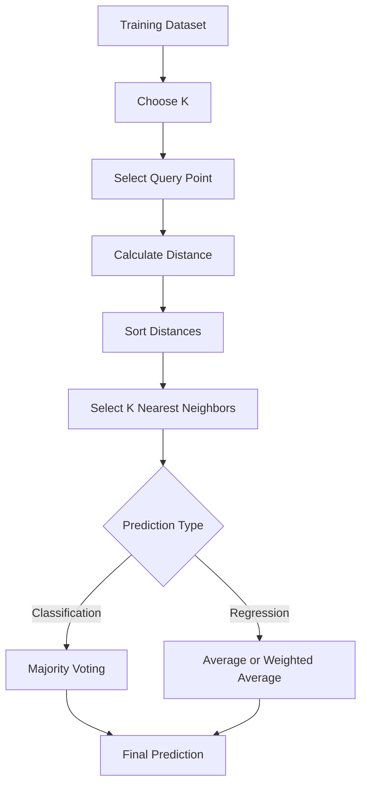
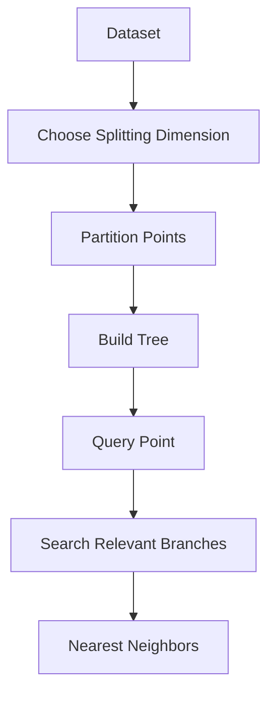
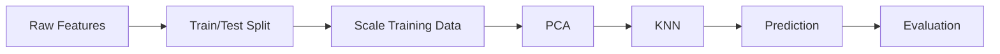
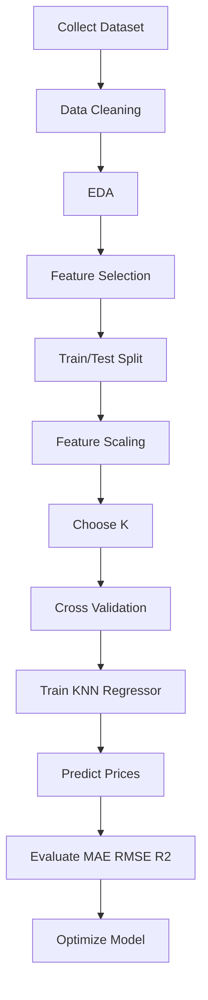
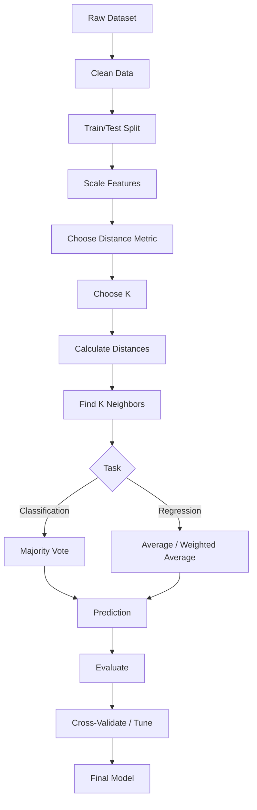

# 🤖 K-Nearest Neighbors (KNN) in Machine Learning

> **K-Nearest Neighbors (KNN)** is a simple, intuitive, non-parametric, instance-based machine learning algorithm used mainly for **classification** and **regression**. It predicts a new observation from the labels or values of the most similar observations in the training data.

---

## 📚 Table of Contents

1. [🎯 Introduction](#1--introduction)
2. [🧠 What is KNN?](#2--what-is-knn)
3. [📌 Important Terminology](#3--important-terminology)
4. [⚙️ How KNN Works](#4--how-knn-works)
5. [🔢 Mathematical Foundation](#5--mathematical-foundation)
6. [📏 Distance Metrics](#6--distance-metrics)
7. [🏷️ KNN for Classification](#7--knn-for-classification)
8. [📈 KNN for Regression](#8--knn-for-regression)
9. [🎛️ Choosing the Value of K](#9--choosing-the-value-of-k)
10. [⚖️ Feature Scaling and Normalization](#10--feature-scaling-and-normalization)
11. [🧪 Complete Classification Example](#11--complete-classification-example)
12. [📊 Model Evaluation](#12--model-evaluation)
13. [🔧 Important Hyperparameters](#13--important-hyperparameters)
14. [🌍 Real-World Use Cases](#14--real-world-use-cases)
15. [✅ Advantages](#15--advantages)
16. [❌ Limitations](#16--limitations)
17. [⚠️ Common Mistakes](#17--common-mistakes)
18. [🚀 Advanced Concepts](#18--advanced-concepts)
19. [🧩 KNN vs Other Algorithms](#19--knn-vs-other-algorithms)
20. [💼 Interview Questions](#20--interview-questions)
21. [🛠️ Practical Mini Project](#21--practical-mini-project)
22. [🌟 Best Practices](#22--best-practices)
23. [⚡ Quick Revision](#23--quick-revision)

---

# 1. 🎯 Introduction

Machine Learning algorithms learn patterns from data and use those patterns to make predictions.

KNN follows a very intuitive idea:

> **"Similar data points are likely to have similar outcomes."**

For example, suppose we have customer data containing:

- Age
- Annual income
- Spending score
- Customer segment

When a new customer arrives, KNN can look for the existing customers most similar to that customer and use their outcomes to make a prediction.

### 🔑 Core Idea

```text
New Data Point
      ↓
Calculate distance to training points
      ↓
Find K closest points
      ↓
Use their labels/values
      ↓
Make prediction
```

---

# 2. 🧠 What is KNN?

**K-Nearest Neighbors (KNN)** is a supervised learning algorithm that predicts an unknown data point by examining its nearest training examples.

KNN can solve:

| Task | Prediction Method |
|---|---|
| Classification | Majority vote |
| Regression | Average/weighted average |
| Binary Classification | Most common class |
| Multiclass Classification | Most common class among neighbors |

### 💡 Example

Suppose we want to classify a fruit as **Apple** or **Orange**.

If `K = 5` and the nearest neighbors are:

| Neighbor | Class |
|---|---|
| 1 | Apple |
| 2 | Apple |
| 3 | Orange |
| 4 | Apple |
| 5 | Orange |

Votes:

- Apple → 3
- Orange → 2

Prediction:

```text
Apple
```

### 🐢 Why is KNN called a Lazy Learner?

KNN does not build a traditional parameterized model during training. It primarily stores the training examples and performs neighbor searches when predictions are requested.

Therefore, KNN is commonly described as:

- Lazy learner
- Instance-based learner
- Memory-based learner
- Non-parametric algorithm

---

# 3. 📌 Important Terminology

| Term | Meaning |
|---|---|
| K | Number of neighbors considered |
| Neighbor | A nearby training data point |
| Distance | Measure of similarity/dissimilarity |
| Feature | Input variable |
| Label | Target/output class |
| Majority Voting | Most frequent class |
| Non-parametric | No fixed functional form is assumed |
| Instance-based | Predictions depend directly on stored examples |
| Training Set | Known observations used by KNN |
| Query Point | New point for which prediction is required |

### 🔍 Small Example

Suppose:

```text
K = 3
```

For a new point, KNN finds:

```text
Neighbor 1 → Class A
Neighbor 2 → Class A
Neighbor 3 → Class B
```

Majority:

```text
Class A
```

Prediction:

```text
Class A
```

---

# 4. ⚙️ How KNN Works

KNN prediction can be understood as a sequence of steps.

## 4.1 🔄 Basic Workflow



## 4.2 🪜 Step-by-Step Process

### Step 1: Choose K

Select the number of neighbors.

Example:

```text
K = 5
```

### Step 2: Calculate Distances

Calculate the distance between the query point and every training point.

### Step 3: Sort Distances

Arrange points from smallest distance to largest distance.

### Step 4: Select K Nearest Points

Select the first `K` observations.

### Step 5: Make Prediction

For classification:

```text
Majority class → Prediction
```

For regression:

```text
Average target value → Prediction
```

---

# 5. 🔢 Mathematical Foundation

Suppose we have:

```text
X = Training features
x = Query point
```

For each training observation, calculate:

```text
distance(x, Xi)
```

Then select the `K` observations with the smallest distances.

---

## 5.1 📐 Euclidean Distance

For two points:

```text
A = (x1, x2)
B = (y1, y2)
```

Euclidean distance is:

$$
d(A,B)=\sqrt{(x_1-y_1)^2+(x_2-y_2)^2}
$$

For `n` dimensions:

$$
d(x,y)=\sqrt{\sum_{i=1}^{n}(x_i-y_i)^2}
$$

### Example

Suppose:

```text
A = (2, 3)
B = (5, 7)
```

Then:

```text
d = √[(2-5)² + (3-7)²]

  = √[9 + 16]

  = √25

  = 5
```

---

## 5.2 🧮 Classification Formula

Let:

```text
N_k(x) = K nearest neighbors of x
```

The predicted class can be represented as:

$$
\hat{y} = mode\{y_i : x_i \in N_k(x)\}
$$

In simple words:

> Select the class occurring most frequently among the K nearest neighbors.

---

## 5.3 📊 Regression Formula

Basic KNN regression:

$$
\hat{y}=\frac{1}{K}\sum_{i=1}^{K}y_i
$$

Example:

```text
K = 3

Neighbor values:
20
25
30
```

Prediction:

```text
(20 + 25 + 30) / 3
= 25
```

---

# 6. 📏 Distance Metrics

Distance is central to KNN.

Different datasets may require different distance metrics.

| Metric | Formula / Idea | Typical Use |
|---|---|---|
| Euclidean | Straight-line distance | Continuous numerical data |
| Manhattan | Sum of absolute differences | Grid-like/high-dimensional situations |
| Minkowski | Generalized distance | Flexible distance selection |
| Chebyshev | Maximum coordinate difference | Applications based on largest deviation |
| Hamming | Number of differing positions | Binary/categorical encoded data |
| Cosine | Angle between vectors | Text/vector similarity |

---

## 6.1 📐 Euclidean Distance

$$
d(x,y)=\sqrt{\sum_i(x_i-y_i)^2}
$$

Good default for many continuous numerical datasets after appropriate scaling.

---

## 6.2 🚕 Manhattan Distance

$$
d(x,y)=\sum_i|x_i-y_i|
$$

Example:

```text
A = (2, 3)
B = (5, 7)

Distance = |2-5| + |3-7|
         = 3 + 4
         = 7
```

---

## 6.3 🧮 Minkowski Distance

$$
d(x,y)=
\left(
\sum_i |x_i-y_i|^p
\right)^{1/p}
$$

Special cases:

| p | Metric |
|---:|---|
| 1 | Manhattan |
| 2 | Euclidean |
| Large p | Approaches Chebyshev behavior |

---

## 6.4 🧩 Hamming Distance

Hamming distance counts positions where two vectors differ.

Example:

```text
A = 1 0 1 1
B = 1 1 1 0
```

Different positions:

```text
2
```

Therefore:

```text
Hamming Distance = 2
```

---

## 6.5 🧭 Cosine Distance

Cosine similarity measures the angle between vectors.

$$
cos(\theta)=
\frac{x\cdot y}{||x||||y||}
$$

Cosine distance is commonly represented as:

$$
1-cos(\theta)
$$

It can be useful for high-dimensional vector representations such as text embeddings.

---

# 7. 🏷️ KNN for Classification

KNN classification predicts a categorical target.

Examples:

- Spam / Not Spam
- Disease / No Disease
- Cat / Dog
- Approved / Rejected
- Class A / Class B / Class C

## 7.1 🗳️ Majority Voting

Suppose:

```text
K = 5
```

Neighbors:

```text
A
A
B
A
B
```

Votes:

```text
A → 3
B → 2
```

Prediction:

```text
A
```

---

## 7.2 ⚖️ Weighted Voting

Instead of giving every neighbor equal importance, closer neighbors can receive higher weights.

A common idea is:

$$
w_i=\frac{1}{d_i+\epsilon}
$$

where:

- `d_i` = distance of neighbor `i`
- `ε` = small value to avoid division by zero

Closer point:

```text
Higher weight
```

Farther point:

```text
Lower weight
```

---

# 8. 📈 KNN for Regression

KNN regression predicts a continuous numerical value.

Examples:

- House price
- Temperature
- Sales
- Product demand
- Rating

Suppose:

```text
K = 4
```

Nearest target values:

```text
100
120
110
130
```

Prediction:

```text
(100 + 120 + 110 + 130) / 4

= 115
```

### ⚖️ Weighted KNN Regression

Closer neighbors can have greater influence:

$$
\hat{y}=
\frac{\sum_{i=1}^{K}w_i y_i}
{\sum_{i=1}^{K}w_i}
$$

---

# 9. 🎛️ Choosing the Value of K

Choosing `K` is one of the most important decisions in KNN.

## 9.1 Small K

Example:

```text
K = 1
```

Advantages:

- Highly local
- Can capture fine patterns

Disadvantages:

- Sensitive to noise
- Sensitive to outliers
- High variance
- May overfit

---

## 9.2 Large K

Advantages:

- More stable
- Less sensitive to individual noisy points

Disadvantages:

- Can smooth away important local patterns
- May underfit

---

## 9.3 ⚖️ Bias-Variance Relationship

| K | Bias | Variance | Typical Risk |
|---:|---|---|---|
| Very small | Low | High | Overfitting |
| Moderate | Balanced | Balanced | Often desirable |
| Very large | High | Low | Underfitting |

Conceptually:

```text
Small K
   ↓
Complex decision boundary
   ↓
Low Bias + High Variance

Large K
   ↓
Smooth decision boundary
   ↓
High Bias + Low Variance
```

---

## 9.4 🔎 Cross-Validation for K

Instead of guessing `K`, test multiple values using cross-validation.

```python
from sklearn.model_selection import GridSearchCV
from sklearn.neighbors import KNeighborsClassifier

model = KNeighborsClassifier()

params = {
    "n_neighbors": range(1, 21)
}

grid = GridSearchCV(
    model,
    params,
    cv=5,
    scoring="accuracy"
)

grid.fit(X_train, y_train)

print("Best K:", grid.best_params_)
print("Best CV Score:", grid.best_score_)
```

### 💡 Important Note

Do not select `K` based only on the test set. Use validation/cross-validation on the training data and keep the test set for final evaluation.

---

# 10. ⚖️ Feature Scaling and Normalization

Feature scaling is extremely important for KNN because KNN relies on distances.

Consider:

```text
Age:    20 - 80
Income: 20,000 - 2,00,000
```

Income can dominate the distance calculation simply because its numerical scale is much larger.

---

## 10.1 📏 Standardization

Standardization transforms a feature using:

$$
z=\frac{x-\mu}{\sigma}
$$

where:

- `μ` = mean
- `σ` = standard deviation

Python:

```python
from sklearn.preprocessing import StandardScaler

scaler = StandardScaler()

X_train_scaled = scaler.fit_transform(X_train)
X_test_scaled = scaler.transform(X_test)
```

### ⚠️ Avoid Data Leakage

Correct:

```python
X_train_scaled = scaler.fit_transform(X_train)
X_test_scaled = scaler.transform(X_test)
```

Incorrect:

```python
X_scaled = scaler.fit_transform(X)
```

before splitting into training and test data.

---

## 10.2 📐 Min-Max Scaling

$$
x'=\frac{x-x_{min}}{x_{max}-x_{min}}
$$

Usually maps values approximately into:

```text
0 to 1
```

Python:

```python
from sklearn.preprocessing import MinMaxScaler

scaler = MinMaxScaler()

X_train_scaled = scaler.fit_transform(X_train)
X_test_scaled = scaler.transform(X_test)
```

---

# 11. 🧪 Complete Classification Example

We can use the Iris dataset to build a KNN classifier.

## 11.1 📦 Import Libraries

```python
import pandas as pd

from sklearn.datasets import load_iris
from sklearn.model_selection import train_test_split
from sklearn.preprocessing import StandardScaler
from sklearn.neighbors import KNeighborsClassifier
from sklearn.metrics import accuracy_score, classification_report
```

---

## 11.2 🌸 Load Dataset

```python
iris = load_iris()

X = iris.data
y = iris.target

print("Features:", X.shape)
print("Target:", y.shape)
```

---

## 11.3 ✂️ Train-Test Split

```python
X_train, X_test, y_train, y_test = train_test_split(
    X,
    y,
    test_size=0.2,
    random_state=42,
    stratify=y
)
```

---

## 11.4 ⚖️ Scale Features

```python
scaler = StandardScaler()

X_train = scaler.fit_transform(X_train)
X_test = scaler.transform(X_test)
```

---

## 11.5 🤖 Train KNN

```python
knn = KNeighborsClassifier(
    n_neighbors=5
)

knn.fit(X_train, y_train)
```

---

## 11.6 🔮 Make Predictions

```python
y_pred = knn.predict(X_test)

print(y_pred)
```

---

## 11.7 📊 Evaluate

```python
accuracy = accuracy_score(y_test, y_pred)

print("Accuracy:", accuracy)
print("Accuracy (%):", accuracy * 100)

print("\nClassification Report:")
print(classification_report(y_test, y_pred))
```

---

# 12. 📊 Model Evaluation

KNN can be evaluated using standard classification or regression metrics.

## 12.1 🏷️ Classification Metrics

| Metric | Formula | Meaning |
|---|---|---|
| Accuracy | `(TP+TN)/(TP+TN+FP+FN)` | Overall correctness |
| Precision | `TP/(TP+FP)` | Correctness among positive predictions |
| Recall | `TP/(TP+FN)` | Positive cases detected |
| F1 Score | `2PR/(P+R)` | Balance of precision and recall |
| Specificity | `TN/(TN+FP)` | Correct negative detection |

---

## 12.2 📈 Regression Metrics

| Metric | Meaning |
|---|---|
| MAE | Average absolute error |
| MSE | Average squared error |
| RMSE | Square root of MSE |
| R² | Explained variance relative to baseline |

Example:

```python
from sklearn.metrics import mean_absolute_error, mean_squared_error, r2_score
import numpy as np

mae = mean_absolute_error(y_test, y_pred)
mse = mean_squared_error(y_test, y_pred)
rmse = np.sqrt(mse)
r2 = r2_score(y_test, y_pred)

print("MAE:", mae)
print("MSE:", mse)
print("RMSE:", rmse)
print("R2:", r2)
```

---

# 13. 🔧 Important Hyperparameters

`KNeighborsClassifier` provides several important parameters.

```python
KNeighborsClassifier(
    n_neighbors=5,
    weights="uniform",
    algorithm="auto",
    leaf_size=30,
    p=2,
    metric="minkowski"
)
```

| Hyperparameter | Purpose |
|---|---|
| `n_neighbors` | Number of neighbors |
| `weights` | Uniform or distance-based weighting |
| `algorithm` | Neighbor search algorithm |
| `leaf_size` | Tree leaf size for applicable algorithms |
| `p` | Power parameter for Minkowski distance |
| `metric` | Distance metric |

---

## 13.1 ⚖️ `weights`

### Uniform

```python
weights="uniform"
```

Every neighbor has equal influence.

### Distance

```python
weights="distance"
```

Closer points have greater influence.

---

## 13.2 📐 `metric`

Example:

```python
KNeighborsClassifier(
    n_neighbors=5,
    metric="euclidean"
)
```

Manhattan:

```python
KNeighborsClassifier(
    n_neighbors=5,
    metric="manhattan"
)
```

---

## 13.3 🚀 `algorithm`

Possible options include:

```text
auto
ball_tree
kd_tree
brute
```

Scikit-learn can choose an appropriate strategy when:

```python
algorithm="auto"
```

---

# 14. 🌍 Real-World Use Cases

KNN can be useful when local similarity is meaningful.

| Domain | Example |
|---|---|
| 🏥 Healthcare | Patient similarity and classification |
| 💳 Finance | Customer/transaction similarity |
| 🛒 Recommendation | Similar-item or similar-user retrieval |
| 🖼️ Computer Vision | Image/feature classification |
| 📝 NLP | Similar document/vector retrieval |
| 🏠 Real Estate | Similar-property price estimation |
| 🌱 Agriculture | Similar crop/soil observations |
| 🎯 Marketing | Customer segmentation support |
| 🧪 Research | Pattern classification |

### 🏠 Example: House Price Prediction

Features:

```text
Area
Bedrooms
Bathrooms
Age
Location Encoding
```

For a new house:

```text
Find similar houses
       ↓
Select K nearest houses
       ↓
Collect their prices
       ↓
Average/weighted average
       ↓
Predicted price
```

---

# 15. ✅ Advantages

| Advantage | Explanation |
|---|---|
| 🧠 Simple | Easy to understand |
| ⚡ Easy to implement | Few assumptions |
| 🔄 Flexible | Classification and regression |
| 📐 Non-parametric | No fixed distribution assumption |
| 🎯 Effective for local patterns | Uses nearby examples |
| 🧪 Good baseline | Useful for initial modeling |
| 🔧 Few model assumptions | Mainly depends on distance and neighborhood structure |

---

# 16. ❌ Limitations

| Limitation | Explanation |
|---|---|
| 🐌 Slow prediction | Can require many distance calculations |
| 💾 Memory intensive | Stores training examples |
| 📏 Scale sensitive | Features should often be scaled |
| 🌌 Curse of dimensionality | Distance becomes less informative in high dimensions |
| 🧹 Sensitive to noise | Particularly with small K |
| 🧩 Feature engineering matters | Poor features produce poor similarity |
| ⚖️ Class imbalance | Majority classes may dominate voting |

---

# 17. ⚠️ Common Mistakes

## Mistake 1: Not Scaling Features

Bad:

```python
knn.fit(X_train, y_train)
```

when features have very different scales.

Better:

```python
scaler.fit(X_train)
```

then transform training and test data correctly.

---

## Mistake 2: Choosing K Arbitrarily

Avoid assuming:

```text
K = 5
```

is always optimal.

Use:

- Cross-validation
- Validation data
- Grid search
- Domain knowledge

---

## Mistake 3: Data Leakage

Never fit preprocessing on the full dataset before train-test splitting.

Incorrect:

```python
X = scaler.fit_transform(X)

X_train, X_test, y_train, y_test = train_test_split(...)
```

Correct:

```python
X_train, X_test, y_train, y_test = train_test_split(...)

X_train = scaler.fit_transform(X_train)
X_test = scaler.transform(X_test)
```

---

## Mistake 4: Using Test Data to Select K

The test set should remain an unbiased final evaluation set.

Use:

```text
Training data
    ↓
Cross-validation
    ↓
Choose K
    ↓
Train final model
    ↓
Test once
```

---

## Mistake 5: Ignoring Class Imbalance

Suppose:

```text
Class A = 950 samples
Class B = 50 samples
```

KNN can be biased toward the majority class.

Possible approaches:

- Resampling
- Appropriate metrics
- Distance weighting
- Better feature engineering
- Stratified splitting

---

## Mistake 6: Too Many Irrelevant Features

Irrelevant dimensions can distort distances.

Feature selection or dimensionality reduction may help.

---

# 18. 🚀 Advanced Concepts

## 18.1 🧭 Curse of Dimensionality

As the number of dimensions increases, the concept of "nearest" can become less useful.

Example:

```text
2D
↓
Easy to visualize distances

10D
↓
More complex

100D
↓
Distances can become less discriminative
```

This can hurt KNN performance.

Possible solutions:

- Feature selection
- PCA
- Domain-specific feature engineering
- Dimensionality reduction
- Better distance metrics

---

## 18.2 🧩 KD-Tree

A KD-tree partitions data to accelerate nearest-neighbor searches in suitable low-dimensional settings.

Conceptually:



---

## 18.3 🌳 Ball Tree

A Ball Tree organizes observations into nested metric-space regions.

It can be useful for certain datasets and distance metrics.

---

## 18.4 🧮 Brute Force Search

Brute-force KNN compares the query against all training points.

Conceptually:

```text
Query
  ↓
Compare with point 1
Compare with point 2
Compare with point 3
...
Compare with point N
  ↓
Sort distances
  ↓
Select K
```

This is simple but can become computationally expensive for large datasets.

---

## 18.5 ⚡ Approximate Nearest Neighbors

For very large datasets, approximate nearest-neighbor techniques trade a small amount of exactness for much faster search.

Examples of approaches/tools in the broader ecosystem include:

- HNSW
- Locality-sensitive hashing
- Vector indexes
- Approximate search libraries

These approaches are especially relevant for:

- Embeddings
- Recommendation systems
- Semantic search
- Large-scale retrieval

---

## 18.6 🧠 KNN and Embeddings

Modern machine learning systems often represent objects as vectors.

Example:

```text
Text
 ↓
Embedding Model
 ↓
Vector
 ↓
Nearest-neighbor search
 ↓
Similar documents
```

This is conceptually related to KNN because similarity is determined by distance or similarity in vector space.

---

## 18.7 ⚖️ Distance-Weighted KNN

Instead of:

```text
Every neighbor = equal contribution
```

use:

```text
Closer neighbor = more contribution
Farther neighbor = less contribution
```

This can make predictions more sensitive to local structure.

---

## 18.8 🧪 Feature Selection

Feature selection can improve KNN by removing noisy or irrelevant dimensions.

Possible techniques:

```text
Correlation analysis
Mutual information
Recursive feature elimination
Domain knowledge
Model-based selection
```

---

## 18.9 🌀 PCA + KNN

A common workflow for high-dimensional data:



Example:

```python
from sklearn.pipeline import Pipeline
from sklearn.decomposition import PCA
from sklearn.preprocessing import StandardScaler
from sklearn.neighbors import KNeighborsClassifier

pipeline = Pipeline([
    ("scaler", StandardScaler()),
    ("pca", PCA(n_components=2)),
    ("knn", KNeighborsClassifier(n_neighbors=5))
])

pipeline.fit(X_train, y_train)

y_pred = pipeline.predict(X_test)
```

Using a pipeline also helps keep preprocessing steps correctly separated during cross-validation.

---

# 19. 🧩 KNN vs Other Algorithms

| Property | KNN | Logistic Regression | Decision Tree | SVM |
|---|---|---|---|---|
| Learning style | Instance-based | Parametric | Tree-based | Margin-based |
| Training cost | Usually low/moderate | Low | Moderate | Moderate/high |
| Prediction cost | Can be high | Low | Low | Moderate |
| Scaling importance | High | Often important | Usually low | High |
| Interpretability | High conceptually | High | High | Moderate |
| Handles nonlinear patterns | Yes | Limited without transformations | Yes | Yes |
| High-dimensional suitability | Often weak | Often better | Can vary | Can vary |
| Memory usage | High | Low | Low | Moderate |

### 🔑 Key Difference

KNN:

```text
"Find similar examples and use them."
```

Logistic Regression:

```text
"Learn coefficients for a predictive relationship."
```

Decision Tree:

```text
"Learn a sequence of decision rules."
```

---

# 20. 💼 Interview Questions

## Q1. What is KNN?

KNN is a supervised, non-parametric, instance-based algorithm that predicts a data point using its nearest training observations.

---

## Q2. Why is KNN called a lazy learner?

Because it does not build a conventional model during training; much of the computational work happens during prediction.

---

## Q3. What happens when K = 1?

The prediction depends on the single closest training observation.

This can make the model sensitive to noise and outliers.

---

## Q4. What happens when K is very large?

The model considers a broader neighborhood, which can smooth the decision boundary and potentially cause underfitting.

---

## Q5. Why is feature scaling important?

Because KNN uses distance. A feature with a much larger numerical scale can dominate the distance calculation.

---

## Q6. Is KNN parametric or non-parametric?

KNN is generally considered **non-parametric** because it does not assume a fixed functional form for the data distribution.

---

## Q7. Can KNN be used for regression?

Yes.

Classification:

```text
Majority vote
```

Regression:

```text
Average/weighted average
```

---

## Q8. What is the curse of dimensionality?

As dimensionality increases, distance-based distinctions can become less meaningful, making nearest-neighbor methods less effective.

---

## Q9. How do you select K?

Common approaches:

- Cross-validation
- Validation set
- Grid search
- Domain knowledge

---

## Q10. What is weighted KNN?

Weighted KNN gives different importance to neighbors, often giving closer observations greater influence.

---

# 21. 🛠️ Practical Mini Project

# 🏠 Mini Project: House Price Prediction Using KNN Regression

## 🎯 Objective

Build a KNN regression model that predicts house prices based on numerical features.

### Example Features

```text
Area
Bedrooms
Bathrooms
Age
Distance from city center
```

Target:

```text
House Price
```

---

## 21.1 🏗️ Project Workflow



---

## 21.2 📦 Example Code

```python
import pandas as pd
import numpy as np

from sklearn.model_selection import train_test_split, GridSearchCV
from sklearn.preprocessing import StandardScaler
from sklearn.neighbors import KNeighborsRegressor
from sklearn.pipeline import Pipeline
from sklearn.metrics import mean_absolute_error, mean_squared_error, r2_score
```

### Load Data

```python
df = pd.read_csv("house_prices.csv")

print(df.head())
print(df.info())
```

### Select Features

```python
features = [
    "area",
    "bedrooms",
    "bathrooms",
    "age",
    "distance_from_city"
]

X = df[features]
y = df["price"]
```

### Split Data

```python
X_train, X_test, y_train, y_test = train_test_split(
    X,
    y,
    test_size=0.2,
    random_state=42
)
```

### Build Pipeline

```python
pipeline = Pipeline([
    ("scaler", StandardScaler()),
    ("knn", KNeighborsRegressor())
])
```

### Tune K

```python
params = {
    "knn__n_neighbors": range(2, 21),
    "knn__weights": ["uniform", "distance"]
}

grid = GridSearchCV(
    pipeline,
    params,
    cv=5,
    scoring="neg_mean_squared_error"
)

grid.fit(X_train, y_train)

print("Best Parameters:")
print(grid.best_params_)
```

### Predict

```python
y_pred = grid.predict(X_test)
```

### Evaluate

```python
mae = mean_absolute_error(y_test, y_pred)
mse = mean_squared_error(y_test, y_pred)
rmse = np.sqrt(mse)
r2 = r2_score(y_test, y_pred)

print("MAE:", mae)
print("MSE:", mse)
print("RMSE:", rmse)
print("R2 Score:", r2)
```

---

## 21.3 📌 Mini Project Checklist

- [ ] Collect dataset
- [ ] Inspect missing values
- [ ] Remove or handle invalid records
- [ ] Explore distributions
- [ ] Select useful features
- [ ] Split data
- [ ] Scale features
- [ ] Try multiple K values
- [ ] Compare uniform and distance weighting
- [ ] Use cross-validation
- [ ] Evaluate on untouched test data
- [ ] Analyze errors
- [ ] Document findings

---

# 22. 🌟 Best Practices

## ✅ 1. Always Think About Scale

If distance matters, scale numerical features when their ranges differ substantially.

---

## ✅ 2. Use Cross-Validation

Use cross-validation to select hyperparameters instead of relying on a single arbitrary value.

---

## ✅ 3. Keep the Test Set Untouched

Use:

```text
Train → Validation/CV → Final Test
```

not:

```text
Train → Test repeatedly → Choose best result
```

---

## ✅ 4. Use Pipelines

A pipeline keeps preprocessing and modeling together.

```python
from sklearn.pipeline import Pipeline

pipeline = Pipeline([
    ("scaler", StandardScaler()),
    ("knn", KNeighborsClassifier())
])
```

---

## ✅ 5. Investigate the Distance Metric

Do not automatically assume Euclidean distance is best.

Compare appropriate metrics based on the feature representation and domain.

---

## ✅ 6. Check Dimensionality

If there are many features:

```text
Feature selection
       +
Dimensionality reduction
       +
Cross-validation
```

may improve the model.

---

## ✅ 7. Consider Class Imbalance

For imbalanced classification, inspect:

```text
Precision
Recall
F1
Confusion Matrix
Balanced accuracy
```

rather than relying only on accuracy.

---

# 23. ⚡ Quick Revision

## 🧠 KNN in One Line

> **KNN predicts a new observation using the labels or target values of its K nearest training observations.**

---

## 🔑 Key Concepts

| Concept | Remember |
|---|---|
| K | Number of neighbors |
| Classification | Majority vote |
| Regression | Average/weighted average |
| Distance | Measures closeness |
| Scaling | Usually very important |
| Small K | High variance |
| Large K | High bias |
| KNN type | Non-parametric |
| Learning style | Instance-based/lazy |
| Main challenge | Efficient neighbor search |

---

## 📐 Important Formulas

### Euclidean

$$
d(x,y)=\sqrt{\sum_i(x_i-y_i)^2}
$$

### Manhattan

$$
d(x,y)=\sum_i|x_i-y_i|
$$

### Minkowski

$$
d(x,y)=
\left(
\sum_i|x_i-y_i|^p
\right)^{1/p}
$$

### KNN Regression

$$
\hat{y}=\frac{1}{K}\sum_{i=1}^{K}y_i
$$

### Standardization

$$
z=\frac{x-\mu}{\sigma}
$$

---

## 💻 Important Scikit-Learn Commands

### Classification

```python
from sklearn.neighbors import KNeighborsClassifier

model = KNeighborsClassifier(
    n_neighbors=5
)

model.fit(X_train, y_train)

y_pred = model.predict(X_test)
```

### Regression

```python
from sklearn.neighbors import KNeighborsRegressor

model = KNeighborsRegressor(
    n_neighbors=5
)

model.fit(X_train, y_train)

y_pred = model.predict(X_test)
```

### Scaling

```python
from sklearn.preprocessing import StandardScaler

scaler = StandardScaler()

X_train = scaler.fit_transform(X_train)
X_test = scaler.transform(X_test)
```

### Hyperparameter Tuning

```python
from sklearn.model_selection import GridSearchCV

grid = GridSearchCV(
    model,
    {"n_neighbors": range(1, 21)},
    cv=5
)

grid.fit(X_train, y_train)

print(grid.best_params_)
```

---

# 🗺️ Visual Revision Roadmap



---

# 🧾 One-Page Cheat Sheet

```text
                K-NEAREST NEIGHBORS
                       │
        ┌──────────────┴──────────────┐
        │                             │
   CLASSIFICATION                 REGRESSION
        │                             │
  Majority Vote              Average / Weighted
        │                             │
        └──────────────┬──────────────┘
                       │
                 DISTANCE METRIC
                       │
       ┌───────────────┼───────────────┐
       │               │               │
   Euclidean       Manhattan       Minkowski
       │               │               │
       └───────────────┴───────────────┘
                       │
                  CHOOSE K
                       │
          ┌────────────┴────────────┐
          │                         │
       Small K                   Large K
          │                         │
   High Variance               High Bias
   Overfitting Risk            Underfitting Risk
          │                         │
          └────────────┬────────────┘
                       │
                CROSS-VALIDATION
                       │
                 FINAL MODEL
```

---

# 🎯 Final Takeaways

1. **KNN is a supervised, non-parametric, instance-based algorithm.**
2. **K controls how many neighbors influence the prediction.**
3. **Classification uses voting; regression uses averaging or weighted averaging.**
4. **Distance metrics are fundamental to KNN.**
5. **Feature scaling is usually essential when features have different scales.**
6. **Very small K can overfit; very large K can underfit.**
7. **Cross-validation is a practical way to select K and other hyperparameters.**
8. **KNN can become expensive for large datasets because prediction requires neighbor search.**
9. **High-dimensional data can suffer from the curse of dimensionality.**
10. **Pipelines help prevent preprocessing leakage during model selection.**
11. **KD-trees, Ball Trees, and approximate nearest-neighbor methods can improve search efficiency in appropriate settings.**
12. **Good features and a meaningful distance metric are often as important as the KNN algorithm itself.**

> 🚀 **Remember:** KNN is fundamentally about **similarity** — find the closest examples, understand what they have in common, and use that local information to make a prediction.
