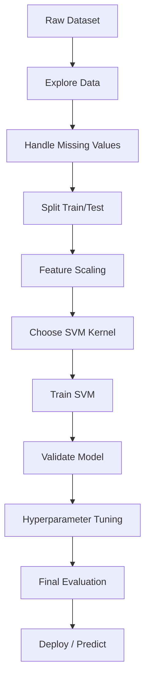
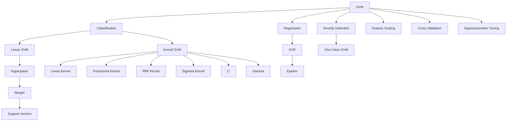

# 🧠 Support Vector Machines (SVM) in Machine Learning

> A complete learning resource covering the intuition, mathematics, implementation, evaluation, tuning, and advanced concepts of Support Vector Machines.

---

## 📚 Table of Contents

1. [Introduction](#1--introduction)
2. [What is Support Vector Machine?](#2--what-is-support-vector-machine)
3. [Core Intuition](#3--core-intuition)
4. [Important Terminology](#4--important-terminology)
5. [Linear SVM](#5--linear-svm)
6. [Hyperplane and Decision Boundary](#6--hyperplane-and-decision-boundary)
7. [Margin](#7--margin)
8. [Support Vectors](#8--support-vectors)
9. [Hard Margin vs Soft Margin](#9--hard-margin-vs-soft-margin)
10. [Mathematical Formulation](#10--mathematical-formulation)
11. [Hinge Loss](#11--hinge-loss)
12. [The Role of C](#12--the-role-of-c)
13. [Non-Linear SVM](#13--non-linear-svm)
14. [Kernel Trick](#14--kernel-trick)
15. [Common SVM Kernels](#15--common-svm-kernels)
16. [The RBF Kernel](#16--the-rbf-kernel)
17. [Gamma](#17--gamma)
18. [C and Gamma Together](#18--c-and-gamma-together)
19. [SVM for Classification](#19--svm-for-classification)
20. [SVM for Regression (SVR)](#20--svm-for-regression-svr)
21. [Multiclass Classification](#21--multiclass-classification)
22. [Feature Scaling](#22--feature-scaling)
23. [SVM Workflow](#23--svm-workflow)
24. [Practical Example with Scikit-Learn](#24--practical-example-with-scikit-learn)
25. [Visualizing the Decision Boundary](#25--visualizing-the-decision-boundary)
26. [Hyperparameter Tuning](#26--hyperparameter-tuning)
27. [Model Evaluation](#27--model-evaluation)
28. [Real-World Use Cases](#28--real-world-use-cases)
29. [Advantages](#29--advantages)
30. [Limitations](#30--limitations)
31. [SVM vs Other Algorithms](#31--svm-vs-other-algorithms)
32. [Common Mistakes](#32--common-mistakes)
33. [Best Practices](#33--best-practices)
34. [Practical Mini-Project](#34--practical-mini-project)
35. [Advanced Concepts](#35--advanced-concepts)
36. [Interview Questions and Points](#36--interview-questions-and-points)
37. [Quick Revision](#37--quick-revision)
38. [Visual Roadmap](#38--visual-roadmap)

---

# 1. 📖 Introduction

**Support Vector Machine (SVM)** is a supervised machine learning algorithm primarily used for:

- Classification
- Regression
- Outlier detection
- Pattern recognition

SVM tries to find the **best decision boundary** that separates classes while maximizing the distance between the boundary and the closest training samples.

The closest samples are called **support vectors**.

### Basic Idea

Suppose we have two classes:

```text
Class A:  ● ● ● ●

Class B:  ▲ ▲ ▲ ▲
```

Many lines may separate them, but SVM tries to find the one with the **maximum margin**.

```text
● ● ● ●

        | Decision Boundary
        |
        |

▲ ▲ ▲ ▲
```

The objective is not simply to separate the classes, but to find a boundary that is likely to **generalize well to unseen data**.

---

# 2. 🤖 What is Support Vector Machine?

A Support Vector Machine constructs a decision boundary called a **hyperplane**.

For a binary classification problem:

\[
w^T x + b = 0
\]

Where:

- `w` = weight vector
- `x` = feature vector
- `b` = bias/intercept

Prediction is based on the sign of:

\[
f(x) = w^T x + b
\]

| Condition | Prediction |
|---|---|
| `f(x) > 0` | Class +1 |
| `f(x) < 0` | Class -1 |
| `f(x) = 0` | On decision boundary |

---

# 3. 💡 Core Intuition

Imagine separating red and blue points with a line.

There may be several valid lines:

```text
   🔴 🔴        |        🔵 🔵
   🔴 🔴        |        🔵 🔵
                |
                |
```

SVM prefers the line that leaves the **largest possible gap** between the two classes.

This gap is called the **margin**.

### Why maximize the margin?

A larger margin generally means:

- Better robustness
- Better generalization
- Lower sensitivity to small changes in data

```text
Class A       Margin       Class B

● ● ●     |-----------|     ▲ ▲ ▲
● ● ●     |           |     ▲ ▲ ▲
          ↑           ↑
       boundary     boundary
```

---

# 4. 🧩 Important Terminology

| Term | Meaning |
|---|---|
| Hyperplane | Decision boundary separating classes |
| Margin | Distance between decision boundary and nearest samples |
| Support Vector | Training point closest to the decision boundary |
| Kernel | Function used to handle non-linear relationships |
| C | Regularization parameter controlling margin violations |
| Gamma | Controls influence of individual points for RBF/poly/sigmoid kernels |
| Hinge Loss | Loss function commonly associated with linear SVM |
| Hard Margin | Requires perfect separation |
| Soft Margin | Allows some violations |
| Kernel Trick | Maps data into a higher-dimensional feature space implicitly |
| SVR | Support Vector Regression |
| Decision Function | Score used by SVM to determine the class |

---

# 5. 📐 Linear SVM

A **Linear SVM** is suitable when classes can be separated approximately using a straight line, plane, or hyperplane.

For two features:

\[
w_1x_1+w_2x_2+b=0
\]

Example:

```text
Feature 2
   ↑
   |
 B |       ▲ ▲ ▲
   |      ▲ ▲ ▲
   |-----------  ← Decision Boundary
   |    ● ● ●
 A |   ● ● ●
   |
   +----------------→ Feature 1
```

### Example

Suppose we classify:

- `0` → Healthy
- `1` → Diseased

Features:

- Age
- Blood pressure

If the classes can be separated reasonably well using a line, a linear SVM may work well.

---

# 6. 📊 Hyperplane and Decision Boundary

A **hyperplane** is the boundary used to divide the feature space.

### In different dimensions

| Dimensions | Decision Boundary |
|---|---|
| 1D | Point |
| 2D | Line |
| 3D | Plane |
| Higher dimensions | Hyperplane |

General equation:

\[
w^Tx+b=0
\]

### Classification rule

\[
\hat{y} =
\begin{cases}
+1 & \text{if } w^Tx+b > 0 \\
-1 & \text{if } w^Tx+b < 0
\end{cases}
\]

---

# 7. 📏 Margin

The **margin** is the distance between the decision boundary and the closest data points from either class.

For the canonical SVM formulation, the two margin boundaries are:

\[
w^Tx+b=1
\]

and

\[
w^Tx+b=-1
\]

The total margin width is:

\[
\frac{2}{||w||}
\]

Therefore:

\[
\text{Maximize Margin}
\]

is equivalent to:

\[
\text{Minimize } \frac{1}{2}||w||^2
\]

### Key insight

A smaller `||w||` means a larger margin.

---

# 8. 🎯 Support Vectors

**Support vectors** are the training samples that determine the position of the optimal decision boundary.

They are usually the points closest to the boundary.

```text
Class A                  Class B

● ● ●                     ▲ ▲ ▲
  ●                    ▲
      ● ← Support     Support → ▲
           \         /
            \       /
             \     /
              \   /
               \ /
              Boundary
```

### Important

Removing a point far away from the boundary may not change the model significantly.

Removing a support vector can change the decision boundary.

This is why they are called **support vectors**.

---

# 9. ⚖️ Hard Margin vs Soft Margin

## 9.1 Hard Margin

Hard-margin SVM requires every training point to be correctly classified.

Optimization:

\[
\min \frac{1}{2}||w||^2
\]

Subject to:

\[
y_i(w^Tx_i+b)\geq1
\]

### Advantages

- Strict separation
- Simple mathematical formulation

### Problems

- Sensitive to outliers
- Requires linearly separable data
- Often unrealistic for real-world datasets

---

## 9.2 Soft Margin

Soft-margin SVM allows some points to violate the margin.

Slack variables are introduced:

\[
\xi_i\geq0
\]

Optimization:

\[
\min \frac{1}{2}||w||^2+C\sum_i\xi_i
\]

Subject to:

\[
y_i(w^Tx_i+b)\geq1-\xi_i
\]

### Comparison

| Feature | Hard Margin | Soft Margin |
|---|---|---|
| Misclassification | Not allowed | Allowed |
| Outlier sensitivity | High | Lower |
| Real-world suitability | Low | High |
| Regularization | No `C` trade-off | Controlled by `C` |
| Flexibility | Low | High |

---

# 10. 🧮 Mathematical Formulation

For binary classification, labels are commonly represented as:

\[
y_i\in\{-1,+1\}
\]

The decision function is:

\[
f(x)=w^Tx+b
\]

The optimization problem for a soft-margin SVM is:

\[
\min_{w,b,\xi}
\frac{1}{2}||w||^2+C\sum_{i=1}^{n}\xi_i
\]

Subject to:

\[
y_i(w^Tx_i+b)\geq1-\xi_i
\]

and:

\[
\xi_i\geq0
\]

### Interpretation

The objective balances two goals:

1. Keep the margin large.
2. Minimize classification/margin violations.

`C` determines how strongly the model penalizes violations.

---

# 11. 📉 Hinge Loss

SVM classification is closely associated with **hinge loss**.

\[
L(y,f(x))=\max(0,1-yf(x))
\]

where:

- `y ∈ {-1,+1}`
- `f(x)` = model score

### Cases

If:

\[
yf(x)\geq1
\]

then:

\[
L=0
\]

If:

\[
yf(x)<1
\]

then:

\[
L>0
\]

### Example

If:

```text
y = +1
f(x) = 2
```

Then:

\[
L=\max(0,1-(1)(2))=0
\]

If:

```text
y = +1
f(x) = 0.4
```

Then:

\[
L=\max(0,1-0.4)=0.6
\]

---

# 12. 🎛️ The Role of C

`C` is one of the most important SVM hyperparameters.

It controls the trade-off between:

- A wider margin
- Classification/margin violations

### Small C

A small `C`:

- Allows more violations
- Produces a wider margin
- Provides stronger regularization
- Can reduce overfitting

### Large C

A large `C`:

- Penalizes violations strongly
- Tries harder to classify training samples correctly
- Produces a narrower margin
- Can increase overfitting

| C | Margin | Violations | Overfitting Risk |
|---|---|---|---|
| Small | Wider | More allowed | Lower |
| Medium | Balanced | Moderate | Moderate |
| Large | Narrower | Fewer allowed | Higher |

### Important

`C` is not simply "accuracy".

It controls the **cost of margin violations**.

---

# 13. 🌀 Non-Linear SVM

Real-world datasets are often not linearly separable.

Example:

```text
       ▲ ▲ ▲
    ▲       ▲
   ▲   ● ●   ▲
   ▲  ● ● ●  ▲
    ▲       ▲
       ▲ ▲ ▲
```

No single straight line can perfectly separate the classes.

A linear classifier may fail.

SVM solves this using **kernels**.

---

# 14. 🧠 Kernel Trick

The **kernel trick** allows SVM to model non-linear relationships without explicitly constructing all higher-dimensional features.

Suppose data is difficult to separate in 2D.

We can conceptually map it into a higher-dimensional space:

```text
Original Space                  Feature Space

     ● ▲                           ▲
   ● ● ▲                         /   \
  ●   ▲            →            / ● ● \
   ● ▲                          \ ● ● /
                                \_____/
```

Instead of explicitly calculating the transformed coordinates, SVM evaluates similarity using a kernel function.

### General kernel function

\[
K(x_i,x_j)=\phi(x_i)^T\phi(x_j)
\]

The kernel trick computes the inner product in the transformed space without explicitly calculating `φ(x)`.

---

# 15. 🧪 Common SVM Kernels

| Kernel | Formula / Idea | Typical Use |
|---|---|---|
| Linear | `xᵀz` | Large, approximately linear datasets |
| Polynomial | `(γxᵀz + r)^d` | Polynomial relationships |
| RBF | `exp(-γ||x-z||²)` | General non-linear problems |
| Sigmoid | `tanh(γxᵀz+r)` | Neural-network-like behavior in some cases |

### Scikit-Learn kernel names

```python
kernel="linear"
kernel="poly"
kernel="rbf"
kernel="sigmoid"
```

---

# 16. 🔥 The RBF Kernel

The **Radial Basis Function (RBF)** kernel is one of the most commonly used SVM kernels.

Formula:

\[
K(x,z)=e^{-\gamma||x-z||^2}
\]

It measures similarity between two samples.

### Interpretation

If two points are close:

\[
K(x,z)\approx1
\]

If two points are far apart:

\[
K(x,z)\approx0
\]

### Why RBF is popular

- Handles complex boundaries
- Works well for many non-linear datasets
- Often a strong default for medium-sized datasets

---

# 17. 🎯 Gamma

`gamma` determines how far the influence of an individual training point reaches in an RBF SVM.

### Low Gamma

- Each point has broader influence
- Decision boundary tends to be smoother
- Can underfit

```text
Low γ → smoother boundary
```

### High Gamma

- Each point has localized influence
- Decision boundary becomes more complex
- Can overfit

```text
High γ → more complex boundary
```

| Gamma | Influence | Boundary | Risk |
|---|---|---|---|
| Low | Broad | Smooth | Underfitting |
| Medium | Balanced | Flexible | Usually reasonable |
| High | Local | Complex | Overfitting |

---

# 18. ⚙️ C and Gamma Together

`C` and `gamma` interact strongly in RBF SVM.

### Typical behavior

| C | Gamma | Possible Result |
|---|---|---|
| Low | Low | Very smooth model, possible underfitting |
| High | Low | Wider influence with stronger fitting pressure |
| Low | High | Complex local effects but violations allowed |
| High | High | Very complex boundary, high overfitting risk |

A practical approach is to tune both using cross-validation.

---

# 19. 🏷️ SVM for Classification

SVM is widely used for classification.

### Binary classification

Example:

```text
Spam     vs     Not Spam
Disease  vs     Healthy
Fraud    vs     Legitimate
```

### Basic Scikit-Learn implementation

```python
from sklearn.svm import SVC

model = SVC(kernel="rbf", C=1.0, gamma="scale")

model.fit(X_train, y_train)

y_pred = model.predict(X_test)
```

### Important parameters

```python
SVC(
    C=1.0,
    kernel="rbf",
    gamma="scale",
    degree=3,
    probability=False,
    class_weight=None,
    random_state=None
)
```

---

# 20. 📈 SVM for Regression (SVR)

SVM can also be used for regression through **Support Vector Regression (SVR)**.

Instead of trying to minimize errors for every point directly, SVR tries to fit a function inside an **epsilon-insensitive tube**.

```text
y
↑
|       •
|     •   •
|----===========----  +ε
|      regression
|----===========----  -ε
|   •      •
+--------------------→ x
```

Points inside the epsilon tube may not contribute to the loss.

### Scikit-Learn

```python
from sklearn.svm import SVR

model = SVR(
    kernel="rbf",
    C=100,
    epsilon=0.1,
    gamma="scale"
)

model.fit(X_train, y_train)

predictions = model.predict(X_test)
```

### Important SVR parameters

| Parameter | Meaning |
|---|---|
| `C` | Penalty for violations |
| `epsilon` | Width of insensitive region |
| `kernel` | Transformation function |
| `gamma` | Influence of individual points |

---

# 21. 🧩 Multiclass Classification

Standard SVM is naturally formulated for binary classification.

For multiple classes, implementations use strategies such as:

### One-vs-Rest (OvR)

For `K` classes, train `K` classifiers.

```text
Class A vs Rest
Class B vs Rest
Class C vs Rest
...
```

### One-vs-One (OvO)

Train one classifier for every pair of classes.

Number of classifiers:

\[
\frac{K(K-1)}{2}
\]

For 4 classes:

\[
\frac{4(4-1)}{2}=6
\]

### Comparison

| Strategy | Number of Models | Typical Idea |
|---|---:|---|
| One-vs-Rest | `K` | Each class vs all others |
| One-vs-One | `K(K-1)/2` | Every class pair |

Scikit-Learn's `SVC` uses a one-vs-one strategy internally for multiclass classification.

---

# 22. 📏 Feature Scaling

Feature scaling is **very important for SVM**, especially for:

- RBF kernel
- Polynomial kernel
- Distance-based kernel calculations

Suppose:

```text
Age:      18 - 70
Salary:   20,000 - 2,000,000
```

Salary can dominate the geometry.

### Standardization

\[
z=\frac{x-\mu}{\sigma}
\]

### Scikit-Learn

```python
from sklearn.preprocessing import StandardScaler

scaler = StandardScaler()

X_train_scaled = scaler.fit_transform(X_train)
X_test_scaled = scaler.transform(X_test)
```

### Best practice

Always fit the scaler on training data only.

```text
Training Data
     │
     ▼
Fit Scaler
     │
     ├──────────► Transform Training Data
     │
     └──────────► Transform Test Data
```

Never do:

```python
scaler.fit_transform(X_test)
```

because it leaks information from the test set.

---

# 23. 🔄 SVM Workflow



### Typical workflow

1. Load dataset
2. Clean data
3. Separate `X` and `y`
4. Split train/test
5. Scale features
6. Select kernel
7. Train SVM
8. Evaluate
9. Tune hyperparameters
10. Retrain/finalize
11. Predict new samples

---

# 24. 💻 Practical Example with Scikit-Learn

We will use the Breast Cancer dataset.

## 24.1 Import Libraries

```python
import numpy as np
import pandas as pd

from sklearn.datasets import load_breast_cancer
from sklearn.model_selection import train_test_split
from sklearn.preprocessing import StandardScaler
from sklearn.svm import SVC
from sklearn.metrics import (
    accuracy_score,
    classification_report,
    confusion_matrix
)
```

## 24.2 Load Dataset

```python
data = load_breast_cancer()

X = data.data
y = data.target

print("X shape:", X.shape)
print("y shape:", y.shape)
```

## 24.3 Train-Test Split

```python
X_train, X_test, y_train, y_test = train_test_split(
    X,
    y,
    test_size=0.2,
    random_state=42,
    stratify=y
)
```

### Why `stratify=y`?

It helps preserve the class distribution in both training and test sets.

---

## 24.4 Scale Features

```python
scaler = StandardScaler()

X_train_scaled = scaler.fit_transform(X_train)
X_test_scaled = scaler.transform(X_test)
```

---

## 24.5 Train SVM

```python
model = SVC(
    kernel="rbf",
    C=1.0,
    gamma="scale"
)

model.fit(X_train_scaled, y_train)
```

---

## 24.6 Make Predictions

```python
y_pred = model.predict(X_test_scaled)
```

---

## 24.7 Evaluate

```python
accuracy = accuracy_score(y_test, y_pred)

print("Accuracy:", accuracy)
print("Accuracy (%):", accuracy * 100)
```

Classification report:

```python
print(classification_report(y_test, y_pred))
```

Confusion matrix:

```python
print(confusion_matrix(y_test, y_pred))
```

### Important

Do not expect an exact accuracy value across every environment or configuration. Dataset splitting, preprocessing, library versions, and hyperparameters can affect results.

---

# 25. 📊 Visualizing the Decision Boundary

SVM decision boundaries are easiest to visualize with two features.

```python
import numpy as np
import matplotlib.pyplot as plt
from sklearn.datasets import make_classification
from sklearn.svm import SVC

X, y = make_classification(
    n_samples=200,
    n_features=2,
    n_redundant=0,
    n_informative=2,
    random_state=42,
    class_sep=1.5
)

model = SVC(kernel="linear", C=1)
model.fit(X, y)

x_min, x_max = X[:, 0].min() - 1, X[:, 0].max() + 1
y_min, y_max = X[:, 1].min() - 1, X[:, 1].max() + 1

xx, yy = np.meshgrid(
    np.linspace(x_min, x_max, 500),
    np.linspace(y_min, y_max, 500)
)

grid = np.c_[xx.ravel(), yy.ravel()]
Z = model.predict(grid).reshape(xx.shape)

plt.contourf(xx, yy, Z, alpha=0.25)
plt.scatter(X[:, 0], X[:, 1], c=y)

plt.xlabel("Feature 1")
plt.ylabel("Feature 2")
plt.title("SVM Decision Boundary")

plt.show()
```

### Decision function

You can inspect the signed distance-like score:

```python
scores = model.decision_function(X)

print(scores[:10])
```

For a binary linear SVM, the sign indicates the predicted side of the decision boundary.

---

# 26. 🎛️ Hyperparameter Tuning

Important SVM hyperparameters include:

- `C`
- `kernel`
- `gamma`
- `degree`
- `class_weight`

## 26.1 GridSearchCV

```python
from sklearn.model_selection import GridSearchCV

param_grid = {
    "C": [0.1, 1, 10, 100],
    "gamma": ["scale", 0.01, 0.1, 1],
    "kernel": ["rbf"]
}

grid = GridSearchCV(
    SVC(),
    param_grid,
    cv=5,
    scoring="accuracy",
    n_jobs=-1
)

grid.fit(X_train_scaled, y_train)

print("Best Parameters:", grid.best_params_)
print("Best CV Score:", grid.best_score_)
```

### Get best model

```python
best_model = grid.best_estimator_

y_pred = best_model.predict(X_test_scaled)
```

---

# 27. 📈 Model Evaluation

Accuracy alone is not always enough.

Useful metrics include:

| Metric | Formula / Purpose |
|---|---|
| Accuracy | Overall correct predictions |
| Precision | How many predicted positives are actually positive |
| Recall | How many actual positives were detected |
| F1 Score | Harmonic mean of precision and recall |
| ROC-AUC | Ranking/discrimination ability |
| Confusion Matrix | Detailed class-wise errors |

### Precision

\[
Precision=\frac{TP}{TP+FP}
\]

### Recall

\[
Recall=\frac{TP}{TP+FN}
\]

### F1

\[
F1=2\frac{Precision\cdot Recall}{Precision+Recall}
\]

### Confusion Matrix

```text
                 Predicted
              Negative Positive
Actual Neg       TN       FP
Actual Pos       FN       TP
```

### Example

In medical diagnosis:

- False Negative can be very costly.
- Recall may therefore be more important than raw accuracy.

---

# 28. 🌍 Real-World Use Cases

SVM has been used in many classification and pattern-recognition applications.

### 28.1 Text Classification

Examples:

- Spam detection
- Sentiment classification
- Topic classification
- Document categorization

Linear SVM can be particularly useful with high-dimensional sparse text features.

### 28.2 Image Classification

Examples:

- Object categories
- Face recognition pipelines
- Medical image classification

### 28.3 Medical Diagnosis

Examples:

- Disease classification
- Tumor classification
- Biomarker-based prediction

### 28.4 Finance

Examples:

- Fraud detection
- Credit-risk classification
- Customer classification

### 28.5 Bioinformatics

Examples:

- Protein classification
- Gene-expression classification

### 28.6 Industrial Applications

Examples:

- Fault detection
- Quality inspection
- Sensor-based classification

---

# 29. ✅ Advantages

| Advantage | Explanation |
|---|---|
| Effective in high dimensions | Works well when number of features is large |
| Strong theoretical foundation | Based on margin maximization |
| Kernel flexibility | Handles non-linear relationships |
| Robust generalization | Maximum-margin principle can generalize well |
| Effective with smaller datasets | Often strong when data is not enormous |
| Sparse support | Only support vectors are central to the final decision function |

### Additional strength

SVM can work particularly well when:

- Dataset is medium-sized
- Classes have a clear margin
- Feature space is high-dimensional
- A carefully tuned boundary is useful

---

# 30. ❌ Limitations

| Limitation | Explanation |
|---|---|
| Slow on very large datasets | Kernel SVM can become computationally expensive |
| Sensitive to scaling | Feature magnitudes strongly affect geometry |
| Hyperparameter tuning | Choosing `C`, `gamma`, and kernel may require experimentation |
| Less interpretable | Harder to explain than simple linear models |
| Probability estimates | Not native in the same way as logistic regression |
| Outlier sensitivity | Extreme observations can influence the boundary |
| Kernel selection | Wrong kernel can lead to poor performance |

### Important

For millions of observations, a kernel SVM may be impractical.

A linear SVM or another scalable algorithm may be a better choice.

---

# 31. ⚔️ SVM vs Other Algorithms

## 31.1 SVM vs Logistic Regression

| Feature | SVM | Logistic Regression |
|---|---|---|
| Main objective | Margin maximization | Log-loss minimization |
| Output | Decision score | Probability by default |
| Non-linear support | Kernels | Feature engineering / transformations |
| Interpretability | Moderate/Low | Relatively high |
| Large sparse data | Linear SVM can work well | Often works very well |
| Probability | Requires probability calibration/setting | Native probabilistic interpretation |

---

## 31.2 SVM vs KNN

| Feature | SVM | KNN |
|---|---|---|
| Training | More expensive | Very little training |
| Prediction | Usually efficient after training | Can be expensive |
| Scaling | Important | Important |
| Decision boundary | Learned | Local/neighborhood-based |
| High dimensions | Often strong with suitable features | Can suffer from curse of dimensionality |

---

## 31.3 SVM vs Decision Tree

| Feature | SVM | Decision Tree |
|---|---|---|
| Scaling | Important | Usually unnecessary |
| Interpretability | Lower | High |
| Non-linear relationships | Kernel support | Naturally supported |
| Outliers | Can be sensitive | Often more robust |
| Feature interactions | Learned through boundary/kernel | Naturally represented by splits |

---

## 31.4 SVM vs Random Forest

| Feature | SVM | Random Forest |
|---|---|---|
| Scaling | Important | Usually unnecessary |
| Interpretability | Moderate | Moderate |
| Non-linear data | Excellent with kernels | Excellent |
| Large datasets | Kernel SVM may struggle | Generally scalable |
| Feature importance | Less direct | Built-in methods available |
| Training | Can be expensive | Often practical for large tabular data |

---

# 32. 🚨 Common Mistakes

## Mistake 1: Not Scaling Features

Bad:

```python
model.fit(X_train, y_train)
```

when features have very different scales.

Better:

```python
scaler = StandardScaler()

X_train_scaled = scaler.fit_transform(X_train)
X_test_scaled = scaler.transform(X_test)

model.fit(X_train_scaled, y_train)
```

---

## Mistake 2: Fitting the Scaler on Test Data

Wrong:

```python
X_test_scaled = scaler.fit_transform(X_test)
```

Correct:

```python
X_train_scaled = scaler.fit_transform(X_train)
X_test_scaled = scaler.transform(X_test)
```

---

## Mistake 3: Using Accuracy Alone

A model can have high accuracy but poor recall on a minority class.

Always consider the problem requirements.

---

## Mistake 4: Blindly Using High C

Very large `C` can force the model to fit training data aggressively.

---

## Mistake 5: Blindly Using High Gamma

High gamma can create a highly complex decision boundary.

---

## Mistake 6: Ignoring Class Imbalance

For imbalanced classification, consider:

```python
SVC(class_weight="balanced")
```

---

## Mistake 7: Tuning on the Test Set

Do not repeatedly tune hyperparameters based on test performance.

Use cross-validation on training data.

---

## Mistake 8: Forgetting Probability Requirements

`SVC` does not expose probability estimates by default.

If needed:

```python
model = SVC(
    kernel="rbf",
    probability=True
)
```

Then:

```python
probabilities = model.predict_proba(X_test_scaled)
```

Probability estimates add computational cost and should be used when needed.

---

# 33. 🏆 Best Practices

### 1. Scale numeric features

Use:

```python
StandardScaler()
```

or an appropriate alternative.

### 2. Use pipelines

A pipeline helps prevent preprocessing leakage.

```python
from sklearn.pipeline import Pipeline
from sklearn.preprocessing import StandardScaler
from sklearn.svm import SVC

pipeline = Pipeline([
    ("scaler", StandardScaler()),
    ("svm", SVC(kernel="rbf", C=1))
])

pipeline.fit(X_train, y_train)
```

### 3. Use cross-validation

```python
from sklearn.model_selection import cross_val_score

scores = cross_val_score(
    pipeline,
    X_train,
    y_train,
    cv=5,
    scoring="accuracy"
)

print(scores)
print("Mean CV Score:", scores.mean())
```

### 4. Tune systematically

Search over:

- `C`
- `gamma`
- `kernel`
- `degree` for polynomial kernel

### 5. Evaluate using appropriate metrics

For imbalanced datasets, consider:

- Precision
- Recall
- F1
- ROC-AUC
- PR-AUC

### 6. Start simple

Try:

```python
kernel="linear"
```

before moving to:

```python
kernel="rbf"
```

especially when the dataset is large or likely to be linearly separable.

### 7. Keep the test set untouched

Use:

```text
Train → Cross-validation → Tune → Final Test
```

not:

```text
Train → Test → Tune → Test → Tune
```

---

# 34. 🛠️ Practical Mini-Project

## Project: Breast Cancer Classification using SVM

### Objective

Build a model that predicts whether a breast tumor is:

- Malignant
- Benign

using the Breast Cancer Wisconsin dataset available through Scikit-Learn.

---

## 34.1 Project Workflow


---

## 34.2 Complete Example

```python
from sklearn.datasets import load_breast_cancer
from sklearn.model_selection import train_test_split, GridSearchCV
from sklearn.pipeline import Pipeline
from sklearn.preprocessing import StandardScaler
from sklearn.svm import SVC
from sklearn.metrics import (
    accuracy_score,
    classification_report,
    confusion_matrix
)

# Load dataset
data = load_breast_cancer()

X = data.data
y = data.target

# Train/test split
X_train, X_test, y_train, y_test = train_test_split(
    X,
    y,
    test_size=0.2,
    random_state=42,
    stratify=y
)

# Pipeline
pipeline = Pipeline([
    ("scaler", StandardScaler()),
    ("svm", SVC())
])

# Hyperparameter grid
param_grid = {
    "svm__kernel": ["linear", "rbf"],
    "svm__C": [0.1, 1, 10, 100],
    "svm__gamma": ["scale", 0.01, 0.1, 1]
}

# Grid search
grid = GridSearchCV(
    pipeline,
    param_grid,
    cv=5,
    scoring="accuracy",
    n_jobs=-1
)

grid.fit(X_train, y_train)

# Best parameters
print("Best Parameters:")
print(grid.best_params_)

# Prediction
y_pred = grid.predict(X_test)

# Evaluation
print("\nAccuracy:")
print(accuracy_score(y_test, y_pred))

print("\nClassification Report:")
print(classification_report(y_test, y_pred))

print("\nConfusion Matrix:")
print(confusion_matrix(y_test, y_pred))
```

---

## 34.3 Project Extensions

You can extend the project by adding:

- Confusion matrix visualization
- ROC curve
- Precision-recall curve
- Hyperparameter visualization
- Linear vs RBF comparison
- Feature importance alternatives
- Cross-validation score comparison
- Model serialization using `joblib`
- Streamlit deployment

### Save Model

```python
import joblib

joblib.dump(grid.best_estimator_, "svm_breast_cancer_model.pkl")
```

### Load Model

```python
model = joblib.load("svm_breast_cancer_model.pkl")

prediction = model.predict(new_data)
```

---

# 35. 🚀 Advanced Concepts

## 35.1 Dual Formulation

SVM can be expressed in its **dual optimization problem**.

The dual formulation introduces Lagrange multipliers:

\[
\alpha_i
\]

A key result is that the final decision function depends on training points with non-zero `α`.

These points correspond to the **support vectors**.

A simplified kernelized decision function is:

\[
f(x)=\sum_i\alpha_i y_iK(x_i,x)+b
\]

Only relevant support vectors contribute to the sum.

---

## 35.2 Lagrange Multipliers

The constrained optimization problem can be solved using Lagrange multipliers.

The multipliers help convert the constrained primal optimization problem into the dual problem.

Important interpretation:

```text
αᵢ = 0
→ point usually does not affect the final boundary

αᵢ > 0
→ point contributes to the solution
→ associated with support vectors
```

---

## 35.3 Kernelized SVM

The dual formulation allows the dot product:

\[
x_i^Tx
\]

to be replaced by:

\[
K(x_i,x)
\]

This is the mathematical foundation of the **kernel trick**.

---

## 35.4 Polynomial Kernel

Polynomial kernel:

\[
K(x,z)=(\gamma x^Tz+r)^d
\]

Parameters:

- `degree` = polynomial degree
- `gamma` = scaling factor
- `coef0` = independent term

Scikit-Learn:

```python
model = SVC(
    kernel="poly",
    degree=3,
    C=1,
    gamma="scale",
    coef0=1
)
```

---

## 35.5 RBF Kernel Geometry

RBF is based on squared Euclidean distance:

\[
||x-z||^2
\]

and:

\[
K(x,z)=e^{-\gamma||x-z||^2}
\]

Increasing gamma makes similarity decay more rapidly with distance.

---

## 35.6 LinearSVC vs SVC(kernel="linear")

Scikit-Learn provides both:

```python
from sklearn.svm import SVC

SVC(kernel="linear")
```

and:

```python
from sklearn.svm import LinearSVC

LinearSVC()
```

### Comparison

| Feature | `SVC(kernel="linear")` | `LinearSVC` |
|---|---|---|
| Kernel support | Linear only in this mode | Linear |
| Solver | libsvm-based | liblinear-based |
| Large datasets | Can be less scalable | Often preferable |
| Probability | `probability=True` available | No direct `predict_proba` |
| Decision function | Yes | Yes |

For large sparse linear problems, `LinearSVC` can be a strong option.

---

## 35.7 Class Weight

For imbalanced classification:

```python
model = SVC(
    kernel="rbf",
    class_weight="balanced"
)
```

This automatically adjusts class weights based on class frequencies.

You can also specify custom weights:

```python
model = SVC(
    class_weight={
        0: 1,
        1: 3
    }
)
```

---

## 35.8 Probability Calibration

SVM's decision function is not automatically a probability.

If probability estimates are needed, options include:

```python
SVC(probability=True)
```

or post-hoc calibration using:

```python
from sklearn.calibration import CalibratedClassifierCV
```

Probability calibration is especially important when downstream decisions depend on meaningful probability estimates.

---

## 35.9 One-Class SVM

**One-Class SVM** is useful for novelty detection and outlier detection.

Example:

```python
from sklearn.svm import OneClassSVM

model = OneClassSVM(
    kernel="rbf",
    gamma="scale",
    nu=0.05
)

model.fit(X_train)

predictions = model.predict(X_test)
```

Typical output:

```text
+1 → Inlier
-1 → Outlier
```

---

## 35.10 Support Vector Regression Parameters

Important parameters:

```python
SVR(
    C=1.0,
    epsilon=0.1,
    kernel="rbf",
    gamma="scale"
)
```

### `epsilon`

Controls the size of the epsilon-insensitive region.

Larger epsilon:

- More tolerance
- Fewer support vectors may be needed
- Potentially smoother predictions

Smaller epsilon:

- More sensitive to deviations
- Potentially more complex model

---

# 36. 🎤 Interview Questions and Points

## Q1. What is SVM?

**Answer:**  
SVM is a supervised learning algorithm that finds a decision boundary maximizing the margin between classes.

---

## Q2. What are support vectors?

**Answer:**  
Support vectors are the training samples that are critical in defining the optimal decision boundary, typically lying on or within the margin.

---

## Q3. What is a hyperplane?

**Answer:**  
A hyperplane is the decision boundary used by SVM to separate classes in feature space.

---

## Q4. What is the margin?

**Answer:**  
The margin is the distance between the decision boundary and the closest training samples from the classes.

---

## Q5. Why does SVM maximize the margin?

**Answer:**  
A larger margin generally improves robustness and generalization to unseen data.

---

## Q6. What is the kernel trick?

**Answer:**  
The kernel trick allows SVM to model non-linear relationships by computing similarities corresponding to a higher-dimensional feature space without explicitly constructing that space.

---

## Q7. What is C in SVM?

**Answer:**  
`C` controls the penalty for margin violations. Small `C` allows more violations and stronger regularization, while large `C` penalizes violations more strongly.

---

## Q8. What is gamma?

**Answer:**  
For kernels such as RBF, gamma controls the influence range of individual training samples.

---

## Q9. What happens when gamma is too high?

**Answer:**  
The model may create a highly complex boundary and overfit the training data.

---

## Q10. What happens when gamma is too low?

**Answer:**  
The boundary can become overly smooth and the model may underfit.

---

## Q11. Why is feature scaling important for SVM?

**Answer:**  
SVM relies on geometric relationships and, for many kernels, distances or dot products. Features with large scales can dominate these calculations.

---

## Q12. Difference between SVM and Logistic Regression?

**Answer:**  
SVM focuses on margin maximization, while logistic regression minimizes log loss and naturally provides a probabilistic interpretation.

---

## Q13. Can SVM handle non-linear data?

**Answer:**  
Yes. Kernel functions such as RBF and polynomial kernels allow SVM to model non-linear decision boundaries.

---

## Q14. Can SVM perform regression?

**Answer:**  
Yes. The regression version is called Support Vector Regression (SVR).

---

## Q15. What is the difference between hard-margin and soft-margin SVM?

**Answer:**  
Hard-margin SVM requires perfect separation, while soft-margin SVM allows margin violations using slack variables and a regularization parameter `C`.

---

## Q16. When should you avoid kernel SVM?

**Answer:**  
Kernel SVM can be a poor choice for extremely large datasets because training and memory requirements can become expensive.

---

## Q17. Why use `StandardScaler`?

**Answer:**  
It standardizes features to approximately zero mean and unit variance, preventing large-scale features from dominating SVM geometry.

---

## Q18. What is the RBF kernel?

**Answer:**  
RBF is a radial basis function kernel that measures similarity based on distance between samples and is widely used for non-linear SVM problems.

---

## Q19. What is One-Class SVM?

**Answer:**  
One-Class SVM is an unsupervised/semi-supervised novelty detection method that learns a boundary around normal observations.

---

## Q20. What is hinge loss?

**Answer:**  
Hinge loss is:

\[
\max(0,1-yf(x))
\]

It penalizes incorrect predictions and predictions that fall inside the desired margin.

---

# 37. ⚡ Quick Revision

## 🧠 Core Concepts

- SVM = Support Vector Machine
- Used for classification, regression, and novelty detection
- Main idea = maximize margin
- Closest points = support vectors
- Decision boundary = hyperplane
- Linear SVM works with linear boundaries
- Kernel SVM handles non-linear relationships
- RBF is a common non-linear kernel
- Feature scaling is usually important

---

## 📐 Important Formulas

### Hyperplane

\[
w^Tx+b=0
\]

### Margin boundaries

\[
w^Tx+b=1
\]

\[
w^Tx+b=-1
\]

### Margin width

\[
\frac{2}{||w||}
\]

### Soft-margin objective

\[
\min \frac{1}{2}||w||^2+C\sum_i\xi_i
\]

### Hinge Loss

\[
L=\max(0,1-yf(x))
\]

### RBF Kernel

\[
K(x,z)=e^{-\gamma||x-z||^2}
\]

### Polynomial Kernel

\[
K(x,z)=(\gamma x^Tz+r)^d
\]

---

## 🎛️ Important Hyperparameters

| Parameter | Remember |
|---|---|
| `C` | Penalty for violations |
| `gamma` | Influence of individual points |
| `kernel` | Shape/transformation of boundary |
| `degree` | Polynomial degree |
| `coef0` | Independent term for poly/sigmoid |
| `class_weight` | Handles class imbalance |
| `epsilon` | SVR insensitive zone |

---

## 🧪 Common Commands

### Import

```python
from sklearn.svm import SVC
from sklearn.svm import SVR
from sklearn.svm import LinearSVC
from sklearn.svm import OneClassSVM
```

### Classification

```python
model = SVC(kernel="rbf")
model.fit(X_train, y_train)
predictions = model.predict(X_test)
```

### Regression

```python
model = SVR(kernel="rbf")
model.fit(X_train, y_train)
predictions = model.predict(X_test)
```

### Linear SVM

```python
model = LinearSVC()
model.fit(X_train, y_train)
```

### Scaling

```python
from sklearn.preprocessing import StandardScaler

scaler = StandardScaler()

X_train = scaler.fit_transform(X_train)
X_test = scaler.transform(X_test)
```

### Pipeline

```python
from sklearn.pipeline import Pipeline

pipeline = Pipeline([
    ("scaler", StandardScaler()),
    ("svm", SVC())
])
```

### Grid Search

```python
from sklearn.model_selection import GridSearchCV

grid = GridSearchCV(
    estimator=pipeline,
    param_grid=params,
    cv=5
)

grid.fit(X_train, y_train)
```

---

## 🧠 One-Line Memory Tricks

```text
SVM
 ↓
Find the best separating boundary
 ↓
Maximize the margin
 ↓
Closest points = Support Vectors
 ↓
C = penalty for violations
 ↓
Gamma = influence range
 ↓
Kernel = handles non-linearity
 ↓
Scale features
 ↓
Tune with Cross-Validation
```

---

# 38. 🗺️ Visual Roadmap



---

# 🎯 Final Mental Model

```text
                 SUPPORT VECTOR MACHINE
                           │
             ┌─────────────┴─────────────┐
             │                           │
        Classification                Regression
             │                           │
          SVC / SVM                     SVR
             │
       ┌─────┴─────┐
       │           │
    Linear       Non-Linear
       │           │
   Hyperplane    Kernels
                   │
        ┌──────────┼──────────┐
        │          │          │
      Linear      Poly       RBF
                              │
                           Gamma
                              │
                         Local Influence

Core Concepts:
• Maximum Margin
• Support Vectors
• Hyperplane
• C Regularization
• Kernel Trick
• Feature Scaling
• Cross-Validation
```

---

## 🏁 Final Takeaways

1. **SVM finds a decision boundary with a maximum margin.**
2. **Support vectors are the critical points defining the boundary.**
3. **`C` controls the penalty for margin violations.**
4. **`gamma` controls the influence of points for kernels such as RBF.**
5. **RBF is a strong general-purpose choice for many non-linear problems.**
6. **Feature scaling is usually essential for SVM.**
7. **Soft-margin SVM is more practical than hard-margin SVM for noisy real-world data.**
8. **Use cross-validation to tune SVM hyperparameters.**
9. **Use pipelines to prevent preprocessing leakage.**
10. **SVM can perform classification, regression, and novelty detection.**
11. **Kernel SVM can become computationally expensive on very large datasets.**
12. **Always select evaluation metrics based on the actual business/problem requirements.**

> 💡 **Remember:** SVM is fundamentally about finding a boundary that separates classes while keeping the **maximum possible margin**, with `C` controlling how much you are willing to violate that margin and kernels allowing the boundary to become non-linear.
