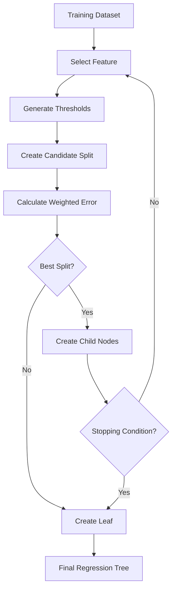
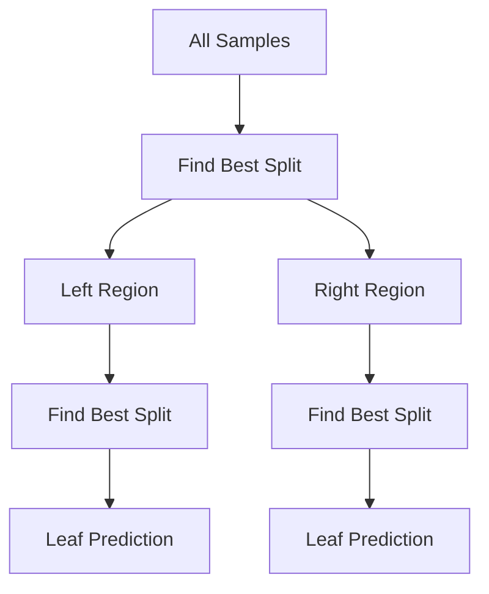
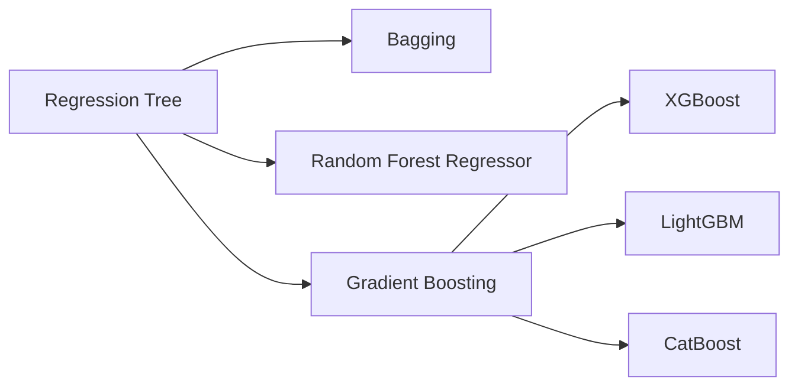
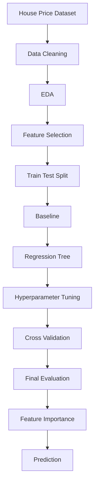
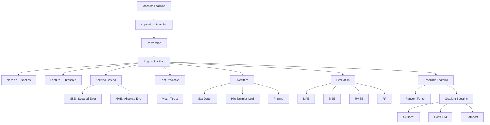

# 🌳 Regression Tree in Machine Learning

> A complete learning resource covering Regression Tree fundamentals, terminology, splitting criteria, mathematical formulas, pruning, hyperparameters, Scikit-Learn implementation, evaluation metrics, real-world use cases, best practices, common mistakes, interview questions, and a practical mini-project.

---

## 📚 Table of Contents

1. [🌳 Introduction](#1--introduction)
2. [🎯 What is a Regression Tree?](#2--what-is-a-regression-tree)
3. [🧩 Terminology](#3--terminology)
4. [🔄 How a Regression Tree Works](#4--how-a-regression-tree-works)
5. [🌿 Tree Structure](#5--tree-structure)
6. [📊 Classification vs Regression Tree](#6--classification-vs-regression-tree)
7. [✂️ Splitting](#7--splitting)
8. [📐 Splitting Criteria](#8--splitting-criteria)
9. [📉 Mean Squared Error](#9--mean-squared-error)
10. [📏 Mean Absolute Error](#10--mean-absolute-error)
11. [🎯 Best Split Selection](#11--best-split-selection)
12. [🍃 Leaf Prediction](#12--leaf-prediction)
13. [✂️ Pruning](#13--pruning)
14. [🎛️ Hyperparameters](#14--hyperparameters)
15. [💻 Scikit-Learn Implementation](#15--scikit-learn-implementation)
16. [🏠 House Price Example](#16--house-price-example)
17. [📊 Evaluation Metrics](#17--evaluation-metrics)
18. [🌳 Visualizing the Tree](#18--visualizing-the-tree)
19. [🔍 Feature Importance](#19--feature-importance)
20. [📈 Piecewise Constant Predictions](#20--piecewise-constant-predictions)
21. [🌍 Real-World Use Cases](#21--real-world-use-cases)
22. [✅ Advantages](#22--advantages)
23. [⚠️ Limitations](#23--limitations)
24. [🚫 Common Mistakes](#24--common-mistakes)
25. [🧠 Best Practices](#25--best-practices)
26. [🚀 Advanced Concepts](#26--advanced-concepts)
27. [🌲 Ensemble Methods](#27--ensemble-methods)
28. [🛠️ Practical Mini-Project](#28--practical-mini-project)
29. [🎤 Interview Questions](#29--interview-questions)
30. [📝 Quick Revision](#30--quick-revision)
31. [🗺️ Visual Roadmap](#31--visual-roadmap)

---

# 1. 🌳 Introduction

A **Regression Tree** is a supervised machine learning algorithm used to predict a **continuous numerical target**.

Typical problems include:

- House price prediction
- Salary prediction
- Sales forecasting
- Electricity consumption
- Delivery-time estimation
- Demand prediction
- Temperature prediction

A Regression Tree does not learn one global equation such as:

$$
y=b_0+b_1x
$$

Instead, it divides the feature space into regions and assigns a numerical prediction to each region.

### Simple Example

```text
                  Area <= 1500?
                  /            \
                Yes             No
                /                \
          Bedrooms <= 2?        ₹90L
            /       \
          Yes        No
          /           \
        ₹45L         ₹60L
```

---

# 2. 🎯 What is a Regression Tree?

A Regression Tree is a Decision Tree designed for **regression problems**.

Its goal is to recursively divide the training data into groups whose target values are as similar as possible.

> **Core idea:** Find feature-threshold splits that minimize the prediction error inside the resulting child nodes.

### Workflow

```text
Dataset
   ↓
Select Feature
   ↓
Generate Candidate Thresholds
   ↓
Calculate Split Error
   ↓
Choose Best Split
   ↓
Split Data
   ↓
Repeat Recursively
   ↓
Create Leaf Nodes
   ↓
Predict Numerical Value
```

---

# 3. 🧩 Terminology

| Term | Meaning |
|---|---|
| Root Node | First node of the tree |
| Internal Node | Node where a split occurs |
| Branch | Connection between nodes |
| Leaf Node | Final prediction region |
| Parent Node | Node being split |
| Child Node | Node produced by a split |
| Feature | Input variable used for splitting |
| Threshold | Value used to divide a numerical feature |
| Error/Impurity | Variation of target values inside a node |
| Depth | Number of levels in the tree |
| Pruning | Removing unnecessary branches |
| Prediction | Numerical value assigned to a leaf |

---

# 4. 🔄 How a Regression Tree Works

Training generally follows these steps:

1. Start with all training samples.
2. Select a candidate feature.
3. Generate possible threshold values.
4. Split the data.
5. Calculate the error in each child.
6. Calculate the weighted total error.
7. Choose the split with the lowest error.
8. Repeat recursively.
9. Stop using a stopping condition.
10. Assign a prediction to every leaf.



---

# 5. 🌿 Tree Structure

Example:

```text
                         Area <= 1500?
                        /            \
                      Yes             No
                     /                 \
             Income <= 60000?        ₹90L
               /         \
             Yes          No
             /             \
           ₹40L           ₹65L
```

For a new house:

```text
Area = 1200
Income = 50000
```

The path is:

```text
Area <= 1500       → Yes
Income <= 60000    → Yes
```

Prediction:

```text
₹40 Lakhs
```

---

# 6. 📊 Classification vs Regression Tree

| Property | Classification Tree | Regression Tree |
|---|---|---|
| Target | Categorical | Numerical |
| Output | Class | Number |
| Example | Spam / Not Spam | House Price |
| Common Criteria | Gini, Entropy | Squared Error, Absolute Error |
| Leaf Prediction | Class/probability | Numerical estimate |
| Metrics | Accuracy, Precision, Recall, F1 | MAE, MSE, RMSE, R² |

Both are tree-based supervised learning methods.

---

# 7. ✂️ Splitting

A numerical feature can be split using a condition:

```text
Area <= 1500
```

This creates:

```text
Left child:
Area <= 1500

Right child:
Area > 1500
```

Suppose:

```text
Area = [1000, 1200, 1400, 1600, 1800, 2000]
```

Possible thresholds include approximately:

```text
1100, 1300, 1500, 1700, 1900
```

The tree evaluates candidate thresholds and chooses the one producing the lowest weighted error.

### Goal of a good split

```text
Parent Node
   ↓
High Target Variation
   ↓
Good Split
   ↓
Child Nodes
   ↓
Low Target Variation
```

---

# 8. 📐 Splitting Criteria

Common Regression Tree criteria include:

| Criterion | Idea | Outlier Sensitivity |
|---|---|---|
| Squared Error | Minimize squared deviations | High |
| Absolute Error | Minimize absolute deviations | Lower |
| Poisson | Useful for suitable count-like targets | Dataset dependent |

In Scikit-Learn:

```python
DecisionTreeRegressor(
    criterion="squared_error"
)
```

---

# 9. 📉 Mean Squared Error

MSE is one of the most common objectives for regression.

$$
MSE=\frac{1}{n}\sum_{i=1}^{n}(y_i-\hat{y}_i)^2
$$

Where:

- $y_i$ = actual value
- $\hat{y}_i$ = predicted value
- $n$ = number of observations

Example:

```text
Actual:     [10, 12, 14]
Prediction: 12
```

$$
MSE=\frac{(10-12)^2+(12-12)^2+(14-12)^2}{3}
$$

$$
MSE=\frac{4+0+4}{3}=2.67
$$

### Why MSE penalizes outliers

```text
Error = 2  →  Squared error = 4
Error = 10 →  Squared error = 100
```

Large errors receive much greater weight.

---

# 10. 📏 Mean Absolute Error

MAE is:

$$
MAE=\frac{1}{n}\sum_{i=1}^{n}|y_i-\hat{y}_i|
$$

Example:

```text
Actual:     [10, 12, 14]
Prediction: 12
```

$$
MAE=\frac{2+0+2}{3}=1.33
$$

### MSE vs MAE

| Property | MSE | MAE |
|---|---|---|
| Error | Squared | Absolute |
| Outlier Sensitivity | High | Lower |
| Units | Squared target units | Same as target |
| Large Error Penalty | Strong | Linear |

---

# 11. 🎯 Best Split Selection

Suppose a node contains:

```text
10, 12, 14, 50, 52, 55
```

A useful split might create:

```text
Left:  10, 12, 14
Right: 50, 52, 55
```

Each group has low internal variation.

The weighted split error can be written as:

$$
Error_{split}
=
\frac{N_L}{N}Error_L+
\frac{N_R}{N}Error_R
$$

Where:

- $N_L$ = samples in left child
- $N_R$ = samples in right child
- $N$ = total samples

The algorithm prefers the split with the smallest weighted error.

---

# 12. 🍃 Leaf Prediction

With squared-error regression, a leaf generally predicts the **mean target value** of the training observations reaching that leaf.

Example:

```text
Leaf values:
40
42
44
```

Prediction:

$$
\hat{y}=\frac{40+42+44}{3}=42
$$

Therefore:

```text
Leaf Prediction = 42
```

This produces a **piecewise constant approximation** of the target function.

---

# 13. ✂️ Pruning

A very deep Regression Tree can memorize training observations.

Example:

```text
Training RMSE = 0.5
Testing RMSE  = 15.2
```

This indicates possible overfitting.

## Pre-Pruning

Limit tree growth using:

```python
max_depth
min_samples_split
min_samples_leaf
max_leaf_nodes
max_features
```

## Post-Pruning

Cost-complexity pruning balances fit and tree complexity:

$$
R_\alpha(T)=R(T)+\alpha|T|
$$

Where:

- $R(T)$ = tree error
- $|T|$ = number of leaves
- $\alpha$ = complexity penalty

Higher `ccp_alpha` generally encourages a simpler tree.

```python
from sklearn.tree import DecisionTreeRegressor

model = DecisionTreeRegressor(random_state=42)

path = model.cost_complexity_pruning_path(
    X_train,
    y_train
)

ccp_alphas = path.ccp_alphas
```

---

# 14. 🎛️ Hyperparameters

| Hyperparameter | Purpose | General Effect |
|---|---|---|
| `criterion` | Split objective | Controls error calculation |
| `max_depth` | Maximum depth | Limits complexity |
| `min_samples_split` | Minimum samples to split | Prevents tiny nodes |
| `min_samples_leaf` | Minimum samples per leaf | Produces smoother predictions |
| `max_leaf_nodes` | Maximum leaves | Direct complexity control |
| `max_features` | Features considered | Can reduce variance |
| `ccp_alpha` | Pruning strength | Higher → simpler tree |
| `random_state` | Reproducibility | Repeatable experiments |

Example:

```python
model = DecisionTreeRegressor(
    criterion="squared_error",
    max_depth=5,
    min_samples_split=10,
    min_samples_leaf=4,
    random_state=42
)
```

---

# 15. 💻 Scikit-Learn Implementation

## Import

```python
from sklearn.tree import DecisionTreeRegressor
```

## Create Model

```python
model = DecisionTreeRegressor(
    criterion="squared_error",
    max_depth=5,
    random_state=42
)
```

## Train

```python
model.fit(X_train, y_train)
```

## Predict

```python
y_pred = model.predict(X_test)
```

## Basic Evaluation

```python
from sklearn.metrics import mean_squared_error

mse = mean_squared_error(y_test, y_pred)

print("MSE:", mse)
```

---

# 16. 🏠 House Price Example

House-price prediction is a common Regression Tree application.

Example features:

| Feature | Example |
|---|---:|
| Area | 1500 sq.ft |
| Bedrooms | 3 |
| Bathrooms | 2 |
| Age | 5 years |
| Distance to City | 8 km |
| Parking | 1 |
| Floor | 3 |
| Price | ₹75 Lakhs |

Target:

```text
price
```

### Complete Code

```python
import pandas as pd

from sklearn.model_selection import train_test_split
from sklearn.tree import DecisionTreeRegressor
from sklearn.metrics import (
    mean_absolute_error,
    mean_squared_error,
    r2_score
)

# Load data
df = pd.read_csv("house_prices.csv")

# Features and target
X = df.drop("price", axis=1)
y = df["price"]

# Train-test split
X_train, X_test, y_train, y_test = train_test_split(
    X,
    y,
    test_size=0.2,
    random_state=42
)

# Model
model = DecisionTreeRegressor(
    criterion="squared_error",
    max_depth=5,
    min_samples_leaf=5,
    random_state=42
)

# Training
model.fit(X_train, y_train)

# Prediction
y_pred = model.predict(X_test)

# Metrics
mae = mean_absolute_error(y_test, y_pred)
mse = mean_squared_error(y_test, y_pred)
rmse = mse ** 0.5
r2 = r2_score(y_test, y_pred)

print("MAE:", mae)
print("MSE:", mse)
print("RMSE:", rmse)
print("R²:", r2)
```

---

# 17. 📊 Evaluation Metrics

## MAE

$$
MAE=\frac{1}{n}\sum|y_i-\hat y_i|
$$

Lower is better.

Interpretation:

> Average absolute distance between predictions and actual values.

---

## MSE

$$
MSE=\frac{1}{n}\sum(y_i-\hat y_i)^2
$$

Lower is better.

Large errors are penalized heavily.

---

## RMSE

$$
RMSE=\sqrt{MSE}
$$

Lower is better.

RMSE is expressed in the same units as the target.

---

## R²

$$
R^2=
1-\frac{\sum(y_i-\hat y_i)^2}
{\sum(y_i-\bar y)^2}
$$

Higher is generally better.

Important:

- `1.0` = perfect prediction
- `0` = baseline-like performance under the standard definition
- Negative values are possible

### Metric Comparison

| Metric | Better | Outlier Sensitivity | Target Units |
|---|---|---|---|
| MAE | Lower | Lower | Yes |
| MSE | Lower | High | No |
| RMSE | Lower | High | Yes |
| R² | Higher | Depends | No |

---

# 18. 🌳 Visualizing the Tree

```python
from sklearn.tree import plot_tree
import matplotlib.pyplot as plt

plt.figure(figsize=(20, 10))

plot_tree(
    model,
    feature_names=X.columns,
    filled=True,
    rounded=True
)

plt.show()
```

A node may display information such as:

```text
area <= 1500
samples = 400
value = 72.5
```

Here:

- `area <= 1500` = split rule
- `samples = 400` = observations at node
- `value = 72.5` = target estimate at node

---

# 19. 🔍 Feature Importance

A fitted Regression Tree provides impurity-based feature importance:

```python
import pandas as pd

importance = pd.Series(
    model.feature_importances_,
    index=X.columns
).sort_values(ascending=False)

print(importance)
```

Visualization:

```python
import matplotlib.pyplot as plt

importance.sort_values().plot(
    kind="barh"
)

plt.xlabel("Feature Importance")
plt.title("Regression Tree Feature Importance")
plt.show()
```

> ⚠️ Feature importance does not prove causality. For more robust interpretation, consider permutation importance or SHAP.

---

# 20. 📈 Piecewise Constant Predictions

Regression Trees produce step-like predictions.

Example:

```text
X <= 10          → 20
10 < X <= 20     → 35
20 < X <= 30     → 50
X > 30           → 65
```

Conceptually:

```text
Prediction
   |
65 |                     ┌────────
   |                     |
50 |             ┌───────┘
   |             |
35 |      ┌──────┘
   |      |
20 |──────┘
   +------------------------------> X
       10     20      30
```

This is different from Linear Regression, which produces a continuous line.

---

# 21. 🌍 Real-World Use Cases

### 🏠 Real Estate
- House prices
- Rental prices
- Property valuation

### 🛒 E-Commerce
- Sales prediction
- Customer spending
- Order value

### 📦 Supply Chain
- Delivery time
- Inventory demand
- Shipping cost

### ⚡ Energy
- Electricity consumption
- Energy demand
- Load prediction

### 🚗 Automotive
- Repair cost
- Fuel consumption
- Maintenance duration

### 🏭 Manufacturing
- Production quantity
- Process duration
- Energy usage

### 📈 Business
- Revenue prediction
- Demand forecasting
- Customer lifetime value estimates

---

# 22. ✅ Advantages

| Advantage | Explanation |
|---|---|
| Easy to Understand | Rules are intuitive |
| Easy to Visualize | Tree can be plotted |
| No Scaling Usually Needed | Threshold-based model |
| Nonlinear Relationships | Naturally supported |
| Feature Interactions | Learned automatically |
| Flexible | Works with many feature distributions |
| Fast Prediction | Only one path is traversed |
| Feature Selection | Splits identify useful variables |

---

# 23. ⚠️ Limitations

| Limitation | Explanation |
|---|---|
| Overfitting | Deep trees can memorize data |
| High Variance | Small data changes can change the tree |
| Piecewise Constant | Predictions are step-like |
| Poor Extrapolation | Weak outside the training range |
| Instability | Single trees may be sensitive to data |
| Greedy Optimization | Local split decisions are made |
| Outlier Sensitivity | Especially with squared-error criteria |

A single Regression Tree can have much higher variance than an ensemble of trees.

---

# 24. 🚫 Common Mistakes

### ❌ Growing an unrestricted tree

```python
DecisionTreeRegressor(random_state=42)
```

A very deep tree can overfit.

### ❌ Checking only training error

```text
Train RMSE = 1
Test RMSE  = 20
```

Investigate overfitting.

### ❌ Using only R²

Always inspect MAE/RMSE alongside R².

### ❌ Ignoring outliers

MSE strongly penalizes extreme errors.

### ❌ Scaling unnecessarily

Decision Trees generally do not require `StandardScaler`.

### ❌ Data leakage

Correct workflow:

```text
Dataset
   ↓
Train/Test Split
   ↓
Training Data → Cross-Validation → Tuning
   ↓
Final Model
   ↓
Test Data → Final Evaluation
```

---

# 25. 🧠 Best Practices

1. Start with a simple baseline.
2. Control `max_depth`.
3. Experiment with `min_samples_leaf`.
4. Use cross-validation.
5. Tune hyperparameters on training data only.
6. Compare train and validation/test errors.
7. Evaluate with MAE, RMSE, and R².
8. Inspect residuals when appropriate.
9. Compare against Linear Regression.
10. Compare against Random Forest or Gradient Boosting.
11. Use feature importance carefully.
12. Prefer a simpler model when performance is similar.

### Cross-Validation

```python
from sklearn.model_selection import cross_val_score

scores = cross_val_score(
    model,
    X,
    y,
    cv=5,
    scoring="neg_root_mean_squared_error"
)

rmse_scores = -scores

print("CV RMSE:", rmse_scores)
print("Mean CV RMSE:", rmse_scores.mean())
```

---

# 26. 🚀 Advanced Concepts

## 26.1 Recursive Binary Splitting



The process continues recursively until stopping criteria are met.

---

## 26.2 Greedy Optimization

Decision Trees generally use a greedy strategy:

```text
Find Best Current Split
        ↓
Split
        ↓
Find Best Split in Child
        ↓
Repeat
```

The locally best split does not necessarily produce the globally optimal tree.

---

## 26.3 Bias-Variance Trade-Off

```text
Tree Complexity ↑
       │
       ├── Bias ↓
       └── Variance ↑
```

Shallow tree:

```text
Higher Bias
Lower Variance
```

Very deep tree:

```text
Lower Training Bias
Higher Variance
```

The objective is to find a useful balance.

---

## 26.4 Feature Interactions

Trees naturally capture interactions:

```text
Area > 1500?
     |
     └── Location = Premium?
             |
             └── Price increases
```

The effect of one feature can depend on another feature's previous split.

---

## 26.5 Piecewise Constant Function

A Regression Tree can be viewed as:

$$
f(x)=
\begin{cases}
20 & x\le10\\
35 & 10<x\le20\\
50 & 20<x\le30\\
65 & x>30
\end{cases}
$$

This is why tree predictions often look like a staircase.

---

# 27. 🌲 Ensemble Methods

Regression Trees are building blocks for powerful ensemble algorithms.



## Random Forest Regressor

Multiple randomized trees are trained and their outputs are averaged.

```text
Tree 1 → 72
Tree 2 → 76
Tree 3 → 74
Tree 4 → 78
Tree 5 → 75
        ↓
     Average
        ↓
Final = 75
```

This generally reduces the variance of a single Regression Tree.

## Gradient Boosting

Trees are trained sequentially:

```text
Initial Prediction
       ↓
Calculate Errors
       ↓
Train Tree
       ↓
Update Prediction
       ↓
Calculate New Errors
       ↓
Train Next Tree
```

---

# 28. 🛠️ Practical Mini-Project

## 🏠 House Price Prediction

### Objective

Predict house prices from:

```text
area
bedrooms
bathrooms
age
distance_to_city
parking
floor
```

Target:

```text
price
```

### Project Workflow



### Complete Example

```python
import pandas as pd

from sklearn.model_selection import train_test_split
from sklearn.tree import DecisionTreeRegressor
from sklearn.metrics import (
    mean_absolute_error,
    mean_squared_error,
    r2_score
)

df = pd.read_csv("house_prices.csv")

X = df.drop("price", axis=1)
y = df["price"]

X_train, X_test, y_train, y_test = train_test_split(
    X,
    y,
    test_size=0.2,
    random_state=42
)

model = DecisionTreeRegressor(
    criterion="squared_error",
    max_depth=5,
    min_samples_leaf=5,
    random_state=42
)

model.fit(X_train, y_train)

y_train_pred = model.predict(X_train)
y_test_pred = model.predict(X_test)

train_rmse = mean_squared_error(
    y_train,
    y_train_pred
) ** 0.5

test_rmse = mean_squared_error(
    y_test,
    y_test_pred
) ** 0.5

mae = mean_absolute_error(y_test, y_test_pred)
r2 = r2_score(y_test, y_test_pred)

print("Training RMSE:", train_rmse)
print("Testing RMSE:", test_rmse)
print("Testing MAE:", mae)
print("Testing R²:", r2)
```

### Hyperparameter Experiment

```python
depths = [2, 3, 4, 5, 8, 10]

for depth in depths:

    model = DecisionTreeRegressor(
        max_depth=depth,
        random_state=42
    )

    model.fit(X_train, y_train)

    train_pred = model.predict(X_train)
    test_pred = model.predict(X_test)

    train_rmse = mean_squared_error(
        y_train,
        train_pred
    ) ** 0.5

    test_rmse = mean_squared_error(
        y_test,
        test_pred
    ) ** 0.5

    print(
        f"Depth={depth} | "
        f"Train RMSE={train_rmse:.2f} | "
        f"Test RMSE={test_rmse:.2f}"
    )
```

Expected pattern:

```text
Depth ↑
  ↓
Training RMSE usually ↓

After excessive complexity:
  ↓
Testing RMSE may ↑
```

---

# 29. 🎤 Interview Questions

### Q1. What is a Regression Tree?

A supervised learning algorithm that predicts continuous numerical values by recursively partitioning the feature space.

### Q2. What is the common splitting criterion?

Squared error/MSE is a common criterion.

### Q3. What does a leaf predict?

With squared-error regression, generally the mean target value of training samples in that leaf.

### Q4. Does scaling matter?

Usually no. Tree splits are based on thresholds.

### Q5. Why does a tree overfit?

A deep tree can create very small leaves and memorize training noise.

### Q6. How do you reduce overfitting?

Use `max_depth`, `min_samples_leaf`, `min_samples_split`, `max_leaf_nodes`, `ccp_alpha`, cross-validation, and ensembles.

### Q7. What is the difference between MAE and MSE?

MAE uses absolute errors; MSE squares errors and therefore penalizes large errors more strongly.

### Q8. What is RMSE?

$$
RMSE=\sqrt{MSE}
$$

It has the same units as the target.

### Q9. What is R²?

A relative measure comparing model residual error with the variability of the target around its mean.

### Q10. Can Regression Trees model nonlinear relationships?

Yes.

### Q11. Can they model feature interactions?

Yes, naturally through hierarchical splits.

### Q12. What is pruning?

Reducing tree complexity by removing branches or restricting growth.

### Q13. Why can Random Forest perform better?

It averages many randomized trees and generally reduces variance.

### Q14. Why are Regression Tree predictions step-like?

Each leaf assigns a constant numerical prediction to all observations that reach that leaf.

### Q15. Why are Regression Trees poor at extrapolation?

They generally predict values based on learned leaf regions rather than extending a continuous trend beyond the training range.

---

# 30. 📝 Quick Revision

## ⚡ Core Concept

```text
Regression Tree
      ↓
Supervised Learning
      ↓
Continuous Target
      ↓
Feature + Threshold
      ↓
Split Data
      ↓
Minimize Error
      ↓
Create Leaves
      ↓
Numerical Prediction
```

## 📐 Important Formulas

### MSE

$$
MSE=\frac{1}{n}\sum(y_i-\hat y_i)^2
$$

### MAE

$$
MAE=\frac{1}{n}\sum|y_i-\hat y_i|
$$

### RMSE

$$
RMSE=\sqrt{MSE}
$$

### R²

$$
R^2=1-\frac{SS_{res}}{SS_{tot}}
$$

### Cost-Complexity

$$
R_\alpha(T)=R(T)+\alpha|T|
$$

## 💻 Essential Commands

```python
from sklearn.tree import DecisionTreeRegressor

model = DecisionTreeRegressor(
    criterion="squared_error",
    max_depth=5,
    random_state=42
)

model.fit(X_train, y_train)

y_pred = model.predict(X_test)
```

### Metrics

```python
from sklearn.metrics import (
    mean_absolute_error,
    mean_squared_error,
    r2_score
)

mae = mean_absolute_error(y_test, y_pred)
mse = mean_squared_error(y_test, y_pred)
rmse = mse ** 0.5
r2 = r2_score(y_test, y_pred)
```

### Plot Tree

```python
from sklearn.tree import plot_tree

plot_tree(
    model,
    feature_names=X.columns,
    filled=True
)
```

### Feature Importance

```python
model.feature_importances_
```

### Pruning Path

```python
path = model.cost_complexity_pruning_path(
    X_train,
    y_train
)

ccp_alphas = path.ccp_alphas
```

---

# 31. 🗺️ Visual Roadmap



---

# 🎯 Final Takeaways

1. 🌳 Regression Trees predict **continuous numerical values**.
2. ✂️ They recursively split data using **features and thresholds**.
3. 📉 Squared error/MSE is a common splitting objective.
4. 📏 MAE is less sensitive to outliers than MSE.
5. 🍃 Leaves contain numerical predictions.
6. With squared-error regression, a leaf generally predicts its samples' **mean target**.
7. 🚫 Feature scaling is usually unnecessary.
8. ⚠️ Deep trees can overfit.
9. 🎛️ `max_depth`, `min_samples_leaf`, `min_samples_split`, and `ccp_alpha` control complexity.
10. 📊 MAE, MSE, RMSE, and R² are common evaluation metrics.
11. 🔀 Regression Trees naturally model nonlinear relationships and feature interactions.
12. 📈 Predictions are piecewise constant.
13. 🚫 Single trees can have high variance and poor extrapolation.
14. 🌲 Random Forest and Gradient Boosting improve tree-based regression through ensembles.
15. 🧪 Cross-validation should be used when comparing hyperparameters.
16. 🎯 The best tree balances accuracy, complexity, interpretability, and generalization.

---

## 🚀 Learning Path

```text
Regression
   ↓
Decision Tree Basics
   ↓
Regression Tree
   ↓
Splitting
   ↓
MSE / MAE
   ↓
Leaf Prediction
   ↓
Train-Test Split
   ↓
Evaluation
   ↓
Overfitting
   ↓
Pruning
   ↓
Hyperparameter Tuning
   ↓
Feature Importance
   ↓
Random Forest
   ↓
Gradient Boosting
   ↓
XGBoost / LightGBM / CatBoost
   ↓
Advanced Tree-Based Regression
```

> 🌳 **Remember:** A Regression Tree does not learn one global equation. It divides the feature space into regions and assigns a numerical prediction to each region. The key practical skill is controlling tree complexity so that the model learns useful patterns instead of memorizing noise.
