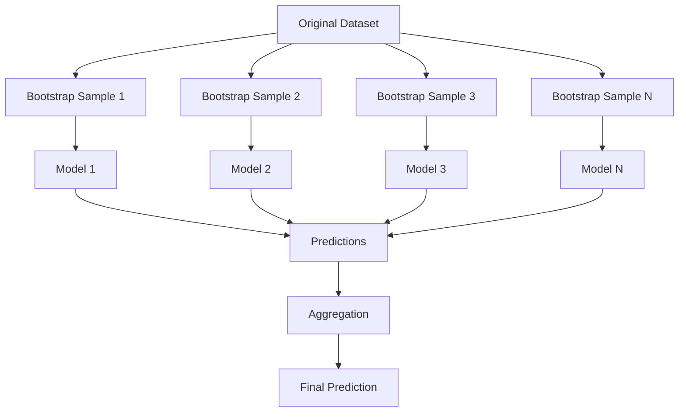
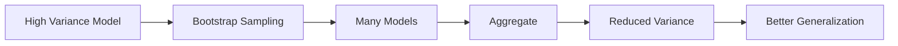
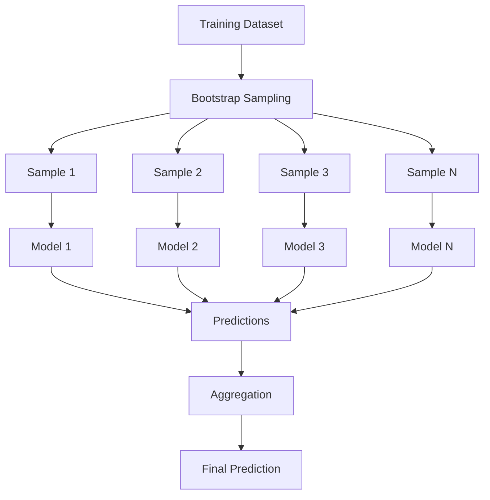
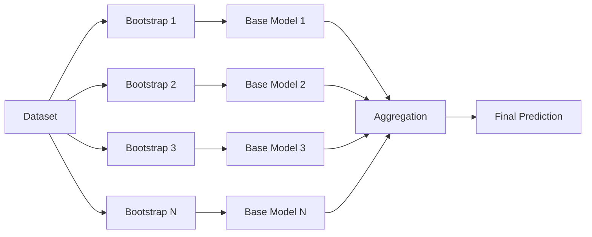
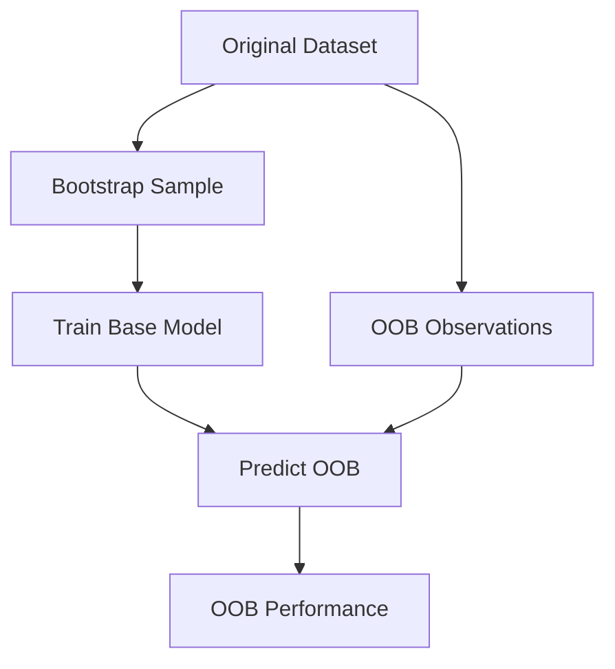
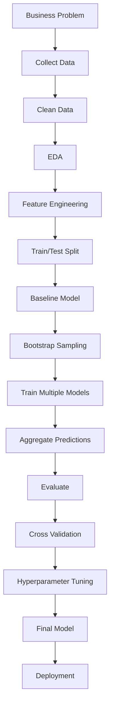
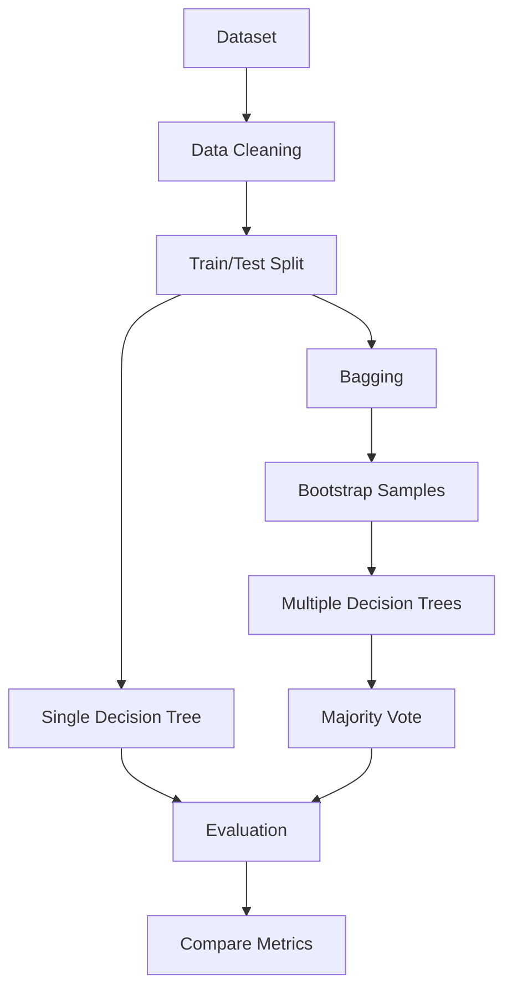
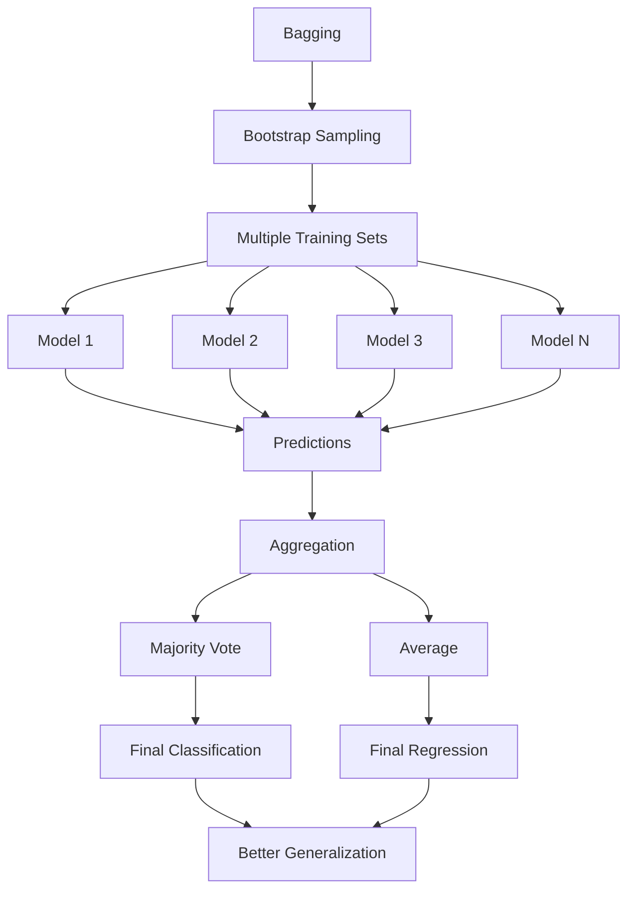

# 🎒 Bagging in Machine Learning

> **Bagging (Bootstrap Aggregating)** is an ensemble learning technique that trains multiple models independently on different bootstrap samples and combines their predictions to reduce variance and improve generalization.

## 📚 Table of Contents

1. [Introduction](#1-introduction)
2. [Ensemble Learning](#2-ensemble-learning)
3. [What Is Bagging](#3-what-is-bagging)
4. [Why Bagging](#4-why-bagging)
5. [Bias and Variance](#5-bias-and-variance)
6. [Bootstrap Sampling](#6-bootstrap-sampling)
7. [How Bagging Works](#7-how-bagging-works)
8. [Architecture](#8-architecture)
9. [Aggregation](#9-aggregation)
10. [Bagging for Classification](#10-bagging-for-classification)
11. [Bagging for Regression](#11-bagging-for-regression)
12. [Bagging vs Decision Tree](#12-bagging-vs-decision-tree)
13. [Bagging vs Random Forest](#13-bagging-vs-random-forest)
14. [Bagging vs Boosting](#14-bagging-vs-boosting)
15. [BaggingClassifier](#15-baggingclassifier)
16. [BaggingRegressor](#16-baggingregressor)
17. [Hyperparameters](#17-hyperparameters)
18. [Out-of-Bag Samples](#18-out-of-bag-samples)
19. [OOB Evaluation](#19-oob-evaluation)
20. [Practical Classification Example](#20-practical-classification-example)
21. [Practical Regression Example](#21-practical-regression-example)
22. [Evaluation](#22-evaluation)
23. [Cross-Validation](#23-cross-validation)
24. [Hyperparameter Tuning](#24-hyperparameter-tuning)
25. [Feature Sampling](#25-feature-sampling)
26. [Workflow](#26-workflow)
27. [Use Cases](#27-use-cases)
28. [Advantages](#28-advantages)
29. [Limitations](#29-limitations)
30. [Common Mistakes](#30-common-mistakes)
31. [Best Practices](#31-best-practices)
32. [Advanced Concepts](#32-advanced-concepts)
33. [Mini Project](#33-mini-project)
34. [Interview Questions](#34-interview-questions)
35. [Quick Revision](#35-quick-revision)
36. [Visual Summary](#36-visual-summary)

---

# 1. Introduction 🚀

A single Machine Learning model can be unstable, especially a high-variance model such as a deep Decision Tree.

A small change in training data may produce a very different model.

**Bagging** addresses this by:

```text
Training Data
     ↓
Bootstrap Samples
     ↓
Multiple Independent Models
     ↓
Aggregate Predictions
     ↓
Final Prediction
```

### Core Idea

> **Train many models independently on different bootstrap samples and aggregate their predictions.**

---

# 2. Ensemble Learning 🧩

Ensemble Learning combines multiple models to create a stronger predictive system.

| Technique | Main Idea |
|---|---|
| Voting | Combine model predictions |
| Bagging | Bootstrap samples + aggregation |
| Random Forest | Tree bagging + random feature selection |
| Boosting | Sequential error correction |
| Stacking | Meta-model learns to combine predictions |
| Blending | Holdout predictions + meta-model |

Bagging is one of the fundamental ensemble techniques.

---

# 3. What Is Bagging? 🎒

**Bagging = Bootstrap Aggregating**

It has two major steps:

```text
Bootstrap
   +
Aggregation
   =
Bagging
```

### Bootstrap

Create multiple datasets by sampling observations **with replacement**.

### Aggregation

Combine predictions from all trained models.



---

# 4. Why Bagging? 🤔

A single high-variance model may overfit.

Example:

```text
Training Data
      ↓
Deep Decision Tree
      ↓
Complex rules
      ↓
Low training error
      ↓
High variance
      ↓
Possible overfitting
```

Bagging trains multiple versions of the model and averages their behavior.

### Main Objective

> **Reduce variance while maintaining useful predictive power.**

---

# 5. Bias and Variance 📊

## Bias

Bias is error caused by overly simple assumptions.

```text
High Bias
   ↓
Underfitting
```

## Variance

Variance measures how much the model changes when the training data changes.

```text
High Variance
   ↓
Overfitting
```

## Effect of Bagging



### Important

Bagging primarily reduces **variance**, not bias.

---

# 6. Bootstrap Sampling 🔄

Bootstrap sampling means:

> **Sampling with replacement.**

Original dataset:

```text
[1, 2, 3, 4, 5]
```

Possible bootstrap samples:

```text
[1, 2, 2, 4, 5]
[3, 3, 1, 5, 2]
[4, 1, 4, 2, 5]
```

Notice:

- Samples have the same size as the original dataset.
- Observations can repeat.
- Some observations may be absent.

### Example

Original:

```text
1 2 3 4 5 6 7 8 9 10
```

Bootstrap:

```text
1 2 2 5 6 7 7 9 10 10
```

Omitted observations:

```text
3 4 8
```

Those are OOB observations for this sample.

---

# 7. How Bagging Works ⚙️

### Step-by-Step

```text
Step 1 → Start with training data
Step 2 → Create bootstrap samples
Step 3 → Train one base model per sample
Step 4 → Repeat for many models
Step 5 → Generate predictions
Step 6 → Aggregate predictions
Step 7 → Evaluate
```



### Key Characteristics

```text
Independent models
+
Bootstrap sampling
+
Parallel training
+
Aggregation
```

---

# 8. Architecture 🏗️



---

# 9. Aggregation 🧮

The aggregation method depends on the task.

## Classification

Use **majority voting**.

```text
Model 1 → A
Model 2 → B
Model 3 → A
Model 4 → A
Model 5 → B

A = 3
B = 2

Final = A
```

## Regression

Use the average.

```text
Model 1 → 100
Model 2 → 110
Model 3 → 105
Model 4 → 95

Average = 102.5
```

---

# 10. Bagging for Classification 🗳️

For classification:

$$
\hat{y}=mode(h_1(x),h_2(x),...,h_M(x))
$$

where:

- $h_i(x)$ = prediction from model $i$
- $M$ = number of models
- $\hat{y}$ = final prediction

Example:

```text
Tree 1 → Benign
Tree 2 → Malignant
Tree 3 → Benign
Tree 4 → Benign
Tree 5 → Malignant

Benign = 3
Malignant = 2

Final = Benign
```

---

# 11. Bagging for Regression 📈

For regression:

$$
\hat{y}=\frac{1}{M}\sum_{i=1}^{M}h_i(x)
$$

Example:

```text
Model 1 → 50
Model 2 → 60
Model 3 → 55
Model 4 → 65

Final = (50 + 60 + 55 + 65) / 4
      = 57.5
```

---

# 12. Bagging vs Decision Tree 🌳

| Feature | Decision Tree | Bagging |
|---|---|---|
| Models | 1 | Many |
| Training data | Original | Bootstrap samples |
| Variance | Often high | Lower |
| Stability | Lower | Higher |
| Interpretability | High | Lower |
| Overfitting risk | Can be high | Usually reduced |
| Prediction | Single tree | Aggregated models |

---

# 13. Bagging vs Random Forest 🌲

Random Forest is a specialized tree-based ensemble related closely to bagging.

### Bagging

```text
Bootstrap samples
      ↓
Decision Trees
      ↓
Aggregation
```

### Random Forest

```text
Bootstrap samples
      +
Random feature selection
      ↓
Decision Trees
      ↓
Aggregation
```

| Feature | Bagging | Random Forest |
|---|---|---|
| Bootstrap sampling | Usually | Usually |
| Multiple trees | Yes with tree estimator | Yes |
| Random feature selection | Configurable | Core idea |
| Main goal | Reduce variance | Reduce variance + tree correlation |
| Diversity | High | Usually higher |

> **Random Forest can be understood as an enhanced tree-based bagging approach with random feature selection.**

---

# 14. Bagging vs Boosting ⚔️

| Feature | Bagging | Boosting |
|---|---|---|
| Training | Parallel/independent | Sequential |
| Samples | Bootstrap | Reweighted/residual-focused |
| Model dependency | Mostly independent | Sequential |
| Main goal | Reduce variance | Often reduce bias / fit residuals |
| Noise sensitivity | Usually lower | Can be higher |
| Examples | Bagging, Random Forest | AdaBoost, Gradient Boosting, XGBoost |

### Memory Trick

```text
BAGGING
→ Independent models
→ Aggregate

BOOSTING
→ Sequential models
→ Correct previous errors
```

---

# 15. BaggingClassifier 🐍

Scikit-learn provides:

```python
BaggingClassifier
```

### Import

```python
from sklearn.ensemble import BaggingClassifier
```

### Basic Example

```python
from sklearn.tree import DecisionTreeClassifier
from sklearn.ensemble import BaggingClassifier

model = BaggingClassifier(
    estimator=DecisionTreeClassifier(
        random_state=42
    ),
    n_estimators=100,
    random_state=42,
    n_jobs=-1
)

model.fit(X_train, y_train)

y_pred = model.predict(X_test)
```

---

# 16. BaggingRegressor 📈

For regression:

```python
from sklearn.tree import DecisionTreeRegressor
from sklearn.ensemble import BaggingRegressor

model = BaggingRegressor(
    estimator=DecisionTreeRegressor(
        random_state=42
    ),
    n_estimators=100,
    random_state=42,
    n_jobs=-1
)

model.fit(X_train, y_train)

y_pred = model.predict(X_test)
```

---

# 17. Hyperparameters ⚙️

| Parameter | Purpose |
|---|---|
| `estimator` | Base model |
| `n_estimators` | Number of base models |
| `max_samples` | Samples used by each model |
| `max_features` | Features used by each model |
| `bootstrap` | Sampling observations with replacement |
| `bootstrap_features` | Sampling features with replacement |
| `oob_score` | Calculate OOB score |
| `n_jobs` | Parallel jobs |
| `random_state` | Reproducibility |

### Example

```python
BaggingClassifier(
    estimator=DecisionTreeClassifier(),
    n_estimators=200,
    max_samples=0.8,
    max_features=0.8,
    bootstrap=True,
    random_state=42,
    n_jobs=-1
)
```

---

# 18. Out-of-Bag Samples 🎯

Because bootstrap sampling uses replacement, some observations are not selected for a particular model.

These observations are called **Out-of-Bag (OOB)** samples.

Example:

```text
Original:
1 2 3 4 5 6 7 8 9 10

Bootstrap:
1 2 2 4 5 5 7 9 10 10

OOB:
3 6 8
```

The OOB samples can be used to evaluate that model.

---

# 19. OOB Evaluation 📊



### Code

```python
from sklearn.ensemble import BaggingClassifier
from sklearn.tree import DecisionTreeClassifier

model = BaggingClassifier(
    estimator=DecisionTreeClassifier(
        random_state=42
    ),
    n_estimators=200,
    bootstrap=True,
    oob_score=True,
    random_state=42,
    n_jobs=-1
)

model.fit(X_train, y_train)

print("OOB Score:", model.oob_score_)
```

OOB evaluation provides an internal estimate of generalization performance for suitable bagging configurations.

---

# 20. Practical Classification Example 💻

## Dataset

Use the **Breast Cancer Wisconsin Diagnostic Dataset**.

### Step 1: Import

```python
import pandas as pd

from sklearn.model_selection import train_test_split
from sklearn.tree import DecisionTreeClassifier
from sklearn.ensemble import BaggingClassifier

from sklearn.metrics import (
    accuracy_score,
    classification_report,
    confusion_matrix
)
```

### Step 2: Load Data

```python
df = pd.read_csv(
    "Breast Cancer Wisconsin (Diagnostic) Data Set.csv"
)

print(df.head())
print(df.shape)
print(df.columns)
```

### Step 3: Prepare Data

Adjust the target column if your CSV uses a different name.

```python
df = df.dropna()

target_column = "diagnosis"

X = df.drop(columns=[target_column])
y = df[target_column]

if "id" in X.columns:
    X = X.drop(columns=["id"])

y = y.map({
    "M": 1,
    "B": 0
})
```

### Step 4: Split

```python
X_train, X_test, y_train, y_test = train_test_split(
    X,
    y,
    test_size=0.2,
    random_state=42,
    stratify=y
)
```

### Step 5: Base Model

```python
base_tree = DecisionTreeClassifier(
    random_state=42
)
```

### Step 6: Bagging Model

```python
bagging_model = BaggingClassifier(
    estimator=base_tree,
    n_estimators=200,
    bootstrap=True,
    random_state=42,
    n_jobs=-1
)
```

### Step 7: Train

```python
bagging_model.fit(
    X_train,
    y_train
)
```

### Step 8: Predict

```python
y_pred = bagging_model.predict(
    X_test
)
```

### Step 9: Evaluate

```python
print(
    "Accuracy:",
    accuracy_score(y_test, y_pred)
)

print(
    classification_report(
        y_test,
        y_pred
    )
)

print(
    "Confusion Matrix:"
)

print(
    confusion_matrix(
        y_test,
        y_pred
    )
)
```

---

# 21. Practical Regression Example 📈

```python
from sklearn.tree import DecisionTreeRegressor
from sklearn.ensemble import BaggingRegressor

from sklearn.metrics import (
    mean_absolute_error,
    mean_squared_error,
    r2_score
)

base_tree = DecisionTreeRegressor(
    random_state=42
)

bagging = BaggingRegressor(
    estimator=base_tree,
    n_estimators=200,
    bootstrap=True,
    random_state=42,
    n_jobs=-1
)

bagging.fit(
    X_train,
    y_train
)

y_pred = bagging.predict(
    X_test
)

mae = mean_absolute_error(
    y_test,
    y_pred
)

mse = mean_squared_error(
    y_test,
    y_pred
)

rmse = mse ** 0.5

r2 = r2_score(
    y_test,
    y_pred
)

print("MAE:", mae)
print("MSE:", mse)
print("RMSE:", rmse)
print("R²:", r2)
```

---

# 22. Evaluation 📊

Always compare the base model against the Bagging model.

```text
Single Decision Tree
        vs
Bagging + Decision Trees
```

### Classification Metrics

```python
from sklearn.metrics import (
    accuracy_score,
    precision_score,
    recall_score,
    f1_score
)
```

### Comparison

```python
models = {
    "Decision Tree": DecisionTreeClassifier(
        random_state=42
    ),
    "Bagging": BaggingClassifier(
        estimator=DecisionTreeClassifier(
            random_state=42
        ),
        n_estimators=200,
        random_state=42,
        n_jobs=-1
    )
}

results = []

for name, model in models.items():

    model.fit(X_train, y_train)

    y_pred = model.predict(X_test)

    results.append({
        "Model": name,
        "Accuracy": accuracy_score(
            y_test, y_pred
        ),
        "Precision": precision_score(
            y_test, y_pred
        ),
        "Recall": recall_score(
            y_test, y_pred
        ),
        "F1": f1_score(
            y_test, y_pred
        )
    })

results_df = pd.DataFrame(results)

print(
    results_df.sort_values(
        "F1",
        ascending=False
    )
)
```

---

# 23. Cross-Validation 🔄

```python
from sklearn.model_selection import cross_val_score

scores = cross_val_score(
    bagging_model,
    X_train,
    y_train,
    cv=5,
    scoring="accuracy",
    n_jobs=-1
)

print("CV Scores:", scores)
print("Mean:", scores.mean())
print("Std:", scores.std())
```

Cross-validation helps determine whether performance is consistent across different training/validation splits.

---

# 24. Hyperparameter Tuning 🔧

Important parameters include:

```text
n_estimators
max_samples
max_features
estimator parameters
```

Example:

```python
from sklearn.model_selection import GridSearchCV

bagging = BaggingClassifier(
    estimator=DecisionTreeClassifier(
        random_state=42
    ),
    random_state=42,
    n_jobs=-1
)

param_grid = {
    "n_estimators": [50, 100, 200],
    "max_samples": [0.5, 0.8, 1.0],
    "max_features": [0.5, 0.8, 1.0],
    "estimator__max_depth": [
        None,
        5,
        10
    ]
}

grid = GridSearchCV(
    bagging,
    param_grid=param_grid,
    cv=5,
    scoring="f1",
    n_jobs=-1
)

grid.fit(
    X_train,
    y_train
)

print("Best Parameters:", grid.best_params_)
print("Best CV Score:", grid.best_score_)
```

---

# 25. Feature Sampling 🎲

Bagging can introduce additional diversity through feature sampling.

```python
model = BaggingClassifier(
    estimator=DecisionTreeClassifier(),
    n_estimators=100,
    max_samples=0.8,
    max_features=0.7,
    random_state=42
)
```

Conceptually:

```text
Random observations
       +
Random features
       ↓
Different base models
       ↓
Greater diversity
```

This idea is closely related to the design of Random Forest.

---

# 26. Workflow 🔄



### Learning Path

```text
Decision Tree
      ↓
Overfitting
      ↓
Variance
      ↓
Bootstrap Sampling
      ↓
Bagging
      ↓
OOB Evaluation
      ↓
Random Forest
```

---

# 27. Real-World Use Cases 🌍

| Domain | Example |
|---|---|
| Healthcare | Disease classification |
| Banking | Credit risk |
| Finance | Fraud detection |
| Manufacturing | Defect detection |
| Marketing | Customer classification |
| Cybersecurity | Intrusion detection |
| Agriculture | Crop classification |
| Insurance | Claim prediction |
| Education | Student outcome prediction |
| E-commerce | Customer churn |

---

# 28. Advantages ✅

- **Reduces variance:** especially effective for high-variance learners.
- **Improves stability:** less sensitive to one particular training sample.
- **Parallelizable:** independent models can often be trained simultaneously.
- **Robust:** individual model errors have less impact.
- **Flexible:** can wrap many suitable estimators.
- **Works for classification and regression.**
- **Simple concept:** Bootstrap → Train → Aggregate.
- **Can use OOB evaluation** when configured appropriately.

---

# 29. Limitations ⚠️

- More computational cost than a single model.
- Higher memory usage.
- Lower interpretability.
- Does not primarily solve high bias.
- May provide little benefit for already-stable models.
- Inference can be slower with many estimators.
- More models mean more deployment complexity.

---

# 30. Common Mistakes ❌

### 1. Assuming Bagging Always Improves Accuracy

It is most useful when the base learner has meaningful variance.

### 2. Confusing Bagging With Boosting

```text
Bagging  → Independent / parallel
Boosting → Sequential
```

### 3. Ignoring the Base Estimator

The base learner strongly affects ensemble performance.

### 4. Blindly Increasing `n_estimators`

More models increase computation and eventually provide diminishing returns.

### 5. Ignoring OOB Evaluation

OOB performance can be useful for suitable bagging configurations.

### 6. Data Leakage

Fit preprocessing only on training data, especially inside cross-validation.

### 7. Evaluating Only Training Accuracy

Always evaluate on unseen data.

---

# 31. Best Practices 🏆

1. Start with a baseline.
2. Choose a high-variance base learner when variance reduction is the goal.
3. Use enough estimators to stabilize performance.
4. Use `random_state` for reproducibility.
5. Use `n_jobs=-1` when parallel computation is appropriate.
6. Compare Bagging against the original model.
7. Use cross-validation.
8. Consider OOB evaluation.
9. Tune `max_samples` and `max_features`.
10. Analyze the bias-variance trade-off.
11. Use appropriate metrics.
12. Avoid data leakage.
13. Consider Random Forest for tree-based bagging.
14. Balance accuracy gains against inference cost.

---

# 32. Advanced Concepts 🔥

## 32.1 Why Averaging Reduces Variance

For independent models with variance $\sigma^2$:

$$
Var(\bar{X})=\frac{\sigma^2}{M}
$$

As the number of models increases, the variance of the average can decrease.

Real models are correlated, so the actual improvement depends on their error correlation.

---

## 32.2 Model Correlation

```text
Low error correlation
        ↓
Greater benefit from aggregation

High error correlation
        ↓
Smaller benefit
```

Therefore:

> **Accuracy + Diversity are both important.**

---

## 32.3 Bias-Variance Trade-off

Bagging mainly addresses:

```text
High Variance
```

It is less effective for:

```text
High Bias
```

Example:

```text
Very shallow tree
      ↓
High Bias
      ↓
Bagging may not fix the underlying problem
```

---

## 32.4 Feature Subsampling

Adding feature randomness can increase diversity:

```text
Bootstrap rows
       +
Feature subsets
       ↓
Diverse models
       ↓
Aggregation
```

---

## 32.5 OOB as Internal Validation

Each bootstrap sample leaves out some observations.

Those observations can be used as validation examples for the corresponding model.

```text
Bootstrap sample
      ↓
Train model
      ↓
OOB observations
      ↓
Predict
      ↓
OOB estimate
```

---

## 32.6 Parallelization

Bagging models are largely independent:

```text
Model 1 ─┐
Model 2 ─┤
Model 3 ─┼──→ Parallel Training
Model 4 ─┤
Model N ─┘
```

This makes bagging naturally suitable for parallel computing.

---

## 32.7 Bagging With Other Base Learners

Although Decision Trees are common, BaggingClassifier/Regressor can wrap other suitable estimators.

Examples:

```text
Decision Trees
KNN
SVM
Other estimators
```

The benefit depends on the variance and stability of the chosen base learner.

---

# 33. Mini Project 🛠️

## Project: Decision Tree vs Bagging

### Objective

Determine whether Bagging improves the performance and stability of a Decision Tree.

### Dataset

Use:

```text
Breast Cancer Wisconsin Diagnostic Dataset
```

### Experiments

```text
Experiment 1 → Single Decision Tree
Experiment 2 → Bagging + Decision Trees
Experiment 3 → Different n_estimators
Experiment 4 → Different max_samples
Experiment 5 → Feature sampling
Experiment 6 → OOB evaluation
```

### Architecture



### Questions

1. Does Bagging improve test performance?
2. Does it reduce the train-test performance gap?
3. How does `n_estimators` affect performance?
4. How does `max_samples` affect performance?
5. Does feature sampling improve diversity?
6. What is the OOB score?
7. Does Bagging consistently outperform a single tree under cross-validation?

---

# 34. Interview Questions 🎤

### Q1. What is Bagging?

Bagging, or Bootstrap Aggregating, trains multiple models on bootstrap samples and combines their predictions.

### Q2. What is bootstrap sampling?

Sampling observations with replacement.

### Q3. What is the main purpose of Bagging?

Primarily reducing variance and improving generalization.

### Q4. Does Bagging reduce bias?

Not primarily. Its main benefit is variance reduction.

### Q5. How are predictions aggregated?

Classification uses majority voting; regression generally uses averaging.

### Q6. What is an OOB sample?

An observation not selected in the bootstrap sample for a particular base model.

### Q7. What is OOB score?

An internal estimate of performance obtained from OOB observations.

### Q8. Bagging vs Random Forest?

Random Forest adds random feature selection to tree-based bagging.

### Q9. Bagging vs Boosting?

Bagging trains models independently; boosting trains models sequentially.

### Q10. Why are Decision Trees good base estimators?

They can have high variance and change substantially with different training data, making them suitable for variance reduction through aggregation.

### Q11. Can Bagging be used for regression?

Yes, with `BaggingRegressor`.

### Q12. Can Bagging be parallelized?

Yes. Since base learners are largely independent, they can often be trained in parallel.

---

# 35. Quick Revision ⚡📌

## Key Definitions

| Concept | Definition |
|---|---|
| Bagging | Bootstrap Aggregating |
| Bootstrap | Sampling with replacement |
| Base Learner | Individual model |
| Aggregation | Combining model predictions |
| OOB | Out-of-Bag observations |
| BaggingClassifier | Bagging for classification |
| BaggingRegressor | Bagging for regression |
| Random Forest | Tree bagging + random feature selection |
| Main Benefit | Variance reduction |

## Core Formulas

### Classification

$$
\hat{y}=mode(h_1(x),h_2(x),...,h_M(x))
$$

### Regression

$$
\hat{y}=\frac{1}{M}\sum_{i=1}^{M}h_i(x)
$$

### Variance Intuition

$$
Var(\bar{X})\approx\frac{\sigma^2}{M}
$$

for independent predictions.

## Essential Imports

```python
from sklearn.ensemble import (
    BaggingClassifier,
    BaggingRegressor
)

from sklearn.tree import (
    DecisionTreeClassifier,
    DecisionTreeRegressor
)
```

## Classification

```python
model = BaggingClassifier(
    estimator=DecisionTreeClassifier(
        random_state=42
    ),
    n_estimators=200,
    bootstrap=True,
    random_state=42,
    n_jobs=-1
)

model.fit(X_train, y_train)
y_pred = model.predict(X_test)
```

## Regression

```python
model = BaggingRegressor(
    estimator=DecisionTreeRegressor(
        random_state=42
    ),
    n_estimators=200,
    bootstrap=True,
    random_state=42,
    n_jobs=-1
)

model.fit(X_train, y_train)
y_pred = model.predict(X_test)
```

## Important Parameters

```text
estimator
n_estimators
max_samples
max_features
bootstrap
bootstrap_features
oob_score
n_jobs
random_state
```

---

# 36. Visual Summary 🗺️



## 🧠 Final Mental Model

```text
                 BAGGING
                    │
                    ↓
            Bootstrap Sampling
                    │
       ┌────────────┼────────────┐
       ↓            ↓            ↓
    Sample 1     Sample 2     Sample N
       ↓            ↓            ↓
    Model 1      Model 2      Model N
       └────────────┼────────────┘
                    ↓
               Predictions
                    ↓
                Aggregate
                    ↓
          ┌─────────┴─────────┐
          ↓                   ↓
   Classification        Regression
   Majority Vote            Average
          └─────────┬─────────┘
                    ↓
             Final Prediction
                    ↓
             Lower Variance
                    ↓
          Better Generalization
```

---

# 🎓 Final Takeaway

The complete Bagging concept can be remembered as:

```text
                    DATASET
                       │
                       ↓
              Bootstrap Sampling
                       │
          ┌────────────┼────────────┐
          ↓            ↓            ↓
       Sample 1     Sample 2     Sample N
          ↓            ↓            ↓
       Model 1      Model 2      Model N
          └────────────┼────────────┘
                       ↓
                  Predictions
                       ↓
                  Aggregation
                       ↓
             Final Prediction
                       ↓
               Reduced Variance
                       ↓
              Better Generalization
```

> 🎒 **Bagging = Bootstrap + Aggregation**

> 🔄 **Bootstrap = Sampling with replacement**

> 🌳 **Bagging is especially useful for high-variance models such as Decision Trees.**

> 🗳️ **Classification → Majority Vote**

> 📈 **Regression → Average**

> 🎯 **OOB samples can provide an internal performance estimate.**

> 🌲 **Random Forest extends tree-based bagging with random feature selection.**

> ⚔️ **Bagging is independent/parallel; Boosting is sequential.**

> 🧠 **Main goal = Reduce Variance and Improve Generalization.**
