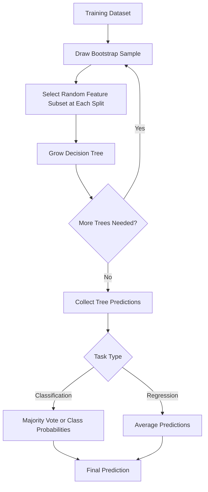
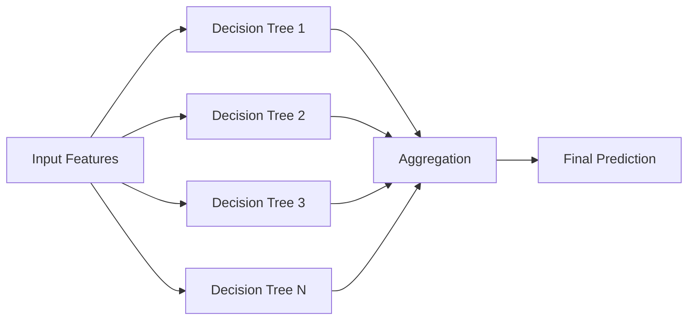
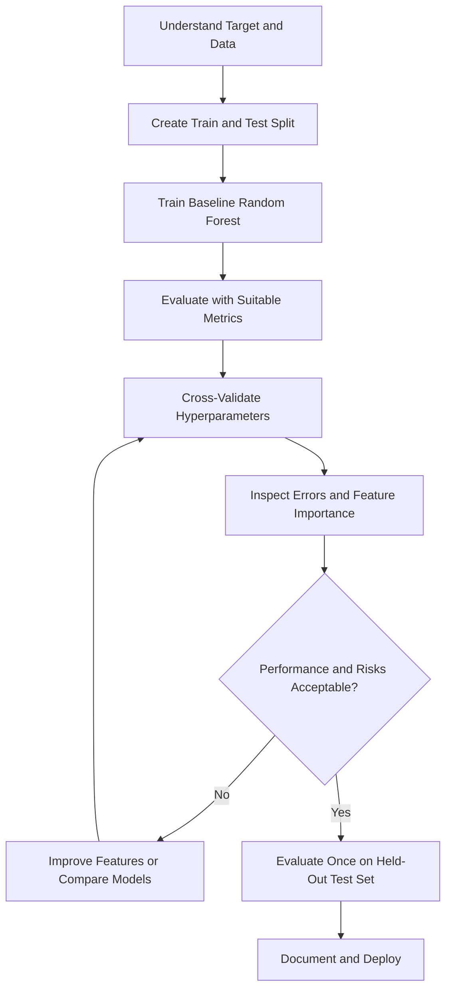
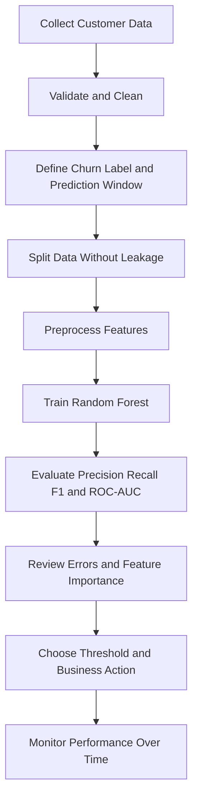
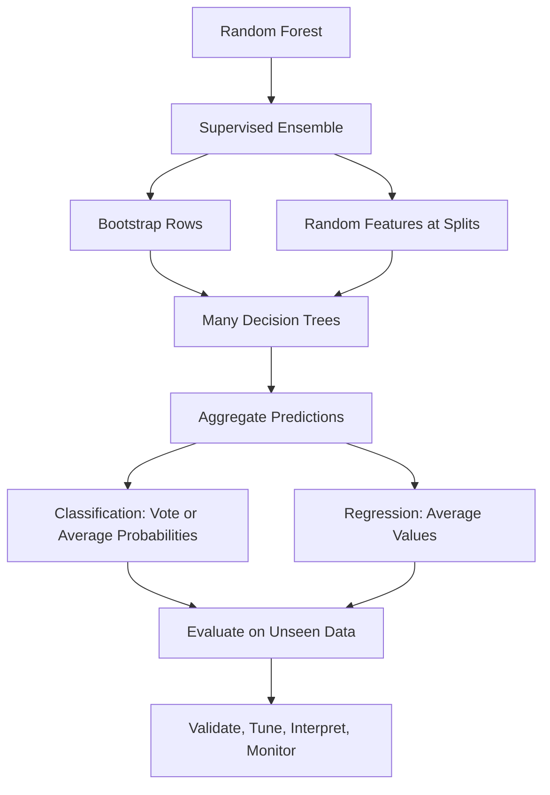

# 🌳 Random Forest in Machine Learning

## 📚 Table of Contents

1. [Introduction](#1--introduction)
2. [Why Random Forest?](#2--why-random-forest)
3. [Core Terminology](#3--core-terminology)
4. [How Random Forest Works](#4--how-random-forest-works)
5. [Architecture and Workflow](#5--architecture-and-workflow)
6. [Bagging and Random Feature Selection](#6--bagging-and-random-feature-selection)
7. [Random Forest for Classification and Regression](#7--random-forest-for-classification-and-regression)
8. [Important Hyperparameters](#8--important-hyperparameters)
9. [Practical Example: Classification](#9--practical-example-classification)
10. [Practical Example: Regression](#10--practical-example-regression)
11. [Model Evaluation](#11--model-evaluation)
12. [Feature Importance and Interpretation](#12--feature-importance-and-interpretation)
13. [Out-of-Bag Evaluation](#13--out-of-bag-evaluation)
14. [Advantages](#14--advantages)
15. [Limitations](#15--limitations)
16. [Use Cases and Real-World Examples](#16--use-cases-and-real-world-examples)
17. [Best Practices](#17--best-practices)
18. [Common Mistakes](#18--common-mistakes)
19. [Advanced Concepts](#19--advanced-concepts)
20. [Random Forest vs Other Algorithms](#20--random-forest-vs-other-algorithms)
21. [Mini-Project: Customer Churn Prediction](#21--mini-project-customer-churn-prediction)
22. [Interview Questions and Answers](#22--interview-questions-and-answers)
23. [Quick Revision](#23--quick-revision)

---

## 1. 🎯 Introduction

**Random Forest** is a supervised machine learning algorithm that combines many decision trees to make a prediction. It can be used for both **classification** and **regression**.

It is an **ensemble learning** method. Instead of relying on one decision tree, it trains multiple trees on slightly different samples of the training data and combines their predictions.

- **Classification:** predicts a category, such as spam/not spam or churn/stay.
- **Regression:** predicts a numeric value, such as house price or delivery time.
- **Main idea:** many diverse trees working together often generalize better than a single tree.

### 1.1 A simple analogy

Imagine asking 100 people to estimate whether a customer will leave a service. Each person has different experience and sees a slightly different sample of information. Combining their opinions may produce a more reliable answer than trusting just one person. Random Forest applies a similar idea using decision trees.

### 1.2 Formal definition

Random Forest is an ensemble of decision trees built using **bootstrap samples** of the training data and **random subsets of features** considered at each split. Predictions from the trees are aggregated to produce the final output.

---

## 2. 🤔 Why Random Forest?

A single decision tree can learn complex patterns, but it can also change significantly when the training data changes. This is called **high variance**.

Random Forest reduces this instability by averaging or voting across many trees.

| Single Decision Tree | Random Forest |
|---|---|
| Uses one tree | Uses many trees |
| Easy to visualize | Harder to interpret as a whole |
| Can have high variance | Usually reduces variance |
| Often trains quickly | Usually requires more computation |
| May overfit deeply | Aggregation often improves generalization |
| One set of split decisions | Trees use different samples and feature subsets |

Random Forest is especially useful when the dataset contains nonlinear relationships and feature interactions that may be difficult to capture with a simple linear model.

---

## 3. 🧠 Core Terminology

| Term | Meaning |
|---|---|
| **Ensemble learning** | Combining multiple models to produce a stronger overall model |
| **Decision tree** | A model that recursively splits data using feature-based rules |
| **Bootstrap sampling** | Sampling rows from a dataset **with replacement** |
| **Bagging** | Training models on bootstrap samples and aggregating their predictions |
| **Feature randomness** | Considering a random subset of features at each split |
| **Node** | A point in a tree where a decision or prediction is made |
| **Root node** | The first node in a decision tree |
| **Leaf node** | A terminal node that provides a prediction |
| **Impurity** | A measure of how mixed the target classes are within a node |
| **Gini impurity** | A common classification split criterion |
| **Entropy** | Another measure of class uncertainty |
| **Mean squared error (MSE)** | A common regression split criterion |
| **Hyperparameter** | A setting chosen before or during model selection, such as tree count or depth |
| **Overfitting** | Learning training-specific noise instead of general patterns |
| **Out-of-bag (OOB) sample** | A training row not selected for a particular tree's bootstrap sample |
| **Generalization** | Performance on previously unseen data |

---

## 4. ⚙️ How Random Forest Works

A typical Random Forest training process follows these steps:

1. Start with a training dataset containing rows and features.
2. Draw a bootstrap sample for the first tree.
3. Grow a decision tree using that sample.
4. At each split, randomly select a subset of available features as split candidates.
5. Choose the best split from those candidates according to the selected criterion.
6. Repeat the process to train many trees.
7. Aggregate the predictions from all trees.

### 4.1 Workflow diagram



### 4.2 Prediction in classification

Suppose five trees predict whether a transaction is fraudulent:

| Tree | Prediction |
|---|---|
| Tree 1 | Fraud |
| Tree 2 | Legitimate |
| Tree 3 | Fraud |
| Tree 4 | Fraud |
| Tree 5 | Legitimate |

Fraud receives 3 votes and Legitimate receives 2. With majority voting, the final prediction is **Fraud**.

For class probabilities, a common implementation averages the class-probability estimates from the individual trees and then selects the class with the highest average probability.

### 4.3 Prediction in regression

Suppose three trees predict a house price:

- Tree 1: ₹48 lakh
- Tree 2: ₹52 lakh
- Tree 3: ₹50 lakh

The average prediction is:

\[
\hat{y} = \frac{48 + 52 + 50}{3} = 50
\]

The Random Forest prediction is **₹50 lakh**.

---

## 5. 🏗️ Architecture and Workflow

A Random Forest contains many trees. The trees are generally trained independently, which makes training easy to parallelize.



### 5.1 Training vs inference

| Stage | What happens |
|---|---|
| Training | Bootstrap samples are created, and trees are fitted |
| Validation | Hyperparameters and generalization performance are assessed |
| Inference | A new row is passed through each tree |
| Aggregation | Votes, probabilities, or numeric predictions are combined |

---

## 6. 🎲 Bagging and Random Feature Selection

Random Forest combines two sources of randomness.

### 6.1 Bootstrap aggregation (bagging)

Bagging means **Bootstrap Aggregating**.

Suppose the original dataset contains rows A, B, C, D, and E. A bootstrap sample might be:

`A, C, C, D, E`

Because sampling is performed with replacement, a row can appear more than once and another row may be omitted.

Each tree receives a different bootstrap sample. Aggregating the resulting models tends to reduce variance.

### 6.2 Random feature selection

At each split, the algorithm considers only a random subset of the available features rather than every feature.

This helps make trees less correlated. If every tree repeatedly used the same strongest feature at the top, the trees could end up making very similar predictions.

### 6.3 Why both matter

| Mechanism | Main purpose |
|---|---|
| Bootstrap sampling | Makes training samples different |
| Random feature subsets | Makes split decisions less alike |
| Aggregation | Reduces the impact of individual-tree errors |

### 6.4 Bagging vs Random Forest

| Aspect | Bagging with Decision Trees | Random Forest |
|---|---|---|
| Training samples | Usually bootstrap samples | Usually bootstrap samples |
| Features considered per split | Commonly all features for standard tree bagging | Random subset of features |
| Tree diversity | Primarily from row sampling | From row sampling and feature sampling |
| Main goal | Reduce variance | Reduce variance and tree correlation |

---

## 7. 🌲 Random Forest for Classification and Regression

### 7.1 Classification

Classification predicts a discrete label.

Examples:
- Predict whether an email is spam.
- Classify a tumor as benign or malignant.
- Identify whether a customer is likely to churn.

Common split criteria include:

**Gini impurity**

\[
Gini = 1 - \sum_{i=1}^{K} p_i^2
\]

**Entropy**

\[
Entropy = -\sum_{i=1}^{K} p_i \log_2(p_i)
\]

Here, \(p_i\) is the proportion of class \(i\) in a node and \(K\) is the number of classes. A pure node has Gini impurity and entropy equal to zero.

### 7.2 Regression

Regression predicts a continuous numeric value.

Examples:
- Predict house prices.
- Estimate monthly sales.
- Predict energy consumption.

Regression trees commonly choose splits that reduce squared error or variance within the child nodes. A forest typically averages the predictions of its trees.

### 7.3 Which one should you use?

| Requirement | Estimator |
|---|---|
| Predict a category | `RandomForestClassifier` |
| Predict a numeric quantity | `RandomForestRegressor` |

---

## 8. 🎛️ Important Hyperparameters

Hyperparameters control the forest's complexity, randomness, and computational cost.

| Hyperparameter | Meaning | Practical guidance |
|---|---|---|
| `n_estimators` | Number of trees | More trees can stabilize predictions but increase compute time |
| `criterion` | Split-quality measure | Classification commonly uses Gini or entropy; regression commonly uses squared error |
| `max_depth` | Maximum depth of each tree | Limiting depth can reduce overfitting |
| `min_samples_split` | Minimum samples required to split a node | Higher values create more conservative trees |
| `min_samples_leaf` | Minimum samples allowed in a leaf | Larger values smooth predictions and may reduce overfitting |
| `max_features` | Features considered at each split | Lower values increase randomness; tuning affects bias and variance |
| `bootstrap` | Whether to sample rows with replacement | Usually `True` by default in scikit-learn |
| `max_samples` | Number or fraction of rows sampled per tree when bootstrapping | Can reduce per-tree training cost |
| `class_weight` | Class weighting for classification | Useful when class frequencies are imbalanced |
| `oob_score` | Estimate performance using out-of-bag samples | Requires `bootstrap=True` |
| `n_jobs` | Parallel workers | `-1` uses all available CPU cores supported by the joblib backend |
| `random_state` | Controls randomness for reproducibility | Set a fixed integer when repeatable results are useful |
| `verbose` | Controls training output | Increase when diagnostic progress output is needed |

### 8.1 Choosing `n_estimators`

A larger number of trees often makes predictions more stable, but improvements usually diminish after a point. There is no universal best value. Compare validation performance and runtime.

### 8.2 Choosing `max_features`

For classification, scikit-learn's common default is `"sqrt"`. For regression, the default has historically been `1.0` in recent versions, meaning all features; verify the installed version's documentation because defaults can change.

### 8.3 Bias-variance intuition

- Very restrictive trees may underfit.
- Very deep trees can fit complex patterns but may have high variance individually.
- Averaging diverse trees often reduces variance.
- Hyperparameters should be tuned using validation or cross-validation rather than chosen from training performance alone.

---

## 9. 🧪 Practical Example: Classification

This example uses scikit-learn's Breast Cancer Wisconsin dataset to classify tumors as malignant or benign. It is a demonstration dataset, not a medical diagnostic tool.

### 9.1 Install dependencies

```bash
pip install scikit-learn pandas matplotlib
```

### 9.2 Complete code

```python
from sklearn.datasets import load_breast_cancer
from sklearn.ensemble import RandomForestClassifier
from sklearn.model_selection import train_test_split, cross_val_score
from sklearn.metrics import (
    accuracy_score,
    classification_report,
    confusion_matrix,
    ConfusionMatrixDisplay,
    roc_auc_score,
)
import matplotlib.pyplot as plt

# 1. Load the dataset
data = load_breast_cancer()
X = data.data
y = data.target

# 2. Split into training and test sets
X_train, X_test, y_train, y_test = train_test_split(
    X,
    y,
    test_size=0.20,
    random_state=42,
    stratify=y,
)

# 3. Create the model
model = RandomForestClassifier(
    n_estimators=300,
    max_depth=None,
    min_samples_split=2,
    min_samples_leaf=1,
    max_features="sqrt",
    random_state=42,
    n_jobs=-1,
)

# 4. Train
model.fit(X_train, y_train)

# 5. Predict
y_pred = model.predict(X_test)
y_proba = model.predict_proba(X_test)[:, 1]

# 6. Evaluate
print("Accuracy:", round(accuracy_score(y_test, y_pred), 4))
print("\nClassification report:")
print(classification_report(y_test, y_pred, target_names=data.target_names))
print("Confusion matrix:\n", confusion_matrix(y_test, y_pred))
print("ROC-AUC:", round(roc_auc_score(y_test, y_proba), 4))

# 7. Display confusion matrix
ConfusionMatrixDisplay.from_predictions(
    y_test,
    y_pred,
    display_labels=data.target_names,
    cmap="Blues",
)
plt.title("Random Forest - Confusion Matrix")
plt.tight_layout()
plt.show()

# 8. Show the top 10 impurity-based feature importances
importances = model.feature_importances_
indices = importances.argsort()[::-1][:10]

plt.figure(figsize=(9, 5))
plt.barh(
    [data.feature_names[i] for i in indices][::-1],
    importances[indices][::-1],
)
plt.xlabel("Impurity-based importance")
plt.title("Top 10 Feature Importances")
plt.tight_layout()
plt.show()
```

### 9.3 Explanation

1. `load_breast_cancer()` loads the built-in dataset.
2. `train_test_split()` reserves test data for final evaluation.
3. `stratify=y` helps preserve class proportions across the split.
4. `RandomForestClassifier()` configures the ensemble.
5. `fit()` trains the trees.
6. `predict()` returns class labels.
7. `predict_proba()` returns class probabilities.
8. The metrics summarize different aspects of performance.

**Important:** do not expect a particular score across all environments or configurations. Evaluate the model on held-out data and investigate errors rather than relying on accuracy alone.

---

## 10. 📈 Practical Example: Regression

This example uses scikit-learn's diabetes dataset to predict a continuous disease-progression measure. It is for algorithm learning, not clinical use.

```python
from sklearn.datasets import load_diabetes
from sklearn.ensemble import RandomForestRegressor
from sklearn.model_selection import train_test_split
from sklearn.metrics import mean_absolute_error, mean_squared_error, r2_score
import numpy as np

# Load data
data = load_diabetes()
X = data.data
y = data.target

# Split data
X_train, X_test, y_train, y_test = train_test_split(
    X, y, test_size=0.20, random_state=42
)

# Create and train model
model = RandomForestRegressor(
    n_estimators=300,
    max_depth=None,
    min_samples_leaf=2,
    random_state=42,
    n_jobs=-1,
)
model.fit(X_train, y_train)

# Predict
y_pred = model.predict(X_test)

# Evaluate
mae = mean_absolute_error(y_test, y_pred)
mse = mean_squared_error(y_test, y_pred)
rmse = np.sqrt(mse)
r2 = r2_score(y_test, y_pred)

print(f"MAE:  {mae:.3f}")
print(f"MSE:  {mse:.3f}")
print(f"RMSE: {rmse:.3f}")
print(f"R²:   {r2:.3f}")
```

### 10.1 Regression metrics

- **MAE:** average absolute prediction error; measured in target units.
- **MSE:** average squared error; penalizes larger errors more strongly.
- **RMSE:** square root of MSE; measured in target units.
- **R²:** compares the model with predicting the target mean; it can be negative on test data.

---

## 11. 📊 Model Evaluation

Choose evaluation metrics based on the problem, class balance, and cost of errors.

### 11.1 Classification metrics

| Metric | Formula / meaning | When useful |
|---|---|---|
| Accuracy | Correct predictions / all predictions | Classes are reasonably balanced and error costs are similar |
| Precision | \(TP/(TP+FP)\) | False positives are costly |
| Recall | \(TP/(TP+FN)\) | False negatives are costly |
| F1-score | Harmonic mean of precision and recall | Need a balance between precision and recall |
| ROC-AUC | Ranking quality across classification thresholds | Useful for comparing probability rankings |
| Confusion matrix | Counts of true/false positives/negatives | Understand the kinds of errors |

Where:
- **TP:** true positive
- **TN:** true negative
- **FP:** false positive
- **FN:** false negative

### 11.2 Regression metrics

| Metric | Interpretation |
|---|---|
| MAE | Average absolute error |
| MSE | Average squared error |
| RMSE | Error magnitude in the target's units |
| R² | Improvement relative to predicting the mean, under the R² definition |

### 11.3 Cross-validation

Cross-validation evaluates the model across multiple train/validation splits. Use a pipeline for preprocessing when needed, and keep the final test set separate until model selection is complete.

```python
from sklearn.model_selection import cross_val_score
from sklearn.ensemble import RandomForestClassifier
from sklearn.datasets import load_breast_cancer

data = load_breast_cancer()
model = RandomForestClassifier(
    n_estimators=200,
    random_state=42,
    n_jobs=-1,
)

scores = cross_val_score(
    model,
    data.data,
    data.target,
    cv=5,
    scoring="accuracy",
)

print("Fold scores:", scores)
print("Mean CV accuracy:", scores.mean())
print("Standard deviation:", scores.std())
```

---

## 12. 🔍 Feature Importance and Interpretation

Random Forest offers several ways to investigate which features influence predictions.

### 12.1 Mean decrease in impurity

Scikit-learn exposes impurity-based feature importance through `feature_importances_`. It measures how much a feature contributes to impurity reductions across the forest, aggregated and normalized.

**Limitations:**
- It can favor high-cardinality features.
- Correlated features can share or distort importance.
- It describes importance under the fitted model, not causation.
- It does not tell whether a feature increases or decreases a prediction.

### 12.2 Permutation importance

Permutation importance measures how much a model's score changes when one feature's values are shuffled. It can be calculated on held-out data and is applicable to many model types.

```python
from sklearn.inspection import permutation_importance

result = permutation_importance(
    model,
    X_test,
    y_test,
    n_repeats=10,
    random_state=42,
    n_jobs=-1,
)

for index in result.importances_mean.argsort()[::-1][:10]:
    print(
        f"{data.feature_names[index]}: "
        f"{result.importances_mean[index]:.4f}"
    )
```

Use the appropriate `model`, `X_test`, `y_test`, and feature names from the same fitted experiment.

### 12.3 SHAP and local explanations

SHAP can estimate feature contributions to individual predictions. Tree-specific explainers may be efficient for tree ensembles. Explanations are model-dependent and should be checked for stability and context.

---

## 13. 🧳 Out-of-Bag Evaluation

When bootstrap sampling is enabled, each tree leaves out some training rows. These rows are called **out-of-bag (OOB) samples** for that tree.

A training row can be predicted using only trees for which that row was out-of-bag. Aggregating those predictions provides an OOB estimate without creating a separate validation split for that estimate.

```python
from sklearn.ensemble import RandomForestClassifier
from sklearn.datasets import load_breast_cancer

data = load_breast_cancer()

model = RandomForestClassifier(
    n_estimators=300,
    bootstrap=True,
    oob_score=True,
    random_state=42,
    n_jobs=-1,
)
model.fit(data.data, data.target)

print("OOB score:", model.oob_score_)
```

**Remember:**
- OOB evaluation requires bootstrap sampling.
- OOB score is not a substitute for a final, untouched test set.
- Choose an OOB metric appropriate to the estimator and scikit-learn version.

---

## 14. ✅ Advantages

1. **Strong baseline:** often performs well on structured/tabular data.
2. **Nonlinear modeling:** captures nonlinear relationships and feature interactions.
3. **Reduced variance:** aggregation often makes it more stable than a single tree.
4. **Limited scaling requirements:** tree splits generally do not require standardization.
5. **Mixed feature scales:** numeric features do not need to be on the same scale.
6. **Classification and regression:** supports both task types.
7. **Feature importance tools:** provides built-in impurity importance and works with permutation importance.
8. **Parallel training:** individual trees can be fitted in parallel.
9. **Some resilience to noise:** aggregation can reduce the influence of individual unstable trees.

---

## 15. ⚠️ Limitations

1. **Less interpretable:** hundreds of trees are harder to explain than one small tree.
2. **Memory and latency:** large forests can consume significant memory and slow inference.
3. **Extrapolation limitations:** regression forests usually predict within the range of learned leaf target values and do not extrapolate trends like some regression models.
4. **Imbalanced classes:** default training and metrics may perform poorly on rare classes.
5. **Feature importance pitfalls:** impurity-based importance can be misleading with high-cardinality or correlated features.
6. **Not always the most accurate:** gradient-boosted tree methods can outperform Random Forest on some tabular tasks.
7. **Sparse high-dimensional problems:** linear models or specialized methods may be more suitable in some text and very high-dimensional settings.
8. **Training cost:** fitting many deep trees can be computationally expensive.

---

## 16. 🌍 Use Cases and Real-World Examples

| Domain | Example task | Possible features | Target |
|---|---|---|---|
| Banking | Credit-risk screening | Income, credit history, debt ratio | Risk class or default probability |
| E-commerce | Customer churn | Purchase frequency, tenure, complaints | Churn / no churn |
| Healthcare research | Risk classification | Measurements, history, test values | Defined risk class |
| Agriculture | Yield estimation | Rainfall, soil properties, temperature | Yield amount |
| Real estate | Price estimation | Location attributes, area, rooms | Property price |
| Manufacturing | Predictive maintenance | Vibration, temperature, operating hours | Failure class |
| Cybersecurity | Suspicious transaction detection | Amount, timing, device signals | Fraud / legitimate |
| Transport | Travel-time estimation | Distance, hour, traffic indicators | Travel time |

### Example: Customer churn

A subscription company could use account tenure, support interactions, plan type, and usage frequency to estimate whether a customer may leave. The model can help prioritize outreach, but decisions should consider privacy, fairness, business costs, and the quality of the labels.

### Example: RoadGuard AI

For a road-maintenance workflow, a Random Forest could be used on structured, engineered observations—such as road roughness, weather, traffic, or sensor measurements—to classify maintenance priority. **Image-based pothole detection** is usually better handled by a computer-vision model such as an object detector or segmentation network; Random Forest could support a downstream tabular prioritization stage.

---

## 17. 🧭 Best Practices

- Establish a simple baseline before extensive tuning.
- Keep test data separate from model selection.
- Use stratified splits for classification when appropriate.
- Select metrics that reflect the actual business or safety objective.
- Tune `max_depth`, `min_samples_leaf`, `max_features`, and `n_estimators` with cross-validation.
- Set `random_state` when reproducibility matters.
- Use `n_jobs=-1` when parallel CPU use is appropriate.
- Inspect class balance and use class weights or resampling only when justified.
- Handle missing values according to the chosen estimator and library version; do not assume every version supports every missing-value pattern.
- Check for target leakage, duplicate records, and time-related leakage.
- Compare impurity importance with permutation importance.
- Monitor model quality after deployment as data distributions change.
- Save the fitted preprocessing and model pipeline together.
- Document the training data, target definition, metrics, and model version.

### 17.1 Suggested tuning workflow



---

## 18. 🚫 Common Mistakes

| Mistake | Why it is a problem | Better approach |
|---|---|---|
| Evaluating on training data only | Gives an overly optimistic result | Use validation and held-out test data |
| Using accuracy alone on imbalanced data | Can hide poor minority-class recall | Inspect precision, recall, F1, PR-AUC, and confusion matrix as appropriate |
| Assuming more trees always solve overfitting | More trees mainly stabilize the ensemble; they do not fix leakage or poor data | Tune tree complexity and data preparation |
| Scaling every feature automatically | Often unnecessary for tree-based splits | Scale only if needed by another model or pipeline step |
| Trusting feature importance as causation | Importance is not causal evidence | Use domain reasoning and suitable causal methods |
| Tuning against the test set repeatedly | Leaks information from the test set into model selection | Tune with cross-validation, then evaluate once |
| Ignoring correlated features | Importance can be split or distorted | Inspect correlations and use complementary interpretation tools |
| Forgetting reproducibility | Results may vary across runs | Set seeds and record library versions |
| Using the wrong estimator | Classification and regression targets differ | Choose `RandomForestClassifier` or `RandomForestRegressor` appropriately |
| Treating predicted probabilities as perfectly calibrated | Forest probabilities may be miscalibrated | Check calibration and calibrate when necessary |

---

## 19. 🚀 Advanced Concepts

### 19.1 Random Forest and bias-variance trade-off

A single deep tree can have low bias but high variance. Averaging many trees can reduce variance, especially when the trees' errors are not highly correlated. The benefit of adding trees depends on tree diversity and the data.

### 19.2 Tree correlation

If all trees make nearly identical errors, averaging provides little improvement. Bootstrap sampling and random feature selection help reduce correlation among trees.

### 19.3 Class imbalance

For rare positive outcomes:
- Use stratified splits where suitable.
- Evaluate precision, recall, F1, and precision-recall curves.
- Consider `class_weight="balanced"` or a justified sampling strategy.
- Choose the decision threshold based on error costs rather than assuming 0.5 is always best.
- Fit any resampling operation only on training folds to prevent leakage.

### 19.4 Probability calibration

A predicted probability is not automatically a well-calibrated estimate of real-world frequency. Calibration methods such as sigmoid calibration or isotonic regression can help when reliable probabilities are important. Calibration should be assessed on suitable held-out or cross-validated data.

### 19.5 Feature selection

Random Forest can rank features, but using all features is not always optimal. Feature selection should be evaluated within cross-validation, especially if selection depends on target labels.

### 19.6 Multi-output learning

Some scikit-learn forest estimators support predicting multiple target variables. Check the specific estimator's documentation and shape requirements.

### 19.7 Extremely Randomized Trees

`ExtraTreesClassifier` and `ExtraTreesRegressor` add further randomness to split selection. They are related ensemble methods, but they are not the same algorithm as Random Forest.

### 19.8 Scaling to large datasets

For larger datasets:
- Limit tree depth or increase leaf-size constraints when appropriate.
- Tune `max_samples` to control rows per tree.
- Benchmark runtime and prediction latency.
- Consider memory-efficient alternatives or distributed implementations if one machine is insufficient.

---

## 20. ⚖️ Random Forest vs Other Algorithms

| Algorithm | Main idea | Strengths | Limitations |
|---|---|---|---|
| Decision Tree | One sequence of feature splits | Easy to visualize and explain | Can be unstable and overfit |
| Random Forest | Bagged trees with random feature subsets | Robust general-purpose tabular baseline | Larger and less interpretable |
| Gradient Boosting | Trees are added sequentially to improve errors | Can achieve excellent tabular performance | Tuning can be more sensitive |
| XGBoost / LightGBM / CatBoost | Optimized gradient-boosted tree systems | Often strong performance and advanced features | More configuration and operational choices |
| Logistic Regression | Linear model for classification | Fast and interpretable baseline | May miss nonlinear patterns without feature engineering |
| Support Vector Machine | Learns a separating boundary | Effective in some high-dimensional settings | Scaling and tuning can be important |
| K-Nearest Neighbors | Predicts from nearby examples | Simple, intuitive baseline | Prediction can be costly and scaling-sensitive |
| Neural Network | Learns layered representations | Flexible and powerful for complex data | Often needs more tuning and data |

### 20.1 Which algorithm should you try first?

- **Interpretability is essential:** consider a small decision tree or a linear model.
- **Strong tabular baseline needed:** try Random Forest.
- **Maximum tabular predictive performance:** compare Random Forest with gradient-boosted trees using the same validation strategy.
- **Large unstructured image/audio/text inputs:** specialized deep-learning models may be more appropriate.
- **Small dataset and simple relationship:** a linear or regularized model may be sufficient.

---

## 21. 🛠️ Mini-Project: Customer Churn Prediction

### 21.1 Objective

Build a model that predicts whether a customer is likely to leave a subscription service.

### 21.2 Example dataset structure

| CustomerTenure | MonthlySpend | SupportTickets | UsageHours | Churn |
|---:|---:|---:|---:|---|
| 3 | 799 | 4 | 2.5 | Yes |
| 24 | 499 | 0 | 12.0 | No |
| 8 | 699 | 2 | 5.0 | Yes |
| 36 | 399 | 1 | 14.0 | No |

These rows are illustrative only, not a real dataset.

### 21.3 Project workflow



### 21.4 Example implementation for a CSV

Assume `customer_churn.csv` contains numeric features and a target column named `Churn`, with values `Yes` and `No`. If the file has categorical feature columns or missing values, add an appropriate preprocessing pipeline rather than passing them directly to the estimator.

```python
import pandas as pd

from sklearn.model_selection import train_test_split
from sklearn.ensemble import RandomForestClassifier
from sklearn.metrics import classification_report, roc_auc_score
from sklearn.preprocessing import LabelEncoder

# Load data
df = pd.read_csv("customer_churn.csv")

# Example assumes feature columns are numeric and target has Yes/No values.
X = df.drop(columns=["Churn"])
y = df["Churn"].map({"No": 0, "Yes": 1})

if y.isna().any():
    raise ValueError("Churn must contain only 'No' or 'Yes' values.")

X_train, X_test, y_train, y_test = train_test_split(
    X,
    y,
    test_size=0.20,
    random_state=42,
    stratify=y,
)

model = RandomForestClassifier(
    n_estimators=300,
    min_samples_leaf=2,
    class_weight="balanced",
    random_state=42,
    n_jobs=-1,
)
model.fit(X_train, y_train)

predictions = model.predict(X_test)
probabilities = model.predict_proba(X_test)[:, 1]

print(classification_report(y_test, predictions, target_names=["No Churn", "Churn"]))
print("ROC-AUC:", roc_auc_score(y_test, probabilities))
```

### 21.5 Project deliverables

- Data dictionary and target definition.
- Exploratory data analysis.
- Reproducible training notebook or Python script.
- Evaluation report with a confusion matrix.
- Feature-importance analysis.
- Saved model and preprocessing pipeline.
- Short README describing setup, data assumptions, metrics, limitations, and how to run the project.

### 21.6 Important project checks

- Define churn using a clear future time window.
- Avoid features that are only known after churn occurs.
- If data is time-ordered, consider a time-based split.
- Assess false-positive and false-negative costs.
- Avoid automatically taking adverse actions solely from a prediction.

---

## 22. 💼 Interview Questions and Answers

### Q1. What is Random Forest?

Random Forest is an ensemble supervised learning algorithm that combines many decision trees trained with bootstrap samples and random feature subsets.

### Q2. Why is it called a forest?

Because it aggregates predictions from a collection of decision trees.

### Q3. What is bagging?

Bagging stands for Bootstrap Aggregating. It trains models on bootstrap samples and combines their predictions to improve stability.

### Q4. Why does Random Forest use random features?

Random feature subsets encourage tree diversity and reduce correlation between trees.

### Q5. How does Random Forest perform classification?

It combines tree outputs, commonly by majority voting or by averaging class probabilities and choosing the class with the highest average probability.

### Q6. How does Random Forest perform regression?

It commonly averages numeric predictions from the individual trees.

### Q7. Does Random Forest require feature scaling?

Usually not. Decision-tree splits depend on feature ordering and thresholds, so standard scaling is generally unnecessary.

### Q8. Can Random Forest overfit?

Yes. Deep trees can overfit, and noisy or leaking features can cause poor generalization. Aggregation often reduces variance but does not eliminate all overfitting.

### Q9. What does `n_estimators` mean?

It is the number of trees in the ensemble.

### Q10. What does `max_depth` control?

It limits how deep each tree can grow, controlling tree complexity.

### Q11. What is an OOB score?

It is an estimate calculated using training examples omitted from each tree's bootstrap sample.

### Q12. What is the difference between Random Forest and bagging?

Random Forest generally adds random feature selection at each split to the bootstrap-and-aggregate process used by bagging.

### Q13. What are the main limitations?

Reduced interpretability, memory and prediction costs, limited extrapolation in regression, and potentially misleading feature importance.

### Q14. How can feature importance be calculated?

Use impurity-based importance, permutation importance, or model-explanation methods such as SHAP, understanding each method's assumptions.

### Q15. How do you handle imbalanced classes?

Use appropriate metrics, stratified splitting, class weighting or carefully applied resampling, and threshold selection based on error costs.

### Q16. Is Random Forest suitable for time-series forecasting?

Not automatically. It can use lagged and calendar features, but time-aware validation and careful feature construction are required. It does not inherently model sequence order or extrapolate trends.

### Q17. What is the difference between Random Forest and Gradient Boosting?

Random Forest typically trains many trees independently and aggregates them. Gradient Boosting builds trees sequentially, with each stage improving the current ensemble.

### Q18. What is the purpose of `random_state`?

It makes random operations reproducible under the same environment and configuration.

### Q19. Why use `n_jobs=-1`?

It asks scikit-learn to use all available CPU cores supported by the joblib backend for parallelizable work.

### Q20. Is feature importance causal?

No. It describes how features contribute to predictions under a model and dataset; it does not establish cause and effect.

---

## 23. ⚡ Quick Revision

### 23.1 Key points

- Random Forest is a supervised **ensemble learning** algorithm.
- It supports **classification** and **regression**.
- It combines **bootstrap sampling**, **random feature subsets**, and **aggregation**.
- Classification usually aggregates by voting or class-probability averaging.
- Regression usually averages predictions.
- `n_estimators` controls the number of trees.
- `max_depth` and `min_samples_leaf` help control tree complexity.
- `max_features` influences diversity among trees.
- Feature scaling is generally unnecessary.
- Use a held-out test set and metrics appropriate to the task.
- OOB evaluation is available when bootstrap sampling is enabled.
- Feature importance does not imply causation.
- Random Forest is a strong baseline, but compare it with other suitable models.

### 23.2 Important formulas

**Gini impurity**

\[
Gini = 1 - \sum_{i=1}^{K} p_i^2
\]

**Entropy**

\[
Entropy = -\sum_{i=1}^{K} p_i \log_2(p_i)
\]

**Regression forest prediction**

\[
\hat{y}(x) = \frac{1}{T}\sum_{t=1}^{T}\hat{y}_t(x)
\]

Here, \(T\) is the number of trees and \(\hat{y}_t(x)\) is the prediction from tree \(t\).

**Accuracy**

\[
Accuracy = \frac{TP + TN}{TP + TN + FP + FN}
\]

**Precision**

\[
Precision = \frac{TP}{TP + FP}
\]

**Recall**

\[
Recall = \frac{TP}{TP + FN}
\]

**F1-score**

\[
F1 = 2 \cdot \frac{Precision \cdot Recall}{Precision + Recall}
\]

### 23.3 Essential scikit-learn commands

```python
from sklearn.ensemble import RandomForestClassifier, RandomForestRegressor

# Classification
clf = RandomForestClassifier(
    n_estimators=200,
    max_depth=None,
    random_state=42,
    n_jobs=-1,
)
clf.fit(X_train, y_train)
class_predictions = clf.predict(X_test)
class_probabilities = clf.predict_proba(X_test)

# Regression
reg = RandomForestRegressor(
    n_estimators=200,
    random_state=42,
    n_jobs=-1,
)
reg.fit(X_train, y_train)
numeric_predictions = reg.predict(X_test)

# Feature importance
importances = clf.feature_importances_
```

### 23.4 Visual summary



### 23.5 Learning roadmap

1. Learn decision-tree fundamentals and splitting criteria.
2. Understand overfitting and the bias-variance trade-off.
3. Learn bootstrap sampling and bagging.
4. Study Random Forest hyperparameters.
5. Implement classification and regression examples.
6. Evaluate models with suitable metrics and cross-validation.
7. Learn permutation importance and OOB evaluation.
8. Complete the customer-churn mini-project.
9. Compare Random Forest with Gradient Boosting and other baselines.
10. Practice explaining trade-offs and failure modes in interviews.

**One-line memory aid:** Random Forest = many diverse decision trees + aggregated predictions = often more stable generalization than a single tree.
