# Ensemble Techniques in Machine Learning 🤖🌲

> **A complete learning resource covering Bagging, Boosting, Voting, Stacking, Random Forest, Gradient Boosting, AdaBoost, XGBoost, LightGBM, CatBoost, Extra Trees, model blending, evaluation, tuning, practical implementation, and advanced concepts.**

---

## 📚 Table of Contents

1. [Introduction](#1-introduction)
2. [What Are Ensemble Techniques?](#2-what-are-ensemble-techniques)
3. [Why Do Ensemble Methods Work?](#3-why-do-ensemble-methods-work)
4. [Core Terminology](#4-core-terminology)
5. [Bias, Variance, and Ensemble Learning](#5-bias-variance-and-ensemble-learning)
6. [Main Categories of Ensemble Techniques](#6-main-categories-of-ensemble-techniques)
7. [Voting Ensemble](#7-voting-ensemble)
8. [Bagging](#8-bagging)
9. [Random Forest](#9-random-forest)
10. [Extra Trees](#10-extra-trees)
11. [Boosting](#11-boosting)
12. [AdaBoost](#12-adaboost)
13. [Gradient Boosting](#13-gradient-boosting)
14. [XGBoost](#14-xgboost)
15. [LightGBM](#15-lightgbm)
16. [CatBoost](#16-catboost)
17. [Stacking](#17-stacking)
18. [Blending](#18-blending)
19. [Bagging vs Boosting vs Stacking](#19-bagging-vs-boosting-vs-stacking)
20. [Ensemble Diversity](#20-ensemble-diversity)
21. [Out-of-Bag Evaluation](#21-out-of-bag-evaluation)
22. [Important Hyperparameters](#22-important-hyperparameters)
23. [Evaluation Metrics](#23-evaluation-metrics)
24. [Practical Code Examples](#24-practical-code-examples)
25. [End-to-End Mini Project](#25-end-to-end-mini-project)
26. [Real-World Use Cases](#26-real-world-use-cases)
27. [Advantages](#27-advantages)
28. [Limitations](#28-limitations)
29. [Common Mistakes](#29-common-mistakes)
30. [Best Practices](#30-best-practices)
31. [Advanced Concepts](#31-advanced-concepts)
32. [Ensemble Learning Workflow](#32-ensemble-learning-workflow)
33. [Interview Questions and Points](#33-interview-questions-and-points)
34. [Quick Revision](#34-quick-revision)
35. [Visual Roadmap](#35-visual-roadmap)

---

# 1. Introduction 🚀

Machine Learning models rarely perform perfectly on every type of dataset.

A single model may:

- Overfit the training data.
- Underfit complex patterns.
- Be sensitive to noisy observations.
- Have high variance.
- Have high bias.
- Make systematic prediction errors.

**Ensemble Learning** addresses these problems by combining multiple models to produce a stronger final model.

### Core Idea

> **Several diverse models working together can often make better predictions than one model working alone.**

A simple example:

```text
Model A → Prediction: Class 1
Model B → Prediction: Class 1
Model C → Prediction: Class 2
Model D → Prediction: Class 1
Model E → Prediction: Class 2

Majority Vote → Class 1
```

The individual models do not need to be perfect. They need to make sufficiently different errors so that combining them reduces overall error.

---

# 2. What Are Ensemble Techniques? 🧩

**Ensemble techniques** are Machine Learning methods that combine predictions from multiple models, called **base learners**, to create a stronger predictive model.

### Basic Architecture

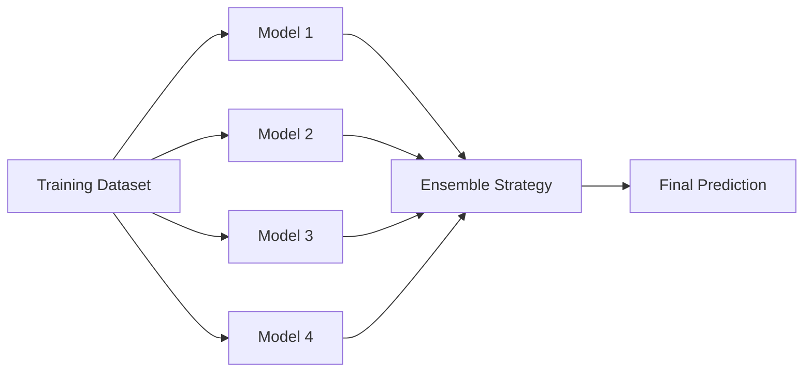

### Base Learner

A **base learner** is an individual model participating in the ensemble.

Examples:

- Decision Tree
- Logistic Regression
- KNN
- SVM
- Neural Network
- Linear Regression

### Ensemble Learner

The ensemble combines predictions from several base learners.

---

# 3. Why Do Ensemble Methods Work? 🧠

Suppose we have multiple classifiers.

If every classifier makes exactly the same mistakes, combining them provides little benefit.

However, if their errors are different, the ensemble can cancel out some of those errors.

### Example

| Model | Prediction | Correct? |
|---|---:|---|
| Model A | Cat | ✅ |
| Model B | Dog | ❌ |
| Model C | Cat | ✅ |
| Model D | Cat | ✅ |
| Model E | Dog | ❌ |

Majority prediction:

```text
Cat = 3 votes
Dog = 2 votes

Final = Cat
```

The ensemble can therefore be more robust than many individual models.

---

# 4. Core Terminology 📖

| Term | Meaning |
|---|---|
| Base Learner | Individual model used by an ensemble |
| Weak Learner | Model that performs slightly better than random guessing |
| Strong Learner | Highly predictive model |
| Ensemble | Combination of multiple models |
| Bagging | Parallel training using bootstrap samples |
| Boosting | Sequential training where later models focus on previous errors |
| Voting | Combining predictions through voting |
| Stacking | Using a meta-model to combine base-model predictions |
| Blending | Similar to stacking but commonly uses a holdout validation set |
| Bootstrap Sample | Sample created by sampling with replacement |
| Out-of-Bag Data | Samples not selected for a bootstrap training sample |
| Meta-Learner | Model that learns how to combine base-model predictions |
| Diversity | Degree to which ensemble members make different errors |
| Weak Learner | Simple model used as a component in boosting |
| Weight | Importance assigned to a model or observation |

---

# 5. Bias, Variance, and Ensemble Learning 📊

Two major sources of model error are:

- **Bias**
- **Variance**

## 5.1 Bias

Bias is error caused by overly simplistic assumptions.

High bias usually results in **underfitting**.

Examples:

```text
Very shallow decision tree
Linear model for highly nonlinear data
```

## 5.2 Variance

Variance is sensitivity to changes in training data.

High variance usually results in **overfitting**.

Example:

```text
Very deep decision tree
```

## 5.3 Ensemble Relationship

| Technique | Main Effect |
|---|---|
| Bagging | Primarily reduces variance |
| Random Forest | Primarily reduces variance |
| Boosting | Often reduces bias and can reduce variance |
| Stacking | Can improve generalization by combining diverse models |
| Voting | Can reduce prediction variance/error |

### Bias-Variance Intuition

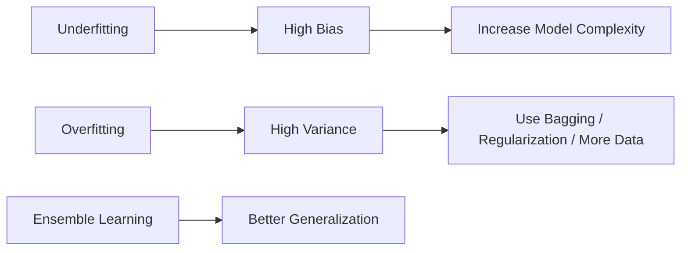

---

# 6. Main Categories of Ensemble Techniques 🏗️

The major ensemble approaches are:

```text
Ensemble Learning
│
├── Voting
│
├── Bagging
│   ├── Bagging Classifier
│   ├── Random Forest
│   └── Extra Trees
│
├── Boosting
│   ├── AdaBoost
│   ├── Gradient Boosting
│   ├── XGBoost
│   ├── LightGBM
│   └── CatBoost
│
├── Stacking
│
└── Blending
```

### High-Level Comparison

| Technique | Training | Main Idea | Typical Strength |
|---|---|---|---|
| Voting | Parallel | Combine predictions | Simple and effective |
| Bagging | Parallel | Train on bootstrap samples | Reduces variance |
| Random Forest | Parallel | Bagging + random feature selection | Strong general-purpose model |
| Extra Trees | Parallel | Highly randomized trees | Fast, diverse trees |
| AdaBoost | Sequential | Focus on incorrectly classified samples | Bias reduction |
| Gradient Boosting | Sequential | Fit residual errors | High predictive power |
| XGBoost | Sequential | Regularized gradient boosting | Excellent tabular performance |
| LightGBM | Sequential | Efficient histogram-based boosting | Speed and scalability |
| CatBoost | Sequential | Boosting with strong categorical handling | Categorical datasets |
| Stacking | Multiple stages | Meta-model learns combinations | Diverse model ensembles |
| Blending | Two-stage | Holdout predictions + meta-model | Simple stacking alternative |

---

# 7. Voting Ensemble 🗳️

Voting is one of the simplest ensemble methods.

Multiple models make predictions and a voting mechanism selects the final output.

## 7.1 Hard Voting

Hard voting uses the predicted class labels.

Example:

```text
Model 1 → A
Model 2 → A
Model 3 → B
Model 4 → A
Model 5 → B

Final → A
```

### Mathematical Representation

For classification:

$$
\hat{y} = \operatorname{mode}(h_1(x), h_2(x), ..., h_M(x))
$$

where:

- $h_i$ = base classifier
- $M$ = number of classifiers
- $x$ = input
- $\hat{y}$ = final prediction

## 7.2 Soft Voting

Soft voting combines predicted probabilities.

For class $k$:

$$
P(k|x) = \sum_{i=1}^{M} w_i P_i(k|x)
$$

where:

- $P_i(k|x)$ = probability predicted by model $i$
- $w_i$ = model weight

The class with the highest combined probability is selected.

## 7.3 Hard vs Soft Voting

| Feature | Hard Voting | Soft Voting |
|---|---|---|
| Uses | Class labels | Probabilities |
| Information | Less | More |
| Probability required | No | Yes |
| Usually preferred | When probabilities unavailable | When probabilities are reliable |

---

# 8. Bagging 🎒

**Bagging** stands for:

> **Bootstrap Aggregating**

The main idea is to train multiple models on different bootstrap samples of the training dataset and aggregate their predictions.

## 8.1 Bootstrap Sampling

Suppose the original dataset is:

```text
[1, 2, 3, 4, 5]
```

Possible bootstrap samples:

```text
Sample 1 → [1, 2, 2, 5, 4]
Sample 2 → [3, 3, 1, 5, 2]
Sample 3 → [4, 1, 4, 2, 5]
```

Sampling is performed **with replacement**.

## 8.2 Bagging Workflow

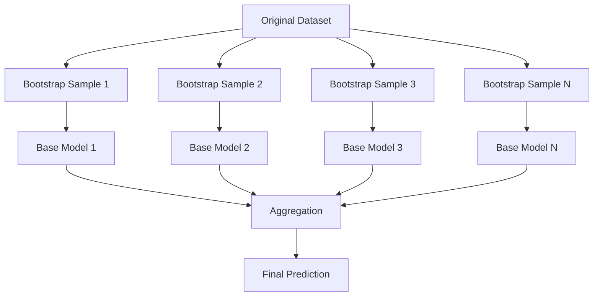

## 8.3 Bagging for Classification

Use:

```text
Majority voting
```

## 8.4 Bagging for Regression

Use:

```text
Average prediction
```

$$
\hat{y} = \frac{1}{M}\sum_{i=1}^{M} h_i(x)
$$

## 8.5 Why Bagging Reduces Variance

Suppose individual model errors are partially independent.

Averaging multiple models reduces the impact of individual model fluctuations.

For independent models with variance $\sigma^2$:

$$
Var(\bar{X}) = \frac{\sigma^2}{M}
$$

In practice, errors are usually correlated, so the exact improvement depends on model correlation.

---

# 9. Random Forest 🌲🌲🌲

**Random Forest** is one of the most popular ensemble algorithms.

It combines:

1. Bootstrap sampling
2. Multiple decision trees
3. Random feature selection
4. Aggregation of predictions

### Architecture

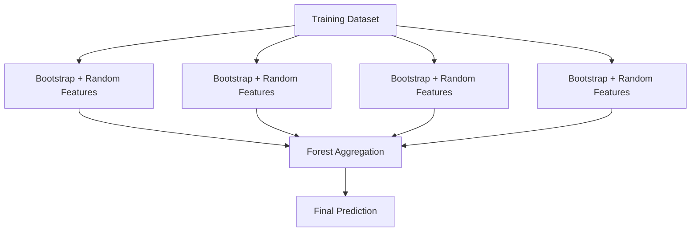

## 9.1 Random Feature Selection

At each split, Random Forest considers only a random subset of features.

This increases tree diversity.

## 9.2 Classification

Final prediction:

```text
Majority Vote
```

## 9.3 Regression

Final prediction:

```text
Average of tree predictions
```

## 9.4 Important Parameters

| Parameter | Meaning |
|---|---|
| `n_estimators` | Number of trees |
| `max_depth` | Maximum tree depth |
| `max_features` | Features considered at each split |
| `min_samples_split` | Minimum samples required to split |
| `min_samples_leaf` | Minimum samples in a leaf |
| `bootstrap` | Whether bootstrap samples are used |
| `criterion` | Split quality measure |
| `class_weight` | Class weighting strategy |
| `random_state` | Reproducibility |

## 9.5 Advantages

- Handles nonlinear relationships.
- Handles interactions between features.
- Usually requires little preprocessing.
- Resistant to overfitting compared with a single deep tree.
- Provides feature importance.
- Works for classification and regression.

## 9.6 Limitations

- Can require significant memory.
- Large forests can be slower at inference.
- Less interpretable than a single tree.
- Feature importance can be biased in some situations.

---

# 10. Extra Trees 🌳⚡

**Extra Trees** stands for **Extremely Randomized Trees**.

It is similar to Random Forest but introduces additional randomness.

### Random Forest vs Extra Trees

| Feature | Random Forest | Extra Trees |
|---|---|---|
| Bootstrap | Usually yes | Often no by default in sklearn |
| Feature selection | Random subset | Random subset |
| Split threshold | Optimized | Randomized candidate thresholds |
| Randomness | High | Very high |
| Training speed | High | Often faster |
| Variance | Low | Often very low |
| Bias | Moderate | Can be slightly higher |

Extra Trees can be useful when increased randomization improves generalization.

---

# 11. Boosting 🚀

Boosting builds models **sequentially**.

Unlike bagging, where models are usually trained independently, boosting makes later models depend on earlier models.

### Basic Idea

```text
Model 1
   ↓
Find errors
   ↓
Model 2 focuses on errors
   ↓
Find remaining errors
   ↓
Model 3 focuses on remaining errors
   ↓
...
   ↓
Combined strong model
```

### Boosting Workflow

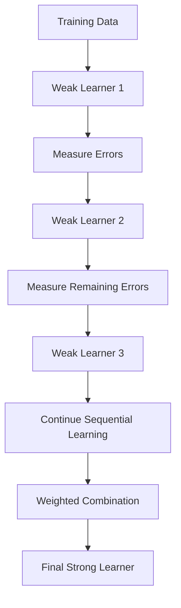

## 11.1 Bagging vs Boosting

| Feature | Bagging | Boosting |
|---|---|---|
| Training | Parallel | Sequential |
| Main goal | Reduce variance | Reduce bias / improve residual fit |
| Dependence | Models mostly independent | Models depend on previous models |
| Data handling | Bootstrap samples | Reweighted or residual-focused |
| Examples | Random Forest | AdaBoost, XGBoost |
| Noise sensitivity | Usually lower | Can be higher |

---

# 12. AdaBoost 🎯

**AdaBoost** stands for **Adaptive Boosting**.

It gives more importance to observations that previous weak learners classified incorrectly.

## 12.1 Concept

Initially:

```text
All samples have equal weight
```

After Model 1:

```text
Incorrect samples → Higher weights
Correct samples → Lower relative weights
```

Model 2 focuses more on difficult examples.

### Simplified Workflow

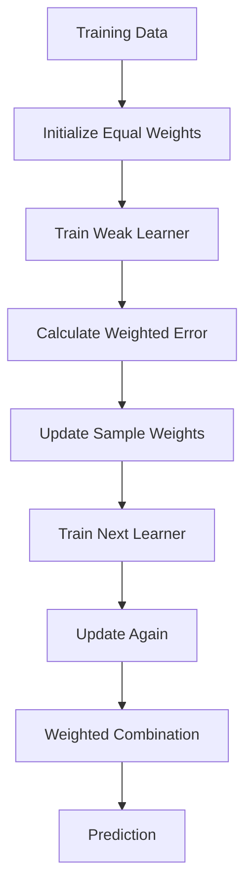

## 12.2 AdaBoost Formula

Weighted error:

$$
\epsilon_t =
\frac{\sum_i w_i I(y_i \neq h_t(x_i))}
{\sum_i w_i}
$$

Learner weight:

$$
\alpha_t =
\frac{1}{2}\ln\left(\frac{1-\epsilon_t}{\epsilon_t}\right)
$$

Final classifier:

$$
H(x) = sign\left(\sum_t \alpha_t h_t(x)\right)
$$

## 12.3 Advantages

- Simple concept.
- Can produce strong performance from weak learners.
- Often works well with shallow trees.

## 12.4 Limitations

- Sensitive to noisy data and outliers.
- Sequential training prevents easy parallelization.
- Hyperparameter tuning can be important.

---

# 13. Gradient Boosting 📈

Gradient Boosting builds models sequentially by fitting new learners to the errors or residuals of the current ensemble.

## 13.1 Core Idea

For regression:

```text
Initial prediction
       ↓
Calculate residual
       ↓
Train tree on residual
       ↓
Update prediction
       ↓
Calculate new residual
       ↓
Repeat
```

### Gradient Boosting Architecture

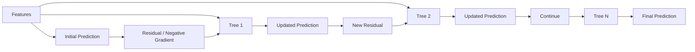

## 13.2 Mathematical Form

The model is built additively:

$$
F_m(x) = F_{m-1}(x) + \eta h_m(x)
$$

where:

- $F_m(x)$ = new ensemble
- $F_{m-1}(x)$ = previous ensemble
- $\eta$ = learning rate
- $h_m(x)$ = new weak learner

## 13.3 Learning Rate

A smaller learning rate usually requires more trees.

Common relationship:

```text
Lower learning_rate → More estimators
Higher learning_rate → Fewer estimators
```

This is not an exact rule; validation performance should determine the best combination.

---

# 14. XGBoost ⚡🌳

**XGBoost** stands for **Extreme Gradient Boosting**.

It is a highly optimized gradient boosting implementation that became extremely popular for structured/tabular data.

## 14.1 Key Features

- Gradient boosting.
- Regularization.
- Shrinkage through learning rate.
- Row and feature subsampling.
- Efficient tree construction.
- Missing-value handling.
- Early stopping.
- Parallelized components.

## 14.2 XGBoost Objective

Conceptually:

$$
Objective =
Training\ Loss + Regularization
$$

A simplified form is:

$$
Obj(\Theta) =
\sum_i L(y_i,\hat{y_i})
+
\sum_k \Omega(f_k)
$$

where:

- $L$ = loss function
- $\Omega$ = model complexity penalty
- $f_k$ = tree

## 14.3 Important Parameters

| Parameter | Purpose |
|---|---|
| `n_estimators` | Number of boosting rounds |
| `learning_rate` | Contribution of each tree |
| `max_depth` | Tree depth |
| `min_child_weight` | Minimum child weight |
| `subsample` | Fraction of training rows |
| `colsample_bytree` | Fraction of features per tree |
| `gamma` | Minimum split loss |
| `reg_alpha` | L1 regularization |
| `reg_lambda` | L2 regularization |
| `objective` | Learning objective |
| `eval_metric` | Evaluation metric |

## 14.4 Example

```python
from xgboost import XGBClassifier

model = XGBClassifier(
    n_estimators=300,
    learning_rate=0.05,
    max_depth=4,
    subsample=0.8,
    colsample_bytree=0.8,
    random_state=42
)

model.fit(X_train, y_train)

y_pred = model.predict(X_test)
```

---

# 15. LightGBM 💡⚡

**LightGBM** is a gradient boosting framework designed for efficiency and scalability.

It uses techniques such as:

- Histogram-based learning.
- Leaf-wise tree growth.
- Feature bundling in appropriate settings.
- Efficient handling of large datasets.

## 15.1 Leaf-Wise Growth

Traditional level-wise:

```text
Level 0
  ↓
Level 1
  ↓
Level 2
```

LightGBM commonly uses leaf-wise growth:

```text
Split the leaf producing the largest gain
        ↓
Repeat
```

This can improve accuracy but may overfit if tree complexity is not controlled.

## 15.2 Example

```python
from lightgbm import LGBMClassifier

model = LGBMClassifier(
    n_estimators=300,
    learning_rate=0.05,
    num_leaves=31,
    max_depth=-1,
    random_state=42
)

model.fit(X_train, y_train)

y_pred = model.predict(X_test)
```

---

# 16. CatBoost 🐱🌳

**CatBoost** is a gradient boosting library particularly well known for handling categorical features.

It uses techniques designed to reduce target leakage and improve categorical feature processing.

## 16.1 Why CatBoost?

Traditional ML pipelines often require:

```text
Categorical data
      ↓
One-Hot Encoding / Other Encoding
      ↓
Numerical features
      ↓
Model
```

CatBoost can work directly with categorical features when configured correctly.

## 16.2 Example

```python
from catboost import CatBoostClassifier

model = CatBoostClassifier(
    iterations=300,
    learning_rate=0.05,
    depth=6,
    verbose=0,
    random_seed=42
)

model.fit(
    X_train,
    y_train,
    cat_features=categorical_columns
)

y_pred = model.predict(X_test)
```

---

# 17. Stacking 🧱

**Stacking**, or **Stacked Generalization**, combines different types of models using a **meta-model**.

Example:

```text
Base Model 1 → Logistic Regression
Base Model 2 → Random Forest
Base Model 3 → SVM
Base Model 4 → Gradient Boosting

             ↓

        Meta Model
             ↓

      Final Prediction
```

### Architecture

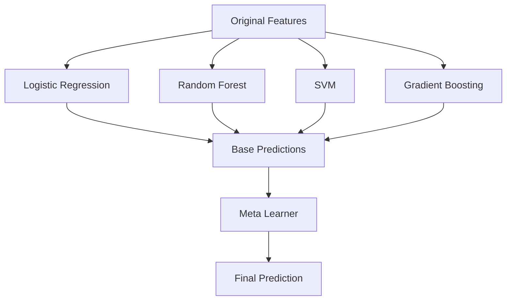

## 17.1 Why Stacking?

Different models capture different patterns.

For example:

```text
Linear Model → Linear relationships
Tree Model → Nonlinear relationships
KNN → Local similarity
SVM → Margin-based structure
```

The meta-model learns how to combine their outputs.

## 17.2 Important Warning: Data Leakage

Do not train the meta-model on predictions generated from base models using the same samples on which the base models were trained.

Use **out-of-fold predictions**.

---

# 18. Blending 🥣

Blending is similar to stacking but usually uses a separate holdout validation set.

### Process

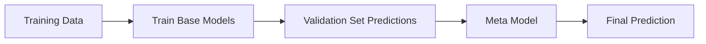

### Stacking vs Blending

| Feature | Stacking | Blending |
|---|---|---|
| Meta-model | Yes | Yes |
| Main prediction source | Out-of-fold predictions | Holdout validation predictions |
| Data usage | More efficient | Uses validation holdout |
| Complexity | Higher | Lower |
| Leakage prevention | Requires careful CV | Easier to implement |

---

# 19. Bagging vs Boosting vs Stacking ⚔️

| Property | Bagging | Boosting | Stacking |
|---|---|---|---|
| Training | Parallel | Sequential | Multi-stage |
| Main objective | Variance reduction | Error correction | Combine diverse models |
| Typical base models | Trees | Weak trees | Different algorithms |
| Data strategy | Bootstrap | Reweight/residual learning | Cross-validation/holdout |
| Overfitting risk | Usually lower | Can be higher | Depends on design |
| Interpretability | Moderate | Low | Low |
| Examples | Random Forest | XGBoost | RF + SVM + Logistic Regression |

### Simple Memory Trick

```text
BAGGING  → Build many models independently
BOOSTING → Build models one after another
STACKING → Stack model predictions and learn how to combine them
```

---

# 20. Ensemble Diversity 🌈

**Diversity** is one of the most important concepts in ensemble learning.

An ensemble is most useful when its models make different errors.

## 20.1 Sources of Diversity

### Different Algorithms

```text
Logistic Regression
Random Forest
SVM
KNN
Gradient Boosting
```

### Different Training Data

```text
Bootstrap samples
Different folds
Different subsets
```

### Different Features

```text
Feature subsets
Random feature selection
Feature engineering variations
```

### Different Hyperparameters

```text
Tree depth
Regularization
Learning rate
Number of neighbors
```

## 20.2 Diversity Principle

> **Accuracy + Diversity = Strong Ensemble**

An ensemble of 10 nearly identical models may be less useful than an ensemble of 5 sufficiently diverse models.

---

# 21. Out-of-Bag Evaluation 🎯

Out-of-Bag, or **OOB**, evaluation is especially associated with bagging methods such as Random Forest.

For each bootstrap sample, some observations are not selected.

These observations can be used to estimate model performance.

### Example

Original dataset:

```text
1 2 3 4 5 6 7 8 9 10
```

Bootstrap sample:

```text
1 2 2 4 5 5 7 9 10 10
```

OOB observations:

```text
3, 6, 8
```

These observations were not used to train that tree.

## 21.1 OOB Advantage

You can estimate generalization performance without creating a separate validation set in suitable bagging workflows.

### Scikit-learn Example

```python
from sklearn.ensemble import RandomForestClassifier

rf = RandomForestClassifier(
    n_estimators=300,
    oob_score=True,
    random_state=42,
    n_jobs=-1
)

rf.fit(X_train, y_train)

print("OOB Score:", rf.oob_score_)
```

---

# 22. Important Hyperparameters ⚙️

## 22.1 Random Forest

```python
RandomForestClassifier(
    n_estimators=300,
    max_depth=None,
    max_features="sqrt",
    min_samples_split=2,
    min_samples_leaf=1,
    bootstrap=True,
    random_state=42,
    n_jobs=-1
)
```

## 22.2 Gradient Boosting

Important parameters:

```text
n_estimators
learning_rate
max_depth
min_samples_split
min_samples_leaf
subsample
```

## 22.3 XGBoost

Important parameters:

```text
n_estimators
learning_rate
max_depth
min_child_weight
subsample
colsample_bytree
gamma
reg_alpha
reg_lambda
```

## 22.4 LightGBM

Important parameters:

```text
n_estimators
learning_rate
num_leaves
max_depth
min_child_samples
subsample
colsample_bytree
reg_alpha
reg_lambda
```

## 22.5 CatBoost

Important parameters:

```text
iterations
learning_rate
depth
l2_leaf_reg
loss_function
```

---

# 23. Evaluation Metrics 📏

The correct metric depends on the problem.

## 23.1 Classification

### Accuracy

$$
Accuracy = \frac{TP+TN}{TP+TN+FP+FN}
$$

### Precision

$$
Precision = \frac{TP}{TP+FP}
$$

### Recall

$$
Recall = \frac{TP}{TP+FN}
$$

### F1 Score

$$
F1 = 2 \times \frac{Precision \times Recall}{Precision + Recall}
$$

### ROC-AUC

Measures ranking/separation ability across classification thresholds.

### Classification Metric Selection

| Situation | Useful Metric |
|---|---|
| Balanced classes | Accuracy |
| False positives costly | Precision |
| False negatives costly | Recall |
| Need balance | F1 |
| Ranking/probability discrimination | ROC-AUC |
| Severe class imbalance | PR-AUC, F1, Recall, Precision |

## 23.2 Regression

### MAE

$$
MAE = \frac{1}{n}\sum |y_i-\hat{y_i}|
$$

### MSE

$$
MSE = \frac{1}{n}\sum(y_i-\hat{y_i})^2
$$

### RMSE

$$
RMSE = \sqrt{MSE}
$$

### R²

$$
R^2 = 1-\frac{SS_{res}}{SS_{tot}}
$$

---

# 24. Practical Code Examples 💻

## 24.1 Imports

```python
import pandas as pd
import numpy as np

from sklearn.model_selection import train_test_split
from sklearn.metrics import (
    accuracy_score,
    precision_score,
    recall_score,
    f1_score,
    classification_report,
    confusion_matrix
)
```

---

## 24.2 Random Forest Classification

```python
from sklearn.ensemble import RandomForestClassifier

rf = RandomForestClassifier(
    n_estimators=300,
    max_depth=None,
    random_state=42,
    n_jobs=-1
)

rf.fit(X_train, y_train)

y_pred = rf.predict(X_test)

print("Accuracy:", accuracy_score(y_test, y_pred))
print(classification_report(y_test, y_pred))
```

---

## 24.3 Extra Trees

```python
from sklearn.ensemble import ExtraTreesClassifier

extra = ExtraTreesClassifier(
    n_estimators=300,
    random_state=42,
    n_jobs=-1
)

extra.fit(X_train, y_train)

y_pred = extra.predict(X_test)

print("Accuracy:", accuracy_score(y_test, y_pred))
```

---

## 24.4 AdaBoost

```python
from sklearn.ensemble import AdaBoostClassifier

ada = AdaBoostClassifier(
    n_estimators=200,
    learning_rate=0.05,
    random_state=42
)

ada.fit(X_train, y_train)

y_pred = ada.predict(X_test)

print(classification_report(y_test, y_pred))
```

---

## 24.5 Gradient Boosting

```python
from sklearn.ensemble import GradientBoostingClassifier

gb = GradientBoostingClassifier(
    n_estimators=200,
    learning_rate=0.05,
    max_depth=3,
    random_state=42
)

gb.fit(X_train, y_train)

y_pred = gb.predict(X_test)

print("Accuracy:", accuracy_score(y_test, y_pred))
```

---

## 24.6 Voting Classifier

```python
from sklearn.ensemble import VotingClassifier
from sklearn.linear_model import LogisticRegression
from sklearn.svm import SVC
from sklearn.ensemble import RandomForestClassifier

lr = LogisticRegression(max_iter=1000)
svm = SVC(probability=True)
rf = RandomForestClassifier(
    n_estimators=200,
    random_state=42
)

voting = VotingClassifier(
    estimators=[
        ("lr", lr),
        ("svm", svm),
        ("rf", rf)
    ],
    voting="soft"
)

voting.fit(X_train, y_train)

y_pred = voting.predict(X_test)

print(classification_report(y_test, y_pred))
```

---

## 24.7 Stacking Classifier

```python
from sklearn.ensemble import StackingClassifier
from sklearn.linear_model import LogisticRegression
from sklearn.ensemble import RandomForestClassifier
from sklearn.svm import SVC

estimators = [
    ("rf", RandomForestClassifier(
        n_estimators=200,
        random_state=42
    )),
    ("svm", SVC(probability=True)),
]

stack = StackingClassifier(
    estimators=estimators,
    final_estimator=LogisticRegression(max_iter=1000),
    cv=5
)

stack.fit(X_train, y_train)

y_pred = stack.predict(X_test)

print(classification_report(y_test, y_pred))
```

---

## 24.8 Comparing Multiple Ensembles

```python
from sklearn.ensemble import (
    RandomForestClassifier,
    ExtraTreesClassifier,
    AdaBoostClassifier,
    GradientBoostingClassifier
)

models = {
    "Random Forest": RandomForestClassifier(
        n_estimators=300,
        random_state=42,
        n_jobs=-1
    ),
    "Extra Trees": ExtraTreesClassifier(
        n_estimators=300,
        random_state=42,
        n_jobs=-1
    ),
    "AdaBoost": AdaBoostClassifier(
        n_estimators=200,
        learning_rate=0.05,
        random_state=42
    ),
    "Gradient Boosting": GradientBoostingClassifier(
        n_estimators=200,
        learning_rate=0.05,
        random_state=42
    )
}

results = {}

for name, model in models.items():
    model.fit(X_train, y_train)
    predictions = model.predict(X_test)

    results[name] = {
        "accuracy": accuracy_score(y_test, predictions),
        "precision": precision_score(
            y_test, predictions, average="weighted"
        ),
        "recall": recall_score(
            y_test, predictions, average="weighted"
        ),
        "f1": f1_score(
            y_test, predictions, average="weighted"
        )
    }

results_df = pd.DataFrame(results).T

print(results_df.sort_values("f1", ascending=False))
```

---

# 25. End-to-End Mini Project 🛠️

## Project: Breast Cancer Classification Using Ensemble Techniques

### Objective

Compare several ensemble models for classifying breast tumors.

### Dataset

A suitable dataset is the **Breast Cancer Wisconsin Diagnostic Dataset**.

Target:

```text
Benign
Malignant
```

Features:

```text
Tumor measurements
Cell characteristics
Texture
Radius
Perimeter
Area
Smoothness
Concavity
Symmetry
etc.
```

## 25.1 Project Workflow

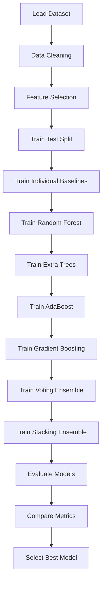

## 25.2 Complete Example

```python
import pandas as pd

from sklearn.model_selection import train_test_split
from sklearn.preprocessing import StandardScaler
from sklearn.pipeline import Pipeline

from sklearn.ensemble import (
    RandomForestClassifier,
    ExtraTreesClassifier,
    AdaBoostClassifier,
    GradientBoostingClassifier,
    VotingClassifier,
    StackingClassifier
)

from sklearn.linear_model import LogisticRegression
from sklearn.svm import SVC

from sklearn.metrics import (
    accuracy_score,
    precision_score,
    recall_score,
    f1_score,
    classification_report
)

# Load data
df = pd.read_csv(
    "Breast Cancer Wisconsin (Diagnostic) Data Set.csv"
)

# Example: remove ID column if present
if "id" in df.columns:
    df = df.drop(columns=["id"])

# Adjust the target column name according to your CSV
target_column = "diagnosis"

X = df.drop(columns=[target_column])
y = df[target_column]

# Convert target labels if necessary
if y.dtype == "object":
    y = y.map({
        "M": 1,
        "B": 0
    })

# Remove missing rows for this simple example
data = pd.concat([X, y], axis=1).dropna()

X = data.drop(columns=[target_column])
y = data[target_column]

# Split
X_train, X_test, y_train, y_test = train_test_split(
    X,
    y,
    test_size=0.2,
    random_state=42,
    stratify=y
)

# Models
rf = RandomForestClassifier(
    n_estimators=300,
    random_state=42,
    n_jobs=-1
)

extra = ExtraTreesClassifier(
    n_estimators=300,
    random_state=42,
    n_jobs=-1
)

ada = AdaBoostClassifier(
    n_estimators=200,
    learning_rate=0.05,
    random_state=42
)

gb = GradientBoostingClassifier(
    n_estimators=200,
    learning_rate=0.05,
    random_state=42
)

voting = VotingClassifier(
    estimators=[
        ("rf", rf),
        ("extra", extra),
        ("gb", gb)
    ],
    voting="soft"
)

stacking = StackingClassifier(
    estimators=[
        ("rf", rf),
        ("extra", extra),
        ("gb", gb)
    ],
    final_estimator=LogisticRegression(max_iter=1000),
    cv=5
)

models = {
    "Random Forest": rf,
    "Extra Trees": extra,
    "AdaBoost": ada,
    "Gradient Boosting": gb,
    "Voting": voting,
    "Stacking": stacking
}

results = []

for name, model in models.items():

    model.fit(X_train, y_train)

    y_pred = model.predict(X_test)

    results.append({
        "Model": name,
        "Accuracy": accuracy_score(y_test, y_pred),
        "Precision": precision_score(y_test, y_pred),
        "Recall": recall_score(y_test, y_pred),
        "F1": f1_score(y_test, y_pred)
    })

results_df = pd.DataFrame(results)

print(results_df.sort_values("F1", ascending=False))
```

### Important Note

Column names differ between CSV files. Always inspect:

```python
print(df.columns)
print(df.head())
print(df.info())
```

before running the complete pipeline.

---

# 26. Real-World Use Cases 🌍

Ensemble methods are widely used in practical Machine Learning.

| Domain | Example | Useful Ensembles |
|---|---|---|
| Banking | Credit risk | Random Forest, XGBoost |
| Finance | Fraud detection | XGBoost, LightGBM |
| Healthcare | Disease prediction | Random Forest, Gradient Boosting |
| E-commerce | Churn prediction | XGBoost, CatBoost |
| Marketing | Customer response | Random Forest, LightGBM |
| Manufacturing | Predictive maintenance | Random Forest, XGBoost |
| Cybersecurity | Intrusion detection | Random Forest, Boosting |
| Computer Vision | Classification/detection components | Boosting, model ensembles |
| Search | Ranking | Gradient Boosting |
| Recommendation | Ranking/candidate scoring | Gradient Boosting, stacking |
| Competition ML | Tabular prediction | XGBoost, LightGBM, CatBoost, stacking |

---

# 27. Advantages ✅

## 27.1 Higher Predictive Performance

Combining several models can improve predictive accuracy.

## 27.2 Better Generalization

Properly designed ensembles can generalize better than individual models.

## 27.3 Reduced Variance

Bagging and Random Forest are especially effective at reducing variance.

## 27.4 Handles Complex Patterns

Boosting methods can capture nonlinear relationships and interactions.

## 27.5 Robustness

Ensembles can be more robust to changes in individual models or subsets of data.

## 27.6 Flexible

You can combine:

```text
Different algorithms
Different features
Different datasets
Different hyperparameters
```

---

# 28. Limitations ⚠️

## 28.1 Computational Cost

Many models require:

```text
More CPU
More RAM
More training time
```

## 28.2 Reduced Interpretability

A single decision tree is easier to understand than hundreds of trees.

## 28.3 Hyperparameter Complexity

Boosting algorithms may have many parameters.

## 28.4 Data Leakage Risk

Stacking and blending can leak information if validation predictions are generated incorrectly.

## 28.5 Noise Sensitivity

Some boosting methods can become sensitive to noisy samples and outliers.

## 28.6 Deployment Complexity

A large ensemble can be more difficult to deploy and monitor.

---

# 29. Common Mistakes ❌

## Mistake 1: Using Only Accuracy

Accuracy can be misleading for imbalanced datasets.

Use:

```text
Precision
Recall
F1
ROC-AUC
PR-AUC
```

when appropriate.

---

## Mistake 2: Ignoring Data Leakage

Do not preprocess or generate meta-features using information from the test set.

Correct:

```text
Train → Fit preprocessing
Test → Transform using fitted preprocessing
```

Incorrect:

```text
Train + Test → Fit preprocessing
```

---

## Mistake 3: Overfitting Boosting Models

Very deep trees and too many boosting rounds can overfit.

Control:

```text
max_depth
learning_rate
n_estimators
subsample
regularization
early stopping
```

---

## Mistake 4: Using Too Many Similar Models

```text
Random Forest 1
Random Forest 2
Random Forest 3
Random Forest 4
```

with almost identical settings may provide less diversity.

---

## Mistake 5: Ignoring Class Imbalance

Consider:

```text
class_weight
sample_weight
resampling
threshold tuning
appropriate metrics
```

---

## Mistake 6: Training on the Test Set

Never use the test set repeatedly for model tuning.

Preferred structure:

```text
Training → Model fitting
Validation / CV → Hyperparameter selection
Test → Final unbiased evaluation
```

---

# 30. Best Practices 🏆

## 30.1 Establish a Baseline

Always start with a simple model.

Example:

```text
Logistic Regression
Decision Tree
Linear Regression
```

Then compare ensemble performance.

## 30.2 Use Cross-Validation

```python
from sklearn.model_selection import cross_val_score

scores = cross_val_score(
    rf,
    X_train,
    y_train,
    cv=5,
    scoring="f1"
)

print(scores)
print("Mean F1:", scores.mean())
```

## 30.3 Tune Important Hyperparameters

Use:

```text
GridSearchCV
RandomizedSearchCV
Bayesian Optimization
```

## 30.4 Use Early Stopping

For boosting libraries that support it, early stopping can prevent unnecessary iterations.

## 30.5 Monitor Model Complexity

Do not assume:

```text
More trees = always better
```

or:

```text
Deeper trees = always better
```

## 30.6 Prefer Diversity

Build ensembles with complementary strengths.

## 30.7 Use Pipelines

```python
from sklearn.pipeline import Pipeline
```

Pipelines reduce preprocessing mistakes and help prevent leakage during cross-validation.

---

# 31. Advanced Concepts 🧠🔥

## 31.1 Weighted Ensembles

Instead of treating every model equally:

$$
\hat{y} = \sum_i w_i h_i(x)
$$

where:

$$
\sum_i w_i = 1
$$

Example:

```text
Model A → weight 0.50
Model B → weight 0.30
Model C → weight 0.20
```

---

## 31.2 Model Correlation

If models have highly correlated errors, adding another model may provide limited benefit.

Ideal ensemble:

```text
High individual quality
+
Low error correlation
```

---

## 31.3 Out-of-Fold Predictions

For stacking, training predictions should be generated using cross-validation.

Example:

```text
Fold 1 → Predict validation fold
Fold 2 → Predict validation fold
Fold 3 → Predict validation fold
Fold 4 → Predict validation fold
Fold 5 → Predict validation fold

Combine all validation predictions
        ↓
Meta-model training
```

### Why?

It gives the meta-model predictions from base learners that did not train on those specific samples.

---

## 31.4 Nested Cross-Validation

Nested CV is useful when both hyperparameter tuning and unbiased model evaluation are important.

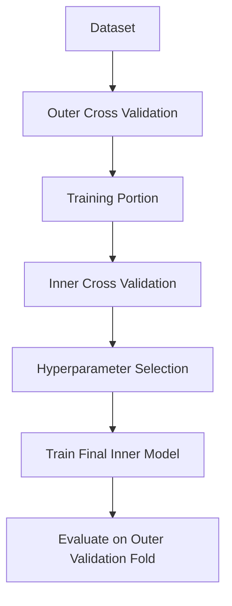

---

## 31.5 Probability Calibration

Ensemble models may produce probabilities that are not perfectly calibrated.

A model can be highly accurate while having poorly calibrated probabilities.

Example:

```text
Predicted probability = 0.90

Does that really mean approximately
90% of similar cases are positive?
```

Calibration methods include:

```text
Platt scaling
Isotonic regression
```

Scikit-learn:

```python
from sklearn.calibration import CalibratedClassifierCV
```

---

## 31.6 Feature Importance

Tree ensembles often provide feature importance.

```python
importance = pd.Series(
    rf.feature_importances_,
    index=X_train.columns
).sort_values(ascending=False)

print(importance)
```

However, impurity-based importance can be misleading with certain feature types and correlated variables.

Permutation importance can be a useful alternative.

---

## 31.7 SHAP and Explainability

SHAP can help explain model predictions.

Conceptually:

```text
Prediction
    ↓
Contribution of Feature A
Contribution of Feature B
Contribution of Feature C
...
    ↓
Final prediction
```

For complex ensembles, explainability tools are especially valuable.

---

## 31.8 Gradient Boosting vs Random Forest

| Feature | Random Forest | Gradient Boosting |
|---|---|---|
| Training | Parallel | Sequential |
| Trees | Independent | Dependent |
| Main strength | Variance reduction | Error correction |
| Tuning | Usually easier | Often more sensitive |
| Noise sensitivity | Usually robust | Can be more sensitive |
| Tabular performance | Strong | Often excellent |
| Interpretability | Moderate | Lower |

---

## 31.9 XGBoost vs LightGBM vs CatBoost

| Feature | XGBoost | LightGBM | CatBoost |
|---|---|---|---|
| Gradient boosting | ✅ | ✅ | ✅ |
| Regularization | Strong | Strong | Strong |
| Speed | Fast | Very fast | Fast |
| Large datasets | Good | Excellent | Good |
| Categorical features | Requires preprocessing in many workflows | Supports categorical features with appropriate usage | Excellent |
| Ease of use | High | High | High |
| Common use | General tabular ML | Large-scale tabular ML | Categorical-heavy data |

---

# 32. Ensemble Learning Workflow 🔄

A professional ML workflow can look like this:

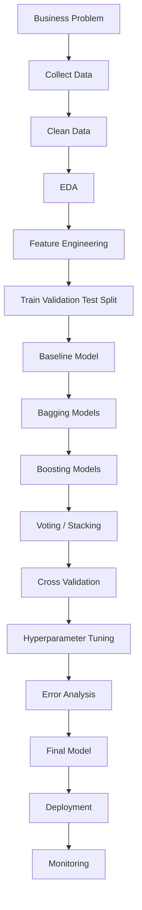

## Recommended Process

```text
1. Understand the problem
2. Prepare data
3. Build baseline
4. Train Random Forest
5. Train boosting models
6. Compare metrics
7. Tune the best candidates
8. Try voting/stacking
9. Validate carefully
10. Perform error analysis
11. Select final model
12. Deploy and monitor
```

---

# 33. Interview Questions and Points 🎤

## Q1. What is ensemble learning?

**Answer:**

Ensemble learning combines predictions from multiple models to produce a stronger and often more generalizable model.

---

## Q2. What is bagging?

**Answer:**

Bagging, or Bootstrap Aggregating, trains multiple models on bootstrap samples and combines their predictions. It primarily helps reduce variance.

---

## Q3. What is boosting?

**Answer:**

Boosting trains models sequentially, where later learners focus on errors or residuals from earlier learners, producing a stronger combined model.

---

## Q4. Difference between bagging and boosting?

```text
Bagging:
Parallel + Bootstrap + Variance reduction

Boosting:
Sequential + Error correction + Strong learner
```

---

## Q5. Why is Random Forest better than a single Decision Tree?

Because it combines many diverse decision trees and aggregates their predictions, generally reducing variance and improving generalization.

---

## Q6. Why are random features used in Random Forest?

Random feature selection increases diversity among trees and reduces correlation between them.

---

## Q7. What is a weak learner?

A weak learner is a model that performs better than random guessing but is relatively simple or only moderately predictive.

---

## Q8. What is stacking?

Stacking combines predictions from multiple base models and uses a meta-model to learn how to combine those predictions.

---

## Q9. What is the role of a meta-learner?

The meta-learner learns the relationship between base-model predictions and the true target.

---

## Q10. What is OOB score?

OOB score estimates generalization performance using samples not selected in each bootstrap sample.

---

## Q11. Why can boosting overfit?

Boosting can overfit when the model becomes too complex, for example through excessive iterations, overly deep trees, or insufficient regularization.

---

## Q12. Which ensemble is best?

There is no universally best ensemble.

The best choice depends on:

```text
Dataset
Problem type
Data size
Noise
Feature types
Class imbalance
Compute resources
Latency requirements
Interpretability requirements
```

---

# 34. Quick Revision ⚡📌

## 34.1 Key Definitions

| Concept | One-Line Definition |
|---|---|
| Ensemble | Combination of multiple models |
| Bagging | Bootstrap + independent model training + aggregation |
| Random Forest | Bagging of randomized decision trees |
| Extra Trees | Highly randomized tree ensemble |
| Boosting | Sequential error-correcting ensemble |
| AdaBoost | Reweights difficult observations |
| Gradient Boosting | Fits successive learners to residual/gradient information |
| XGBoost | Optimized, regularized gradient boosting |
| LightGBM | Efficient gradient boosting designed for scalability |
| CatBoost | Gradient boosting with strong categorical-data handling |
| Voting | Combine model predictions using votes/probabilities |
| Stacking | Meta-model learns how to combine base predictions |
| Blending | Stacking-like approach using a holdout set |
| OOB | Samples not selected in a bootstrap sample |

---

## 34.2 Core Formulas

### Regression Ensemble

$$
\hat{y} = \frac{1}{M}\sum_{i=1}^{M} h_i(x)
$$

### Weighted Ensemble

$$
\hat{y} = \sum_{i=1}^{M} w_i h_i(x)
$$

### AdaBoost Learner Weight

$$
\alpha_t =
\frac{1}{2}
\ln
\left(
\frac{1-\epsilon_t}{\epsilon_t}
\right)
$$

### Gradient Boosting Update

$$
F_m(x) =
F_{m-1}(x)
+
\eta h_m(x)
$$

### Accuracy

$$
Accuracy =
\frac{TP+TN}{TP+TN+FP+FN}
$$

### Precision

$$
Precision =
\frac{TP}{TP+FP}
$$

### Recall

$$
Recall =
\frac{TP}{TP+FN}
$$

### F1

$$
F1 =
2
\frac{Precision \times Recall}
{Precision + Recall}
$$

---

## 34.3 Important Scikit-Learn Imports

```python
from sklearn.ensemble import (
    BaggingClassifier,
    BaggingRegressor,
    RandomForestClassifier,
    RandomForestRegressor,
    ExtraTreesClassifier,
    ExtraTreesRegressor,
    AdaBoostClassifier,
    AdaBoostRegressor,
    GradientBoostingClassifier,
    GradientBoostingRegressor,
    VotingClassifier,
    VotingRegressor,
    StackingClassifier,
    StackingRegressor
)
```

---

## 34.4 Important External Libraries

```bash
pip install xgboost
pip install lightgbm
pip install catboost
```

Imports:

```python
from xgboost import XGBClassifier, XGBRegressor
from lightgbm import LGBMClassifier, LGBMRegressor
from catboost import CatBoostClassifier, CatBoostRegressor
```

---

## 34.5 Which Algorithm Should I Try?

```text
Start
  │
  ├── Small / medium tabular data
  │      ├── Random Forest
  │      ├── Gradient Boosting
  │      └── XGBoost / CatBoost
  │
  ├── Large tabular data
  │      ├── LightGBM
  │      └── XGBoost
  │
  ├── Many categorical features
  │      └── CatBoost
  │
  ├── Need simple ensemble
  │      └── Voting
  │
  └── Diverse strong models available
         └── Stacking
```

---

# 35. Visual Roadmap 🗺️

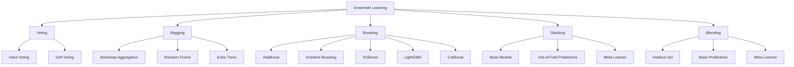

## 🧠 Final Mental Model

```text
                    ENSEMBLE LEARNING
                           │
          ┌────────────────┼────────────────┐
          │                │                │
       BAGGING          BOOSTING         STACKING
          │                │                │
     Parallel         Sequential       Meta Model
          │                │                │
     Bootstrap        Error Focus      Diverse Models
          │                │                │
   Random Forest      AdaBoost          OOF Predictions
   Extra Trees        Gradient Boost    Final Prediction
                     XGBoost
                     LightGBM
                     CatBoost
```

### Remember

> 🌲 **Bagging:** Build many models independently and aggregate them.

> 🚀 **Boosting:** Build models sequentially, allowing later models to correct earlier errors.

> 🧱 **Stacking:** Combine different models and let another model learn how to combine them.

> 🗳️ **Voting:** Let models vote or combine their probabilities.

> 🥣 **Blending:** Combine model predictions using a holdout validation set.

> 🎯 **Diversity matters:** Strong ensembles need models that are not making exactly the same mistakes.

> ⚠️ **Avoid leakage:** Especially when building stacking and blending systems.

> 📊 **Evaluate correctly:** Select metrics based on the business and ML problem, not only accuracy.

---

# 🎓 Final Takeaway

Ensemble techniques are among the most powerful tools for supervised Machine Learning, particularly for structured/tabular datasets.

The most important progression to remember is:

```text
Single Model
     ↓
Multiple Models
     ↓
Bagging
     ↓
Random Forest / Extra Trees
     ↓
Boosting
     ↓
AdaBoost / Gradient Boosting
     ↓
Modern Boosting
     ↓
XGBoost / LightGBM / CatBoost
     ↓
Model Combination
     ↓
Voting / Stacking / Blending
     ↓
Careful Validation + Tuning + Error Analysis
     ↓
Production-Ready Ensemble
```

**Core principle:**

> **Don't simply add more models. Build a diverse, well-validated collection of models whose combined errors are smaller than the errors of the individual models.**
