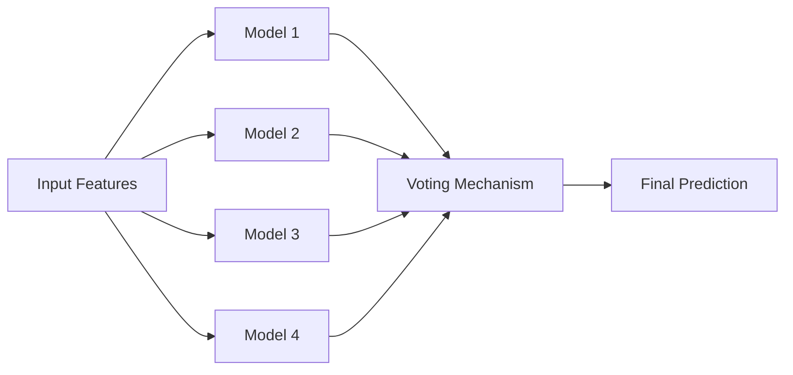
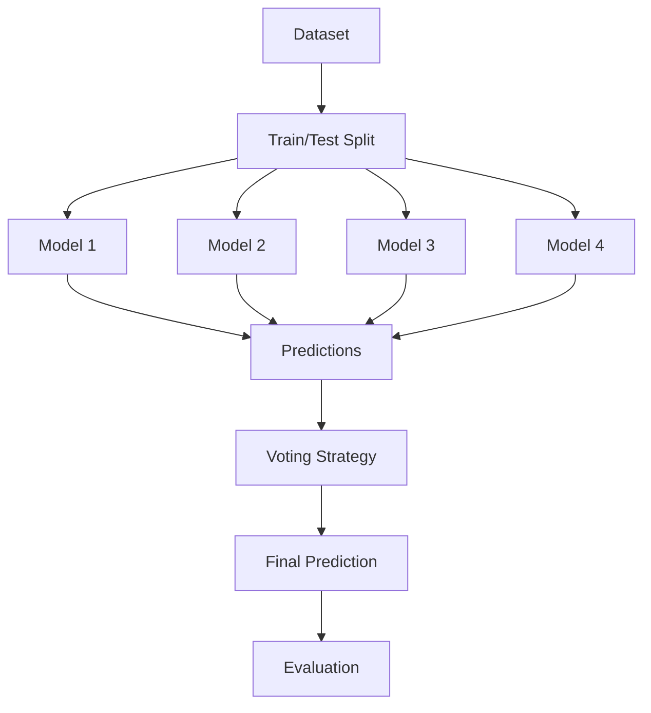
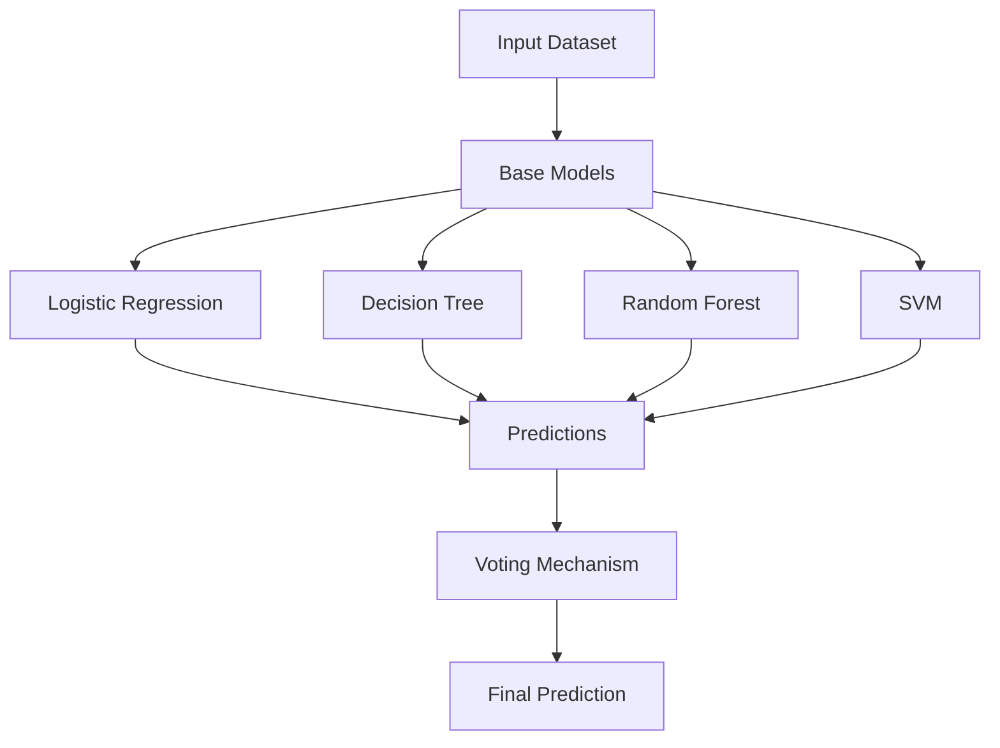
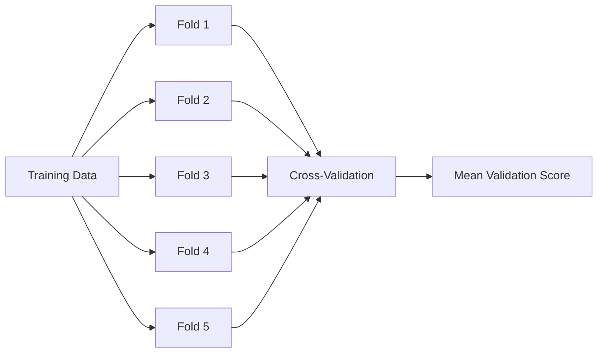
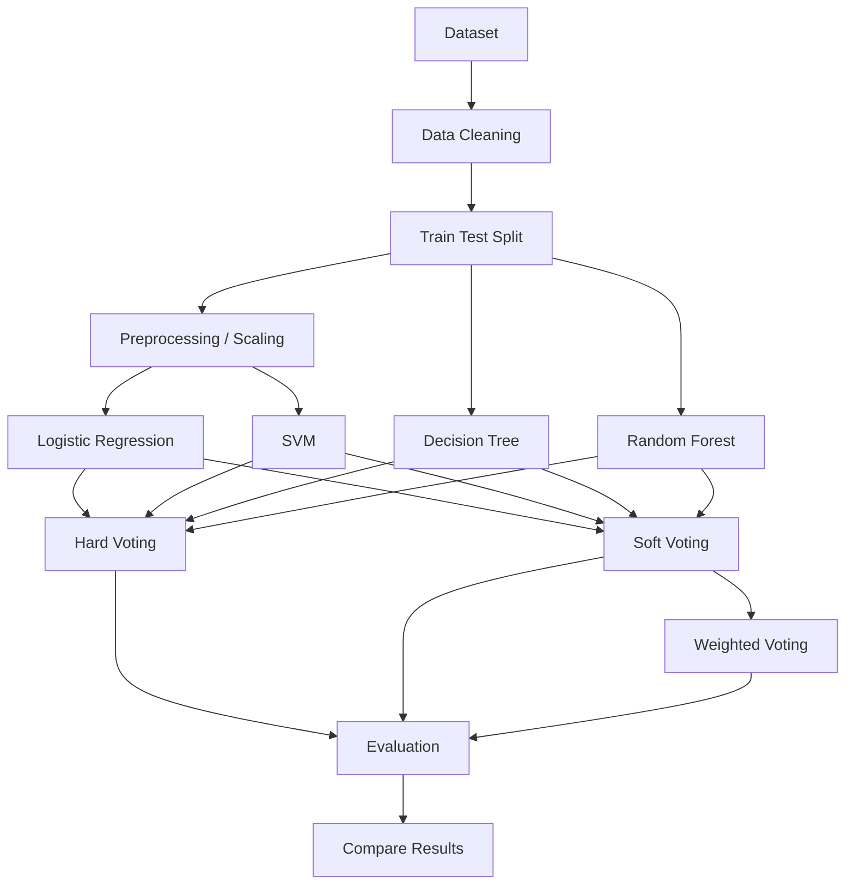
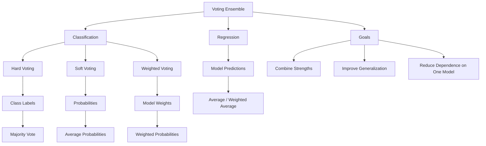

# 🗳️ Voting Ensemble in Machine Learning

> A complete learning resource covering hard voting, soft voting, weighted voting, mathematics, implementation, evaluation, best practices, common mistakes, and a practical mini-project.

## 📚 Table of Contents

1. [Introduction](#1-introduction)
2. [What Is an Ensemble?](#2-what-is-an-ensemble)
3. [What Is Voting Ensemble?](#3-what-is-voting-ensemble)
4. [Why Use Voting Ensemble?](#4-why-use-voting-ensemble)
5. [How It Works](#5-how-it-works)
6. [Types of Voting](#6-types-of-voting)
7. [Hard Voting](#7-hard-voting)
8. [Soft Voting](#8-soft-voting)
9. [Weighted Voting](#9-weighted-voting)
10. [Hard vs Soft Voting](#10-hard-vs-soft-voting)
11. [Mathematical Foundation](#11-mathematical-foundation)
12. [Architecture](#12-architecture)
13. [Choosing Base Models](#13-choosing-base-models)
14. [Model Diversity](#14-model-diversity)
15. [Scikit-Learn Implementation](#15-scikit-learn-implementation)
16. [Classification Example](#16-classification-example)
17. [Regression Example](#17-regression-example)
18. [Evaluation](#18-evaluation)
19. [Cross-Validation](#19-cross-validation)
20. [Hyperparameter Tuning](#20-hyperparameter-tuning)
21. [Pipelines and Scaling](#21-pipelines-and-scaling)
22. [Real-World Use Cases](#22-real-world-use-cases)
23. [Advantages](#23-advantages)
24. [Limitations](#24-limitations)
25. [Common Mistakes](#25-common-mistakes)
26. [Best Practices](#26-best-practices)
27. [Advanced Concepts](#27-advanced-concepts)
28. [Mini Project](#28-mini-project)
29. [Interview Questions](#29-interview-questions)
30. [Quick Revision](#30-quick-revision)
31. [Visual Summary](#31-visual-summary)

---

# 1. Introduction 🚀

Machine Learning models have different strengths and weaknesses. Logistic Regression learns linear relationships, Decision Trees learn nonlinear rules, SVMs learn margin-based boundaries, and Random Forests capture complex feature interactions.

Instead of relying on one model, we can combine several models and use their predictions to make a final decision.

This is called a **Voting Ensemble**.

> **Core idea:** Combine predictions from multiple models to obtain a potentially stronger and more robust final prediction.

---

# 2. What Is an Ensemble? 🧩

An ensemble is a collection of Machine Learning models whose predictions are combined.

```text
Single Model
    ↓
Prediction

Multiple Models
    ↓
Predictions
    ↓
Combination Strategy
    ↓
Final Prediction
```

Common ensemble techniques:

| Technique | Main Idea |
|---|---|
| Voting | Combine predictions using votes/probabilities |
| Bagging | Train models on bootstrap samples |
| Random Forest | Ensemble of randomized trees |
| Boosting | Train models sequentially |
| Stacking | Train a meta-model on base predictions |
| Blending | Combine predictions using a holdout set |

---

# 3. What Is Voting Ensemble? 🗳️

A Voting Ensemble combines predictions from multiple base estimators.

Example:

```text
Model 1 → Class A
Model 2 → Class A
Model 3 → Class B
Model 4 → Class A

Final → Class A
```



---

# 4. Why Use Voting Ensemble? 🤔

Different models can make different errors.

For example:

| Model | Prediction |
|---|---|
| Logistic Regression | Benign |
| Decision Tree | Malignant |
| SVM | Benign |
| Random Forest | Benign |
| KNN | Malignant |

Votes:

```text
Benign     → 3
Malignant  → 2

Final → Benign
```

The ensemble can therefore be more robust than relying on a single model.

---

# 5. How It Works ⚙️

The general workflow is:

```text
1. Select base models
2. Train each model
3. Generate predictions
4. Combine predictions
5. Produce final prediction
6. Evaluate the ensemble
```



---

# 6. Types of Voting 🗳️

The major classification approaches are:

1. **Hard Voting**
2. **Soft Voting**
3. **Weighted Voting**

| Type | Uses | Example |
|---|---|---|
| Hard Voting | Class labels | A, A, B → A |
| Soft Voting | Probabilities | Average class probabilities |
| Weighted Voting | Model importance | Give stronger models larger weights |

---

# 7. Hard Voting 🔨

Hard voting uses predicted class labels.

Example:

```text
Model A → Class 0
Model B → Class 1
Model C → Class 1

Class 0 → 1 vote
Class 1 → 2 votes

Final → Class 1
```

Mathematically:

$$
\hat{y}=mode(h_1(x),h_2(x),...,h_M(x))
$$

where `h_i` is the prediction from model `i`.

### Code

```python
from sklearn.ensemble import VotingClassifier
from sklearn.linear_model import LogisticRegression
from sklearn.tree import DecisionTreeClassifier
from sklearn.svm import SVC

model1 = LogisticRegression(max_iter=1000)
model2 = DecisionTreeClassifier(max_depth=5, random_state=42)
model3 = SVC()

voting_model = VotingClassifier(
    estimators=[
        ("lr", model1),
        ("dt", model2),
        ("svm", model3)
    ],
    voting="hard"
)
```

### Key Point

Hard voting does not require probability estimates.

---

# 8. Soft Voting 🎯

Soft voting uses predicted probabilities rather than only class labels.

Example:

| Model | P(A) | P(B) |
|---|---:|---:|
| Model 1 | 0.80 | 0.20 |
| Model 2 | 0.60 | 0.40 |
| Model 3 | 0.70 | 0.30 |

Average:

```text
P(A) = 0.70
P(B) = 0.30
```

Final prediction:

```text
A
```

Formula:

$$
\hat{y}=argmax_k\left(\frac{1}{M}\sum_{i=1}^{M}P_i(y=k|x)\right)
$$

### Code

```python
from sklearn.ensemble import VotingClassifier
from sklearn.linear_model import LogisticRegression
from sklearn.tree import DecisionTreeClassifier
from sklearn.ensemble import RandomForestClassifier

soft_voting = VotingClassifier(
    estimators=[
        ("lr", LogisticRegression(max_iter=1000)),
        ("dt", DecisionTreeClassifier(random_state=42)),
        ("rf", RandomForestClassifier(
            n_estimators=200,
            random_state=42
        ))
    ],
    voting="soft"
)
```

Soft voting requires base classifiers that support probability estimates.

---

# 9. Weighted Voting ⚖️

Weighted voting gives different models different levels of influence.

Example:

```text
Logistic Regression → weight 1
Decision Tree       → weight 1
Random Forest       → weight 2
```

Formula:

$$
P(y=k|x)=
\frac{\sum_i w_iP_i(y=k|x)}
{\sum_i w_i}
$$

### Code

```python
weighted_voting = VotingClassifier(
    estimators=[
        ("lr", LogisticRegression(max_iter=1000)),
        ("dt", DecisionTreeClassifier(
            max_depth=5,
            random_state=42
        )),
        ("rf", RandomForestClassifier(
            n_estimators=200,
            random_state=42
        ))
    ],
    voting="soft",
    weights=[1, 1, 2]
)
```

Weights should normally be selected using validation or cross-validation, not the final test set.

---

# 10. Hard vs Soft Voting ⚔️

| Feature | Hard Voting | Soft Voting |
|---|---|---|
| Uses | Class labels | Probabilities |
| `predict_proba()` needed | No | Yes |
| Uses confidence | No | Yes |
| Information | Less | More |
| Probability calibration | Not required | Important |
| Typical use | Simple classifiers | Reliable probability models |

### Memory Trick

```text
HARD → "Which class did you predict?"

SOFT → "How confident are you?"
```

---

# 11. Mathematical Foundation 📐

## Hard Voting

$$
\hat{y}
=
argmax_k
\sum_{i=1}^{M}
I(h_i(x)=k)
$$

`I` is an indicator function that equals 1 when the model predicts class `k`.

## Soft Voting

$$
\hat{y}
=
argmax_k
\frac{1}{M}
\sum_{i=1}^{M}
P_i(y=k|x)
$$

## Weighted Soft Voting

$$
\hat{y}
=
argmax_k
\sum_{i=1}^{M}
w_iP_i(y=k|x)
$$

## Regression Voting

For regression, predictions can be averaged:

$$
\hat{y}
=
\frac{1}{M}
\sum_{i=1}^{M}h_i(x)
$$

---

# 12. Architecture 🏗️



A typical heterogeneous ensemble might combine:

```text
Linear Model
    +
Tree Model
    +
Kernel Model
    ↓
Voting
    ↓
Final Prediction
```

---

# 13. Choosing Base Models 🧠

Good base models should be:

- Reasonably accurate.
- Diverse.
- Suitable for the dataset.
- Not excessively correlated in their errors.

| Model | Main Strength |
|---|---|
| Logistic Regression | Linear relationships |
| Decision Tree | Nonlinear rules |
| SVM | Margin-based learning |
| KNN | Local similarity |
| Random Forest | Nonlinear feature interactions |
| Gradient Boosting | Sequential error correction |

A combination such as:

```text
Logistic Regression + SVM + Random Forest
```

can be more useful than several nearly identical Random Forest models.

---

# 14. Model Diversity 🌈

Diversity is essential.

Example of useful diversity:

```text
Model A → errors on samples 1,2
Model B → errors on samples 3,4
Model C → errors on samples 5,6
```

The ensemble can potentially correct individual errors.

But if:

```text
Model A → errors on 1,2
Model B → errors on 1,2
Model C → errors on 1,2
```

there is little additional information.

> **Strong ensemble = Model quality + Model diversity**

---

# 15. Scikit-Learn Implementation 🐍

Scikit-learn provides:

```python
VotingClassifier
VotingRegressor
```

Import:

```python
from sklearn.ensemble import VotingClassifier, VotingRegressor
```

Basic classifier:

```python
voting = VotingClassifier(
    estimators=[
        ("model1", model1),
        ("model2", model2),
        ("model3", model3)
    ],
    voting="hard"
)
```

Soft voting:

```python
voting = VotingClassifier(
    estimators=[
        ("model1", model1),
        ("model2", model2),
        ("model3", model3)
    ],
    voting="soft"
)
```

Important parameters:

| Parameter | Purpose |
|---|---|
| `estimators` | Base models |
| `voting` | `"hard"` or `"soft"` |
| `weights` | Optional model weights |
| `n_jobs` | Parallel jobs where supported |

---

# 16. Classification Example 💻

The following example uses the Breast Cancer Wisconsin dataset.

## Load Data

```python
import pandas as pd

df = pd.read_csv(
    "Breast Cancer Wisconsin (Diagnostic) Data Set.csv"
)

print(df.head())
print(df.shape)
print(df.columns)
```

## Prepare Data

Adjust the target name to match your CSV.

```python
df = df.dropna()

target_column = "diagnosis"

X = df.drop(columns=[target_column])
y = df[target_column]

if "id" in X.columns:
    X = X.drop(columns=["id"])

y = y.map({
    "M": 1,
    "B": 0
})
```

## Split Data

```python
from sklearn.model_selection import train_test_split

X_train, X_test, y_train, y_test = train_test_split(
    X,
    y,
    test_size=0.2,
    random_state=42,
    stratify=y
)
```

## Create Models

```python
from sklearn.linear_model import LogisticRegression
from sklearn.tree import DecisionTreeClassifier
from sklearn.ensemble import RandomForestClassifier

lr = LogisticRegression(max_iter=1000)

dt = DecisionTreeClassifier(
    max_depth=5,
    random_state=42
)

rf = RandomForestClassifier(
    n_estimators=200,
    random_state=42,
    n_jobs=-1
)
```

## Hard Voting

```python
from sklearn.ensemble import VotingClassifier

hard_voting = VotingClassifier(
    estimators=[
        ("lr", lr),
        ("dt", dt),
        ("rf", rf)
    ],
    voting="hard"
)

hard_voting.fit(X_train, y_train)

y_pred = hard_voting.predict(X_test)
```

## Evaluate

```python
from sklearn.metrics import (
    accuracy_score,
    classification_report,
    confusion_matrix
)

print("Accuracy:", accuracy_score(y_test, y_pred))

print(
    classification_report(
        y_test,
        y_pred
    )
)

print(
    confusion_matrix(
        y_test,
        y_pred
    )
)
```

---

# 17. Regression Example 📈

Voting also works for regression using `VotingRegressor`.

```python
from sklearn.ensemble import VotingRegressor
from sklearn.linear_model import LinearRegression
from sklearn.tree import DecisionTreeRegressor
from sklearn.ensemble import RandomForestRegressor

lr = LinearRegression()

dt = DecisionTreeRegressor(
    max_depth=5,
    random_state=42
)

rf = RandomForestRegressor(
    n_estimators=200,
    random_state=42,
    n_jobs=-1
)

voting_reg = VotingRegressor(
    estimators=[
        ("lr", lr),
        ("dt", dt),
        ("rf", rf)
    ]
)

voting_reg.fit(
    X_train,
    y_train
)

y_pred = voting_reg.predict(
    X_test
)
```

For equal-weight regression voting:

$$
\hat{y}
=
\frac{
\hat{y}_1+\hat{y}_2+...+\hat{y}_M
}{M}
$$

---

# 18. Evaluation 📊

Compare individual models with:

- Hard Voting
- Soft Voting
- Weighted Voting

Useful classification metrics:

| Metric | Useful When |
|---|---|
| Accuracy | Classes are reasonably balanced |
| Precision | False positives are costly |
| Recall | False negatives are costly |
| F1 | Need a precision-recall balance |
| ROC-AUC | Ranking/discrimination |
| PR-AUC | Strong class imbalance |

Example:

```python
from sklearn.metrics import (
    accuracy_score,
    precision_score,
    recall_score,
    f1_score
)

metrics = {
    "Accuracy": accuracy_score(y_test, y_pred),
    "Precision": precision_score(y_test, y_pred),
    "Recall": recall_score(y_test, y_pred),
    "F1": f1_score(y_test, y_pred)
}

print(metrics)
```

---

# 19. Cross-Validation 🔄

Use cross-validation to obtain a more reliable estimate.

```python
from sklearn.model_selection import cross_val_score

scores = cross_val_score(
    soft_voting,
    X_train,
    y_train,
    cv=5,
    scoring="accuracy"
)

print("Scores:", scores)
print("Mean:", scores.mean())
print("Std:", scores.std())
```



---

# 20. Hyperparameter Tuning ⚙️

Voting parameters can be tuned using `GridSearchCV` or `RandomizedSearchCV`.

Example:

```python
from sklearn.model_selection import GridSearchCV

param_grid = {
    "lr__C": [0.1, 1, 10],
    "dt__max_depth": [3, 5, 10],
    "rf__n_estimators": [100, 200]
}

grid = GridSearchCV(
    soft_voting,
    param_grid=param_grid,
    cv=5,
    scoring="f1",
    n_jobs=-1
)

grid.fit(X_train, y_train)

print("Best Parameters:", grid.best_params_)
print("Best CV Score:", grid.best_score_)
```

The naming convention is:

```text
model_name__parameter
```

For example:

```text
rf__n_estimators
```

means the `n_estimators` parameter of the `rf` estimator.

---

# 21. Pipelines and Scaling 🧪

Some algorithms are sensitive to feature scale.

Usually:

```text
SVM          → Scaling useful
KNN          → Scaling useful
Logistic Reg → Scaling often useful
Decision Tree → Scaling generally unnecessary
Random Forest → Scaling generally unnecessary
```

Use pipelines:

```python
from sklearn.pipeline import Pipeline
from sklearn.preprocessing import StandardScaler
from sklearn.svm import SVC
from sklearn.linear_model import LogisticRegression
from sklearn.ensemble import RandomForestClassifier

lr_pipeline = Pipeline([
    ("scaler", StandardScaler()),
    ("model", LogisticRegression(max_iter=1000))
])

svm_pipeline = Pipeline([
    ("scaler", StandardScaler()),
    ("model", SVC(probability=True))
])

rf = RandomForestClassifier(
    n_estimators=200,
    random_state=42
)
```

Then:

```python
voting = VotingClassifier(
    estimators=[
        ("lr", lr_pipeline),
        ("svm", svm_pipeline),
        ("rf", rf)
    ],
    voting="soft"
)
```

Pipelines are especially important during cross-validation because preprocessing is fitted separately within each training fold.

---

# 22. Real-World Use Cases 🌍

| Domain | Example |
|---|---|
| Healthcare | Disease classification |
| Banking | Credit risk |
| Finance | Fraud detection |
| E-commerce | Customer churn |
| Marketing | Customer response |
| Cybersecurity | Attack classification |
| Manufacturing | Defect classification |
| Education | Student performance |
| Insurance | Claim classification |
| HR Analytics | Employee attrition |

Example fraud system:

```text
Logistic Regression → Linear patterns
Decision Tree       → Rules
Random Forest       → Interactions
SVM                 → Boundary structure
                         ↓
                      Voting
                         ↓
                 Fraud / Not Fraud
```

---

# 23. Advantages ✅

1. **Better generalization** — diverse models can complement one another.
2. **Flexible** — heterogeneous models can be combined.
3. **Simple concept** — no meta-learner is required.
4. **Robustness** — one incorrect model does not necessarily determine the final result.
5. **Reusable** — existing classifiers can be combined.
6. **Multiple strategies** — hard, soft, and weighted voting are available.

---

# 24. Limitations ⚠️

1. **Higher computation** — multiple models must be trained and/or executed.
2. **More complexity** — deployment becomes more involved.
3. **No guaranteed improvement** — the ensemble can underperform the best base model.
4. **Probability sensitivity** — soft voting depends on useful probability estimates.
5. **Correlated models** — similar models may add little value.
6. **More storage and latency** — multiple models may need to be loaded for inference.

---

# 25. Common Mistakes ❌

### Mistake 1: More Models Automatically Means Better

```text
More models ≠ guaranteed improvement
```

Quality and diversity matter.

### Mistake 2: Using Nearly Identical Models

Three nearly identical models may make the same mistakes.

### Mistake 3: Ignoring Scaling

SVM, KNN, and Logistic Regression often benefit from scaling.

### Mistake 4: Choosing Weights Using the Test Set

Do not repeatedly inspect test performance to choose weights.

Correct:

```text
Training data
    ↓
Cross-validation
    ↓
Select weights
    ↓
Final test evaluation
```

### Mistake 5: Data Leakage

Do not fit preprocessing or select ensemble configurations using test data.

### Mistake 6: Evaluating Only Accuracy

Use metrics appropriate to the problem.

---

# 26. Best Practices 🏆

- Build individual baseline models first.
- Select models with complementary strengths.
- Prefer diversity without sacrificing too much individual quality.
- Use pipelines for preprocessing.
- Use stratified splitting for classification when appropriate.
- Use cross-validation to compare configurations.
- Select weights using validation data or CV.
- Check probability calibration for soft voting.
- Perform error analysis.
- Compare ensemble performance against the best individual model.
- Consider inference latency and deployment complexity.
- Keep the final ensemble as simple as practical.

---

# 27. Advanced Concepts 🔥

## 27.1 Probability Calibration

Soft voting relies on probabilities.

A model can be accurate but poorly calibrated.

Calibration methods include:

```text
Platt Scaling
Isotonic Regression
```

Scikit-learn provides:

```python
from sklearn.calibration import CalibratedClassifierCV
```

---

## 27.2 Model Disagreement

If models disagree strongly on a sample:

```text
LR → 0
DT → 1
RF → 0
SVM → 1
```

the sample may be difficult or near a decision boundary.

---

## 27.3 Dynamic Weighting

Standard voting uses fixed weights:

```text
LR = 1
RF = 2
SVM = 1
```

Advanced systems can make weights dependent on:

- Model confidence
- Input characteristics
- Validation performance
- Data segment

---

## 27.4 Ensemble Pruning

Remove models that provide little additional benefit.

Goal:

```text
High performance
+
Lower complexity
```

---

## 27.5 Voting vs Stacking

Voting:

```text
Base Models
    ↓
Fixed Combination Rule
    ↓
Final Prediction
```

Stacking:

```text
Base Models
    ↓
Predictions
    ↓
Meta-Learner
    ↓
Final Prediction
```

Voting is simpler; stacking is more flexible but more complex.

---

# 28. Mini Project 🛠️

## Breast Cancer Classification Using Voting Ensemble

### Objective

Predict whether a tumor is:

```text
Benign
```

or:

```text
Malignant
```

### Models

Use:

```text
1. Logistic Regression
2. Decision Tree
3. Random Forest
4. SVM
```

### Experiments

```text
Experiment 1 → Individual models
Experiment 2 → Hard Voting
Experiment 3 → Soft Voting
Experiment 4 → Weighted Soft Voting
```

### Workflow



### Questions to Investigate

1. Which individual model performs best?
2. Does hard voting improve performance?
3. Does soft voting outperform hard voting?
4. Does weighted voting improve F1?
5. Which models disagree most?
6. Does scaling help SVM and Logistic Regression?
7. What happens when one model is removed?
8. What happens when model weights are changed?
9. Is the improvement statistically meaningful across CV folds?

---

# 29. Interview Questions 🎤

### Q1. What is Voting Ensemble?

It combines predictions from multiple classifiers using a voting rule.

### Q2. What is hard voting?

The class receiving the majority of predicted labels wins.

### Q3. What is soft voting?

The predicted class probabilities are combined and the class with the strongest combined probability wins.

### Q4. Which is better, hard or soft voting?

Neither is universally best. Soft voting can exploit confidence information when probabilities are reliable and calibrated.

### Q5. Can different algorithms be combined?

Yes. Voting can combine models such as Logistic Regression, SVM, Decision Trees, KNN, and Random Forest.

### Q6. What is weighted voting?

Models are assigned different weights so stronger or more trusted models have greater influence.

### Q7. Why is diversity important?

Different errors allow the ensemble to correct mistakes made by individual models.

### Q8. Does voting always improve performance?

No. Poor, correlated, or badly weighted models can make the ensemble worse.

### Q9. What is `VotingClassifier`?

A Scikit-Learn estimator for combining classification models using hard or soft voting.

### Q10. What is `VotingRegressor`?

A Scikit-Learn estimator that combines regression predictions, typically through averaging.

### Q11. Difference between voting and stacking?

Voting uses a predefined combination rule. Stacking learns a combination function using a meta-model.

---

# 30. Quick Revision ⚡📌

## Key Definitions

| Concept | One-Line Definition |
|---|---|
| Voting Ensemble | Combines predictions from multiple models |
| Hard Voting | Majority of class labels |
| Soft Voting | Combines predicted probabilities |
| Weighted Voting | Gives models different importance |
| Base Model | Individual model in the ensemble |
| Diversity | Difference in model behavior/errors |
| VotingClassifier | Classification voting ensemble |
| VotingRegressor | Regression voting ensemble |

## Key Formulas

### Hard Voting

$$
\hat{y}
=
argmax_k
\sum_i I(h_i(x)=k)
$$

### Soft Voting

$$
\hat{y}
=
argmax_k
\frac{1}{M}
\sum_i P_i(y=k|x)
$$

### Weighted Soft Voting

$$
\hat{y}
=
argmax_k
\sum_i w_iP_i(y=k|x)
$$

### Regression

$$
\hat{y}
=
\frac{1}{M}
\sum_i h_i(x)
$$

## Essential Code

### Hard Voting

```python
VotingClassifier(
    estimators=[
        ("lr", lr),
        ("dt", dt),
        ("rf", rf)
    ],
    voting="hard"
)
```

### Soft Voting

```python
VotingClassifier(
    estimators=[
        ("lr", lr),
        ("dt", dt),
        ("rf", rf)
    ],
    voting="soft"
)
```

### Weighted Voting

```python
VotingClassifier(
    estimators=[
        ("lr", lr),
        ("dt", dt),
        ("rf", rf)
    ],
    voting="soft",
    weights=[1, 1, 2]
)
```

### Regression

```python
VotingRegressor(
    estimators=[
        ("lr", lr),
        ("dt", dt),
        ("rf", rf)
    ]
)
```

## Quick Decision Guide

```text
Need a simple model combination?
        ↓
     Voting

Only class labels available?
        ↓
   Hard Voting

Reliable probabilities available?
        ↓
   Soft Voting

Some models are stronger?
        ↓
 Weighted Voting

Regression problem?
        ↓
 VotingRegressor

Need a learned combination?
        ↓
     Stacking
```

---

# 31. Visual Summary 🗺️



## 🧠 Final Mental Model

```text
                MULTIPLE MODELS
                       │
        ┌──────────────┼──────────────┐
        ↓              ↓              ↓
       LR             SVM             RF
        │              │              │
        └──────────────┼──────────────┘
                       ↓
                 VOTING SYSTEM
                       ↓
                FINAL PREDICTION
```

### Remember

> 🗳️ **Hard Voting** → vote using class labels.

> 🎯 **Soft Voting** → combine probability estimates.

> ⚖️ **Weighted Voting** → give models different influence.

> 🌈 **Diversity matters** → different models making different errors make a more useful ensemble.

> 📊 **Validate correctly** → select models and weights using training/validation data, then evaluate once on the final test set.

> 🚀 **Voting Ensemble = Multiple Models + Combination Rule + Final Decision**
