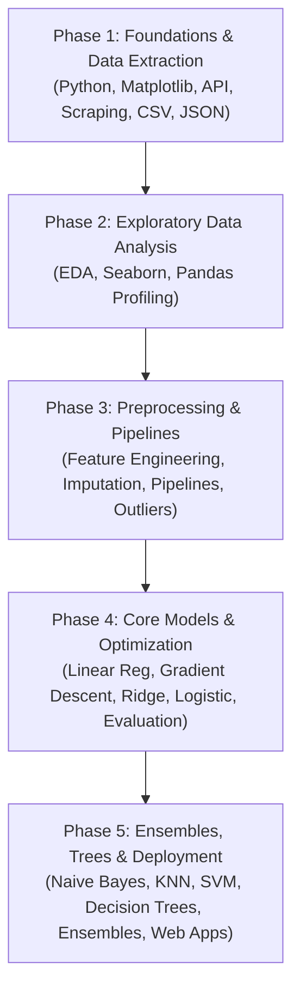

# 🚀 Machine Learning Journey: Zero to Hero

[](https://www.python.org/)
[](https://scikit-learn.org/)
[](https://pandas.pydata.org/)
[](https://numpy.org/)
[](https://flask.palletsprojects.com/)
[](https://streamlit.io/)

Welcome to the **Machine Learning Journey** repository! This is a complete, hands-on learning roadmap and code repository documenting the end-to-end path from fundamental Python programming to advanced Supervised Machine Learning algorithms, Feature Engineering pipelines, Optimization engines, Web Scraping, REST APIs, Model Deployments, and Visual Infographics.

> 💡 **Repository Goal**: Provide clear, beginner-friendly yet mathematically rigorous notebooks, production-grade pipelines, custom algorithms built from scratch, interactive dashboards, real-world datasets, and dedicated documentation (`README.md`) for every core topic in machine learning.

---

## 📌 Repository Navigator & Folder Modules

Explore each module below to access detailed hands-on notebooks, scripts, sample datasets, theoretical guides, and dedicated folder `README.md` files:

| # | Folder Module | Description & Focus Area | Key Concepts | Dedicated Guide |
| :-: | :--- | :--- | :--- | :-: |
| **01** | [`01_Python`](./01_Python) | Python Fundamentals for ML & Data Science | Variables, Primitive Types, Operators, Lists, Tuples | [📖 Overview](./01_Python/README.md) |
| **02** | [`02_Matplotlib`](./02_Matplotlib) | Data Visualization with Matplotlib | Pyplot syntax, Bar/Scatter/Pie charts, IPL Player Analytics | [📖 Overview](./02_Matplotlib/README.md) |
| **03** | [`03_API`](./03_API) | Data Extraction via REST APIs | `requests` library, HTTP status, JSON parsing, pagination | [📖 Overview](./03_API/README.md) |
| **04** | [`04_web scraping`](./04_web%20scraping) | Web Scraping & DOM Harvesting | HTML DOM, `BeautifulSoup`, Headers, AmbitionBox dataset | [📖 Overview](./04_web%20scraping/README.md) |
| **05** | [`05_CSV`](./05_CSV) | Tabular Data Handling with CSV Files | Base Python I/O, `pd.read_csv()`, encodings, `chunksize` | [📖 Overview](./05_CSV/README.md) |
| **06** | [`06_Json`](./06_Json) | Semi-Structured JSON Data Processing | `json` module, `pd.json_normalize()`, recipe classifications | [📖 Overview](./06_Json/README.md) |
| **07** | [`07_EDA`](./07_EDA) | Exploratory Data Analysis (EDA) | Univariate/Bivariate/Multivariate, Seaborn, Heatmaps | [📖 Overview](./07_EDA/README.md) |
| **08** | [`08_Pandas Profiling`](./08_Pandas%20Profiling) | Automated Data Profiling & Reporting | `ydata-profiling`, interactive HTML reports, alert metrics | [📖 Overview](./08_Pandas%20Profiling/README.md) |
| **09** | [`09_Feature Engineering`](./09_Feature%20Engineering) | Feature Transformation & Dimensionality Reduction | MinMaxScaler, StandardScaler, OHE, ColumnTransformer, PCA | [📖 Overview](./09_Feature%20Engineering/README.md) |
| **10** | [`10_Handling Missing Data`](./10_Handling%20Missing%20Data) | Missing Data Analysis & Imputation | MCAR/MAR/MNAR, CCA, Simple Imputer, KNNImputer, MICE | [📖 Overview](./10_Handling%20Missing%20Data/README.md) |
| **11** | [`11_Machine Learning Pipelines A_Z`](./11_Machine%20Learning%20Pipelines%20A_Z) | Scikit-Learn Pipelines & Serialization | `Pipeline`, `ColumnTransformer`, Data leakage, `.pkl` export | [📖 Overview](./11_Machine%20Learning%20Pipelines%20A_Z/README.md) |
| **12** | [`12_Outliers in Machine Learning`](./12_Outliers%20in%20Machine%20Learning) | Outlier Detection & Treatment | Trimming vs Capping, Z-Score, IQR rule, Percentile limits | [📖 Overview](./12_Outliers%20in%20Machine%20Learning/README.md) |
| **13** | [`13_Linear Regression`](./13_Linear%20Regression) | Regression Models & Web App Deployment | Simple/Multiple/Polynomial, OLS math, Flask App | [📖 Overview](./13_Linear%20Regression/README.md) |
| **14** | [`14_Gradient Descent`](./14_Gradient%20Descent) | Optimization Theory & Algorithms | Gradient math, Batch/SGD/Mini-Batch, 3D loss surface & GIFs | [📖 Overview](./14_Gradient%20Descent/README.md) |
| **15** | [`15_Bias Variance Trade-off`](./15_Bias%20Variance%20Trade-off) | Model Complexity & Generalization | Underfitting, Overfitting, Error Decomposition ($\text{Bias}^2 + \text{Var}$) | [📖 Overview](./15_Bias%20Variance%20Trade-off/README.md) |
| **16** | [`16_Ridge Regression`](./16_Ridge%20Regression) | L2 Regularization & Shrinkage | Ridge cost function, closed-form matrix math, GD penalty | [📖 Overview](./16_Ridge%20Regression/README.md) |
| **17** | [`17_Logistic Regression`](./17_Logistic%20Regression) | Classification & Probability Models | Perceptron, Sigmoid, Log Loss, Softmax, Streamlit Viz App | [📖 Overview](./17_Logistic%20Regression/README.md) |
| **18** | [`18_ Model Evaluation in Machine Learning`](./18_%20Model%20Evaluation%20in%20Machine%20Learning) | Model Evaluation & Performance Metrics | Confusion Matrix, Precision, Recall, F1, ROC-AUC, Micro/Macro | [📖 Overview](./18_%20Model%20Evaluation%20in%20Machine%20Learning/README.md) |
| **19** | [`19_Naive Bayes Classifier`](./19_Naive%20Bayes%20Classifier) | Probabilistic Classification | Bayes Theorem, Laplace Smoothing, Gaussian/Multinomial NB | [📖 Overview](./19_Naive%20Bayes%20Classifier/README.md) |
| **20** | [`20_K Nearest Neighbors`](./20_K%20Nearest%20Neighbors) | Distance-Based Lazy Learning | Spatial distance metrics, $K$ tuning, MLxtend Decision Surfaces | [📖 Overview](./20_K%20Nearest%20Neighbors/README.md) |
| **21** | [`21_Support Vector Machines`](./21_Support%20Vector%20Machines) | Maximum-Margin Hyperplanes & Kernels | Support vectors, Margin $C$, Polynomial & RBF Kernels ($\gamma$) | [📖 Overview](./21_Support%20Vector%20Machines/README.md) |
| **22** | [`22_Decision Tree`](./22_Decision%20Tree) | Tree-Based Learning & Visualization | Entropy, Gini, Pruning, Regression Trees, `dtreeviz` graphics | [📖 Overview](./22_Decision%20Tree/README.md) |
| **23** | [`23_Ensemble Techniques`](./23_Ensemble%20Techniques) | Ensembles & Gradient Boosting | Bagging, Random Forest, AdaBoost, GBDT, XGBoost, LightGBM | [📖 Overview](./23_Ensemble%20Techniques/README.md) |
| **24** | [`Machine Learning Cheat Sheet`](./Machine%20Learning%20Cheat%20Sheet) | Visual Infographics & Reference Charts | High-resolution cheat sheets for algorithms, math, & metrics | [📖 Overview](./Machine%20Learning%20Cheat%20Sheet/README.md) |

---

## 🗺️ Learning Roadmap Phases

The repository is structured into 5 cohesive learning phases designed to take you from core programming to production ML deployment:



### 🔹 Phase 1: Foundations & Data Harvesting (`01` – `06`)
- **Python Essentials**: Variables, primitive types, control flow, functions, lists, and tuples.
- **Data Visualization**: Matplotlib plotting syntax, chart customization, and cricket player analytics.
- **Data Gathering**: Scraping web HTML with BeautifulSoup, querying REST APIs, parsing JSON payloads, and parameterizing `pd.read_csv()`.

### 🔹 Phase 2: Exploratory Data Analysis (`07` – `08`)
- **Statistical Summaries**: Univariate distributions (histograms, box plots, KDEs), Bivariate feature interactions, and Multivariate correlation heatmaps.
- **Automated Profiling**: Generating automated HTML profiling reports using `ydata-profiling` to evaluate missingness, cardinality, and skewness alerts.

### 🔹 Phase 3: Feature Engineering & Preprocessing (`09` – `12`)
- **Feature Transformation**: MinMaxScaler, StandardScaler, One-Hot Encoding, Ordinal Encoding, Binning, Function/Power Transformations, and Principal Component Analysis (PCA).
- **Missing Data & Outliers**: Imputation (Simple Imputer, KNNImputer, MICE Iterative Imputer) and Outlier Treatment (Z-Score, IQR Rule, Percentile Capping).
- **Pipeline Architecture**: Packaging transformers and models inside Scikit-Learn `Pipeline` and `ColumnTransformer` to eliminate data leakage.

### 🔹 Phase 4: Core Machine Learning & Optimization (`13` – `18`)
- **Regression Analysis**: Simple & Multiple Linear Regression, Ordinary Least Squares (OLS) closed-form matrix solution, Polynomial Regression, and checking 5 Regression Assumptions.
- **Gradient Descent Engine**: Mathematical derivations ($\frac{\partial L}{\partial w}, \frac{\partial L}{\partial b}$), Batch GD vs Stochastic GD vs Mini-Batch GD, 3D cost surfaces, and animated contour GIFs.
- **Regularization & Generalization**: L2 Ridge Regression, Bias-Variance Trade-Off ($\text{Bias}^2 + \text{Variance} + \sigma^2$), Underfitting vs Overfitting diagnostics.
- **Classification & Metrics**: Perceptron trick, Sigmoid activation, Log Loss, Softmax Regression, Confusion Matrix, Precision, Recall, F1-Score, and ROC-AUC.

### 🔹 Phase 5: Non-Parametric Models, Ensembles & Deployment (`19` – `24`)
- **Supervised Algorithms**: Naive Bayes (Gaussian, Multinomial, Laplace Smoothing), KNN distance metrics, SVM maximum-margin hyperplanes (RBF/Polynomial Kernels), and Decision Trees (Gini, Information Gain, Pruning).
- **Ensemble Learning**: Bagging (Random Forest, OOB error), Boosting (AdaBoost, Gradient Boosting, XGBoost, LightGBM, CatBoost), and Stacking.
- **Production Web Apps**: Deploying trained models via Flask web apps (`app.py`) and building interactive Streamlit dashboards (`streamlit-viz-tool.py`).
- **Visual Cheat Sheets**: High-resolution infographic reference sheets for rapid revision.

---

## 📂 Repository File Tree

```text
Machine-Learning-Journey/
├── README.md
├── 01_Python/
│   ├── README.md
│   ├── 0_helloword.py
│   ├── 01_Variables.ipynb
│   ├── 02_Datatype.ipynb
│   ├── 03_Python Operators.ipynb
│   ├── 04_List.ipynb
│   └── 05_Tuple.ipynb
├── 02_Matplotlib/
│   ├── README.md
│   ├── Basic_matplotlib.ipynb
│   └── Matplotlib.ipynb
├── 03_API/
│   ├── README.md
│   └── API_Fatching.ipynb
├── 04_web scraping/
│   ├── README.md
│   ├── web Scraping.ipynb
│   └── ambitionbox_companies.csv
├── 05_CSV/
│   ├── README.md
│   └── working-with-csv.ipynb
├── 06_Json/
│   ├── README.md
│   ├── json.ipynb
│   └── train.json
├── 07_EDA/
│   ├── README.md
│   ├── Seaborn.ipynb
│   └── Univariate Analysis.ipynb
├── 08_Pandas Profiling/
│   ├── README.md
│   └── Pandas Profiling .ipynb
├── 09_Feature Engineering/
│   ├── README.md
│   ├── 01_Feature Scaling - Normalization/
│   ├── 02_Feature Scaling - Standardization/
│   ├── 03_Encoding/
│   ├── 04_Feature Transformtion/
│   └── 08_Curse of Dimensionality/
├── 10_Handling Missing Data/
│   ├── README.md
│   ├── 01_Remove Valus/
│   ├── 02_Simple Imputer/
│   ├── 03_KNN Imputer/
│   └── 04_Iterative Imputer/
├── 11_Machine Learning Pipelines A_Z/
│   ├── README.md
│   ├── pipe.pkl
│   ├── titanic-using-pipeline.ipynb
│   └── model/
├── 12_Outliers in Machine Learning/
│   ├── README.md
│   ├── Outlier Detection and Removal using the IQR Method/
│   └── Outlier Detection and Removal using Z-score Method/
├── 13_Linear Regression/
│   ├── README.md
│   ├── Simple Multiple Regression/
│   ├── Project/
│   │   └── salary-prediction/ (Flask Web App)
│   └── Regression metrics/
├── 14_Gradient Descent/
│   ├── README.md
│   ├── gradient-descent-3d.ipynb
│   └── Types of Gradient Descent/
├── 15_Bias Variance Trade-off/
│   ├── README.md
│   └── Bias_Variance_Tradeoff_ML_Notes.md
├── 16_Ridge Regression/
│   ├── README.md
│   └── ridge-regression-from-scratch.ipynb
├── 17_Logistic Regression/
│   ├── README.md
│   ├── Logistic Regression Hyperparameters/ (Streamlit App)
│   └── Softmax Regression/
├── 18_ Model Evaluation in Machine Learning/
│   ├── README.md
│   ├── classification-metrics-binary.ipynb
│   └── classification-metrics-multi-mnist1.ipynb
├── 19_Naive Bayes Classifier/
│   ├── README.md
│   └── Naive Bayes Classification using Algorithm — Play Tennis Dataset.ipynb
├── 20_K Nearest Neighbors/
│   ├── README.md
│   └── knn-on-breast-cancer-dataset.ipynb
├── 21_Support Vector Machines/
│   ├── README.md
│   └── Kernel Trick SVM.ipynb
├── 22_Decision Tree/
│   ├── README.md
│   ├── dtreeviz library/
│   └── Regression Tree/
├── 23_Ensemble Techniques/
│   ├── README.md
│   └── Ensemble_Techniques_in_Machine_Learning.md
└── Machine Learning Cheat Sheet/
    ├── README.md
    └── *.png (14 Infographic Cheat Sheets)
```

---

## 🌟 Featured Projects & Practical Applications

| Project / Application | Domain / Task | Technologies Used | Path / Location |
| :--- | :--- | :--- | :--- |
| **Salary Prediction Web Application** | Production Deployment | Python, Scikit-Learn, Flask, HTML/CSS | [`13_Linear Regression/Project/salary-prediction/`](./13_Linear%20Regression/Project/salary-prediction/) |
| **Interactive Logistic Hyperparameter Tool** | Model Tuning & Visualization | Python, Streamlit, Matplotlib | [`17_Logistic Regression/Logistic Regression Hyperparameters/`](./17_Logistic%20Regression/Logistic%20Regression%20Hyperparameters/) |
| **AmbitionBox Corporate Web Scraper** | Data Harvesting | Python, BeautifulSoup, Requests, Pandas | [`04_web scraping/web Scraping.ipynb`](./04_web%20scraping/web%20Scraping.ipynb) |
| **Medical Insurance Cost Prediction** | Predictive Modeling | Python, Pandas, Scikit-Learn, Ridge | [`13_Linear Regression/Project/`](./13_Linear%20Regression/Project/) |
| **Breast Cancer Medical Diagnosis** | Healthcare Classification | KNN, SVM, Decision Trees, MLxtend | [`20_K Nearest Neighbors/`](./20_K%20Nearest%20Neighbors/) |
| **Interactive Tree Visualizations** | Model Interpretability | `dtreeviz`, Decision Trees, Scikit-Learn | [`22_Decision Tree/dtreeviz library/`](./22_Decision%20Tree/dtreeviz%20library/) |
| **Gradient Descent From Scratch** | Optimization Engine | NumPy, Matplotlib 3D, Animated GIFs | [`14_Gradient Descent/`](./14_Gradient%20Descent/) |

---

## 💻 Quick Start & Setup Instructions

### 1. Clone the Repository
```bash
git clone https://github.com/swapnil3104/Machine-Learning-Journey.git
cd Machine-Learning-Journey
```

### 2. Create and Activate a Virtual Environment
```bash
# Windows
python -m venv venv
venv\Scripts\activate

# macOS / Linux
python3 -m venv venv
source venv/bin/activate
```

### 3. Install Dependencies
```bash
pip install numpy pandas matplotlib seaborn scikit-learn jupyter requests beautifulsoup4 flask streamlit dtreeviz ydata-profiling mlxtend
```

### 4. Run Notebooks or Applications

- **Open Jupyter Notebooks**:
  ```bash
  jupyter notebook
  ```

- **Run the Salary Prediction Flask App**:
  ```bash
  cd "13_Linear Regression/Project/salary-prediction"
  python app.py
  # Open http://127.0.0.1:5000 in your browser
  ```

- **Run the Interactive Streamlit Hyperparameter Tool**:
  ```bash
  cd "17_Logistic Regression/Logistic Regression Hyperparameters"
  streamlit run streamlit-viz-tool.py
  ```

---

## 🛠️ Core Technology Stack

- **Language**: Python 3.9+
- **Data Manipulation**: Pandas, NumPy
- **Data Visualization**: Matplotlib, Seaborn, `dtreeviz`, `mlxtend`
- **Machine Learning**: Scikit-Learn, XGBoost, LightGBM, CatBoost
- **Data Collection**: BeautifulSoup4, Requests
- **Automated Profiling**: `ydata-profiling` / Pandas Profiling
- **Web Frameworks**: Flask, Streamlit
- **Development Environment**: Jupyter Notebook, VS Code

---

## ⭐ Contributions & Support

If you find this repository helpful for your learning or reference, feel free to give it a **⭐ Star** on GitHub!

For feedback, questions, or suggestions, open an issue or connect on GitHub.

Happy Learning! 🚀
